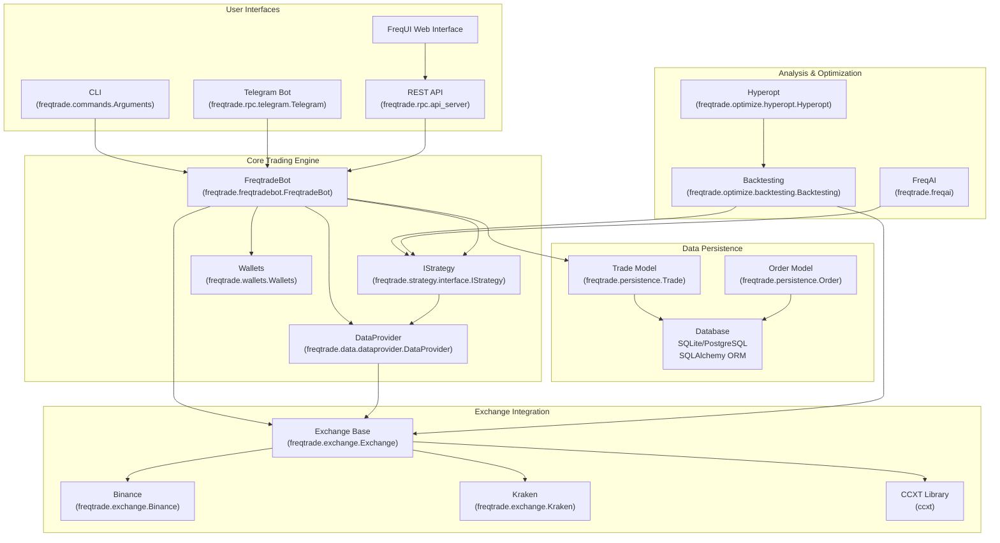
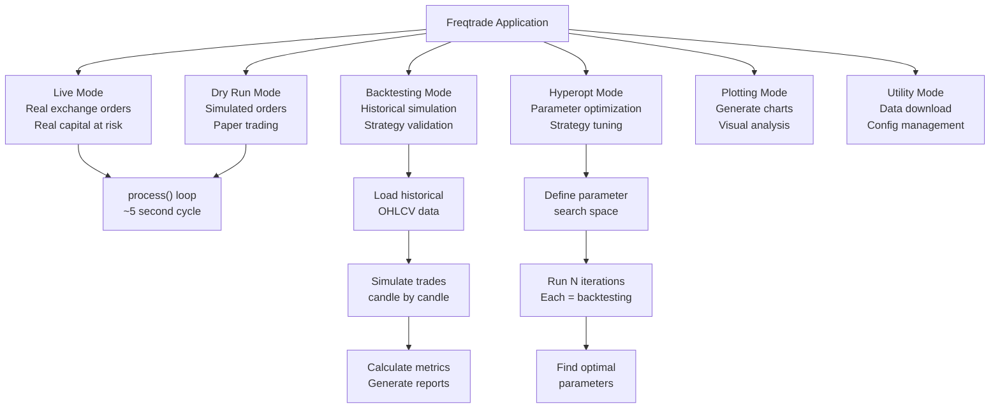

# Overview

Relevant source files

* [docs/bot-basics.md](https://github.com/freqtrade/freqtrade/blob/8e91fea1/docs/bot-basics.md)
* [docs/includes/pricing.md](https://github.com/freqtrade/freqtrade/blob/8e91fea1/docs/includes/pricing.md)
* [docs/requirements-docs.txt](https://github.com/freqtrade/freqtrade/blob/8e91fea1/docs/requirements-docs.txt)
* [docs/strategy-advanced.md](https://github.com/freqtrade/freqtrade/blob/8e91fea1/docs/strategy-advanced.md)
* [docs/strategy-callbacks.md](https://github.com/freqtrade/freqtrade/blob/8e91fea1/docs/strategy-callbacks.md)
* [docs/strategy-customization.md](https://github.com/freqtrade/freqtrade/blob/8e91fea1/docs/strategy-customization.md)
* [docs/strategy\_migration.md](https://github.com/freqtrade/freqtrade/blob/8e91fea1/docs/strategy_migration.md)
* [freqtrade/enums/exittype.py](https://github.com/freqtrade/freqtrade/blob/8e91fea1/freqtrade/enums/exittype.py)
* [freqtrade/exchange/binance.py](https://github.com/freqtrade/freqtrade/blob/8e91fea1/freqtrade/exchange/binance.py)
* [freqtrade/exchange/exchange.py](https://github.com/freqtrade/freqtrade/blob/8e91fea1/freqtrade/exchange/exchange.py)
* [freqtrade/exchange/kraken.py](https://github.com/freqtrade/freqtrade/blob/8e91fea1/freqtrade/exchange/kraken.py)
* [freqtrade/freqtradebot.py](https://github.com/freqtrade/freqtrade/blob/8e91fea1/freqtrade/freqtradebot.py)
* [freqtrade/strategy/\_\_init\_\_.py](https://github.com/freqtrade/freqtrade/blob/8e91fea1/freqtrade/strategy/__init__.py)
* [freqtrade/strategy/informative\_decorator.py](https://github.com/freqtrade/freqtrade/blob/8e91fea1/freqtrade/strategy/informative_decorator.py)
* [freqtrade/strategy/interface.py](https://github.com/freqtrade/freqtrade/blob/8e91fea1/freqtrade/strategy/interface.py)
* [freqtrade/strategy/strategy\_helper.py](https://github.com/freqtrade/freqtrade/blob/8e91fea1/freqtrade/strategy/strategy_helper.py)
* [freqtrade/templates/strategy\_subtemplates/strategy\_methods\_advanced.j2](https://github.com/freqtrade/freqtrade/blob/8e91fea1/freqtrade/templates/strategy_subtemplates/strategy_methods_advanced.j2)
* [ft\_client/requirements.txt](https://github.com/freqtrade/freqtrade/blob/8e91fea1/ft_client/requirements.txt)
* [requirements-freqai.txt](https://github.com/freqtrade/freqtrade/blob/8e91fea1/requirements-freqai.txt)
* [requirements-hyperopt.txt](https://github.com/freqtrade/freqtrade/blob/8e91fea1/requirements-hyperopt.txt)
* [requirements.txt](https://github.com/freqtrade/freqtrade/blob/8e91fea1/requirements.txt)
* [tests/conftest.py](https://github.com/freqtrade/freqtrade/blob/8e91fea1/tests/conftest.py)
* [tests/exchange/test\_binance.py](https://github.com/freqtrade/freqtrade/blob/8e91fea1/tests/exchange/test_binance.py)
* [tests/exchange/test\_exchange.py](https://github.com/freqtrade/freqtrade/blob/8e91fea1/tests/exchange/test_exchange.py)
* [tests/exchange/test\_kraken.py](https://github.com/freqtrade/freqtrade/blob/8e91fea1/tests/exchange/test_kraken.py)
* [tests/strategy/strats/informative\_decorator\_strategy.py](https://github.com/freqtrade/freqtrade/blob/8e91fea1/tests/strategy/strats/informative_decorator_strategy.py)
* [tests/strategy/test\_strategy\_helpers.py](https://github.com/freqtrade/freqtrade/blob/8e91fea1/tests/strategy/test_strategy_helpers.py)

## Purpose

This document provides a high-level introduction to Freqtrade, a free and open-source cryptocurrency trading bot written in Python. It explains the system's purpose, core capabilities, architecture, and operational modes. This overview serves as an entry point for understanding the entire codebase.

For detailed information on specific subsystems:

* Architecture details: [Architecture Overview](/freqtrade/freqtrade/1.1-architecture-overview)
* Core trading system: [Core Trading System](/freqtrade/freqtrade/2-core-trading-system)
* Strategy development: [Strategy Interface and Development](/freqtrade/freqtrade/2.3-strategy-interface-and-development)
* Testing and optimization: [Testing and Optimization](/freqtrade/freqtrade/3-testing-and-optimization)
* User interfaces: [User Interfaces and Control](/freqtrade/freqtrade/4-user-interfaces-and-control)
* Advanced features like FreqAI: [Advanced Features](/freqtrade/freqtrade/5-advanced-features)

## What is Freqtrade?

Freqtrade is a cryptocurrency algorithmic trading bot that supports:

* **Automated trading** on 20+ cryptocurrency exchanges (spot and futures markets)
* **Strategy backtesting** on historical market data
* **Hyperparameter optimization** to tune strategy parameters
* **Machine learning** integration via FreqAI for predictive modeling
* **Multiple control interfaces** including CLI, Telegram, REST API, and web UI

The bot executes user-defined trading strategies by continuously analyzing market data, generating entry/exit signals, and placing orders on connected exchanges. It supports both long and short positions, leverage trading, and advanced features like position adjustments and custom exit logic.

Sources: [freqtrade/freqtradebot.py1-100](https://github.com/freqtrade/freqtrade/blob/8e91fea1/freqtrade/freqtradebot.py#L1-L100) [docs/bot-basics.md1-37](https://github.com/freqtrade/freqtrade/blob/8e91fea1/docs/bot-basics.md#L1-L37)

## Key Capabilities

| Capability | Description |
| --- | --- |
| **Live Trading** | Execute strategies in real-time on connected exchanges with full order management |
| **Dry Run** | Paper trading mode simulating order execution without risking capital |
| **Backtesting** | Test strategies on historical data with accurate simulation of order fills and fees |
| **Hyperoptimization** | Automated parameter tuning using Optuna to find optimal strategy configurations |
| **FreqAI** | Machine learning integration for prediction-based trading strategies |
| **Multi-Exchange** | Support for 20+ exchanges via CCXT library including Binance, Kraken, Bybit, etc. |
| **Spot & Futures** | Trade both spot markets and leveraged futures/margin positions |
| **Position Management** | DCA (Dollar Cost Averaging), partial exits, trailing stoploss, custom exit logic |

Sources: [requirements.txt1-63](https://github.com/freqtrade/freqtrade/blob/8e91fea1/requirements.txt#L1-L63) [freqtrade/freqtradebot.py73-176](https://github.com/freqtrade/freqtrade/blob/8e91fea1/freqtrade/freqtradebot.py#L73-L176) [docs/strategy-callbacks.md1-27](https://github.com/freqtrade/freqtrade/blob/8e91fea1/docs/strategy-callbacks.md#L1-L27)

## System Architecture

### High-Level Component Diagram



Sources: [freqtrade/freqtradebot.py73-176](https://github.com/freqtrade/freqtrade/blob/8e91fea1/freqtrade/freqtradebot.py#L73-L176) [freqtrade/exchange/exchange.py119-304](https://github.com/freqtrade/freqtrade/blob/8e91fea1/freqtrade/exchange/exchange.py#L119-L304) [freqtrade/strategy/interface.py51-157](https://github.com/freqtrade/freqtrade/blob/8e91fea1/freqtrade/strategy/interface.py#L51-L157)

### Core Components

#### FreqtradeBot (Main Orchestrator)

The `FreqtradeBot` class [freqtrade/freqtradebot.py73-302](https://github.com/freqtrade/freqtrade/blob/8e91fea1/freqtrade/freqtradebot.py#L73-L302) is the central orchestrator that coordinates all subsystems. It implements the main trading loop (`process()` method) which runs approximately every 5 seconds in live/dry-run mode.

**Key Responsibilities:**

* Initialize and coordinate all subsystems (exchange, strategy, persistence, RPC)
* Execute the main process loop: refresh data → analyze signals → manage positions → execute orders
* Handle trade lifecycle from entry to exit
* Manage open orders, timeouts, and cancellations
* Update funding fees and liquidation prices for futures trading

#### IStrategy (User Trading Logic)

The `IStrategy` abstract class [freqtrade/strategy/interface.py51-273](https://github.com/freqtrade/freqtrade/blob/8e91fea1/freqtrade/strategy/interface.py#L51-L273) defines the interface for user-defined trading strategies. Users implement three mandatory methods:

* `populate_indicators()`: Calculate technical indicators
* `populate_entry_trend()`: Generate entry signals
* `populate_exit_trend()`: Generate exit signals

And numerous optional callbacks for advanced control:

* `custom_stoploss()`, `custom_roi()`, `custom_exit()`
* `confirm_trade_entry()`, `confirm_trade_exit()`
* `adjust_trade_position()` for position adjustments/DCA

#### Exchange Layer

The `Exchange` base class [freqtrade/exchange/exchange.py119-465](https://github.com/freqtrade/freqtrade/blob/8e91fea1/freqtrade/exchange/exchange.py#L119-L465) provides a unified interface to cryptocurrency exchanges via the CCXT library. Exchange-specific subclasses like `Binance` [freqtrade/exchange/binance.py30-148](https://github.com/freqtrade/freqtrade/blob/8e91fea1/freqtrade/exchange/binance.py#L30-L148) and `Kraken` [freqtrade/exchange/kraken.py21-127](https://github.com/freqtrade/freqtrade/blob/8e91fea1/freqtrade/exchange/kraken.py#L21-L127) implement exchange-specific behaviors.

**Capabilities:**

* Market data fetching (OHLCV candles, tickers, orderbook)
* Order execution (market, limit, stop-loss orders)
* Balance management and position tracking
* Websocket support for real-time data (selected exchanges)

#### DataProvider

The `DataProvider` class centralizes access to market data and provides it to strategies in a consistent format. It implements caching and handles data refresh cycles.

#### Persistence Layer

The persistence layer uses SQLAlchemy ORM with two main models:

* `Trade` [freqtrade/persistence](https://github.com/freqtrade/freqtrade/blob/8e91fea1/freqtrade/persistence#LNaN-LNaN) - represents open or closed positions
* `Order` [freqtrade/persistence](https://github.com/freqtrade/freqtrade/blob/8e91fea1/freqtrade/persistence#LNaN-LNaN) - represents individual orders within trades

Supports both SQLite (default) and PostgreSQL for production deployments.

Sources: [freqtrade/freqtradebot.py73-302](https://github.com/freqtrade/freqtrade/blob/8e91fea1/freqtrade/freqtradebot.py#L73-L302) [freqtrade/strategy/interface.py51-273](https://github.com/freqtrade/freqtrade/blob/8e91fea1/freqtrade/strategy/interface.py#L51-L273) [freqtrade/exchange/exchange.py119-465](https://github.com/freqtrade/freqtrade/blob/8e91fea1/freqtrade/exchange/exchange.py#L119-L465) [freqtrade/exchange/binance.py30-148](https://github.com/freqtrade/freqtrade/blob/8e91fea1/freqtrade/exchange/binance.py#L30-L148) [freqtrade/exchange/kraken.py21-127](https://github.com/freqtrade/freqtrade/blob/8e91fea1/freqtrade/exchange/kraken.py#L21-L127)

## Operational Modes

### Mode Overview



Sources: [freqtrade/freqtradebot.py247-302](https://github.com/freqtrade/freqtrade/blob/8e91fea1/freqtrade/freqtradebot.py#L247-L302)

### Live and Dry Run Modes

Both modes use the same `FreqtradeBot` class and share identical code paths. The only difference is that dry-run simulates order execution locally instead of sending orders to the exchange.

**Process Loop** [freqtrade/freqtradebot.py247-302](https://github.com/freqtrade/freqtrade/blob/8e91fea1/freqtrade/freqtradebot.py#L247-L302):

1. Reload markets if needed
2. Refresh OHLCV data from exchange
3. Run `strategy.analyze()` to populate indicators and signals
4. Manage open orders (timeouts, replacements)
5. Evaluate exit conditions for open trades
6. Adjust positions if `position_adjustment_enable=True`
7. Enter new positions if signals detected
8. Process RPC message queue for notifications

### Backtesting Mode

The `Backtesting` class [freqtrade/optimize/backtesting.py](https://github.com/freqtrade/freqtrade/blob/8e91fea1/freqtrade/optimize/backtesting.py) simulates trading on historical data. Key features:

* Loads historical OHLCV data from local storage or exchange
* Uses `LocalTrade` instead of `Trade` to avoid database operations
* Simulates order fills based on candle data (high/low prices)
* Calculates realistic fees based on exchange fee structure
* Generates detailed performance metrics and plots

**Critical Difference:** In backtesting, the entire dataframe is passed to `populate_*()` methods at once, while in live trading, only the latest candles are analyzed incrementally. This requires careful strategy design to avoid lookahead bias.

Sources: [docs/strategy-customization.md91-101](https://github.com/freqtrade/freqtrade/blob/8e91fea1/docs/strategy-customization.md#L91-L101)

### Hyperoptimization Mode

The `Hyperopt` class wraps the backtesting engine and uses the Optuna library [requirements-hyperopt.txt8](https://github.com/freqtrade/freqtrade/blob/8e91fea1/requirements-hyperopt.txt#L8-L8) to find optimal strategy parameters. It:

* Defines parameter spaces (buy/sell/ROI/stoploss) via `HyperStrategyMixin`
* Runs thousands of backtesting iterations with different parameter combinations
* Evaluates each iteration using a loss function (Sharpe, Sortino, etc.)
* Reports the best performing parameter set

Sources: [requirements-hyperopt.txt1-10](https://github.com/freqtrade/freqtrade/blob/8e91fea1/requirements-hyperopt.txt#L1-L10) [docs/strategy-customization.md1-10](https://github.com/freqtrade/freqtrade/blob/8e91fea1/docs/strategy-customization.md#L1-L10)

## Technology Stack

### Core Dependencies

Sources: [requirements.txt1-63](https://github.com/freqtrade/freqtrade/blob/8e91fea1/requirements.txt#L1-L63) [requirements-hyperopt.txt1-10](https://github.com/freqtrade/freqtrade/blob/8e91fea1/requirements-hyperopt.txt#L1-L10) [requirements-freqai.txt1-12](https://github.com/freqtrade/freqtrade/blob/8e91fea1/requirements-freqai.txt#L1-L12)

### Modular Dependency Structure

Freqtrade uses a modular dependency approach:

* **Core requirements** [requirements.txt1-63](https://github.com/freqtrade/freqtrade/blob/8e91fea1/requirements.txt#L1-L63): Minimal dependencies for basic trading operations
* **Hyperopt requirements** [requirements-hyperopt.txt1-10](https://github.com/freqtrade/freqtrade/blob/8e91fea1/requirements-hyperopt.txt#L1-L10): Additional dependencies for optimization (scipy, optuna, scikit-learn)
* **FreqAI requirements** [requirements-freqai.txt1-12](https://github.com/freqtrade/freqtrade/blob/8e91fea1/requirements-freqai.txt#L1-L12): ML libraries for predictive modeling (LightGBM, XGBoost, TensorBoard)
* **Plotting requirements**: Visualization libraries (not shown, separate file)
* **Development requirements**: Testing and code quality tools (not shown, separate file)

This allows users to install only what they need, reducing the installation footprint.

Sources: [requirements.txt1-63](https://github.com/freqtrade/freqtrade/blob/8e91fea1/requirements.txt#L1-L63) [requirements-hyperopt.txt1-10](https://github.com/freqtrade/freqtrade/blob/8e91fea1/requirements-hyperopt.txt#L1-L10) [requirements-freqai.txt1-12](https://github.com/freqtrade/freqtrade/blob/8e91fea1/requirements-freqai.txt#L1-L12)

## Data Flow

### Live Trading Data Flow

```mermaid
sequenceDiagram
  participant Exchange API
  participant (via CCXT)
  participant DataProvider
  participant FreqtradeBot.process()
  participant IStrategy
  participant Database
  participant (Trade/Order)
  participant RPC Handlers

  loop [Exit condition met]
    FreqtradeBot.process()->>DataProvider: refresh() market data
    DataProvider->>Exchange API: fetch_ohlcv() for all pairs
    Exchange API-->>DataProvider: OHLCV candles
    FreqtradeBot.process()->>IStrategy: analyze(whitelist)
    IStrategy->>DataProvider: get_analyzed_dataframe()
    IStrategy->>IStrategy: populate_indicators()
    IStrategy->>IStrategy: populate_entry_trend()
    IStrategy->>IStrategy: populate_exit_trend()
    IStrategy-->>FreqtradeBot.process(): Analyzed dataframes
    FreqtradeBot.process()->>FreqtradeBot.process(): exit_positions(trades)
    FreqtradeBot.process()->>IStrategy: custom_stoploss()
    FreqtradeBot.process()->>IStrategy: custom_exit()
    FreqtradeBot.process()->>Exchange API: create_order(exit)
    FreqtradeBot.process()->>Database: Update trade status
    FreqtradeBot.process()->>RPC Handlers: Send exit notification
    FreqtradeBot.process()->>FreqtradeBot.process(): enter_positions()
    FreqtradeBot.process()->>IStrategy: confirm_trade_entry()
    FreqtradeBot.process()->>Exchange API: create_order(entry)
    FreqtradeBot.process()->>Database: Create trade record
    FreqtradeBot.process()->>RPC Handlers: Send entry notification
  end
```

Sources: [freqtrade/freqtradebot.py247-302](https://github.com/freqtrade/freqtrade/blob/8e91fea1/freqtrade/freqtradebot.py#L247-L302) [freqtrade/strategy/interface.py227-273](https://github.com/freqtrade/freqtrade/blob/8e91fea1/freqtrade/strategy/interface.py#L227-L273)

### Strategy Execution Flow

The strategy execution follows a strict sequence to ensure consistency:

1. **Data Refresh**: `DataProvider.refresh()` fetches latest OHLCV data from exchange
2. **Indicator Calculation**: `Strategy.populate_indicators()` adds technical indicators to dataframe
3. **Signal Generation**: `populate_entry_trend()` and `populate_exit_trend()` generate trading signals
4. **Exit Evaluation**: For each open trade, evaluate exit conditions (stoploss, ROI, custom exit)
5. **Entry Evaluation**: For pairs with entry signals, check confirmations and execute entries
6. **Order Management**: Update order states, handle timeouts, manage stoploss on exchange

**Key Principle**: All operations use the same OHLCV data snapshot within a single iteration to ensure consistency. The next iteration fetches fresh data.

Sources: [freqtrade/freqtradebot.py247-302](https://github.com/freqtrade/freqtrade/blob/8e91fea1/freqtrade/freqtradebot.py#L247-L302) [docs/bot-basics.md37-70](https://github.com/freqtrade/freqtrade/blob/8e91fea1/docs/bot-basics.md#L37-L70)

## Configuration System

Freqtrade uses a hierarchical configuration system with multiple override levels:

1. **Configuration Files** (`config.json`) - Base configuration
2. **Environment Variables** - Override config file values
3. **CLI Arguments** - Override both config and environment

Configuration precedence: **CLI > Environment > Config File**

The configuration structure includes:

* Exchange settings (API keys, exchange name, trading mode)
* Strategy settings (timeframe, stake amount, max open trades)
* Entry/exit pricing rules
* Order types and time-in-force settings
* RPC settings (Telegram, API server)
* Backtesting/hyperopt parameters

Sources: [docs/bot-basics.md1-18](https://github.com/freqtrade/freqtrade/blob/8e91fea1/docs/bot-basics.md#L1-L18)

## Getting Started

To begin using Freqtrade:

1. **Installation**: See [Installation and Setup](/freqtrade/freqtrade/1.2-installation-and-setup) for detailed installation instructions
2. **Configuration**: Create a configuration file - see [Configuration System](/freqtrade/freqtrade/1.4-configuration-system)
3. **Strategy Development**: Write a strategy - see [Strategy Interface and Development](/freqtrade/freqtrade/2.3-strategy-interface-and-development)
4. **Backtesting**: Test the strategy on historical data - see [Backtesting System](/freqtrade/freqtrade/3.1-backtesting-system)
5. **Dry Run**: Run paper trading to validate - see operational modes above
6. **Live Trading**: Deploy to live trading when confident

For detailed information on each step, refer to the respective sections of this wiki.

Sources: [docs/bot-basics.md1-70](https://github.com/freqtrade/freqtrade/blob/8e91fea1/docs/bot-basics.md#L1-L70) [docs/strategy-customization.md1-90](https://github.com/freqtrade/freqtrade/blob/8e91fea1/docs/strategy-customization.md#L1-L90)