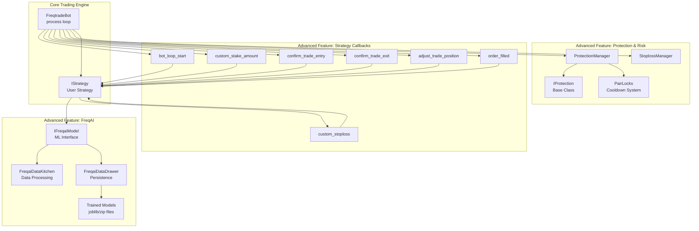
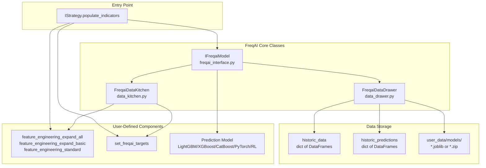
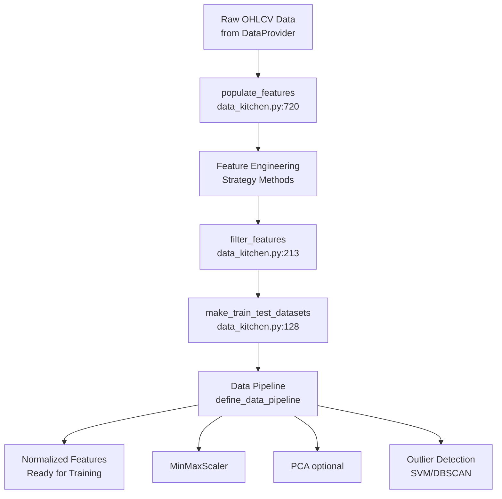
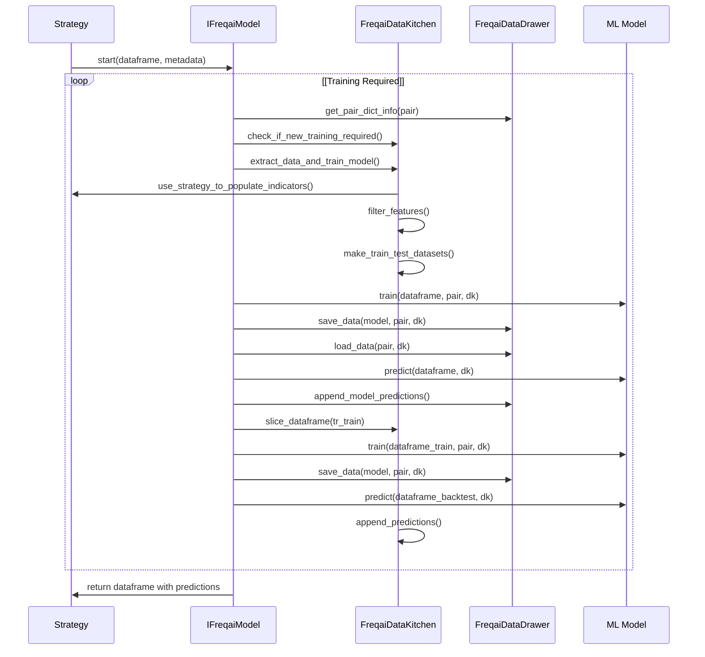
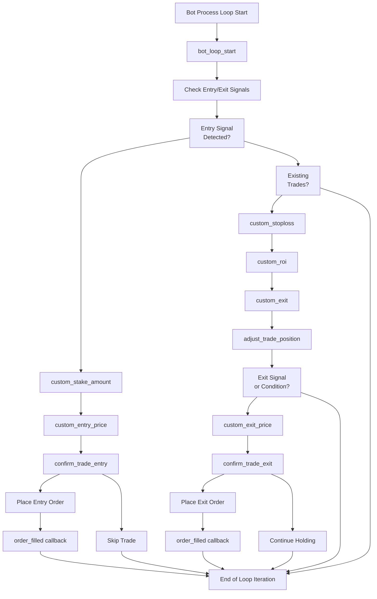
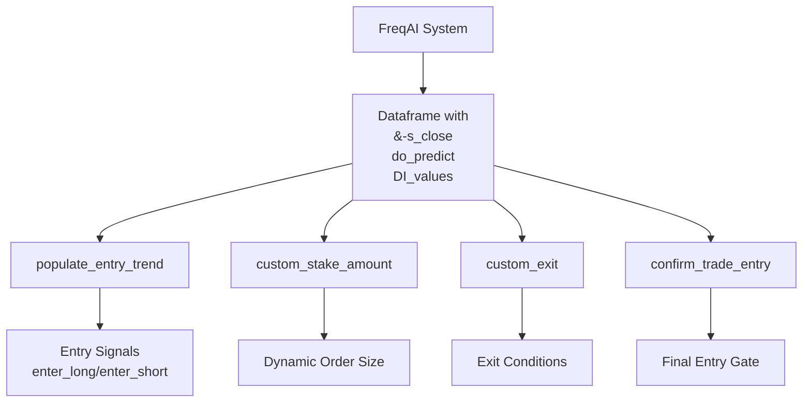
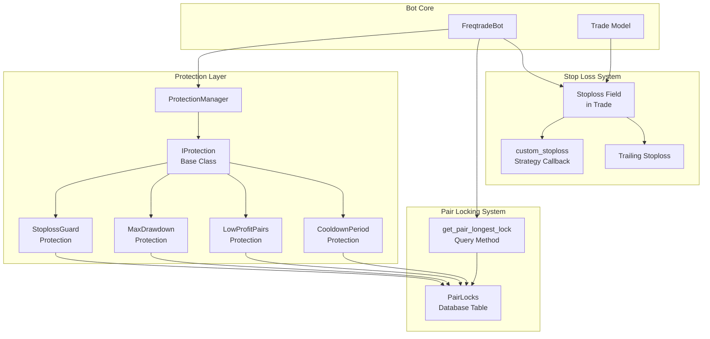
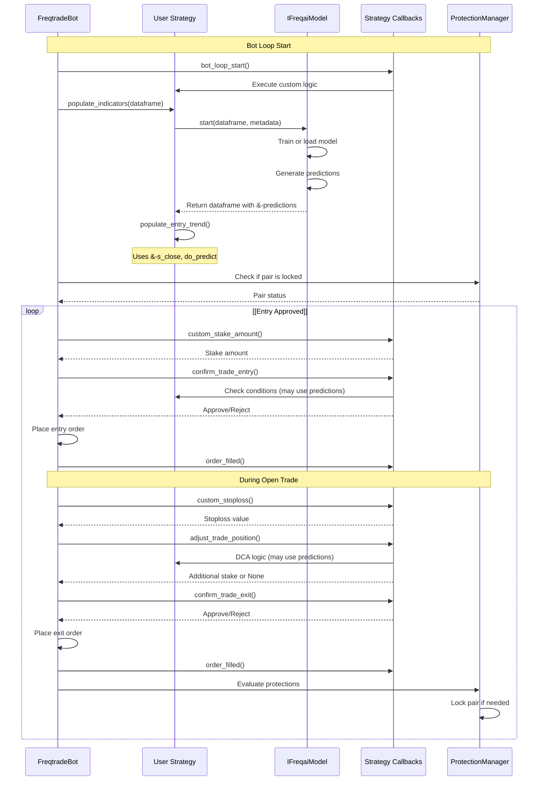

# Advanced Features

Relevant source files

* [config\_examples/config\_freqai.example.json](https://github.com/freqtrade/freqtrade/blob/8e91fea1/config_examples/config_freqai.example.json)
* [docs/bot-basics.md](https://github.com/freqtrade/freqtrade/blob/8e91fea1/docs/bot-basics.md)
* [docs/freqai.md](https://github.com/freqtrade/freqtrade/blob/8e91fea1/docs/freqai.md)
* [docs/strategy-advanced.md](https://github.com/freqtrade/freqtrade/blob/8e91fea1/docs/strategy-advanced.md)
* [docs/strategy-callbacks.md](https://github.com/freqtrade/freqtrade/blob/8e91fea1/docs/strategy-callbacks.md)
* [docs/strategy-customization.md](https://github.com/freqtrade/freqtrade/blob/8e91fea1/docs/strategy-customization.md)
* [docs/strategy\_migration.md](https://github.com/freqtrade/freqtrade/blob/8e91fea1/docs/strategy_migration.md)
* [freqtrade/enums/exittype.py](https://github.com/freqtrade/freqtrade/blob/8e91fea1/freqtrade/enums/exittype.py)
* [freqtrade/freqai/data\_drawer.py](https://github.com/freqtrade/freqtrade/blob/8e91fea1/freqtrade/freqai/data_drawer.py)
* [freqtrade/freqai/data\_kitchen.py](https://github.com/freqtrade/freqtrade/blob/8e91fea1/freqtrade/freqai/data_kitchen.py)
* [freqtrade/freqai/freqai\_interface.py](https://github.com/freqtrade/freqtrade/blob/8e91fea1/freqtrade/freqai/freqai_interface.py)
* [freqtrade/freqai/utils.py](https://github.com/freqtrade/freqtrade/blob/8e91fea1/freqtrade/freqai/utils.py)
* [freqtrade/strategy/\_\_init\_\_.py](https://github.com/freqtrade/freqtrade/blob/8e91fea1/freqtrade/strategy/__init__.py)
* [freqtrade/strategy/informative\_decorator.py](https://github.com/freqtrade/freqtrade/blob/8e91fea1/freqtrade/strategy/informative_decorator.py)
* [freqtrade/strategy/interface.py](https://github.com/freqtrade/freqtrade/blob/8e91fea1/freqtrade/strategy/interface.py)
* [freqtrade/strategy/strategy\_helper.py](https://github.com/freqtrade/freqtrade/blob/8e91fea1/freqtrade/strategy/strategy_helper.py)
* [freqtrade/templates/FreqaiExampleStrategy.py](https://github.com/freqtrade/freqtrade/blob/8e91fea1/freqtrade/templates/FreqaiExampleStrategy.py)
* [freqtrade/templates/strategy\_subtemplates/strategy\_methods\_advanced.j2](https://github.com/freqtrade/freqtrade/blob/8e91fea1/freqtrade/templates/strategy_subtemplates/strategy_methods_advanced.j2)
* [tests/freqai/conftest.py](https://github.com/freqtrade/freqtrade/blob/8e91fea1/tests/freqai/conftest.py)
* [tests/freqai/test\_freqai\_backtesting.py](https://github.com/freqtrade/freqtrade/blob/8e91fea1/tests/freqai/test_freqai_backtesting.py)
* [tests/freqai/test\_freqai\_datadrawer.py](https://github.com/freqtrade/freqtrade/blob/8e91fea1/tests/freqai/test_freqai_datadrawer.py)
* [tests/freqai/test\_freqai\_datakitchen.py](https://github.com/freqtrade/freqtrade/blob/8e91fea1/tests/freqai/test_freqai_datakitchen.py)
* [tests/freqai/test\_freqai\_interface.py](https://github.com/freqtrade/freqtrade/blob/8e91fea1/tests/freqai/test_freqai_interface.py)
* [tests/strategy/strats/informative\_decorator\_strategy.py](https://github.com/freqtrade/freqtrade/blob/8e91fea1/tests/strategy/strats/informative_decorator_strategy.py)
* [tests/strategy/test\_strategy\_helpers.py](https://github.com/freqtrade/freqtrade/blob/8e91fea1/tests/strategy/test_strategy_helpers.py)

## Purpose and Scope

This section documents Freqtrade's advanced capabilities that extend beyond basic strategy execution and order management. These features enable sophisticated trading approaches including machine learning predictions, fine-grained control over trade execution through callbacks, and comprehensive risk management systems.

The three primary advanced feature categories are:

1. **FreqAI Machine Learning System** - Automated model training and prediction framework (see [5.1](/freqtrade/freqtrade/5.1-freqai-machine-learning-system))
2. **Strategy Callbacks and Customization** - Lifecycle hooks for custom trading logic (see [5.2](/freqtrade/freqtrade/5.2-strategy-callbacks-and-customization))
3. **Protection and Risk Management** - Systems to prevent losses and manage risk (see [5.3](/freqtrade/freqtrade/5.3-position-adjustment-and-dca))

For information about basic strategy development, see [2.3](/freqtrade/freqtrade/2.3-strategy-interface-and-development). For backtesting and optimization, see [3](/freqtrade/freqtrade/3-testing-and-optimization).

---

## Advanced Features Architecture

The following diagram illustrates how the three advanced feature systems integrate with Freqtrade's core trading engine:



**Sources:** [freqtrade/freqai/freqai\_interface.py36-58](https://github.com/freqtrade/freqtrade/blob/8e91fea1/freqtrade/freqai/freqai_interface.py#L36-L58) [freqtrade/templates/FreqaiExampleStrategy.py14-26](https://github.com/freqtrade/freqtrade/blob/8e91fea1/freqtrade/templates/FreqaiExampleStrategy.py#L14-L26) [freqtrade/freqtradebot.py](https://github.com/freqtrade/freqtrade/blob/8e91fea1/freqtrade/freqtradebot.py) (referenced in architecture diagrams)

---

## FreqAI Machine Learning System Overview

FreqAI provides an automated machine learning framework that integrates seamlessly with Freqtrade strategies. The system handles the complete ML lifecycle: data collection, feature engineering, model training, prediction generation, and continuous retraining.

### Core Components



**Sources:** [freqtrade/freqai/freqai\_interface.py36-119](https://github.com/freqtrade/freqtrade/blob/8e91fea1/freqtrade/freqai/freqai_interface.py#L36-L119) [freqtrade/freqai/data\_kitchen.py35-110](https://github.com/freqtrade/freqtrade/blob/8e91fea1/freqtrade/freqai/data_kitchen.py#L35-L110) [freqtrade/freqai/data\_drawer.py46-106](https://github.com/freqtrade/freqtrade/blob/8e91fea1/freqtrade/freqai/data_drawer.py#L46-L106)

### Key Classes and Their Roles

| Class | File | Purpose |
| --- | --- | --- |
| `IFreqaiModel` | [freqai\_interface.py36](https://github.com/freqtrade/freqtrade/blob/8e91fea1/freqai_interface.py#L36-L36) | Abstract base class defining the ML training/prediction interface |
| `FreqaiDataKitchen` | [data\_kitchen.py35](https://github.com/freqtrade/freqtrade/blob/8e91fea1/data_kitchen.py#L35-L35) | Non-persistent data processor for feature engineering and training data preparation |
| `FreqaiDataDrawer` | [data\_drawer.py46](https://github.com/freqtrade/freqtrade/blob/8e91fea1/data_drawer.py#L46-L46) | Persistent storage manager for models, predictions, and metadata |

The `IFreqaiModel` class serves as the main orchestrator. When a strategy calls `self.freqai.start()` in `populate_indicators`, the following occurs:

1. **Live Mode**: Checks if retraining is needed, loads existing model, generates predictions
2. **Backtest Mode**: Iterates through training windows, trains models, generates predictions for each window

**Sources:** [freqtrade/freqai/freqai\_interface.py130-172](https://github.com/freqtrade/freqtrade/blob/8e91fea1/freqtrade/freqai/freqai_interface.py#L130-L172)

### Data Processing Pipeline

FreqAI uses a sophisticated data pipeline managed by `FreqaiDataKitchen`:



**Sources:** [freqtrade/freqai/data\_kitchen.py213-299](https://github.com/freqtrade/freqtrade/blob/8e91fea1/freqtrade/freqai/data_kitchen.py#L213-L299) [freqtrade/freqai/data\_kitchen.py720-791](https://github.com/freqtrade/freqtrade/blob/8e91fea1/freqtrade/freqai/data_kitchen.py#L720-L791) [freqtrade/freqai/freqai\_interface.py528-561](https://github.com/freqtrade/freqtrade/blob/8e91fea1/freqtrade/freqai/freqai_interface.py#L528-L561)

The `define_data_pipeline` method in `IFreqaiModel` creates a `datasieve.Pipeline` that applies transformations sequentially. Common transformations include:

* **MinMaxScaler**: Normalizes features to [-1, 1] range
* **PCA**: Optional dimensionality reduction
* **SVM/DBSCAN**: Outlier detection and removal
* **DissimilarityIndex**: Measures how similar new data is to training data

**Sources:** [freqtrade/freqai/freqai\_interface.py528-556](https://github.com/freqtrade/freqtrade/blob/8e91fea1/freqtrade/freqai/freqai_interface.py#L528-L556)

### Model Training and Prediction Lifecycle



**Sources:** [freqtrade/freqai/freqai\_interface.py130-172](https://github.com/freqtrade/freqtrade/blob/8e91fea1/freqtrade/freqai/freqai_interface.py#L130-L172) [freqtrade/freqai/freqai\_interface.py269-400](https://github.com/freqtrade/freqtrade/blob/8e91fea1/freqtrade/freqai/freqai_interface.py#L269-L400) [freqtrade/freqai/freqai\_interface.py402-469](https://github.com/freqtrade/freqtrade/blob/8e91fea1/freqtrade/freqai/freqai_interface.py#L402-L469)

In **live mode** ([freqai\_interface.py402-469](https://github.com/freqtrade/freqtrade/blob/8e91fea1/freqai_interface.py#L402-L469)), FreqAI:

1. Checks the trained timestamp for each pair
2. Determines if retraining is needed based on `live_retrain_hours` configuration
3. Trains in a separate thread to avoid blocking the main bot loop
4. Loads the most recent model for prediction
5. Appends predictions to `historic_predictions` for statistics tracking

In **backtest mode** ([freqai\_interface.py269-400](https://github.com/freqtrade/freqtrade/blob/8e91fea1/freqai_interface.py#L269-L400)), FreqAI:

1. Creates sliding training/backtesting windows based on `train_period_days` and `backtest_period_days`
2. Trains a model for each window
3. Generates predictions for the subsequent backtesting period
4. Concatenates all predictions to return a complete dataframe

**Sources:** [freqtrade/freqai/freqai\_interface.py269-400](https://github.com/freqtrade/freqtrade/blob/8e91fea1/freqtrade/freqai/freqai_interface.py#L269-L400) [freqtrade/freqai/freqai\_interface.py402-469](https://github.com/freqtrade/freqtrade/blob/8e91fea1/freqtrade/freqai/freqai_interface.py#L402-L469)

### Feature Engineering in Strategies

Strategies define features using three methods decorated with special prefixes:

| Method | Purpose | Features Created |
| --- | --- | --- |
| `feature_engineering_expand_all` | Auto-expanded features | Multiplied by `indicator_periods_candles`, `include_timeframes`, `include_shifted_candles`, `include_corr_pairlist` |
| `feature_engineering_expand_basic` | Partially auto-expanded | Multiplied by `include_timeframes`, `include_shifted_candles`, `include_corr_pairlist` (but NOT `indicator_periods_candles`) |
| `feature_engineering_standard` | Non-expanded features | Added once to the feature set |

All features must be prefixed with `%` to be recognized by FreqAI. Labels (targets) must be prefixed with `&`.

**Example from template strategy:**

```
```
def feature_engineering_expand_all(self, dataframe: DataFrame, period: int, 
                                   metadata: dict, **kwargs) -> DataFrame:
    dataframe["%-rsi-period"] = ta.RSI(dataframe, timeperiod=period)
    dataframe["%-mfi-period"] = ta.MFI(dataframe, timeperiod=period)
    return dataframe

def set_freqai_targets(self, dataframe: DataFrame, metadata: dict, **kwargs) -> DataFrame:
    dataframe["&-s_close"] = (
        dataframe["close"]
        .shift(-self.freqai_info["feature_parameters"]["label_period_candles"])
        .rolling(self.freqai_info["feature_parameters"]["label_period_candles"])
        .mean()
        / dataframe["close"]
        - 1
    )
    return dataframe
```
```

**Sources:** [freqtrade/templates/FreqaiExampleStrategy.py47-102](https://github.com/freqtrade/freqtrade/blob/8e91fea1/freqtrade/templates/FreqaiExampleStrategy.py#L47-L102) [freqtrade/templates/FreqaiExampleStrategy.py174-223](https://github.com/freqtrade/freqtrade/blob/8e91fea1/freqtrade/templates/FreqaiExampleStrategy.py#L174-L223)

### Prediction Return Values

FreqAI returns predictions and metadata to the strategy through special columns in the dataframe:

| Column Pattern | Description |
| --- | --- |
| `&-*` | Model prediction for each label defined in `set_freqai_targets` |
| `&-*_mean` | Rolling mean of the label from historic predictions |
| `&-*_std` | Rolling standard deviation of the label from historic predictions |
| `do_predict` | Integer indicating prediction confidence: 1 (predict), 0 (neutral), 2 (model expired/no data) |
| `DI_values` | Dissimilarity Index - measures how different the current data is from training data |

**Sources:** [freqtrade/freqai/data\_drawer.py642-692](https://github.com/freqtrade/freqtrade/blob/8e91fea1/freqtrade/freqai/data_drawer.py#L642-L692) [freqtrade/freqai/freqai\_interface.py471-506](https://github.com/freqtrade/freqtrade/blob/8e91fea1/freqtrade/freqai/freqai_interface.py#L471-L506)

---

## Strategy Callbacks Overview

Strategy callbacks provide hooks into the trading lifecycle, allowing strategies to customize behavior at critical decision points. These methods are optional overrides in the `IStrategy` class.

### Callback Execution Sequence



**Sources:** [freqtrade/freqtradebot.py](https://github.com/freqtrade/freqtrade/blob/8e91fea1/freqtrade/freqtradebot.py) (referenced in architecture), [freqtrade/templates/FreqaiExampleStrategy.py271-293](https://github.com/freqtrade/freqtrade/blob/8e91fea1/freqtrade/templates/FreqaiExampleStrategy.py#L271-L293)

### Core Callback Methods

The following table summarizes the primary callback methods available in strategies:

| Callback | Execution Point | Return Type | Purpose |
| --- | --- | --- | --- |
| `bot_loop_start` | Start of each bot iteration | `None` | Global housekeeping, logging, or API calls |
| `custom_stake_amount` | Before placing entry order | `float` | Dynamic position sizing |
| `custom_entry_price` | Before placing entry order | `float` | Override entry order price |
| `confirm_trade_entry` | Final gate before entry | `bool` | Last chance to reject entry |
| `custom_stoploss` | Evaluated every iteration | `float` | Dynamic stop-loss adjustment |
| `custom_roi` | Evaluated every iteration | `float | None` | Override ROI table dynamically |
| `custom_exit` | Evaluated every iteration | `bool | str` | Custom exit conditions |
| `custom_exit_price` | Before placing exit order | `float` | Override exit order price |
| `confirm_trade_exit` | Final gate before exit | `bool` | Last chance to reject exit |
| `adjust_trade_position` | During open trade | `float | None` | DCA or position scaling |
| `order_filled` | After order execution | `None` | React to filled orders |

**Sources:** [freqtrade/strategy/interface.py](https://github.com/freqtrade/freqtrade/blob/8e91fea1/freqtrade/strategy/interface.py) (referenced in architecture)

### Example Callback Usage

The template strategy demonstrates a simple `confirm_trade_entry` callback:

```
```
def confirm_trade_entry(
    self, pair: str, order_type: str, amount: float, rate: float,
    time_in_force: str, current_time, entry_tag, side: str, **kwargs
) -> bool:
    df, _ = self.dp.get_analyzed_dataframe(pair, self.timeframe)
    last_candle = df.iloc[-1].squeeze()

    if side == "long":
        if rate > (last_candle["close"] * (1 + 0.0025)):
            return False
    else:
        if rate < (last_candle["close"] * (1 - 0.0025)):
            return False

    return True
```
```

This callback rejects entries if the proposed order price differs too much from the current close price, helping prevent slippage.

**Sources:** [freqtrade/templates/FreqaiExampleStrategy.py271-293](https://github.com/freqtrade/freqtrade/blob/8e91fea1/freqtrade/templates/FreqaiExampleStrategy.py#L271-L293)

### Callback Integration with FreqAI

When using FreqAI, callbacks can access prediction values to make decisions:



**Sources:** [freqtrade/templates/FreqaiExampleStrategy.py237-268](https://github.com/freqtrade/freqtrade/blob/8e91fea1/freqtrade/templates/FreqaiExampleStrategy.py#L237-L268)

For detailed callback signatures and advanced usage patterns, see [5.2](/freqtrade/freqtrade/5.2-strategy-callbacks-and-customization).

---

## Protection and Risk Management Overview

Freqtrade provides multiple layers of protection to prevent excessive losses and manage risk during adverse market conditions.

### Protection System Architecture



**Sources:** [freqtrade/plugins/protections](https://github.com/freqtrade/freqtrade/blob/8e91fea1/freqtrade/plugins/protections) (referenced in architecture), [freqtrade/persistence/models.py](https://github.com/freqtrade/freqtrade/blob/8e91fea1/freqtrade/persistence/models.py) (Trade model)

### Protection Mechanisms

Freqtrade implements protections as plugins that inherit from `IProtection`. Each protection can lock pairs or the entire trading globally when conditions are met:

| Protection Type | Trigger Condition | Effect |
| --- | --- | --- |
| `StoplossGuard` | X stop-losses within Y trades | Lock pair or global for N minutes |
| `MaxDrawdown` | Drawdown exceeds threshold | Lock all trading for N minutes |
| `LowProfitPairs` | Profit below threshold over N trades | Lock specific pair for N minutes |
| `CooldownPeriod` | After closing a trade | Lock pair for N minutes |

**Sources:** [freqtrade/plugins/protections](https://github.com/freqtrade/freqtrade/blob/8e91fea1/freqtrade/plugins/protections) (directory structure)

### Pair Lock Database Schema

The `PairLocks` table stores active locks:

```
#mermaid-7lvghc1xlea{font-family:ui-sans-serif,-apple-system,system-ui,Segoe UI,Helvetica;font-size:16px;fill:#333;}@keyframes edge-animation-frame{from{stroke-dashoffset:0;}}@keyframes dash{to{stroke-dashoffset:0;}}#mermaid-7lvghc1xlea .edge-animation-slow{stroke-dasharray:9,5!important;stroke-dashoffset:900;animation:dash 50s linear infinite;stroke-linecap:round;}#mermaid-7lvghc1xlea .edge-animation-fast{stroke-dasharray:9,5!important;stroke-dashoffset:900;animation:dash 20s linear infinite;stroke-linecap:round;}#mermaid-7lvghc1xlea .error-icon{fill:#dddddd;}#mermaid-7lvghc1xlea .error-text{fill:#222222;stroke:#222222;}#mermaid-7lvghc1xlea .edge-thickness-normal{stroke-width:1px;}#mermaid-7lvghc1xlea .edge-thickness-thick{stroke-width:3.5px;}#mermaid-7lvghc1xlea .edge-pattern-solid{stroke-dasharray:0;}#mermaid-7lvghc1xlea .edge-thickness-invisible{stroke-width:0;fill:none;}#mermaid-7lvghc1xlea .edge-pattern-dashed{stroke-dasharray:3;}#mermaid-7lvghc1xlea .edge-pattern-dotted{stroke-dasharray:2;}#mermaid-7lvghc1xlea .marker{fill:#999;stroke:#999;}#mermaid-7lvghc1xlea .marker.cross{stroke:#999;}#mermaid-7lvghc1xlea svg{font-family:ui-sans-serif,-apple-system,system-ui,Segoe UI,Helvetica;font-size:16px;}#mermaid-7lvghc1xlea p{margin:0;}#mermaid-7lvghc1xlea .entityBox{fill:#ffffff;stroke:#dddddd;}#mermaid-7lvghc1xlea .relationshipLabelBox{fill:#dddddd;opacity:0.7;background-color:#dddddd;}#mermaid-7lvghc1xlea .relationshipLabelBox rect{opacity:0.5;}#mermaid-7lvghc1xlea .labelBkg{background-color:rgba(221, 221, 221, 0.5);}#mermaid-7lvghc1xlea .edgeLabel .label{fill:#dddddd;font-size:14px;}#mermaid-7lvghc1xlea .label{font-family:ui-sans-serif,-apple-system,system-ui,Segoe UI,Helvetica;color:#333;}#mermaid-7lvghc1xlea .edge-pattern-dashed{stroke-dasharray:8,8;}#mermaid-7lvghc1xlea .node rect,#mermaid-7lvghc1xlea .node circle,#mermaid-7lvghc1xlea .node ellipse,#mermaid-7lvghc1xlea .node polygon{fill:#ffffff;stroke:#dddddd;stroke-width:1px;}#mermaid-7lvghc1xlea .relationshipLine{stroke:#999;stroke-width:1;fill:none;}#mermaid-7lvghc1xlea .marker{fill:none!important;stroke:#999!important;stroke-width:1;}#mermaid-7lvghc1xlea :root{--mermaid-font-family:"trebuchet ms",verdana,arial,sans-serif;}

can trigger


PairLocks


int


id


PK


string


pair


datetime


lock_time


datetime


lock_end_time


string


reason


boolean


active


Trade
```

When the bot evaluates whether to enter a trade, it queries `PairLocks` to check if the pair (or `*` for global locks) has any active locks.

**Sources:** [freqtrade/persistence/models.py](https://github.com/freqtrade/freqtrade/blob/8e91fea1/freqtrade/persistence/models.py) (referenced in architecture)

### Stop-Loss Management

Stop-loss protection operates at the individual trade level:

1. **Initial Stoploss**: Set in the strategy's `stoploss` attribute (e.g., `-0.05` for 5% loss)
2. **Trailing Stoploss**: Optionally adjusts the stop-loss upward as profit increases
3. **Custom Stoploss**: The `custom_stoploss` callback allows dynamic per-candle adjustments

The `custom_stoploss` callback signature:

```
```
def custom_stoploss(self, pair: str, trade: Trade, current_time: datetime,
                   current_rate: float, current_profit: float, 
                   after_fill: bool, **kwargs) -> float | None:
    # Return new stoploss value (negative percentage from current_rate)
    # or None to keep existing stoploss
    pass
```
```

**Sources:** [freqtrade/strategy/interface.py](https://github.com/freqtrade/freqtrade/blob/8e91fea1/freqtrade/strategy/interface.py) (callback signature referenced in architecture)

### Position Adjustment (DCA/Scaling)

The `adjust_trade_position` callback enables dollar-cost averaging or position scaling:

```
```
def adjust_trade_position(self, trade: Trade, current_time: datetime,
                         current_rate: float, current_profit: float,
                         min_stake: float | None, max_stake: float,
                         current_entry_rate: float, current_exit_rate: float,
                         current_entry_profit: float, current_exit_profit: float,
                         **kwargs) -> float | None:
    # Return additional stake amount to add to position
    # or None to not adjust
    pass
```
```

This allows strategies to:

* Add to winning positions (scaling in)
* Average down losing positions (DCA)
* Reduce position size (partial exits)

**Sources:** [freqtrade/strategy/interface.py](https://github.com/freqtrade/freqtrade/blob/8e91fea1/freqtrade/strategy/interface.py) (callback signature referenced in architecture)

For detailed configuration options and advanced protection strategies, see [5.3](/freqtrade/freqtrade/5.3-position-adjustment-and-dca).

---

## Advanced Features Integration Example

The following diagram shows how all three advanced features work together in a typical FreqAI-enabled strategy:



**Sources:** [freqtrade/freqai/freqai\_interface.py130-172](https://github.com/freqtrade/freqtrade/blob/8e91fea1/freqtrade/freqai/freqai_interface.py#L130-L172) [freqtrade/templates/FreqaiExampleStrategy.py225-268](https://github.com/freqtrade/freqtrade/blob/8e91fea1/freqtrade/templates/FreqaiExampleStrategy.py#L225-L268) [freqtrade/plugins/protections](https://github.com/freqtrade/freqtrade/blob/8e91fea1/freqtrade/plugins/protections)

---

## Configuration Overview

Advanced features are primarily configured in the `config.json` file. Key configuration sections:

### FreqAI Configuration Block

```
```
{
  "freqai": {
    "enabled": true,
    "purge_old_models": 2,
    "train_period_days": 30,
    "backtest_period_days": 7,
    "live_retrain_hours": 1,
    "identifier": "unique-id",
    "feature_parameters": {
      "include_timeframes": ["5m", "15m", "1h"],
      "include_corr_pairlist": ["BTC/USDT", "ETH/USDT"],
      "label_period_candles": 20,
      "DI_threshold": 0.9,
      "principal_component_analysis": false,
      "use_SVM_to_remove_outliers": true,
      "indicator_periods_candles": [10, 20, 50]
    }
  }
}
```
```

**Sources:** [tests/freqai/conftest.py23-67](https://github.com/freqtrade/freqtrade/blob/8e91fea1/tests/freqai/conftest.py#L23-L67) [docs/freqai.md1-42](https://github.com/freqtrade/freqtrade/blob/8e91fea1/docs/freqai.md#L1-L42)

### Protection Configuration Block

```
```
{
  "protections": [
    {
      "method": "StoplossGuard",
      "lookback_period_candles": 60,
      "trade_limit": 4,
      "stop_duration_candles": 20
    },
    {
      "method": "CooldownPeriod",
      "stop_duration_candles": 10
    }
  ]
}
```
```

**Sources:** [freqtrade/plugins/protections](https://github.com/freqtrade/freqtrade/blob/8e91fea1/freqtrade/plugins/protections) (referenced in architecture)

For complete configuration reference, see the respective detailed pages: [5.1](/freqtrade/freqtrade/5.1-freqai-machine-learning-system) for FreqAI configuration, [5.3](/freqtrade/freqtrade/5.3-position-adjustment-and-dca) for protection configuration.

---

## Performance Considerations

### FreqAI Performance

* **Training Thread**: FreqAI trains models in a separate thread to avoid blocking the main bot loop ([freqai\_interface.py213-219](https://github.com/freqtrade/freqtrade/blob/8e91fea1/freqai_interface.py#L213-L219))
* **In-Memory Caching**: Trained models and recent predictions are kept in RAM via `FreqaiDataDrawer` ([data\_drawer.py70-106](https://github.com/freqtrade/freqtrade/blob/8e91fea1/data_drawer.py#L70-L106))
* **Prediction Optimization**: In live mode, predictions are made only on the most recent candles after initial history ([freqai\_interface.py497-499](https://github.com/freqtrade/freqtrade/blob/8e91fea1/freqai_interface.py#L497-L499))
* **Model Purging**: Old models are automatically deleted based on `purge_old_models` setting ([data\_drawer.py440-480](https://github.com/freqtrade/freqtrade/blob/8e91fea1/data_drawer.py#L440-L480))

**Sources:** [freqtrade/freqai/freqai\_interface.py213-219](https://github.com/freqtrade/freqtrade/blob/8e91fea1/freqtrade/freqai/freqai_interface.py#L213-L219) [freqtrade/freqai/data\_drawer.py70-106](https://github.com/freqtrade/freqtrade/blob/8e91fea1/freqtrade/freqai/data_drawer.py#L70-L106) [freqtrade/freqai/data\_drawer.py440-480](https://github.com/freqtrade/freqtrade/blob/8e91fea1/freqtrade/freqai/data_drawer.py#L440-L480)

### Callback Performance

* Callbacks execute synchronously in the main bot loop
* Heavy computation in callbacks (especially `bot_loop_start`, `custom_stoploss`, `custom_exit`) can delay trade execution
* Consider using cached values or limiting complex calculations to necessary conditions

### Protection System Performance

* Protection checks query the `PairLocks` database table
* Lock queries are indexed by pair and time for efficient lookups
* Active locks are cached in memory during the bot loop iteration

---

## Testing Advanced Features

### FreqAI Testing

Backtesting with FreqAI simulates realistic model retraining:

```
```
freqtrade backtesting --strategy FreqaiExampleStrategy --freqaimodel LightGBMRegressor \
  --timerange 20220101-20220201
```
```

This creates sliding training windows and generates predictions for each backtest period, emulating live behavior.

**Sources:** [docs/freqai.md27-43](https://github.com/freqtrade/freqtrade/blob/8e91fea1/docs/freqai.md#L27-L43) [tests/freqai/test\_freqai\_interface.py259-313](https://github.com/freqtrade/freqtrade/blob/8e91fea1/tests/freqai/test_freqai_interface.py#L259-L313)

### Callback Testing

Callbacks can be tested in dry-run mode or via unit tests that mock the `Trade` and dataframe objects:

```
```
from freqtrade.persistence import Trade
from unittest.mock import MagicMock

trade = Trade(pair="BTC/USDT", stake_amount=100)
strategy = MyStrategy()
result = strategy.confirm_trade_entry(
    pair="BTC/USDT", order_type="limit", amount=1.0, 
    rate=50000, time_in_force="gtc", current_time=None,
    entry_tag="test", side="long"
)
assert result is True
```
```

**Sources:** [tests/freqai/test\_freqai\_interface.py](https://github.com/freqtrade/freqtrade/blob/8e91fea1/tests/freqai/test_freqai_interface.py) (general test structure)

### Protection Testing

Protections can be tested in backtest mode to observe their effect on trade frequency and performance:

```
```
freqtrade backtesting --strategy MyStrategy --enable-protections
```
```

The backtest results will show when pairs were locked and how it affected trading behavior.

---

## Common Patterns and Best Practices

### FreqAI Best Practices

1. **Feature Scaling**: Always use features that are normalized or percentage-based rather than absolute values
2. **Label Lookahead**: Ensure labels look into the future by at least `label_period_candles`
3. **Training Data**: Use at least 30 days (`train_period_days: 30`) for stable models
4. **Retraining Frequency**: Balance between model freshness and computational cost (typically 1-4 hours for `live_retrain_hours`)
5. **Outlier Detection**: Enable `use_SVM_to_remove_outliers` or `DI_threshold` to improve prediction reliability

**Sources:** [docs/freqai.md44-86](https://github.com/freqtrade/freqtrade/blob/8e91fea1/docs/freqai.md#L44-L86)

### Callback Best Practices

1. **Fast Execution**: Keep callback logic lightweight to avoid delaying the bot loop
2. **Consistent Returns**: Always return the expected type; returning `None` means "use default behavior"
3. **Use DataProvider**: Access the latest analyzed dataframe via `self.dp.get_analyzed_dataframe()`
4. **Error Handling**: Wrap risky operations in try/except to prevent bot crashes

### Protection Best Practices

1. **Layered Protection**: Use multiple protection types for comprehensive risk management
2. **Conservative Thresholds**: Start with strict settings and relax as you gain confidence
3. **Monitor Locks**: Track when and why pairs are locked to tune protection parameters
4. **Global vs Pair**: Use global locks (`MaxDrawdown`) for extreme conditions, pair locks for pair-specific issues

**Sources:** Based on general patterns from test files and documentation

---

## Debugging and Monitoring

### FreqAI Monitoring

FreqAI provides several monitoring mechanisms:

* **Tensorboard**: Visual training metrics (enabled via `activate_tensorboard: true`) ([freqai\_interface.py116](https://github.com/freqtrade/freqtrade/blob/8e91fea1/freqai_interface.py#L116-L116))
* **Metric Tracker**: Custom metrics saved to disk (`write_metrics_to_disk: true`) ([data\_drawer.py108-133](https://github.com/freqtrade/freqtrade/blob/8e91fea1/data_drawer.py#L108-L133))
* **Historic Predictions**: Stored in `user_data/models/historic_predictions.pkl` ([data\_drawer.py83-91](https://github.com/freqtrade/freqtrade/blob/8e91fea1/data_drawer.py#L83-L91))
* **Feature Importance**: Optional plots showing most important features ([utils.py94-155](https://github.com/freqtrade/freqtrade/blob/8e91fea1/utils.py#L94-L155))

**Sources:** [freqtrade/freqai/freqai\_interface.py116](https://github.com/freqtrade/freqtrade/blob/8e91fea1/freqtrade/freqai/freqai_interface.py#L116-L116) [freqtrade/freqai/data\_drawer.py108-133](https://github.com/freqtrade/freqtrade/blob/8e91fea1/freqtrade/freqai/data_drawer.py#L108-L133) [freqtrade/freqai/utils.py94-155](https://github.com/freqtrade/freqtrade/blob/8e91fea1/freqtrade/freqai/utils.py#L94-L155)

### Callback Debugging

* Enable debug logging to see callback invocations: `"verbosity": 3` in config
* Use the `/logs` endpoint or log files to trace callback execution
* Add explicit logging statements in callback methods for visibility

### Protection Debugging

* Query the `PairLocks` table to see active locks: `SELECT * FROM pairlocks WHERE active = 1`
* Use the `/locks` API endpoint to view and delete locks
* Review protection logs to understand why locks were triggered

---

This overview provides a foundation for understanding Freqtrade's advanced features. For detailed implementation guidance, refer to the subsection pages: [5.1](/freqtrade/freqtrade/5.1-freqai-machine-learning-system) for FreqAI specifics, [5.2](/freqtrade/freqtrade/5.2-strategy-callbacks-and-customization) for complete callback documentation, and [5.3](/freqtrade/freqtrade/5.3-position-adjustment-and-dca) for comprehensive protection and risk management.