# Architecture Overview

Relevant source files

* [docs/bot-basics.md](https://github.com/freqtrade/freqtrade/blob/8e91fea1/docs/bot-basics.md)
* [docs/rest-api.md](https://github.com/freqtrade/freqtrade/blob/8e91fea1/docs/rest-api.md)
* [docs/strategy-advanced.md](https://github.com/freqtrade/freqtrade/blob/8e91fea1/docs/strategy-advanced.md)
* [docs/strategy-callbacks.md](https://github.com/freqtrade/freqtrade/blob/8e91fea1/docs/strategy-callbacks.md)
* [docs/strategy-customization.md](https://github.com/freqtrade/freqtrade/blob/8e91fea1/docs/strategy-customization.md)
* [docs/strategy\_migration.md](https://github.com/freqtrade/freqtrade/blob/8e91fea1/docs/strategy_migration.md)
* [docs/telegram-usage.md](https://github.com/freqtrade/freqtrade/blob/8e91fea1/docs/telegram-usage.md)
* [freqtrade/enums/exittype.py](https://github.com/freqtrade/freqtrade/blob/8e91fea1/freqtrade/enums/exittype.py)
* [freqtrade/exchange/binance.py](https://github.com/freqtrade/freqtrade/blob/8e91fea1/freqtrade/exchange/binance.py)
* [freqtrade/exchange/exchange.py](https://github.com/freqtrade/freqtrade/blob/8e91fea1/freqtrade/exchange/exchange.py)
* [freqtrade/exchange/kraken.py](https://github.com/freqtrade/freqtrade/blob/8e91fea1/freqtrade/exchange/kraken.py)
* [freqtrade/freqtradebot.py](https://github.com/freqtrade/freqtrade/blob/8e91fea1/freqtrade/freqtradebot.py)
* [freqtrade/persistence/migrations.py](https://github.com/freqtrade/freqtrade/blob/8e91fea1/freqtrade/persistence/migrations.py)
* [freqtrade/persistence/models.py](https://github.com/freqtrade/freqtrade/blob/8e91fea1/freqtrade/persistence/models.py)
* [freqtrade/persistence/trade\_model.py](https://github.com/freqtrade/freqtrade/blob/8e91fea1/freqtrade/persistence/trade_model.py)
* [freqtrade/rpc/api\_server/api\_schemas.py](https://github.com/freqtrade/freqtrade/blob/8e91fea1/freqtrade/rpc/api_server/api_schemas.py)
* [freqtrade/rpc/api\_server/api\_v1.py](https://github.com/freqtrade/freqtrade/blob/8e91fea1/freqtrade/rpc/api_server/api_v1.py)
* [freqtrade/rpc/rpc.py](https://github.com/freqtrade/freqtrade/blob/8e91fea1/freqtrade/rpc/rpc.py)
* [freqtrade/rpc/telegram.py](https://github.com/freqtrade/freqtrade/blob/8e91fea1/freqtrade/rpc/telegram.py)
* [freqtrade/strategy/\_\_init\_\_.py](https://github.com/freqtrade/freqtrade/blob/8e91fea1/freqtrade/strategy/__init__.py)
* [freqtrade/strategy/informative\_decorator.py](https://github.com/freqtrade/freqtrade/blob/8e91fea1/freqtrade/strategy/informative_decorator.py)
* [freqtrade/strategy/interface.py](https://github.com/freqtrade/freqtrade/blob/8e91fea1/freqtrade/strategy/interface.py)
* [freqtrade/strategy/strategy\_helper.py](https://github.com/freqtrade/freqtrade/blob/8e91fea1/freqtrade/strategy/strategy_helper.py)
* [freqtrade/templates/strategy\_subtemplates/strategy\_methods\_advanced.j2](https://github.com/freqtrade/freqtrade/blob/8e91fea1/freqtrade/templates/strategy_subtemplates/strategy_methods_advanced.j2)
* [scripts/rest\_client.py](https://github.com/freqtrade/freqtrade/blob/8e91fea1/scripts/rest_client.py)
* [tests/conftest.py](https://github.com/freqtrade/freqtrade/blob/8e91fea1/tests/conftest.py)
* [tests/conftest\_trades.py](https://github.com/freqtrade/freqtrade/blob/8e91fea1/tests/conftest_trades.py)
* [tests/exchange/test\_binance.py](https://github.com/freqtrade/freqtrade/blob/8e91fea1/tests/exchange/test_binance.py)
* [tests/exchange/test\_exchange.py](https://github.com/freqtrade/freqtrade/blob/8e91fea1/tests/exchange/test_exchange.py)
* [tests/exchange/test\_kraken.py](https://github.com/freqtrade/freqtrade/blob/8e91fea1/tests/exchange/test_kraken.py)
* [tests/persistence/test\_persistence.py](https://github.com/freqtrade/freqtrade/blob/8e91fea1/tests/persistence/test_persistence.py)
* [tests/rpc/test\_rpc.py](https://github.com/freqtrade/freqtrade/blob/8e91fea1/tests/rpc/test_rpc.py)
* [tests/rpc/test\_rpc\_apiserver.py](https://github.com/freqtrade/freqtrade/blob/8e91fea1/tests/rpc/test_rpc_apiserver.py)
* [tests/rpc/test\_rpc\_telegram.py](https://github.com/freqtrade/freqtrade/blob/8e91fea1/tests/rpc/test_rpc_telegram.py)
* [tests/strategy/strats/informative\_decorator\_strategy.py](https://github.com/freqtrade/freqtrade/blob/8e91fea1/tests/strategy/strats/informative_decorator_strategy.py)
* [tests/strategy/test\_strategy\_helpers.py](https://github.com/freqtrade/freqtrade/blob/8e91fea1/tests/strategy/test_strategy_helpers.py)

## Purpose and Scope

This document describes the high-level architecture of Freqtrade, a cryptocurrency trading bot. It covers the major components of the system, their responsibilities, and how they interact during live trading operations.

For detailed information about specific subsystems:

* Strategy development and customization: see [2.3](/freqtrade/freqtrade/2.3-strategy-interface-and-development)
* Data management and storage: see [2.4](/freqtrade/freqtrade/2.4-data-provider-and-market-data-flow) and [2.5](/freqtrade/freqtrade/2.5-persistence-layer)
* User interfaces and control: see [4](/freqtrade/freqtrade/4-user-interfaces-and-control)
* Backtesting and optimization: see [3](/freqtrade/freqtrade/3-testing-and-optimization)
* Advanced features (FreqAI, position adjustment): see [5](/freqtrade/freqtrade/5-advanced-features)

---

## System Overview

Freqtrade is structured around a central orchestrator (`FreqtradeBot`) that coordinates between user-defined strategies, exchange integrations, data management, and user interfaces. The system supports multiple operational modes (live trading, dry-run, backtesting, hyperparameter optimization) while maintaining a consistent codebase.

### High-Level Component Diagram

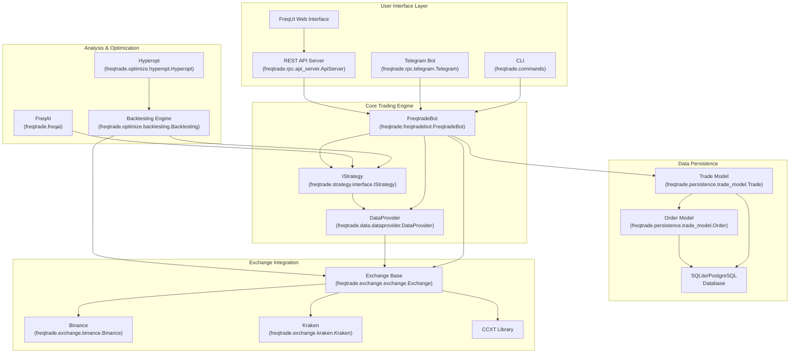

**Sources:** [freqtrade/freqtradebot.py73-176](https://github.com/freqtrade/freqtrade/blob/8e91fea1/freqtrade/freqtradebot.py#L73-L176) [freqtrade/exchange/exchange.py119-304](https://github.com/freqtrade/freqtrade/blob/8e91fea1/freqtrade/exchange/exchange.py#L119-L304) [freqtrade/strategy/interface.py51-156](https://github.com/freqtrade/freqtrade/blob/8e91fea1/freqtrade/strategy/interface.py#L51-L156) [freqtrade/rpc/rpc.py103-124](https://github.com/freqtrade/freqtrade/blob/8e91fea1/freqtrade/rpc/rpc.py#L103-L124) [freqtrade/persistence/trade\_model.py1-52](https://github.com/freqtrade/freqtrade/blob/8e91fea1/freqtrade/persistence/trade_model.py#L1-L52)

---

## Core Components

### FreqtradeBot - Main Orchestrator

**Class:** `freqtrade.freqtradebot.FreqtradeBot`

The `FreqtradeBot` class is the central orchestrator responsible for coordinating all trading operations. It initializes on startup and runs a continuous loop during live/dry-run modes.

**Key Responsibilities:**

* Initializing and coordinating subsystems (exchange, strategy, database, RPC)
* Running the main process loop (`process()` method)
* Managing entry and exit positions
* Handling order execution and state updates
* Coordinating with the strategy for signals and callbacks

**Initialization Sequence:**

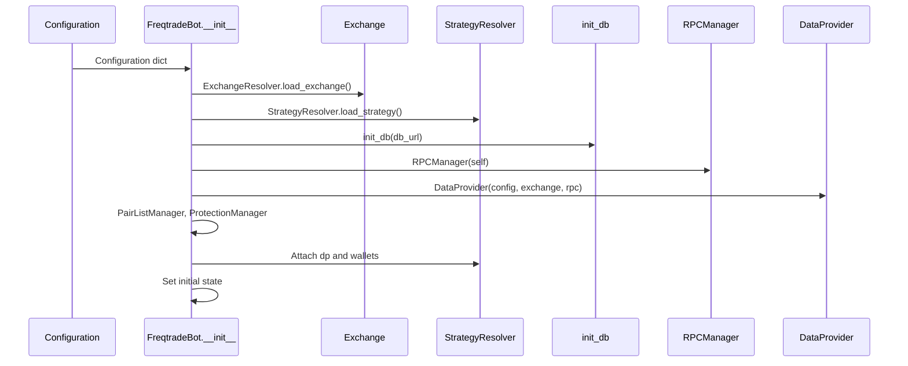

**Key Attributes:**

* `self.config`: Configuration dictionary
* `self.exchange`: Exchange instance for market interactions
* `self.strategy`: User-defined strategy instance
* `self.rpc`: RPC manager for notifications and control
* `self.dataprovider`: Central data hub for market data
* `self.wallets`: Wallet manager for balance tracking
* `self.state`: Current bot state (RUNNING, STOPPED, etc.)

**Sources:** [freqtrade/freqtradebot.py73-189](https://github.com/freqtrade/freqtrade/blob/8e91fea1/freqtrade/freqtradebot.py#L73-L189) [freqtrade/freqtradebot.py227-245](https://github.com/freqtrade/freqtrade/blob/8e91fea1/freqtrade/freqtradebot.py#L227-L245)

---

### Exchange - Market Integration Layer

**Class:** `freqtrade.exchange.exchange.Exchange`

The `Exchange` class provides a unified abstraction over the CCXT library, normalizing differences between cryptocurrency exchanges and adding Freqtrade-specific functionality.

**Key Responsibilities:**

* Market data fetching (OHLCV candles, tickers, order books)
* Order placement and management
* Balance and position tracking
* Market metadata (precision, limits, trading pairs)
* WebSocket connections for real-time data (when supported)

**Exchange Hierarchy:**

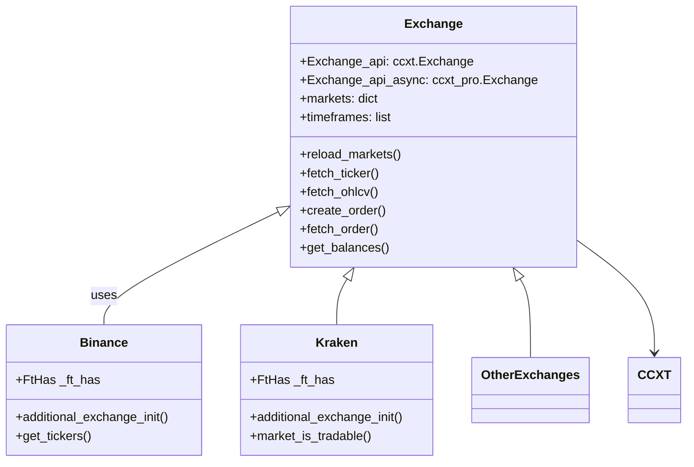

**Configuration via `_ft_has`:**

The `_ft_has` dictionary defines exchange-specific capabilities and behaviors. Each exchange subclass can override these settings.

| Property | Purpose |
| --- | --- |
| `stoploss_on_exchange` | Whether exchange supports native stoploss orders |
| `order_time_in_force` | Supported time-in-force values |
| `ohlcv_partial_candle` | Whether incomplete candles are returned |
| `trades_pagination` | How to paginate trade history ("time" or "id") |
| `ws_enabled` | Whether WebSocket support is available |

**Sources:** [freqtrade/exchange/exchange.py119-304](https://github.com/freqtrade/freqtrade/blob/8e91fea1/freqtrade/exchange/exchange.py#L119-L304) [freqtrade/exchange/binance.py30-81](https://github.com/freqtrade/freqtrade/blob/8e91fea1/freqtrade/exchange/binance.py#L30-L81) [freqtrade/exchange/kraken.py21-52](https://github.com/freqtrade/freqtrade/blob/8e91fea1/freqtrade/exchange/kraken.py#L21-L52)

---

### IStrategy - User Trading Logic Interface

**Class:** `freqtrade.strategy.interface.IStrategy`

The `IStrategy` abstract base class defines the interface that all user strategies must implement. It provides the mechanism for users to inject custom trading logic into Freqtrade.

**Mandatory Methods:**

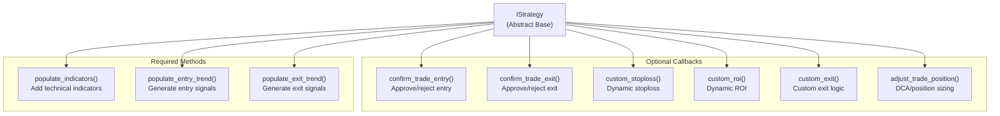

**Key Attributes Available to Strategies:**

* `self.dp`: DataProvider for accessing market data
* `self.wallets`: Current wallet balances
* `self.config`: Bot configuration
* `self.timeframe`: Strategy's primary timeframe
* `self.stake_currency`: The currency used for position sizing

**Strategy Lifecycle:**

| Method | When Called | Purpose |
| --- | --- | --- |
| `bot_start()` | Once at startup | Initialize resources, load models |
| `bot_loop_start()` | Every iteration | Pair-independent pre-processing |
| `populate_indicators()` | Per dataframe refresh | Calculate technical indicators |
| `populate_entry_trend()` | Per dataframe refresh | Mark entry signals |
| `populate_exit_trend()` | Per dataframe refresh | Mark exit signals |
| `confirm_trade_entry()` | Before placing entry order | Final entry validation |
| `custom_stoploss()` | Every iteration (open trades) | Dynamic stoploss calculation |
| `confirm_trade_exit()` | Before placing exit order | Final exit validation |

**Sources:** [freqtrade/strategy/interface.py51-178](https://github.com/freqtrade/freqtrade/blob/8e91fea1/freqtrade/strategy/interface.py#L51-L178) [freqtrade/strategy/interface.py227-272](https://github.com/freqtrade/freqtrade/blob/8e91fea1/freqtrade/strategy/interface.py#L227-L272) [freqtrade/strategy/interface.py353-390](https://github.com/freqtrade/freqtrade/blob/8e91fea1/freqtrade/strategy/interface.py#L353-L390)

---

### Persistence Layer - Database Models

**Primary Classes:** `freqtrade.persistence.trade_model.Trade`, `freqtrade.persistence.trade_model.Order`

The persistence layer uses SQLAlchemy ORM to manage trading state in a relational database (SQLite or PostgreSQL).

**Database Schema Relationships:**

```
#mermaid-i5zue95ufkl{font-family:ui-sans-serif,-apple-system,system-ui,Segoe UI,Helvetica;font-size:16px;fill:#333;}@keyframes edge-animation-frame{from{stroke-dashoffset:0;}}@keyframes dash{to{stroke-dashoffset:0;}}#mermaid-i5zue95ufkl .edge-animation-slow{stroke-dasharray:9,5!important;stroke-dashoffset:900;animation:dash 50s linear infinite;stroke-linecap:round;}#mermaid-i5zue95ufkl .edge-animation-fast{stroke-dasharray:9,5!important;stroke-dashoffset:900;animation:dash 20s linear infinite;stroke-linecap:round;}#mermaid-i5zue95ufkl .error-icon{fill:#dddddd;}#mermaid-i5zue95ufkl .error-text{fill:#222222;stroke:#222222;}#mermaid-i5zue95ufkl .edge-thickness-normal{stroke-width:1px;}#mermaid-i5zue95ufkl .edge-thickness-thick{stroke-width:3.5px;}#mermaid-i5zue95ufkl .edge-pattern-solid{stroke-dasharray:0;}#mermaid-i5zue95ufkl .edge-thickness-invisible{stroke-width:0;fill:none;}#mermaid-i5zue95ufkl .edge-pattern-dashed{stroke-dasharray:3;}#mermaid-i5zue95ufkl .edge-pattern-dotted{stroke-dasharray:2;}#mermaid-i5zue95ufkl .marker{fill:#999;stroke:#999;}#mermaid-i5zue95ufkl .marker.cross{stroke:#999;}#mermaid-i5zue95ufkl svg{font-family:ui-sans-serif,-apple-system,system-ui,Segoe UI,Helvetica;font-size:16px;}#mermaid-i5zue95ufkl p{margin:0;}#mermaid-i5zue95ufkl .entityBox{fill:#ffffff;stroke:#dddddd;}#mermaid-i5zue95ufkl .relationshipLabelBox{fill:#dddddd;opacity:0.7;background-color:#dddddd;}#mermaid-i5zue95ufkl .relationshipLabelBox rect{opacity:0.5;}#mermaid-i5zue95ufkl .labelBkg{background-color:rgba(221, 221, 221, 0.5);}#mermaid-i5zue95ufkl .edgeLabel .label{fill:#dddddd;font-size:14px;}#mermaid-i5zue95ufkl .label{font-family:ui-sans-serif,-apple-system,system-ui,Segoe UI,Helvetica;color:#333;}#mermaid-i5zue95ufkl .edge-pattern-dashed{stroke-dasharray:8,8;}#mermaid-i5zue95ufkl .node rect,#mermaid-i5zue95ufkl .node circle,#mermaid-i5zue95ufkl .node ellipse,#mermaid-i5zue95ufkl .node polygon{fill:#ffffff;stroke:#dddddd;stroke-width:1px;}#mermaid-i5zue95ufkl .relationshipLine{stroke:#999;stroke-width:1;fill:none;}#mermaid-i5zue95ufkl .marker{fill:none!important;stroke:#999!important;stroke-width:1;}#mermaid-i5zue95ufkl :root{--mermaid-font-family:"trebuchet ms",verdana,arial,sans-serif;}

has many


has custom data


Trade


int


id


PK


string


pair


datetime


open_date


datetime


close_date


float


stake_amount


float


amount


float


open_rate


float


close_rate


boolean


is_open


boolean


is_short


float


leverage


string


strategy


string


enter_tag


string


exit_reason


Order


int


id


PK


int


ft_trade_id


FK


string


order_id


string


ft_order_side


string


status


float


amount


float


price


float


filled


datetime


order_date


datetime


order_filled_date


CustomData


int


id


PK


int


ft_trade_id


FK


string


cd_key


string


cd_value
```

**Key Model Responsibilities:**

**Trade Model:**

* Represents a complete trading position (entry to exit)
* Tracks P&L calculations (`calc_profit()`, `calc_profit_ratio()`)
* Manages stoploss state (`adjust_stop_loss()`)
* Handles order lifecycle through relationship with Order model

**Order Model:**

* Tracks individual orders (entry, exit, stoploss)
* Mirrors CCXT order structure
* Provides safe accessors (`safe_price`, `safe_amount`, `safe_filled`)
* Links to parent Trade via `ft_trade_id` foreign key

**Session Management:**

The system uses scoped sessions that are thread-aware and request-aware (for FastAPI):

```
```
# From freqtrade/persistence/models.py
Trade.session = scoped_session(
    sessionmaker(bind=engine, autoflush=False), 
    scopefunc=get_request_or_thread_id
)
```
```

**Sources:** [freqtrade/persistence/trade\_model.py65-227](https://github.com/freqtrade/freqtrade/blob/8e91fea1/freqtrade/persistence/trade_model.py#L65-L227) [freqtrade/persistence/models.py47-98](https://github.com/freqtrade/freqtrade/blob/8e91fea1/freqtrade/persistence/models.py#L47-L98) [freqtrade/persistence/migrations.py1-98](https://github.com/freqtrade/freqtrade/blob/8e91fea1/freqtrade/persistence/migrations.py#L1-L98)

---

### RPC System - Remote Control and Notifications

**Core Classes:** `freqtrade.rpc.rpc.RPC`, `freqtrade.rpc.RPCManager`

The RPC system provides remote control, monitoring, and notifications through multiple channels.

**RPC Architecture:**

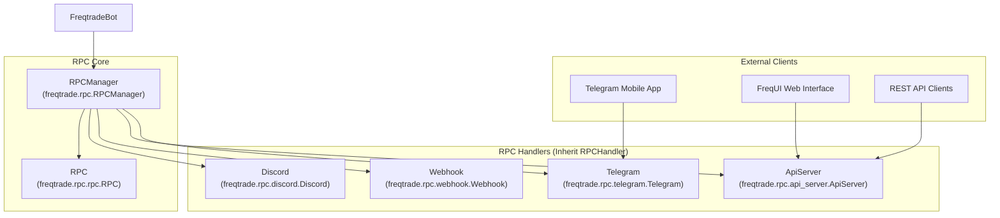

**Message Types:**

The `RPCMessageType` enum defines notification types sent through RPC channels:

| Message Type | Trigger | Content |
| --- | --- | --- |
| `ENTRY` | Entry order placed | Pair, amount, rate, direction |
| `ENTRY_FILL` | Entry order filled | Same as ENTRY plus fill details |
| `EXIT` | Exit order placed | Exit reason, profit, duration |
| `EXIT_FILL` | Exit order filled | Same as EXIT plus fill details |
| `STATUS` | Bot state change | Current state message |
| `WARNING` | System warnings | Warning message |
| `STARTUP` | Bot startup | Startup message |

**RPC Command Flow:**

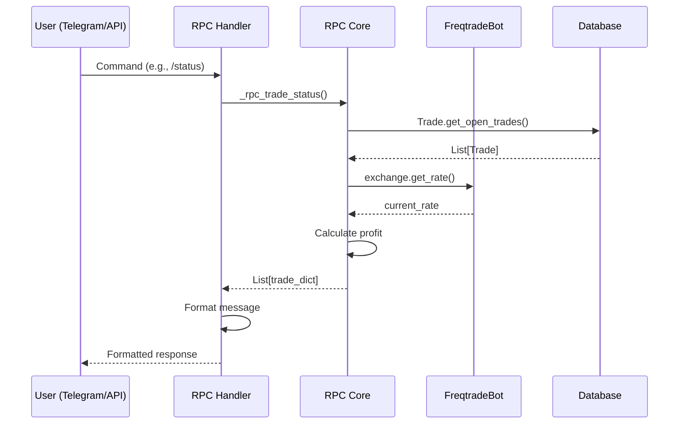

**Sources:** [freqtrade/rpc/rpc.py103-124](https://github.com/freqtrade/freqtrade/blob/8e91fea1/freqtrade/rpc/rpc.py#L103-L124) [freqtrade/rpc/telegram.py142-246](https://github.com/freqtrade/freqtrade/blob/8e91fea1/freqtrade/rpc/telegram.py#L142-L246) [freqtrade/rpc/api\_server/api\_v1.py1-68](https://github.com/freqtrade/freqtrade/blob/8e91fea1/freqtrade/rpc/api_server/api_v1.py#L1-L68)

---

## Live Trading Execution Flow

The core trading loop is implemented in the `FreqtradeBot.process()` method, which runs approximately every 5 seconds (configurable via `internals.process_throttle_secs`).

### Process Loop Sequence

```mermaid
sequenceDiagram
  participant FreqtradeBot.process()
  participant DataProvider
  participant Strategy
  participant Exchange
  participant Database (Trade)
  participant RPCManager

  note over FreqtradeBot.process(): Every ~5 seconds
  FreqtradeBot.process()->>Exchange: reload_markets()
  FreqtradeBot.process()->>Database (Trade): Trade.get_open_trades()
  Database (Trade)-->>FreqtradeBot.process(): List[Trade]
  FreqtradeBot.process()->>FreqtradeBot.process(): _refresh_active_whitelist(trades)
  FreqtradeBot.process()->>DataProvider: refresh(pairs, informative_pairs)
  DataProvider->>Exchange: fetch_ohlcv() for all pairs
  Exchange-->>DataProvider: OHLCV data
  FreqtradeBot.process()->>Strategy: bot_loop_start()
  FreqtradeBot.process()->>Strategy: analyze(whitelist)
  note over Strategy: populate_indicators
  FreqtradeBot.process()->>FreqtradeBot.process(): manage_open_orders()
  note over FreqtradeBot.process(): Handle timeouts, cancellations
  FreqtradeBot.process()->>FreqtradeBot.process(): exit_positions(trades)
  loop [Exit condition met]
    FreqtradeBot.process()->>Strategy: custom_stoploss()
    FreqtradeBot.process()->>Strategy: custom_roi()
    FreqtradeBot.process()->>Strategy: custom_exit()
    FreqtradeBot.process()->>Strategy: confirm_trade_exit()
    Strategy-->>FreqtradeBot.process(): approved
    FreqtradeBot.process()->>Exchange: create_order(exit)
    FreqtradeBot.process()->>Database (Trade): Update trade
    FreqtradeBot.process()->>RPCManager: send_msg(EXIT)
    FreqtradeBot.process()->>FreqtradeBot.process(): process_open_trade_positions()
    FreqtradeBot.process()->>FreqtradeBot.process(): enter_positions()
    FreqtradeBot.process()->>Strategy: get_entry_signal()
    FreqtradeBot.process()->>Strategy: confirm_trade_entry()
    Strategy-->>FreqtradeBot.process(): approved
    FreqtradeBot.process()->>Exchange: create_order(entry)
    FreqtradeBot.process()->>Database (Trade): Create Trade
    FreqtradeBot.process()->>RPCManager: send_msg(ENTRY)
  end
  FreqtradeBot.process()->>Database (Trade): Trade.commit()
  FreqtradeBot.process()->>RPCManager: process_msg_queue()
```

**Key Methods:**

| Method | Purpose | File Reference |
| --- | --- | --- |
| `process()` | Main iteration loop | [freqtrade/freqtradebot.py247-301](https://github.com/freqtrade/freqtrade/blob/8e91fea1/freqtrade/freqtradebot.py#L247-L301) |
| `enter_positions()` | Create new trades | [freqtrade/freqtradebot.py603-651](https://github.com/freqtrade/freqtrade/blob/8e91fea1/freqtrade/freqtradebot.py#L603-L651) |
| `create_trade()` | Execute entry for a pair | [freqtrade/freqtradebot.py653-711](https://github.com/freqtrade/freqtrade/blob/8e91fea1/freqtrade/freqtradebot.py#L653-L711) |
| `exit_positions()` | Check and execute exits | [freqtrade/freqtradebot.py1363-1438](https://github.com/freqtrade/freqtrade/blob/8e91fea1/freqtrade/freqtradebot.py#L1363-L1438) |
| `manage_open_orders()` | Handle order state updates | [freqtrade/freqtradebot.py1039-1096](https://github.com/freqtrade/freqtrade/blob/8e91fea1/freqtrade/freqtradebot.py#L1039-L1096) |
| `execute_entry()` | Place entry order | [freqtrade/freqtradebot.py863-1001](https://github.com/freqtrade/freqtrade/blob/8e91fea1/freqtrade/freqtradebot.py#L863-L1001) |
| `execute_trade_exit()` | Place exit order | [freqtrade/freqtradebot.py1223-1361](https://github.com/freqtrade/freqtrade/blob/8e91fea1/freqtrade/freqtradebot.py#L1223-L1361) |

**Sources:** [freqtrade/freqtradebot.py247-301](https://github.com/freqtrade/freqtrade/blob/8e91fea1/freqtrade/freqtradebot.py#L247-L301) [freqtrade/freqtradebot.py603-711](https://github.com/freqtrade/freqtrade/blob/8e91fea1/freqtrade/freqtradebot.py#L603-L711) [freqtrade/freqtradebot.py1363-1438](https://github.com/freqtrade/freqtrade/blob/8e91fea1/freqtrade/freqtradebot.py#L1363-L1438)

---

## Data Flow Architecture

### DataProvider - Central Data Hub

**Class:** `freqtrade.data.dataprovider.DataProvider`

The `DataProvider` serves as a unified interface for accessing all market data, abstracting away the differences between live trading, backtesting, and other operational modes.

**Data Flow Diagram:**

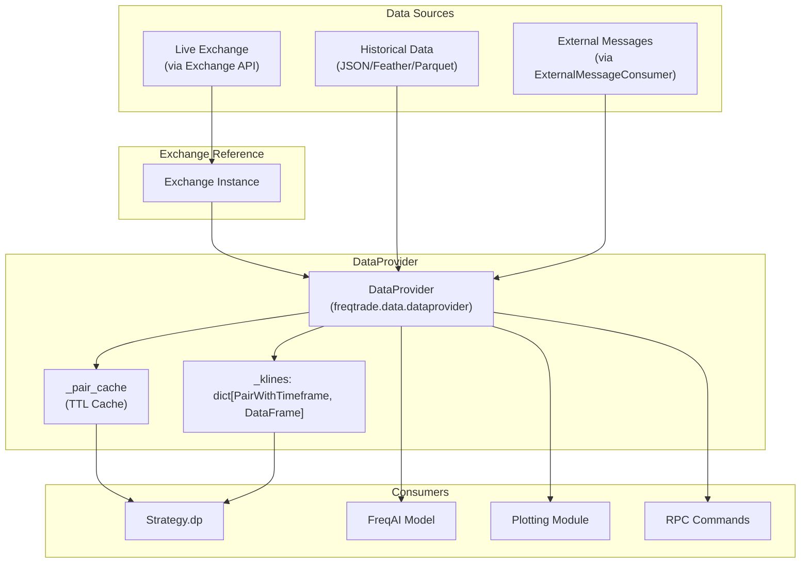

**Key DataProvider Methods:**

| Method | Purpose | Returns |
| --- | --- | --- |
| `refresh()` | Fetch and update OHLCV data | None (updates internal cache) |
| `get_analyzed_dataframe()` | Get dataframe with indicators | (DataFrame, datetime) |
| `ohlcv()` | Raw OHLCV data | DataFrame |
| `orderbook()` | Current order book | dict |
| `ticker()` | Current ticker | dict |
| `current_whitelist()` | Active trading pairs | list[str] |

**Caching Strategy:**

The DataProvider implements a TTL (Time-To-Live) cache to avoid repeated API calls:

```
```
# Cached for the duration of one candle
self._pair_cache: dict[PairWithTimeframe, tuple[DataFrame, datetime]]
```
```

**Sources:** [freqtrade/freqtradebot.py124-127](https://github.com/freqtrade/freqtrade/blob/8e91fea1/freqtrade/freqtradebot.py#L124-L127) [freqtrade/freqtradebot.py264-268](https://github.com/freqtrade/freqtrade/blob/8e91fea1/freqtrade/freqtradebot.py#L264-L268)

---

## Configuration and Initialization

### Configuration Loading Pipeline

Freqtrade supports a hierarchical configuration system with multiple sources:

**Configuration Precedence:**

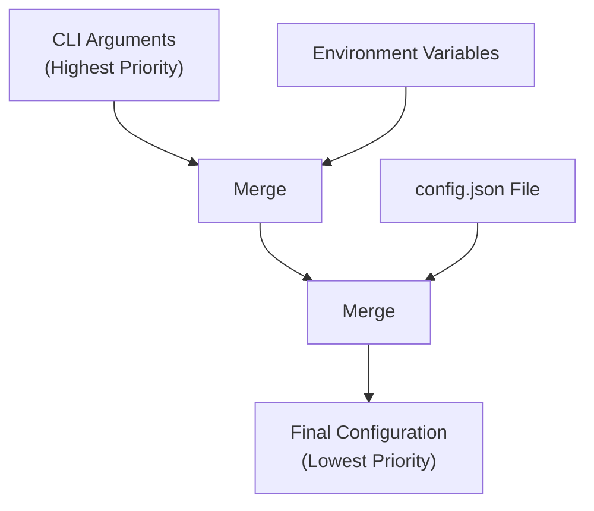

**Key Configuration Sections:**

| Section | Purpose | Example Keys |
| --- | --- | --- |
| `exchange` | Exchange connection | `name`, `key`, `secret`, `ccxt_config` |
| `strategy` | Strategy selection | Strategy class name |
| `stake_currency` | Position sizing base | `"BTC"`, `"USDT"` |
| `max_open_trades` | Concurrent trades limit | Integer or -1 for unlimited |
| `dry_run` | Paper trading mode | `true` / `false` |
| `db_url` | Database connection | `"sqlite:///tradesv3.sqlite"` |
| `telegram` | Telegram bot settings | `enabled`, `token`, `chat_id` |
| `api_server` | REST API settings | `enabled`, `listen_port` |
| `order_types` | Order type configuration | `entry`, `exit`, `stoploss` |
| `entry_pricing` | Entry price calculation | `price_side`, `use_order_book` |
| `exit_pricing` | Exit price calculation | `price_side`, `use_order_book` |

**Initialization Sequence:**

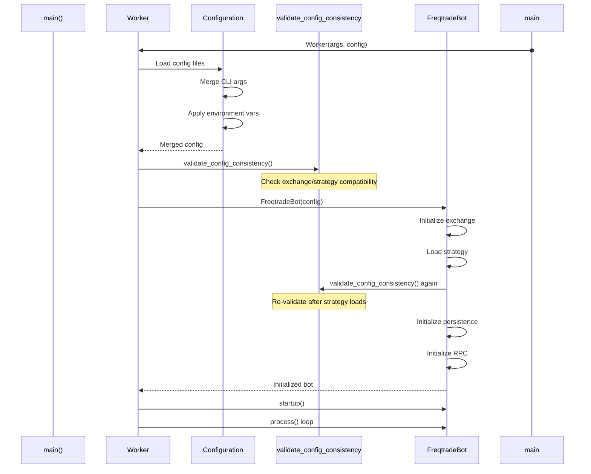

**Configuration Validation:**

The `validate_config_consistency()` function performs cross-checks between configuration sections to ensure compatibility:

* Trading mode (spot/margin/futures) vs exchange capabilities
* Margin mode (cross/isolated) vs exchange support
* Stake settings vs exchange minimum order sizes
* Order types vs exchange supported types

**Sources:** [freqtrade/configuration/\_\_init\_\_.py](https://github.com/freqtrade/freqtrade/blob/8e91fea1/freqtrade/configuration/__init__.py) [freqtrade/freqtradebot.py79-106](https://github.com/freqtrade/freqtrade/blob/8e91fea1/freqtrade/freqtradebot.py#L79-L106)

---

## Extension Points

Freqtrade provides well-defined extension points for customization:

### Strategy Extension

**Base Class:** `freqtrade.strategy.interface.IStrategy`

Users extend this abstract base class to implement custom trading logic. The bot loads strategies dynamically using `StrategyResolver`.

**Example Loading:**

```
```
# From freqtrade/freqtradebot.py
self.strategy: IStrategy = StrategyResolver.load_strategy(self.config)
```
```

### Exchange Extension

**Base Class:** `freqtrade.exchange.exchange.Exchange`

New exchanges can be added by subclassing `Exchange` and overriding exchange-specific behaviors:

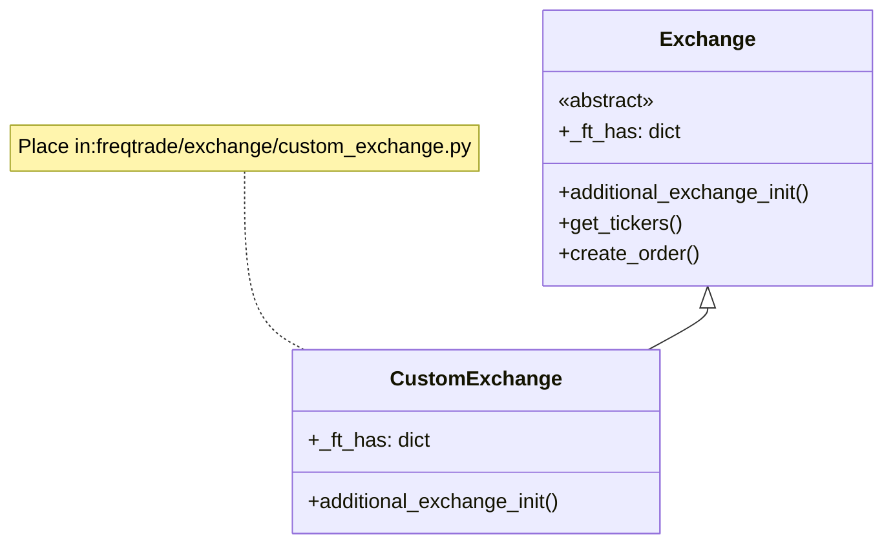

### FreqAI Model Extension

**Base Class:** `freqtrade.freqai.base_models.IFreqaiModel`

Machine learning models can be added by implementing this interface.

### Pairlist Filters

**Base Class:** `freqtrade.plugins.pairlist.IPairList`

Custom pairlist filters for dynamic pair selection.

**Sources:** [freqtrade/resolvers/strategy\_resolver.py](https://github.com/freqtrade/freqtrade/blob/8e91fea1/freqtrade/resolvers/strategy_resolver.py) [freqtrade/resolvers/exchange\_resolver.py](https://github.com/freqtrade/freqtrade/blob/8e91fea1/freqtrade/resolvers/exchange_resolver.py)

---

## Operational Modes

Freqtrade supports multiple operational modes that share the same strategy code:

### Mode Comparison

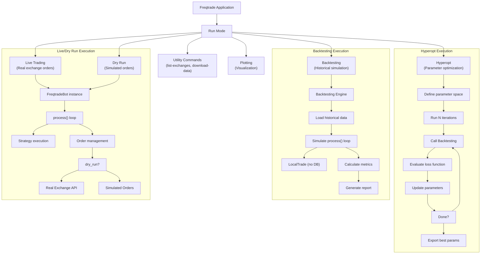

### Mode-Specific Behavior

| Mode | Uses Database | Real Orders | Strategy Analysis | Primary Use |
| --- | --- | --- | --- | --- |
| Live | Yes | Yes | Every iteration | Production trading |
| Dry Run | Yes | No (simulated) | Every iteration | Paper trading / testing |
| Backtesting | No (LocalTrade) | No (simulated) | Per candle | Strategy validation |
| Hyperopt | No | No (simulated) | Per iteration | Parameter optimization |
| Plotting | Read-only | No | For visualization | Analysis |

**Key Differences:**

**Live vs Dry Run:**

* Same code path through `FreqtradeBot.process()`
* Difference: `dry_run` flag controls whether orders are sent to exchange
* Dry run creates entries in database but simulates order fills

**Backtesting vs Live:**

* Backtesting uses `LocalTrade` (in-memory) instead of `Trade` (database)
* Backtesting simulates time progression through historical data
* Same strategy methods called (`populate_indicators`, `populate_entry_trend`, etc.)

**Sources:** [freqtrade/freqtradebot.py247-301](https://github.com/freqtrade/freqtrade/blob/8e91fea1/freqtrade/freqtradebot.py#L247-L301) [freqtrade/optimize/backtesting.py](https://github.com/freqtrade/freqtrade/blob/8e91fea1/freqtrade/optimize/backtesting.py)

---

## Summary

Freqtrade's architecture is built around:

1. **FreqtradeBot** as the central orchestrator coordinating all subsystems
2. **Exchange** abstraction providing unified access to 20+ exchanges via CCXT
3. **IStrategy** interface enabling user-defined trading logic through callbacks
4. **Persistence** layer managing trade and order state in SQLite/PostgreSQL
5. **RPC system** providing multiple control interfaces (Telegram, REST API, webhooks)
6. **DataProvider** serving as the central hub for all market data access
7. **Modular design** allowing the same strategy code to run across live, dry-run, backtesting, and hyperopt modes

This architecture enables Freqtrade to be both powerful (supporting advanced features like ML, position adjustment, futures trading) and accessible (clean interfaces for strategy development).

**Primary Source Files:**

* Core orchestration: [freqtrade/freqtradebot.py](https://github.com/freqtrade/freqtrade/blob/8e91fea1/freqtrade/freqtradebot.py)
* Exchange integration: [freqtrade/exchange/exchange.py](https://github.com/freqtrade/freqtrade/blob/8e91fea1/freqtrade/exchange/exchange.py)
* Strategy interface: [freqtrade/strategy/interface.py](https://github.com/freqtrade/freqtrade/blob/8e91fea1/freqtrade/strategy/interface.py)
* Database models: [freqtrade/persistence/trade\_model.py](https://github.com/freqtrade/freqtrade/blob/8e91fea1/freqtrade/persistence/trade_model.py)
* RPC system: [freqtrade/rpc/rpc.py](https://github.com/freqtrade/freqtrade/blob/8e91fea1/freqtrade/rpc/rpc.py) [freqtrade/rpc/telegram.py](https://github.com/freqtrade/freqtrade/blob/8e91fea1/freqtrade/rpc/telegram.py)