# Backtesting Engine

Relevant source files

* [freqtrade/optimize/backtesting.py](https://github.com/freqtrade/freqtrade/blob/8e91fea1/freqtrade/optimize/backtesting.py)
* [tests/optimize/\_\_init\_\_.py](https://github.com/freqtrade/freqtrade/blob/8e91fea1/tests/optimize/__init__.py)
* [tests/optimize/test\_backtest\_detail.py](https://github.com/freqtrade/freqtrade/blob/8e91fea1/tests/optimize/test_backtest_detail.py)
* [tests/optimize/test\_backtesting.py](https://github.com/freqtrade/freqtrade/blob/8e91fea1/tests/optimize/test_backtesting.py)
* [tests/optimize/test\_hyperopt.py](https://github.com/freqtrade/freqtrade/blob/8e91fea1/tests/optimize/test_hyperopt.py)
* [tests/optimize/test\_optimize\_reports.py](https://github.com/freqtrade/freqtrade/blob/8e91fea1/tests/optimize/test_optimize_reports.py)

The Backtesting Engine is a core component of freqtrade that simulates trading strategies against historical market data to evaluate their performance. This system allows users to test strategy logic, optimize parameters, and analyze potential profitability before deploying strategies in live trading.

For information about hyperparameter optimization using backtesting results, see [Hyperparameter Optimization](/freqtrade/freqtrade/3.2-hyperparameter-optimization). For details about the strategy system that provides signals to the backtesting engine, see [Strategy System](/freqtrade/freqtrade/2.2-exchange-integration).

## Core Architecture

The backtesting system is built around the `Backtesting` class which orchestrates the entire simulation process, from data loading through trade execution simulation to result generation.

### Backtesting Class Structure

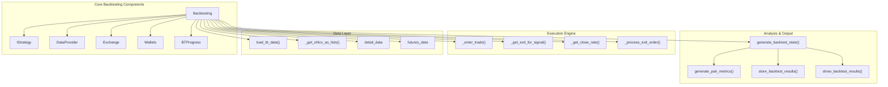

Sources: [freqtrade/optimize/backtesting.py111-229](https://github.com/freqtrade/freqtrade/blob/8e91fea1/freqtrade/optimize/backtesting.py#L111-L229) [freqtrade/optimize/backtesting.py291-329](https://github.com/freqtrade/freqtrade/blob/8e91fea1/freqtrade/optimize/backtesting.py#L291-L329) [freqtrade/optimize/backtesting.py446-501](https://github.com/freqtrade/freqtrade/blob/8e91fea1/freqtrade/optimize/backtesting.py#L446-L501)

### Data Flow Architecture

```mermaid
sequenceDiagram
  participant start_backtesting()
  participant Backtesting
  participant IStrategy
  participant DataProvider
  participant LocalTrade
  participant Order
  participant history.load_data()
  participant generate_backtest_stats()

  start_backtesting()->>Backtesting: "Backtesting(config)"
  Backtesting->>Backtesting: "init_backtest()"
  Backtesting->>Backtesting: "reset_backtest()"
  start_backtesting()->>Backtesting: "start()"
  Backtesting->>history.load_data(): "load_data()"
  history.load_data()->>Backtesting: "dict[pair,DataFrame]"
  Backtesting->>Backtesting: "load_bt_data()"
  note over Backtesting: "Loads detail_data, futures_data"
  Backtesting->>IStrategy: "_set_strategy(strategy)"
  IStrategy->>Backtesting: "strategy.dp = dataprovider"
  Backtesting->>Backtesting: "_get_ohlcv_as_lists()"
  loop ["For Each Pair"]
    Backtesting->>IStrategy: "strategy.ft_advise_signals(pair_data)"
    IStrategy->>Backtesting: "DataFrame with signals"
    Backtesting->>DataProvider: "_set_cached_df()"
    Backtesting->>Backtesting: "trim_dataframe()"
    note over Backtesting: "Convert to list[tuple]"
    Backtesting->>Backtesting: "backtest(processed)"
    Backtesting->>IStrategy: "_set_strategy()"
    Backtesting->>Backtesting: "_enter_trade()"
    Backtesting->>LocalTrade: "LocalTrade.open()"
    Backtesting->>Order: "Order creation"
    Backtesting->>LocalTrade: "trade.orders.append()"
    Backtesting->>Backtesting: "_check_adjust_trade_for_candle()"
    note over Backtesting: "Position adjustment/DCA"
    Backtesting->>Backtesting: "_get_exit_for_signal()"
    Backtesting->>Backtesting: "_get_close_rate()"
    Backtesting->>Backtesting: "_exit_trade()"
    Backtesting->>Backtesting: "_process_exit_order()"
    Backtesting->>LocalTrade: "LocalTrade.close()"
    Backtesting->>Backtesting: "check_abort()"
  end
  Backtesting->>generate_backtest_stats(): "generate_backtest_stats()"
  generate_backtest_stats()->>Backtesting: "BacktestResultType"
  Backtesting->>generate_backtest_stats(): "store_backtest_results()"
  Backtesting->>start_backtesting(): "show_backtest_results()"
```

Sources: [freqtrade/optimize/backtesting.py1133-1260](https://github.com/freqtrade/freqtrade/blob/8e91fea1/freqtrade/optimize/backtesting.py#L1133-L1260) [freqtrade/optimize/backtesting.py459-514](https://github.com/freqtrade/freqtrade/blob/8e91fea1/freqtrade/optimize/backtesting.py#L459-L514) [freqtrade/optimize/backtesting.py1262-1400](https://github.com/freqtrade/freqtrade/blob/8e91fea1/freqtrade/optimize/backtesting.py#L1262-L1400) [freqtrade/optimize/optimize\_reports.py53-59](https://github.com/freqtrade/freqtrade/blob/8e91fea1/freqtrade/optimize/optimize_reports.py#L53-L59)

## Key Components

### Backtesting Class

The `Backtesting` class serves as the main orchestrator for the backtesting process. It manages strategy execution, trade simulation, and result compilation.

**Key Methods:**

* `start()` - Main entry point coordinating data loading, strategy setup, backtesting loop, and result generation
* `backtest()` - Core simulation loop at [freqtrade/optimize/backtesting.py1262-1400](https://github.com/freqtrade/freqtrade/blob/8e91fea1/freqtrade/optimize/backtesting.py#L1262-L1400) processing candles sequentially
* `_enter_trade()` - Simulates position opening with stake amount validation and custom entry price support
* `_exit_trade()` - Creates exit orders with `Order` object generation
* `_get_exit_for_signal()` - Evaluates exit conditions (ROI, stop loss, exit signals) returning `ExitCheckTuple`
* `_get_close_rate()` - Determines exit price based on exit type (ROI/stop loss/signal)
* `_get_close_rate_for_stoploss()` - Calculates stop loss exit price handling worst-case scenarios
* `_get_close_rate_for_roi()` - Computes ROI-based exit price with fee adjustments
* `_process_exit_order()` - Completes trade exit, updates wallet, triggers protections
* `_check_adjust_trade_for_candle()` - Handles position adjustments (DCA) via `strategy._adjust_trade_position_internal()`
* `_try_close_open_order()` - Checks if pending orders should fill based on candle range
* `load_bt_data()` - Loads OHLCV, detail timeframe, and futures data (funding rates, mark prices)
* `_load_bt_data_detail()` - Loads higher resolution detail timeframe and futures-specific data
* `_get_ohlcv_as_lists()` - Converts DataFrames to `list[tuple]` for iteration performance
* `reset_backtest()` - Resets state counters and clears caches between backtest runs
* `disable_database_use()` - Disables SQLAlchemy persistence for backtesting
* `get_pair_precision()` - Retrieves time-based precision from `price_pair_prec` or exchange fallback
* `check_abort()` - Checks `abort` flag for interactive mode termination

**Key Properties:**

* `config` - Configuration dictionary with validated settings
* `results` - `BacktestResultType` containing all strategy results
* `strategylist` - List of `IStrategy` instances to backtest
* `strategy` - Currently active strategy instance
* `exchange` - Exchange instance loaded via `ExchangeResolver`
* `dataprovider` - `DataProvider` for strategy data access
* `pairlists` - `PairListManager` for dynamic pair filtering
* `wallets` - `Wallets` instance tracking simulated balance
* `trade_id_counter` - Incremental trade ID generator
* `order_id_counter` - Incremental order ID generator
* `progress` - `BTProgress` for progress tracking
* `abort` - Boolean flag for stopping execution
* `timeframe` - Strategy timeframe from config
* `timeframe_detail` - Optional higher resolution timeframe
* `detail_data` - Dict of detail timeframe DataFrames by pair
* `futures_data` - Dict of funding/mark rate DataFrames for futures
* `price_pair_prec` - Dict of time-series precision data by pair
* `run_ids` - Dict mapping strategy names to cache run IDs
* `all_bt_content` - Dict of `BacktestContentType` for analysis export
* `analysis_results` - Dict containing signals, rejected trades, exited trades DataFrames
* `rejected_dict` - Dict tracking rejected trade signals by reason

Sources: [freqtrade/optimize/backtesting.py111-217](https://github.com/freqtrade/freqtrade/blob/8e91fea1/freqtrade/optimize/backtesting.py#L111-L217) [freqtrade/optimize/backtesting.py275-281](https://github.com/freqtrade/freqtrade/blob/8e91fea1/freqtrade/optimize/backtesting.py#L275-L281) [freqtrade/optimize/backtesting.py304-410](https://github.com/freqtrade/freqtrade/blob/8e91fea1/freqtrade/optimize/backtesting.py#L304-L410) [freqtrade/optimize/backtesting.py430-448](https://github.com/freqtrade/freqtrade/blob/8e91fea1/freqtrade/optimize/backtesting.py#L430-L448) [freqtrade/optimize/backtesting.py516-664](https://github.com/freqtrade/freqtrade/blob/8e91fea1/freqtrade/optimize/backtesting.py#L516-L664)

### Trade Simulation Engine

The trade simulation engine handles the mechanics of simulating trade execution within the backtesting environment.

#### Entry Logic

Trade entry simulation in `_enter_trade()`:

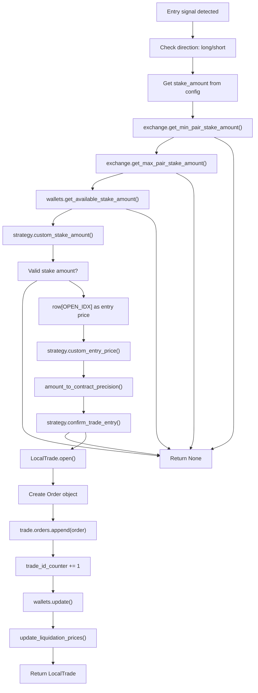

**Entry Price Calculation:**

* Default entry price is `row[OPEN_IDX]` (opening price of signal candle)
* `strategy.custom_entry_price()` can override with limits checked against candle range
* For long trades: custom price clamped to `max(custom_price, row[LOW_IDX])`
* For short trades: custom price clamped to `min(custom_price, row[HIGH_IDX])`
* Ensures orders can realistically fill within candle

**Stake Amount Flow:**

* Starts with `config["stake_amount"]` (can be "unlimited")
* Limited by `exchange.get_min_pair_stake_amount()` lower bound
* Limited by `exchange.get_max_pair_stake_amount()` upper bound
* Limited by `wallets.get_available_stake_amount()` available balance
* `strategy.custom_stake_amount()` provides final override
* Amount precision applied via `amount_to_contract_precision()`

**Futures-Specific Handling:**

* For `trading_mode=futures`, calculates leverage from `strategy.leverage()`
* Computes liquidation price using `update_liquidation_prices()`
* Tracks funding rates in `futures_data` dict
* Applies margin mode (isolated/cross) from config

Sources: [freqtrade/optimize/backtesting.py887-1051](https://github.com/freqtrade/freqtrade/blob/8e91fea1/freqtrade/optimize/backtesting.py#L887-L1051) [freqtrade/optimize/backtesting.py1053-1107](https://github.com/freqtrade/freqtrade/blob/8e91fea1/freqtrade/optimize/backtesting.py#L1053-L1107) [tests/optimize/test\_backtesting.py525-586](https://github.com/freqtrade/freqtrade/blob/8e91fea1/tests/optimize/test_backtesting.py#L525-L586) [tests/optimize/test\_backtesting.py588-677](https://github.com/freqtrade/freqtrade/blob/8e91fea1/tests/optimize/test_backtesting.py#L588-L677)

#### Exit Logic

The exit simulation in `_get_exit_for_signal()` evaluates multiple exit conditions:

**Exit Priority and Determination:**

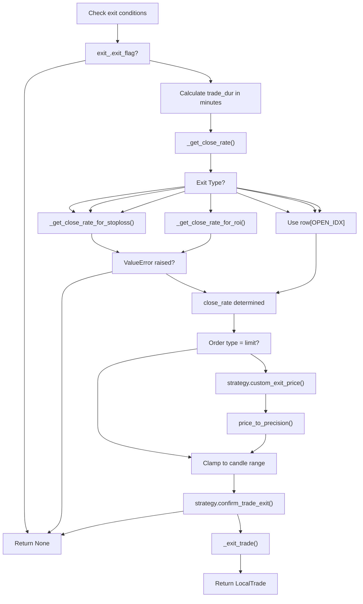

**Exit Types and Their Logic:**

| Exit Type | Method | Price Calculation |
| --- | --- | --- |
| `ExitType.ROI` | `_get_close_rate_for_roi()` | Uses `strategy.min_roi_reached_entry()` to find ROI tier, calculates price considering fees |
| `ExitType.STOP_LOSS` | `_get_close_rate_for_stoploss()` | Returns `trade.stop_loss` with same-candle worst-case handling |
| `ExitType.TRAILING_STOP_LOSS` | `_get_close_rate_for_stoploss()` | Same as stop loss but with dynamic `trade.stop_loss` updates |
| `ExitType.LIQUIDATION` | `_get_close_rate_for_stoploss()` | Returns `trade.liquidation_price` for futures |
| `ExitType.EXIT_SIGNAL` | Uses `row[OPEN_IDX]` | Direct candle open price, supports `custom_exit_price()` override |
| `ExitType.CUSTOM_EXIT` | Uses `row[OPEN_IDX]` | From `strategy.custom_exit()`, supports price override |
| `ExitType.PARTIAL_EXIT` | Uses `row[OPEN_IDX]` | From `adjust_trade_position()` for DCA exits |
| `ExitType.FORCE_EXIT` | Uses `row[OPEN_IDX]` | Mandatory exit at timerange end |

**Stop Loss Special Cases:**

From `_get_close_rate_for_stoploss()`:

* If stoploss already beyond candle range, exits at `row[OPEN_IDX]`
* For trailing stop on trade open candle (`trade_dur=0`), calculates worst-case:
  + With `trailing_only_offset_is_reached=True`: assumes price hits offset then drops to stop
  + Otherwise: assumes price ticks above open then drops to stop
* Clamps result to candle low/high to ensure realistic execution

**ROI Special Cases:**

From `_get_close_rate_for_roi()`:

* For force exit with `roi=-1` on candle-aligned time, uses `row[OPEN_IDX]`
* Calculates theoretical close rate from ROI percentage considering fees
* For new ROI entry on candle open, uses `row[OPEN_IDX]` if favorable
* On trade open candle, validates green/red candle logic to prevent impossible exits
* Clamps result between `row[LOW_IDX]` and `row[HIGH_IDX]`

Sources: [freqtrade/optimize/backtesting.py801-879](https://github.com/freqtrade/freqtrade/blob/8e91fea1/freqtrade/optimize/backtesting.py#L801-L879) [freqtrade/optimize/backtesting.py539-591](https://github.com/freqtrade/freqtrade/blob/8e91fea1/freqtrade/optimize/backtesting.py#L539-L591) [freqtrade/optimize/backtesting.py593-664](https://github.com/freqtrade/freqtrade/blob/8e91fea1/freqtrade/optimize/backtesting.py#L593-L664) [tests/optimize/test\_backtest\_detail.py41-147](https://github.com/freqtrade/freqtrade/blob/8e91fea1/tests/optimize/test_backtest_detail.py#L41-L147)

### Performance Analysis

#### Metrics Generation

The backtesting engine generates comprehensive performance metrics through several specialized functions:

**Core Metric Functions:**

* `generate_backtest_stats()` - Primary statistics compilation from `BacktestResultType`
* `generate_pair_metrics()` - Per-trading-pair performance analysis
* `generate_daily_stats()` - Day-by-day performance breakdown using `resample()`
* `generate_trading_stats()` - Trade-specific statistics and win/loss ratios
* `calc_streak()` - Consecutive win/loss calculations using pandas operations
* `generate_strategy_stats()` - Strategy comparison metrics

**Performance Metrics Structure:**

* Trade counts and percentages (wins, draws, losses)
* Profit calculations (absolute and percentage)
* Risk metrics (max drawdown, Sharpe ratio)
* Duration statistics (average, median holding times)
* Daily and periodic breakdowns

Sources: [freqtrade/optimize/optimize\_reports53-58](https://github.com/freqtrade/freqtrade/blob/8e91fea1/freqtrade/optimize/optimize_reports#L53-L58) [tests/optimize/test\_optimize\_reports.py101-259](https://github.com/freqtrade/freqtrade/blob/8e91fea1/tests/optimize/test_optimize_reports.py#L101-L259) [freqtrade/optimize/optimize\_reports/optimize\_reports.py36-38](https://github.com/freqtrade/freqtrade/blob/8e91fea1/freqtrade/optimize/optimize_reports/optimize_reports.py#L36-L38)

#### Result Storage and Export

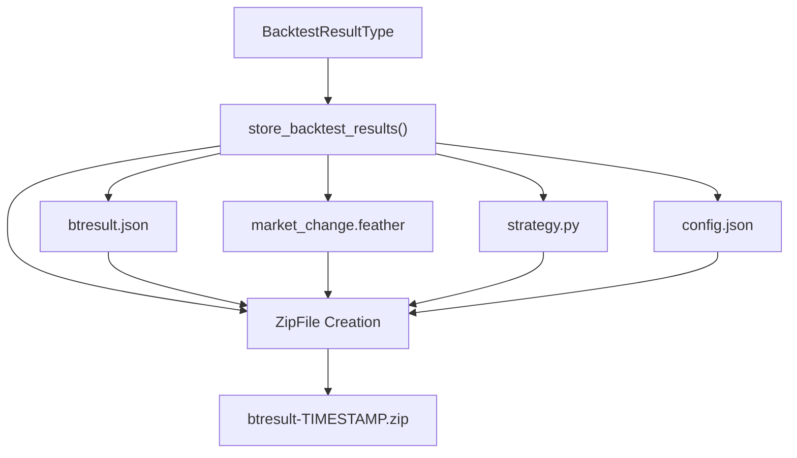

**Export File Structure:**

* `btresult.json` - Complete backtest statistics and trade data
* `market_change.feather` - Market movement data in pandas format
* `strategy.py` - Copy of the strategy file used
* `config.json` - Configuration snapshot
* `*.json` - Additional metadata files
* Result files named with format: `btresult-YYYY_MM_DD_HH_MM_SS.zip`

**Key Export Functions:**

* `store_backtest_results()` - Main export orchestrator
* `get_latest_backtest_filename()` - Retrieves most recent result file
* `load_backtest_stats()` - Loads results from ZIP files

Sources: [freqtrade/optimize/optimize\_reports22-31](https://github.com/freqtrade/freqtrade/blob/8e91fea1/freqtrade/optimize/optimize_reports#L22-L31) [tests/optimize/test\_optimize\_reports.py234-258](https://github.com/freqtrade/freqtrade/blob/8e91fea1/tests/optimize/test_optimize_reports.py#L234-L258) [freqtrade/data/btanalysis.py16-20](https://github.com/freqtrade/freqtrade/blob/8e91fea1/freqtrade/data/btanalysis.py#L16-L20)

## Testing Framework

### Test Containers

The backtesting system uses specialized test containers for validation:

**BTContainer Structure:**

* `data` - OHLCV candle data with entry/exit signals as `list[list[float]]`
* `stop_loss` - Stop loss percentage
* `roi` - Return on investment targets as `dict[str, float]`
* `trades` - Expected trade outcomes as `list[BTrade]`
* `profit_perc` - Expected profit percentage
* `trailing_stop` - Boolean for trailing stop functionality
* `use_exit_signal` - Boolean for exit signal usage
* `leverage` - Leverage multiplier (default 1.0)

**BTrade Structure:**

* `exit_reason` - `ExitType` enum (ROI, STOP\_LOSS, TRAILING\_STOP\_LOSS, etc.)
* `open_tick` - Candle index where trade opens (int)
* `close_tick` - Candle index where trade closes (int)
* `enter_tag` - Optional entry signal identifier (str | None)
* `is_short` - Whether trade is a short position (bool)

**Test Data Format:**

```
# D   O     H     L     C    V    EL XL ES Xs
[0, 5000, 5025, 4975, 4987, 6172, 1, 0, 0, 0]
```

Where: Date, Open, High, Low, Close, Volume, Enter\_Long, Exit\_Long, Enter\_Short, Exit\_Short

Sources: [tests/optimize/\_\_init\_\_.py15-50](https://github.com/freqtrade/freqtrade/blob/8e91fea1/tests/optimize/__init__.py#L15-L50) [tests/optimize/test\_backtest\_detail.py23-38](https://github.com/freqtrade/freqtrade/blob/8e91fea1/tests/optimize/test_backtest_detail.py#L23-L38) [tests/optimize/test\_backtest\_detail.py57-86](https://github.com/freqtrade/freqtrade/blob/8e91fea1/tests/optimize/test_backtest_detail.py#L57-L86)

### Test Scenarios

The testing framework includes comprehensive scenarios covering:

**Core Test Cases (tc0-tc13):**

1. **Stop Loss Triggers** - 1%, 2%, 3% stop loss activation scenarios
2. **ROI Exits** - Return on investment target achievements (3%, 5%, 6% ROI)
3. **Trailing Stops** - Dynamic stop loss with `trailing_stop_positive_offset`
4. **Signal Priority** - Exit signal vs ROI vs stop loss precedence
5. **Same-Candle Scenarios** - Entry and exit in identical candle (`tc13`)
6. **Multi-Trade Sequences** - Multiple consecutive trades (`tc3`)

**Advanced Scenarios:**

* **Leverage Testing** - Futures trading with leverage multipliers
* **Detail Timeframe** - Sub-candle analysis with higher resolution data
* **Custom Functions** - `custom_entry_price()` and `custom_exit_price()` validation
* **Position Adjustment** - DCA (Dollar Cost Averaging) scenarios
* **Edge Cases** - Precision handling, fee calculations, wallet updates

**Test Execution:**

* `_build_backtest_dataframe()` - Converts test data to DataFrame format
* `_get_frame_time_from_offset()` - Generates timestamps for test candles
* Test containers executed via `Backtesting.backtest()` method

Sources: [tests/optimize/test\_backtest\_detail.py41-695](https://github.com/freqtrade/freqtrade/blob/8e91fea1/tests/optimize/test_backtest_detail.py#L41-L695) [tests/optimize/\_\_init\_\_.py52-86](https://github.com/freqtrade/freqtrade/blob/8e91fea1/tests/optimize/__init__.py#L52-L86) [tests/optimize/test\_backtesting.py1100-1300](https://github.com/freqtrade/freqtrade/blob/8e91fea1/tests/optimize/test_backtesting.py#L1100-L1300)

## Configuration and Execution

### Command Line Interface

The backtesting engine supports extensive configuration through command-line arguments via `setup_optimize_configuration()`:

**Key Parameters:**

* `--strategy` - Strategy class to backtest (loaded via `StrategyResolver`)
* `--timeframe` - Candle timeframe for analysis (e.g., "5m", "1h")
* `--timerange` - Historical data range using `TimeRange.parse_timerange()`
* `--dry-run-wallet` - Starting balance for simulation
* `--export` - Result export format ("signals", "trades", "none")
* `--fee` - Custom trading fee override (float percentage)
* `--enable-position-stacking` - Allow multiple positions per pair
* `--strategy-list` - Multiple strategies for comparison
* `--exportfilename` - Custom export filename

**Configuration Flow:**

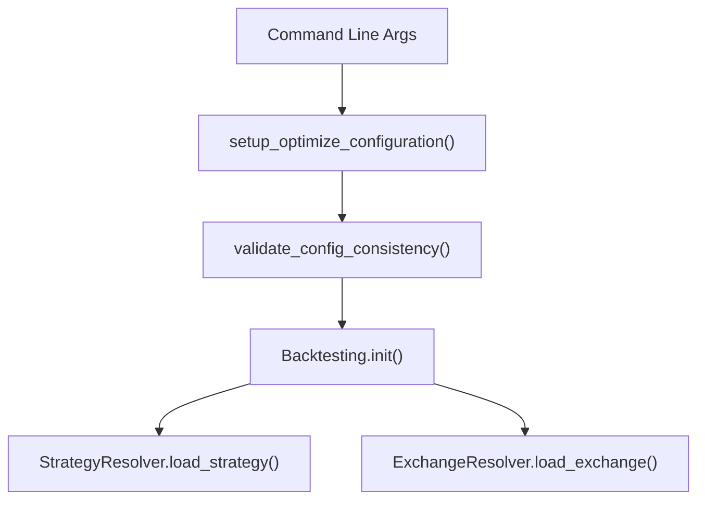

Sources: [freqtrade/commands/optimize\_commands.py15-46](https://github.com/freqtrade/freqtrade/blob/8e91fea1/freqtrade/commands/optimize_commands.py#L15-L46) [tests/optimize/test\_backtesting.py144-227](https://github.com/freqtrade/freqtrade/blob/8e91fea1/tests/optimize/test_backtesting.py#L144-L227) [tests/optimize/test\_backtesting.py283-314](https://github.com/freqtrade/freqtrade/blob/8e91fea1/tests/optimize/test_backtesting.py#L283-L314)

### Result Interpretation

#### Summary Metrics Table

The backtesting engine generates detailed performance summaries including:

| Metric | Description |
| --- | --- |
| Total Trades | Number of completed trades |
| Avg Profit % | Average profit per trade |
| Total Profit % | Overall portfolio return |
| Sharpe Ratio | Risk-adjusted return measure |
| Max Drawdown | Largest peak-to-trough decline |
| Profit Factor | Ratio of gross profit to gross loss |
| Win Rate | Percentage of profitable trades |

Sources: [docs/backtesting.md297-404](https://github.com/freqtrade/freqtrade/blob/8e91fea1/docs/backtesting.md#L297-L404) [tests/optimize/test\_optimize\_reports.py62-98](https://github.com/freqtrade/freqtrade/blob/8e91fea1/tests/optimize/test_optimize_reports.py#L62-L98)

#### Exit Reason Analysis

The system categorizes trade exits by reason to identify strategy strengths and weaknesses:

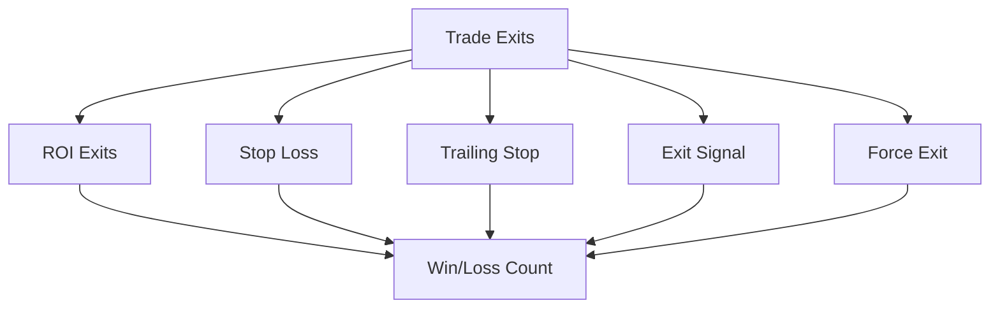

Sources: [docs/backtesting.md287-290](https://github.com/freqtrade/freqtrade/blob/8e91fea1/docs/backtesting.md#L287-L290) [tests/optimize/test\_optimize\_reports.py524-564](https://github.com/freqtrade/freqtrade/blob/8e91fea1/tests/optimize/test_optimize_reports.py#L524-L564)

## Advanced Features

### Detail Timeframe Processing

The backtesting engine supports multi-timeframe analysis using `timeframe_detail` configuration:

* **Strategy Timeframe** - Primary timeframe for strategy signals
* **Detail Timeframe** - Higher resolution timeframe for precise entry/exit timing
* **Sub-candle Analysis** - More accurate price execution simulation

Sources: [tests/optimize/test\_backtest\_detail.py876-964](https://github.com/freqtrade/freqtrade/blob/8e91fea1/tests/optimize/test_backtest_detail.py#L876-L964) [docs/backtesting.md684-690](https://github.com/freqtrade/freqtrade/blob/8e91fea1/docs/backtesting.md#L684-L690)

### Caching System

The backtesting engine implements intelligent result caching to avoid redundant computation:

**Cache Key Generation:**

The `get_strategy_run_id()` function in [freqtrade/optimize/backtest\_caching.py51-95](https://github.com/freqtrade/freqtrade/blob/8e91fea1/freqtrade/optimize/backtest_caching.py#L51-L95) generates unique identifiers:

```
```
def get_strategy_run_id(strategy: IStrategy) -> str:
    # Generates hash from:
    # - Strategy class source code
    # - Strategy file modification time
    # - freqtrade version
    # Returns unique string like "StrategyName_abc123def456"
```
```

**Caching Flow:**

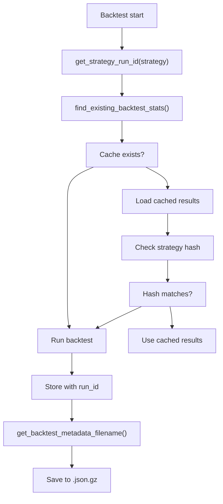

**Caching Components:**

* `run_ids` - Dictionary in `Backtesting` mapping strategy names to run ID strings
* `get_strategy_run_id()` - Hashes strategy source and metadata
* `find_existing_backtest_stats()` - Searches for matching cached result files
* `get_backtest_metadata_filename()` - Generates cache filename from run\_id
* Cache files stored in `user_data/backtest_results/` directory
* Invalidation occurs on strategy file modification, version change, or config change

**Cache Metadata Structure:**

* Strategy name and run ID
* Backtest timerange and parameters
* Strategy file hash for validation
* Result statistics and trade data
* Stored as compressed JSON (`.json.gz`)

Sources: [freqtrade/optimize/backtest\_caching.py51-95](https://github.com/freqtrade/freqtrade/blob/8e91fea1/freqtrade/optimize/backtest_caching.py#L51-L95) [freqtrade/optimize/backtesting.py129](https://github.com/freqtrade/freqtrade/blob/8e91fea1/freqtrade/optimize/backtesting.py#L129-L129) [freqtrade/data/btanalysis.py20-21](https://github.com/freqtrade/freqtrade/blob/8e91fea1/freqtrade/data/btanalysis.py#L20-L21) [tests/optimize/test\_backtesting.py26-27](https://github.com/freqtrade/freqtrade/blob/8e91fea1/tests/optimize/test_backtesting.py#L26-L27)

### Assumptions and Limitations

The backtesting system operates under several key assumptions:

1. **Perfect Execution** - All orders fill at requested prices if within `row[LOW_IDX]` to `row[HIGH_IDX]` range
2. **No Slippage** - Trades execute at exact signal prices via `_get_order_filled()`
3. **Instant Fills** - No partial fills or order delays (orders complete in single candle)
4. **Exchange Limits** - Minimum/maximum stake amounts enforced via `exchange.get_min_pair_stake_amount()`
5. **Fee Calculations** - Uses `exchange.get_fee()` or config override
6. **Data Integrity** - Assumes clean OHLCV data without gaps or errors
7. **Strategy Determinism** - Strategy signals assumed consistent across runs
8. **No Market Impact** - Orders don't affect market prices or liquidity

**Technical Limitations:**

* Backtesting runs in `dry_run=True` mode always
* Database operations use `LocalTrade` instead of persistent `Trade` objects
* No real-time data feeds or exchange connectivity during backtesting
* Limited to historical timeframes available in data files

Sources: [freqtrade/optimize/backtesting.py721-768](https://github.com/freqtrade/freqtrade/blob/8e91fea1/freqtrade/optimize/backtesting.py#L721-L768) [freqtrade/optimize/backtesting.py127-172](https://github.com/freqtrade/freqtrade/blob/8e91fea1/freqtrade/optimize/backtesting.py#L127-L172)

# Backtesting Engine

The Backtesting Engine is a core component of freqtrade that simulates trading strategies against historical market data to evaluate their performance. This system allows users to test strategy logic, optimize parameters, and analyze potential profitability before deploying strategies in live trading.

For information about hyperparameter optimization using backtesting results, see [Hyperparameter Optimization](/freqtrade/freqtrade/3.2-hyperparameter-optimization). For details about the strategy system that provides signals to the backtesting engine, see [Strategy System](/freqtrade/freqtrade/2.2-exchange-integration).

## Core Architecture

The backtesting system is built around the `Backtesting` class in [freqtrade/optimize/backtesting.py111-218](https://github.com/freqtrade/freqtrade/blob/8e91fea1/freqtrade/optimize/backtesting.py#L111-L218) which orchestrates the entire simulation process from data loading through trade execution simulation to result generation.

### Initialization and Setup

**Backtesting Class Initialization Flow:**

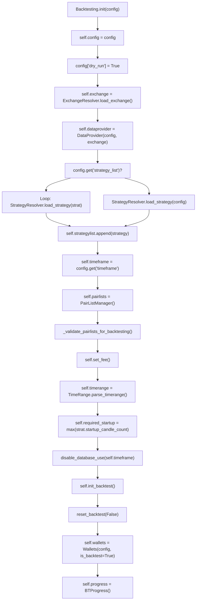

**Key Instance Variables Initialized:**

* `self.config` - Configuration dictionary with validated settings
* `self.results` - `BacktestResultType` dictionary initialized via `get_BacktestResultType_default()`
* `self.trade_id_counter` - Initialized to 0 for incremental trade IDs
* `self.order_id_counter` - Initialized to 0 for incremental order IDs
* `self.strategylist` - List of `IStrategy` instances loaded via `StrategyResolver.load_strategy()`
* `self.exchange` - Exchange instance from `ExchangeResolver.load_exchange(config, load_leverage_tiers=True)`
* `self.dataprovider` - `DataProvider(self.config, self.exchange)` instance
* `self.pairlists` - `PairListManager(exchange, config, dataprovider)` instance
* `self.wallets` - `Wallets` instance with `is_backtest=True` flag
* `self.progress` - `BTProgress()` for tracking backtest progress
* `self.timeframe` - Strategy timeframe from `config.get("timeframe")`
* `self.timerange` - `TimeRange` instance from `TimeRange.parse_timerange()`
* `self.price_pair_prec` - Empty dict for pair precision data, populated in `load_bt_data()`
* `self.detail_data` - Empty dict for detail timeframe data
* `self.futures_data` - Empty dict for futures funding/mark data

**Pairlist Validation:**
The `_validate_pairlists_for_backtesting()` method at [freqtrade/optimize/backtesting.py220-229](https://github.com/freqtrade/freqtrade/blob/8e91fea1/freqtrade/optimize/backtesting.py#L220-L229) enforces:

* Rejects `VolumePairList` (requires real-time volume data)
* Rejects `PrecisionFilter` when backtesting multiple strategies

Sources: [freqtrade/optimize/backtesting.py120-217](https://github.com/freqtrade/freqtrade/blob/8e91fea1/freqtrade/optimize/backtesting.py#L120-L217) [freqtrade/optimize/backtesting.py220-229](https://github.com/freqtrade/freqtrade/blob/8e91fea1/freqtrade/optimize/backtesting.py#L220-L229) [freqtrade/optimize/backtesting.py275-281](https://github.com/freqtrade/freqtrade/blob/8e91fea1/freqtrade/optimize/backtesting.py#L275-L281)

### Backtesting Class Structure

```mermaid
flowchart TD

BT["Backtesting"]
ST["strategylist:list[IStrategy]"]
DP["dataprovider:DataProvider"]
EX["exchange:Exchange"]
WL["wallets:Wallets"]
PROG["progress:BTProgress"]
PM["pairlists:PairListManager"]
LBTD["load_bt_data()"]
GOAL["_get_ohlcv_as_lists()"]
DD["detail_data:dict[str,DataFrame]"]
FD["futures_data:dict[str,DataFrame]"]
PPP["price_pair_prec:dict[str,Series]"]
ET["_enter_trade()"]
GEF["_get_exit_for_signal()"]
GCRS["_get_close_rate_for_stoploss()"]
GCRR["_get_close_rate_for_roi()"]
PEO["_process_exit_order()"]
CAT["_check_adjust_trade_for_candle()"]
TOO["_try_close_open_order()"]
RES["results:BacktestResultType"]
TIC["trade_id_counter:int"]
OIC["order_id_counter:int"]
ABCD["all_bt_content:dict"]
AR["analysis_results:dict"]
RUNID["run_ids:dict[str,str]"]

BT --> LBTD
BT --> GOAL
BT --> DD
BT --> FD
BT --> PPP
BT --> ET
BT --> GEF
BT --> GCRS
BT --> GCRR
BT --> PEO
BT --> CAT
BT --> TOO
BT --> RES
BT --> TIC
BT --> OIC
BT --> ABCD
BT --> AR
BT --> RUNID

subgraph State_Management ["State_Management"]
    RES
    TIC
    OIC
    ABCD
    AR
    RUNID
end

subgraph Trade_Execution ["Trade_Execution"]
    ET
    GEF
    GCRS
    GCRR
    PEO
    CAT
    TOO
end

subgraph Data_Management ["Data_Management"]
    LBTD
    GOAL
    DD
    FD
    PPP
end

subgraph Core_Components ["Core_Components"]
    BT
    ST
    DP
    EX
    WL
    PROG
    PM
    BT --> ST
    BT --> DP
    BT --> EX
    BT --> WL
    BT --> PROG
    BT --> PM
end
```

Sources: [freqtrade/optimize/backtesting.py111-217](https://github.com/freqtrade/freqtrade/blob/8e91fea1/freqtrade/optimize/backtesting.py#L111-L217) [freqtrade/optimize/backtesting.py122-137](https://github.com/freqtrade/freqtrade/blob/8e91fea1/freqtrade/optimize/backtesting.py#L122-L137)

### Backtesting Class Structure

```mermaid
flowchart TD

BT["Backtesting"]
ST["strategylist[IStrategy]"]
DP["dataprovider:DataProvider"]
EX["exchange:Exchange"]
WL["wallets:Wallets"]
PROG["progress:BTProgress"]
LBTD["load_bt_data()"]
GOAL["_get_ohlcv_as_lists()"]
DD["detail_data:dict"]
FD["futures_data:dict"]
PPP["price_pair_prec:dict"]
ET["_enter_trade()"]
GEF["_get_exit_for_signal()"]
GCR["_get_close_rate()"]
PEO["_process_exit_order()"]
CAT["_check_adjust_trade_for_candle()"]
RES["results:BacktestResultType"]
ABCD["all_bt_content:dict"]
AR["analysis_results:dict"]
GBS["generate_backtest_stats()"]
SBR["store_backtest_results()"]

BT --> LBTD
BT --> GOAL
BT --> DD
BT --> FD
BT --> PPP
BT --> ET
BT --> GEF
BT --> GCR
BT --> PEO
BT --> CAT
BT --> RES
BT --> ABCD
BT --> AR

subgraph subGraph3 ["Results & Analysis"]
    RES
    ABCD
    AR
    GBS
    SBR
    RES --> GBS
    GBS --> SBR
end

subgraph subGraph2 ["Trade Execution Engine"]
    ET
    GEF
    GCR
    PEO
    CAT
end

subgraph subGraph1 ["Data Management"]
    LBTD
    GOAL
    DD
    FD
    PPP
end

subgraph subGraph0 ["Core Backtesting Components"]
    BT
    ST
    DP
    EX
    WL
    PROG
    BT --> ST
    BT --> DP
    BT --> EX
    BT --> WL
    BT --> PROG
end
```

Sources: [freqtrade/optimize/backtesting.py111-217](https://github.com/freqtrade/freqtrade/blob/8e91fea1/freqtrade/optimize/backtesting.py#L111-L217) [freqtrade/optimize/backtesting.py303-341](https://github.com/freqtrade/freqtrade/blob/8e91fea1/freqtrade/optimize/backtesting.py#L303-L341) [freqtrade/optimize/backtesting.py458-513](https://github.com/freqtrade/freqtrade/blob/8e91fea1/freqtrade/optimize/backtesting.py#L458-L513)

### Data Flow Architecture

**Complete Backtesting Execution Sequence:**

```mermaid
sequenceDiagram
  participant start_backtesting()
  participant Backtesting
  participant history.load_data()
  participant IStrategy
  participant DataProvider
  participant LocalTrade
  participant Order
  participant Wallets
  participant optimize_reports

  start_backtesting()->>Backtesting: "Backtesting(config)"
  Backtesting->>Backtesting: "__init__() - Setup"
  start_backtesting()->>Backtesting: "start()"
  Backtesting->>Backtesting: "load_bt_data()"
  Backtesting->>history.load_data(): "history.load_data(datadir, pairs, timeframe)"
  history.load_data()-->>Backtesting: "dict[pair, DataFrame]"
  note over Backtesting: "Load detail_data and futures_data if needed"
  Backtesting->>Backtesting: "_load_bt_data_detail()"
  loop ["For Each Pair"]
    Backtesting->>IStrategy: "_set_strategy(strategy)"
    Backtesting->>IStrategy: "strategy.dp = dataprovider"
    Backtesting->>IStrategy: "strategy.wallets = wallets"
    Backtesting->>IStrategy: "strategy.ft_bot_start()"
    Backtesting->>Backtesting: "_get_ohlcv_as_lists(processed)"
    Backtesting->>IStrategy: "strategy.ft_advise_signals(pair_data, {'pair': pair})"
    IStrategy-->>Backtesting: "DataFrame with enter_long/exit_long columns"
    Backtesting->>DataProvider: "dataprovider._set_cached_df(pair, timeframe, df)"
    Backtesting->>Backtesting: "trim_dataframe(df, timerange, startup_candles)"
    note over Backtesting: "Convert DataFrame to list[tuple] for performance"
    Backtesting->>Backtesting: "backtest(processed, start_date, end_date)"
    Backtesting->>IStrategy: "strategy.confirm_trade_entry()"
    Backtesting->>Backtesting: "_enter_trade(pair, row, direction, stake_amount)"
    Backtesting->>LocalTrade: "LocalTrade.open()"
    Backtesting->>Order: "Order(ft_trade_id, order_date, ft_is_open=True)"
    Backtesting->>LocalTrade: "trade.orders.append(order)"
    Backtesting->>Wallets: "wallets.update()"
    Backtesting->>Backtesting: "_try_close_open_order(order, trade, current_date, row)"
    Backtesting->>Order: "order.close_bt_order(current_date, trade)"
    Backtesting->>Backtesting: "_check_adjust_trade_for_candle(trade, row, current_time)"
    Backtesting->>IStrategy: "strategy._adjust_trade_position_internal()"
    Backtesting->>Backtesting: "_get_exit_trade(trade, row, current_time)"
    Backtesting->>Backtesting: "_get_exit_for_signal(trade, row, exit_, current_time)"
    Backtesting->>Backtesting: "_get_close_rate(row, trade, current_time, exit_, trade_dur)"
    Backtesting->>IStrategy: "strategy.confirm_trade_exit()"
    Backtesting->>Backtesting: "_exit_trade(trade, row, close_rate, amount, exit_reason)"
    Backtesting->>Order: "Order(ft_is_open=True, ft_order_side='sell')"
    Backtesting->>Backtesting: "_process_exit_order(order, trade, current_time, row, pair)"
    Backtesting->>LocalTrade: "LocalTrade.close_bt_trade(trade)"
    Backtesting->>Wallets: "wallets.update()"
    Backtesting->>Backtesting: "check_abort()"
    Backtesting->>Backtesting: "Store results in self.results[strategy_name]"
  end
  Backtesting->>optimize_reports: "generate_backtest_stats(data, results, min_date, max_date)"
  optimize_reports-->>Backtesting: "dict with 'strategy' and 'strategy_comparison'"
  Backtesting->>optimize_reports: "store_backtest_results(config, stats, datetime_str)"
  Backtesting->>optimize_reports: "show_backtest_results(results, stake_currency)"
  Backtesting-->>start_backtesting(): "Complete"
```

Sources: [freqtrade/optimize/backtesting.py1133-1260](https://github.com/freqtrade/freqtrade/blob/8e91fea1/freqtrade/optimize/backtesting.py#L1133-L1260) [freqtrade/optimize/backtesting.py1262-1400](https://github.com/freqtrade/freqtrade/blob/8e91fea1/freqtrade/optimize/backtesting.py#L1262-L1400) [freqtrade/optimize/backtesting.py463-518](https://github.com/freqtrade/freqtrade/blob/8e91fea1/freqtrade/optimize/backtesting.py#L463-L518) [freqtrade/optimize/backtesting.py753-803](https://github.com/freqtrade/freqtrade/blob/8e91fea1/freqtrade/optimize/backtesting.py#L753-L803) [freqtrade/optimize/optimize\_reports.py53-59](https://github.com/freqtrade/freqtrade/blob/8e91fea1/freqtrade/optimize/optimize_reports.py#L53-L59)

## Key Components

### Backtesting Class

The `Backtesting` class serves as the main orchestrator for the backtesting process. It manages strategy execution, trade simulation, and result compilation.

**Key Methods:**

* `start()` - Main entry point that coordinates the entire backtesting process
* `backtest()` - Core simulation loop processing historical data candle by candle
* `_enter_trade()` - Simulates opening new positions based on strategy signals
* `_get_exit_for_signal()` - Evaluates exit conditions for open trades
* `load_bt_data()` - Loads and prepares historical market data
* `_get_ohlcv_as_lists()` - Converts DataFrames to lists for performance optimization
* `prepare_backtest()` - Initializes backtesting state and resets counters

**Key Properties:**

* `results` - BacktestResultType containing all backtest results
* `trade_id_counter` - Incremental counter for trade IDs
* `order_id_counter` - Incremental counter for order IDs
* `progress` - BTProgress instance for tracking backtest progress
* `abort` - Flag for stopping backtest execution

Sources: [freqtrade/optimize/backtesting.py111-229](https://github.com/freqtrade/freqtrade/blob/8e91fea1/freqtrade/optimize/backtesting.py#L111-L229) [freqtrade/optimize/backtesting.py291-329](https://github.com/freqtrade/freqtrade/blob/8e91fea1/freqtrade/optimize/backtesting.py#L291-L329) [freqtrade/optimize/backtesting.py417-436](https://github.com/freqtrade/freqtrade/blob/8e91fea1/freqtrade/optimize/backtesting.py#L417-L436)

### Trade Simulation Engine

The trade simulation engine handles the mechanics of simulating trade execution within the backtesting environment.

#### Entry Logic

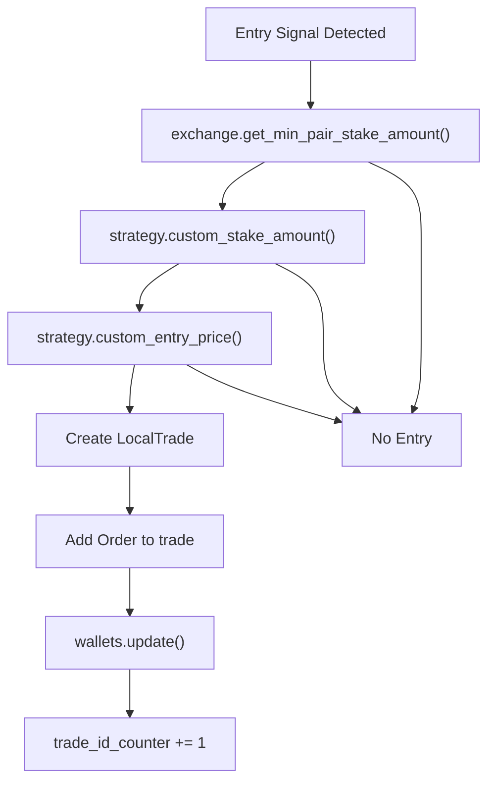

Sources: [freqtrade/optimize/backtesting.py887-1051](https://github.com/freqtrade/freqtrade/blob/8e91fea1/freqtrade/optimize/backtesting.py#L887-L1051) [tests/optimize/test\_backtesting.py525-586](https://github.com/freqtrade/freqtrade/blob/8e91fea1/tests/optimize/test_backtesting.py#L525-L586)

#### Exit Logic

**Exit Condition Evaluation Flow:**

The `_get_exit_trade()` method at [freqtrade/optimize/backtesting.py1402-1549](https://github.com/freqtrade/freqtrade/blob/8e91fea1/freqtrade/optimize/backtesting.py#L1402-L1549) evaluates exit conditions in this priority order:

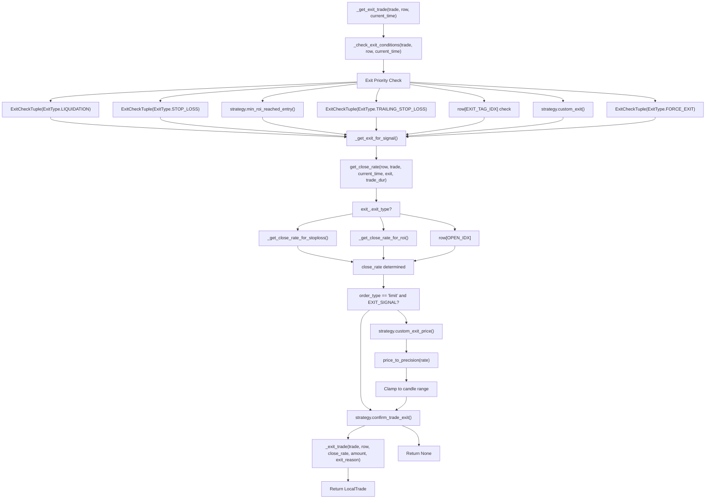

**Exit Type Implementation Details:**

| Exit Type | Code Location | Price Calculation Method | Special Handling |
| --- | --- | --- | --- |
| `LIQUIDATION` | [freqtrade/optimize/backtesting.py1424-1426](https://github.com/freqtrade/freqtrade/blob/8e91fea1/freqtrade/optimize/backtesting.py#L1424-L1426) | `trade.liquidation_price` from `_get_close_rate_for_stoploss()` | Futures only, highest priority |
| `STOP_LOSS` | [freqtrade/optimize/backtesting.py1444-1451](https://github.com/freqtrade/freqtrade/blob/8e91fea1/freqtrade/optimize/backtesting.py#L1444-L1451) | `trade.stop_loss` via `_get_close_rate_for_stoploss()` | Checks if `current_rate < stop_loss` (long) or `> stop_loss` (short) |
| `TRAILING_STOP_LOSS` | [freqtrade/optimize/backtesting.py1453-1469](https://github.com/freqtrade/freqtrade/blob/8e91fea1/freqtrade/optimize/backtesting.py#L1453-L1469) | `trade.stop_loss` updated by `ft_stoploss_adjust()` | Dynamic stop loss, worst-case for same-candle trades |
| `ROI` | [freqtrade/optimize/backtesting.py1489-1504](https://github.com/freqtrade/freqtrade/blob/8e91fea1/freqtrade/optimize/backtesting.py#L1489-L1504) | Calculated from `strategy.min_roi_reached_entry()` | Fee-adjusted calculation via `_get_close_rate_for_roi()` |
| `EXIT_SIGNAL` | [freqtrade/optimize/backtesting.py1506-1522](https://github.com/freqtrade/freqtrade/blob/8e91fea1/freqtrade/optimize/backtesting.py#L1506-L1522) | `row[OPEN_IDX]` with optional `custom_exit_price()` | Reads `row[EXIT_TAG_IDX]` for exit reason string |
| `CUSTOM_EXIT` | [freqtrade/optimize/backtesting.py1524-1535](https://github.com/freqtrade/freqtrade/blob/8e91fea1/freqtrade/optimize/backtesting.py#L1524-L1535) | `row[OPEN_IDX]` with optional `custom_exit_price()` | From `strategy.custom_exit()` callback |
| `PARTIAL_EXIT` | [freqtrade/optimize/backtesting.py709-734](https://github.com/freqtrade/freqtrade/blob/8e91fea1/freqtrade/optimize/backtesting.py#L709-L734) | `row[OPEN_IDX]`, partial amount | From `adjust_trade_position()` with negative stake |
| `FORCE_EXIT` | [freqtrade/optimize/backtesting.py1537-1547](https://github.com/freqtrade/freqtrade/blob/8e91fea1/freqtrade/optimize/backtesting.py#L1537-L1547) | `row[OPEN_IDX]` | Mandatory exit at timerange end |

**Stop Loss Special Cases in `_get_close_rate_for_stoploss()`:**

From [freqtrade/optimize/backtesting.py543-595](https://github.com/freqtrade/freqtrade/blob/8e91fea1/freqtrade/optimize/backtesting.py#L543-L595):

1. If stop loss is already beyond candle range, exits at `row[OPEN_IDX]` (lines 557-562)
2. For trailing stop on trade open candle (`trade_dur == 0`):
   * With `trailing_only_offset_is_reached` and offset met: calculates worst-case as price reaching offset then dropping (lines 567-580)
   * Otherwise: worst-case as price ticking above open then dropping to stop (lines 582-585)
3. Clamps result to `max(row[LOW_IDX], stop_rate)` for longs or `min(row[HIGH_IDX], stop_rate)` for shorts (lines 588-592)

**ROI Special Cases in `_get_close_rate_for_roi()`:**

From [freqtrade/optimize/backtesting.py597-667](https://github.com/freqtrade/freqtrade/blob/8e91fea1/freqtrade/optimize/backtesting.py#L597-L667):

1. Force exit with `roi == -1` on timeframe-aligned time uses `row[OPEN_IDX]` (lines 614-618)
2. Calculates theoretical close rate from ROI percentage: `close_rate = -(roi_rate + open_fee_rate) / (fee_close - side_1)` (lines 620-623)
3. New ROI entry on candle-aligned time uses `row[OPEN_IDX]` if more favorable (lines 628-636)
4. Opening candle ROI validation prevents impossible green/red candle exits (lines 638-658)
5. Final result clamped: `min(max(close_rate, row[LOW_IDX]), row[HIGH_IDX])` (line 663)

Sources: [freqtrade/optimize/backtesting.py1402-1549](https://github.com/freqtrade/freqtrade/blob/8e91fea1/freqtrade/optimize/backtesting.py#L1402-L1549) [freqtrade/optimize/backtesting.py543-595](https://github.com/freqtrade/freqtrade/blob/8e91fea1/freqtrade/optimize/backtesting.py#L543-L595) [freqtrade/optimize/backtesting.py597-667](https://github.com/freqtrade/freqtrade/blob/8e91fea1/freqtrade/optimize/backtesting.py#L597-L667) [freqtrade/optimize/backtesting.py805-883](https://github.com/freqtrade/freqtrade/blob/8e91fea1/freqtrade/optimize/backtesting.py#L805-L883) [tests/optimize/test\_backtest\_detail.py41-158](https://github.com/freqtrade/freqtrade/blob/8e91fea1/tests/optimize/test_backtest_detail.py#L41-L158)

### Performance Analysis

#### Metrics Generation

The backtesting engine generates comprehensive performance metrics through several specialized functions:

**Core Metric Functions:**

* `generate_backtest_stats()` - Primary statistics compilation from `BacktestResultType`
* `generate_pair_metrics()` - Per-trading-pair performance analysis
* `generate_daily_stats()` - Day-by-day performance breakdown using `resample()`
* `generate_trading_stats()` - Trade-specific statistics and win/loss ratios
* `calc_streak()` - Consecutive win/loss calculations using pandas operations
* `generate_strategy_stats()` - Strategy comparison metrics

**Performance Metrics Structure:**

* Trade counts and percentages (wins, draws, losses)
* Profit calculations (absolute and percentage)
* Risk metrics (max drawdown, Sharpe ratio)
* Duration statistics (average, median holding times)
* Daily and periodic breakdowns

Sources: [freqtrade/optimize/optimize\_reports53-58](https://github.com/freqtrade/freqtrade/blob/8e91fea1/freqtrade/optimize/optimize_reports#L53-L58) [tests/optimize/test\_optimize\_reports.py101-259](https://github.com/freqtrade/freqtrade/blob/8e91fea1/tests/optimize/test_optimize_reports.py#L101-L259) [freqtrade/optimize/optimize\_reports/optimize\_reports.py36-38](https://github.com/freqtrade/freqtrade/blob/8e91fea1/freqtrade/optimize/optimize_reports/optimize_reports.py#L36-L38)

#### Result Storage and Export


**Export File Structure:**

* `btresult.json` - Complete backtest statistics and trade data
* `market_change.feather` - Market movement data in pandas format
* `strategy.py` - Copy of the strategy file used
* `config.json` - Configuration snapshot
* `*.json` - Additional metadata files
* Result files named with format: `btresult-YYYY_MM_DD_HH_MM_SS.zip`

**Key Export Functions:**

* `store_backtest_results()` - Main export orchestrator
* `get_latest_backtest_filename()` - Retrieves most recent result file
* `load_backtest_stats()` - Loads results from ZIP files

Sources: [freqtrade/optimize/optimize\_reports22-31](https://github.com/freqtrade/freqtrade/blob/8e91fea1/freqtrade/optimize/optimize_reports#L22-L31) [tests/optimize/test\_optimize\_reports.py234-258](https://github.com/freqtrade/freqtrade/blob/8e91fea1/tests/optimize/test_optimize_reports.py#L234-L258) [freqtrade/data/btanalysis.py16-20](https://github.com/freqtrade/freqtrade/blob/8e91fea1/freqtrade/data/btanalysis.py#L16-L20)

## Testing Framework

### Test Containers

The backtesting system uses specialized test containers for validation:

**BTContainer Structure:**

* `data` - OHLCV candle data with entry/exit signals as `list[list[float]]`
* `stop_loss` - Stop loss percentage
* `roi` - Return on investment targets as `dict[str, float]`
* `trades` - Expected trade outcomes as `list[BTrade]`
* `profit_perc` - Expected profit percentage
* `trailing_stop` - Boolean for trailing stop functionality
* `use_exit_signal` - Boolean for exit signal usage
* `leverage` - Leverage multiplier (default 1.0)

**BTrade Structure:**

* `exit_reason` - `ExitType` enum (ROI, STOP\_LOSS, TRAILING\_STOP\_LOSS, etc.)
* `open_tick` - Candle index where trade opens (int)
* `close_tick` - Candle index where trade closes (int)
* `enter_tag` - Optional entry signal identifier (str | None)
* `is_short` - Whether trade is a short position (bool)

**Test Data Format:**

```
# D   O     H     L     C    V    EL XL ES Xs
[0, 5000, 5025, 4975, 4987, 6172, 1, 0, 0, 0]
```

Where: Date, Open, High, Low, Close, Volume, Enter\_Long, Exit\_Long, Enter\_Short, Exit\_Short

Sources: [tests/optimize/\_\_init\_\_.py15-50](https://github.com/freqtrade/freqtrade/blob/8e91fea1/tests/optimize/__init__.py#L15-L50) [tests/optimize/test\_backtest\_detail.py23-38](https://github.com/freqtrade/freqtrade/blob/8e91fea1/tests/optimize/test_backtest_detail.py#L23-L38) [tests/optimize/test\_backtest\_detail.py57-86](https://github.com/freqtrade/freqtrade/blob/8e91fea1/tests/optimize/test_backtest_detail.py#L57-L86)

### Test Scenarios

The testing framework includes comprehensive scenarios covering:

**Core Test Cases (tc0-tc13):**

1. **Stop Loss Triggers** - 1%, 2%, 3% stop loss activation scenarios
2. **ROI Exits** - Return on investment target achievements (3%, 5%, 6% ROI)
3. **Trailing Stops** - Dynamic stop loss with `trailing_stop_positive_offset`
4. **Signal Priority** - Exit signal vs ROI vs stop loss precedence
5. **Same-Candle Scenarios** - Entry and exit in identical candle (`tc13`)
6. **Multi-Trade Sequences** - Multiple consecutive trades (`tc3`)

**Advanced Scenarios:**

* **Leverage Testing** - Futures trading with leverage multipliers
* **Detail Timeframe** - Sub-candle analysis with higher resolution data
* **Custom Functions** - `custom_entry_price()` and `custom_exit_price()` validation
* **Position Adjustment** - DCA (Dollar Cost Averaging) scenarios
* **Edge Cases** - Precision handling, fee calculations, wallet updates

**Test Execution:**

* `_build_backtest_dataframe()` - Converts test data to DataFrame format
* `_get_frame_time_from_offset()` - Generates timestamps for test candles
* Test containers executed via `Backtesting.backtest()` method

Sources: [tests/optimize/test\_backtest\_detail.py41-695](https://github.com/freqtrade/freqtrade/blob/8e91fea1/tests/optimize/test_backtest_detail.py#L41-L695) [tests/optimize/\_\_init\_\_.py52-86](https://github.com/freqtrade/freqtrade/blob/8e91fea1/tests/optimize/__init__.py#L52-L86) [tests/optimize/test\_backtesting.py1100-1300](https://github.com/freqtrade/freqtrade/blob/8e91fea1/tests/optimize/test_backtesting.py#L1100-L1300)

## Configuration and Execution

### Command Line Interface

The backtesting engine supports extensive configuration through command-line arguments via `setup_optimize_configuration()`:

**Key Parameters:**

* `--strategy` - Strategy class to backtest (loaded via `StrategyResolver`)
* `--timeframe` - Candle timeframe for analysis (e.g., "5m", "1h")
* `--timerange` - Historical data range using `TimeRange.parse_timerange()`
* `--dry-run-wallet` - Starting balance for simulation
* `--export` - Result export format ("signals", "trades", "none")
* `--fee` - Custom trading fee override (float percentage)
* `--enable-position-stacking` - Allow multiple positions per pair
* `--strategy-list` - Multiple strategies for comparison
* `--exportfilename` - Custom export filename

**Configuration Flow:**


Sources: [freqtrade/commands/optimize\_commands.py15-46](https://github.com/freqtrade/freqtrade/blob/8e91fea1/freqtrade/commands/optimize_commands.py#L15-L46) [tests/optimize/test\_backtesting.py144-227](https://github.com/freqtrade/freqtrade/blob/8e91fea1/tests/optimize/test_backtesting.py#L144-L227) [tests/optimize/test\_backtesting.py283-314](https://github.com/freqtrade/freqtrade/blob/8e91fea1/tests/optimize/test_backtesting.py#L283-L314)

### Result Interpretation

#### Summary Metrics Table

The backtesting engine generates detailed performance summaries including:

| Metric | Description |
| --- | --- |
| Total Trades | Number of completed trades |
| Avg Profit % | Average profit per trade |
| Total Profit % | Overall portfolio return |
| Sharpe Ratio | Risk-adjusted return measure |
| Max Drawdown | Largest peak-to-trough decline |
| Profit Factor | Ratio of gross profit to gross loss |
| Win Rate | Percentage of profitable trades |

Sources: [docs/backtesting.md297-404](https://github.com/freqtrade/freqtrade/blob/8e91fea1/docs/backtesting.md#L297-L404) [tests/optimize/test\_optimize\_reports.py62-98](https://github.com/freqtrade/freqtrade/blob/8e91fea1/tests/optimize/test_optimize_reports.py#L62-L98)

#### Exit Reason Analysis

The system categorizes trade exits by reason to identify strategy strengths and weaknesses:


Sources: [docs/backtesting.md287-290](https://github.com/freqtrade/freqtrade/blob/8e91fea1/docs/backtesting.md#L287-L290) [tests/optimize/test\_optimize\_reports.py524-564](https://github.com/freqtrade/freqtrade/blob/8e91fea1/tests/optimize/test_optimize_reports.py#L524-L564)

## Advanced Features

### Detail Timeframe Processing

The backtesting engine supports multi-timeframe analysis using `timeframe_detail` configuration:

* **Strategy Timeframe** - Primary timeframe for strategy signals
* **Detail Timeframe** - Higher resolution timeframe for precise entry/exit timing
* **Sub-candle Analysis** - More accurate price execution simulation

Sources: [tests/optimize/test\_backtest\_detail.py876-964](https://github.com/freqtrade/freqtrade/blob/8e91fea1/tests/optimize/test_backtest_detail.py#L876-L964) [docs/backtesting.md684-690](https://github.com/freqtrade/freqtrade/blob/8e91fea1/docs/backtesting.md#L684-L690)

### Caching System

The backtesting engine implements intelligent result caching to avoid redundant computations when running identical backtests.

**Cache Key Generation Flow:**

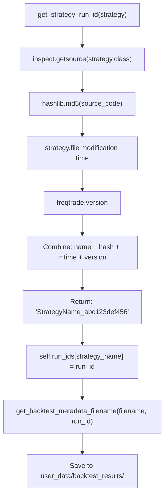

**Caching Components:**

| Component | Code Location | Purpose |
| --- | --- | --- |
| `get_strategy_run_id()` | [freqtrade/optimize/backtest\_caching.py51-95](https://github.com/freqtrade/freqtrade/blob/8e91fea1/freqtrade/optimize/backtest_caching.py#L51-L95) | Generates unique cache key from strategy source, mtime, version |
| `self.run_ids` | [freqtrade/optimize/backtesting.py130](https://github.com/freqtrade/freqtrade/blob/8e91fea1/freqtrade/optimize/backtesting.py#L130-L130) | Dictionary mapping strategy names to run ID strings |
| `find_existing_backtest_stats()` | [freqtrade/data/btanalysis.py229-267](https://github.com/freqtrade/freqtrade/blob/8e91fea1/freqtrade/data/btanalysis.py#L229-L267) | Searches for cached backtest results matching run\_id |
| `get_backtest_metadata_filename()` | [freqtrade/optimize/backtest\_caching.py18-48](https://github.com/freqtrade/freqtrade/blob/8e91fea1/freqtrade/optimize/backtest_caching.py#L18-L48) | Constructs metadata filename with run\_id suffix |

**Cache Validation Process:**

From [freqtrade/optimize/backtesting.py1133-1260](https://github.com/freqtrade/freqtrade/blob/8e91fea1/freqtrade/optimize/backtesting.py#L1133-L1260):

1. `get_strategy_run_id(strategy)` computes cache key from strategy source hash
2. `find_existing_backtest_stats(config['exportdirectory'], strategy_name, run_id)` checks for cached results
3. If found, loads from `.meta.json` file and validates:
   * Strategy file hasn't changed (mtime check)
   * Freqtrade version matches
   * Configuration parameters match
4. If validation passes, skips backtest execution and uses cached data
5. Otherwise, runs backtest and stores with new run\_id

**Cache Storage Format:**

* Primary file: `backtest-result-TIMESTAMP.zip` contains trade data
* Metadata file: `backtest-result-TIMESTAMP.meta.json` contains run\_id and validation data
* Stored in `config['exportdirectory']` (default: `user_data/backtest_results/`)
* Run ID included in metadata as: `{"run_id": "StrategyName_hash_mtime_version"}`

**Cache Invalidation Triggers:**

* Strategy file modification (detected via `os.path.getmtime(strategy.__file__)`)
* Strategy source code changes (detected via `inspect.getsource()` hash)
* Freqtrade version upgrade (from `freqtrade.__version__`)
* Configuration parameter changes (timerange, pairs, timeframe, etc.)

Sources: [freqtrade/optimize/backtest\_caching.py51-95](https://github.com/freqtrade/freqtrade/blob/8e91fea1/freqtrade/optimize/backtest_caching.py#L51-L95) [freqtrade/optimize/backtesting.py130](https://github.com/freqtrade/freqtrade/blob/8e91fea1/freqtrade/optimize/backtesting.py#L130-L130) [freqtrade/data/btanalysis.py229-267](https://github.com/freqtrade/freqtrade/blob/8e91fea1/freqtrade/data/btanalysis.py#L229-L267) [freqtrade/optimize/backtest\_caching.py18-48](https://github.com/freqtrade/freqtrade/blob/8e91fea1/freqtrade/optimize/backtest_caching.py#L18-L48) [tests/optimize/test\_backtesting.py26](https://github.com/freqtrade/freqtrade/blob/8e91fea1/tests/optimize/test_backtesting.py#L26-L26)

### Assumptions and Limitations

The backtesting system operates under several key assumptions:

1. **Perfect Execution** - All orders fill at requested prices within candle high/low range
2. **No Slippage** - Trades execute at exact signal prices
3. **Instant Fills** - No partial fills or order delays
4. **Exchange Limits** - Trading pair limits are respected
5. **Fee Calculations** - Uses exchange default fees unless overridden

Sources: [docs/backtesting.md461-469](https://github.com/freqtrade/freqtrade/blob/8e91fea1/docs/backtesting.md#L461-L469)