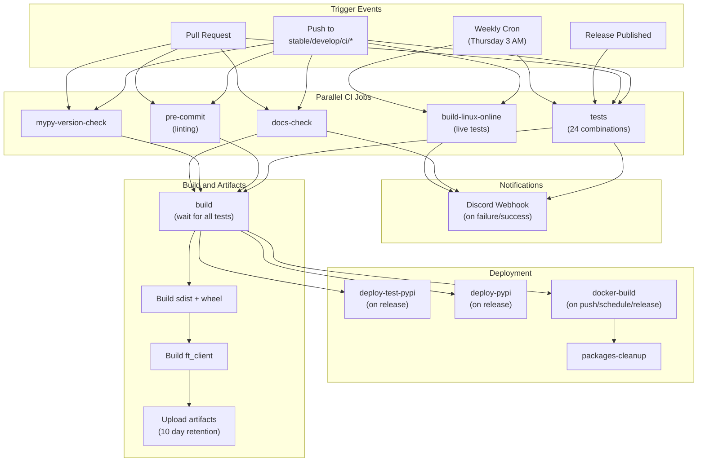
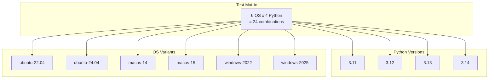
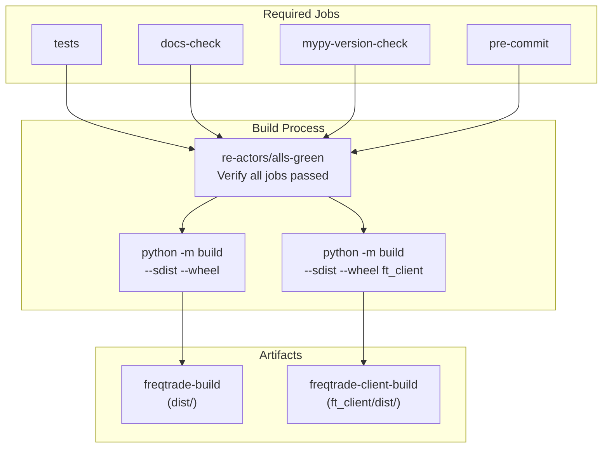
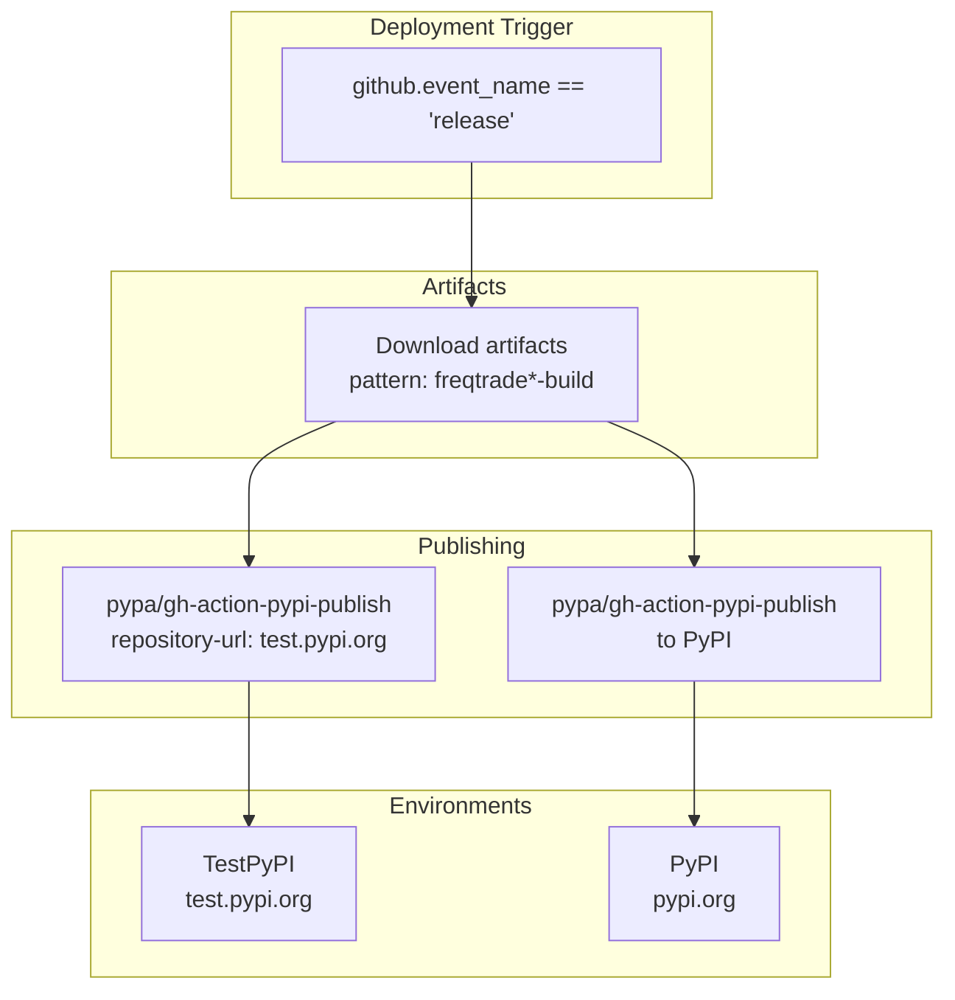
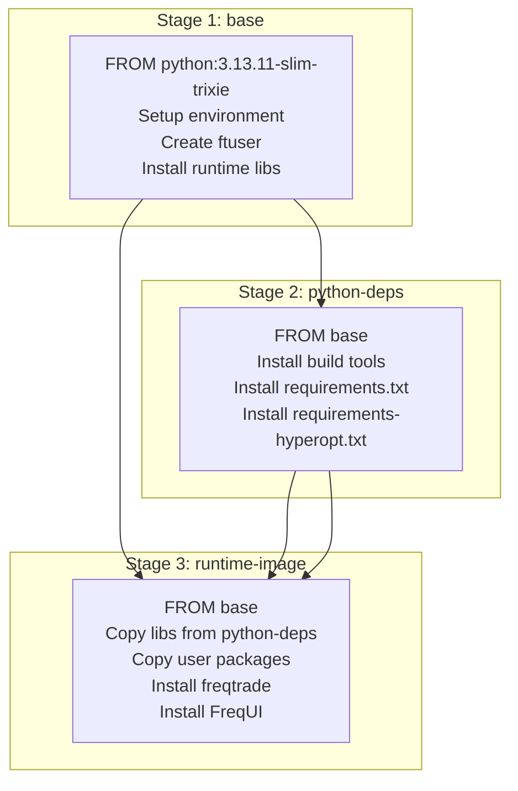
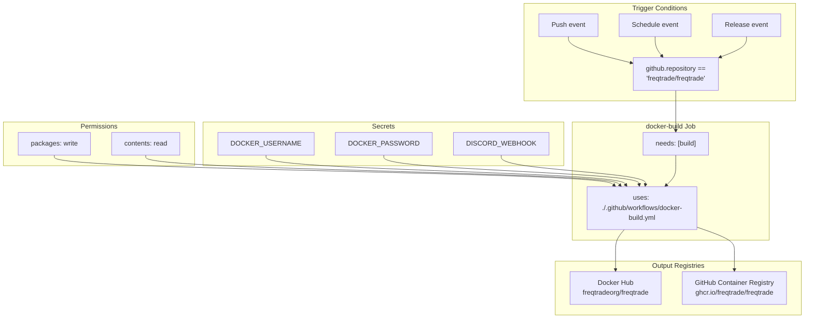
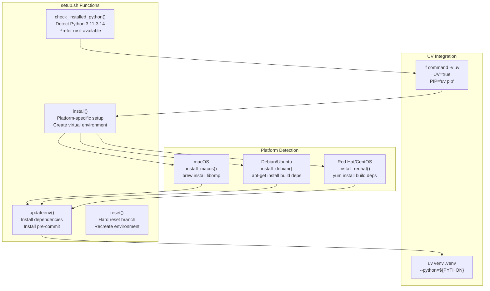

# CI/CD Pipeline and Docker

Relevant source files

* [.github/workflows/ci.yml](https://github.com/freqtrade/freqtrade/blob/8e91fea1/.github/workflows/ci.yml)
* [Dockerfile](https://github.com/freqtrade/freqtrade/blob/8e91fea1/Dockerfile)
* [docker/Dockerfile.armhf](https://github.com/freqtrade/freqtrade/blob/8e91fea1/docker/Dockerfile.armhf)
* [setup.sh](https://github.com/freqtrade/freqtrade/blob/8e91fea1/setup.sh)

## Purpose and Scope

This document describes Freqtrade's continuous integration and deployment infrastructure, including the GitHub Actions CI/CD pipeline and Docker containerization system. It covers the automated testing workflow, build matrix, artifact generation, and deployment to PyPI and Docker registries.

For local development environment setup including pre-commit hooks and tooling configuration, see [Development Environment Setup](/freqtrade/freqtrade/6.1-development-environment-setup). For detailed information about testing infrastructure and code quality tools, see [Code Quality and Testing](/freqtrade/freqtrade/6.3-code-quality-and-testing).

---

## CI/CD Pipeline Architecture

Freqtrade uses GitHub Actions for continuous integration, testing, and deployment. The pipeline is defined in [.github/workflows/ci.yml1-440](https://github.com/freqtrade/freqtrade/blob/8e91fea1/.github/workflows/ci.yml#L1-L440) and orchestrates multiple jobs that run in parallel to validate code quality, execute tests across multiple platforms, build distribution packages, and deploy releases.



**Sources:** [.github/workflows/ci.yml1-440](https://github.com/freqtrade/freqtrade/blob/8e91fea1/.github/workflows/ci.yml#L1-L440)

---

## Primary CI Jobs

### tests Job

The main test job runs across a matrix of operating systems and Python versions, executing comprehensive test suites and code quality checks.



**Test Job Steps:**

| Step | Description | Key Commands |
| --- | --- | --- |
| Checkout | Clone repository | `actions/checkout@v6.0.1` |
| Setup Python | Install Python version | `actions/setup-python@v6` |
| Install uv | Install uv package manager | `astral-sh/setup-uv@v7.1.6` |
| macOS Brew Install | Install libomp on macOS | `brew install libomp` |
| Python Installation | Install dependencies | `uv pip install -r requirements-dev.txt` |
| Version Alignment Check | Verify client version matches | `python build_helpers/freqtrade_client_version_align.py` |
| Tests | Run pytest suite | `pytest --random-order --durations 20 -n auto` |
| Coverage Tests | Run with coverage (Linux 3.12 only) | `pytest --cov=freqtrade --cov=freqtrade_client` |
| Schema Extract | Generate JSON schema | `python build_helpers/extract_config_json_schema.py` |
| Command Docs Extract | Generate command documentation | `python build_helpers/create_command_partials.py` |
| Repository Check | Ensure no uncommitted changes | `git status --porcelain` |
| Backtesting Tests | Run backtesting integration | `freqtrade backtesting --strategy-list AwesomeStrategy` |
| Hyperopt Tests | Run hyperopt integration | `freqtrade hyperopt -e 6 --strategy SampleStrategy` |
| isort Check | Verify import sorting | `isort --check .` |
| Ruff Check | Run linter | `ruff check --output-format=github` |
| Ruff Format Check | Verify code formatting | `ruff format --check` |
| Mypy | Type checking | `mypy freqtrade scripts tests` |
| Pester Tests (Windows) | PowerShell tests | `Invoke-Pester -Path "tests" -CI` |

**Sources:** [.github/workflows/ci.yml22-176](https://github.com/freqtrade/freqtrade/blob/8e91fea1/.github/workflows/ci.yml#L22-L176)

### Test Matrix Configuration

The test matrix is defined at [.github/workflows/ci.yml26-28](https://github.com/freqtrade/freqtrade/blob/8e91fea1/.github/workflows/ci.yml#L26-L28):

```
```
matrix:
  os: [ "ubuntu-22.04", "ubuntu-24.04", "macos-14", "macos-15" , "windows-2022", "windows-2025" ]
  python-version: ["3.11", "3.12", "3.13", "3.14"]
```
```

**Special Configuration:**

* **Coverage reporting**: Only runs on `ubuntu-24.04` with Python `3.12` [.github/workflows/ci.yml72-76](https://github.com/freqtrade/freqtrade/blob/8e91fea1/.github/workflows/ci.yml#L72-L76)
* **Mypy type checking**: Only runs on `ubuntu-24.04` and `macos-15` [.github/workflows/ci.yml153-155](https://github.com/freqtrade/freqtrade/blob/8e91fea1/.github/workflows/ci.yml#L153-L155)
* **PowerShell tests**: Only run on Windows platforms [.github/workflows/ci.yml157-167](https://github.com/freqtrade/freqtrade/blob/8e91fea1/.github/workflows/ci.yml#L157-L167)

**Sources:** [.github/workflows/ci.yml22-176](https://github.com/freqtrade/freqtrade/blob/8e91fea1/.github/workflows/ci.yml#L22-L176)

---

## Code Quality Jobs

### pre-commit Job

Runs pre-commit hooks including additional linting and formatting checks not covered in the main test job.

**Configuration:**

* OS: `ubuntu-22.04`
* Python: `3.12`
* Action: `pre-commit/action@v3.0.1`

**Sources:** [.github/workflows/ci.yml195-206](https://github.com/freqtrade/freqtrade/blob/8e91fea1/.github/workflows/ci.yml#L195-L206)

### mypy-version-check Job

Validates that mypy version constraints are correctly configured across all requirement files.

**Steps:**

1. Install `pyaml`
2. Run `python build_helpers/pre_commit_update.py`

**Sources:** [.github/workflows/ci.yml177-194](https://github.com/freqtrade/freqtrade/blob/8e91fea1/.github/workflows/ci.yml#L177-L194)

### docs-check Job

Validates documentation syntax and builds the MkDocs documentation site.

**Steps:**

1. Run documentation syntax checks: `./tests/test_docs.sh`
2. Install docs dependencies: `pip install -r docs/requirements-docs.txt`
3. Build documentation: `mkdocs build`

**Sources:** [.github/workflows/ci.yml208-236](https://github.com/freqtrade/freqtrade/blob/8e91fea1/.github/workflows/ci.yml#L208-L236)

### build-linux-online Job

Runs extended tests including live exchange compatibility checks.

**Key Features:**

* Uses HTTP proxy for external requests: `CI_WEB_PROXY: http://152.67.66.8:13128`
* Runs with `--longrun` flag for extended tests
* Command: `pytest --random-order --longrun --durations 20 -n auto`

**Sources:** [.github/workflows/ci.yml239-274](https://github.com/freqtrade/freqtrade/blob/8e91fea1/.github/workflows/ci.yml#L239-L274)

---

## Build and Artifact Generation

The `build` job aggregates results from all test jobs and creates distribution packages.



**Build Steps:**

1. **Dependency Check** [.github/workflows/ci.yml319-322](https://github.com/freqtrade/freqtrade/blob/8e91fea1/.github/workflows/ci.yml#L319-L322)

   * Uses `re-actors/alls-green@v1.2.2` to verify all required jobs succeeded
   * Fails the build if any dependency job failed
2. **Main Package Build** [.github/workflows/ci.yml333-344](https://github.com/freqtrade/freqtrade/blob/8e91fea1/.github/workflows/ci.yml#L333-L344)

   * Installs build tools: `pip install -U build`
   * Creates source distribution and wheel: `python -m build --sdist --wheel`
   * Uploads to `freqtrade-build` artifact with 10-day retention
3. **Client Package Build** [.github/workflows/ci.yml346-357](https://github.com/freqtrade/freqtrade/blob/8e91fea1/.github/workflows/ci.yml#L346-L357)

   * Builds `ft_client` package: `python -m build --sdist --wheel ft_client`
   * Uploads to `freqtrade-client-build` artifact with 10-day retention

**Sources:** [.github/workflows/ci.yml306-357](https://github.com/freqtrade/freqtrade/blob/8e91fea1/.github/workflows/ci.yml#L306-L357)

---

## PyPI Deployment Pipeline

Distribution packages are published to PyPI on release events.



### deploy-test-pypi Job

**Configuration:**

* Trigger: `github.event_name == 'release'`
* Environment: `testpypi`
* URL: `https://test.pypi.org/p/freqtrade`
* Permissions: `id-token: write` (for trusted publishing)

**Steps:**

1. Download build artifacts with pattern `freqtrade*-build`
2. Merge artifacts into `dist/` directory
3. Publish using `pypa/gh-action-pypi-publish@v1.13.0` to TestPyPI

**Sources:** [.github/workflows/ci.yml359-386](https://github.com/freqtrade/freqtrade/blob/8e91fea1/.github/workflows/ci.yml#L359-L386)

### deploy-pypi Job

**Configuration:**

* Trigger: `github.event_name == 'release'`
* Environment: `pypi`
* URL: `https://pypi.org/p/freqtrade`
* Permissions: `id-token: write`

**Steps:**

1. Download build artifacts with pattern `freqtrade*-build`
2. Merge artifacts into `dist/` directory
3. Publish using `pypa/gh-action-pypi-publish@v1.13.0` to production PyPI

**Sources:** [.github/workflows/ci.yml388-413](https://github.com/freqtrade/freqtrade/blob/8e91fea1/.github/workflows/ci.yml#L388-L413)

---

## Docker Build System

Freqtrade uses multi-stage Docker builds for efficient image creation and size optimization.

### Multi-Stage Dockerfile Architecture



### Main Dockerfile Stages

**Stage 1: base** [Dockerfile1-21](https://github.com/freqtrade/freqtrade/blob/8e91fea1/Dockerfile#L1-L21)

* Base image: `python:3.13.11-slim-trixie`
* Environment variables:
  + `LANG=C.UTF-8`, `LC_ALL=C.UTF-8`
  + `PYTHONDONTWRITEBYTECODE=1`, `PYTHONFAULTHANDLER=1`
  + `FT_APP_ENV="docker"`
  + `PATH=/home/ftuser/.local/bin:$PATH`
* Creates `ftuser` (UID 1000) with sudo access
* Installs runtime dependencies: `libatlas3-base curl sqlite3 libgomp1`

**Stage 2: python-deps** [Dockerfile24-34](https://github.com/freqtrade/freqtrade/blob/8e91fea1/Dockerfile#L24-L34)

* Installs build dependencies: `build-essential libssl-dev git libffi-dev libgfortran5 pkg-config cmake gcc`
* Upgrades pip and wheel
* Installs Python dependencies as `ftuser`:
  + `numpy<3.0` (explicit version constraint)
  + `requirements.txt`
  + `requirements-hyperopt.txt`
* All installations use `--user --no-cache-dir` flags

**Stage 3: runtime-image** [Dockerfile37-53](https://github.com/freqtrade/freqtrade/blob/8e91fea1/Dockerfile#L37-L53)

* Copies compiled libraries from `python-deps` stage
* Copies user-installed packages from `python-deps` stage
* Installs Freqtrade in editable mode: `pip install -e . --user --no-cache-dir`
* Creates `user_data/` directory
* Installs FreqUI: `freqtrade install-ui`
* Sets entrypoint: `ENTRYPOINT ["freqtrade"]`
* Default command: `CMD [ "trade" ]`

**Sources:** [Dockerfile1-54](https://github.com/freqtrade/freqtrade/blob/8e91fea1/Dockerfile#L1-L54)

### ARM-Specific Dockerfile

The ARM Dockerfile ([docker/Dockerfile.armhf1-58](https://github.com/freqtrade/freqtrade/blob/8e91fea1/docker/Dockerfile.armhf#L1-L58)) has specific adaptations for ARM platforms (Raspberry Pi):

**Key Differences:**

| Aspect | Main Dockerfile | ARM Dockerfile |
| --- | --- | --- |
| Base Image | `python:3.13.11-slim-trixie` | `python:3.11.14-slim-bookworm` |
| Additional Libraries | Standard libs | `libopenblas-dev libutf8proc-dev libsnappy-dev` |
| Package Source | Default PyPI | Includes piwheels: `extra-index-url=https://www.piwheels.org/simple` |
| TA-Lib Installation | Not included | Pre-built wheels from `build_helpers/` |
| PyArrow Installation | Standard | Pre-built binary: `--only-binary=:all:` |
| Hyperopt Requirements | Included | Excluded (resource constraints) |

**ARM Build Configuration** [docker/Dockerfile.armhf29-38](https://github.com/freqtrade/freqtrade/blob/8e91fea1/docker/Dockerfile.armhf#L29-L38):

```
```
RUN echo "[global]\nextra-index-url=https://www.piwheels.org/simple" > /etc/pip.conf
...
RUN pip install --user --only-binary=:all: --find-links /tmp/ pyarrow TA-Lib \
  && pip install --user --no-cache-dir -r requirements.txt
```
```

**Sources:** [docker/Dockerfile.armhf1-58](https://github.com/freqtrade/freqtrade/blob/8e91fea1/docker/Dockerfile.armhf#L1-L58)

---

## Docker Build and Deployment Workflow

The Docker build process is triggered by the main CI workflow and delegates to a separate workflow file.



**Docker Build Job Configuration** [.github/workflows/ci.yml415-428](https://github.com/freqtrade/freqtrade/blob/8e91fea1/.github/workflows/ci.yml#L415-L428):

* Requires `build` job to complete successfully
* Conditional execution:
  + Event type: `push`, `schedule`, or `release`
  + Repository: `freqtrade/freqtrade` (prevents forks from attempting deployment)
* Uses reusable workflow: `./.github/workflows/docker-build.yml`
* Required secrets:
  + `DOCKER_PASSWORD`: Docker Hub authentication
  + `DOCKER_USERNAME`: Docker Hub username
  + `DISCORD_WEBHOOK`: Notification webhook

**Package Cleanup** [.github/workflows/ci.yml431-440](https://github.com/freqtrade/freqtrade/blob/8e91fea1/.github/workflows/ci.yml#L431-L440):

* Uses reusable workflow: `./.github/workflows/packages-cleanup.yml`
* Triggered on `push` or `schedule` events
* Cleans up old Docker packages from GHCR
* Target package: `freqtrade`

**Sources:** [.github/workflows/ci.yml415-440](https://github.com/freqtrade/freqtrade/blob/8e91fea1/.github/workflows/ci.yml#L415-L440)

---

## Notification System

The CI pipeline includes Discord webhook notifications for build status.

**Notification Triggers:**

| Event | Condition | Severity | Message |
| --- | --- | --- | --- |
| Test Failure | `failure()` and not PR from fork | `error` | "Freqtrade CI failed on {os} with Python {version}" |
| Docs Failure | `failure()` and not PR from fork | `error` | "Freqtrade doc test failed!" |
| Build Success | All tests pass, not schedule event | `info` | "Test Completed!" |

**Fork Protection:** Notifications are suppressed for pull requests from forks to prevent secret exposure:

```
```
if: github.event_name != 'pull_request' || github.event.pull_request.head.repo.fork == false
```
```

**User Permission Check** [.github/workflows/ci.yml289-296](https://github.com/freqtrade/freqtrade/blob/8e91fea1/.github/workflows/ci.yml#L289-L296):

* Uses `prince-chrismc/check-actor-permissions-action@v3.0.2`
* Verifies user has `write` permission
* Notifications only sent if check passes

**Sources:** [.github/workflows/ci.yml169-176](https://github.com/freqtrade/freqtrade/blob/8e91fea1/.github/workflows/ci.yml#L169-L176) [.github/workflows/ci.yml230-236](https://github.com/freqtrade/freqtrade/blob/8e91fea1/.github/workflows/ci.yml#L230-L236) [.github/workflows/ci.yml277-304](https://github.com/freqtrade/freqtrade/blob/8e91fea1/.github/workflows/ci.yml#L277-L304)

---

## Concurrency Control

The CI workflow uses concurrency groups to optimize resource usage:

```
```
concurrency:
  group: "${{ github.workflow }}-${{ github.ref }}-${{ github.event_name }}"
  cancel-in-progress: true
```
```

**Behavior:**

* Groups runs by workflow name, git ref, and event type
* Automatically cancels in-progress runs when new commits are pushed
* Prevents redundant test execution on rapid consecutive pushes
* Reduces CI queue times and resource consumption

**Sources:** [.github/workflows/ci.yml16-18](https://github.com/freqtrade/freqtrade/blob/8e91fea1/.github/workflows/ci.yml#L16-L18)

---

## Local Setup Script Integration

The `setup.sh` script provides local installation capabilities that mirror CI environment setup.



**Key Features:**

1. **Python Detection** [setup.sh22-50](https://github.com/freqtrade/freqtrade/blob/8e91fea1/setup.sh#L22-L50)

   * Checks for `uv` package manager first
   * Falls back to Python 3.13, 3.12, 3.11 in order
   * Validates pip installation
2. **UV Accelerated Installation** [setup.sh28-34](https://github.com/freqtrade/freqtrade/blob/8e91fea1/setup.sh#L28-L34)

   * Detects `uv` command availability
   * Sets `PIP="uv pip"` for faster package installation
   * Uses `uv venv` for virtual environment creation
3. **Modular Dependency Installation** [setup.sh62-104](https://github.com/freqtrade/freqtrade/blob/8e91fea1/setup.sh#L62-L104)

   * Core: `requirements.txt`
   * Optional hyperopt: `requirements-hyperopt.txt`
   * Optional plotting: `requirements-plot.txt`
   * Optional FreqAI: `requirements-freqai.txt` or `requirements-freqai-rl.txt`
   * Development: `requirements-dev.txt` (includes all)
4. **Pre-commit Hook Installation** [setup.sh120-126](https://github.com/freqtrade/freqtrade/blob/8e91fea1/setup.sh#L120-L126)

   * Automatically installs pre-commit hooks for development installs
   * Ensures code quality checks run before commits

**Usage:**

```
```
./setup.sh -i   # Install from scratch
./setup.sh -u   # Update existing installation
./setup.sh -r   # Hard reset environment
```
```

**Sources:** [setup.sh1-305](https://github.com/freqtrade/freqtrade/blob/8e91fea1/setup.sh#L1-L305)

---

## Environment Variable Configuration

Both Docker and CI environments use consistent environment variable patterns.

**Docker Environment Variables** [Dockerfile4-9](https://github.com/freqtrade/freqtrade/blob/8e91fea1/Dockerfile#L4-L9):

```
```
ENV LANG=C.UTF-8
ENV LC_ALL=C.UTF-8
ENV PYTHONDONTWRITEBYTECODE=1
ENV PYTHONFAULTHANDLER=1
ENV PATH=/home/ftuser/.local/bin:$PATH
ENV FT_APP_ENV="docker"
```
```

**Variable Purposes:**

| Variable | Purpose |
| --- | --- |
| `LANG`, `LC_ALL` | UTF-8 locale for international character support |
| `PYTHONDONTWRITEBYTECODE` | Prevents `.pyc` file creation, reduces image size |
| `PYTHONFAULTHANDLER` | Enables Python fault handler for better crash debugging |
| `PATH` | Includes user-local bin directory for installed packages |
| `FT_APP_ENV` | Identifies Docker execution environment |
| `LD_LIBRARY_PATH` | Shared library path for compiled dependencies |

**CI-Specific Variables** [.github/workflows/ci.yml270-272](https://github.com/freqtrade/freqtrade/blob/8e91fea1/.github/workflows/ci.yml#L270-L272):

* `CI_WEB_PROXY`: HTTP proxy for online tests (`http://152.67.66.8:13128`)

**Sources:** [Dockerfile4-9](https://github.com/freqtrade/freqtrade/blob/8e91fea1/Dockerfile#L4-L9) [Dockerfile39](https://github.com/freqtrade/freqtrade/blob/8e91fea1/Dockerfile#L39-L39) [.github/workflows/ci.yml270-272](https://github.com/freqtrade/freqtrade/blob/8e91fea1/.github/workflows/ci.yml#L270-L272)

---

## Artifact Retention and Storage

Build artifacts are stored with defined retention policies.

**Artifact Configuration:**

| Artifact Name | Contents | Retention | Job |
| --- | --- | --- | --- |
| `freqtrade-build` | `dist/` (sdist + wheel) | 10 days | `build` |
| `freqtrade-client-build` | `ft_client/dist/` (sdist + wheel) | 10 days | `build` |

**Upload Configuration** [.github/workflows/ci.yml338-344](https://github.com/freqtrade/freqtrade/blob/8e91fea1/.github/workflows/ci.yml#L338-L344) [.github/workflows/ci.yml351-357](https://github.com/freqtrade/freqtrade/blob/8e91fea1/.github/workflows/ci.yml#L351-L357):

* Uses `actions/upload-artifact@v6`
* Artifacts available for download from GitHub Actions UI
* Used by deployment jobs to retrieve built packages
* Automatic cleanup after retention period

**Download for Deployment** [.github/workflows/ci.yml375-380](https://github.com/freqtrade/freqtrade/blob/8e91fea1/.github/workflows/ci.yml#L375-L380) [.github/workflows/ci.yml404-409](https://github.com/freqtrade/freqtrade/blob/8e91fea1/.github/workflows/ci.yml#L404-L409):

* Uses `actions/download-artifact@v7`
* Pattern: `freqtrade*-build` (matches both artifacts)
* Merges multiple artifacts into single `dist/` directory
* Required for PyPI publishing

**Sources:** [.github/workflows/ci.yml338-357](https://github.com/freqtrade/freqtrade/blob/8e91fea1/.github/workflows/ci.yml#L338-L357) [.github/workflows/ci.yml375-380](https://github.com/freqtrade/freqtrade/blob/8e91fea1/.github/workflows/ci.yml#L375-L380)

---

## Dependency Caching Strategy

The CI workflow uses `uv` with caching to accelerate dependency installation.

**UV Setup Configuration** [.github/workflows/ci.yml40-47](https://github.com/freqtrade/freqtrade/blob/8e91fea1/.github/workflows/ci.yml#L40-L47):

```
```
- name: Install uv
  uses: astral-sh/setup-uv@681c641aba71e4a1c380be3ab5e12ad51f415867 # v7.1.6
  with:
    activate-environment: true
    enable-cache: true
    python-version: ${{ matrix.python-version }}
    cache-dependency-glob: "requirements**.txt"
    cache-suffix: "${{ matrix.python-version }}"
```
```

**Cache Key Components:**

* Base: `requirements**.txt` glob pattern
* Suffix: Python version (e.g., `3.12`)
* Result: Separate caches per Python version

**Benefits:**

* Faster CI runs (cached dependencies skip compilation)
* Reduced bandwidth usage
* Consistent dependency resolution

**Sources:** [.github/workflows/ci.yml40-47](https://github.com/freqtrade/freqtrade/blob/8e91fea1/.github/workflows/ci.yml#L40-L47) [.github/workflows/ci.yml253-260](https://github.com/freqtrade/freqtrade/blob/8e91fea1/.github/workflows/ci.yml#L253-L260)

---

## Security and Permissions

The CI pipeline implements security controls for secret management and deployment authorization.

**Permission Model:**

| Job | Permissions | Purpose |
| --- | --- | --- |
| `tests` | `repository-projects: read` | Read project metadata |
| `deploy-test-pypi` | `id-token: write` | Trusted publishing to TestPyPI |
| `deploy-pypi` | `id-token: write` | Trusted publishing to PyPI |
| `docker-build` | `packages: write`, `contents: read` | Publish to GHCR |
| `packages-cleanup` | `packages: write` | Delete old GHCR packages |

**Trusted Publishing:**

* Uses OpenID Connect (OIDC) tokens instead of API keys
* No long-lived credentials stored in repository secrets
* Configured in PyPI/TestPyPI project settings
* Automatically verified by `pypa/gh-action-pypi-publish`

**Fork Protection:**

* Notifications disabled for pull requests from forks [.github/workflows/ci.yml171](https://github.com/freqtrade/freqtrade/blob/8e91fea1/.github/workflows/ci.yml#L171-L171)
* Prevents secret leakage through Discord webhooks
* User permission checks before notifications

**Sources:** [.github/workflows/ci.yml19-20](https://github.com/freqtrade/freqtrade/blob/8e91fea1/.github/workflows/ci.yml#L19-L20) [.github/workflows/ci.yml364-368](https://github.com/freqtrade/freqtrade/blob/8e91fea1/.github/workflows/ci.yml#L364-L368) [.github/workflows/ci.yml392-397](https://github.com/freqtrade/freqtrade/blob/8e91fea1/.github/workflows/ci.yml#L392-L397) [.github/workflows/ci.yml422-424](https://github.com/freqtrade/freqtrade/blob/8e91fea1/.github/workflows/ci.yml#L422-L424)