# Command Line Interface

Relevant source files

* [docs/utils.md](https://github.com/freqtrade/freqtrade/blob/8e91fea1/docs/utils.md)
* [freqtrade/commands/\_\_init\_\_.py](https://github.com/freqtrade/freqtrade/blob/8e91fea1/freqtrade/commands/__init__.py)
* [freqtrade/commands/arguments.py](https://github.com/freqtrade/freqtrade/blob/8e91fea1/freqtrade/commands/arguments.py)
* [freqtrade/commands/cli\_options.py](https://github.com/freqtrade/freqtrade/blob/8e91fea1/freqtrade/commands/cli_options.py)
* [freqtrade/commands/data\_commands.py](https://github.com/freqtrade/freqtrade/blob/8e91fea1/freqtrade/commands/data_commands.py)
* [freqtrade/commands/deploy\_commands.py](https://github.com/freqtrade/freqtrade/blob/8e91fea1/freqtrade/commands/deploy_commands.py)
* [freqtrade/commands/hyperopt\_commands.py](https://github.com/freqtrade/freqtrade/blob/8e91fea1/freqtrade/commands/hyperopt_commands.py)
* [freqtrade/commands/list\_commands.py](https://github.com/freqtrade/freqtrade/blob/8e91fea1/freqtrade/commands/list_commands.py)
* [freqtrade/configuration/configuration.py](https://github.com/freqtrade/freqtrade/blob/8e91fea1/freqtrade/configuration/configuration.py)
* [freqtrade/loggers/rich\_console.py](https://github.com/freqtrade/freqtrade/blob/8e91fea1/freqtrade/loggers/rich_console.py)
* [freqtrade/optimize/hyperopt\_tools.py](https://github.com/freqtrade/freqtrade/blob/8e91fea1/freqtrade/optimize/hyperopt_tools.py)
* [freqtrade/util/progress\_tracker.py](https://github.com/freqtrade/freqtrade/blob/8e91fea1/freqtrade/util/progress_tracker.py)
* [freqtrade/util/rich\_tables.py](https://github.com/freqtrade/freqtrade/blob/8e91fea1/freqtrade/util/rich_tables.py)
* [tests/commands/test\_commands.py](https://github.com/freqtrade/freqtrade/blob/8e91fea1/tests/commands/test_commands.py)
* [tests/optimize/test\_hyperopt\_tools.py](https://github.com/freqtrade/freqtrade/blob/8e91fea1/tests/optimize/test_hyperopt_tools.py)

The Command Line Interface (CLI) is the primary interface for managing and controlling Freqtrade operations. It provides commands for trading, backtesting, data management, strategy development, and system configuration. The CLI is built on Python's `argparse` library and provides a hierarchical command structure with shared and command-specific options.

For information about programmatic control and monitoring, see [RPC System Architecture](/freqtrade/freqtrade/4.2-rpc-system-architecture), [Telegram Bot Interface](/freqtrade/freqtrade/4.3-telegram-bot-interface), and [REST API and WebSocket](/freqtrade/freqtrade/4.4-rest-api-and-websocket).

## CLI Architecture Overview

The CLI system is organized into a modular command structure where each major operation has a dedicated command function and argument set. The architecture separates command definition from execution, allowing for flexible configuration and testing.

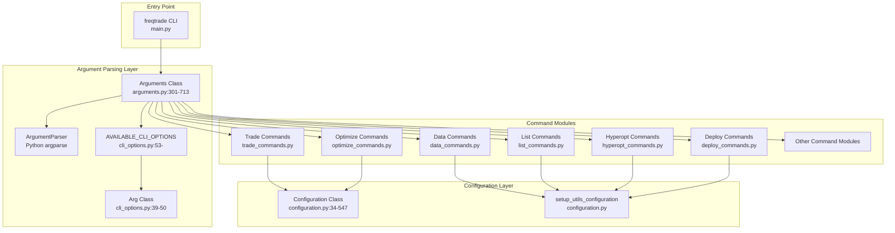

**Sources:** [freqtrade/commands/arguments.py301-713](https://github.com/freqtrade/freqtrade/blob/8e91fea1/freqtrade/commands/arguments.py#L301-L713) [freqtrade/commands/cli\_options.py39-50](https://github.com/freqtrade/freqtrade/blob/8e91fea1/freqtrade/commands/cli_options.py#L39-L50) [freqtrade/commands/\_\_init\_\_.py1-49](https://github.com/freqtrade/freqtrade/blob/8e91fea1/freqtrade/commands/__init__.py#L1-L49)

## Command Categories

Freqtrade CLI commands are organized into distinct functional categories. Each category serves a specific operational purpose.

| Category | Commands | Purpose |
| --- | --- | --- |
| **Trading** | `trade`, `webserver` | Live/dry-run trading and web interface |
| **Data Management** | `download-data`, `convert-data`, `convert-trade-data`, `trades-to-ohlcv`, `list-data` | Historical data operations |
| **Strategy Development** | `new-strategy`, `list-strategies`, `strategy-updater` | Strategy creation and management |
| **Backtesting** | `backtesting`, `backtesting-show`, `backtesting-analysis` | Strategy testing on historical data |
| **Hyperoptimization** | `hyperopt`, `hyperopt-list`, `hyperopt-show` | Parameter optimization |
| **Setup** | `create-userdir`, `new-config`, `show-config`, `install-ui` | Initial setup and configuration |
| **Exchange Info** | `list-exchanges`, `list-timeframes`, `list-markets`, `list-pairs` | Exchange capability queries |
| **Database** | `convert-db`, `show-trades` | Database operations |
| **Plotting** | `plot-dataframe`, `plot-profit` | Visualization generation |
| **Analysis** | `lookahead-analysis`, `recursive-analysis`, `edge` | Advanced strategy analysis |
| **Testing** | `test-pairlist` | Configuration testing |

**Sources:** [freqtrade/commands/arguments.py379-713](https://github.com/freqtrade/freqtrade/blob/8e91fea1/freqtrade/commands/arguments.py#L379-L713) [docs/utils.md1-422](https://github.com/freqtrade/freqtrade/blob/8e91fea1/docs/utils.md#L1-L422)

## Arguments Class

The `Arguments` class is the central component of the CLI system, responsible for building all subcommands and parsing user input into a configuration dictionary.

### Class Structure

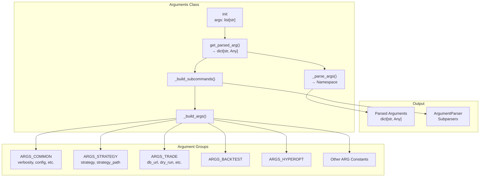

**Sources:** [freqtrade/commands/arguments.py301-349](https://github.com/freqtrade/freqtrade/blob/8e91fea1/freqtrade/commands/arguments.py#L301-L349)

### Argument Processing Flow

The `Arguments` class follows a multi-stage initialization and parsing process:

1. **Initialization** - Store raw CLI arguments
2. **Subcommand Building** - Create parser hierarchy with common and command-specific options
3. **Argument Parsing** - Parse arguments into `Namespace` object
4. **Config Detection** - Locate configuration file (user\_data/config.json or config.json)
5. **Dictionary Conversion** - Convert `Namespace` to dictionary

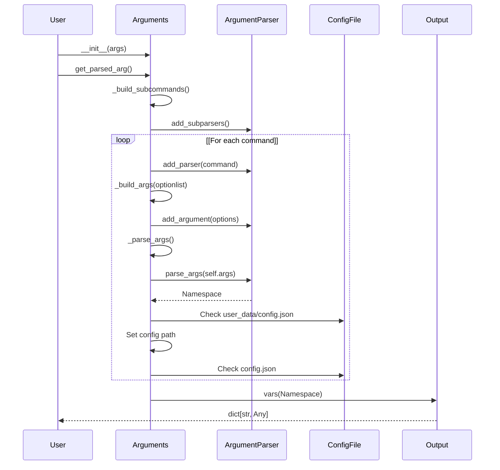

**Sources:** [freqtrade/commands/arguments.py310-349](https://github.com/freqtrade/freqtrade/blob/8e91fea1/freqtrade/commands/arguments.py#L310-L349)

## CLI Option System

CLI options are defined using the `Arg` class, which wraps argument definitions with metadata for help text and command-specific documentation.

### Arg Class Structure

The `Arg` class provides a flexible way to define CLI arguments with optional per-command help text:

```
```
# From cli_options.py:39-50
Arg(*args, fthelp: dict[str, str] | None = None, **kwargs)
```
```

* `args`: Positional CLI flags (e.g., `-c`, `--config`)
* `fthelp`: Dictionary mapping command names to help text
* `kwargs`: Standard argparse arguments (help, action, type, etc.)

### Common CLI Options

The most frequently used options across commands:

| Option | Flags | Type | Purpose |
| --- | --- | --- | --- |
| `verbosity` | `-v`, `--verbose` | count | Logging verbosity level |
| `config` | `-c`, `--config` | append | Configuration file path(s) |
| `datadir` | `-d`, `--datadir`, `--data-dir` | path | Historical data directory |
| `user_data_dir` | `--userdir`, `--user-data-dir` | path | User data directory |
| `strategy` | `-s`, `--strategy` | string | Strategy class name |
| `timeframe` | `-i`, `--timeframe` | string | Candle timeframe |
| `timerange` | `--timerange` | string | Date range for data |
| `dry_run` | `--dry-run` | flag | Enable simulated trading |

**Sources:** [freqtrade/commands/cli\_options.py55-105](https://github.com/freqtrade/freqtrade/blob/8e91fea1/freqtrade/commands/cli_options.py#L55-L105) [freqtrade/commands/arguments.py15-23](https://github.com/freqtrade/freqtrade/blob/8e91fea1/freqtrade/commands/arguments.py#L15-L23)

### Argument Group Constants

Commands inherit options through predefined constant lists:

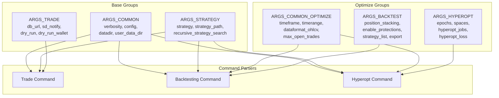

**Sources:** [freqtrade/commands/arguments.py15-273](https://github.com/freqtrade/freqtrade/blob/8e91fea1/freqtrade/commands/arguments.py#L15-L273)

## Configuration Integration

The CLI integrates with the Configuration system to merge command-line arguments with configuration files. The precedence order is: **CLI arguments > Environment variables > Configuration files**.

### Configuration Loading Flow

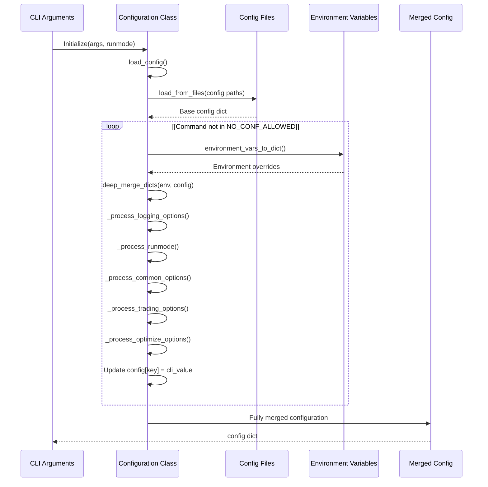

**Sources:** [freqtrade/configuration/configuration.py71-121](https://github.com/freqtrade/freqtrade/blob/8e91fea1/freqtrade/configuration/configuration.py#L71-L121) [freqtrade/commands/arguments.py321-349](https://github.com/freqtrade/freqtrade/blob/8e91fea1/freqtrade/commands/arguments.py#L321-L349)

### Configuration Precedence Example

When the same setting is defined in multiple places:

```
CLI:    --dry-run
ENV:    FREQTRADE__DRY_RUN=false
Config: "dry_run": true

Result: dry_run = true (CLI wins)
```

**Sources:** [freqtrade/configuration/configuration.py77-84](https://github.com/freqtrade/freqtrade/blob/8e91fea1/freqtrade/configuration/configuration.py#L77-L84)

## Command Execution Pattern

All command functions follow a consistent execution pattern that ensures proper configuration and resource initialization.

### Standard Command Template

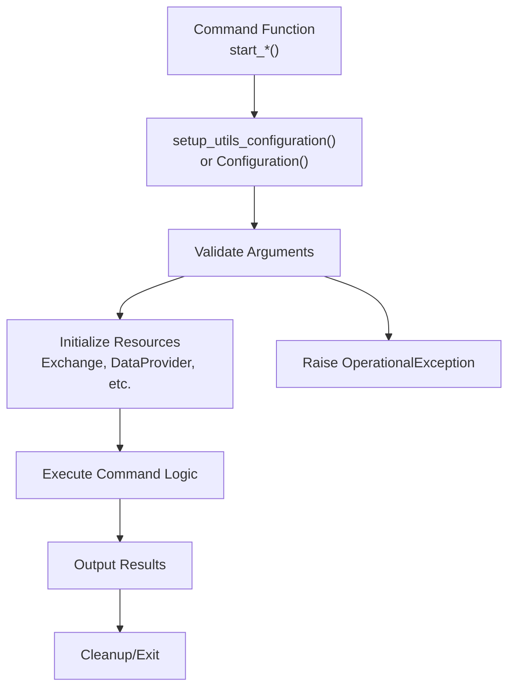

### Example: start\_list\_exchanges

The `start_list_exchanges` command demonstrates the typical structure:

```
```
# From list_commands.py:13-92
def start_list_exchanges(args: dict[str, Any]) -> None:
    # 1. Import dependencies (lazy loading)
    from freqtrade.exchange import list_available_exchanges
    
    # 2. Get exchange list based on arguments
    available_exchanges = list_available_exchanges(args["list_exchanges_all"])
    
    # 3. Filter based on arguments (--trading-mode, --dex)
    if args["print_one_column"]:
        # 4a. Output simple format
        print("\n".join([e["classname"] for e in available_exchanges]))
    else:
        # 4b. Output rich table format
        table = Table(title=title)
        # ... build table
        console.print(table)
```
```

**Sources:** [freqtrade/commands/list\_commands.py13-92](https://github.com/freqtrade/freqtrade/blob/8e91fea1/freqtrade/commands/list_commands.py#L13-L92)

## Data Commands

Data commands handle historical market data operations including downloading, converting, and listing available data.

### Data Command Architecture

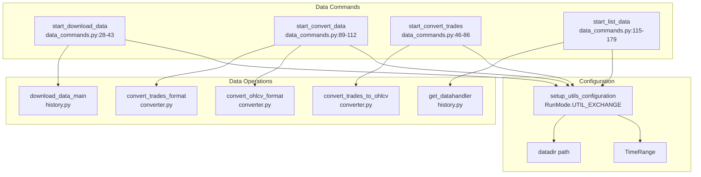

**Sources:** [freqtrade/commands/data\_commands.py1-232](https://github.com/freqtrade/freqtrade/blob/8e91fea1/freqtrade/commands/data_commands.py#L1-L232)

### Download Data Command Flow

The `download-data` command validates arguments and delegates to the data history module:

1. **Validation** - Check that pairs list is provided and timerange/days are not both specified
2. **Configuration** - Setup with `RunMode.UTIL_EXCHANGE` to initialize exchange
3. **Delegation** - Call `download_data_main()` with configuration
4. **Error Handling** - Catch `KeyboardInterrupt` for graceful exit

**Sources:** [freqtrade/commands/data\_commands.py15-43](https://github.com/freqtrade/freqtrade/blob/8e91fea1/freqtrade/commands/data_commands.py#L15-L43) [tests/commands/test\_commands.py860-951](https://github.com/freqtrade/freqtrade/blob/8e91fea1/tests/commands/test_commands.py#L860-L951)

## List Commands

List commands provide information about available exchanges, strategies, markets, timeframes, and other system components.

### List Command Types

| Command | Function | Purpose | Output Options |
| --- | --- | --- | --- |
| `list-exchanges` | `start_list_exchanges` | Available exchanges | table, one-column |
| `list-strategies` | `start_list_strategies` | Available strategies | table, one-column |
| `list-timeframes` | `start_list_timeframes` | Exchange timeframes | inline, one-column |
| `list-markets` | `start_list_markets` | Exchange markets | table, list, json, csv, one-column |
| `list-pairs` | `start_list_markets` | Exchange trading pairs | table, list, json, csv, one-column |
| `list-freqaimodels` | `start_list_freqAI_models` | FreqAI models | table, one-column |
| `list-hyperoptloss` | `start_list_hyperopt_loss_functions` | Hyperopt loss functions | table, one-column |

**Sources:** [freqtrade/commands/list\_commands.py1-389](https://github.com/freqtrade/freqtrade/blob/8e91fea1/freqtrade/commands/list_commands.py#L1-L389)

### List Markets/Pairs Implementation

The `list-markets` and `list-pairs` commands share the same implementation with different filtering:

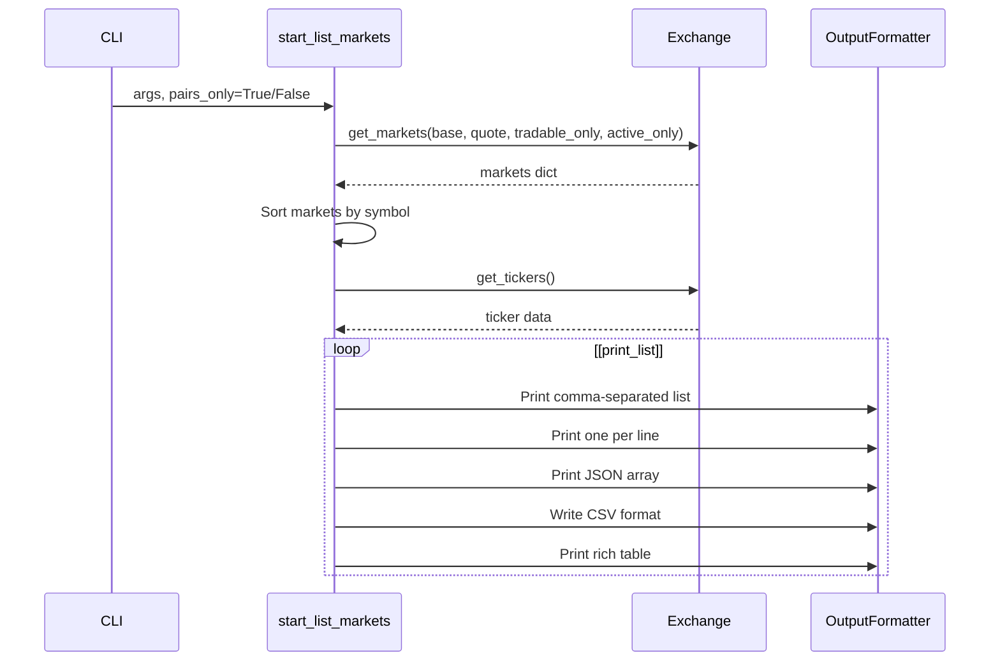

**Sources:** [freqtrade/commands/list\_commands.py234-363](https://github.com/freqtrade/freqtrade/blob/8e91fea1/freqtrade/commands/list_commands.py#L234-L363) [tests/commands/test\_commands.py338-640](https://github.com/freqtrade/freqtrade/blob/8e91fea1/tests/commands/test_commands.py#L338-L640)

## Hyperopt Commands

Hyperopt commands allow viewing and analyzing hyperparameter optimization results.

### Hyperopt Command Structure

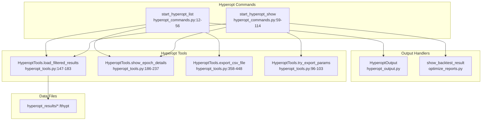

**Sources:** [freqtrade/commands/hyperopt\_commands.py1-114](https://github.com/freqtrade/freqtrade/blob/8e91fea1/freqtrade/commands/hyperopt_commands.py#L1-L114) [freqtrade/optimize/hyperopt\_tools.py1-449](https://github.com/freqtrade/freqtrade/blob/8e91fea1/freqtrade/optimize/hyperopt_tools.py#L1-L449)

### Hyperopt List Filtering

The `hyperopt-list` command supports extensive filtering options:

| Filter | CLI Option | Purpose |
| --- | --- | --- |
| Best epochs | `--best` | Only epochs with is\_best=True |
| Profitable | `--profitable` | Only epochs with profit > 0 |
| Min/Max trades | `--min-trades`, `--max-trades` | Trade count range |
| Min/Max avg time | `--min-avg-time`, `--max-avg-time` | Average trade duration |
| Min/Max avg profit | `--min-avg-profit`, `--max-avg-profit` | Average profit range |
| Min/Max total profit | `--min-total-profit`, `--max-total-profit` | Total profit range |
| Min/Max objective | `--min-objective`, `--max-objective` | Loss function value range |

**Sources:** [freqtrade/optimize/hyperopt\_tools.py147-183](https://github.com/freqtrade/freqtrade/blob/8e91fea1/freqtrade/optimize/hyperopt_tools.py#L147-L183) [freqtrade/commands/arguments.py213-241](https://github.com/freqtrade/freqtrade/blob/8e91fea1/freqtrade/commands/arguments.py#L213-L241)

## Deploy Commands

Deploy commands handle initial setup, user directory creation, strategy scaffolding, and UI installation.

### Deploy Command Categories

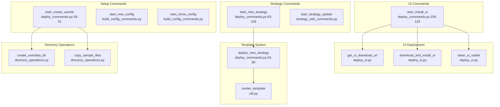

**Sources:** [freqtrade/commands/deploy\_commands.py1-134](https://github.com/freqtrade/freqtrade/blob/8e91fea1/freqtrade/commands/deploy_commands.py#L1-L134)

### Strategy Template System

The `new-strategy` command uses a template system with three templates (minimal, full, advanced):

1. **Template Selection** - Based on `--template` argument (default: "full")
2. **Component Rendering** - Renders multiple subtemplates:
   * `strategy_attributes_{template}.j2` - Class attributes
   * `indicators_{template}.j2` - Indicator calculations
   * `buy_trend_{template}.j2` - Entry signal logic
   * `sell_trend_{template}.j2` - Exit signal logic
   * `plot_config_{template}.j2` - Plotting configuration
   * `strategy_methods_{template}.j2` - Additional methods
3. **Assembly** - Combines components using `base_strategy.py.j2`
4. **File Creation** - Writes to `user_data/strategies/{StrategyName}.py`

**Sources:** [freqtrade/commands/deploy\_commands.py34-80](https://github.com/freqtrade/freqtrade/blob/8e91fea1/freqtrade/commands/deploy_commands.py#L34-L80) [tests/commands/test\_commands.py666-703](https://github.com/freqtrade/freqtrade/blob/8e91fea1/tests/commands/test_commands.py#L666-L703)

## Configuration-Optional Commands

Some commands can run without a configuration file, specified in the `NO_CONF_REQURIED` constant:

```
```
# From arguments.py:275-298
NO_CONF_REQURIED = [
    "backtest-filter",
    "backtesting-show",
    "convert-data",
    "convert-trade-data",
    "download-data",
    "hyperopt-list",
    "hyperopt-show",
    "list-data",
    "list-freqaimodels",
    "list-hyperoptloss",
    "list-markets",
    "list-pairs",
    "list-strategies",
    "list-timeframes",
    "plot-dataframe",
    "plot-profit",
    "show-trades",
    "install-ui",
    "strategy-updater",
    "trades-to-ohlcv",
]

NO_CONF_ALLOWED = ["create-userdir", "list-exchanges", "new-strategy"]
```
```

Commands in `NO_CONF_REQURIED` will attempt to load config but continue if not found. Commands in `NO_CONF_ALLOWED` actively prevent config loading.

**Sources:** [freqtrade/commands/arguments.py275-298](https://github.com/freqtrade/freqtrade/blob/8e91fea1/freqtrade/commands/arguments.py#L275-L298)

## Output Formatting

The CLI uses the Rich library for enhanced terminal output with tables, colors, and progress indicators.

### Rich Table Formatting

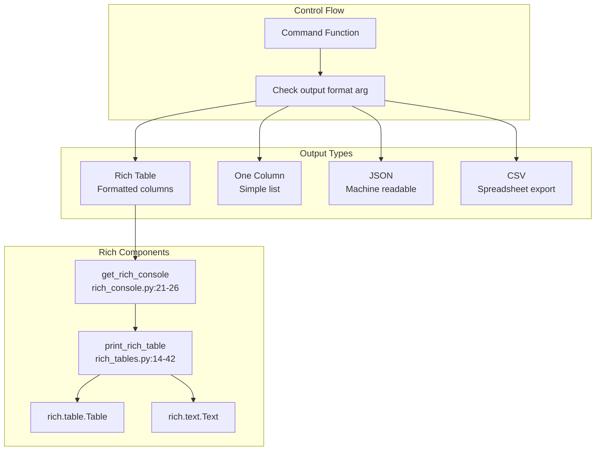

**Sources:** [freqtrade/util/rich\_tables.py14-42](https://github.com/freqtrade/freqtrade/blob/8e91fea1/freqtrade/util/rich_tables.py#L14-L42) [freqtrade/loggers/rich\_console.py21-26](https://github.com/freqtrade/freqtrade/blob/8e91fea1/freqtrade/loggers/rich_console.py#L21-L26)

### Table Output Example (list-exchanges)

The `list-exchanges` command demonstrates rich table construction:

```
```
# From list_commands.py:42-92
table = Table(title=title)
table.add_column("Exchange Name")
table.add_column("Class Name")
table.add_column("Markets")
table.add_column("Reason")

for exchange in available_exchanges:
    name = Text(exchange["name"])
    if exchange["supported"]:
        name.append(" (Supported)", style="italic")
        name.stylize("green bold")
    
    table.add_row(name, classname, trade_modes, exchange["comment"])
```
```

**Sources:** [freqtrade/commands/list\_commands.py42-92](https://github.com/freqtrade/freqtrade/blob/8e91fea1/freqtrade/commands/list_commands.py#L42-L92)

## Error Handling

The CLI implements multiple levels of error handling to provide clear feedback to users.

### Error Types and Handling

| Error Type | Exception Class | Handling Strategy |
| --- | --- | --- |
| Configuration errors | `ConfigurationError` | Display error message, exit with code 1 |
| Operational errors | `OperationalException` | Display error message, clean up resources |
| Missing requirements | `OperationalException` | Suggest required arguments |
| Keyboard interrupt | `KeyboardInterrupt` | Graceful shutdown, display "SIGINT received" |
| Validation errors | `ArgumentTypeError` | Display error, show command help |

### Example: Validation in check\_int\_positive

```
```
# From cli_options.py:15-24
def check_int_positive(value: str) -> int:
    try:
        uint = int(value)
        if uint <= 0:
            raise ValueError
    except ValueError:
        raise ArgumentTypeError(
            f"{value} is invalid for this parameter, should be a positive integer value"
        )
    return uint
```
```

**Sources:** [freqtrade/commands/cli\_options.py15-24](https://github.com/freqtrade/freqtrade/blob/8e91fea1/freqtrade/commands/cli_options.py#L15-L24)

## Testing Infrastructure

The CLI testing infrastructure validates command behavior, argument parsing, and output formatting.

### Test Coverage Areas

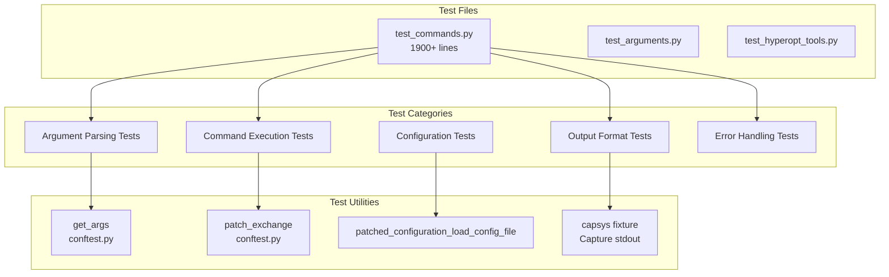

**Sources:** [tests/commands/test\_commands.py1-2300](https://github.com/freqtrade/freqtrade/blob/8e91fea1/tests/commands/test_commands.py#L1-L2300) [tests/optimize/test\_hyperopt\_tools.py1-500](https://github.com/freqtrade/freqtrade/blob/8e91fea1/tests/optimize/test_hyperopt_tools.py#L1-L500)

### Example Test: Download Data Validation

```
```
# From test_commands.py:884-951
def test_download_data_timerange(mocker, markets, time_machine, time, tzoffset):
    # Test that --days and --timerange are mutually exclusive
    args = [
        "download-data",
        "--exchange", "binance",
        "--pairs", "ETH/BTC", "XRP/BTC",
        "--days", "20",
        "--timerange", "20200101-",
    ]
    with pytest.raises(OperationalException, 
                      match=r"--days and --timerange are mutually.*"):
        start_download_data(get_args(args))
```
```

**Sources:** [tests/commands/test\_commands.py884-951](https://github.com/freqtrade/freqtrade/blob/8e91fea1/tests/commands/test_commands.py#L884-L951)