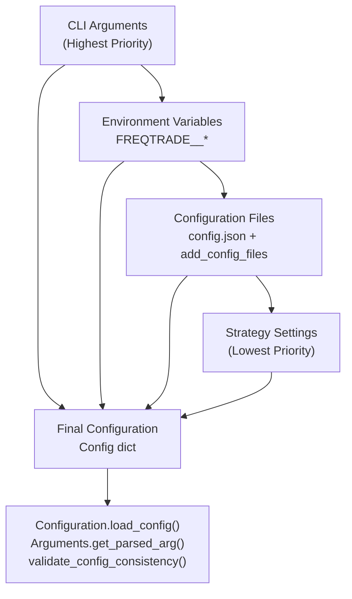
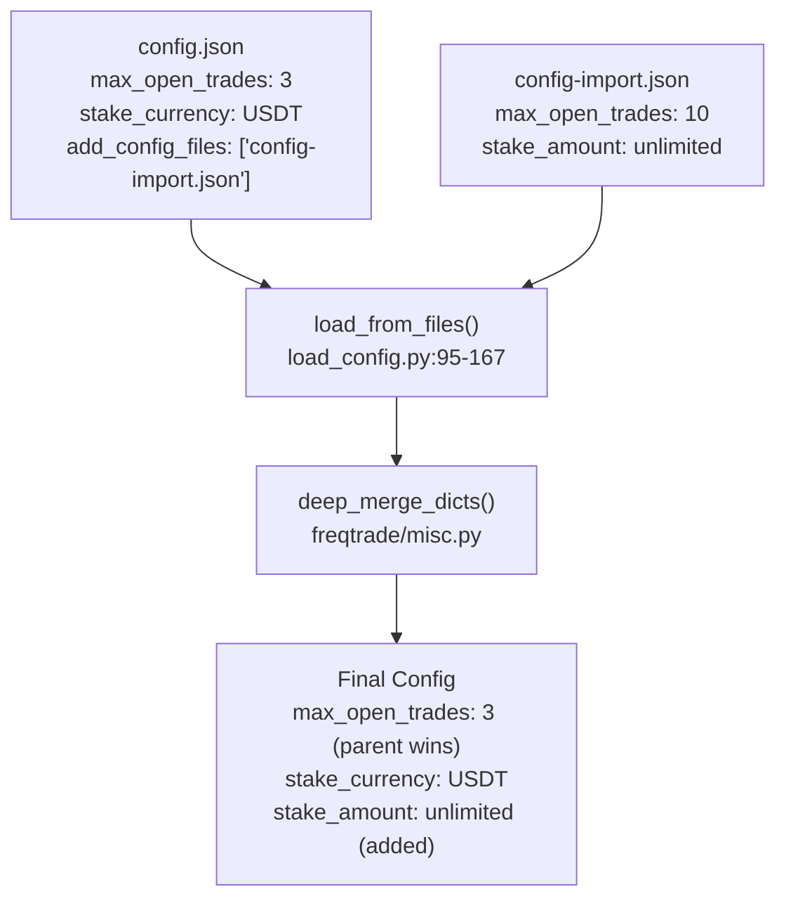
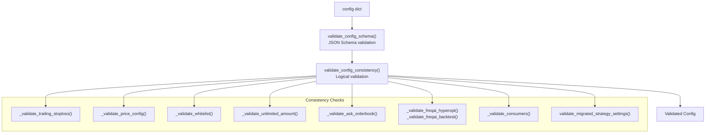
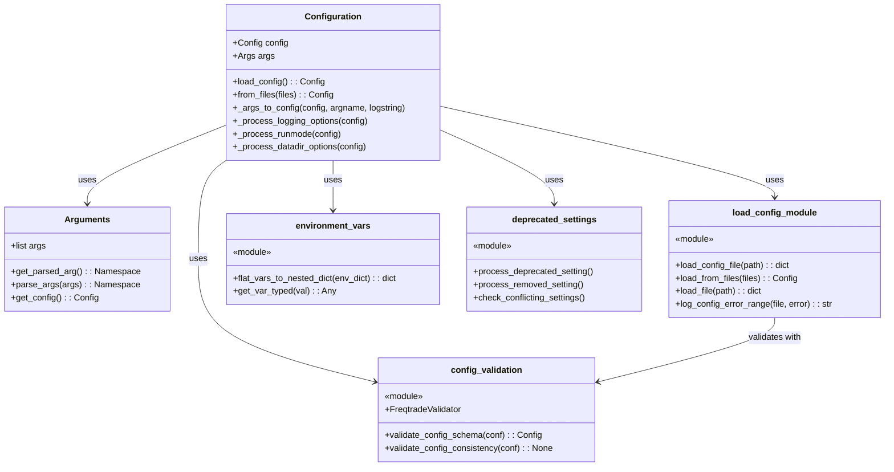

# Configuration System

Relevant source files

* [docs/configuration.md](https://github.com/freqtrade/freqtrade/blob/8e91fea1/docs/configuration.md)
* [docs/utils.md](https://github.com/freqtrade/freqtrade/blob/8e91fea1/docs/utils.md)
* [freqtrade/commands/\_\_init\_\_.py](https://github.com/freqtrade/freqtrade/blob/8e91fea1/freqtrade/commands/__init__.py)
* [freqtrade/commands/arguments.py](https://github.com/freqtrade/freqtrade/blob/8e91fea1/freqtrade/commands/arguments.py)
* [freqtrade/commands/cli\_options.py](https://github.com/freqtrade/freqtrade/blob/8e91fea1/freqtrade/commands/cli_options.py)
* [freqtrade/commands/data\_commands.py](https://github.com/freqtrade/freqtrade/blob/8e91fea1/freqtrade/commands/data_commands.py)
* [freqtrade/commands/deploy\_commands.py](https://github.com/freqtrade/freqtrade/blob/8e91fea1/freqtrade/commands/deploy_commands.py)
* [freqtrade/commands/hyperopt\_commands.py](https://github.com/freqtrade/freqtrade/blob/8e91fea1/freqtrade/commands/hyperopt_commands.py)
* [freqtrade/commands/list\_commands.py](https://github.com/freqtrade/freqtrade/blob/8e91fea1/freqtrade/commands/list_commands.py)
* [freqtrade/configuration/config\_validation.py](https://github.com/freqtrade/freqtrade/blob/8e91fea1/freqtrade/configuration/config_validation.py)
* [freqtrade/configuration/configuration.py](https://github.com/freqtrade/freqtrade/blob/8e91fea1/freqtrade/configuration/configuration.py)
* [freqtrade/configuration/deprecated\_settings.py](https://github.com/freqtrade/freqtrade/blob/8e91fea1/freqtrade/configuration/deprecated_settings.py)
* [freqtrade/constants.py](https://github.com/freqtrade/freqtrade/blob/8e91fea1/freqtrade/constants.py)
* [freqtrade/loggers/rich\_console.py](https://github.com/freqtrade/freqtrade/blob/8e91fea1/freqtrade/loggers/rich_console.py)
* [freqtrade/optimize/hyperopt\_tools.py](https://github.com/freqtrade/freqtrade/blob/8e91fea1/freqtrade/optimize/hyperopt_tools.py)
* [freqtrade/util/progress\_tracker.py](https://github.com/freqtrade/freqtrade/blob/8e91fea1/freqtrade/util/progress_tracker.py)
* [freqtrade/util/rich\_tables.py](https://github.com/freqtrade/freqtrade/blob/8e91fea1/freqtrade/util/rich_tables.py)
* [tests/commands/test\_commands.py](https://github.com/freqtrade/freqtrade/blob/8e91fea1/tests/commands/test_commands.py)
* [tests/optimize/test\_hyperopt\_tools.py](https://github.com/freqtrade/freqtrade/blob/8e91fea1/tests/optimize/test_hyperopt_tools.py)
* [tests/test\_configuration.py](https://github.com/freqtrade/freqtrade/blob/8e91fea1/tests/test_configuration.py)

## Overview

The Configuration System loads, merges, validates, and processes configuration from multiple sources. It implements a three-tier precedence hierarchy: CLI arguments override environment variables, which override configuration files, which override strategy defaults.

The system is implemented in `freqtrade/configuration/` with the `Configuration` class [freqtrade/configuration/configuration.py34-547](https://github.com/freqtrade/freqtrade/blob/8e91fea1/freqtrade/configuration/configuration.py#L34-L547) as the primary orchestrator.

Related documentation: Strategy configuration (page 2.3), Exchange configuration (page 2.2).

**Sources**: [freqtrade/configuration/configuration.py34-547](https://github.com/freqtrade/freqtrade/blob/8e91fea1/freqtrade/configuration/configuration.py#L34-L547) [docs/configuration.md1-24](https://github.com/freqtrade/freqtrade/blob/8e91fea1/docs/configuration.md#L1-L24)

## Configuration File Format

Freqtrade configuration files use JSON format with extensions:

* Default filename: `config.json` in current working directory [freqtrade/constants.py13](https://github.com/freqtrade/freqtrade/blob/8e91fea1/freqtrade/constants.py#L13-L13)
* CLI override: `-c/--config` argument [freqtrade/commands/cli\_options.py81-90](https://github.com/freqtrade/freqtrade/blob/8e91fea1/freqtrade/commands/cli_options.py#L81-L90)
* Comment support: Single-line `//` and multi-line `/* */` [freqtrade/configuration/load\_config.py33-71](https://github.com/freqtrade/freqtrade/blob/8e91fea1/freqtrade/configuration/load_config.py#L33-L71)
* Trailing commas allowed in arrays and objects

The `DEFAULT_CONFIG` constant [freqtrade/constants.py13](https://github.com/freqtrade/freqtrade/blob/8e91fea1/freqtrade/constants.py#L13-L13) defines the default filename as `"config.json"`.

Minimum required configuration structure is defined in `MINIMAL_CONFIG` [freqtrade/constants.py192-202](https://github.com/freqtrade/freqtrade/blob/8e91fea1/freqtrade/constants.py#L192-L202):

```
```
MINIMAL_CONFIG = {
    "stake_currency": "",
    "dry_run": True,
    "exchange": {
        "name": "",
        "key": "",
        "secret": "",
        "pair_whitelist": [],
        "ccxt_async_config": {},
    },
}
```
```

**Sources**: [freqtrade/constants.py13](https://github.com/freqtrade/freqtrade/blob/8e91fea1/freqtrade/constants.py#L13-L13) [freqtrade/constants.py192-202](https://github.com/freqtrade/freqtrade/blob/8e91fea1/freqtrade/constants.py#L192-L202) [freqtrade/configuration/load\_config.py33-71](https://github.com/freqtrade/freqtrade/blob/8e91fea1/freqtrade/configuration/load_config.py#L33-L71) [freqtrade/commands/cli\_options.py81-90](https://github.com/freqtrade/freqtrade/blob/8e91fea1/freqtrade/commands/cli_options.py#L81-L90)

## Configuration Precedence and Loading

### Three-Tier Precedence System



**Configuration Loading Precedence Hierarchy**

The configuration system resolves settings in the following order:

1. **CLI Arguments** (highest priority) - parsed by `Arguments` class [freqtrade/commands/\_\_init\_\_.py](https://github.com/freqtrade/freqtrade/blob/8e91fea1/freqtrade/commands/__init__.py)
2. **Environment Variables** - prefixed with `FREQTRADE__`
3. **Configuration Files** - loaded in sequence via `load_from_files()`
4. **Strategy Settings** (lowest priority) - defaults from `IStrategy` class

**Sources**: [docs/configuration.md151-159](https://github.com/freqtrade/freqtrade/blob/8e91fea1/docs/configuration.md#L151-L159) [freqtrade/configuration/load\_config.py](https://github.com/freqtrade/freqtrade/blob/8e91fea1/freqtrade/configuration/load_config.py) [freqtrade/constants.py127](https://github.com/freqtrade/freqtrade/blob/8e91fea1/freqtrade/constants.py#L127-L127)

### Configuration Loading Process

**Configuration Loading Pipeline**

The `Configuration.load_config()` method [freqtrade/configuration/configuration.py71-121](https://github.com/freqtrade/freqtrade/blob/8e91fea1/freqtrade/configuration/configuration.py#L71-L121) executes the following sequence:

1. **Parse CLI Arguments**: `Arguments._parse_args()` [freqtrade/commands/arguments.py321-348](https://github.com/freqtrade/freqtrade/blob/8e91fea1/freqtrade/commands/arguments.py#L321-L348) parses command-line options
2. **Load Config Files**: `load_from_files()` [freqtrade/configuration/load\_config.py95-167](https://github.com/freqtrade/freqtrade/blob/8e91fea1/freqtrade/configuration/load_config.py#L95-L167) reads and merges JSON files using `deep_merge_dicts()` [freqtrade/misc.py](https://github.com/freqtrade/freqtrade/blob/8e91fea1/freqtrade/misc.py)
3. **Process Environment Variables**: `environment_vars_to_dict()` [freqtrade/configuration/environment\_vars.py15-55](https://github.com/freqtrade/freqtrade/blob/8e91fea1/freqtrade/configuration/environment_vars.py#L15-L55) converts `FREQTRADE__*` variables to nested dict
4. **Merge CLI Arguments**: `Configuration._args_to_config()` [freqtrade/configuration/configuration.py481-510](https://github.com/freqtrade/freqtrade/blob/8e91fea1/freqtrade/configuration/configuration.py#L481-L510) overlays CLI arguments
5. **Validate Schema**: `validate_config_schema()` [freqtrade/configuration/config\_validation.py46-71](https://github.com/freqtrade/freqtrade/blob/8e91fea1/freqtrade/configuration/config_validation.py#L46-L71) validates against JSON schema using `FreqtradeValidator` [freqtrade/configuration/config\_validation.py43](https://github.com/freqtrade/freqtrade/blob/8e91fea1/freqtrade/configuration/config_validation.py#L43-L43)
6. **Validate Consistency**: `validate_config_consistency()` [freqtrade/configuration/config\_validation.py73-99](https://github.com/freqtrade/freqtrade/blob/8e91fea1/freqtrade/configuration/config_validation.py#L73-L99) performs logical validation

**Sources**: [freqtrade/configuration/configuration.py71-121](https://github.com/freqtrade/freqtrade/blob/8e91fea1/freqtrade/configuration/configuration.py#L71-L121) [freqtrade/configuration/load\_config.py95-167](https://github.com/freqtrade/freqtrade/blob/8e91fea1/freqtrade/configuration/load_config.py#L95-L167) [freqtrade/configuration/environment\_vars.py15-55](https://github.com/freqtrade/freqtrade/blob/8e91fea1/freqtrade/configuration/environment_vars.py#L15-L55) [freqtrade/commands/arguments.py321-348](https://github.com/freqtrade/freqtrade/blob/8e91fea1/freqtrade/commands/arguments.py#L321-L348) [freqtrade/configuration/config\_validation.py46-71](https://github.com/freqtrade/freqtrade/blob/8e91fea1/freqtrade/configuration/config_validation.py#L46-L71) [freqtrade/configuration/config\_validation.py73-99](https://github.com/freqtrade/freqtrade/blob/8e91fea1/freqtrade/configuration/config_validation.py#L73-L99)

## Environment Variable System

Environment variables provide configuration without exposing credentials in files. All variables must use the `FREQTRADE__` prefix (double underscore) defined in `ENV_VAR_PREFIX` [freqtrade/constants.py127](https://github.com/freqtrade/freqtrade/blob/8e91fea1/freqtrade/constants.py#L127-L127)

The `environment_vars_to_dict()` function [freqtrade/configuration/environment\_vars.py15-55](https://github.com/freqtrade/freqtrade/blob/8e91fea1/freqtrade/configuration/environment_vars.py#L15-L55) processes these variables during configuration loading.

### Environment Variable Syntax

| Pattern | Example | Resulting Config |
| --- | --- | --- |
| `FREQTRADE__{KEY}` | `FREQTRADE__STAKE_AMOUNT=200` | `{"stake_amount": 200}` |
| `FREQTRADE__{SECTION}__{KEY}` | `FREQTRADE__EXCHANGE__KEY=xyz` | `{"exchange": {"key": "xyz"}}` |
| `FREQTRADE__{SECTION}__{SUB}__{KEY}` | `FREQTRADE__TELEGRAM__CHAT_ID=123` | `{"telegram": {"chat_id": "123"}}` |

### Common Environment Variable Usage

```
```
# Exchange credentials (keep secret)
FREQTRADE__EXCHANGE__KEY=<yourExchangeKey>
FREQTRADE__EXCHANGE__SECRET=<yourExchangeSecret>

# Telegram configuration
FREQTRADE__TELEGRAM__CHAT_ID=<telegramchatid>
FREQTRADE__TELEGRAM__TOKEN=<telegramToken>

# JSON list parsing
FREQTRADE__EXCHANGE__PAIR_WHITELIST='["BTC/USDT", "ETH/USDT"]'
```
```

**Implementation Details**:

* Environment variables are logged at startup via `logger.info()` [freqtrade/configuration/environment\_vars.py](https://github.com/freqtrade/freqtrade/blob/8e91fea1/freqtrade/configuration/environment_vars.py)
* The `show-config` command [freqtrade/commands/build\_config\_commands.py42-78](https://github.com/freqtrade/freqtrade/blob/8e91fea1/freqtrade/commands/build_config_commands.py#L42-L78) displays merged configuration
* Environment variables cannot override the `config` file path itself [docs/configuration.md62-63](https://github.com/freqtrade/freqtrade/blob/8e91fea1/docs/configuration.md#L62-L63)
* JSON arrays are parsed using `rapidjson.loads()` [freqtrade/configuration/environment\_vars.py](https://github.com/freqtrade/freqtrade/blob/8e91fea1/freqtrade/configuration/environment_vars.py)
* Variable parsing is handled by `get_var_typed()` [freqtrade/configuration/environment\_vars.py](https://github.com/freqtrade/freqtrade/blob/8e91fea1/freqtrade/configuration/environment_vars.py) which attempts type conversion

**Sources**: [docs/configuration.md26-64](https://github.com/freqtrade/freqtrade/blob/8e91fea1/docs/configuration.md#L26-L64) [freqtrade/constants.py127](https://github.com/freqtrade/freqtrade/blob/8e91fea1/freqtrade/constants.py#L127-L127) [freqtrade/configuration/environment\_vars.py15-55](https://github.com/freqtrade/freqtrade/blob/8e91fea1/freqtrade/configuration/environment_vars.py#L15-L55) [freqtrade/commands/build\_config\_commands.py42-78](https://github.com/freqtrade/freqtrade/blob/8e91fea1/freqtrade/commands/build_config_commands.py#L42-L78)

## Multiple Configuration Files

The configuration system supports loading multiple files to separate concerns (e.g., public settings vs. secrets, base config vs. environment-specific overrides).

### Using `add_config_files`

```
```
{
  "max_open_trades": 3,
  "stake_currency": "USDT",
  "add_config_files": [
    "config-private.json",
    "config-exchange.json"
  ]
}
```
```

Files listed in `add_config_files` are loaded sequentially, with later files overriding earlier ones for conflicting keys. The primary configuration file always takes precedence over imported files.

### Configuration File Merging



**Merge Resolution Rules**

The `load_from_files()` function [freqtrade/configuration/load\_config.py95-167](https://github.com/freqtrade/freqtrade/blob/8e91fea1/freqtrade/configuration/load_config.py#L95-L167) implements merge logic:

* Parent configuration file (primary) takes precedence over imported files [freqtrade/configuration/load\_config.py130-139](https://github.com/freqtrade/freqtrade/blob/8e91fea1/freqtrade/configuration/load_config.py#L130-L139)
* Imported files add new keys not present in parent [freqtrade/configuration/load\_config.py130-139](https://github.com/freqtrade/freqtrade/blob/8e91fea1/freqtrade/configuration/load_config.py#L130-L139)
* Within `add_config_files` array, later files override earlier files [freqtrade/configuration/load\_config.py95-167](https://github.com/freqtrade/freqtrade/blob/8e91fea1/freqtrade/configuration/load_config.py#L95-L167)
* Merging uses `deep_merge_dicts()` [freqtrade/misc.py23-54](https://github.com/freqtrade/freqtrade/blob/8e91fea1/freqtrade/misc.py#L23-L54) for nested dictionary structures

**Sources**: [docs/configuration.md65-131](https://github.com/freqtrade/freqtrade/blob/8e91fea1/docs/configuration.md#L65-L131) [freqtrade/configuration/load\_config.py95-167](https://github.com/freqtrade/freqtrade/blob/8e91fea1/freqtrade/configuration/load_config.py#L95-L167) [freqtrade/misc.py23-54](https://github.com/freqtrade/freqtrade/blob/8e91fea1/freqtrade/misc.py#L23-L54) [tests/test\_configuration.py169-201](https://github.com/freqtrade/freqtrade/blob/8e91fea1/tests/test_configuration.py#L169-L201) [tests/test\_configuration.py230-255](https://github.com/freqtrade/freqtrade/blob/8e91fea1/tests/test_configuration.py#L230-L255)

## Configuration Validation

### Schema Validation

The configuration validation system uses JSON Schema with custom validators to enforce structural requirements. The schema adapts based on the run mode:

| Run Mode | Required Fields | Schema Constant |
| --- | --- | --- |
| **TRADE** (live/dry-run) | `stake_currency`, `dry_run`, `exchange`, trading parameters | `SCHEMA_TRADE_REQUIRED` |
| **BACKTEST** | `stake_currency`, `dry_run`, `exchange`, `timeframe` | `SCHEMA_BACKTEST_REQUIRED` |
| **HYPEROPT** | Same as backtest plus optimization parameters | `SCHEMA_BACKTEST_REQUIRED_FINAL` |
| **WEBSERVER** | Minimal set for API-only mode | `SCHEMA_MINIMAL_WEBSERVER` |
| **OTHER** | Basic structure only | `SCHEMA_MINIMAL_REQUIRED` |

The `FreqtradeValidator` class [freqtrade/configuration/config\_validation.py26-44](https://github.com/freqtrade/freqtrade/blob/8e91fea1/freqtrade/configuration/config_validation.py#L26-L44) extends `Draft4Validator` to automatically set default values from the schema.

**Sources**: [freqtrade/configuration/config\_validation.py46-71](https://github.com/freqtrade/freqtrade/blob/8e91fea1/freqtrade/configuration/config_validation.py#L46-L71) [freqtrade/config\_schema/config\_schema.py](https://github.com/freqtrade/freqtrade/blob/8e91fea1/freqtrade/config_schema/config_schema.py)

### Consistency Validation



**Configuration Consistency Validation Functions**

The consistency validation performs logical checks that cannot be expressed in JSON Schema:

* **Trailing Stoploss**: Validates `trailing_stop_positive_offset` > `trailing_stop_positive` [freqtrade/configuration/config\_validation.py127-158](https://github.com/freqtrade/freqtrade/blob/8e91fea1/freqtrade/configuration/config_validation.py#L127-L158)
* **Price Configuration**: Ensures market orders use correct price sides [freqtrade/configuration/config\_validation.py112-125](https://github.com/freqtrade/freqtrade/blob/8e91fea1/freqtrade/configuration/config_validation.py#L112-L125)
* **Whitelist**: Confirms `StaticPairList` has `pair_whitelist` defined [freqtrade/configuration/config\_validation.py171-190](https://github.com/freqtrade/freqtrade/blob/8e91fea1/freqtrade/configuration/config_validation.py#L171-L190)
* **Unlimited Amount**: Prevents both `max_open_trades` and `stake_amount` from being unlimited [freqtrade/configuration/config\_validation.py101-110](https://github.com/freqtrade/freqtrade/blob/8e91fea1/freqtrade/configuration/config_validation.py#L101-L110)
* **Order Book**: Validates order book pricing parameters [freqtrade/configuration/config\_validation.py192-210](https://github.com/freqtrade/freqtrade/blob/8e91fea1/freqtrade/configuration/config_validation.py#L192-L210)
* **Migrated Settings**: Checks for deprecated setting patterns [freqtrade/configuration/config\_validation.py212-218](https://github.com/freqtrade/freqtrade/blob/8e91fea1/freqtrade/configuration/config_validation.py#L212-L218)

**Sources**: [freqtrade/configuration/config\_validation.py73-99](https://github.com/freqtrade/freqtrade/blob/8e91fea1/freqtrade/configuration/config_validation.py#L73-L99) [freqtrade/configuration/config\_validation.py101-210](https://github.com/freqtrade/freqtrade/blob/8e91fea1/freqtrade/configuration/config_validation.py#L101-L210)

## Configuration Class Architecture



**Configuration System Class Diagram**

### Key Classes and Modules

**`Configuration` Class** [freqtrade/configuration/configuration.py34-547](https://github.com/freqtrade/freqtrade/blob/8e91fea1/freqtrade/configuration/configuration.py#L34-L547)

Primary orchestrator class with methods:

* `load_config()` [freqtrade/configuration/configuration.py71-121](https://github.com/freqtrade/freqtrade/blob/8e91fea1/freqtrade/configuration/configuration.py#L71-L121): Assembles configuration from all sources
* `from_files(files)` [freqtrade/configuration/configuration.py55-69](https://github.com/freqtrade/freqtrade/blob/8e91fea1/freqtrade/configuration/configuration.py#L55-L69): Static method for loading from file list
* `_args_to_config(config, argname, logstring)` [freqtrade/configuration/configuration.py481-510](https://github.com/freqtrade/freqtrade/blob/8e91fea1/freqtrade/configuration/configuration.py#L481-L510): Merges CLI arguments into config dict
* `_process_logging_options()` [freqtrade/configuration/configuration.py123-144](https://github.com/freqtrade/freqtrade/blob/8e91fea1/freqtrade/configuration/configuration.py#L123-L144): Processes verbosity and log configuration
* `_process_runmode()` [freqtrade/configuration/configuration.py456-469](https://github.com/freqtrade/freqtrade/blob/8e91fea1/freqtrade/configuration/configuration.py#L456-L469): Determines run mode from config and arguments
* `_process_datadir_options()` [freqtrade/configuration/configuration.py189-240](https://github.com/freqtrade/freqtrade/blob/8e91fea1/freqtrade/configuration/configuration.py#L189-L240): Processes data directory configuration
* `_process_common_options()` [freqtrade/configuration/configuration.py161-188](https://github.com/freqtrade/freqtrade/blob/8e91fea1/freqtrade/configuration/configuration.py#L161-L188): Processes common configuration options
* `_process_trading_options()` [freqtrade/configuration/configuration.py145-160](https://github.com/freqtrade/freqtrade/blob/8e91fea1/freqtrade/configuration/configuration.py#L145-L160): Processes trading-specific options

**`Arguments` Class** [freqtrade/commands/arguments.py301-647](https://github.com/freqtrade/freqtrade/blob/8e91fea1/freqtrade/commands/arguments.py#L301-L647)

CLI argument parser using `argparse.ArgumentParser`:

* `get_parsed_arg()` [freqtrade/commands/arguments.py310-320](https://github.com/freqtrade/freqtrade/blob/8e91fea1/freqtrade/commands/arguments.py#L310-L320): Returns parsed argument dictionary
* `_parse_args()` [freqtrade/commands/arguments.py321-348](https://github.com/freqtrade/freqtrade/blob/8e91fea1/freqtrade/commands/arguments.py#L321-L348): Parses arguments from command line
* `_build_subcommands()` [freqtrade/commands/arguments.py359-647](https://github.com/freqtrade/freqtrade/blob/8e91fea1/freqtrade/commands/arguments.py#L359-L647): Builds all subcommand parsers
* `_build_args()` [freqtrade/commands/arguments.py350-357](https://github.com/freqtrade/freqtrade/blob/8e91fea1/freqtrade/commands/arguments.py#L350-L357): Adds arguments to parser from option list

**`load_config` Module** [freqtrade/configuration/load\_config.py](https://github.com/freqtrade/freqtrade/blob/8e91fea1/freqtrade/configuration/load_config.py)

File loading functions:

* `load_config_file(path)` [freqtrade/configuration/load\_config.py33-71](https://github.com/freqtrade/freqtrade/blob/8e91fea1/freqtrade/configuration/load_config.py#L33-L71): Reads single JSON file, strips comments, validates
* `load_from_files(files)` [freqtrade/configuration/load\_config.py95-167](https://github.com/freqtrade/freqtrade/blob/8e91fea1/freqtrade/configuration/load_config.py#L95-L167): Loads and merges multiple config files
* `load_file(path)` [freqtrade/configuration/load\_config.py74-92](https://github.com/freqtrade/freqtrade/blob/8e91fea1/freqtrade/configuration/load_config.py#L74-L92): Generic file loader supporting JSON/TOML/YAML
* `log_config_error_range(file, error)` [freqtrade/configuration/load\_config.py14-30](https://github.com/freqtrade/freqtrade/blob/8e91fea1/freqtrade/configuration/load_config.py#L14-L30): Displays JSON error context

**`environment_vars` Module** [freqtrade/configuration/environment\_vars.py](https://github.com/freqtrade/freqtrade/blob/8e91fea1/freqtrade/configuration/environment_vars.py)

Environment variable processing:

* `environment_vars_to_dict()` [freqtrade/configuration/environment\_vars.py15-55](https://github.com/freqtrade/freqtrade/blob/8e91fea1/freqtrade/configuration/environment_vars.py#L15-L55): Converts `FREQTRADE__*` environment variables to nested dict
* `_flat_vars_to_nested_dict(env_data)` [freqtrade/configuration/environment\_vars.py58-92](https://github.com/freqtrade/freqtrade/blob/8e91fea1/freqtrade/configuration/environment_vars.py#L58-L92): Converts flat key-value pairs to nested structure
* `get_var_typed(val)` [freqtrade/configuration/environment\_vars.py95-115](https://github.com/freqtrade/freqtrade/blob/8e91fea1/freqtrade/configuration/environment_vars.py#L95-L115): Attempts type conversion (int, float, bool, JSON)

**`config_validation` Module** [freqtrade/configuration/config\_validation.py](https://github.com/freqtrade/freqtrade/blob/8e91fea1/freqtrade/configuration/config_validation.py)

Validation functions:

* `FreqtradeValidator` [freqtrade/configuration/config\_validation.py26-44](https://github.com/freqtrade/freqtrade/blob/8e91fea1/freqtrade/configuration/config_validation.py#L26-L44): Extended `Draft4Validator` with default value support
* `validate_config_schema(conf)` [freqtrade/configuration/config\_validation.py46-71](https://github.com/freqtrade/freqtrade/blob/8e91fea1/freqtrade/configuration/config_validation.py#L46-L71): Validates against JSON schema
* `validate_config_consistency(conf)` [freqtrade/configuration/config\_validation.py73-99](https://github.com/freqtrade/freqtrade/blob/8e91fea1/freqtrade/configuration/config_validation.py#L73-L99): Logical validation checks
* `_validate_trailing_stoploss()` [freqtrade/configuration/config\_validation.py127-158](https://github.com/freqtrade/freqtrade/blob/8e91fea1/freqtrade/configuration/config_validation.py#L127-L158): Validates trailing stoploss parameters
* `_validate_price_config()` [freqtrade/configuration/config\_validation.py112-125](https://github.com/freqtrade/freqtrade/blob/8e91fea1/freqtrade/configuration/config_validation.py#L112-L125): Validates pricing configuration
* `_validate_whitelist()` [freqtrade/configuration/config\_validation.py171-190](https://github.com/freqtrade/freqtrade/blob/8e91fea1/freqtrade/configuration/config_validation.py#L171-L190): Validates pairlist configuration
* `_validate_unlimited_amount()` [freqtrade/configuration/config\_validation.py101-110](https://github.com/freqtrade/freqtrade/blob/8e91fea1/freqtrade/configuration/config_validation.py#L101-L110): Validates stake amount configuration

**`deprecated_settings` Module** [freqtrade/configuration/deprecated\_settings.py](https://github.com/freqtrade/freqtrade/blob/8e91fea1/freqtrade/configuration/deprecated_settings.py)

Deprecation handling:

* `process_deprecated_setting()` [freqtrade/configuration/deprecated\_settings.py54-77](https://github.com/freqtrade/freqtrade/blob/8e91fea1/freqtrade/configuration/deprecated_settings.py#L54-L77): Migrates old setting names with warnings
* `process_removed_setting()` [freqtrade/configuration/deprecated\_settings.py35-52](https://github.com/freqtrade/freqtrade/blob/8e91fea1/freqtrade/configuration/deprecated_settings.py#L35-L52): Raises `ConfigurationError` for removed settings
* `check_conflicting_settings()` [freqtrade/configuration/deprecated\_settings.py14-33](https://github.com/freqtrade/freqtrade/blob/8e91fea1/freqtrade/configuration/deprecated_settings.py#L14-L33): Detects conflicting old/new setting usage
* `process_temporary_deprecated_settings()` [freqtrade/configuration/deprecated\_settings.py79-89](https://github.com/freqtrade/freqtrade/blob/8e91fea1/freqtrade/configuration/deprecated_settings.py#L79-L89): Processes all deprecated settings

**Sources**: [freqtrade/configuration/configuration.py34-547](https://github.com/freqtrade/freqtrade/blob/8e91fea1/freqtrade/configuration/configuration.py#L34-L547) [freqtrade/commands/arguments.py301-647](https://github.com/freqtrade/freqtrade/blob/8e91fea1/freqtrade/commands/arguments.py#L301-L647) [freqtrade/configuration/load\_config.py](https://github.com/freqtrade/freqtrade/blob/8e91fea1/freqtrade/configuration/load_config.py) [freqtrade/configuration/environment\_vars.py](https://github.com/freqtrade/freqtrade/blob/8e91fea1/freqtrade/configuration/environment_vars.py) [freqtrade/configuration/config\_validation.py](https://github.com/freqtrade/freqtrade/blob/8e91fea1/freqtrade/configuration/config_validation.py) [freqtrade/configuration/deprecated\_settings.py](https://github.com/freqtrade/freqtrade/blob/8e91fea1/freqtrade/configuration/deprecated_settings.py)

## Key Configuration Sections

### Core Trading Parameters

| Parameter | Type | Description | Required |
| --- | --- | --- | --- |
| `max_open_trades` | int / -1 | Maximum number of concurrent open trades. `-1` for unlimited | Yes |
| `stake_currency` | str | Currency used for trading (e.g., `"USDT"`, `"BTC"`) | Yes |
| `stake_amount` | float / `"unlimited"` | Amount to use per trade in stake currency | Yes |
| `tradable_balance_ratio` | float | Ratio of total balance bot can trade (default: `0.99`) | No |
| `available_capital` | float | Starting capital for bot (useful for multiple bots) | No |
| `dry_run` | bool | Enable/disable dry-run mode (paper trading) | Yes |
| `dry_run_wallet` | float / dict | Starting wallet amount for dry-run | No |

**Sources**: [docs/configuration.md164-178](https://github.com/freqtrade/freqtrade/blob/8e91fea1/docs/configuration.md#L164-L178) [freqtrade/constants.py192-202](https://github.com/freqtrade/freqtrade/blob/8e91fea1/freqtrade/constants.py#L192-L202)

### Exchange Configuration

| Parameter | Type | Description | Location |
| --- | --- | --- | --- |
| `exchange.name` | str | Exchange identifier (e.g., `"binance"`, `"kraken"`) | `exchange` |
| `exchange.key` | str | API key (keep secret) | `exchange` |
| `exchange.secret` | str | API secret (keep secret) | `exchange` |
| `exchange.password` | str | API password (some exchanges) | `exchange` |
| `exchange.uid` | str | API UID (some exchanges) | `exchange` |
| `exchange.pair_whitelist` | list[str] | Trading pairs to consider | `exchange` |
| `exchange.pair_blacklist` | list[str] | Pairs to exclude from trading | `exchange` |
| `exchange.ccxt_config` | dict | Additional CCXT parameters | `exchange` |
| `exchange.ccxt_sync_config` | dict | CCXT params for sync instance | `exchange` |
| `exchange.ccxt_async_config` | dict | CCXT params for async instance | `exchange` |

Exchange configuration is passed to `Exchange.__init__()` [freqtrade/exchange/exchange.py178-303](https://github.com/freqtrade/freqtrade/blob/8e91fea1/freqtrade/exchange/exchange.py#L178-L303) and used to initialize CCXT instances via `_init_ccxt()` [freqtrade/exchange/exchange.py359-408](https://github.com/freqtrade/freqtrade/blob/8e91fea1/freqtrade/exchange/exchange.py#L359-L408)

**Sources**: [docs/configuration.md218-228](https://github.com/freqtrade/freqtrade/blob/8e91fea1/docs/configuration.md#L218-L228) [freqtrade/exchange/exchange.py178-303](https://github.com/freqtrade/freqtrade/blob/8e91fea1/freqtrade/exchange/exchange.py#L178-L303) [tests/exchange/test\_exchange.py170-211](https://github.com/freqtrade/freqtrade/blob/8e91fea1/tests/exchange/test_exchange.py#L170-L211)

### Pricing Configuration

| Parameter | Type | Description | Section |
| --- | --- | --- | --- |
| `price_side` | str | Order book side: `"ask"`, `"bid"`, `"same"`, `"other"` | `entry_pricing` / `exit_pricing` |
| `price_last_balance` | float | Weight between price\_side and last price (0.0-1.0) | `entry_pricing` / `exit_pricing` |
| `use_order_book` | bool | Use order book for price determination | `entry_pricing` / `exit_pricing` |
| `order_book_top` | int | Use Nth best order book entry | `entry_pricing` / `exit_pricing` |
| `check_depth_of_market.enabled` | bool | Check order book depth before entry | `entry_pricing` |
| `check_depth_of_market.bids_to_ask_delta` | float | Required bid/ask volume ratio | `entry_pricing` |

The pricing configuration is validated in `Exchange.validate_pricing()` [freqtrade/exchange/exchange.py](https://github.com/freqtrade/freqtrade/blob/8e91fea1/freqtrade/exchange/exchange.py) and used by the order pricing system (importance: 2700 per high-level diagrams).

**Sources**: [docs/configuration.md196-207](https://github.com/freqtrade/freqtrade/blob/8e91fea1/docs/configuration.md#L196-L207) [freqtrade/constants.py25](https://github.com/freqtrade/freqtrade/blob/8e91fea1/freqtrade/constants.py#L25-L25)

### Order Types and Time in Force

| Parameter | Type | Description |
| --- | --- | --- |
| `order_types.entry` | str | Order type for entries: `"limit"` or `"market"` |
| `order_types.exit` | str | Order type for exits: `"limit"` or `"market"` |
| `order_types.stoploss` | str | Stoploss order type |
| `order_types.stoploss_on_exchange` | bool | Place stoploss on exchange |
| `order_time_in_force.entry` | str | Entry TIF: `"GTC"`, `"FOK"`, `"IOC"`, `"PO"` |
| `order_time_in_force.exit` | str | Exit TIF: `"GTC"`, `"FOK"`, `"IOC"`, `"PO"` |

Order types are validated in `Exchange.validate_ordertypes()` [freqtrade/exchange/exchange.py790-798](https://github.com/freqtrade/freqtrade/blob/8e91fea1/freqtrade/exchange/exchange.py#L790-L798) and time-in-force settings in `Exchange.validate_order_time_in_force()` [freqtrade/exchange/exchange.py812-830](https://github.com/freqtrade/freqtrade/blob/8e91fea1/freqtrade/exchange/exchange.py#L812-L830)

**Sources**: [docs/configuration.md214-215](https://github.com/freqtrade/freqtrade/blob/8e91fea1/docs/configuration.md#L214-L215) [tests/exchange/test\_exchange.py289-311](https://github.com/freqtrade/freqtrade/blob/8e91fea1/tests/exchange/test_exchange.py#L289-L311)

## Configuration Usage in FreqtradeBot

**FreqtradeBot Configuration Initialization**

The `FreqtradeBot.__init__()` method [freqtrade/freqtradebot.py79-189](https://github.com/freqtrade/freqtrade/blob/8e91fea1/freqtrade/freqtradebot.py#L79-L189) uses configuration as follows:

1. **Store Config**: Assigns `config` parameter to `self.config` [freqtrade/freqtradebot.py88](https://github.com/freqtrade/freqtrade/blob/8e91fea1/freqtrade/freqtradebot.py#L88-L88)
2. **Credential Handling**: Creates `deepcopy()` of `config["exchange"]` [freqtrade/freqtradebot.py92-93](https://github.com/freqtrade/freqtrade/blob/8e91fea1/freqtrade/freqtradebot.py#L92-L93) then calls `remove_exchange_credentials()` [freqtrade/configuration/\_\_init\_\_.py63-80](https://github.com/freqtrade/freqtrade/blob/8e91fea1/freqtrade/configuration/__init__.py#L63-L80) on main config to prevent credential logging
3. **Load Exchange**: Calls `ExchangeResolver.load_exchange(config)` [freqtrade/freqtradebot.py96-98](https://github.com/freqtrade/freqtrade/blob/8e91fea1/freqtrade/freqtradebot.py#L96-L98) to initialize exchange instance
4. **Load Strategy**: Calls `StrategyResolver.load_strategy(config)` [freqtrade/freqtradebot.py100](https://github.com/freqtrade/freqtrade/blob/8e91fea1/freqtrade/freqtradebot.py#L100-L100) to load strategy class
5. **Validate Consistency**: Calls `validate_config_consistency(config)` [freqtrade/freqtradebot.py103](https://github.com/freqtrade/freqtrade/blob/8e91fea1/freqtrade/freqtradebot.py#L103-L103) to validate strategy/config compatibility
6. **Re-validate Exchange**: Calls `self.exchange.validate_config(config)` [freqtrade/freqtradebot.py105](https://github.com/freqtrade/freqtrade/blob/8e91fea1/freqtrade/freqtradebot.py#L105-L105) after strategy is loaded
7. **Initialize Database**: Calls `init_db(config["db_url"], config["dry_run"])` [freqtrade/freqtradebot.py107](https://github.com/freqtrade/freqtrade/blob/8e91fea1/freqtrade/freqtradebot.py#L107-L107) to set up SQLAlchemy
8. **Initialize Components**: Sets up `Wallets` [freqtrade/freqtradebot.py109](https://github.com/freqtrade/freqtrade/blob/8e91fea1/freqtrade/freqtradebot.py#L109-L109) `PairListManager` [freqtrade/freqtradebot.py111](https://github.com/freqtrade/freqtrade/blob/8e91fea1/freqtrade/freqtradebot.py#L111-L111) `DataProvider` [freqtrade/freqtradebot.py113-118](https://github.com/freqtrade/freqtrade/blob/8e91fea1/freqtrade/freqtradebot.py#L113-L118) and RPC handlers [freqtrade/freqtradebot.py120-139](https://github.com/freqtrade/freqtrade/blob/8e91fea1/freqtrade/freqtradebot.py#L120-L139)

**Sources**: [freqtrade/freqtradebot.py79-189](https://github.com/freqtrade/freqtrade/blob/8e91fea1/freqtrade/freqtradebot.py#L79-L189) [freqtrade/configuration/\_\_init\_\_.py63-80](https://github.com/freqtrade/freqtrade/blob/8e91fea1/freqtrade/configuration/__init__.py#L63-L80)

## Database Configuration

The database configuration uses different defaults based on the run mode:

| Mode | Default DB URL | Constant |
| --- | --- | --- |
| **Production** | `sqlite:///tradesv3.sqlite` | `DEFAULT_DB_PROD_URL` |
| **Dry-Run** | `sqlite:///tradesv3.dryrun.sqlite` | `DEFAULT_DB_DRYRUN_URL` |

The database URL is determined in configuration loading and passed to `init_db()` [freqtrade/persistence/\_\_init\_\_.py](https://github.com/freqtrade/freqtrade/blob/8e91fea1/freqtrade/persistence/__init__.py) Users can override with the `db_url` configuration parameter.

**Sources**: [freqtrade/constants.py19-20](https://github.com/freqtrade/freqtrade/blob/8e91fea1/freqtrade/constants.py#L19-L20) [tests/test\_configuration.py300-502](https://github.com/freqtrade/freqtrade/blob/8e91fea1/tests/test_configuration.py#L300-L502)

## Credential Management

The `remove_exchange_credentials()` function [freqtrade/configuration/\_\_init\_\_.py63-80](https://github.com/freqtrade/freqtrade/blob/8e91fea1/freqtrade/configuration/__init__.py#L63-L80) removes sensitive credentials from configuration to prevent exposure in logs:

```
```
def remove_exchange_credentials(config: ExchangeConfig, keep_api_keys: bool = False) -> None:
    """
    Removes exchange keys from the configuration.
    :param config: Exchange config section
    :param keep_api_keys: Keep API key (for non-dry-run mode)
    :return: None
    """
```
```

**Fields Removed**:

* `key` (unless `keep_api_keys=True`)
* `secret`
* `password`
* `uid`
* `walletAddress` (DEX exchanges)
* `privateKey` (DEX exchanges)

**Called From**:

1. `FreqtradeBot.__init__()` [freqtrade/freqtradebot.py93-94](https://github.com/freqtrade/freqtrade/blob/8e91fea1/freqtrade/freqtradebot.py#L93-L94): Removes credentials from main config after creating exchange config deepcopy
2. `Exchange.__init__()` [freqtrade/exchange/exchange.py254-258](https://github.com/freqtrade/freqtrade/blob/8e91fea1/freqtrade/exchange/exchange.py#L254-L258): Removes credentials in dry-run mode

**Sources**: [freqtrade/configuration/\_\_init\_\_.py63-80](https://github.com/freqtrade/freqtrade/blob/8e91fea1/freqtrade/configuration/__init__.py#L63-L80) [freqtrade/freqtradebot.py93-94](https://github.com/freqtrade/freqtrade/blob/8e91fea1/freqtrade/freqtradebot.py#L93-L94) [freqtrade/exchange/exchange.py254-258](https://github.com/freqtrade/freqtrade/blob/8e91fea1/freqtrade/exchange/exchange.py#L254-L258)

## Strategy-Configurable Parameters

Certain configuration parameters can be set in the strategy class and will be used if not explicitly defined in the configuration file. These are marked as "Strategy Override" in the documentation:

| Parameter | Strategy Property | Description |
| --- | --- | --- |
| `timeframe` | `IStrategy.timeframe` | Trading timeframe (e.g., `"5m"`, `"1h"`) |
| `minimal_roi` | `IStrategy.minimal_roi` | Minimal ROI configuration |
| `stoploss` | `IStrategy.stoploss` | Stoploss percentage |
| `trailing_stop` | `IStrategy.trailing_stop` | Enable trailing stoploss |
| `process_only_new_candles` | `IStrategy.process_only_new_candles` | Process indicators only on new candles |
| `order_types` | `IStrategy.order_types` | Order type configuration |
| `order_time_in_force` | `IStrategy.order_time_in_force` | Time in force settings |
| `unfilledtimeout` | `IStrategy.unfilledtimeout` | Timeout for unfilled orders |

The strategy is loaded after configuration file parsing, and the configuration is re-validated to ensure strategy-provided values are compatible [freqtrade/freqtradebot.py100-105](https://github.com/freqtrade/freqtrade/blob/8e91fea1/freqtrade/freqtradebot.py#L100-L105)

**Sources**: [docs/configuration.md158-159](https://github.com/freqtrade/freqtrade/blob/8e91fea1/docs/configuration.md#L158-L159) [freqtrade/freqtradebot.py100-105](https://github.com/freqtrade/freqtrade/blob/8e91fea1/freqtrade/freqtradebot.py#L100-L105)

## Common Configuration Patterns

### Development vs Production

**Development** (`config.dev.json`):

```
```
{
  "dry_run": true,
  "db_url": "sqlite:///tradesv3.dryrun.sqlite",
  "stake_amount": 100,
  "add_config_files": ["config-secrets.json"]
}
```
```

**Production** (`config.prod.json`):

```
```
{
  "dry_run": false,
  "db_url": "sqlite:///tradesv3.sqlite",
  "stake_amount": "unlimited",
  "tradable_balance_ratio": 0.95,
  "add_config_files": ["config-secrets.json"]
}
```
```

**Secrets** (`config-secrets.json`):

```
```
{
  "exchange": {
    "key": "your-api-key",
    "secret": "your-api-secret"
  },
  "telegram": {
    "enabled": true,
    "token": "your-telegram-token",
    "chat_id": "your-chat-id"
  }
}
```
```

### Environment-Specific Overrides

```
```
# Use environment variables for environment-specific overrides
export FREQTRADE__MAX_OPEN_TRADES=5
export FREQTRADE__STAKE_AMOUNT=150
export FREQTRADE__TELEGRAM__ENABLED=false

# Start with base config, env vars override specific values
freqtrade trade --config config.json
```
```

**Sources**: [docs/configuration.md75-98](https://github.com/freqtrade/freqtrade/blob/8e91fea1/docs/configuration.md#L75-L98) [tests/test\_configuration.py169-201](https://github.com/freqtrade/freqtrade/blob/8e91fea1/tests/test_configuration.py#L169-L201)

## Configuration Validation Error Handling

When configuration errors occur, Freqtrade provides contextual error messages:

**`log_config_error_range()` Function** [freqtrade/configuration/load\_config.py14-30](https://github.com/freqtrade/freqtrade/blob/8e91fea1/freqtrade/configuration/load_config.py#L14-L30)

For JSON parsing errors, this function displays the problematic section of the configuration file with surrounding context (50 characters before and after the error location), helping users quickly identify and fix syntax issues.

**Validation Errors**:

* `ConfigurationError`: Raised for schema violations or logical inconsistencies
* `OperationalException`: Raised for removed settings or file not found errors
* Errors include specific parameter names and suggested fixes

**Sources**: [freqtrade/configuration/load\_config.py14-30](https://github.com/freqtrade/freqtrade/blob/8e91fea1/freqtrade/configuration/load_config.py#L14-L30) [tests/test\_configuration.py83-121](https://github.com/freqtrade/freqtrade/blob/8e91fea1/tests/test_configuration.py#L83-L121) [freqtrade/exceptions.py](https://github.com/freqtrade/freqtrade/blob/8e91fea1/freqtrade/exceptions.py)