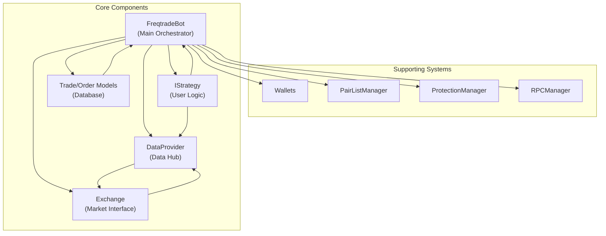
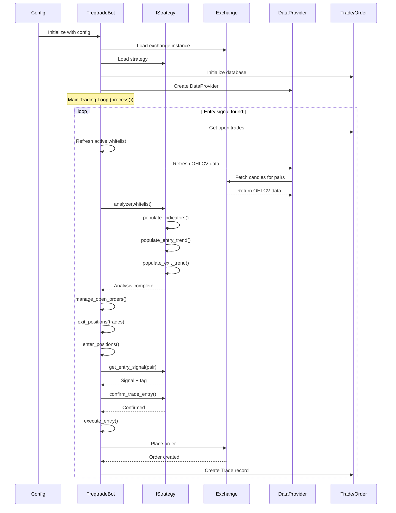
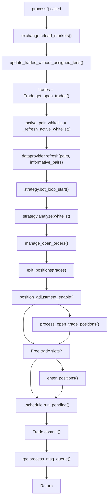
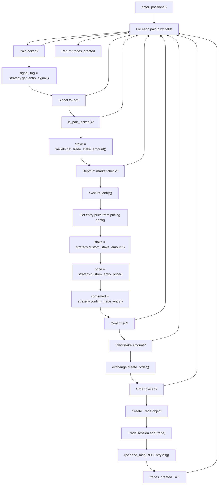
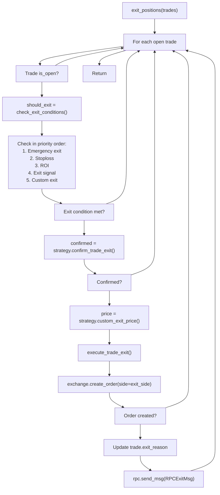

# Core Trading System

Relevant source files

* [docs/bot-basics.md](https://github.com/freqtrade/freqtrade/blob/8e91fea1/docs/bot-basics.md)
* [docs/strategy-advanced.md](https://github.com/freqtrade/freqtrade/blob/8e91fea1/docs/strategy-advanced.md)
* [docs/strategy-callbacks.md](https://github.com/freqtrade/freqtrade/blob/8e91fea1/docs/strategy-callbacks.md)
* [docs/strategy-customization.md](https://github.com/freqtrade/freqtrade/blob/8e91fea1/docs/strategy-customization.md)
* [docs/strategy\_migration.md](https://github.com/freqtrade/freqtrade/blob/8e91fea1/docs/strategy_migration.md)
* [freqtrade/enums/exittype.py](https://github.com/freqtrade/freqtrade/blob/8e91fea1/freqtrade/enums/exittype.py)
* [freqtrade/exchange/binance.py](https://github.com/freqtrade/freqtrade/blob/8e91fea1/freqtrade/exchange/binance.py)
* [freqtrade/exchange/exchange.py](https://github.com/freqtrade/freqtrade/blob/8e91fea1/freqtrade/exchange/exchange.py)
* [freqtrade/exchange/kraken.py](https://github.com/freqtrade/freqtrade/blob/8e91fea1/freqtrade/exchange/kraken.py)
* [freqtrade/freqtradebot.py](https://github.com/freqtrade/freqtrade/blob/8e91fea1/freqtrade/freqtradebot.py)
* [freqtrade/strategy/\_\_init\_\_.py](https://github.com/freqtrade/freqtrade/blob/8e91fea1/freqtrade/strategy/__init__.py)
* [freqtrade/strategy/informative\_decorator.py](https://github.com/freqtrade/freqtrade/blob/8e91fea1/freqtrade/strategy/informative_decorator.py)
* [freqtrade/strategy/interface.py](https://github.com/freqtrade/freqtrade/blob/8e91fea1/freqtrade/strategy/interface.py)
* [freqtrade/strategy/strategy\_helper.py](https://github.com/freqtrade/freqtrade/blob/8e91fea1/freqtrade/strategy/strategy_helper.py)
* [freqtrade/templates/strategy\_subtemplates/strategy\_methods\_advanced.j2](https://github.com/freqtrade/freqtrade/blob/8e91fea1/freqtrade/templates/strategy_subtemplates/strategy_methods_advanced.j2)
* [tests/conftest.py](https://github.com/freqtrade/freqtrade/blob/8e91fea1/tests/conftest.py)
* [tests/exchange/test\_binance.py](https://github.com/freqtrade/freqtrade/blob/8e91fea1/tests/exchange/test_binance.py)
* [tests/exchange/test\_exchange.py](https://github.com/freqtrade/freqtrade/blob/8e91fea1/tests/exchange/test_exchange.py)
* [tests/exchange/test\_kraken.py](https://github.com/freqtrade/freqtrade/blob/8e91fea1/tests/exchange/test_kraken.py)
* [tests/strategy/strats/informative\_decorator\_strategy.py](https://github.com/freqtrade/freqtrade/blob/8e91fea1/tests/strategy/strats/informative_decorator_strategy.py)
* [tests/strategy/test\_strategy\_helpers.py](https://github.com/freqtrade/freqtrade/blob/8e91fea1/tests/strategy/test_strategy_helpers.py)

## Purpose and Scope

This document describes the core trading engine components that execute trading logic, manage positions, and interact with exchanges. It covers the primary execution flow for live and dry-run trading modes, focusing on how the bot orchestrates strategy evaluation, order placement, and trade lifecycle management.

For information about testing strategies with historical data, see [Backtesting System](/freqtrade/freqtrade/3.1-backtesting-system). For machine learning capabilities, see [FreqAI Machine Learning System](/freqtrade/freqtrade/5.1-freqai-machine-learning-system). For control interfaces, see [User Interfaces and Control](/freqtrade/freqtrade/4-user-interfaces-and-control).

## System Architecture

The core trading system consists of five primary components that work together to execute trades:

**Core Trading System Architecture**

The `FreqtradeBot` class serves as the central orchestrator, coordinating all trading activities. It initializes and maintains references to all subsystems, executes the main trading loop, and manages the trade lifecycle from entry to exit.

Sources: [freqtrade/freqtradebot.py73-156](https://github.com/freqtrade/freqtrade/blob/8e91fea1/freqtrade/freqtradebot.py#L73-L156)

## Component Interactions

**Main Trading Loop Sequence**

This diagram illustrates the primary execution flow during each bot iteration. The `process()` method coordinates data fetching, strategy analysis, and trade management in a continuous loop.

Sources: [freqtrade/freqtradebot.py247-301](https://github.com/freqtrade/freqtrade/blob/8e91fea1/freqtrade/freqtradebot.py#L247-L301)

## Core Components

### FreqtradeBot

The `FreqtradeBot` class is the main entry point and orchestrator for all trading operations. It maintains the bot state, coordinates subsystems, and implements the core trading loop.

| Attribute | Type | Purpose |
| --- | --- | --- |
| `config` | `Config` | Bot configuration dictionary |
| `strategy` | `IStrategy` | Loaded trading strategy instance |
| `exchange` | `Exchange` | Exchange connection and API wrapper |
| `dataprovider` | `DataProvider` | Market data access hub |
| `wallets` | `Wallets` | Account balance management |
| `rpc` | `RPCManager` | RPC interface coordination |
| `state` | `State` | Current bot state (RUNNING, STOPPED, etc.) |
| `active_pair_whitelist` | `list[str]` | Current tradable pairs |

Key responsibilities:

* Initialize all subsystems with proper dependencies
* Execute the main `process()` loop
* Manage trade entry and exit logic
* Handle order state synchronization
* Coordinate with RPC for notifications

Sources: [freqtrade/freqtradebot.py73-156](https://github.com/freqtrade/freqtrade/blob/8e91fea1/freqtrade/freqtradebot.py#L73-L156) [freqtrade/freqtradebot.py247-301](https://github.com/freqtrade/freqtrade/blob/8e91fea1/freqtrade/freqtradebot.py#L247-L301)

### Exchange

The `Exchange` class provides a unified abstraction over the CCXT library, handling exchange-specific quirks and providing consistent interfaces for market data and order operations.

Key capabilities:

* Market data fetching (OHLCV, orderbook, tickers)
* Order placement and management (entry, exit, stoploss)
* Account balance queries
* Exchange-specific logic for 20+ exchanges
* Precision handling and contract size conversions
* WebSocket support for real-time data (when enabled)

The `Exchange` class supports spot, margin, and futures trading modes, with exchange-specific subclasses (e.g., `Binance`, `Kraken`) providing customizations.

Sources: [freqtrade/exchange/exchange.py119-478](https://github.com/freqtrade/freqtrade/blob/8e91fea1/freqtrade/exchange/exchange.py#L119-L478)

### IStrategy

The `IStrategy` interface defines the contract that all user strategies must implement. It provides callbacks for indicator calculation, signal generation, and trade lifecycle events.

**Mandatory Methods:**

| Method | Purpose |
| --- | --- |
| `populate_indicators()` | Calculate technical indicators on dataframe |
| `populate_entry_trend()` | Mark entry signals with `enter_long`/`enter_short` columns |
| `populate_exit_trend()` | Mark exit signals with `exit_long`/`exit_short` columns |

**Optional Callbacks:**

| Method | When Called | Purpose |
| --- | --- | --- |
| `custom_stoploss()` | Every iteration for open trades | Dynamic stoploss adjustment |
| `custom_roi()` | Every iteration for open trades | Dynamic ROI targets |
| `custom_exit()` | Every iteration for open trades | Custom exit conditions |
| `confirm_trade_entry()` | Before placing entry order | Final entry confirmation |
| `confirm_trade_exit()` | Before placing exit order | Final exit confirmation |
| `adjust_trade_position()` | For position adjustment | DCA/position sizing |

Sources: [freqtrade/strategy/interface.py51-273](https://github.com/freqtrade/freqtrade/blob/8e91fea1/freqtrade/strategy/interface.py#L51-L273)

### DataProvider

The `DataProvider` class serves as the central hub for accessing market data. It caches OHLCV data, provides access to informative pairs, and offers utility methods for data retrieval.

Key features:

* Cached OHLCV data access via `get_analyzed_dataframe()`
* Informative pair data for multi-timeframe strategies
* Historical data access for backtesting
* Current orderbook and ticker data
* Integration with strategy for seamless data access

The DataProvider ensures strategies receive consistent, validated data regardless of operational mode (live, dry-run, backtest).

Sources: [freqtrade/data/dataprovider.py](https://github.com/freqtrade/freqtrade/blob/8e91fea1/freqtrade/data/dataprovider.py) (referenced in diagrams)

### Persistence Layer

The persistence layer consists of SQLAlchemy ORM models that track trade state in the database:

**Trade Model** - Represents an open or closed position:

* Entry/exit prices and timestamps
* Profit calculations
* Associated orders
* Strategy metadata (entry\_tag, exit\_reason)
* Leverage and trading mode information

**Order Model** - Represents individual orders:

* Order ID, type, and status
* Filled amount and average price
* Fees and costs
* Relationship to parent Trade

The persistence layer uses SQLite by default but supports PostgreSQL for production deployments. Database operations are coordinated through class methods like `Trade.get_open_trades()` and `Trade.commit()`.

Sources: [freqtrade/persistence](https://github.com/freqtrade/freqtrade/blob/8e91fea1/freqtrade/persistence) (referenced in freqtradebot.py imports)

## Trading Loop Flow

The `process()` method executes the main trading loop, called approximately every 5 seconds (configurable via `internals.process_throttle_secs`):

**Process Loop Flow**

Each iteration performs:

1. **Market refresh** - Update exchange markets if refresh interval elapsed
2. **Fee updates** - Update missing fees for closed trades
3. **Whitelist refresh** - Update tradable pairs from pairlist
4. **Data refresh** - Fetch latest OHLCV data for all pairs
5. **Strategy analysis** - Run indicators and generate signals
6. **Order management** - Handle timeouts and cancellations
7. **Exit evaluation** - Check exit conditions for open trades
8. **Position adjustment** - Execute DCA if enabled
9. **Entry evaluation** - Look for new entry opportunities
10. **Scheduled tasks** - Run periodic jobs (funding fees, etc.)

Sources: [freqtrade/freqtradebot.py247-301](https://github.com/freqtrade/freqtrade/blob/8e91fea1/freqtrade/freqtradebot.py#L247-L301)

## Entry Flow

Trade entry follows a multi-stage pipeline with validation and confirmation:

**Trade Entry Pipeline**

Key validation steps:

1. **Global locks** - Check for global pairlock preventing all trades
2. **Signal generation** - Strategy indicates entry opportunity
3. **Pair-specific locks** - Check if this specific pair is locked
4. **Stake calculation** - Determine position size from wallet
5. **Depth of market** - Optional orderbook liquidity check
6. **Custom callbacks** - Strategy can modify stake and price
7. **Entry confirmation** - Final go/no-go from strategy
8. **Order placement** - Submit order to exchange
9. **Trade creation** - Create database record
10. **Notification** - Send RPC message (Telegram, API, etc.)

Sources: [freqtrade/freqtradebot.py603-711](https://github.com/freqtrade/freqtrade/blob/8e91fea1/freqtrade/freqtradebot.py#L603-L711) [freqtrade/freqtradebot.py863-1015](https://github.com/freqtrade/freqtrade/blob/8e91fea1/freqtrade/freqtradebot.py#L863-L1015)

## Exit Flow

Trade exit evaluation occurs in `exit_positions()`, checking multiple exit conditions in priority order:

**Trade Exit Evaluation Flow**

Exit conditions are evaluated in strict priority:

1. **Emergency Exit** - Force exit all positions (manual trigger)
2. **Stoploss** - Price-based stop loss (static or trailing)
3. **ROI** - Return on investment targets from `minimal_roi`
4. **Exit Signal** - Strategy's `exit_long`/`exit_short` column
5. **Custom Exit** - Strategy's `custom_exit()` callback

The first matching condition triggers the exit. Custom callbacks allow final price adjustment and exit confirmation before order placement.

Sources: [freqtrade/freqtradebot.py](https://github.com/freqtrade/freqtrade/blob/8e91fea1/freqtrade/freqtradebot.py#LNaN-LNaN) (referenced in process loop)

## Order State Management

The bot continuously monitors order states and handles timeouts, partial fills, and cancellations:

**Order Management Tasks:**

* **Timeout handling** - Cancel orders exceeding `unfilledtimeout` settings
* **Partial fills** - Update trade amounts for partially filled orders
* **Stoploss refresh** - Update stoploss orders on exchange at configured intervals
* **Fee synchronization** - Fetch actual fees from exchange for closed orders
* **Order replacement** - Handle `adjust_entry_price()` callback for order modification

The `manage_open_orders()` method orchestrates these tasks, called during each `process()` iteration with exit lock protection to prevent race conditions.

Sources: [freqtrade/freqtradebot.py](https://github.com/freqtrade/freqtrade/blob/8e91fea1/freqtrade/freqtradebot.py#LNaN-LNaN) (referenced in process loop)

## Error Handling and Recovery

The core trading system implements multiple layers of error handling:

**Exchange Errors:**

* Insufficient funds → Log error, skip trade
* Invalid order → Log error, cancel and retry
* Rate limiting → Exponential backoff with retries
* Connection errors → Temporary error, retry next iteration

**Strategy Errors:**

* Exception in populate methods → Log error, use previous dataframe
* Exception in callbacks → Log error, fall back to defaults
* Invalid return values → Log warning, use safe defaults

**Database Errors:**

* Transaction conflicts → Automatic retry with rollback
* Integrity errors → Log error, manual intervention required

The bot continues operation even when individual trades or orders encounter errors, ensuring system stability.

Sources: [freqtrade/freqtradebot.py480-597](https://github.com/freqtrade/freqtrade/blob/8e91fea1/freqtrade/freqtradebot.py#L480-L597) (error handling methods)

## Integration with Supporting Systems

### Wallets

The `Wallets` class tracks account balances and calculates available stake:

* Queries exchange for current balances
* Accounts for open orders and reserved amounts
* Calculates `get_trade_stake_amount()` for position sizing
* Updates at configurable intervals to minimize API calls

Sources: [freqtrade/wallets.py](https://github.com/freqtrade/freqtrade/blob/8e91fea1/freqtrade/wallets.py) (referenced in freqtradebot.py)

### PairListManager

Manages the dynamic whitelist of tradable pairs:

* Executes pairlist plugins in sequence (volume filter, spread filter, etc.)
* Refreshes whitelist at start of each trading loop
* Extends whitelist with pairs that have open trades
* Sends whitelist updates via RPC

Sources: [freqtrade/plugins/pairlistmanager.py](https://github.com/freqtrade/freqtrade/blob/8e91fea1/freqtrade/plugins/pairlistmanager.py) (referenced in freqtradebot.py)

### ProtectionManager

Coordinates protection plugins that can lock pairs or globally disable trading:

* Evaluates protection conditions (stoploss count, max drawdown, etc.)
* Creates `PairLocks` when protection triggers
* Checks locks before entry (`is_pair_locked()`)
* Configured via `protections` array in strategy or config

Sources: [freqtrade/plugins/protectionmanager.py](https://github.com/freqtrade/freqtrade/blob/8e91fea1/freqtrade/plugins/protectionmanager.py) (referenced in freqtradebot.py)

### RPCManager

Coordinates all RPC interfaces (Telegram, REST API, webhooks):

* Receives messages from bot via `send_msg()`
* Routes to appropriate handlers (Telegram, API, etc.)
* Processes message queue at end of each loop
* Provides control interface for manual operations

Sources: [freqtrade/rpc/rpc.py](https://github.com/freqtrade/freqtrade/blob/8e91fea1/freqtrade/rpc/rpc.py) (referenced in freqtradebot.py)

## State Transitions

The bot operates in several distinct states that control its behavior:

| State | Description | Behavior |
| --- | --- | --- |
| `RUNNING` | Normal operation | Full trading: entries and exits |
| `STOPPED` | Bot stopped | No processing, awaiting start |
| `PAUSED` | Trading paused | Exit-only mode, no new entries |
| `RELOAD_CONFIG` | Reloading configuration | Brief pause, then resume |

State changes are typically triggered via RPC commands (`/start`, `/stop`, `/reload_config`) and affect which parts of the trading loop execute.

Sources: [freqtrade/enums/state.py](https://github.com/freqtrade/freqtrade/blob/8e91fea1/freqtrade/enums/state.py) [freqtrade/freqtradebot.py247-301](https://github.com/freqtrade/freqtrade/blob/8e91fea1/freqtrade/freqtradebot.py#L247-L301)