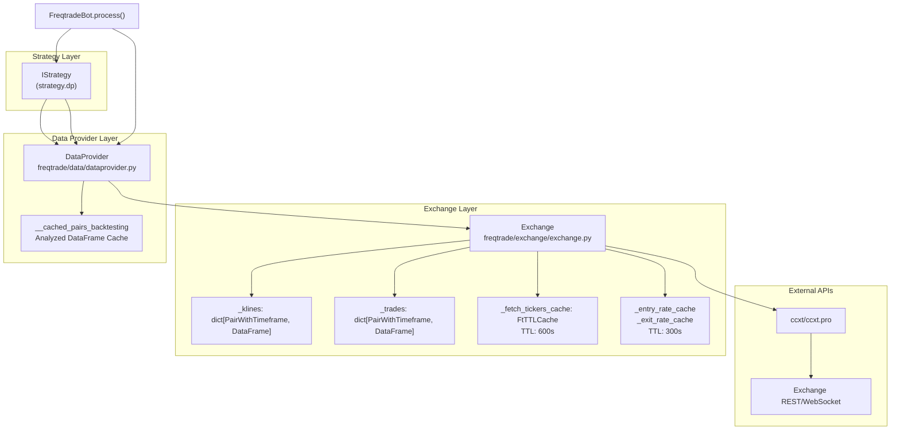
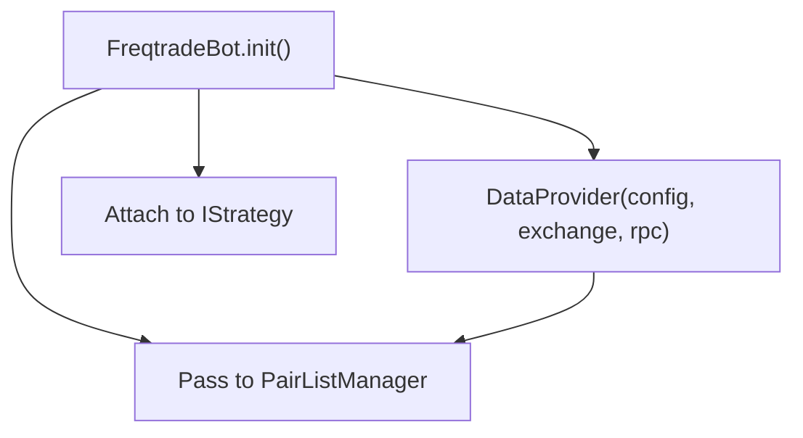
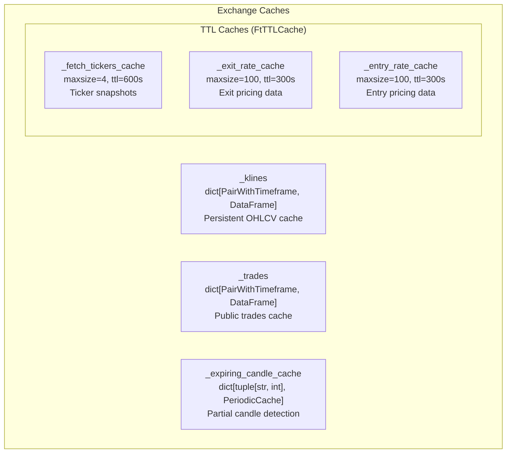
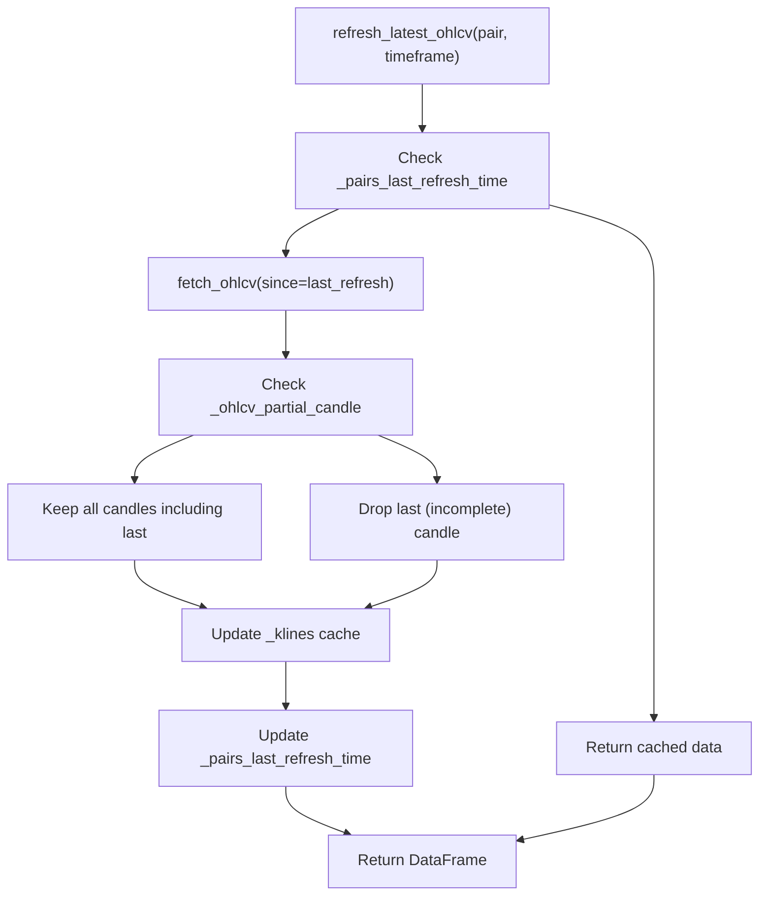
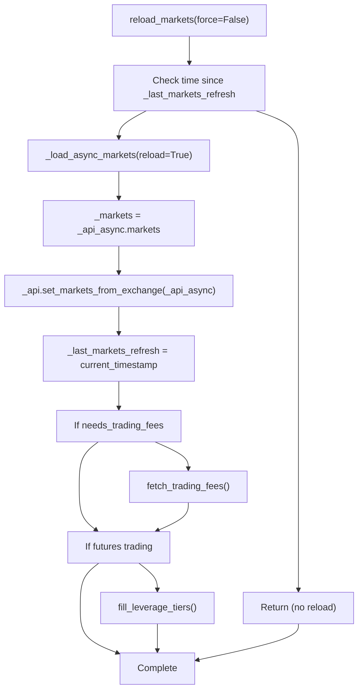
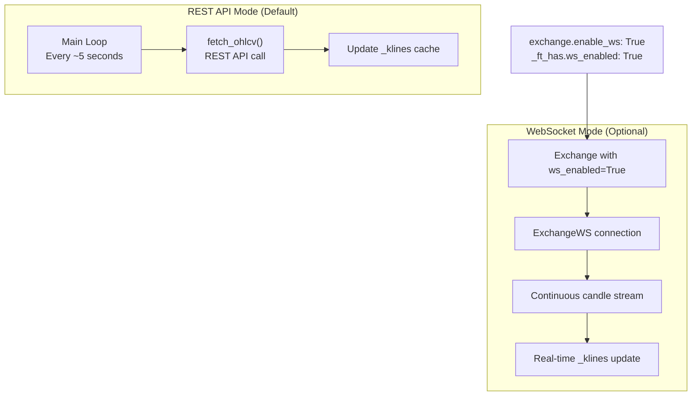
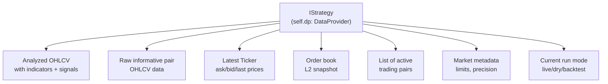
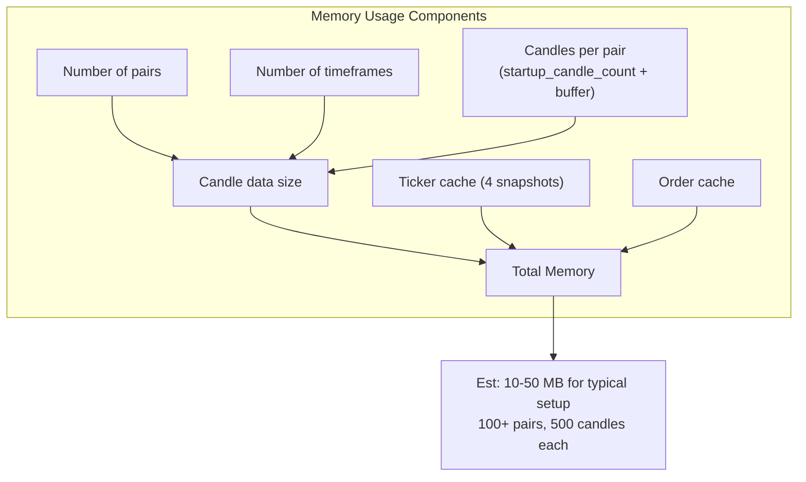

# Data Provider and Market Data Flow

Relevant source files

* [docs/bot-basics.md](https://github.com/freqtrade/freqtrade/blob/8e91fea1/docs/bot-basics.md)
* [docs/strategy-advanced.md](https://github.com/freqtrade/freqtrade/blob/8e91fea1/docs/strategy-advanced.md)
* [docs/strategy-callbacks.md](https://github.com/freqtrade/freqtrade/blob/8e91fea1/docs/strategy-callbacks.md)
* [docs/strategy-customization.md](https://github.com/freqtrade/freqtrade/blob/8e91fea1/docs/strategy-customization.md)
* [docs/strategy\_migration.md](https://github.com/freqtrade/freqtrade/blob/8e91fea1/docs/strategy_migration.md)
* [freqtrade/enums/exittype.py](https://github.com/freqtrade/freqtrade/blob/8e91fea1/freqtrade/enums/exittype.py)
* [freqtrade/exchange/binance.py](https://github.com/freqtrade/freqtrade/blob/8e91fea1/freqtrade/exchange/binance.py)
* [freqtrade/exchange/exchange.py](https://github.com/freqtrade/freqtrade/blob/8e91fea1/freqtrade/exchange/exchange.py)
* [freqtrade/exchange/kraken.py](https://github.com/freqtrade/freqtrade/blob/8e91fea1/freqtrade/exchange/kraken.py)
* [freqtrade/freqtradebot.py](https://github.com/freqtrade/freqtrade/blob/8e91fea1/freqtrade/freqtradebot.py)
* [freqtrade/strategy/\_\_init\_\_.py](https://github.com/freqtrade/freqtrade/blob/8e91fea1/freqtrade/strategy/__init__.py)
* [freqtrade/strategy/informative\_decorator.py](https://github.com/freqtrade/freqtrade/blob/8e91fea1/freqtrade/strategy/informative_decorator.py)
* [freqtrade/strategy/interface.py](https://github.com/freqtrade/freqtrade/blob/8e91fea1/freqtrade/strategy/interface.py)
* [freqtrade/strategy/strategy\_helper.py](https://github.com/freqtrade/freqtrade/blob/8e91fea1/freqtrade/strategy/strategy_helper.py)
* [freqtrade/templates/strategy\_subtemplates/strategy\_methods\_advanced.j2](https://github.com/freqtrade/freqtrade/blob/8e91fea1/freqtrade/templates/strategy_subtemplates/strategy_methods_advanced.j2)
* [tests/conftest.py](https://github.com/freqtrade/freqtrade/blob/8e91fea1/tests/conftest.py)
* [tests/exchange/test\_binance.py](https://github.com/freqtrade/freqtrade/blob/8e91fea1/tests/exchange/test_binance.py)
* [tests/exchange/test\_exchange.py](https://github.com/freqtrade/freqtrade/blob/8e91fea1/tests/exchange/test_exchange.py)
* [tests/exchange/test\_kraken.py](https://github.com/freqtrade/freqtrade/blob/8e91fea1/tests/exchange/test_kraken.py)
* [tests/strategy/strats/informative\_decorator\_strategy.py](https://github.com/freqtrade/freqtrade/blob/8e91fea1/tests/strategy/strats/informative_decorator_strategy.py)
* [tests/strategy/test\_strategy\_helpers.py](https://github.com/freqtrade/freqtrade/blob/8e91fea1/tests/strategy/test_strategy_helpers.py)

## Purpose and Scope

This page documents the `DataProvider` component and how market data flows through Freqtrade. The DataProvider acts as the central hub for market data access, coordinating data refresh cycles, managing OHLCV candles, handling informative pairs, and implementing caching mechanisms.

The DataProvider sits between the Exchange layer and Strategy layer, providing strategies with analyzed dataframes containing technical indicators while managing the underlying data refresh operations.

For historical data download and backtesting, see [Backtesting System](/freqtrade/freqtrade/3.1-backtesting-system). For database persistence, see [Persistence Layer](/freqtrade/freqtrade/2.5-persistence-layer). For exchange connectivity, see [Exchange Integration](/freqtrade/freqtrade/2.2-exchange-integration).

---

## Architecture Overview

The DataProvider implements a multi-layer architecture where market data flows from exchanges through caches to strategies. The DataProvider coordinates data refresh operations and maintains analyzed dataframes with calculated indicators.

### Data Flow Architecture



**Sources:** [freqtrade/freqtradebot.py124](https://github.com/freqtrade/freqtrade/blob/8e91fea1/freqtrade/freqtradebot.py#L124-L124) [freqtrade/freqtradebot.py130](https://github.com/freqtrade/freqtrade/blob/8e91fea1/freqtrade/freqtradebot.py#L130-L130) [freqtrade/freqtradebot.py265-268](https://github.com/freqtrade/freqtrade/blob/8e91fea1/freqtrade/freqtradebot.py#L265-L268) [freqtrade/exchange/exchange.py232-245](https://github.com/freqtrade/freqtrade/blob/8e91fea1/freqtrade/exchange/exchange.py#L232-L245)

---

## DataProvider System

The `DataProvider` class serves as the primary interface between strategies and market data. It maintains analyzed dataframes with technical indicators and coordinates data refresh operations.

### DataProvider Initialization



**Sources:** [freqtrade/freqtradebot.py124](https://github.com/freqtrade/freqtrade/blob/8e91fea1/freqtrade/freqtradebot.py#L124-L124) [freqtrade/freqtradebot.py127](https://github.com/freqtrade/freqtrade/blob/8e91fea1/freqtrade/freqtradebot.py#L127-L127) [freqtrade/freqtradebot.py130](https://github.com/freqtrade/freqtrade/blob/8e91fea1/freqtrade/freqtradebot.py#L130-L130) [freqtrade/freqtradebot.py125](https://github.com/freqtrade/freqtrade/blob/8e91fea1/freqtrade/freqtradebot.py#L125-L125)

### DataProvider Responsibilities

| Responsibility | Description | Key Methods |
| --- | --- | --- |
| **OHLCV Caching** | Store analyzed dataframes with indicators | `get_analyzed_dataframe()` |
| **Data Refresh** | Coordinate candle updates from exchange | `refresh()` |
| **Current Data** | Provide latest candle/ticker data | `current_whitelist()`, `ticker()` |
| **Order Book** | Fetch and cache order book snapshots | `orderbook()` |
| **Producer Data** | Receive external data via message consumer | `producer_pairs_dict()` |

**Sources:** [freqtrade/freqtradebot.py265-268](https://github.com/freqtrade/freqtrade/blob/8e91fea1/freqtrade/freqtradebot.py#L265-L268) [freqtrade/freqtradebot.py664](https://github.com/freqtrade/freqtrade/blob/8e91fea1/freqtrade/freqtradebot.py#L664-L664)

### Data Refresh Cycle

The `FreqtradeBot.process()` method triggers data refresh every iteration (approximately every 5 seconds):

```mermaid
sequenceDiagram
  participant FreqtradeBot.process()
  participant PairListManager
  participant DataProvider
  participant Exchange
  participant IStrategy

  FreqtradeBot.process()->>FreqtradeBot.process(): "active_pair_whitelist = _refresh_active_whitelist()"
  FreqtradeBot.process()->>PairListManager: "create_pair_list(active_pair_whitelist)"
  PairListManager-->>FreqtradeBot.process(): "pairs_with_timeframes"
  FreqtradeBot.process()->>IStrategy: "gather_informative_pairs()"
  IStrategy-->>FreqtradeBot.process(): "List[(pair, timeframe, candle_type)]"
  FreqtradeBot.process()->>DataProvider: "refresh(pairs, informative_pairs)"
  loop ["Refresh needed"]
    DataProvider->>Exchange: "refresh_latest_ohlcv(pair, timeframe, candle_type)"
    Exchange->>Exchange: "Check _pairs_last_refresh_time"
    Exchange->>Exchange: "fetch_ohlcv() via CCXT"
    Exchange->>Exchange: "Update _klines[(pair, tf, ct)]"
    Exchange-->>DataProvider: "DataFrame"
    FreqtradeBot.process()->>IStrategy: "analyze(active_pair_whitelist)"
    IStrategy->>DataProvider: "get_analyzed_dataframe(pair, timeframe)"
    DataProvider->>DataProvider: "Check cache for analyzed data"
    DataProvider->>IStrategy: "Call populate_indicators()"
    IStrategy->>IStrategy: "Calculate technical indicators"
    IStrategy->>IStrategy: "populate_entry_trend()"
    IStrategy->>IStrategy: "populate_exit_trend()"
    IStrategy-->>DataProvider: "DataFrame with indicators and signals"
    DataProvider->>DataProvider: "Store in __cached_pairs_backtesting"
    DataProvider-->>IStrategy: "Analyzed DataFrame"
  end
```

**Sources:** [freqtrade/freqtradebot.py247-276](https://github.com/freqtrade/freqtrade/blob/8e91fea1/freqtrade/freqtradebot.py#L247-L276) [freqtrade/freqtradebot.py262-268](https://github.com/freqtrade/freqtrade/blob/8e91fea1/freqtrade/freqtradebot.py#L262-L268) [freqtrade/freqtradebot.py275](https://github.com/freqtrade/freqtrade/blob/8e91fea1/freqtrade/freqtradebot.py#L275-L275)

---

## Exchange-Level Caching

The `Exchange` class implements multiple cache layers to reduce API calls and improve performance.

### Cache Types and Properties



**Sources:** [freqtrade/exchange/exchange.py232-242](https://github.com/freqtrade/freqtrade/blob/8e91fea1/freqtrade/exchange/exchange.py#L232-L242)

### Cache Implementation Details

| Cache Name | Type | TTL | Purpose | Location |
| --- | --- | --- | --- | --- |
| `_klines` | `dict` | Persistent | OHLCV candles per pair/timeframe | [exchange.py241](https://github.com/freqtrade/freqtrade/blob/8e91fea1/exchange.py#L241-L241) |
| `_trades` | `dict` | Persistent | Public trades per pair/timeframe | [exchange.py245](https://github.com/freqtrade/freqtrade/blob/8e91fea1/exchange.py#L245-L245) |
| `_fetch_tickers_cache` | `FtTTLCache` | 10 min | All tickers snapshot | [exchange.py232](https://github.com/freqtrade/freqtrade/blob/8e91fea1/exchange.py#L232-L232) |
| `_exit_rate_cache` | `FtTTLCache` | 5 min | Exit order pricing | [exchange.py237](https://github.com/freqtrade/freqtrade/blob/8e91fea1/exchange.py#L237-L237) |
| `_entry_rate_cache` | `FtTTLCache` | 5 min | Entry order pricing | [exchange.py238](https://github.com/freqtrade/freqtrade/blob/8e91fea1/exchange.py#L238-L238) |
| `_expiring_candle_cache` | `PeriodicCache` | Varies | Partial candle tracking | [exchange.py242](https://github.com/freqtrade/freqtrade/blob/8e91fea1/exchange.py#L242-L242) |

**Sources:** [freqtrade/exchange/exchange.py225-245](https://github.com/freqtrade/freqtrade/blob/8e91fea1/freqtrade/exchange/exchange.py#L225-L245)

### OHLCV Cache Access Pattern

```mermaid
sequenceDiagram
  participant DataProvider
  participant Exchange
  participant _klines: dict
  participant _pairs_last_refresh_time: dict
  participant ccxt API

  DataProvider->>Exchange: "refresh_latest_ohlcv(pair, timeframe, candle_type)"
  Exchange->>_pairs_last_refresh_time: dict: "Check _pairs_last_refresh_time[(pair, tf, ct)]"
  loop ["Timeframe interval elapsed"]
    Exchange->>ccxt API: "fetch_ohlcv(pair, timeframe, since)"
    ccxt API-->>Exchange: "Raw OHLCV data: list[list]"
    Exchange->>Exchange: "ohlcv_to_dataframe()"
    Exchange->>Exchange: "Drop partial candle if !_ohlcv_partial_candle"
    Exchange->>_klines: dict: "Update _klines[(pair, tf, ct)]"
    Exchange->>_pairs_last_refresh_time: dict: "Update last refresh timestamp"
    Exchange->>Exchange: "Skip fetch (return cached)"
  end
  DataProvider->>Exchange: "klines((pair, timeframe, candle_type))"
  Exchange->>_klines: dict: "Retrieve from _klines[(pair, tf, ct)]"
  _klines: dict-->>Exchange: "DataFrame"
  Exchange-->>DataProvider: "DataFrame.copy()"
```

**Sources:** [freqtrade/exchange/exchange.py596-600](https://github.com/freqtrade/freqtrade/blob/8e91fea1/freqtrade/exchange/exchange.py#L596-L600) [freqtrade/exchange/exchange.py226-227](https://github.com/freqtrade/freqtrade/blob/8e91fea1/freqtrade/exchange/exchange.py#L226-L227) [freqtrade/exchange/exchange.py241-243](https://github.com/freqtrade/freqtrade/blob/8e91fea1/freqtrade/exchange/exchange.py#L241-L243)

---

## OHLCV Data Management

### Candle Storage Structure

The primary OHLCV cache uses a dictionary keyed by `PairWithTimeframe`:

```
```
# Type definition
PairWithTimeframe = tuple[str, str, CandleType]

# Example cache structure
_klines = {
    ("BTC/USDT", "5m", CandleType.SPOT): DataFrame,
    ("ETH/USDT", "5m", CandleType.SPOT): DataFrame,
    ("BTC/USDT", "1h", CandleType.SPOT): DataFrame,
}
```
```

**Sources:** [freqtrade/exchange/exchange.py241](https://github.com/freqtrade/freqtrade/blob/8e91fea1/freqtrade/exchange/exchange.py#L241-L241)

### Candle Refresh Strategy



**Sources:** [freqtrade/exchange/exchange.py226-227](https://github.com/freqtrade/freqtrade/blob/8e91fea1/freqtrade/exchange/exchange.py#L226-L227) [freqtrade/exchange/exchange.py262](https://github.com/freqtrade/freqtrade/blob/8e91fea1/freqtrade/exchange/exchange.py#L262-L262)

### Partial Candle Handling

Some exchanges provide incomplete candles (current forming candle), while others only provide complete candles. The `_ohlcv_partial_candle` flag controls this behavior:

```
```
# Set during exchange initialization
self._ohlcv_partial_candle = self._ft_has["ohlcv_partial_candle"]

# Used during data processing
if not self._ohlcv_partial_candle:
    # Drop the last candle as it's incomplete
    data = data[:-1]
```
```

**Sources:** [freqtrade/exchange/exchange.py262](https://github.com/freqtrade/freqtrade/blob/8e91fea1/freqtrade/exchange/exchange.py#L262-L262) [freqtrade/exchange/exchange.py138](https://github.com/freqtrade/freqtrade/blob/8e91fea1/freqtrade/exchange/exchange.py#L138-L138)

---

## Informative Pairs

Strategies can request additional data beyond the main trading pairs through the informative pairs mechanism.

### Informative Pairs Flow

```mermaid
sequenceDiagram
  participant FreqtradeBot.process()
  participant IStrategy
  participant DataProvider
  participant Exchange

  FreqtradeBot.process()->>IStrategy: "gather_informative_pairs()"
  note over IStrategy: "Strategy can request additional pairs:
  IStrategy-->>FreqtradeBot.process(): "List[(pair, timeframe, candle_type)]"
  FreqtradeBot.process()->>DataProvider: "refresh(pairlist, informative_pairs)"
  loop ["For each informative pair"]
    DataProvider->>Exchange: "refresh_latest_ohlcv(pair, timeframe, candle_type)"
    Exchange-->>DataProvider: "DataFrame from _klines cache"
    note over IStrategy: "Later during populate_indicators()"
    IStrategy->>DataProvider: "get_pair_dataframe(informative_pair, timeframe)"
    DataProvider->>DataProvider: "Check __cached_pairs_backtesting"
    DataProvider->>Exchange: "klines((pair, timeframe, candle_type))"
    Exchange-->>DataProvider: "Raw DataFrame"
    DataProvider->>IStrategy: "Call populate_indicators() for informative"
    IStrategy-->>DataProvider: "DataFrame with indicators"
    DataProvider->>DataProvider: "Store in cache"
  end
  DataProvider-->>IStrategy: "Analyzed DataFrame"
  IStrategy->>IStrategy: "merge_informative_pair(dataframe, informative_df)"
```

**Sources:** [freqtrade/freqtradebot.py265-268](https://github.com/freqtrade/freqtrade/blob/8e91fea1/freqtrade/freqtradebot.py#L265-L268) [freqtrade/strategy/interface.py158-177](https://github.com/freqtrade/freqtrade/blob/8e91fea1/freqtrade/strategy/interface.py#L158-L177)

### Informative Pair Use Cases

| Use Case | Example | Purpose |
| --- | --- | --- |
| **Higher Timeframe Context** | Main: ETH/USDT 5m Informative: ETH/USDT 1h | Trend confirmation from higher timeframe |
| **Market Correlation** | Main: ALT/USDT Informative: BTC/USDT | Monitor Bitcoin influence on altcoin |
| **Quote Currency** | Main: ETH/BTC Informative: BTC/USDT | Calculate fiat value of position |
| **Funding Rates** | Main: ETH/USDT:USDT (futures) Informative: Funding rate data | Factor in futures funding costs |

**Sources:** [freqtrade/freqtradebot.py267](https://github.com/freqtrade/freqtrade/blob/8e91fea1/freqtrade/freqtradebot.py#L267-L267)

---

## Cache Invalidation and Refresh

### Market Reload Mechanism

The exchange reloads market data periodically to detect new pairs, delisted pairs, and updated trading rules:



**Sources:** [freqtrade/exchange/exchange.py689-724](https://github.com/freqtrade/freqtrade/blob/8e91fea1/freqtrade/exchange/exchange.py#L689-L724)

### Refresh Intervals Configuration

| Configuration | Default | Purpose | Location |
| --- | --- | --- | --- |
| `markets_refresh_interval` | 60 minutes | How often to reload market data | [exchange.py291-293](https://github.com/freqtrade/freqtrade/blob/8e91fea1/exchange.py#L291-L293) |
| Candle refresh | Timeframe-based | Fetch new candles when timeframe elapses | [exchange.py226-227](https://github.com/freqtrade/freqtrade/blob/8e91fea1/exchange.py#L226-L227) |
| `_fetch_tickers_cache` TTL | 10 minutes | Cache all tickers data | [exchange.py232](https://github.com/freqtrade/freqtrade/blob/8e91fea1/exchange.py#L232-L232) |
| `_exit_rate_cache` TTL | 5 minutes | Cache exit pricing | [exchange.py237](https://github.com/freqtrade/freqtrade/blob/8e91fea1/exchange.py#L237-L237) |

**Sources:** [freqtrade/exchange/exchange.py291-293](https://github.com/freqtrade/freqtrade/blob/8e91fea1/freqtrade/exchange/exchange.py#L291-L293) [freqtrade/exchange/exchange.py232-238](https://github.com/freqtrade/freqtrade/blob/8e91fea1/freqtrade/exchange/exchange.py#L232-L238)

---

## WebSocket Data Streaming

Freqtrade supports WebSocket-based data streaming for exchanges that provide it, bypassing REST API polling.

### WebSocket vs REST API



**Sources:** [freqtrade/exchange/exchange.py279-286](https://github.com/freqtrade/freqtrade/blob/8e91fea1/freqtrade/exchange/exchange.py#L279-L286) [freqtrade/exchange/exchange.py167](https://github.com/freqtrade/freqtrade/blob/8e91fea1/freqtrade/exchange/exchange.py#L167-L167)

### WebSocket Initialization

```
```
# In Exchange.__init__()
_has_watch_ohlcv = self.exchange_has("watchOHLCV") and self._ft_has["ws_enabled"]
if (
    self._config["runmode"] in TRADE_MODES
    and exchange_conf.get("enable_ws", True)
    and _has_watch_ohlcv
):
    self._ws_async = self._init_ccxt(exchange_conf, False, ccxt_async_config)
    self._exchange_ws = ExchangeWS(self._config, self._ws_async)
```
```

**Sources:** [freqtrade/exchange/exchange.py279-286](https://github.com/freqtrade/freqtrade/blob/8e91fea1/freqtrade/exchange/exchange.py#L279-L286)

---

## Ticker and Order Book Caching

### Ticker Cache Strategy

```mermaid
sequenceDiagram
  participant RPC/REST API
  participant Exchange.get_tickers()
  participant _fetch_tickers_cache: FtTTLCache
  participant ccxt.fetch_tickers()

  RPC/REST API->>Exchange.get_tickers(): "get_tickers(symbols, cached=True)"
  Exchange.get_tickers()->>_fetch_tickers_cache: FtTTLCache: "Check cache[(market_type, symbol_hash)]"
  loop ["Cache hit (TTL < 600s)"]
    _fetch_tickers_cache: FtTTLCache-->>Exchange.get_tickers(): "Cached Tickers dict"
    Exchange.get_tickers()-->>RPC/REST API: "Return cached data"
    Exchange.get_tickers()->>ccxt.fetch_tickers(): "fetch_tickers(symbols)"
    ccxt.fetch_tickers()-->>Exchange.get_tickers(): "dict[symbol, Ticker]"
    Exchange.get_tickers()->>Exchange.get_tickers(): "Process and validate tickers"
    Exchange.get_tickers()->>_fetch_tickers_cache: FtTTLCache: "Store in _fetch_tickers_cache with TTL=600s"
    Exchange.get_tickers()-->>RPC/REST API: "Return fresh data"
  end
```

**Sources:** [freqtrade/exchange/exchange.py232-233](https://github.com/freqtrade/freqtrade/blob/8e91fea1/freqtrade/exchange/exchange.py#L232-L233)

### Order Book Access

Order books are **not cached** due to their rapidly changing nature. Each request fetches fresh data:

```
```
# Direct fetch, no caching
def fetch_l2_order_book(self, pair: str, limit: int = 100) -> OrderBook:
    return self._api.fetch_order_book(pair, limit)
```
```

This ensures strategies always work with current order book data when making depth-of-market checks.

**Sources:** [freqtrade/freqtradebot.py837](https://github.com/freqtrade/freqtrade/blob/8e91fea1/freqtrade/freqtradebot.py#L837-L837)

---

## Data Access Patterns by Component

### Strategy Data Access Methods



**Sources:** [freqtrade/strategy/interface.py135](https://github.com/freqtrade/freqtrade/blob/8e91fea1/freqtrade/strategy/interface.py#L135-L135) [freqtrade/freqtradebot.py130](https://github.com/freqtrade/freqtrade/blob/8e91fea1/freqtrade/freqtradebot.py#L130-L130) [freqtrade/freqtradebot.py664](https://github.com/freqtrade/freqtrade/blob/8e91fea1/freqtrade/freqtradebot.py#L664-L664)

### RPC/API Data Access

RPC endpoints and the REST API use different caching strategies optimized for user interface updates:

```
```
# RPC typically requests cached data to avoid stale UI
exchange.get_tickers(cached=True)  # Uses 10-minute TTL cache

# Entry/exit rate caching for RPC status display
exchange._exit_rate_cache  # 5-minute TTL
exchange._entry_rate_cache  # 5-minute TTL
```
```

**Sources:** [freqtrade/exchange/exchange.py237-238](https://github.com/freqtrade/freqtrade/blob/8e91fea1/freqtrade/exchange/exchange.py#L237-L238)

---

## Performance Considerations

### Cache Tuning Parameters

| Parameter | Impact | Trade-off |
| --- | --- | --- |
| **Larger TTL** | Fewer API calls, lower costs | More stale data, slower reaction |
| **Smaller TTL** | Fresher data, faster signals | More API calls, rate limit risk |
| **More pairs** | Better opportunity detection | Higher memory, more API calls |
| **Higher timeframe** | Less frequent updates | Slower signal generation |

### Memory Footprint



**Sources:** [freqtrade/exchange/exchange.py232](https://github.com/freqtrade/freqtrade/blob/8e91fea1/freqtrade/exchange/exchange.py#L232-L232) [freqtrade/exchange/exchange.py241-245](https://github.com/freqtrade/freqtrade/blob/8e91fea1/freqtrade/exchange/exchange.py#L241-L245)

### API Rate Limit Management

The caching system is designed to respect exchange rate limits:

1. **Batch requests**: `refresh()` fetches multiple pairs in sequence but uses cached data when possible
2. **TTL caches**: Prevent rapid repeated requests for the same data
3. **Partial candle handling**: Reduces need for frequent updates on exchanges that provide them
4. **WebSocket fallback**: Eliminates REST API polling when supported

**Sources:** [freqtrade/exchange/exchange.py279-286](https://github.com/freqtrade/freqtrade/blob/8e91fea1/freqtrade/exchange/exchange.py#L279-L286) [freqtrade/exchange/exchange.py226-227](https://github.com/freqtrade/freqtrade/blob/8e91fea1/freqtrade/exchange/exchange.py#L226-L227)

---

## Summary

The Freqtrade data management system provides:

* **Multi-layer caching** from Exchange to DataProvider to Strategy
* **Configurable TTL** for different data types based on update frequency needs
* **Informative pairs** for multi-pair/multi-timeframe strategies
* **WebSocket support** for real-time data on supported exchanges
* **Rate limit protection** through intelligent caching
* **Memory-efficient** storage using Pandas DataFrames

The architecture balances data freshness with API efficiency, allowing strategies to access market data with minimal latency while respecting exchange limitations.

**Sources:** [freqtrade/freqtradebot.py124-130](https://github.com/freqtrade/freqtrade/blob/8e91fea1/freqtrade/freqtradebot.py#L124-L130) [freqtrade/freqtradebot.py265-268](https://github.com/freqtrade/freqtrade/blob/8e91fea1/freqtrade/freqtradebot.py#L265-L268) [freqtrade/exchange/exchange.py225-286](https://github.com/freqtrade/freqtrade/blob/8e91fea1/freqtrade/exchange/exchange.py#L225-L286) [freqtrade/exchange/exchange.py595-608](https://github.com/freqtrade/freqtrade/blob/8e91fea1/freqtrade/exchange/exchange.py#L595-L608)