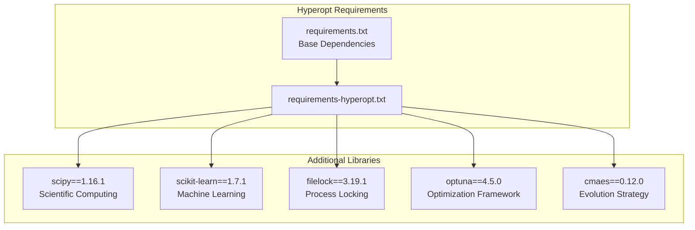
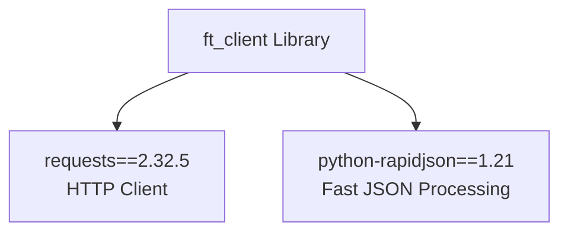
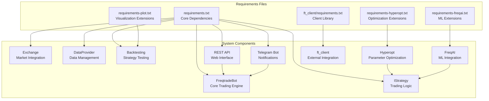

# Dependencies and Requirements

Relevant source files

* [.pre-commit-config.yaml](https://github.com/freqtrade/freqtrade/blob/8e91fea1/.pre-commit-config.yaml)
* [docs/includes/pricing.md](https://github.com/freqtrade/freqtrade/blob/8e91fea1/docs/includes/pricing.md)
* [docs/requirements-docs.txt](https://github.com/freqtrade/freqtrade/blob/8e91fea1/docs/requirements-docs.txt)
* [ft\_client/requirements.txt](https://github.com/freqtrade/freqtrade/blob/8e91fea1/ft_client/requirements.txt)
* [pyproject.toml](https://github.com/freqtrade/freqtrade/blob/8e91fea1/pyproject.toml)
* [requirements-dev.txt](https://github.com/freqtrade/freqtrade/blob/8e91fea1/requirements-dev.txt)
* [requirements-freqai.txt](https://github.com/freqtrade/freqtrade/blob/8e91fea1/requirements-freqai.txt)
* [requirements-hyperopt.txt](https://github.com/freqtrade/freqtrade/blob/8e91fea1/requirements-hyperopt.txt)
* [requirements.txt](https://github.com/freqtrade/freqtrade/blob/8e91fea1/requirements.txt)
* [tests/test\_pip\_audit.py](https://github.com/freqtrade/freqtrade/blob/8e91fea1/tests/test_pip_audit.py)

This document provides a comprehensive overview of Freqtrade's Python dependencies, system requirements, and optional component installations. It covers the core requirements needed for basic trading functionality as well as additional dependencies for advanced features like hyperparameter optimization and machine learning integration.

For information about installation procedures and environment setup, see [Installation and Setup](/freqtrade/freqtrade/1.1-architecture-overview). For configuration of these dependencies after installation, see [Configuration System](/freqtrade/freqtrade/1.3-dependencies-and-requirements).

## Core Dependencies Overview

Freqtrade's dependency structure is organized into several requirement files that support different functional areas. The core system requires a substantial set of Python packages to handle data processing, exchange connectivity, web APIs, and database operations.

### Dependency Categories

The main dependency categories serve distinct purposes within the system architecture:

| Category | Purpose | Key Packages |
| --- | --- | --- |
| Data Processing | Numerical computation and data manipulation | `numpy`, `pandas`, `bottleneck`, `numexpr` |
| Technical Analysis | Trading indicators and market analysis | `ft-pandas-ta`, `ta-lib`, `technical` |
| Exchange Connectivity | Cryptocurrency exchange integration | `ccxt`, `cryptography`, `aiohttp` |
| Database Operations | Data persistence and ORM | `SQLAlchemy` |
| Communication | Telegram bot and HTTP clients | `python-telegram-bot`, `requests`, `httpx` |
| API Server | REST API and web interface | `fastapi`, `pydantic`, `uvicorn` |
| Data Serialization | Efficient data formats and JSON processing | `pyarrow`, `python-rapidjson`, `orjson` |

Sources: [requirements.txt1-64](https://github.com/freqtrade/freqtrade/blob/8e91fea1/requirements.txt#L1-L64)

### Core Requirements Architecture

```mermaid
flowchart TD

SERIALIZATION["High-Performance JSON/Data"]
RAPIDJSON["python-rapidjson==1.21"]
ORJSON["orjson==3.11.3"]
PYARROW["pyarrow==21.0.0"]
DATA["Data Processing Layer"]
INDICATORS["Technical Analysis"]
EXCHANGE["Exchange Integration"]
DATABASE["Database Layer"]
API["API Server"]
COMMS["Communications"]
NUMPY["numpy==2.3.2"]
PANDAS["pandas==2.3.2"]
BOTTLENECK["bottleneck==1.5.0"]
NUMEXPR["numexpr==2.11.0"]
FTPANDASTA["ft-pandas-ta==0.3.15"]
TALIB["ta-lib==0.6.7"]
TECHNICAL["technical==1.5.3"]
CCXT["ccxt==4.5.3"]
CRYPTO["cryptography==45.0.7"]
AIOHTTP["aiohttp==3.12.15"]
TELEGRAM["python-telegram-bot==22.3"]
REQUESTS["requests==2.32.5"]
HTTPX["httpx>=0.24.1"]
SQLALCHEMY["SQLAlchemy==2.0.43"]
FASTAPI["fastapi==0.116.1"]
PYDANTIC["pydantic==2.11.7"]
UVICORN["uvicorn==0.35.0"]

DATA --> NUMPY
DATA --> PANDAS
DATA --> BOTTLENECK
DATA --> NUMEXPR
INDICATORS --> FTPANDASTA
INDICATORS --> TALIB
INDICATORS --> TECHNICAL
EXCHANGE --> CCXT
EXCHANGE --> CRYPTO
EXCHANGE --> AIOHTTP
COMMS --> TELEGRAM
COMMS --> REQUESTS
COMMS --> HTTPX
DATABASE --> SQLALCHEMY
API --> FASTAPI
API --> PYDANTIC
API --> UVICORN

subgraph subGraph4 ["Persistence and API"]
    SQLALCHEMY
    FASTAPI
    PYDANTIC
    UVICORN
end

subgraph subGraph3 ["Exchange and Network"]
    CCXT
    CRYPTO
    AIOHTTP
    TELEGRAM
    REQUESTS
    HTTPX
end

subgraph subGraph2 ["Technical Analysis Libraries"]
    FTPANDASTA
    TALIB
    TECHNICAL
end

subgraph subGraph1 ["Data Processing Libraries"]
    NUMPY
    PANDAS
    BOTTLENECK
    NUMEXPR
end

subgraph subGraph0 ["Core System Dependencies"]
    DATA
    INDICATORS
    EXCHANGE
    DATABASE
    API
    COMMS
end

subgraph subGraph5 ["Data Serialization"]
    SERIALIZATION
    RAPIDJSON
    ORJSON
    PYARROW
    SERIALIZATION --> RAPIDJSON
    SERIALIZATION --> ORJSON
    SERIALIZATION --> PYARROW
end
```



Sources: [requirements.txt1-64](https://github.com/freqtrade/freqtrade/blob/8e91fea1/requirements.txt#L1-L64)

## Optional Dependency Groups

Freqtrade provides several optional dependency groups that extend core functionality for specific use cases.

### Hyperparameter Optimization Dependencies

The hyperopt functionality requires additional scientific computing and optimization libraries:



Sources: [requirements-hyperopt.txt1-10](https://github.com/freqtrade/freqtrade/blob/8e91fea1/requirements-hyperopt.txt#L1-L10)

### FreqAI Machine Learning Dependencies

The FreqAI system extends the hyperopt dependencies with additional machine learning frameworks:

| Package | Version | Purpose | Platform Notes |
| --- | --- | --- | --- |
| `catboost` | 1.2.8 | Gradient boosting | Not available on ARM |
| `lightgbm` | 4.6.0 | Gradient boosting | Cross-platform |
| `xgboost` | 3.0.5 | Extreme gradient boosting | Cross-platform |
| `tensorboard` | 2.20.0 | ML visualization | Cross-platform |
| `datasieve` | 0.1.9 | Data preprocessing | Cross-platform |

Sources: [requirements-freqai.txt1-13](https://github.com/freqtrade/freqtrade/blob/8e91fea1/requirements-freqai.txt#L1-L13)

### Client Library Dependencies

The `ft_client` package provides a minimal dependency set for external applications:



Sources: [ft\_client/requirements.txt1-4](https://github.com/freqtrade/freqtrade/blob/8e91fea1/ft_client/requirements.txt#L1-L4)

## Component Dependency Mapping

This diagram shows how requirement groups map to major system components:



Sources: [requirements.txt1-64](https://github.com/freqtrade/freqtrade/blob/8e91fea1/requirements.txt#L1-L64) [requirements-hyperopt.txt1-10](https://github.com/freqtrade/freqtrade/blob/8e91fea1/requirements-hyperopt.txt#L1-L10) [requirements-freqai.txt1-13](https://github.com/freqtrade/freqtrade/blob/8e91fea1/requirements-freqai.txt#L1-L13) [ft\_client/requirements.txt1-4](https://github.com/freqtrade/freqtrade/blob/8e91fea1/ft_client/requirements.txt#L1-L4)

## Platform-Specific Considerations

### ARM Architecture Limitations

Several dependencies have platform-specific versions or limitations:

#### PyArrow Version Differences

```
```
# Standard platforms
pyarrow==21.0.0; platform_machine != 'armv7l' and platform_machine != "aarch64"
# ARM64 platforms (downgraded due to upstream issue)
pyarrow==20.0.0; platform_machine == "aarch64"
```
```

#### CatBoost ARM Exclusion

```
```
# CatBoost is not available on ARM architectures
catboost==1.2.8; 'arm' not in platform_machine
```
```

Sources: [requirements.txt28-30](https://github.com/freqtrade/freqtrade/blob/8e91fea1/requirements.txt#L28-L30) [requirements-freqai.txt8](https://github.com/freqtrade/freqtrade/blob/8e91fea1/requirements-freqai.txt#L8-L8)

### Version Pinning Strategy

Freqtrade uses strict version pinning for most dependencies to ensure reproducible builds. Notable exceptions include:

* `httpx>=0.24.1` - Uses minimum version due to `python-telegram-bot` compatibility requirements
* Dependencies are regularly updated to latest stable versions for security and performance

Sources: [requirements.txt15-16](https://github.com/freqtrade/freqtrade/blob/8e91fea1/requirements.txt#L15-L16)

## System Requirements

### Python Version Compatibility

Freqtrade requires Python 3.8 or higher. The specific version requirements are determined by the most restrictive dependencies, particularly:

* `pandas` and `numpy` for data processing capabilities
* `SQLAlchemy` 2.0+ for modern database ORM features
* `fastapi` and `pydantic` for modern async web API support

### Memory and Performance Considerations

Key performance-oriented dependencies include:

| Package | Purpose | Performance Benefit |
| --- | --- | --- |
| `bottleneck` | Fast NumPy array operations | 30% faster array operations |
| `numexpr` | Fast numerical expression evaluation | Optimized mathematical computations |
| `python-rapidjson` | Fast JSON parsing | 30% faster ticker file loading |
| `orjson` | Fast JSON serialization | Optimized API response formatting |
| `pyarrow` | Columnar data format | Efficient historical data storage |

Sources: [requirements.txt3-4](https://github.com/freqtrade/freqtrade/blob/8e91fea1/requirements.txt#L3-L4) [requirements.txt32-35](https://github.com/freqtrade/freqtrade/blob/8e91fea1/requirements.txt#L32-L35)

### Optional System Dependencies

Some features require system-level dependencies:

* **TA-Lib**: Requires system installation of TA-Lib C library for technical analysis
* **Database backends**: PostgreSQL client libraries for production database usage
* **Plotting**: Additional system libraries may be required for advanced visualization features

Sources: [requirements.txt7](https://github.com/freqtrade/freqtrade/blob/8e91fea1/requirements.txt#L7-L7)