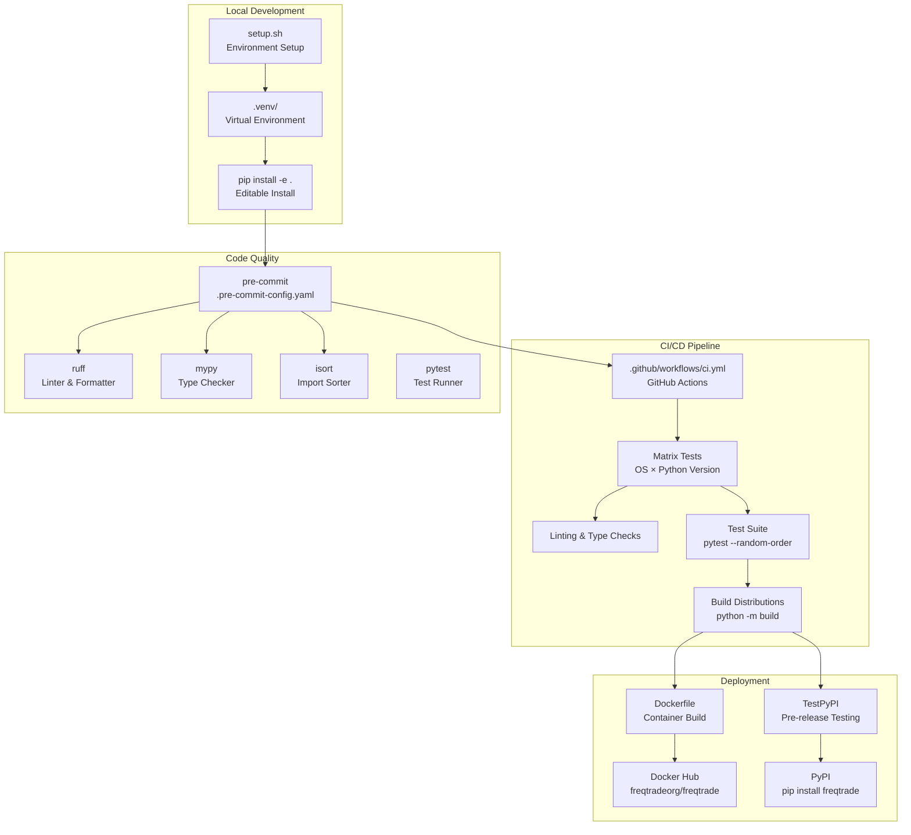
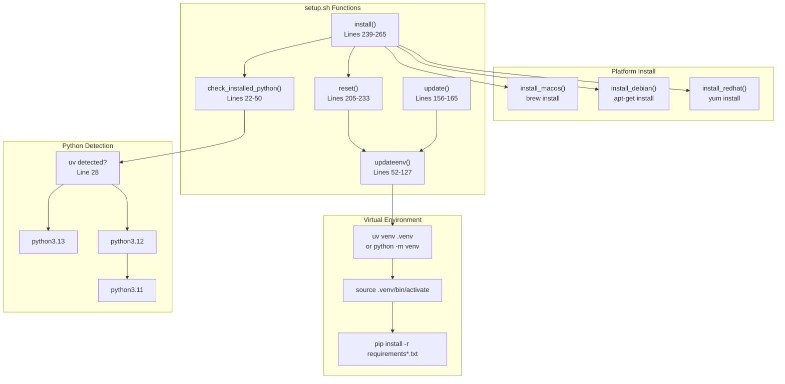
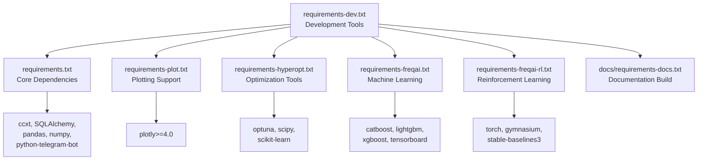
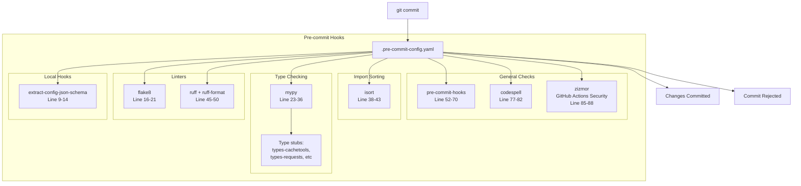
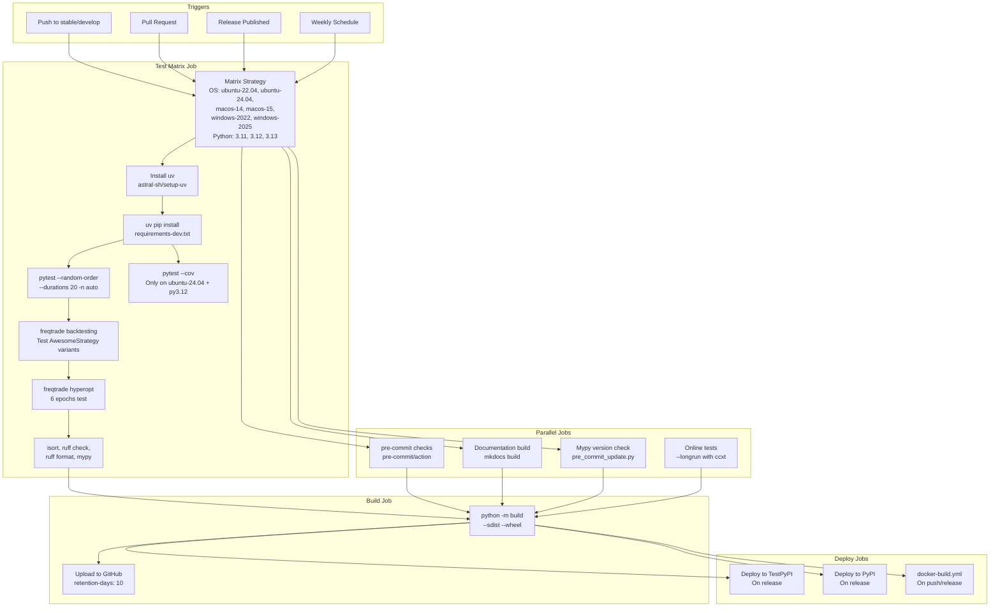
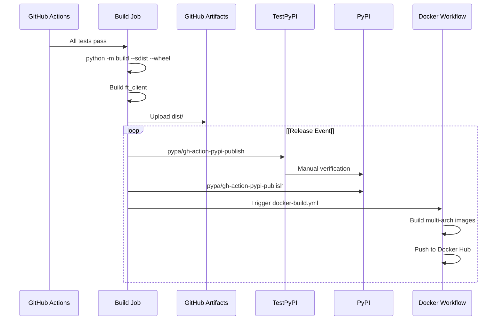
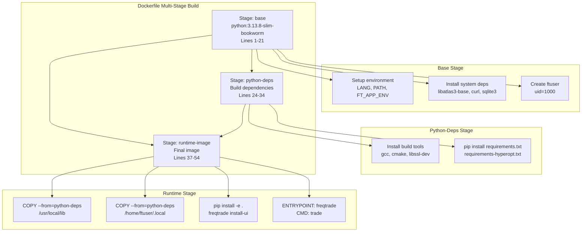
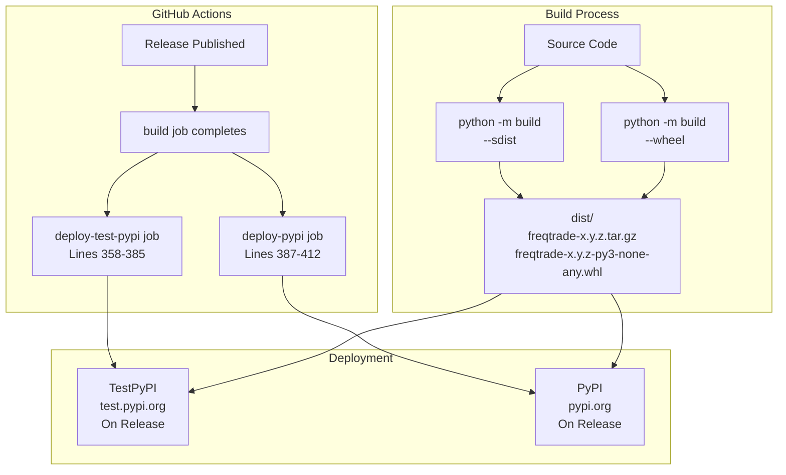

# Development and Deployment

Relevant source files

* [.github/workflows/ci.yml](https://github.com/freqtrade/freqtrade/blob/8e91fea1/.github/workflows/ci.yml)
* [.pre-commit-config.yaml](https://github.com/freqtrade/freqtrade/blob/8e91fea1/.pre-commit-config.yaml)
* [Dockerfile](https://github.com/freqtrade/freqtrade/blob/8e91fea1/Dockerfile)
* [docker/Dockerfile.armhf](https://github.com/freqtrade/freqtrade/blob/8e91fea1/docker/Dockerfile.armhf)
* [pyproject.toml](https://github.com/freqtrade/freqtrade/blob/8e91fea1/pyproject.toml)
* [requirements-dev.txt](https://github.com/freqtrade/freqtrade/blob/8e91fea1/requirements-dev.txt)
* [setup.sh](https://github.com/freqtrade/freqtrade/blob/8e91fea1/setup.sh)
* [tests/test\_pip\_audit.py](https://github.com/freqtrade/freqtrade/blob/8e91fea1/tests/test_pip_audit.py)

This page provides an overview of the development workflow, deployment strategies, and infrastructure used to build, test, and distribute Freqtrade. It covers local development environment setup, code quality tools, the CI/CD pipeline, Docker containerization, and PyPI distribution.

For detailed information about specific aspects:

* Development environment configuration and tools: see [Development Environment Setup](/freqtrade/freqtrade/6.1-development-environment-setup)
* CI/CD workflows and Docker builds: see [CI/CD Pipeline and Docker](/freqtrade/freqtrade/6.2-cicd-pipeline-and-docker)
* Testing strategies and frameworks: see [Testing Infrastructure](/freqtrade/freqtrade/6.3-code-quality-and-testing)

## Development Workflow Overview

The Freqtrade project follows a structured development workflow that emphasizes code quality, automated testing, and reproducible deployments. The process begins with local development setup, progresses through automated quality checks, and culminates in distribution via Docker images and PyPI packages.

### Development to Deployment Flow



**Sources:** [setup.sh1-305](https://github.com/freqtrade/freqtrade/blob/8e91fea1/setup.sh#L1-L305) [.pre-commit-config.yaml1-89](https://github.com/freqtrade/freqtrade/blob/8e91fea1/.pre-commit-config.yaml#L1-L89) [.github/workflows/ci.yml1-439](https://github.com/freqtrade/freqtrade/blob/8e91fea1/.github/workflows/ci.yml#L1-L439) [Dockerfile1-54](https://github.com/freqtrade/freqtrade/blob/8e91fea1/Dockerfile#L1-L54)

## Development Environment

### Environment Setup Script

The `setup.sh` script automates the process of creating a development environment, handling platform-specific dependencies, and installing Python packages. It supports multiple operating systems and Python versions.



**Sources:** [setup.sh1-305](https://github.com/freqtrade/freqtrade/blob/8e91fea1/setup.sh#L1-L305)

Key setup script functions:

| Function | Purpose | Line Range |
| --- | --- | --- |
| `check_installed_python()` | Detects Python 3.11-3.13, prioritizes `uv` if available | [setup.sh22-50](https://github.com/freqtrade/freqtrade/blob/8e91fea1/setup.sh#L22-L50) |
| `updateenv()` | Installs dependencies based on user selection (dev/plot/hyperopt/freqai) | [setup.sh52-127](https://github.com/freqtrade/freqtrade/blob/8e91fea1/setup.sh#L52-L127) |
| `install()` | Full installation including system dependencies and environment setup | [setup.sh239-265](https://github.com/freqtrade/freqtrade/blob/8e91fea1/setup.sh#L239-L265) |
| `install_macos()` | Installs Homebrew dependencies (gettext, libomp) | [setup.sh130-141](https://github.com/freqtrade/freqtrade/blob/8e91fea1/setup.sh#L130-L141) |
| `install_debian()` | Installs apt packages (gcc, build-essential, python-dev) | [setup.sh144-147](https://github.com/freqtrade/freqtrade/blob/8e91fea1/setup.sh#L144-L147) |
| `reset()` | Hard resets branch and recreates virtual environment | [setup.sh205-233](https://github.com/freqtrade/freqtrade/blob/8e91fea1/setup.sh#L205-L233) |

### Dependency Management

Freqtrade uses a modular requirements structure to minimize installation overhead for users who don't need all features:



**Sources:** [requirements-dev.txt1-33](https://github.com/freqtrade/freqtrade/blob/8e91fea1/requirements-dev.txt#L1-L33) [pyproject.toml30-133](https://github.com/freqtrade/freqtrade/blob/8e91fea1/pyproject.toml#L30-L133)

The `pyproject.toml` defines optional dependencies that can be installed selectively:

```
```
# From pyproject.toml
[project.optional-dependencies]
plot = ["plotly>=4.0"]
hyperopt = ["scipy", "scikit-learn", "optuna > 4.0.0", "cmaes", "filelock"]
freqai = ["scikit-learn", "catboost", "lightgbm", "xgboost", "tensorboard", "datasieve>=0.1.5"]
freqai_rl = ["torch", "gymnasium", "stable-baselines3", "sb3-contrib", "tqdm"]
develop = ["isort", "mypy", "pre-commit", "pytest", "pytest-cov", "ruff", ...]
```
```

**Sources:** [pyproject.toml75-132](https://github.com/freqtrade/freqtrade/blob/8e91fea1/pyproject.toml#L75-L132)

## Code Quality Tools

Freqtrade employs multiple automated code quality tools integrated via pre-commit hooks and CI checks.

### Pre-commit Configuration



**Sources:** [.pre-commit-config.yaml1-89](https://github.com/freqtrade/freqtrade/blob/8e91fea1/.pre-commit-config.yaml#L1-L89)

### Tool Configuration Details

| Tool | Purpose | Configuration | Key Settings |
| --- | --- | --- | --- |
| **ruff** | Fast Python linter and formatter | [pyproject.toml252-328](https://github.com/freqtrade/freqtrade/blob/8e91fea1/pyproject.toml#L252-L328) | line-length=100, extends select: C90, B, F, E, W, UP, I, A, TID, YTT, S, PTH, RUF, ASYNC, NPY |
| **mypy** | Static type checker | [pyproject.toml194-216](https://github.com/freqtrade/freqtrade/blob/8e91fea1/pyproject.toml#L194-L216) | ignore\_missing\_imports=true, warn\_unused\_ignores=true, sqlalchemy plugin |
| **isort** | Import statement sorter | [pyproject.toml177-183](https://github.com/freqtrade/freqtrade/blob/8e91fea1/pyproject.toml#L177-L183) | line\_length=100, profile="black", known\_first\_party=["freqtrade\_client"] |
| **pytest** | Test framework | [pyproject.toml185-192](https://github.com/freqtrade/freqtrade/blob/8e91fea1/pyproject.toml#L185-L192) | asyncio\_mode="auto", addopts="--dist loadscope" |
| **flake8** | Legacy linter (phasing out) | [pyproject.toml329-342](https://github.com/freqtrade/freqtrade/blob/8e91fea1/pyproject.toml#L329-L342) | max-line-length=100, max-complexity=12 |

**Sources:** [pyproject.toml156-347](https://github.com/freqtrade/freqtrade/blob/8e91fea1/pyproject.toml#L156-L347)

### Ruff Lint Rules

The project uses an extensive set of Ruff rules to catch common issues:

```
```
# From pyproject.toml lines 257-279
[tool.ruff.lint]
extend-select = [
  "C90",    # mccabe - complexity checking
  "B",      # bugbear - common bugs
  "F",      # pyflakes - invalid Python code
  "E",      # pycodestyle errors
  "W",      # pycodestyle warnings
  "UP",     # pyupgrade - modernize Python code
  "I",      # isort - import sorting
  "A",      # flake8-builtins - shadowing builtins
  "TID",    # flake8-tidy-imports
  "YTT",    # flake8-2020
  "S",      # flake8-bandit - security issues
  "PTH",    # flake8-use-pathlib
  "RUF",    # ruff-specific rules
  "ASYNC",  # flake8-async
  "NPY",    # numpy-specific rules
]
```
```

**Sources:** [pyproject.toml257-279](https://github.com/freqtrade/freqtrade/blob/8e91fea1/pyproject.toml#L257-L279)

## CI/CD Pipeline

The GitHub Actions workflow orchestrates testing, building, and deployment across multiple platforms and Python versions.

### CI Workflow Structure



**Sources:** [.github/workflows/ci.yml1-439](https://github.com/freqtrade/freqtrade/blob/8e91fea1/.github/workflows/ci.yml#L1-L439)

### Test Matrix Configuration

The CI runs tests across a comprehensive matrix to ensure compatibility:

| Dimension | Values | Purpose |
| --- | --- | --- |
| Operating Systems | ubuntu-22.04, ubuntu-24.04, macos-14, macos-15, windows-2022, windows-2025 | Cross-platform compatibility |
| Python Versions | 3.11, 3.12, 3.13 | Multiple Python version support |
| Test Modes | Standard, Coverage, Online | Different test scopes |

**Sources:** [.github/workflows/ci.yml27-28](https://github.com/freqtrade/freqtrade/blob/8e91fea1/.github/workflows/ci.yml#L27-L28)

### Key CI Steps

```
```
# From .github/workflows/ci.yml
- name: Installation (python)
  run: |
    uv pip install --upgrade wheel
    uv pip install -r requirements-dev.txt
    uv pip install -e ft_client/
    uv pip install -e .

- name: Tests
  run: |
    pytest --random-order --durations 20 -n auto

- name: Tests with Coveralls
  if: (runner.os == 'Linux' && matrix.python-version == '3.12' && matrix.os == 'ubuntu-24.04')
  run: |
    pytest --random-order --cov=freqtrade --cov=freqtrade_client --cov-config=.coveragerc

- name: Run Ruff
  run: |
    ruff check --output-format=github

- name: Mypy
  if: ${{ matrix.os == 'ubuntu-24.04' || matrix.os == 'macos-15' }}
  run: |
    mypy freqtrade scripts tests
```
```

**Sources:** [.github/workflows/ci.yml56-156](https://github.com/freqtrade/freqtrade/blob/8e91fea1/.github/workflows/ci.yml#L56-L156)

### Build and Deployment Steps



**Sources:** [.github/workflows/ci.yml305-428](https://github.com/freqtrade/freqtrade/blob/8e91fea1/.github/workflows/ci.yml#L305-L428)

## Docker Deployment

Freqtrade uses multi-stage Docker builds to create optimized container images. There are two Dockerfiles: the main `Dockerfile` for amd64 and `docker/Dockerfile.armhf` for ARM devices like Raspberry Pi.

### Docker Build Architecture



**Sources:** [Dockerfile1-54](https://github.com/freqtrade/freqtrade/blob/8e91fea1/Dockerfile#L1-L54)

### Dockerfile Stages

| Stage | Base Image | Purpose | Key Commands |
| --- | --- | --- | --- |
| `base` | python:3.13.8-slim-bookworm | Runtime environment setup | Create ftuser, install runtime libs [Dockerfile1-21](https://github.com/freqtrade/freqtrade/blob/8e91fea1/Dockerfile#L1-L21) |
| `python-deps` | Inherits from base | Build Python dependencies | Install gcc, build wheels [Dockerfile24-34](https://github.com/freqtrade/freqtrade/blob/8e91fea1/Dockerfile#L24-L34) |
| `runtime-image` | Inherits from base | Final minimal image | Copy deps, install freqtrade [Dockerfile37-54](https://github.com/freqtrade/freqtrade/blob/8e91fea1/Dockerfile#L37-L54) |

### ARMHF (Raspberry Pi) Build

The ARM build uses a specialized approach to handle platform constraints:

```
```
# From docker/Dockerfile.armhf
FROM python:3.11.13-slim-bookworm AS base

# Install ARM-specific dependencies
RUN apt-get -y install libatlas3-base libopenblas-dev \
    libutf8proc-dev libsnappy-dev

# Use piwheels for faster ARM builds
RUN echo "[global]\nextra-index-url=https://www.piwheels.org/simple" > /etc/pip.conf

# Install precompiled ARM wheels
RUN pip install --user --only-binary=:all: --find-links /tmp/ pyarrow TA-Lib
```
```

**Sources:** [docker/Dockerfile.armhf1-58](https://github.com/freqtrade/freqtrade/blob/8e91fea1/docker/Dockerfile.armhf#L1-L58)

Key differences in ARM build:

* Uses Python 3.11 instead of 3.13 (better ARM support)
* Installs ARM-specific libraries: libopenblas-dev, libutf8proc-dev
* Uses piwheels.org for precompiled ARM packages
* Pre-builds TA-Lib and pyarrow binaries

### Docker Environment Variables

| Variable | Value | Purpose |
| --- | --- | --- |
| `FT_APP_ENV` | "docker" | Indicates Docker environment |
| `PATH` | /home/ftuser/.local/bin:$PATH | User-local binaries |
| `LD_LIBRARY_PATH` | /usr/local/lib | Shared libraries location |
| `PYTHONDONTWRITEBYTECODE` | 1 | Disable .pyc files |
| `PYTHONFAULTHANDLER` | 1 | Enable fault handler |

**Sources:** [Dockerfile4-9](https://github.com/freqtrade/freqtrade/blob/8e91fea1/Dockerfile#L4-L9)

## PyPI Distribution

Freqtrade is distributed via PyPI as both source distribution (sdist) and wheel packages.

### Build Configuration

The build system uses setuptools with configuration in `pyproject.toml`:

```
```
# From pyproject.toml
[build-system]
requires = ["setuptools >= 64.0.0", "wheel"]
build-backend = "setuptools.build_meta"

[project]
name = "freqtrade"
dynamic = ["version"]
requires-python = ">=3.11"

[project.scripts]
freqtrade = "freqtrade.main:main"

[tool.setuptools.packages.find]
where = ["."]
include = ["freqtrade*"]
exclude = ["tests", "tests.*", "user_data", "user_data*"]
```
```

**Sources:** [pyproject.toml1-154](https://github.com/freqtrade/freqtrade/blob/8e91fea1/pyproject.toml#L1-L154)

### PyPI Deployment Flow



**Sources:** [.github/workflows/ci.yml332-412](https://github.com/freqtrade/freqtrade/blob/8e91fea1/.github/workflows/ci.yml#L332-L412) [pyproject.toml1-6](https://github.com/freqtrade/freqtrade/blob/8e91fea1/pyproject.toml#L1-L6)

### Version Management

The version is dynamically extracted from the codebase:

```
```
# From pyproject.toml
[tool.setuptools.dynamic]
version = {attr = "freqtrade.__version__"}
```
```

This references `freqtrade/__init__.py` where the version is defined as a string constant.

**Sources:** [pyproject.toml153-154](https://github.com/freqtrade/freqtrade/blob/8e91fea1/pyproject.toml#L153-L154)

## Development Best Practices

### Pre-commit Hook Installation

For development installations, pre-commit hooks are automatically installed:

```
```
# From setup.sh lines 120-126
if [[ $dev =~ ^[Yy]$ ]]; then
    ${PYTHON} -m pre_commit install
    if [ $? -ne 0 ]; then
        echo "Failed installing pre-commit"
        exit 1
    fi
fi
```
```

**Sources:** [setup.sh120-126](https://github.com/freqtrade/freqtrade/blob/8e91fea1/setup.sh#L120-L126)

### Local Testing Commands

| Command | Purpose | Equivalent CI Step |
| --- | --- | --- |
| `pytest --random-order -n auto` | Run tests in parallel | [.github/workflows/ci.yml70](https://github.com/freqtrade/freqtrade/blob/8e91fea1/.github/workflows/ci.yml#L70-L70) |
| `ruff check .` | Lint code | [.github/workflows/ci.yml146](https://github.com/freqtrade/freqtrade/blob/8e91fea1/.github/workflows/ci.yml#L146-L146) |
| `ruff format --check` | Check formatting | [.github/workflows/ci.yml150](https://github.com/freqtrade/freqtrade/blob/8e91fea1/.github/workflows/ci.yml#L150-L150) |
| `isort --check .` | Check import sorting | [.github/workflows/ci.yml142](https://github.com/freqtrade/freqtrade/blob/8e91fea1/.github/workflows/ci.yml#L142-L142) |
| `mypy freqtrade scripts tests` | Type check | [.github/workflows/ci.yml155](https://github.com/freqtrade/freqtrade/blob/8e91fea1/.github/workflows/ci.yml#L155-L155) |
| `pre-commit run --all-files` | Run all pre-commit hooks | [.github/workflows/ci.yml205](https://github.com/freqtrade/freqtrade/blob/8e91fea1/.github/workflows/ci.yml#L205-L205) |

### Repository Verification

The CI includes a check to ensure generated files are up to date:

```
```
# From .github/workflows/ci.yml lines 100-110
- name: Check for repository changes - *nix
  run: |
    if [ -n "$(git status --porcelain)" ]; then
      echo "Repository is dirty, changes detected:"
      git status
      git diff
      exit 1
    else
      echo "Repository is clean, no changes detected."
    fi
```
```

This catches cases where developers forget to run code generation scripts like `extract_config_json_schema.py` or `create_command_partials.py`.

**Sources:** [.github/workflows/ci.yml100-123](https://github.com/freqtrade/freqtrade/blob/8e91fea1/.github/workflows/ci.yml#L100-L123)

## Platform-Specific Considerations

### macOS Setup

macOS requires Homebrew and specific libraries:

```
```
# From setup.sh lines 130-141
function install_macos() {
    if [ ! -x "$(command -v brew)" ]
    then
        echo_block "Installing Brew"
        /usr/bin/ruby -e "$(curl -fsSL https://raw.githubusercontent.com/Homebrew/install/master/install)"
    fi

    brew install gettext libomp
}
```
```

The `libomp` (OpenMP) library is essential for parallelization in machine learning libraries like LightGBM.

**Sources:** [setup.sh130-141](https://github.com/freqtrade/freqtrade/blob/8e91fea1/setup.sh#L130-L141) [.github/workflows/ci.yml49-54](https://github.com/freqtrade/freqtrade/blob/8e91fea1/.github/workflows/ci.yml#L49-L54)

### Windows Support

Windows testing includes PowerShell-specific tests:

```
```
# From .github/workflows/ci.yml lines 157-166
- name: Run Pester tests (PowerShell)
  if: ${{ runner.os == 'Windows' }}
  shell: powershell
  run: |
    $PSVersionTable
    Set-PSRepository psgallery -InstallationPolicy trusted
    Install-Module -Name Pester -RequiredVersion 5.3.1 -Confirm:$false -Force
    $Error.clear()
    Invoke-Pester -Path "tests" -CI
    if ($Error.Length -gt 0) {exit 1}
```
```

**Sources:** [.github/workflows/ci.yml157-166](https://github.com/freqtrade/freqtrade/blob/8e91fea1/.github/workflows/ci.yml#L157-L166)

### UV Package Manager

The project supports the `uv` package manager for faster installations:

```
```
# From setup.sh lines 28-33
if [ -x "$(command -v uv)" ]; then
    echo "uv detected — using it instead of pip for faster installation."
    PIP="uv pip"
    PYTHON="python3.13"
    UV=true
    return
fi
```
```

When `uv` is available, it's used throughout the installation process instead of pip, significantly speeding up dependency resolution and installation.

**Sources:** [setup.sh28-33](https://github.com/freqtrade/freqtrade/blob/8e91fea1/setup.sh#L28-L33) [.github/workflows/ci.yml40-47](https://github.com/freqtrade/freqtrade/blob/8e91fea1/.github/workflows/ci.yml#L40-L47)