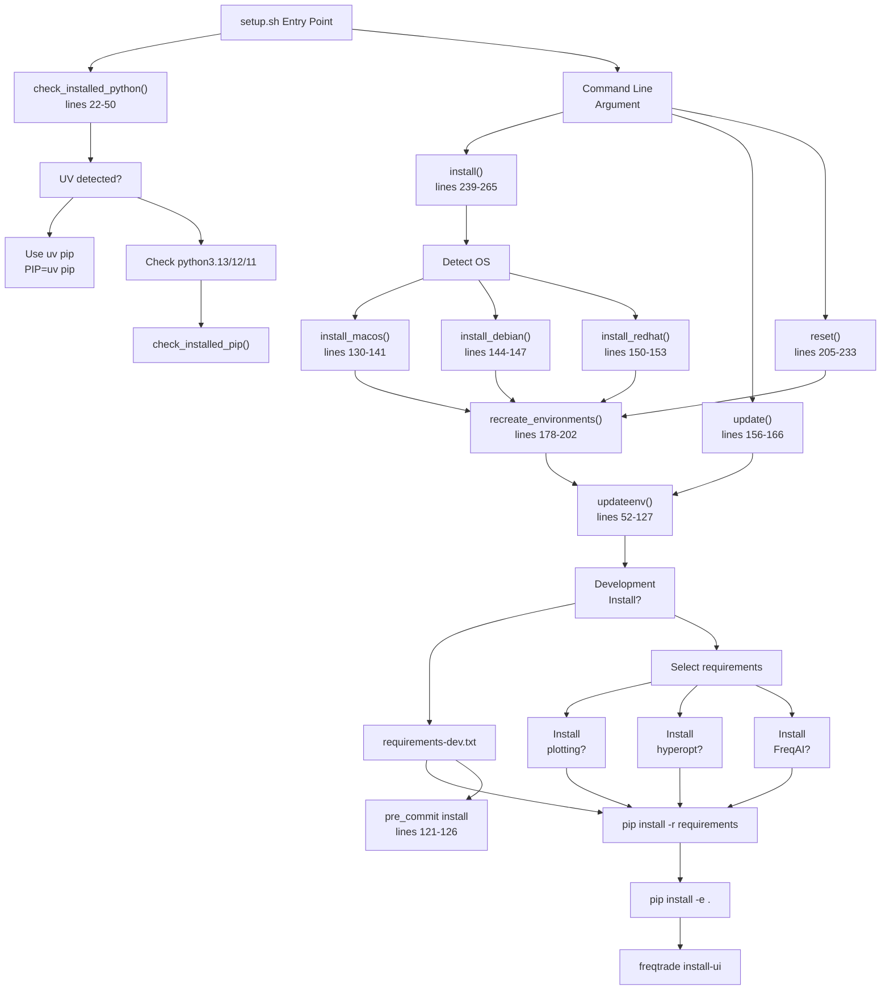
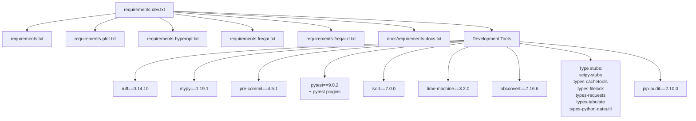
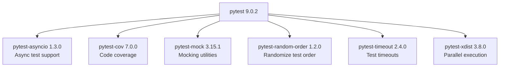
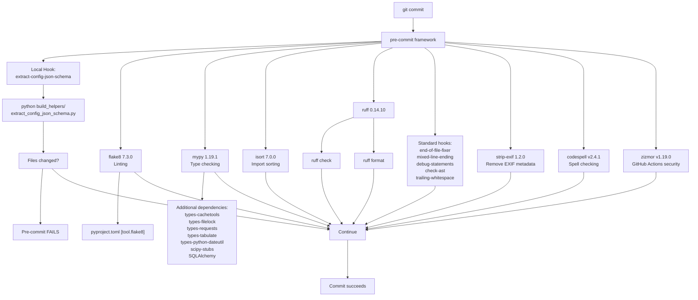
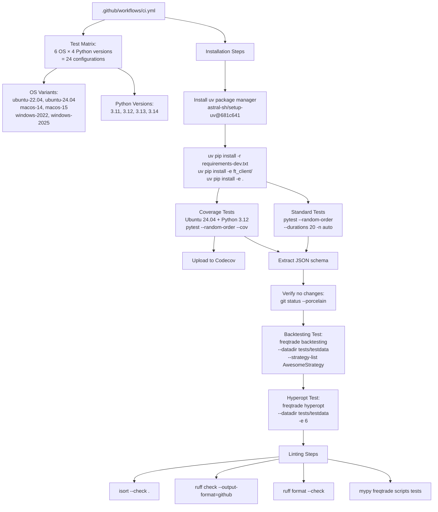
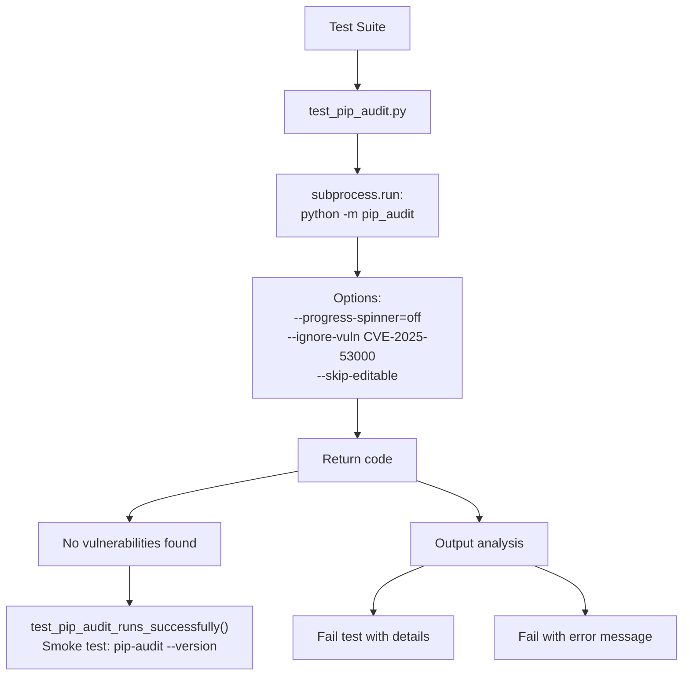
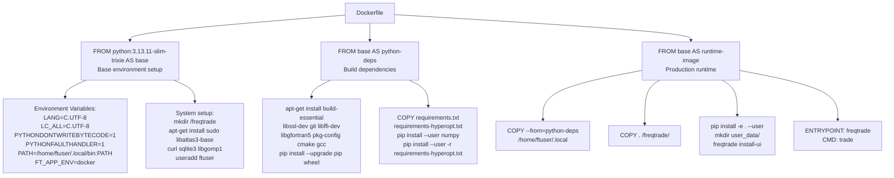

# Development Environment Setup

Relevant source files

* [.github/workflows/ci.yml](https://github.com/freqtrade/freqtrade/blob/8e91fea1/.github/workflows/ci.yml)
* [.pre-commit-config.yaml](https://github.com/freqtrade/freqtrade/blob/8e91fea1/.pre-commit-config.yaml)
* [Dockerfile](https://github.com/freqtrade/freqtrade/blob/8e91fea1/Dockerfile)
* [docker/Dockerfile.armhf](https://github.com/freqtrade/freqtrade/blob/8e91fea1/docker/Dockerfile.armhf)
* [pyproject.toml](https://github.com/freqtrade/freqtrade/blob/8e91fea1/pyproject.toml)
* [requirements-dev.txt](https://github.com/freqtrade/freqtrade/blob/8e91fea1/requirements-dev.txt)
* [setup.sh](https://github.com/freqtrade/freqtrade/blob/8e91fea1/setup.sh)
* [tests/test\_pip\_audit.py](https://github.com/freqtrade/freqtrade/blob/8e91fea1/tests/test_pip_audit.py)

This document describes the process and tools for setting up a development environment for contributing to Freqtrade. It covers the installation script, virtual environment configuration, development dependencies, code quality tools (ruff, mypy, isort), pre-commit hooks, and the testing infrastructure. For CI/CD pipeline configuration and deployment processes, see [CI/CD Pipeline and Docker](/freqtrade/freqtrade/6.2-cicd-pipeline-and-docker). For general installation instructions for end users, see [Installation and Setup](/freqtrade/freqtrade/1.2-installation-and-setup).

## Setup Script Architecture

Freqtrade provides an automated setup script at [setup.sh1-305](https://github.com/freqtrade/freqtrade/blob/8e91fea1/setup.sh#L1-L305) that handles environment initialization across different platforms. The script follows a function-based architecture with platform-specific installers.

### Setup Script Functions



**Sources:** [setup.sh1-305](https://github.com/freqtrade/freqtrade/blob/8e91fea1/setup.sh#L1-L305)

### Platform Detection and Dependencies

The script detects the operating system and installs platform-specific dependencies:

| Platform | Detection Method | Dependencies Installed | Function |
| --- | --- | --- | --- |
| macOS | `uname -s` == "Darwin" | brew, gettext, libomp | `install_macos()` [setup.sh130-141](https://github.com/freqtrade/freqtrade/blob/8e91fea1/setup.sh#L130-L141) |
| Debian/Ubuntu | `command -v apt-get` | gcc, build-essential, autoconf, libtool, pkg-config, make, wget, git, curl, libpython-dev | `install_debian()` [setup.sh144-147](https://github.com/freqtrade/freqtrade/blob/8e91fea1/setup.sh#L144-L147) |
| RedHat/CentOS | `command -v yum` | gcc, gcc-c++, make, autoconf, libtool, pkg-config, wget, git, python-devel | `install_redhat()` [setup.sh150-153](https://github.com/freqtrade/freqtrade/blob/8e91fea1/setup.sh#L150-L153) |

**Sources:** [setup.sh130-153](https://github.com/freqtrade/freqtrade/blob/8e91fea1/setup.sh#L130-L153)

### UV Package Manager Support

The script automatically detects and uses `uv` if available for faster dependency installation:

```
```
if [ -x "$(command -v uv)" ]; then
    echo "uv detected — using it instead of pip for faster installation."
    PIP="uv pip"
    PYTHON="python3.13"
    UV=true
fi
```
```

When creating virtual environments with `uv`:

```
```
if [ "$UV" = true ] ; then
    uv venv .venv --python=${PYTHON}
else
    ${PYTHON} -m venv .venv
fi
```
```

**Sources:** [setup.sh28-33](https://github.com/freqtrade/freqtrade/blob/8e91fea1/setup.sh#L28-L33) [setup.sh191-196](https://github.com/freqtrade/freqtrade/blob/8e91fea1/setup.sh#L191-L196)

## Development Dependencies Structure

The development dependency chain is hierarchical, with `requirements-dev.txt` including all lower-level requirement files.

### Dependency Inclusion Diagram



**Sources:** [requirements-dev.txt1-34](https://github.com/freqtrade/freqtrade/blob/8e91fea1/requirements-dev.txt#L1-L34)

### Core Development Tools

| Tool | Version | Purpose | Configuration File |
| --- | --- | --- | --- |
| `ruff` | 0.14.10 | Fast Python linter and formatter | [pyproject.toml252-295](https://github.com/freqtrade/freqtrade/blob/8e91fea1/pyproject.toml#L252-L295) |
| `mypy` | 1.19.1 | Static type checker | [pyproject.toml194-217](https://github.com/freqtrade/freqtrade/blob/8e91fea1/pyproject.toml#L194-L217) |
| `isort` | 7.0.0 | Import statement sorter | [pyproject.toml177-183](https://github.com/freqtrade/freqtrade/blob/8e91fea1/pyproject.toml#L177-L183) |
| `pre-commit` | 4.5.1 | Git hook manager | [.pre-commit-config.yaml1-89](https://github.com/freqtrade/freqtrade/blob/8e91fea1/.pre-commit-config.yaml#L1-L89) |
| `pytest` | 9.0.2 | Testing framework | [pyproject.toml185-192](https://github.com/freqtrade/freqtrade/blob/8e91fea1/pyproject.toml#L185-L192) |
| `pip-audit` | 2.10.0 | Security vulnerability scanner | [tests/test\_pip\_audit.py1-93](https://github.com/freqtrade/freqtrade/blob/8e91fea1/tests/test_pip_audit.py#L1-L93) |

**Sources:** [requirements-dev.txt9-33](https://github.com/freqtrade/freqtrade/blob/8e91fea1/requirements-dev.txt#L9-L33) [pyproject.toml1-347](https://github.com/freqtrade/freqtrade/blob/8e91fea1/pyproject.toml#L1-L347)

### Pytest Plugin Ecosystem



**Sources:** [requirements-dev.txt12-18](https://github.com/freqtrade/freqtrade/blob/8e91fea1/requirements-dev.txt#L12-L18)

## Pre-commit Hook System

Pre-commit hooks run automatically before each git commit to enforce code quality standards. The configuration chains multiple tools in sequence.

### Pre-commit Hook Execution Flow



**Sources:** [.pre-commit-config.yaml1-89](https://github.com/freqtrade/freqtrade/blob/8e91fea1/.pre-commit-config.yaml#L1-L89)

### Pre-commit Installation

Pre-commit hooks are automatically installed when running `setup.sh --install` with development dependencies:

```
```
if [[ $dev =~ ^[Yy]$ ]]; then
    ${PYTHON} -m pre_commit install
    if [ $? -ne 0 ]; then
        echo "Failed installing pre-commit"
        exit 1
    fi
fi
```
```

Manual installation:

```
```
source .venv/bin/activate
pre-commit install
```
```

**Sources:** [setup.sh120-126](https://github.com/freqtrade/freqtrade/blob/8e91fea1/setup.sh#L120-L126)

## Code Quality Tool Configuration

All code quality tools are configured through [pyproject.toml1-347](https://github.com/freqtrade/freqtrade/blob/8e91fea1/pyproject.toml#L1-L347) providing centralized configuration management.

### Tool Configuration Mapping

```mermaid
flowchart TD

PyProject["pyproject.toml"]
RuffConfig["[tool.ruff]<br>lines 252-295"]
MypyConfig["[tool.mypy]<br>lines 194-217"]
IsortConfig["[tool.isort]<br>lines 177-183"]
PytestConfig["[tool.pytest.ini_options]<br>lines 185-192"]
Flake8Config["[tool.flake8]<br>lines 329-342"]
CodespellConfig["[tool.codespell]<br>lines 344-346"]
RuffLine["line-length = 100"]
RuffLint["[tool.ruff.lint]<br>Enabled checks:<br>C90, B, F, E, W, UP, I,<br>A, TID, YTT, S, PTH,<br>RUF, ASYNC, NPY"]
RuffMccabe["[tool.ruff.lint.mccabe]<br>max-complexity = 12"]
RuffIgnore["Per-file ignores"]
MypyIgnore["ignore_missing_imports = true"]
MypyWarn["warn_unused_ignores = true"]
MypyPlugin["SQLAlchemy plugin"]
MypyOverrides["Test file overrides"]
IsortLine["line_length = 100"]
IsortProfile["profile = black"]
IsortSkip["skip_glob patterns"]
PytestLog["Log format config"]
PytestAsync["asyncio_mode = auto"]
PytestDist["addopts = --dist loadscope"]

PyProject --> RuffConfig
PyProject --> MypyConfig
PyProject --> IsortConfig
PyProject --> PytestConfig
PyProject --> Flake8Config
PyProject --> CodespellConfig
RuffConfig --> RuffLine
RuffConfig --> RuffLint
RuffConfig --> RuffMccabe
RuffConfig --> RuffIgnore
MypyConfig --> MypyIgnore
MypyConfig --> MypyWarn
MypyConfig --> MypyPlugin
MypyConfig --> MypyOverrides
IsortConfig --> IsortLine
IsortConfig --> IsortProfile
IsortConfig --> IsortSkip
PytestConfig --> PytestLog
PytestConfig --> PytestAsync
PytestConfig --> PytestDist
```



**Sources:** [pyproject.toml177-346](https://github.com/freqtrade/freqtrade/blob/8e91fea1/pyproject.toml#L177-L346)

### Ruff Configuration Details

Ruff is configured to replace multiple legacy tools (flake8, pylint, pyupgrade) with a single fast linter:

| Setting | Value | Purpose |
| --- | --- | --- |
| `line-length` | 100 | Maximum line length |
| `extend-exclude` | `.env`, `.venv` | Directories to skip |
| Enabled rule sets | C90 (mccabe), B (bugbear), F (pyflakes), E/W (pycodestyle), UP (pyupgrade), I (isort), A (builtins), TID (tidy-imports), YTT (2020), S (bandit), PTH (pathlib), RUF (ruff-specific), ASYNC, NPY (numpy) | Comprehensive linting |
| `max-complexity` | 12 | Maximum cyclomatic complexity |

**Sources:** [pyproject.toml252-298](https://github.com/freqtrade/freqtrade/blob/8e91fea1/pyproject.toml#L252-L298)

### Mypy Type Checking Configuration

```
```
[tool.mypy]
ignore_missing_imports = true
namespace_packages = false
warn_unused_ignores = true
exclude = [
    '^build_helpers\.py$',
    '^ft_client/build/.*$',
]
plugins = [
  "sqlalchemy.ext.mypy.plugin"
]
```
```

Test files have relaxed type checking:

```
```
[[tool.mypy.overrides]]
module = "tests.*"
ignore_errors = true
```
```

**Sources:** [pyproject.toml194-217](https://github.com/freqtrade/freqtrade/blob/8e91fea1/pyproject.toml#L194-L217)

### isort Import Organization

```
```
[tool.isort]
line_length = 100
profile = "black"
lines_after_imports = 2
skip_glob = ["**/.env*", "**/env/*", "**/.venv/*", "**/docs/*", "**/user_data/*"]
known_first_party = ["freqtrade_client"]
```
```

**Sources:** [pyproject.toml177-183](https://github.com/freqtrade/freqtrade/blob/8e91fea1/pyproject.toml#L177-L183)

## Testing Infrastructure

The testing system uses pytest with extensive parallel execution and code coverage tracking.

### Test Execution Configuration



**Sources:** [.github/workflows/ci.yml1-430](https://github.com/freqtrade/freqtrade/blob/8e91fea1/.github/workflows/ci.yml#L1-L430)

### Pytest Command Line Options

From the CI configuration [.github/workflows/ci.yml70-75](https://github.com/freqtrade/freqtrade/blob/8e91fea1/.github/workflows/ci.yml#L70-L75):

| Option | Purpose |
| --- | --- |
| `--random-order` | Randomize test execution order to detect hidden dependencies |
| `--durations 20` | Show 20 slowest tests |
| `-n auto` | Parallel execution using all available CPU cores (pytest-xdist) |
| `--cov=freqtrade --cov=freqtrade_client` | Enable code coverage tracking |
| `--cov-config=.coveragerc` | Coverage configuration file |
| `--longrun` | Include long-running tests (online tests) |

**Sources:** [.github/workflows/ci.yml70-273](https://github.com/freqtrade/freqtrade/blob/8e91fea1/.github/workflows/ci.yml#L70-L273)

### pytest.ini Configuration

```
```
[tool.pytest.ini_options]
log_format = "%(asctime)s %(levelname)s %(message)s"
log_date_format = "%Y-%m-%d %H:%M:%S"
asyncio_mode = "auto"
asyncio_default_fixture_loop_scope = "function"
addopts = "--dist loadscope"
```
```

The `--dist loadscope` option distributes tests to workers by module, ensuring module-scoped fixtures work correctly in parallel execution.

**Sources:** [pyproject.toml185-192](https://github.com/freqtrade/freqtrade/blob/8e91fea1/pyproject.toml#L185-L192)

## Security Vulnerability Scanning

Freqtrade includes automated security scanning using `pip-audit` to detect known vulnerabilities in dependencies.

### pip-audit Integration



**Sources:** [tests/test\_pip\_audit.py1-93](https://github.com/freqtrade/freqtrade/blob/8e91fea1/tests/test_pip_audit.py#L1-L93)

The test ignores `CVE-2025-53000` (nbconvert Windows vulnerability) as documented in [tests/test\_pip\_audit.py20-22](https://github.com/freqtrade/freqtrade/blob/8e91fea1/tests/test_pip_audit.py#L20-L22):

```
```
# Note: CVE-2025-53000 (nbconvert Windows vulnerability) is ignored as it only affects
# Windows platforms and is a known acceptable risk for this project.
```
```

**Sources:** [tests/test\_pip\_audit.py14-72](https://github.com/freqtrade/freqtrade/blob/8e91fea1/tests/test_pip_audit.py#L14-L72) [requirements-dev.txt33](https://github.com/freqtrade/freqtrade/blob/8e91fea1/requirements-dev.txt#L33-L33)

## CI/CD Integration Points

The development environment integrates tightly with the CI/CD pipeline to ensure local development matches CI behavior.

### CI Test Matrix

From [.github/workflows/ci.yml26-28](https://github.com/freqtrade/freqtrade/blob/8e91fea1/.github/workflows/ci.yml#L26-L28):

```
```
matrix:
  os: [ "ubuntu-22.04", "ubuntu-24.04", "macos-14", "macos-15" , "windows-2022", "windows-2025" ]
  python-version: ["3.11", "3.12", "3.13", "3.14"]
```
```

This creates 24 test configurations (6 OS × 4 Python versions) that run on every push, pull request, and schedule.

**Sources:** [.github/workflows/ci.yml22-29](https://github.com/freqtrade/freqtrade/blob/8e91fea1/.github/workflows/ci.yml#L22-L29)

### UV Package Manager in CI

The CI uses the same `uv` package manager detection as the local setup script:

```
```
- name: Install uv
  uses: astral-sh/setup-uv@681c641aba71e4a1c380be3ab5e12ad51f415867 # v7.1.6
  with:
    activate-environment: true
    enable-cache: true
    python-version: ${{ matrix.python-version }}
    cache-dependency-glob: "requirements**.txt"
    cache-suffix: "${{ matrix.python-version }}"
```
```

**Sources:** [.github/workflows/ci.yml40-47](https://github.com/freqtrade/freqtrade/blob/8e91fea1/.github/workflows/ci.yml#L40-L47)

### Pre-commit CI Job

A dedicated CI job runs pre-commit checks separately [.github/workflows/ci.yml195-206](https://github.com/freqtrade/freqtrade/blob/8e91fea1/.github/workflows/ci.yml#L195-L206):

```
```
pre-commit:
  name: "Pre-commit checks"
  runs-on: ubuntu-22.04
  steps:
  - uses: actions/checkout@v6.0.1
  - uses: actions/setup-python@v6
    with:
      python-version: "3.12"
  - uses: pre-commit/action@2c7b3805fd2a0fd8c1884dcaebf91fc102a13ecd # v3.0.1
```
```

**Sources:** [.github/workflows/ci.yml195-206](https://github.com/freqtrade/freqtrade/blob/8e91fea1/.github/workflows/ci.yml#L195-L206)

## Docker Development Environment

For developers preferring containerized environments, Freqtrade provides multi-stage Dockerfiles that mirror the local setup process.

### Dockerfile Structure



**Sources:** [Dockerfile1-54](https://github.com/freqtrade/freqtrade/blob/8e91fea1/Dockerfile#L1-L54)

### ARM-specific Docker Configuration

For ARM platforms (like Raspberry Pi), a specialized Dockerfile exists at [docker/Dockerfile.armhf1-58](https://github.com/freqtrade/freqtrade/blob/8e91fea1/docker/Dockerfile.armhf#L1-L58) that uses piwheels for precompiled ARM binaries:

```
```
RUN echo "[global]\nextra-index-url=https://www.piwheels.org/simple" > /etc/pip.conf
```
```

**Sources:** [docker/Dockerfile.armhf1-58](https://github.com/freqtrade/freqtrade/blob/8e91fea1/docker/Dockerfile.armhf#L1-L58)

## Development Workflow Summary

### Initial Setup

```
```
# Clone repository
git clone https://github.com/freqtrade/freqtrade.git
cd freqtrade

# Run setup script (install option)
./setup.sh --install
# Answer prompts:
# - Development install? [y/N] - Answer 'y' for full dev environment
# - This installs all dependencies and sets up pre-commit hooks

# Activate virtual environment
source .venv/bin/activate
```
```

**Sources:** [setup.sh239-265](https://github.com/freqtrade/freqtrade/blob/8e91fea1/setup.sh#L239-L265)

### Daily Development

```
```
# Activate environment
source .venv/bin/activate

# Run tests
pytest --random-order -n auto

# Run linting manually
isort --check .
ruff check
ruff format --check
mypy freqtrade scripts tests

# Or let pre-commit run all checks
pre-commit run --all-files
```
```

**Sources:** [.github/workflows/ci.yml140-155](https://github.com/freqtrade/freqtrade/blob/8e91fea1/.github/workflows/ci.yml#L140-L155)

### Updating Dependencies

```
```
# Pull latest changes
git pull

# Update environment
./setup.sh --update
# This will:
# - Update pip dependencies
# - Reinstall the package in editable mode
# - Update freqUI
```
```

**Sources:** [setup.sh156-166](https://github.com/freqtrade/freqtrade/blob/8e91fea1/setup.sh#L156-L166)

### Reset Environment

```
```
# Hard reset (removes all local changes)
./setup.sh --reset
# This will:
# - Reset git branch to origin
# - Delete and recreate virtual environment
# - Reinstall all dependencies
```
```

**Sources:** [setup.sh205-233](https://github.com/freqtrade/freqtrade/blob/8e91fea1/setup.sh#L205-L233)