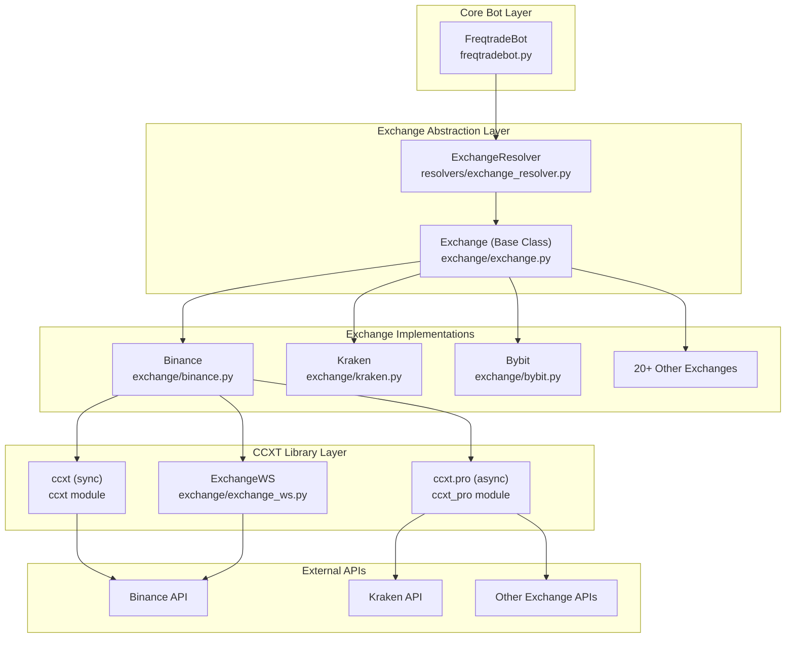
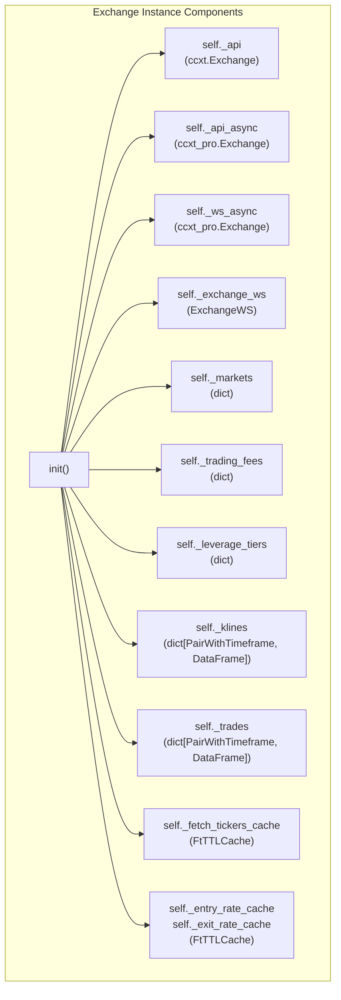
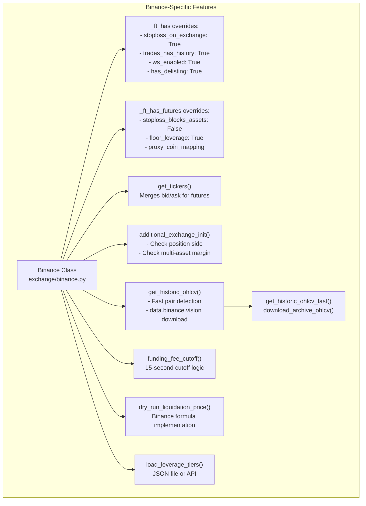
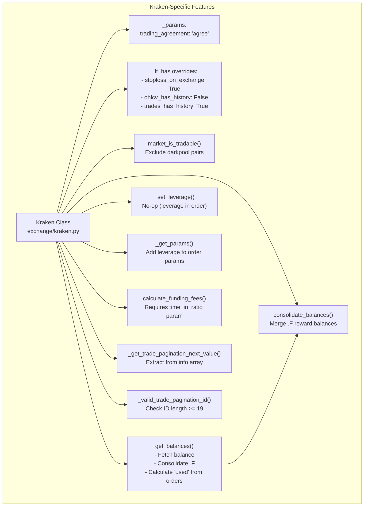
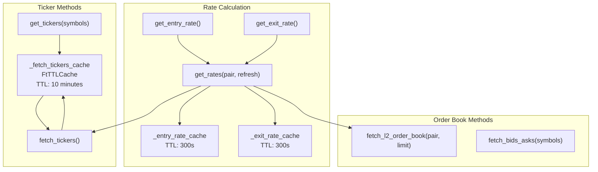
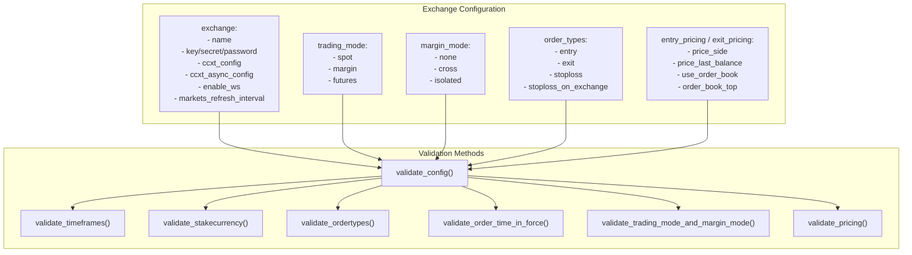
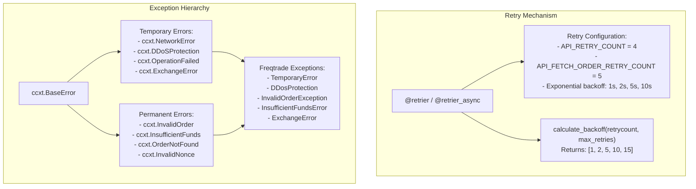
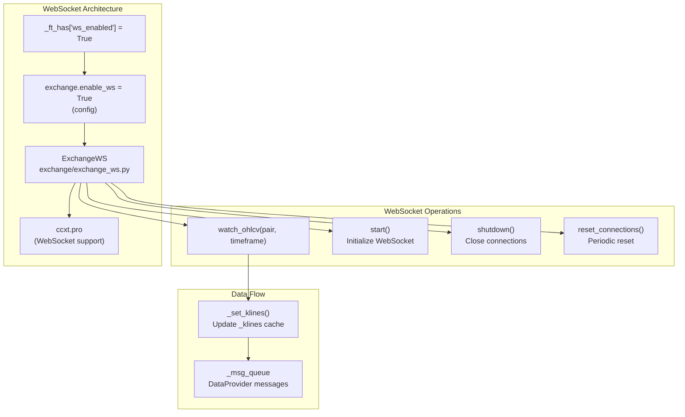
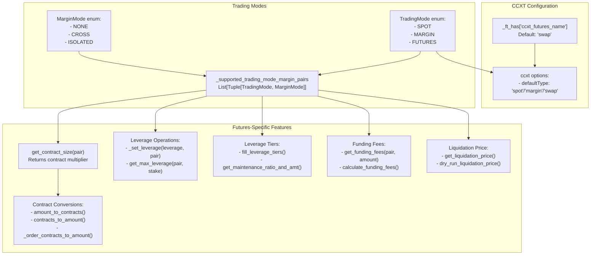
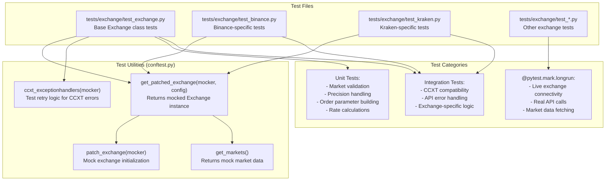

# Exchange Integration

Relevant source files

* [freqtrade/exchange/\_\_init\_\_.py](https://github.com/freqtrade/freqtrade/blob/8e91fea1/freqtrade/exchange/__init__.py)
* [freqtrade/exchange/binance.py](https://github.com/freqtrade/freqtrade/blob/8e91fea1/freqtrade/exchange/binance.py)
* [freqtrade/exchange/exchange.py](https://github.com/freqtrade/freqtrade/blob/8e91fea1/freqtrade/exchange/exchange.py)
* [freqtrade/exchange/kraken.py](https://github.com/freqtrade/freqtrade/blob/8e91fea1/freqtrade/exchange/kraken.py)
* [freqtrade/freqtradebot.py](https://github.com/freqtrade/freqtrade/blob/8e91fea1/freqtrade/freqtradebot.py)
* [tests/conftest.py](https://github.com/freqtrade/freqtrade/blob/8e91fea1/tests/conftest.py)
* [tests/exchange/test\_binance.py](https://github.com/freqtrade/freqtrade/blob/8e91fea1/tests/exchange/test_binance.py)
* [tests/exchange/test\_exchange.py](https://github.com/freqtrade/freqtrade/blob/8e91fea1/tests/exchange/test_exchange.py)
* [tests/exchange/test\_kraken.py](https://github.com/freqtrade/freqtrade/blob/8e91fea1/tests/exchange/test_kraken.py)

## Purpose and Scope

The Exchange Integration layer provides a unified interface for interacting with cryptocurrency exchanges through the CCXT library. This abstraction layer enables Freqtrade to support 20+ exchanges with consistent behavior while accommodating exchange-specific requirements and quirks.

This document covers the exchange abstraction layer, CCXT integration, exchange-specific implementations, order execution, and market data fetching. For information about how the core trading bot orchestrates exchange operations, see [FreqtradeBot Core](/freqtrade/freqtrade/2.1-freqtradebot-core). For strategy-level data access patterns, see [Data Provider and Market Data Flow](/freqtrade/freqtrade/2.4-data-provider-and-market-data-flow).

---

## Architecture Overview

The exchange system is built on a hierarchical architecture with a base class providing common functionality and exchange-specific subclasses handling unique requirements.



**Sources:** [freqtrade/exchange/exchange.py119-478](https://github.com/freqtrade/freqtrade/blob/8e91fea1/freqtrade/exchange/exchange.py#L119-L478) [freqtrade/freqtradebot.py96-98](https://github.com/freqtrade/freqtrade/blob/8e91fea1/freqtrade/freqtradebot.py#L96-L98) [freqtrade/exchange/\_\_init\_\_.py1-51](https://github.com/freqtrade/freqtrade/blob/8e91fea1/freqtrade/exchange/__init__.py#L1-L51)

---

## Exchange Base Class Structure

The `Exchange` class provides the core abstraction layer for all exchange interactions. It manages CCXT instances, market data, caching, and provides a consistent API regardless of the underlying exchange.

### Class Initialization and Configuration

The Exchange class maintains multiple CCXT instances and configuration structures:



**Sources:** [freqtrade/exchange/exchange.py179-304](https://github.com/freqtrade/freqtrade/blob/8e91fea1/freqtrade/exchange/exchange.py#L179-L304) [freqtrade/exchange/exchange.py360-410](https://github.com/freqtrade/freqtrade/blob/8e91fea1/freqtrade/exchange/exchange.py#L360-L410)

### FtHas Capabilities System

The `_ft_has` dictionary defines exchange-specific capabilities and behaviors. Exchanges inherit defaults and override specific features:

| Capability | Type | Default | Description |
| --- | --- | --- | --- |
| `stoploss_on_exchange` | bool | False | Exchange supports native stoploss orders |
| `stop_price_param` | str | "stopLossPrice" | Parameter name for stop price in orders |
| `order_time_in_force` | list | ["GTC"] | Supported time-in-force values |
| `ohlcv_partial_candle` | bool | True | Current candle is incomplete |
| `trades_pagination` | str | "time" | Pagination type: "time" or "id" |
| `trades_has_history` | bool | False | Exchange provides historical trades |
| `ws_enabled` | bool | False | WebSocket support tested and enabled |
| `ccxt_futures_name` | str | "swap" | CCXT futures market type name |
| `needs_trading_fees` | bool | False | Requires fetching trading fees on startup |

**Sources:** [freqtrade/exchange/exchange.py129-170](https://github.com/freqtrade/freqtrade/blob/8e91fea1/freqtrade/exchange/exchange.py#L129-L170)

---

## Exchange-Specific Implementations

Exchange subclasses override base class methods to handle exchange-specific behavior, parameters, and API quirks.

### Binance Exchange Implementation

Binance is one of the most feature-complete implementations with futures support and optimized data fetching:



**Key Binance Overrides:**

1. **get\_tickers()** [exchange/binance.py96-109](https://github.com/freqtrade/freqtrade/blob/8e91fea1/exchange/binance.py#L96-L109): Fetches both tickers and bid/ask data for futures, merging them since Binance futures tickers lack bid/ask.
2. **additional\_exchange\_init()** [exchange/binance.py112-148](https://github.com/freqtrade/freqtrade/blob/8e91fea1/exchange/binance.py#L112-L148): Validates that hedge mode and multi-asset margin are disabled, as Freqtrade doesn't support these.
3. **get\_historic\_ohlcv()** [exchange/binance.py150-213](https://github.com/freqtrade/freqtrade/blob/8e91fea1/exchange/binance.py#L150-L213): Detects new pairs by fetching the first available candle and downloads bulk data from data.binance.vision for efficiency.
4. **dry\_run\_liquidation\_price()** [exchange/binance.py292-374](https://github.com/freqtrade/freqtrade/blob/8e91fea1/exchange/binance.py#L292-L374): Implements Binance-specific liquidation price formula considering maintenance margin and cross-margin positions.

**Sources:** [freqtrade/exchange/binance.py30-439](https://github.com/freqtrade/freqtrade/blob/8e91fea1/freqtrade/exchange/binance.py#L30-L439)

### Kraken Exchange Implementation

Kraken requires special handling for balance management and parameter formatting:



**Key Kraken Overrides:**

1. **consolidate\_balances()** [exchange/kraken.py55-70](https://github.com/freqtrade/freqtrade/blob/8e91fea1/exchange/kraken.py#L55-L70): Merges balances with `.F` suffix (rewards balances) into base currency totals.
2. **get\_balances()** [exchange/kraken.py72-115](https://github.com/freqtrade/freqtrade/blob/8e91fea1/exchange/kraken.py#L72-L115): Manually calculates `used` balance by summing open order amounts since Kraken doesn't provide this directly.
3. **\_get\_params()** [exchange/kraken.py129-149](https://github.com/freqtrade/freqtrade/blob/8e91fea1/exchange/kraken.py#L129-L149): Adds leverage to order parameters and handles `PO` (post-only) as `postOnly` parameter.
4. **\_valid\_trade\_pagination\_id()** [exchange/kraken.py199-209](https://github.com/freqtrade/freqtrade/blob/8e91fea1/exchange/kraken.py#L199-L209): Validates that trade pagination IDs are proper timestamps (>= 19 characters) to work around Kraken API issues.

**Sources:** [freqtrade/exchange/kraken.py21-210](https://github.com/freqtrade/freqtrade/blob/8e91fea1/freqtrade/exchange/kraken.py#L21-L210)

---

## Initialization and Resolution Flow

The exchange initialization process involves configuration loading, exchange resolution, market loading, and validation:

```mermaid
sequenceDiagram
  participant FreqtradeBot
  participant ExchangeResolver
  participant Exchange (Base)
  participant Exchange Subclass
  participant (e.g., Binance)
  participant CCXT Library
  participant Exchange API

  FreqtradeBot->>ExchangeResolver: load_exchange(config)
  ExchangeResolver->>ExchangeResolver: Determine exchange name
  loop [Exchange has subclass]
    ExchangeResolver->>Exchange Subclass: __init__(config)
    Exchange Subclass->>Exchange (Base): super().__init__(config)
    ExchangeResolver->>Exchange (Base): __init__(config)
    Exchange (Base)->>Exchange (Base): build_ft_has()
    Exchange (Base)->>Exchange (Base): Merge _ft_has defaults
    Exchange (Base)->>CCXT Library: _init_ccxt(sync=True)
    Exchange (Base)->>Exchange (Base): Create sync ccxt instance
    Exchange (Base)->>CCXT Library: _init_ccxt(sync=False)
    Exchange (Base)->>Exchange (Base): Create async ccxt instance
    Exchange (Base)->>Exchange (Base): _init_ccxt(ws=True)
    Exchange (Base)->>Exchange (Base): Create ExchangeWS instance
    Exchange (Base)->>CCXT Library: reload_markets(force=True)
    CCXT Library->>Exchange API: _api_async.load_markets()
    Exchange API-->>CCXT Library: GET /markets
    CCXT Library-->>Exchange (Base): Market data
    Exchange (Base)->>Exchange (Base): Markets dict
    Exchange (Base)->>CCXT Library: Assign self._markets
    CCXT Library->>Exchange API: fetch_trading_fees()
    Exchange API-->>CCXT Library: GET /trading_fees
    CCXT Library-->>Exchange (Base): Fee data
    Exchange (Base)->>Exchange (Base): Trading fees
    Exchange Subclass->>Exchange Subclass: fill_leverage_tiers()
    Exchange Subclass->>CCXT Library: load_leverage_tiers()
    CCXT Library->>Exchange API: fetch_leverage_tiers()
    Exchange API-->>CCXT Library: GET /leverage_tiers
  end
  Exchange (Base)->>Exchange (Base): Tier data
  Exchange (Base)->>Exchange (Base): validate_config(config)
  Exchange Subclass->>Exchange Subclass: Validate timeframes, pairs, order types
  Exchange Subclass->>Exchange API: additional_exchange_init()
  Exchange (Base)-->>ExchangeResolver: Exchange-specific validation calls
  ExchangeResolver-->>FreqtradeBot: Exchange instance
```

**Sources:** [freqtrade/freqtradebot.py96-98](https://github.com/freqtrade/freqtrade/blob/8e91fea1/freqtrade/freqtradebot.py#L96-L98) [freqtrade/exchange/exchange.py179-304](https://github.com/freqtrade/freqtrade/blob/8e91fea1/freqtrade/exchange/exchange.py#L179-L304) [freqtrade/exchange/exchange.py690-726](https://github.com/freqtrade/freqtrade/blob/8e91fea1/freqtrade/exchange/exchange.py#L690-L726)

---

## Order Execution Flow

The exchange layer provides methods for creating, fetching, and canceling orders with built-in retry logic and error handling:

```mermaid
sequenceDiagram
  participant FreqtradeBot
  participant Exchange
  participant @retrier decorator
  participant CCXT API
  participant Exchange API

  FreqtradeBot->>Exchange: create_order(pair, ordertype,
  Exchange->>Exchange: side, amount, rate)
  Exchange->>Exchange: Validate order parameters
  Exchange->>Exchange: _get_params()
  Exchange->>Exchange: Build exchange-specific params
  loop [Success]
    Exchange->>Exchange: amount_to_precision()
    Exchange->>Exchange: price_to_precision()
    Exchange->>Exchange: create_dry_run_order()
    Exchange-->>FreqtradeBot: Generate order_id
    Exchange->>@retrier decorator: Store in _dry_run_open_orders
    @retrier decorator->>CCXT API: Order dict
    CCXT API->>Exchange API: _create_order() with @retrier
    Exchange API-->>CCXT API: create_order(symbol, type, side,
    CCXT API-->>@retrier decorator: amount, price, params)
    @retrier decorator->>Exchange: POST /order
    @retrier decorator->>Exchange: Order response
    @retrier decorator-->>Exchange: Order dict
    CCXT API-->>@retrier decorator: _order_contracts_to_amount()
    @retrier decorator->>@retrier decorator: _log_exchange_response()
    note over @retrier decorator: Retry loop continues
    CCXT API-->>@retrier decorator: Processed order
    @retrier decorator-->>Exchange: ccxt.NetworkError /
    @retrier decorator-->>Exchange: ccxt.OperationFailed
    Exchange-->>FreqtradeBot: Wait with exponential backoff
  end
```

**Key Components:**

1. **create\_order()** [exchange/exchange.py1406-1499](https://github.com/freqtrade/freqtrade/blob/8e91fea1/exchange/exchange.py#L1406-L1499): Main order creation method that validates parameters, applies precision, and delegates to CCXT.
2. **@retrier decorator** [exchange/common.py66-150](https://github.com/freqtrade/freqtrade/blob/8e91fea1/exchange/common.py#L66-L150): Wraps API calls with exponential backoff retry logic for temporary errors.
3. **\_get\_params()** [exchange/exchange.py1194-1221](https://github.com/freqtrade/freqtrade/blob/8e91fea1/exchange/exchange.py#L1194-L1221): Builds exchange-specific parameters including leverage, reduceOnly flags, and time-in-force settings.
4. **Precision methods** [exchange/exchange.py1316-1383](https://github.com/freqtrade/freqtrade/blob/8e91fea1/exchange/exchange.py#L1316-L1383): Convert amounts and prices to exchange-required precision using CCXT precision mode (DECIMAL\_PLACES or TICK\_SIZE).

**Sources:** [freqtrade/exchange/exchange.py1406-1499](https://github.com/freqtrade/freqtrade/blob/8e91fea1/freqtrade/exchange/exchange.py#L1406-L1499) [freqtrade/exchange/common.py66-150](https://github.com/freqtrade/freqtrade/blob/8e91fea1/freqtrade/exchange/common.py#L66-L150)

---

## Market Data Fetching

The exchange layer fetches various types of market data with caching and refresh mechanisms:

### OHLCV Data Flow

**OHLCV Caching Strategy:**

1. **Per-pair/timeframe cache**: `_klines` dictionary stores DataFrames indexed by `(pair, timeframe)` tuple [exchange/exchange.py242](https://github.com/freqtrade/freqtrade/blob/8e91fea1/exchange/exchange.py#L242-L242)
2. **Expiring cache**: `PeriodicCache` with TTL based on timeframe duration prevents fetching incomplete candles repeatedly [exchange/exchange.py243](https://github.com/freqtrade/freqtrade/blob/8e91fea1/exchange/exchange.py#L243-L243)
3. **Partial candle handling**: The `ohlcv_partial_candle` capability determines whether the most recent candle should be dropped or kept [exchange/exchange.py263](https://github.com/freqtrade/freqtrade/blob/8e91fea1/exchange/exchange.py#L263-L263)

**Sources:** [freqtrade/exchange/exchange.py1865-2055](https://github.com/freqtrade/freqtrade/blob/8e91fea1/freqtrade/exchange/exchange.py#L1865-L2055) [freqtrade/exchange/exchange.py2213-2329](https://github.com/freqtrade/freqtrade/blob/8e91fea1/freqtrade/exchange/exchange.py#L2213-L2329)

### Ticker and Order Book Data



**Rate Caching:**

* Entry and exit rates are cached for 300 seconds to reduce API calls during RPC operations [exchange/exchange.py238-239](https://github.com/freqtrade/freqtrade/blob/8e91fea1/exchange/exchange.py#L238-L239)
* Ticker cache has 10-minute TTL and is used for portfolio valuation [exchange/exchange.py233](https://github.com/freqtrade/freqtrade/blob/8e91fea1/exchange/exchange.py#L233-L233)

**Sources:** [freqtrade/exchange/exchange.py1623-1738](https://github.com/freqtrade/freqtrade/blob/8e91fea1/freqtrade/exchange/exchange.py#L1623-L1738) [freqtrade/exchange/exchange.py2450-2644](https://github.com/freqtrade/freqtrade/blob/8e91fea1/freqtrade/exchange/exchange.py#L2450-L2644)

---

## Configuration and Validation

The exchange validates configuration on initialization and provides methods to check compatibility:

### Configuration Structure



**Validation Flow:**

1. **validate\_timeframes()** [exchange/exchange.py765-789](https://github.com/freqtrade/freqtrade/blob/8e91fea1/exchange/exchange.py#L765-L789): Ensures configured timeframe is supported by the exchange's CCXT implementation.
2. **validate\_stakecurrency()** [exchange/exchange.py728-746](https://github.com/freqtrade/freqtrade/blob/8e91fea1/exchange/exchange.py#L728-L746): Verifies stake currency exists as a quote currency in available markets.
3. **validate\_ordertypes()** [exchange/exchange.py791-798](https://github.com/freqtrade/freqtrade/blob/8e91fea1/exchange/exchange.py#L791-L798): Checks that configured order types (market, limit, stoploss) are supported.
4. **validate\_trading\_mode\_and\_margin\_mode()** [exchange/exchange.py864-892](https://github.com/freqtrade/freqtrade/blob/8e91fea1/exchange/exchange.py#L864-L892): Validates that the exchange supports the requested trading mode and margin mode combination via `_supported_trading_mode_margin_pairs`.
5. **validate\_pricing()** [exchange/exchange.py894-920](https://github.com/freqtrade/freqtrade/blob/8e91fea1/exchange/exchange.py#L894-L920): Ensures pricing configuration (order book usage, price side) is compatible with exchange capabilities.

**Sources:** [freqtrade/exchange/exchange.py344-359](https://github.com/freqtrade/freqtrade/blob/8e91fea1/freqtrade/exchange/exchange.py#L344-L359) [freqtrade/exchange/exchange.py728-920](https://github.com/freqtrade/freqtrade/blob/8e91fea1/freqtrade/exchange/exchange.py#L728-L920)

### Markets and Market Filters

The exchange provides methods to filter and query available markets:

| Method | Purpose | Key Filters |
| --- | --- | --- |
| `get_markets()` | Get filtered market dict | base\_currencies, quote\_currencies, spot\_only, futures\_only, tradable\_only, active\_only |
| `market_is_tradable()` | Check if market is valid for trading | Checks quote/base exist, precision valid, trading mode matches |
| `market_is_spot()` | Check if market is spot | market["spot"] == True |
| `market_is_margin()` | Check if market is margin | market["margin"] == True |
| `market_is_future()` | Check if market is futures | market[ccxt\_futures\_name] == True and type == "swap" and linear == True |

**Sources:** [freqtrade/exchange/exchange.py513-594](https://github.com/freqtrade/freqtrade/blob/8e91fea1/freqtrade/exchange/exchange.py#L513-L594)

---

## Error Handling and Retry Logic

The exchange layer implements comprehensive error handling with retry mechanisms for transient failures:



**Retry Logic Implementation:**

The `@retrier` decorator wraps exchange API calls and implements exponential backoff:

1. **Temporary errors trigger retry**: NetworkError, DDoSProtection, OperationFailed get retried up to API\_RETRY\_COUNT times [exchange/common.py69-100](https://github.com/freqtrade/freqtrade/blob/8e91fea1/exchange/common.py#L69-L100)
2. **Permanent errors raise immediately**: InvalidOrder, InsufficientFunds are re-raised as Freqtrade exceptions without retry [exchange/common.py101-137](https://github.com/freqtrade/freqtrade/blob/8e91fea1/exchange/common.py#L101-L137)
3. **Exponential backoff**: Uses `calculate_backoff()` to determine sleep duration: 1s, 2s, 5s, 10s, 15s [exchange/common.py38-63](https://github.com/freqtrade/freqtrade/blob/8e91fea1/exchange/common.py#L38-L63)
4. **Per-method retry counts**: Some methods like `fetch_order` have higher retry counts (API\_FETCH\_ORDER\_RETRY\_COUNT = 5) [exchange/common.py26](https://github.com/freqtrade/freqtrade/blob/8e91fea1/exchange/common.py#L26-L26)

**Example: Order Fetching with Retries**

```
```
@retrier
def fetch_order(self, order_id: str, pair: str) -> CcxtOrder:
    # Retries up to 5 times with exponential backoff
    # on temporary errors (NetworkError, DDoSProtection)
```
```

**Sources:** [freqtrade/exchange/common.py24-150](https://github.com/freqtrade/freqtrade/blob/8e91fea1/freqtrade/exchange/common.py#L24-L150) [freqtrade/exchange/exchange.py1534-1578](https://github.com/freqtrade/freqtrade/blob/8e91fea1/freqtrade/exchange/exchange.py#L1534-L1578)

---

## WebSocket Support

For exchanges with tested WebSocket support, Freqtrade can use real-time data streams instead of polling:



**WebSocket Initialization:**

1. Check `_ft_has["ws_enabled"]` is True for the exchange [exchange/exchange.py280](https://github.com/freqtrade/freqtrade/blob/8e91fea1/exchange/exchange.py#L280-L280)
2. Check `exchange.enable_ws` is True in config (defaults to True) [exchange/exchange.py283](https://github.com/freqtrade/freqtrade/blob/8e91fea1/exchange/exchange.py#L283-L283)
3. Create `_ws_async` CCXT instance [exchange/exchange.py286](https://github.com/freqtrade/freqtrade/blob/8e91fea1/exchange/exchange.py#L286-L286)
4. Initialize `ExchangeWS` wrapper [exchange/exchange.py287](https://github.com/freqtrade/freqtrade/blob/8e91fea1/exchange/exchange.py#L287-L287)

**WebSocket Benefits:**

* Real-time OHLCV updates without polling
* Reduced API call count and rate limit usage
* Lower latency for market data

**Supported Exchanges with WebSocket:**

* Binance (SPOT only, `ws_enabled: True`)
* Other exchanges vary by implementation

**Sources:** [freqtrade/exchange/exchange.py280-287](https://github.com/freqtrade/freqtrade/blob/8e91fea1/freqtrade/exchange/exchange.py#L280-L287) [freqtrade/exchange/exchange\_ws.py1-400](https://github.com/freqtrade/freqtrade/blob/8e91fea1/freqtrade/exchange/exchange_ws.py#L1-L400)

---

## Futures and Margin Trading Support

The exchange layer provides specialized support for leveraged trading:

### Trading Mode and Margin Mode Configuration



**Key Futures Methods:**

1. **Contract Size Handling** [exchange/exchange.py611-648](https://github.com/freqtrade/freqtrade/blob/8e91fea1/exchange/exchange.py#L611-L648): Futures contracts may represent multiple units of the base currency (e.g., 0.01 BTC per contract). The exchange automatically converts between contracts and amounts.
2. **Leverage Management** [exchange/exchange.py1112-1193](https://github.com/freqtrade/freqtrade/blob/8e91fea1/exchange/exchange.py#L1112-L1193): Sets leverage for the pair/position. Some exchanges set leverage per symbol (Binance), others per order (Kraken).
3. **Leverage Tiers** [exchange/exchange.py2742-2839](https://github.com/freqtrade/freqtrade/blob/8e91fea1/exchange/exchange.py#L2742-L2839): Load and query maintenance margin requirements and max leverage based on position size.
4. **Funding Fees** [exchange/exchange.py2941-3112](https://github.com/freqtrade/freqtrade/blob/8e91fea1/exchange/exchange.py#L2941-L3112): Calculate funding fee costs for futures positions using mark price and funding rate data.
5. **Liquidation Price** [exchange/exchange.py3247-3293](https://github.com/freqtrade/freqtrade/blob/8e91fea1/exchange/exchange.py#L3247-L3293): Calculate the price at which a leveraged position will be liquidated, considering margin mode and open positions.

**Sources:** [freqtrade/exchange/exchange.py611-3293](https://github.com/freqtrade/freqtrade/blob/8e91fea1/freqtrade/exchange/exchange.py#L611-L3293)

---

## Testing Infrastructure

The exchange layer includes comprehensive test coverage with both unit tests and integration tests:

### Test Organization



**Test Helpers:**

1. **get\_patched\_exchange()** [tests/conftest.py279-288](https://github.com/freqtrade/freqtrade/blob/8e91fea1/tests/conftest.py#L279-L288): Creates an Exchange instance with mocked CCXT API, markets, and supported modes.
2. **ccxt\_exceptionhandlers()** [tests/exchange/test\_exchange.py108-136](https://github.com/freqtrade/freqtrade/blob/8e91fea1/tests/exchange/test_exchange.py#L108-L136): Tests that methods correctly handle CCXT exceptions with retries.
3. **Mock Markets** [tests/conftest.py681-800](https://github.com/freqtrade/freqtrade/blob/8e91fea1/tests/conftest.py#L681-L800): Provides realistic market data structure for testing without API calls.

**Test Coverage:**

* **Exchange initialization**: Configuration loading, CCXT setup, market loading
* **Order operations**: Create, fetch, cancel with dry-run and live modes
* **Market data**: OHLCV, tickers, trades, order books
* **Error handling**: CCXT exception wrapping, retry logic
* **Exchange-specific**: Binance futures, Kraken balance consolidation, etc.
* **Futures features**: Leverage, liquidation prices, funding fees

**Sources:** [tests/exchange/test\_exchange.py1-2500](https://github.com/freqtrade/freqtrade/blob/8e91fea1/tests/exchange/test_exchange.py#L1-L2500) [tests/exchange/test\_binance.py1-1100](https://github.com/freqtrade/freqtrade/blob/8e91fea1/tests/exchange/test_binance.py#L1-L1100) [tests/exchange/test\_kraken.py1-292](https://github.com/freqtrade/freqtrade/blob/8e91fea1/tests/exchange/test_kraken.py#L1-L292) [tests/conftest.py238-289](https://github.com/freqtrade/freqtrade/blob/8e91fea1/tests/conftest.py#L238-L289)