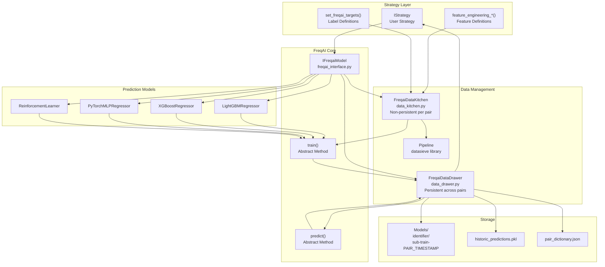
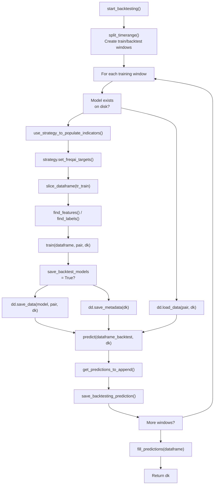
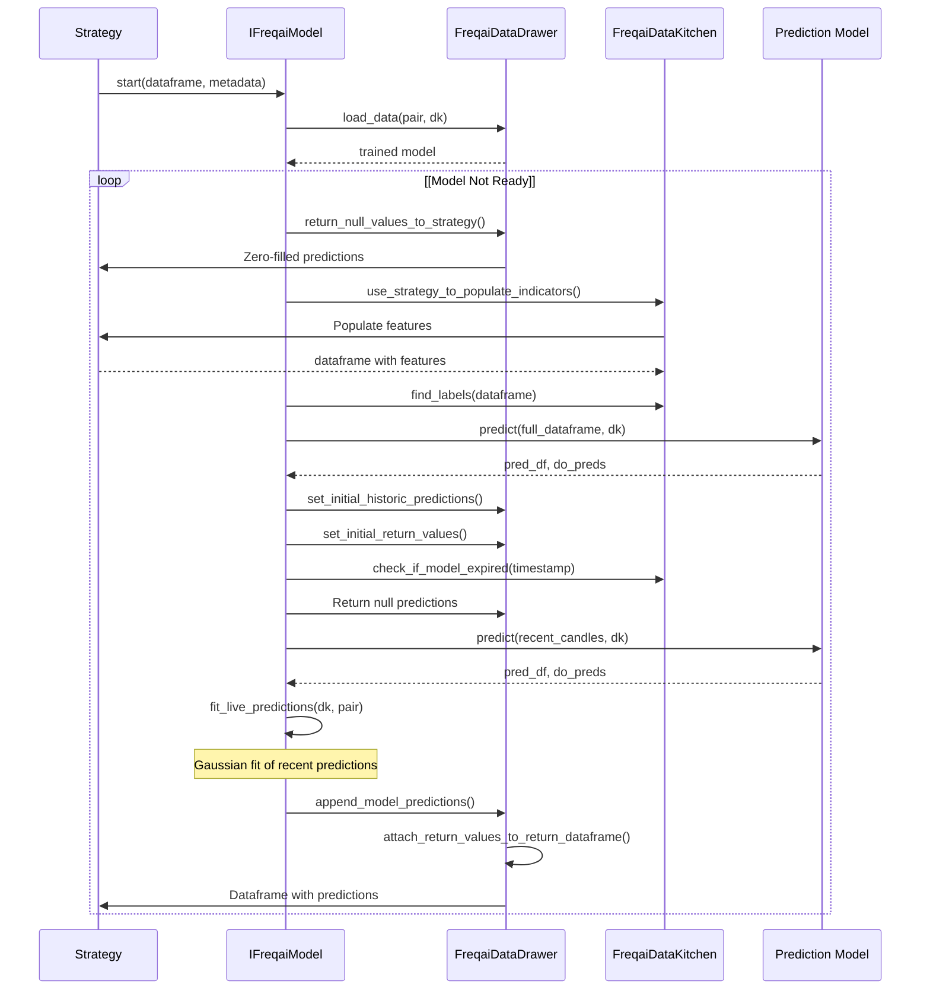
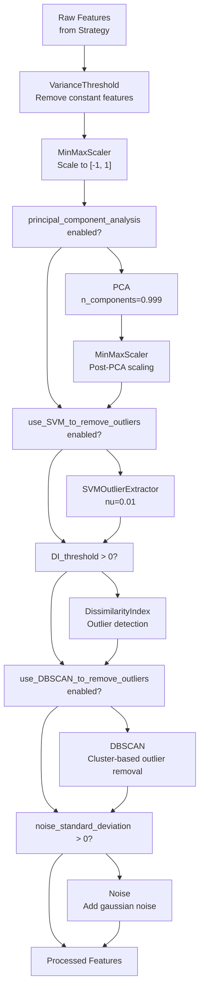
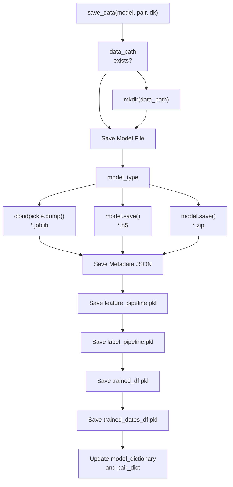

# FreqAI Machine Learning System

Relevant source files

* [config\_examples/config\_freqai.example.json](https://github.com/freqtrade/freqtrade/blob/8e91fea1/config_examples/config_freqai.example.json)
* [docs/freqai.md](https://github.com/freqtrade/freqtrade/blob/8e91fea1/docs/freqai.md)
* [freqtrade/freqai/data\_drawer.py](https://github.com/freqtrade/freqtrade/blob/8e91fea1/freqtrade/freqai/data_drawer.py)
* [freqtrade/freqai/data\_kitchen.py](https://github.com/freqtrade/freqtrade/blob/8e91fea1/freqtrade/freqai/data_kitchen.py)
* [freqtrade/freqai/freqai\_interface.py](https://github.com/freqtrade/freqtrade/blob/8e91fea1/freqtrade/freqai/freqai_interface.py)
* [freqtrade/freqai/utils.py](https://github.com/freqtrade/freqtrade/blob/8e91fea1/freqtrade/freqai/utils.py)
* [freqtrade/templates/FreqaiExampleStrategy.py](https://github.com/freqtrade/freqtrade/blob/8e91fea1/freqtrade/templates/FreqaiExampleStrategy.py)
* [tests/freqai/conftest.py](https://github.com/freqtrade/freqtrade/blob/8e91fea1/tests/freqai/conftest.py)
* [tests/freqai/test\_freqai\_backtesting.py](https://github.com/freqtrade/freqtrade/blob/8e91fea1/tests/freqai/test_freqai_backtesting.py)
* [tests/freqai/test\_freqai\_datadrawer.py](https://github.com/freqtrade/freqtrade/blob/8e91fea1/tests/freqai/test_freqai_datadrawer.py)
* [tests/freqai/test\_freqai\_datakitchen.py](https://github.com/freqtrade/freqtrade/blob/8e91fea1/tests/freqai/test_freqai_datakitchen.py)
* [tests/freqai/test\_freqai\_interface.py](https://github.com/freqtrade/freqtrade/blob/8e91fea1/tests/freqai/test_freqai_interface.py)

## Purpose and Scope

FreqAI is an integrated machine learning system within Freqtrade that enables automated training and prediction of trading signals using custom features. This document covers the core architecture, data flow, and components of the FreqAI system. For information about configuration parameters, see the FreqAI documentation. For strategy development with FreqAI features, see [Strategy Interface and Development](/freqtrade/freqtrade/2.3-strategy-interface-and-development).

The FreqAI system provides:

* Automated model training and retraining during live/dry-run operations
* Feature engineering pipelines with data preprocessing and outlier detection
* Backtesting with realistic training window simulations
* Model persistence and storage management
* Support for multiple ML frameworks (LightGBM, XGBoost, PyTorch, Reinforcement Learning)

---

## System Architecture

The FreqAI system consists of three primary components that work together to manage the complete ML lifecycle:



**Sources:** [freqtrade/freqai/freqai\_interface.py36-172](https://github.com/freqtrade/freqtrade/blob/8e91fea1/freqtrade/freqai/freqai_interface.py#L36-L172) [freqtrade/freqai/data\_kitchen.py35-60](https://github.com/freqtrade/freqtrade/blob/8e91fea1/freqtrade/freqai/data_kitchen.py#L35-L60) [freqtrade/freqai/data\_drawer.py46-106](https://github.com/freqtrade/freqtrade/blob/8e91fea1/freqtrade/freqai/data_drawer.py#L46-L106)

---

## Core Components

### IFreqaiModel

The `IFreqaiModel` class is the abstract base class for all FreqAI prediction models. It orchestrates the complete training and prediction workflow.

**Key Responsibilities:**

* Entry point coordination via `start()` method
* Training/retraining decision logic
* Model lifecycle management (train, predict, clean up)
* Background training thread management
* Timerange splitting for backtesting

**Core Attributes:**

| Attribute | Type | Purpose |
| --- | --- | --- |
| `dd` | `FreqaiDataDrawer` | Persistent data storage across pairs |
| `dk` | `FreqaiDataKitchen` | Non-persistent data handler per pair |
| `model` | `Any` | Currently loaded ML model |
| `live` | `bool` | Operating mode (live/dry vs backtest) |
| `train_queue` | `deque` | Priority queue for model training |
| `scanning` | `bool` | Background training thread active flag |

**Sources:** [freqtrade/freqai/freqai\_interface.py36-119](https://github.com/freqtrade/freqtrade/blob/8e91fea1/freqtrade/freqai/freqai_interface.py#L36-L119)

### FreqaiDataKitchen

The `FreqaiDataKitchen` handles all data preparation, feature engineering, and preprocessing for a single pair. It is reinstantiated for each pair/training iteration and does not persist between calls.

**Key Responsibilities:**

* Feature extraction from strategy indicators
* Train/test data splitting
* Data filtering and NaN handling
* Normalization via datasieve pipelines
* Timerange management for training windows

**Key Methods:**

| Method | Purpose |
| --- | --- |
| `use_strategy_to_populate_indicators()` | Calls strategy feature engineering functions |
| `find_features()` | Identifies columns starting with `%` as features |
| `find_labels()` | Identifies columns starting with `&` as labels |
| `filter_features()` | Removes NaN rows from training data |
| `make_train_test_datasets()` | Splits data according to config parameters |
| `split_timerange()` | Creates sliding windows for backtesting |

**Sources:** [freqtrade/freqai/data\_kitchen.py35-110](https://github.com/freqtrade/freqtrade/blob/8e91fea1/freqtrade/freqai/data_kitchen.py#L35-L110) [freqtrade/freqai/data\_kitchen.py395-414](https://github.com/freqtrade/freqtrade/blob/8e91fea1/freqtrade/freqai/data_kitchen.py#L395-L414)

### FreqaiDataDrawer

The `FreqaiDataDrawer` manages persistent storage of models, metadata, and historic predictions. It remains in memory throughout the bot's lifecycle.

**Key Responsibilities:**

* Model persistence (save/load)
* Historic predictions storage
* Pair metadata tracking
* Model return value management
* Purging old models

**Storage Structure:**

```
user_data/models/{identifier}/
├── pair_dictionary.json           # Metadata for all pairs
├── historic_predictions.pkl       # All prediction history
├── metric_tracker.json           # Performance metrics
├── sub-train-BTC_1234567890/     # Model for BTC at timestamp
│   ├── cb_btc_1234567890_model.joblib
│   ├── cb_btc_1234567890_metadata.json
│   ├── cb_btc_1234567890_feature_pipeline.pkl
│   ├── cb_btc_1234567890_label_pipeline.pkl
│   └── cb_btc_1234567890_trained_df.pkl
```

**Sources:** [freqtrade/freqai/data\_drawer.py46-106](https://github.com/freqtrade/freqtrade/blob/8e91fea1/freqtrade/freqai/data_drawer.py#L46-L106) [freqtrade/freqai/data\_drawer.py504-552](https://github.com/freqtrade/freqtrade/blob/8e91fea1/freqtrade/freqai/data_drawer.py#L504-L552)

---

## Training Workflow

The training workflow differs between live/dry-run mode and backtesting mode.

### Live/Dry-Run Training Flow

```mermaid
sequenceDiagram
  participant Strategy
  participant IFreqaiModel
  participant _start_scanning()
  participant Background Thread
  participant FreqaiDataKitchen
  participant FreqaiDataDrawer
  participant Prediction Model

  Strategy->>IFreqaiModel: start(dataframe, metadata)
  IFreqaiModel->>FreqaiDataDrawer: get_pair_dict_info(pair)
  FreqaiDataDrawer-->>IFreqaiModel: trained_timestamp
  IFreqaiModel->>FreqaiDataKitchen: check_if_new_training_required(timestamp)
  loop [Training Required]
    IFreqaiModel->>_start_scanning(): start_scanning(strategy)
    note over _start_scanning(),Background Thread: Runs on separate thread
    IFreqaiModel->>FreqaiDataDrawer: load_data(pair, dk)
    FreqaiDataDrawer-->>IFreqaiModel: existing model or None
    _start_scanning()->>FreqaiDataKitchen: check_if_new_training_required()
    _start_scanning()->>FreqaiDataKitchen: set_paths(pair, timestamp)
    _start_scanning()->>IFreqaiModel: extract_data_and_train_model()
    IFreqaiModel->>FreqaiDataDrawer: get_base_and_corr_dataframes()
    FreqaiDataDrawer-->>IFreqaiModel: historical OHLCV data
    IFreqaiModel->>FreqaiDataKitchen: use_strategy_to_populate_indicators()
    FreqaiDataKitchen->>Strategy: feature_engineering_expand_all()
    FreqaiDataKitchen->>Strategy: feature_engineering_expand_basic()
    FreqaiDataKitchen->>Strategy: feature_engineering_standard()
    Strategy-->>FreqaiDataKitchen: populated dataframe
    FreqaiDataKitchen->>FreqaiDataKitchen: find_features() / find_labels()
    FreqaiDataKitchen->>FreqaiDataKitchen: filter_features()
    FreqaiDataKitchen->>FreqaiDataKitchen: make_train_test_datasets()
    IFreqaiModel->>Prediction Model: train(dataframe, pair, dk)
    Prediction Model-->>IFreqaiModel: trained model
    IFreqaiModel->>FreqaiDataDrawer: save_data(model, pair, dk)
    FreqaiDataDrawer->>FreqaiDataDrawer: save_drawer_to_disk()
    FreqaiDataDrawer->>FreqaiDataDrawer: purge_old_models()
    _start_scanning()->>_start_scanning(): train_queue.rotate(-1)
  end
```

**Key Points:**

* Training runs on a separate thread via `_start_scanning()` to avoid blocking inference
* Training queue prioritizes pairs by oldest `trained_timestamp`
* Each pair rotates through the queue after training completes
* Models are saved immediately after training with timestamp-based filenames

**Sources:** [freqtrade/freqai/freqai\_interface.py221-268](https://github.com/freqtrade/freqtrade/blob/8e91fea1/freqtrade/freqai/freqai_interface.py#L221-L268) [freqtrade/freqai/freqai\_interface.py402-469](https://github.com/freqtrade/freqtrade/blob/8e91fea1/freqtrade/freqai/freqai_interface.py#L402-L469) [freqtrade/freqai/freqai\_interface.py591-640](https://github.com/freqtrade/freqtrade/blob/8e91fea1/freqtrade/freqai/freqai_interface.py#L591-L640)

### Backtesting Training Flow

In backtesting mode, FreqAI simulates the live training process by creating sliding windows through historical data.



**Configuration Parameters:**

| Parameter | Purpose | Example |
| --- | --- | --- |
| `train_period_days` | Size of training window | 30 days |
| `backtest_period_days` | Size of prediction window | 7 days |
| `save_backtest_models` | Save models to disk | `true`/`false` |

**Sources:** [freqtrade/freqai/freqai\_interface.py269-400](https://github.com/freqtrade/freqtrade/blob/8e91fea1/freqtrade/freqai/freqai_interface.py#L269-L400) [freqtrade/freqai/data\_kitchen.py322-379](https://github.com/freqtrade/freqtrade/blob/8e91fea1/freqtrade/freqai/data_kitchen.py#L322-L379)

---

## Prediction Workflow

Predictions occur on every new candle in live/dry-run mode, or for each backtesting window.



**Prediction Columns Returned to Strategy:**

| Column Pattern | Description |
| --- | --- |
| `&-{label}` | Predicted label value |
| `&-{label}_mean` | Mean of recent predictions (gaussian fit) |
| `&-{label}_std` | Std dev of recent predictions |
| `do_predict` | Binary flag: 0=NaN detected, 1=valid, 2=expired model |
| `DI_values` | Dissimilarity Index (outlier detection) |

**Sources:** [freqtrade/freqai/freqai\_interface.py471-506](https://github.com/freqtrade/freqtrade/blob/8e91fea1/freqtrade/freqai/freqai_interface.py#L471-L506) [freqtrade/freqai/data\_drawer.py278-331](https://github.com/freqtrade/freqtrade/blob/8e91fea1/freqtrade/freqai/data_drawer.py#L278-L331) [freqtrade/freqai/data\_drawer.py333-398](https://github.com/freqtrade/freqtrade/blob/8e91fea1/freqtrade/freqai/data_drawer.py#L333-L398)

---

## Data Processing Pipeline

FreqAI uses the `datasieve` library to create preprocessing pipelines for features and labels.

### Feature Pipeline Construction



**Pipeline Configuration:**

The pipeline is defined in `define_data_pipeline()` and `define_label_pipeline()`:

```
```
# Feature pipeline steps
pipe_steps = [
    ("const", ds.VarianceThreshold(threshold=0)),
    ("scaler", SKLearnWrapper(MinMaxScaler(feature_range=(-1, 1)))),
]

# Optional PCA
if ft_params.get("principal_component_analysis", False):
    pipe_steps.append(("pca", ds.PCA(n_components=0.999)))
    pipe_steps.append(("post-pca-scaler", SKLearnWrapper(MinMaxScaler(...))))

# Optional SVM outlier removal
if ft_params.get("use_SVM_to_remove_outliers", False):
    svm_params = ft_params.get("svm_params", {"shuffle": False, "nu": 0.01})
    pipe_steps.append(("svm", ds.SVMOutlierExtractor(**svm_params)))

# Optional Dissimilarity Index
di = ft_params.get("DI_threshold", 0)
if di:
    pipe_steps.append(("di", ds.DissimilarityIndex(di_threshold=di, n_jobs=threads)))

# Optional DBSCAN
if ft_params.get("use_DBSCAN_to_remove_outliers", False):
    pipe_steps.append(("dbscan", ds.DBSCAN(n_jobs=threads)))

# Optional noise addition
sigma = self.freqai_info["feature_parameters"].get("noise_standard_deviation", 0)
if sigma:
    pipe_steps.append(("noise", ds.Noise(sigma=sigma)))

return Pipeline(pipe_steps)
```
```

**Sources:** [freqtrade/freqai/freqai\_interface.py528-561](https://github.com/freqtrade/freqtrade/blob/8e91fea1/freqtrade/freqai/freqai_interface.py#L528-L561)

### Feature Engineering in Strategy

Users define features in their strategy using special column naming conventions:

| Prefix | Purpose | Auto-Expanded |
| --- | --- | --- |
| `%` | Feature column | Yes |
| `&` | Label (target) column | No |
| `%%` | Custom user column | No |

**Feature Engineering Functions:**

1. **`feature_engineering_expand_all()`** - Automatically expanded across:

   * `indicator_periods_candles` parameter values
   * `include_timeframes` timeframes
   * `include_shifted_candles` shift periods
   * `include_corr_pairlist` correlated pairs
2. **`feature_engineering_expand_basic()`** - Expanded across timeframes, shifts, and correlated pairs (but not indicator periods)
3. **`feature_engineering_standard()`** - Called once, no expansion
4. **`set_freqai_targets()`** - Defines prediction targets (labels)

**Example:**

```
```
def feature_engineering_expand_all(self, dataframe, period, metadata, **kwargs):
    # This creates: %-rsi-period for each (timeframe, shift, corr_pair, period)
    dataframe["%-rsi-period"] = ta.RSI(dataframe, timeperiod=period)
    return dataframe
```
```

**Sources:** [freqtrade/templates/FreqaiExampleStrategy.py47-102](https://github.com/freqtrade/freqtrade/blob/8e91fea1/freqtrade/templates/FreqaiExampleStrategy.py#L47-L102) [freqtrade/freqai/data\_kitchen.py720-780](https://github.com/freqtrade/freqtrade/blob/8e91fea1/freqtrade/freqai/data_kitchen.py#L720-L780)

---

## Backtesting vs Live Mode

FreqAI operates differently in backtesting and live modes:

### Comparison Table

| Aspect | Live/Dry-Run | Backtesting |
| --- | --- | --- |
| Training Thread | Background thread (`_start_scanning()`) | Sequential in main thread |
| Data Source | Live exchange or DataProvider | Pre-downloaded historical data |
| Training Trigger | Time-based (`live_retrain_hours`) | Fixed sliding windows |
| Model Storage | Always saved | Optional (`save_backtest_models`) |
| Predictions | Last candle only (CONV\_WIDTH) | Full backtest window |
| `dk` Instance | One per pair, recreated on retrain | One per pair per window |
| Historic Predictions | Continuously appended | Built window-by-window |

### Mode Detection

```
```
# Set in IFreqaiModel.start()
self.live = strategy.dp.runmode in (RunMode.DRY_RUN, RunMode.LIVE)

if self.live:
    dk = self.start_live(dataframe, metadata, strategy, self.dk)
else:
    dk = self.start_backtesting(dataframe, metadata, self.dk, strategy)
```
```

**Sources:** [freqtrade/freqai/freqai\_interface.py141-172](https://github.com/freqtrade/freqtrade/blob/8e91fea1/freqtrade/freqai/freqai_interface.py#L141-L172)

### Backtesting with Live Models

FreqAI supports a special backtesting mode that uses previously trained live models:

```
```
freqtrade backtesting --freqai-backtest-live-models
```
```

This mode:

* Loads models from `user_data/models/{identifier}/sub-train-*` directories
* Uses timestamps from model filenames to match with backtest periods
* Reads predictions from saved `backtesting_predictions` files
* Requires `historic_predictions.pkl` to determine timerange

**Sources:** [freqtrade/freqai/freqai\_interface.py159-166](https://github.com/freqtrade/freqtrade/blob/8e91fea1/freqtrade/freqai/freqai_interface.py#L159-L166) [tests/freqai/test\_freqai\_backtesting.py97-132](https://github.com/freqtrade/freqtrade/blob/8e91fea1/tests/freqai/test_freqai_backtesting.py#L97-L132)

---

## Model Persistence and Storage

### Model Saving

Models are saved with a comprehensive set of metadata and auxiliary files:



### Model Filename Convention

```
cb_{coin}_{timestamp}_model.{extension}
```

Example: `cb_btc_1234567890_model.joblib`

**Filename Components:**

* `cb`: Model type prefix (varies by model)
* `{coin}`: Base currency (lowercase)
* `{timestamp}`: Unix timestamp of training completion
* `{extension}`: `.joblib`, `.zip`, or `.h5` depending on framework

**Sources:** [freqtrade/freqai/data\_drawer.py504-552](https://github.com/freqtrade/freqtrade/blob/8e91fea1/freqtrade/freqai/data_drawer.py#L504-L552) [freqtrade/freqai/data\_kitchen.py590-594](https://github.com/freqtrade/freqtrade/blob/8e91fea1/freqtrade/freqai/data_kitchen.py#L590-L594)

### Model Loading

```
```
def load_data(self, coin: str, dk: FreqaiDataKitchen) -> Any:
    """
    Load model and associated data from disk
    """
    # Load model based on model_type
    if self.model_type == "joblib":
        with open(path / f"{dk.model_filename}_model.joblib", "rb") as fp:
            model = cloudpickle.load(fp)
    elif self.model_type in ["stable_baselines3", "sb3_contrib", "pytorch"]:
        from stable_baselines3 import PPO
        model = PPO.load(path / f"{dk.model_filename}_model.zip")
    
    # Load metadata
    with open(path / f"{dk.model_filename}_metadata.json", "r") as fp:
        dk.data = rapidjson.load(fp)
    
    # Load pipelines
    with open(path / f"{dk.model_filename}_feature_pipeline.pkl", "rb") as fp:
        dk.feature_pipeline = cloudpickle.load(fp)
    
    with open(path / f"{dk.model_filename}_label_pipeline.pkl", "rb") as fp:
        dk.label_pipeline = cloudpickle.load(fp)
    
    return model
```
```

**Sources:** [freqtrade/freqai/data\_drawer.py554-623](https://github.com/freqtrade/freqtrade/blob/8e91fea1/freqtrade/freqai/data_drawer.py#L554-L623)

### Historic Predictions Storage

Historic predictions are stored in `historic_predictions.pkl` as a dictionary:

```
```
{
    "BTC/USDT": DataFrame({
        "&-s_close": [...],           # Predicted values
        "&-s_close_mean": [...],      # Running mean
        "&-s_close_std": [...],       # Running std dev
        "do_predict": [...],          # Validity flag
        "DI_values": [...],           # Outlier scores
        "high_price": [...],          # OHLC data
        "low_price": [...],
        "close_price": [...],
        "date_pred": [...]            # Prediction timestamps
    }),
    "ETH/USDT": DataFrame({...}),
    ...
}
```
```

This structure enables:

* Continuous prediction history across bot restarts
* Statistical analysis of prediction quality
* Adaptive strategy decisions based on prediction distributions

**Sources:** [freqtrade/freqai/data\_drawer.py200-208](https://github.com/freqtrade/freqtrade/blob/8e91fea1/freqtrade/freqai/data_drawer.py#L200-L208) [freqtrade/freqai/data\_drawer.py333-398](https://github.com/freqtrade/freqtrade/blob/8e91fea1/freqtrade/freqai/data_drawer.py#L333-L398)

### Model Purging

Old models are automatically purged based on `purge_old_models` configuration:

```
```
def purge_old_models(self) -> None:
    num_keep = self.freqai_info["purge_old_models"]
    
    # Find all model folders: sub-train-{coin}_{timestamp}
    pattern = re.compile(r"sub-train-(\w+)_(\d{10})")
    
    # Group by coin, sort by timestamp
    # Delete oldest models, keep only num_keep most recent
    for coin in delete_dict:
        if delete_dict[coin]["num_folders"] > num_keep:
            sorted_dict = collections.OrderedDict(
                sorted(delete_dict[coin]["timestamps"].items())
            )
            # Delete oldest folders
            for k, v in sorted_dict.items():
                if deleted >= num_delete:
                    break
                shutil.rmtree(v)
                deleted += 1
```
```

**Sources:** [freqtrade/freqai/data\_drawer.py440-481](https://github.com/freqtrade/freqtrade/blob/8e91fea1/freqtrade/freqai/data_drawer.py#L440-L481)

---

## Configuration

### Core Configuration Structure

```
```
{
    "freqai": {
        "enabled": true,
        "identifier": "unique-id",
        "purge_old_models": 2,
        "train_period_days": 15,
        "backtest_period_days": 7,
        "live_retrain_hours": 0.5,
        "expiration_hours": 1,
        "feature_parameters": { ... },
        "data_split_parameters": { ... },
        "model_training_parameters": { ... }
    }
}
```
```

### Feature Parameters

| Parameter | Type | Description |
| --- | --- | --- |
| `include_timeframes` | `list[str]` | Additional timeframes for feature generation |
| `include_corr_pairlist` | `list[str]` | Correlated pairs to include as features |
| `label_period_candles` | `int` | Number of candles forward for label calculation |
| `include_shifted_candles` | `int` | Number of historical candle shifts to include |
| `indicator_periods_candles` | `list[int]` | Periods for indicator expansion |
| `DI_threshold` | `float` | Dissimilarity Index threshold (0 = disabled) |
| `weight_factor` | `float` | Exponential weight factor for recent data |
| `principal_component_analysis` | `bool` | Enable PCA dimensionality reduction |
| `use_SVM_to_remove_outliers` | `bool` | Enable SVM outlier detection |
| `use_DBSCAN_to_remove_outliers` | `bool` | Enable DBSCAN outlier detection |
| `plot_feature_importances` | `int` | Number of top features to plot (0 = disabled) |

**Sources:** [config\_examples/config\_freqai.example.json50-84](https://github.com/freqtrade/freqtrade/blob/8e91fea1/config_examples/config_freqai.example.json#L50-L84)

### Data Split Parameters

| Parameter | Type | Description |
| --- | --- | --- |
| `test_size` | `float` | Fraction of data for testing (0.0-1.0) |
| `shuffle` | `bool` | Shuffle data before splitting |
| `random_state` | `int` | Random seed for reproducibility |

**Sources:** [freqtrade/freqai/data\_kitchen.py128-211](https://github.com/freqtrade/freqtrade/blob/8e91fea1/freqtrade/freqai/data_kitchen.py#L128-L211)

### Model-Specific Parameters

Model training parameters vary by prediction model. Common examples:

**LightGBM/XGBoost:**

```
```
"model_training_parameters": {
    "n_estimators": 1000,
    "learning_rate": 0.02,
    "max_depth": 6
}
```
```

**PyTorch:**

```
```
"model_training_parameters": {
    "learning_rate": 3e-4,
    "trainer_kwargs": {
        "n_steps": null,
        "batch_size": 64,
        "n_epochs": 10
    },
    "model_kwargs": {
        "hidden_dim": 256,
        "dropout_percent": 0.2,
        "n_layer": 3
    }
}
```
```

**Reinforcement Learning:**

```
```
"rl_config": {
    "train_cycles": 25,
    "thread_count": 4,
    "model_type": "PPO",
    "policy_type": "MlpPolicy",
    "max_trade_duration_candles": 300,
    "model_reward_parameters": {
        "rr": 1,
        "profit_aim": 0.025
    }
}
```
```

**Sources:** [tests/freqai/conftest.py70-87](https://github.com/freqtrade/freqtrade/blob/8e91fea1/tests/freqai/conftest.py#L70-L87) [tests/freqai/conftest.py90-103](https://github.com/freqtrade/freqtrade/blob/8e91fea1/tests/freqai/conftest.py#L90-L103)

---

## Integration Points

### Strategy Integration

The strategy integrates with FreqAI through the `populate_indicators()` method:

```
```
def populate_indicators(self, dataframe: DataFrame, metadata: dict) -> DataFrame:
    # This single call triggers the entire FreqAI pipeline
    dataframe = self.freqai.start(dataframe, metadata, self)
    return dataframe
```
```

The `start()` method returns a dataframe with prediction columns that can be used in entry/exit logic:

```
```
def populate_entry_trend(self, df: DataFrame, metadata: dict) -> DataFrame:
    df.loc[
        (df["do_predict"] == 1) &  # Valid prediction
        (df["&-s_close"] > 0.01),  # Predicted price increase
        "enter_long"
    ] = 1
    return df
```
```

**Sources:** [freqtrade/templates/FreqaiExampleStrategy.py225-269](https://github.com/freqtrade/freqtrade/blob/8e91fea1/freqtrade/templates/FreqaiExampleStrategy.py#L225-L269)

### DataProvider Integration

FreqAI uses the `DataProvider` to access market data:

```
```
# In IFreqaiModel.start()
self.data_provider = strategy.dp

# Used for historical data loading
def load_all_pair_histories(self, timerange: TimeRange, dk: FreqaiDataKitchen):
    for pair in self.all_pairs:
        for tf in self.freqai_config["feature_parameters"]["include_timeframes"]:
            hist_df = load_pair_history(
                datadir=self.config["datadir"],
                timeframe=tf,
                pair=pair,
                timerange=timerange,
                data_format=self.config.get("dataformat_ohlcv", "feather"),
                candle_type=self.config.get("candle_type_def", CandleType.SPOT),
            )
            self.historic_data[pair][tf] = hist_df
```
```

**Sources:** [freqtrade/freqai/freqai\_interface.py143-144](https://github.com/freqtrade/freqtrade/blob/8e91fea1/freqtrade/freqai/freqai_interface.py#L143-L144) [freqtrade/freqai/data\_drawer.py664-711](https://github.com/freqtrade/freqtrade/blob/8e91fea1/freqtrade/freqai/data_drawer.py#L664-L711)

### Threading and Concurrency

FreqAI uses threading to enable background training without blocking inference:

```
```
def start_scanning(self, *args, **kwargs) -> None:
    """Start _start_scanning in a separate thread"""
    _thread = threading.Thread(target=self._start_scanning, args=args, kwargs=kwargs)
    self._threads.append(_thread)
    _thread.start()

def _start_scanning(self, strategy: IStrategy) -> None:
    """Function designed to constantly scan pairs for retraining"""
    while not self._stop_event.is_set():
        time.sleep(1)
        pair = self.train_queue[0]
        
        # Check if training needed
        (retrain, new_trained_timerange, data_load_timerange) = \
            dk.check_if_new_training_required(trained_timestamp)
        
        if retrain:
            self.train_timer("start")
            self.extract_data_and_train_model(...)
            self.train_timer("stop", pair)
            self.train_queue.rotate(-1)
```
```

**Locks:**

* `history_lock`: Protects `historic_data` updates
* `save_lock`: Protects disk write operations
* `pair_dict_lock`: Protects `pair_dict` updates
* `metric_tracker_lock`: Protects `metric_tracker` updates

**Sources:** [freqtrade/freqai/freqai\_interface.py213-268](https://github.com/freqtrade/freqtrade/blob/8e91fea1/freqtrade/freqai/freqai_interface.py#L213-L268) [freqtrade/freqai/data\_drawer.py95-98](https://github.com/freqtrade/freqtrade/blob/8e91fea1/freqtrade/freqai/data_drawer.py#L95-L98)