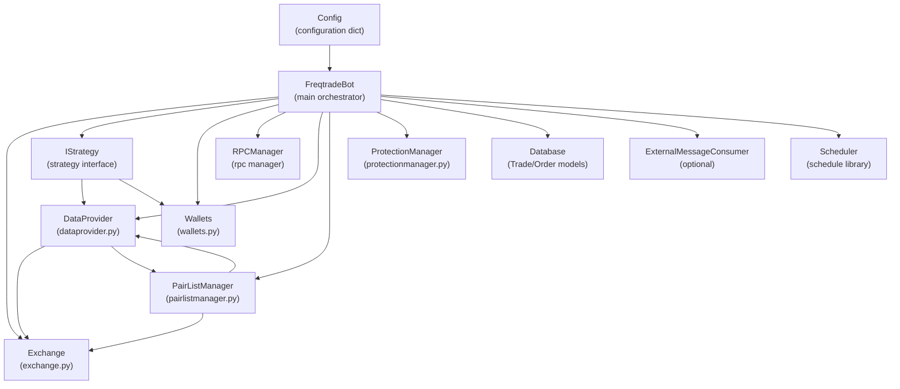
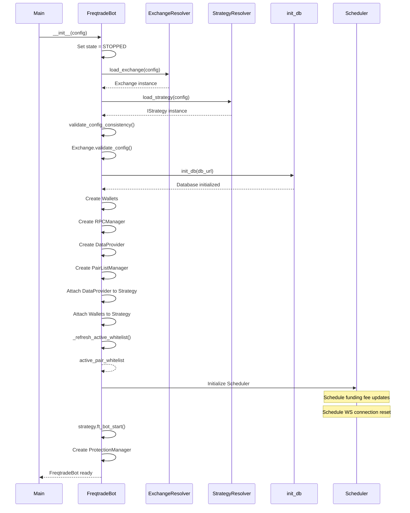
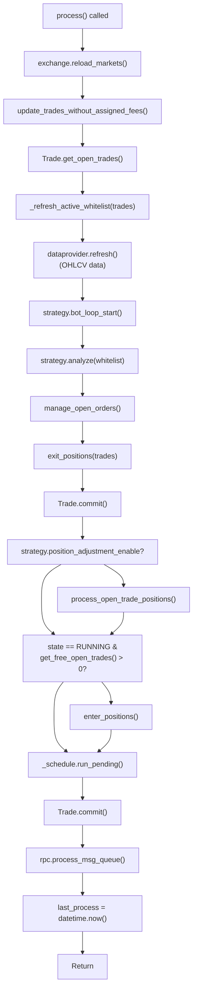
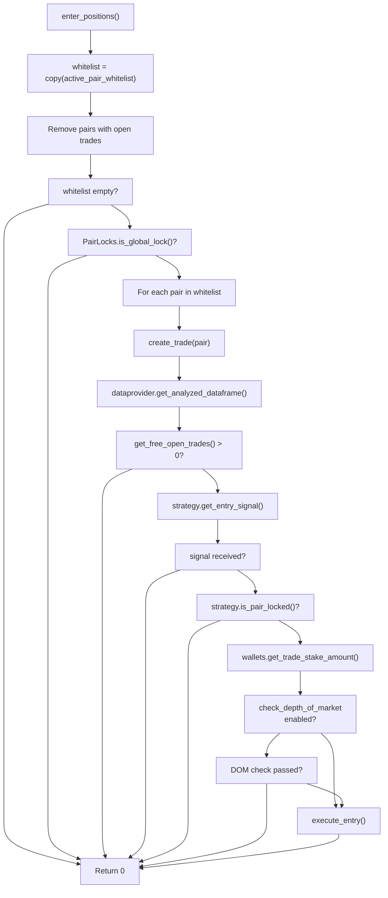
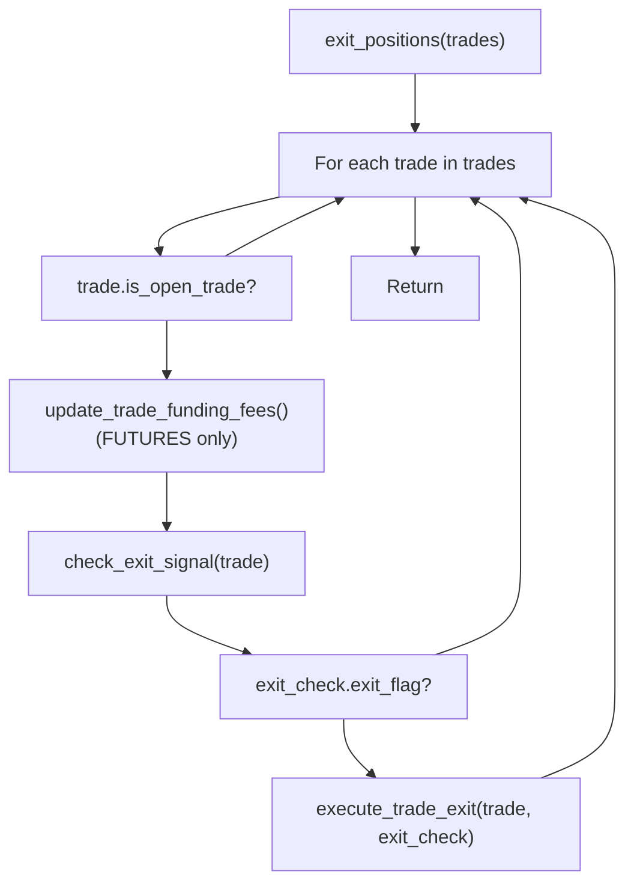
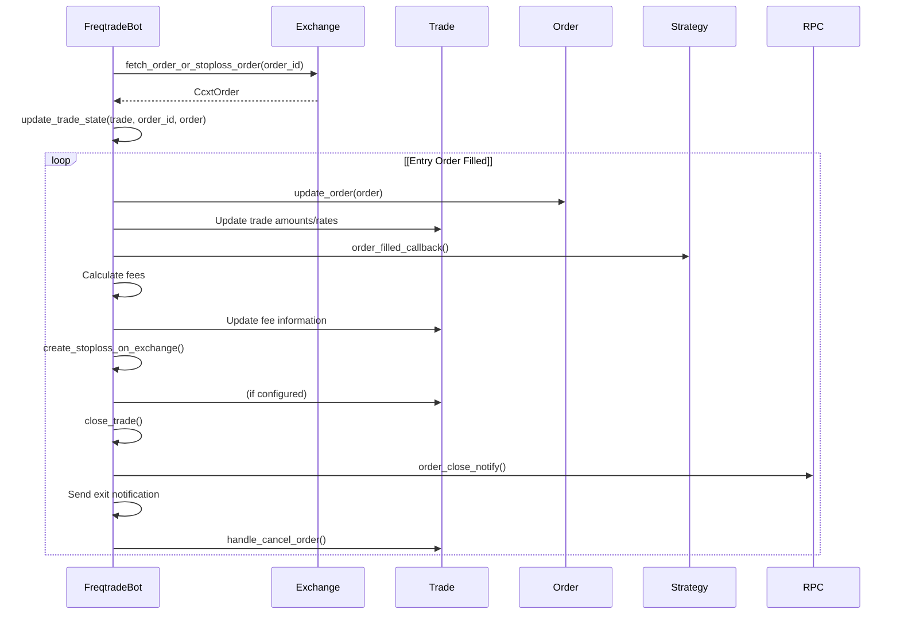
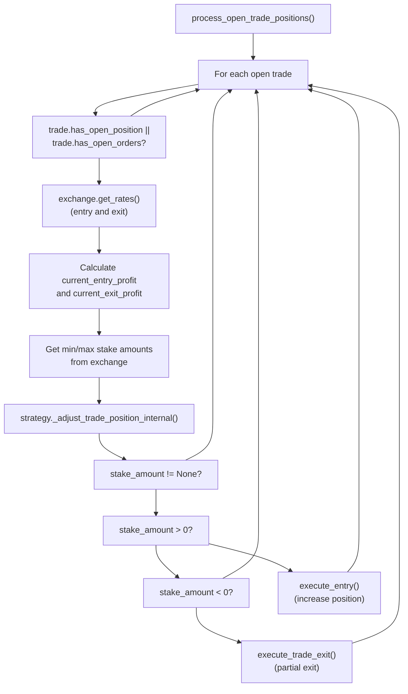
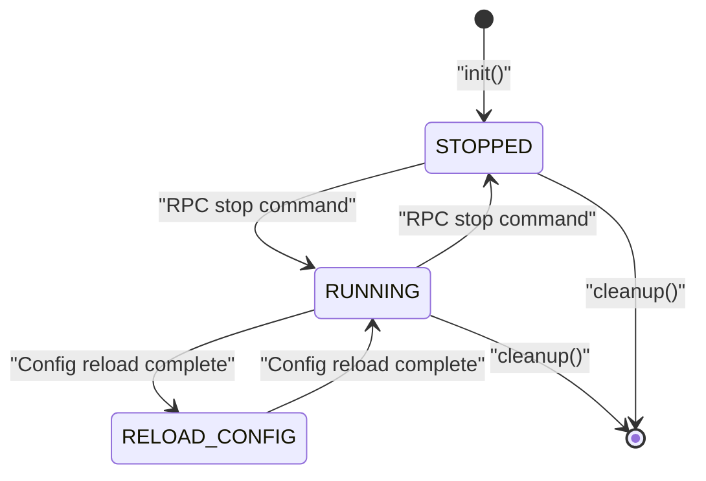
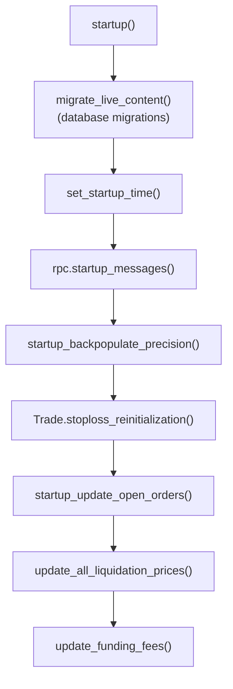
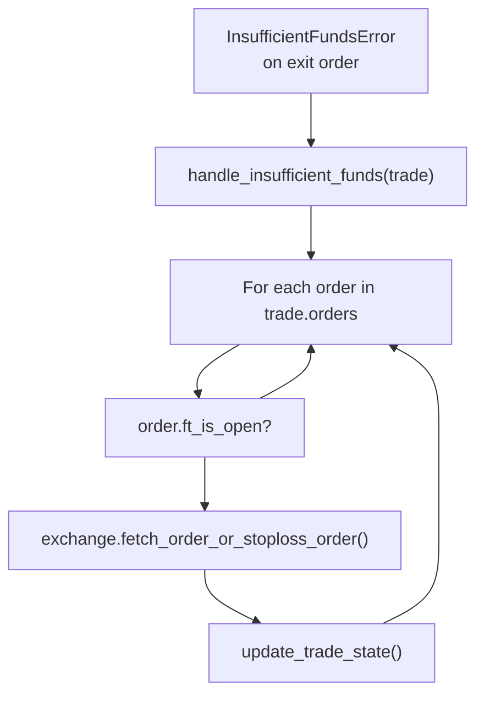

# FreqtradeBot Core

Relevant source files

* [freqtrade/exchange/binance.py](https://github.com/freqtrade/freqtrade/blob/8e91fea1/freqtrade/exchange/binance.py)
* [freqtrade/exchange/exchange.py](https://github.com/freqtrade/freqtrade/blob/8e91fea1/freqtrade/exchange/exchange.py)
* [freqtrade/exchange/kraken.py](https://github.com/freqtrade/freqtrade/blob/8e91fea1/freqtrade/exchange/kraken.py)
* [freqtrade/freqtradebot.py](https://github.com/freqtrade/freqtrade/blob/8e91fea1/freqtrade/freqtradebot.py)
* [tests/conftest.py](https://github.com/freqtrade/freqtrade/blob/8e91fea1/tests/conftest.py)
* [tests/exchange/test\_binance.py](https://github.com/freqtrade/freqtrade/blob/8e91fea1/tests/exchange/test_binance.py)
* [tests/exchange/test\_exchange.py](https://github.com/freqtrade/freqtrade/blob/8e91fea1/tests/exchange/test_exchange.py)
* [tests/exchange/test\_kraken.py](https://github.com/freqtrade/freqtrade/blob/8e91fea1/tests/exchange/test_kraken.py)

The `FreqtradeBot` class is the main orchestrator of the Freqtrade trading bot, responsible for coordinating all trading operations, managing the lifecycle of trades, and orchestrating interactions between strategies, exchanges, and data providers. This document covers the initialization, main process loop, trade management, and state handling within the `FreqtradeBot` class.

For information about strategy development and callbacks, see [Strategy Interface and Development](/freqtrade/freqtrade/2.3-strategy-interface-and-development). For details about exchange integration, see [Exchange Integration](/freqtrade/freqtrade/2.2-exchange-integration). For data flow and market data management, see [Data Provider and Market Data Flow](/freqtrade/freqtrade/2.4-data-provider-and-market-data-flow).

## Overview and Responsibilities

The `FreqtradeBot` class serves as the central control unit that:

* Initializes and coordinates all subsystems (exchange, strategy, persistence, RPC)
* Executes the main trading loop approximately every 5 seconds
* Manages the complete lifecycle of trades from entry to exit
* Handles order execution, updates, and cancellations
* Coordinates with the strategy for trading signals
* Manages state transitions and error recovery

Sources: [freqtrade/freqtradebot.py73-77](https://github.com/freqtrade/freqtrade/blob/8e91fea1/freqtrade/freqtradebot.py#L73-L77)

## Component Architecture

### Core Components and Dependencies



**Initialization Order**: The components are initialized in a specific order to ensure dependencies are available when needed. Exchange and Strategy are created first, followed by database initialization, then Wallets, RPC, DataProvider, and PairListManager. The `ProtectionManager` is initialized last, after `strategy.ft_bot_start()` is called.

Sources: [freqtrade/freqtradebot.py79-178](https://github.com/freqtrade/freqtrade/blob/8e91fea1/freqtrade/freqtradebot.py#L79-L178)

### FreqtradeBot Class Structure

| Attribute | Type | Purpose |
| --- | --- | --- |
| `config` | `Config` | Configuration dictionary |
| `exchange` | `Exchange` | Exchange interface instance |
| `strategy` | `IStrategy` | Trading strategy instance |
| `wallets` | `Wallets` | Wallet balance manager |
| `dataprovider` | `DataProvider` | Market data access layer |
| `pairlists` | `PairListManager` | Dynamic pair selection |
| `rpc` | `RPCManager` | RPC communication manager |
| `protections` | `ProtectionManager` | Protection plugin manager |
| `emc` | `ExternalMessageConsumer` | External message consumer (optional) |
| `state` | `State` | Current bot state |
| `active_pair_whitelist` | `list[str]` | Currently active trading pairs |
| `trading_mode` | `TradingMode` | SPOT/MARGIN/FUTURES |
| `margin_mode` | `MarginMode` | NONE/CROSS/ISOLATED |
| `_exit_lock` | `Lock` | Prevents concurrent exit operations |
| `_schedule` | `Scheduler` | Scheduled task runner |

Sources: [freqtrade/freqtradebot.py79-178](https://github.com/freqtrade/freqtrade/blob/8e91fea1/freqtrade/freqtradebot.py#L79-L178)

## Initialization Process

### Initialization Sequence



Sources: [freqtrade/freqtradebot.py79-189](https://github.com/freqtrade/freqtrade/blob/8e91fea1/freqtrade/freqtradebot.py#L79-L189)

### Configuration Validation and Setup

The initialization process performs several validation steps:

1. **Exchange Configuration**: Credentials are removed from the config copy to prevent accidental exposure (line 94)
2. **Exchange Loading**: Uses `ExchangeResolver.load_exchange()` with leverage tiers enabled (lines 96-98)
3. **Strategy Loading**: Uses `StrategyResolver.load_strategy()` (line 100)
4. **Config Consistency**: Validates configuration consistency after strategy is loaded (line 103)
5. **Exchange Validation**: Re-validates exchange compatibility with the loaded strategy (line 105)

Sources: [freqtrade/freqtradebot.py92-105](https://github.com/freqtrade/freqtrade/blob/8e91fea1/freqtrade/freqtradebot.py#L92-L105)

### Trading Mode Specific Setup

For **FUTURES** trading mode, the bot schedules periodic tasks:

* **Funding Fee Updates**: Scheduled at minutes 1 and 31 of every hour (lines 169-172)
* **Liquidation Price Updates**: Called within the funding fee update
* **Wallet Updates**: Refreshes wallet balances after funding/liquidation updates

The scheduler also sets up a daily WebSocket connection reset at 00:02 UTC (line 174).

Sources: [freqtrade/freqtradebot.py159-174](https://github.com/freqtrade/freqtrade/blob/8e91fea1/freqtrade/freqtradebot.py#L159-L174)

### Initial State Configuration

The bot's initial state can be configured via the `initial_state` config parameter (lines 148-149):

* If not specified, defaults to `State.STOPPED`
* Can be set to `State.RUNNING` to start trading immediately
* Possible states: `STOPPED`, `RUNNING`, `RELOAD_CONFIG`

Sources: [freqtrade/freqtradebot.py147-149](https://github.com/freqtrade/freqtrade/blob/8e91fea1/freqtrade/freqtradebot.py#L147-L149)

## Main Process Loop

### Process Flow Overview

The `process()` method is the heart of FreqtradeBot, called repeatedly (typically every 5 seconds) to handle all trading operations.



Sources: [freqtrade/freqtradebot.py247-301](https://github.com/freqtrade/freqtrade/blob/8e91fea1/freqtrade/freqtradebot.py#L247-L301)

### Process Loop Execution Order

| Step | Method | Purpose | Lock Used |
| --- | --- | --- | --- |
| 1 | `exchange.reload_markets()` | Reload market data if refresh interval passed | No |
| 2 | `update_trades_without_assigned_fees()` | Update trades missing fee information | No |
| 3 | `Trade.get_open_trades()` | Query open trades from database | No |
| 4 | `_refresh_active_whitelist()` | Update active trading pairs | No |
| 5 | `dataprovider.refresh()` | Fetch latest OHLCV data | No |
| 6 | `strategy.bot_loop_start()` | Strategy pre-loop callback | No |
| 7 | `strategy.analyze()` | Populate indicators and signals | `_measure_execution` |
| 8 | `manage_open_orders()` | Check for timeouts and cancellations | `_exit_lock` |
| 9 | `exit_positions()` | Process exit conditions for open trades | `_exit_lock` |
| 10 | `Trade.commit()` | Commit database changes | No |
| 11 | `process_open_trade_positions()` | Handle position adjustments (DCA) | `_exit_lock` |
| 12 | `enter_positions()` | Create new trades if slots available | `_exit_lock` |
| 13 | `_schedule.run_pending()` | Execute scheduled tasks | No |
| 14 | `Trade.commit()` | Final database commit | No |
| 15 | `rpc.process_msg_queue()` | Process pending RPC messages | No |

Sources: [freqtrade/freqtradebot.py247-301](https://github.com/freqtrade/freqtrade/blob/8e91fea1/freqtrade/freqtradebot.py#L247-L301)

### Lock Management

The `_exit_lock` (line 152) is critical for preventing race conditions:

* **Protects**: Order management, position exits, position adjustments, and new entries
* **Purpose**: Prevents simultaneous execution of conflicting operations (e.g., entering and exiting the same pair)
* **Used by**: Telegram commands (force\_exit), RPC handlers, and the main process loop

Sources: [freqtrade/freqtradebot.py152-297](https://github.com/freqtrade/freqtrade/blob/8e91fea1/freqtrade/freqtradebot.py#L152-L297)

### Performance Monitoring

The bot includes execution time monitoring (lines 180-188):

* Tracks time spent in `strategy.analyze()`
* Warns if analysis takes more than 25% of the timeframe duration
* Suggests reducing strategy complexity or pair count if warnings occur

Sources: [freqtrade/freqtradebot.py180-188](https://github.com/freqtrade/freqtrade/blob/8e91fea1/freqtrade/freqtradebot.py#L180-L188)

## Trade Lifecycle Management

### Entry Flow (Creating New Trades)



Sources: [freqtrade/freqtradebot.py603-711](https://github.com/freqtrade/freqtrade/blob/8e91fea1/freqtrade/freqtradebot.py#L603-L711)

### Entry Execution Details

The `execute_entry()` method (lines 863-1053) handles the actual order placement:

1. **Stake Amount Validation**: Calls `get_valid_enter_price_and_stake()` to validate stake amount and leverage
2. **Timeframe Alignment**: Uses `strategy.get_valid_open_candle_time()` to ensure entry on valid candle
3. **Order Book Check**: Optionally checks order book depth if `entry_pricing.use_order_book` is enabled
4. **Entry Price Calculation**: Calculates entry price based on configuration (ask, bid, or order book)
5. **Confirmation**: Calls `strategy.confirm_trade_entry()` for final approval
6. **Custom Stake Amount**: Calls `strategy.custom_stake_amount()` for strategy-defined stake
7. **Leverage Validation**: Validates and sets leverage for margin/futures trades
8. **Order Creation**: Creates entry order via `exchange.create_order()`
9. **Trade Record Creation**: Creates `Trade` object and stores in database
10. **Stop Loss Setup**: Optionally creates stoploss-on-exchange if configured
11. **RPC Notification**: Sends entry notification via `_notify_enter()`

Sources: [freqtrade/freqtradebot.py863-1053](https://github.com/freqtrade/freqtrade/blob/8e91fea1/freqtrade/freqtradebot.py#L863-L1053)

### Exit Flow (Closing Trades)



The `check_exit_signal()` method evaluates multiple exit conditions in priority order:

| Priority | Exit Type | Method/Check | Description |
| --- | --- | --- | --- |
| 1 | Emergency Exit | `PairLocks.is_pair_locked()` | Emergency lock on pair |
| 2 | Immediate Loss | `_check_and_execute_exit_immediately()` | Loss below stop\_emergency threshold |
| 3 | Stoploss | `trade.stop_loss` | Regular stoploss triggered |
| 4 | Custom Stoploss | `strategy.custom_stoploss()` | Strategy-defined dynamic stoploss |
| 5 | ROI | `strategy.min_roi_reached()` | Minimum ROI target reached |
| 6 | Custom ROI | `strategy.custom_roi()` | Strategy-defined custom ROI |
| 7 | Partial Exit | `strategy.custom_exit()` | Strategy-defined partial exit |
| 8 | Exit Signal | `strategy.get_exit_signal()` | Exit signal from strategy |
| 9 | Custom Exit | `strategy.custom_exit()` | Strategy-defined custom exit logic |

Sources: [freqtrade/freqtradebot.py1055-1213](https://github.com/freqtrade/freqtrade/blob/8e91fea1/freqtrade/freqtradebot.py#L1055-L1213)

### Order State Update Flow



Sources: [freqtrade/freqtradebot.py1362-1521](https://github.com/freqtrade/freqtrade/blob/8e91fea1/freqtrade/freqtradebot.py#L1362-L1521)

### Position Adjustment (DCA)

When `strategy.position_adjustment_enable` is `True`, the bot can modify existing positions:



Sources: [freqtrade/freqtradebot.py716-829](https://github.com/freqtrade/freqtrade/blob/8e91fea1/freqtrade/freqtradebot.py#L716-L829)

## State Management

### Bot States

The `FreqtradeBot` uses the `State` enum to manage operational states:

| State | Description | Trading Activity | RPC Commands |
| --- | --- | --- | --- |
| `STOPPED` | Bot is not trading | No new entries or exits | Limited commands available |
| `RUNNING` | Normal trading operation | Full trading enabled | All commands available |
| `RELOAD_CONFIG` | Reloading configuration | Trading paused during reload | Limited during reload |

Sources: [freqtrade/freqtradebot.py88-149](https://github.com/freqtrade/freqtrade/blob/8e91fea1/freqtrade/freqtradebot.py#L88-L149) [freqtrade/enums/\_\_init\_\_.py](https://github.com/freqtrade/freqtrade/blob/8e91fea1/freqtrade/enums/__init__.py)

### State Transitions



**State Changes via RPC**: The state is primarily controlled through RPC commands (Telegram, REST API):

* `start`: Changes state from `STOPPED` to `RUNNING`
* `stop`: Changes state from `RUNNING` to `STOPPED`
* `reload_config`: Temporarily sets state to `RELOAD_CONFIG`

Sources: [freqtrade/freqtradebot.py88-149](https://github.com/freqtrade/freqtrade/blob/8e91fea1/freqtrade/freqtradebot.py#L88-L149)

### Process Behavior by State

The `process()` method behavior varies by state:

**STOPPED State**:

* Calls `process_stopped()` which can cancel open orders if configured
* Does not create new positions
* Does not close existing positions (unless `cancel_open_orders_on_exit=True`)

**RUNNING State**:

* Full execution of process loop
* Creates new positions when `get_free_open_trades() > 0`
* Processes exits and adjustments normally

**RELOAD\_CONFIG State**:

* Temporarily blocks position adjustments (line 772)
* Continues monitoring existing trades
* Does not enter new positions

Sources: [freqtrade/freqtradebot.py296-774](https://github.com/freqtrade/freqtrade/blob/8e91fea1/freqtrade/freqtradebot.py#L296-L774)

## Startup and Shutdown Operations

### Startup Sequence

The `startup()` method (lines 227-246) performs initialization tasks after the bot is created:



**Key Startup Operations**:

1. **Database Migration**: Updates database schema for exchange compatibility changes
2. **Precision Backpopulation**: Updates existing trades with current exchange precision data
3. **Stoploss Reinitialization**: Adjusts stoploss for existing trades if strategy stoploss changed
4. **Open Order Updates**: Fetches current state of all open orders from exchange (non-dry-run only)
5. **Liquidation Price Updates**: Recalculates liquidation prices for futures trades
6. **Funding Fee Updates**: Updates funding fees for futures positions

Sources: [freqtrade/freqtradebot.py227-246](https://github.com/freqtrade/freqtrade/blob/8e91fea1/freqtrade/freqtradebot.py#L227-L246)

### Open Order Synchronization

The `startup_update_open_orders()` method (lines 392-437) synchronizes database state with exchange:

* Only runs in live mode (skipped in dry-run)
* Fetches all orders marked as open in the database
* Updates order status from exchange
* Handles orders older than 5 days by marking them as cancelled
* Can be skipped with config `exchange.skip_open_order_update = True`

Sources: [freqtrade/freqtradebot.py392-437](https://github.com/freqtrade/freqtrade/blob/8e91fea1/freqtrade/freqtradebot.py#L392-L437)

### Cleanup and Shutdown

The `cleanup()` method (lines 197-226) performs graceful shutdown:

1. **Cancel Open Orders**: If `cancel_open_orders_on_exit=True`, cancels all open orders
2. **Open Trades Warning**: Notifies user of open trades via `check_for_open_trades()`
3. **Strategy Cleanup**: Calls `strategy.ft_bot_cleanup()`
4. **RPC Cleanup**: Shuts down RPC handlers
5. **External Message Consumer**: Shuts down EMC if enabled
6. **Exchange Cleanup**: Closes exchange connections
7. **Database Commit**: Final commit to persist any pending changes

Sources: [freqtrade/freqtradebot.py197-226](https://github.com/freqtrade/freqtrade/blob/8e91fea1/freqtrade/freqtradebot.py#L197-L226)

## Error Handling and Recovery

### Trade Recovery Mechanisms

#### Insufficient Funds Recovery

When an `InsufficientFundsError` occurs during exit operations, the bot attempts to recover:



This recovery mechanism tries to find the missing order by checking all orders associated with the trade.

Sources: [freqtrade/freqtradebot.py480-505](https://github.com/freqtrade/freqtrade/blob/8e91fea1/freqtrade/freqtradebot.py#L480-L505)

#### On-Exchange Order Recovery

The `handle_onexchange_order()` method (lines 506-597) recovers from situations where orders exist on the exchange but aren't in the database:

1. Fetches all orders for the pair from the exchange
2. Matches orders to the trade by order ID
3. Creates new `Order` records for unknown orders
4. Updates trade state based on order status
5. Closes trade if all orders are filled
6. Adjusts trade amount if wallet balance doesn't match

This is critical for recovering from:

* Manual interventions on the exchange
* Database corruption or loss
* Network issues during order placement

Sources: [freqtrade/freqtradebot.py506-597](https://github.com/freqtrade/freqtrade/blob/8e91fea1/freqtrade/freqtradebot.py#L506-L597)

### Fee Management

The bot includes mechanisms to ensure all trades have correct fee information:

**`update_trades_without_assigned_fees()`** (lines 439-478):

* Runs on every process loop iteration
* Identifies trades missing fee information
* Fetches order details from exchange to get actual fees
* Updates both entry and exit fees

This ensures accurate profit calculations even if fee information was initially unavailable.

Sources: [freqtrade/freqtradebot.py439-478](https://github.com/freqtrade/freqtrade/blob/8e91fea1/freqtrade/freqtradebot.py#L439-L478)

### Order Timeout and Cancellation

The `manage_open_orders()` method handles order timeouts:

1. **Entry Order Timeout**: Configured via `unfilledtimeout.entry` (default 10 minutes)
2. **Exit Order Timeout**: Configured via `unfilledtimeout.exit` (default 30 minutes)
3. **Order Replacement**: If `order_time_in_force` uses `PO` (Post-Only), may replace with market order
4. **Stoploss Cancellation**: Cancels associated stoploss orders when entry is cancelled

The bot also monitors for exchange-initiated cancellations and updates trade state accordingly.

Sources: [freqtrade/freqtradebot.py1523-1680](https://github.com/freqtrade/freqtrade/blob/8e91fea1/freqtrade/freqtradebot.py#L1523-L1680)

### Wallet Balance Discrepancies

When the wallet balance doesn't match the trade amount (detected in `handle_onexchange_order()`):

* **Small Differences** (< 2%): Adjusts trade amount to match wallet balance
* **Large Differences** (≥ 2%): Logs warning but doesn't adjust (may indicate serious issue)
* **Fully Cancelled Entries**: Deletes trade if all entry orders were cancelled

Sources: [freqtrade/freqtradebot.py558-586](https://github.com/freqtrade/freqtrade/blob/8e91fea1/freqtrade/freqtradebot.py#L558-L586)

## Scheduled Tasks

### Task Scheduling System

The bot uses the `schedule` library to run periodic tasks:

```
```
self._schedule = Scheduler()
```
```

**Futures Mode Tasks** (lines 169-172):

* **Frequency**: Every hour at minutes 1 and 31
* **Tasks**:
  + `update_funding_fees()`: Updates funding fees for all open futures positions
  + `update_all_liquidation_prices()`: Recalculates liquidation prices (cross margin only)
  + `wallets.update()`: Refreshes wallet balances

**WebSocket Reset** (line 174):

* **Frequency**: Daily at 00:02 UTC
* **Task**: `exchange.ws_connection_reset()`: Resets WebSocket connections to prevent stale connections

Sources: [freqtrade/freqtradebot.py157-174](https://github.com/freqtrade/freqtrade/blob/8e91fea1/freqtrade/freqtradebot.py#L157-L174)

### Funding Fee Management

For futures trading, funding fees are charged at regular intervals (typically every 4-8 hours):

The `update_funding_fees()` method (lines 367-378):

1. Gets all open trades
2. For each trade, calls `exchange.get_funding_fees()` with trade details
3. Updates `trade.funding_fees` via `trade.set_funding_fees()`

This ensures accurate profit calculations that include funding fee costs.

Sources: [freqtrade/freqtradebot.py367-378](https://github.com/freqtrade/freqtrade/blob/8e91fea1/freqtrade/freqtradebot.py#L367-L378)

### Liquidation Price Updates

For cross-margin futures trading, liquidation prices must be recalculated when positions or wallet balance changes:

The `update_all_liquidation_prices()` method (lines 357-365):

* Only runs for `FUTURES` mode with `CROSS` margin
* Calls `update_liquidation_prices()` from the liquidation module
* Updates all trades simultaneously based on total wallet balance

Sources: [freqtrade/freqtradebot.py357-365](https://github.com/freqtrade/freqtrade/blob/8e91fea1/freqtrade/freqtradebot.py#L357-L365)