# Futures and Margin Trading

Relevant source files

* [freqtrade/exchange/binance.py](https://github.com/freqtrade/freqtrade/blob/8e91fea1/freqtrade/exchange/binance.py)
* [freqtrade/exchange/exchange.py](https://github.com/freqtrade/freqtrade/blob/8e91fea1/freqtrade/exchange/exchange.py)
* [freqtrade/exchange/kraken.py](https://github.com/freqtrade/freqtrade/blob/8e91fea1/freqtrade/exchange/kraken.py)
* [freqtrade/freqtradebot.py](https://github.com/freqtrade/freqtrade/blob/8e91fea1/freqtrade/freqtradebot.py)
* [freqtrade/persistence/migrations.py](https://github.com/freqtrade/freqtrade/blob/8e91fea1/freqtrade/persistence/migrations.py)
* [freqtrade/persistence/models.py](https://github.com/freqtrade/freqtrade/blob/8e91fea1/freqtrade/persistence/models.py)
* [freqtrade/persistence/trade\_model.py](https://github.com/freqtrade/freqtrade/blob/8e91fea1/freqtrade/persistence/trade_model.py)
* [tests/conftest.py](https://github.com/freqtrade/freqtrade/blob/8e91fea1/tests/conftest.py)
* [tests/conftest\_trades.py](https://github.com/freqtrade/freqtrade/blob/8e91fea1/tests/conftest_trades.py)
* [tests/exchange/test\_binance.py](https://github.com/freqtrade/freqtrade/blob/8e91fea1/tests/exchange/test_binance.py)
* [tests/exchange/test\_exchange.py](https://github.com/freqtrade/freqtrade/blob/8e91fea1/tests/exchange/test_exchange.py)
* [tests/exchange/test\_kraken.py](https://github.com/freqtrade/freqtrade/blob/8e91fea1/tests/exchange/test_kraken.py)
* [tests/persistence/test\_persistence.py](https://github.com/freqtrade/freqtrade/blob/8e91fea1/tests/persistence/test_persistence.py)

## Purpose and Scope

This page documents Freqtrade's futures and margin trading capabilities, covering:

* Trading mode configuration (`TradingMode.SPOT`, `TradingMode.MARGIN`, `TradingMode.FUTURES`)
* Margin mode selection (`MarginMode.NONE`, `MarginMode.ISOLATED`, `MarginMode.CROSS`)
* Leverage handling and position sizing
* Liquidation price calculation and monitoring
* Funding fee collection (futures perpetual contracts)
* Interest rate calculations (margin trading)
* Contract size conversions and precision handling

The implementation spans multiple modules: `FreqtradeBot` for orchestration, `Exchange` classes for exchange-specific logic, `Trade` model for persistence, and specialized modules in `freqtrade/leverage/` for calculations.

---

## Trading Modes and Margin Modes

Freqtrade supports three distinct trading modes with associated margin modes:

| Trading Mode | Margin Mode Options | Description |
| --- | --- | --- |
| `SPOT` | `NONE` | Traditional spot trading without leverage |
| `MARGIN` | `CROSS`, `ISOLATED` | Margin trading with borrowed funds |
| `FUTURES` | `CROSS`, `ISOLATED` | Perpetual futures contracts with leverage |

### Trading Mode Configuration

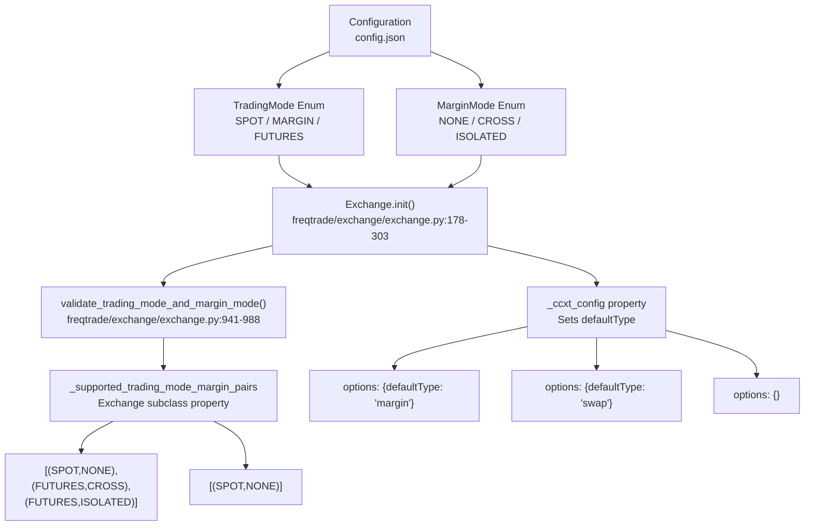

**Sources:**

* [freqtrade/exchange/exchange.py178-218](https://github.com/freqtrade/freqtrade/blob/8e91fea1/freqtrade/exchange/exchange.py#L178-L218)
* [freqtrade/exchange/exchange.py411-418](https://github.com/freqtrade/freqtrade/blob/8e91fea1/freqtrade/exchange/exchange.py#L411-L418)
* [freqtrade/exchange/binance.py70-75](https://github.com/freqtrade/freqtrade/blob/8e91fea1/freqtrade/exchange/binance.py#L70-L75)
* [freqtrade/exchange/kraken.py41-45](https://github.com/freqtrade/freqtrade/blob/8e91fea1/freqtrade/exchange/kraken.py#L41-L45)

---

## Core Leverage Properties

The trading mode is set during bot initialization and affects multiple system components:

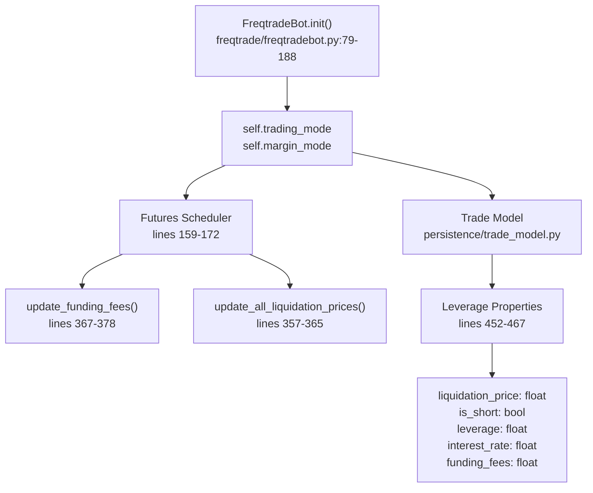

**Sources:**

* [freqtrade/freqtradebot.py113-114](https://github.com/freqtrade/freqtrade/blob/8e91fea1/freqtrade/freqtradebot.py#L113-L114)
* [freqtrade/freqtradebot.py159-172](https://github.com/freqtrade/freqtrade/blob/8e91fea1/freqtrade/freqtradebot.py#L159-L172)
* [freqtrade/persistence/trade\_model.py452-467](https://github.com/freqtrade/freqtrade/blob/8e91fea1/freqtrade/persistence/trade_model.py#L452-L467)

---

## Leverage Configuration

### Leverage in Trade Execution

Leverage is configured per pair or globally and affects position sizing and margin requirements:

```
```
# Configuration example
"leverage": 3.0,
"max_leverage": 5.0,
"trading_mode": "futures",
"margin_mode": "isolated"
```
```

### Leverage Application

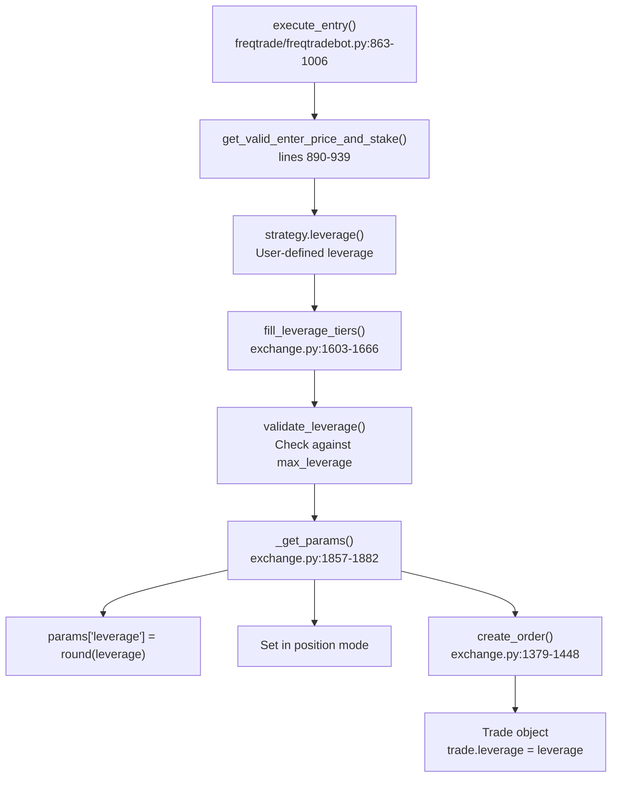

**Sources:**

* [freqtrade/freqtradebot.py890-939](https://github.com/freqtrade/freqtrade/blob/8e91fea1/freqtrade/freqtradebot.py#L890-L939)
* [freqtrade/exchange/exchange.py1603-1666](https://github.com/freqtrade/freqtrade/blob/8e91fea1/freqtrade/exchange/exchange.py#L1603-L1666)
* [freqtrade/exchange/kraken.py130-150](https://github.com/freqtrade/freqtrade/blob/8e91fea1/freqtrade/exchange/kraken.py#L130-L150)

---

## Position Types: Long and Short

### Long vs Short Trade Properties

The `is_short` flag fundamentally changes trade behavior:

| Property | Long (is\_short=False) | Short (is\_short=True) |
| --- | --- | --- |
| `entry_side` | `"buy"` | `"sell"` |
| `exit_side` | `"sell"` | `"buy"` |
| `trade_direction` | `"long"` | `"short"` |
| Borrowed | Quote currency (if leveraged) | Base currency |
| Profit direction | Price increase | Price decrease |
| Liquidation price | Below entry | Above entry |

### Borrowed Amount Calculation

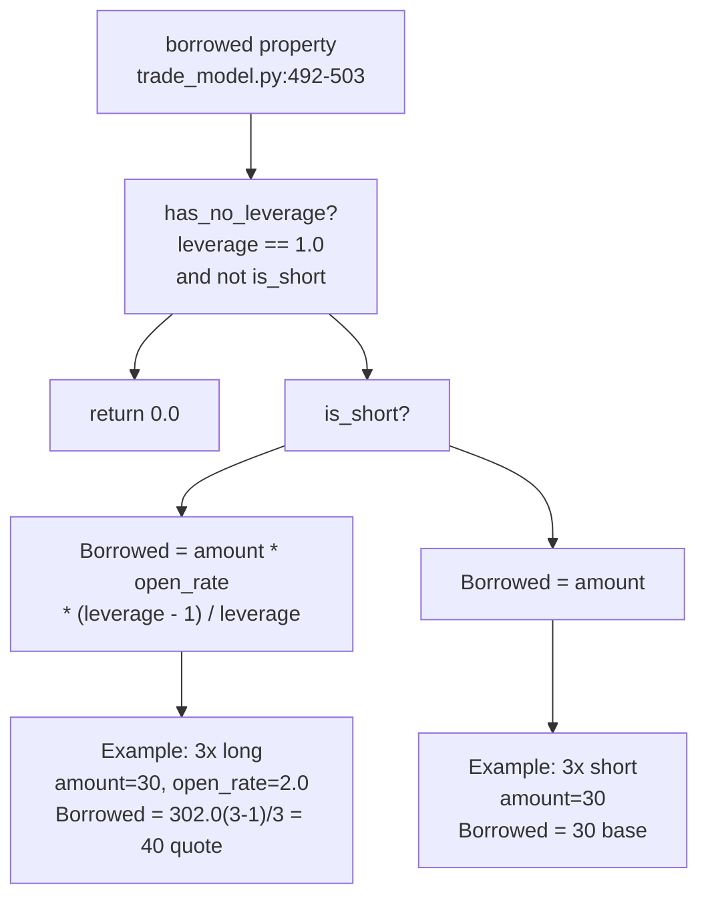

**Sources:**

* [freqtrade/persistence/trade\_model.py492-503](https://github.com/freqtrade/freqtrade/blob/8e91fea1/freqtrade/persistence/trade_model.py#L492-L503)
* [freqtrade/persistence/trade\_model.py546-565](https://github.com/freqtrade/freqtrade/blob/8e91fea1/freqtrade/persistence/trade_model.py#L546-L565)
* [tests/persistence/test\_persistence.py281-290](https://github.com/freqtrade/freqtrade/blob/8e91fea1/tests/persistence/test_persistence.py#L281-L290)

---

## Liquidation Price Management

### Liquidation Price Calculation Flow

Diagram: Liquidation Price Update Sequence

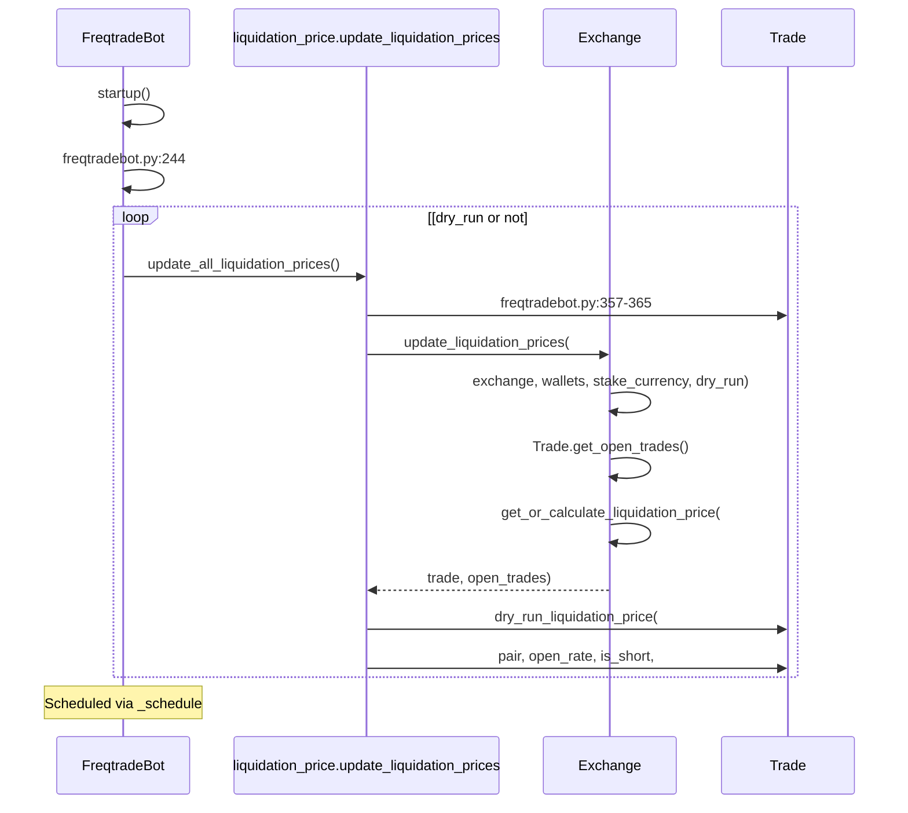

**Sources:**

* [freqtrade/freqtradebot.py244](https://github.com/freqtrade/freqtrade/blob/8e91fea1/freqtrade/freqtradebot.py#L244-L244)
* [freqtrade/freqtradebot.py357-365](https://github.com/freqtrade/freqtrade/blob/8e91fea1/freqtrade/freqtradebot.py#L357-L365)
* [freqtrade/leverage/liquidation\_price.py7-150](https://github.com/freqtrade/freqtrade/blob/8e91fea1/freqtrade/leverage/liquidation_price.py#L7-L150)
* [freqtrade/exchange/exchange.py2091-2149](https://github.com/freqtrade/freqtrade/blob/8e91fea1/freqtrade/exchange/exchange.py#L2091-L2149)

### Binance Liquidation Price Formula

For isolated margin mode:

```
Liquidation Price (Long) = 
    (WB - TMM + UPNL + cumB - cumQ) / (amount * (1 - mm_ratio))

Liquidation Price (Short) = 
    (WB - TMM + UPNL + cumB - cumQ) / (amount * (1 + mm_ratio))

Where:
- WB = Wallet Balance
- TMM = Total Maintenance Margin
- UPNL = Unrealized PNL
- cumB = Cumulative bid value
- cumQ = Cumulative ask value  
- mm_ratio = Maintenance margin ratio
```

For cross margin mode, additional calculations include other open positions.

**Sources:**

* [freqtrade/freqtradebot.py357-365](https://github.com/freqtrade/freqtrade/blob/8e91fea1/freqtrade/freqtradebot.py#L357-L365)
* [freqtrade/leverage/liquidation\_price.py1-150](https://github.com/freqtrade/freqtrade/blob/8e91fea1/freqtrade/leverage/liquidation_price.py#L1-L150)
* [freqtrade/exchange/binance.py290-383](https://github.com/freqtrade/freqtrade/blob/8e91fea1/freqtrade/exchange/binance.py#L290-L383)

### Stoploss vs Liquidation

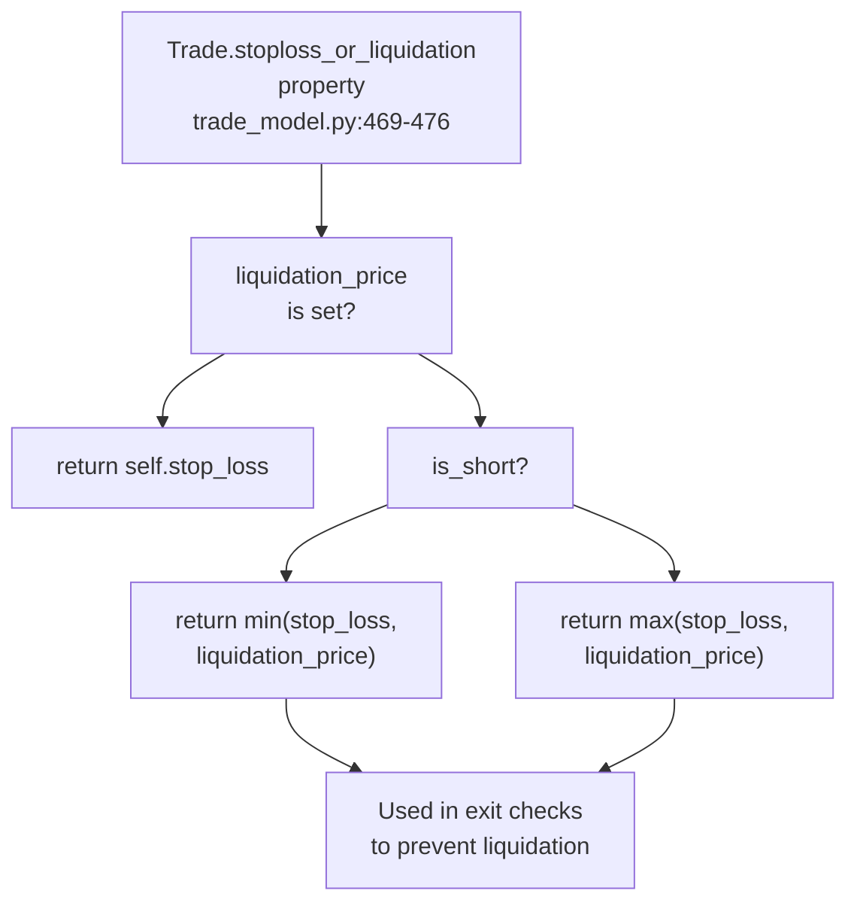

**Sources:**

* [freqtrade/persistence/trade\_model.py469-476](https://github.com/freqtrade/freqtrade/blob/8e91fea1/freqtrade/persistence/trade_model.py#L469-L476)
* [tests/persistence/test\_persistence.py51-175](https://github.com/freqtrade/freqtrade/blob/8e91fea1/tests/persistence/test_persistence.py#L51-L175)

---

## Funding Fees (Futures Trading)

Funding fees are periodic payments between long and short position holders in perpetual futures contracts.

### Funding Fee Update Mechanism

Diagram: Scheduled Funding Fee Updates via `schedule` Library

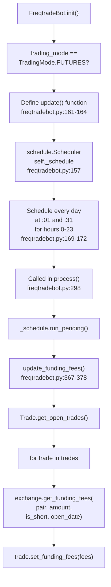

**Sources:**

* [freqtrade/freqtradebot.py157-172](https://github.com/freqtrade/freqtrade/blob/8e91fea1/freqtrade/freqtradebot.py#L157-L172)
* [freqtrade/freqtradebot.py298](https://github.com/freqtrade/freqtrade/blob/8e91fea1/freqtrade/freqtradebot.py#L298-L298)
* [freqtrade/freqtradebot.py367-378](https://github.com/freqtrade/freqtrade/blob/8e91fea1/freqtrade/freqtradebot.py#L367-L378)

### Funding Fee Calculation

Diagram: Funding Fee Calculation Flow in `Exchange.get_funding_fees()`

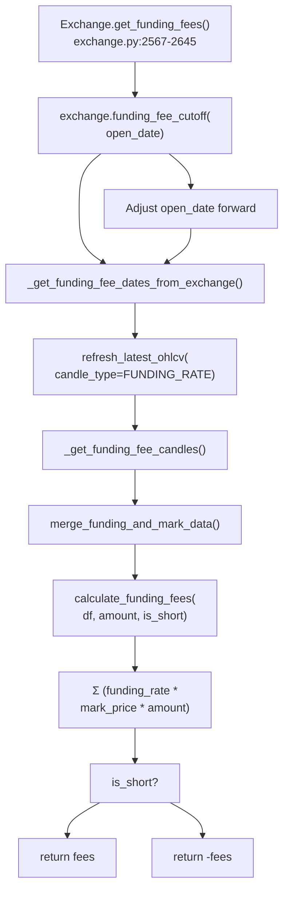

**Sources:**

* [freqtrade/exchange/exchange.py2567-2645](https://github.com/freqtrade/freqtrade/blob/8e91fea1/freqtrade/exchange/exchange.py#L2567-L2645)
* [freqtrade/exchange/exchange.py2424-2472](https://github.com/freqtrade/freqtrade/blob/8e91fea1/freqtrade/exchange/exchange.py#L2424-L2472)
* [freqtrade/exchange/exchange.py2474-2523](https://github.com/freqtrade/freqtrade/blob/8e91fea1/freqtrade/exchange/exchange.py#L2474-L2523)

### Exchange-Specific Funding Implementation

**Binance:**

* Funding occurs every 8 hours (00:00, 08:00, 16:00 UTC)
* 15-second cutoff: trades opened at `XX:00:01` to `XX:00:14` are not charged until next period
* Implemented in `Binance.funding_fee_cutoff()` [freqtrade/exchange/binance.py260-269](https://github.com/freqtrade/freqtrade/blob/8e91fea1/freqtrade/exchange/binance.py#L260-L269)
* Uses `fetch_funding_rates()` for live rate data [freqtrade/exchange/binance.py271-290](https://github.com/freqtrade/freqtrade/blob/8e91fea1/freqtrade/exchange/binance.py#L271-L290)

**Kraken:**

* Requires `time_in_ratio` parameter (time spent in position within funding period)
* Raises `OperationalException` if `time_in_ratio` not provided [freqtrade/exchange/kraken.py175-177](https://github.com/freqtrade/freqtrade/blob/8e91fea1/freqtrade/exchange/kraken.py#L175-L177)
* Custom calculation per 4-hour periods [freqtrade/exchange/kraken.py151-184](https://github.com/freqtrade/freqtrade/blob/8e91fea1/freqtrade/exchange/kraken.py#L151-L184)

**Sources:**

* [freqtrade/exchange/binance.py260-269](https://github.com/freqtrade/freqtrade/blob/8e91fea1/freqtrade/exchange/binance.py#L260-L269)
* [freqtrade/exchange/binance.py271-290](https://github.com/freqtrade/freqtrade/blob/8e91fea1/freqtrade/exchange/binance.py#L271-L290)
* [freqtrade/exchange/kraken.py151-184](https://github.com/freqtrade/freqtrade/blob/8e91fea1/freqtrade/exchange/kraken.py#L151-L184)

---

## Interest Rates (Margin Trading)

Margin trading incurs interest on borrowed funds, calculated based on the borrowed amount and time held.

### Interest Calculation Flow

Diagram: `Trade.calculate_interest()` Logic

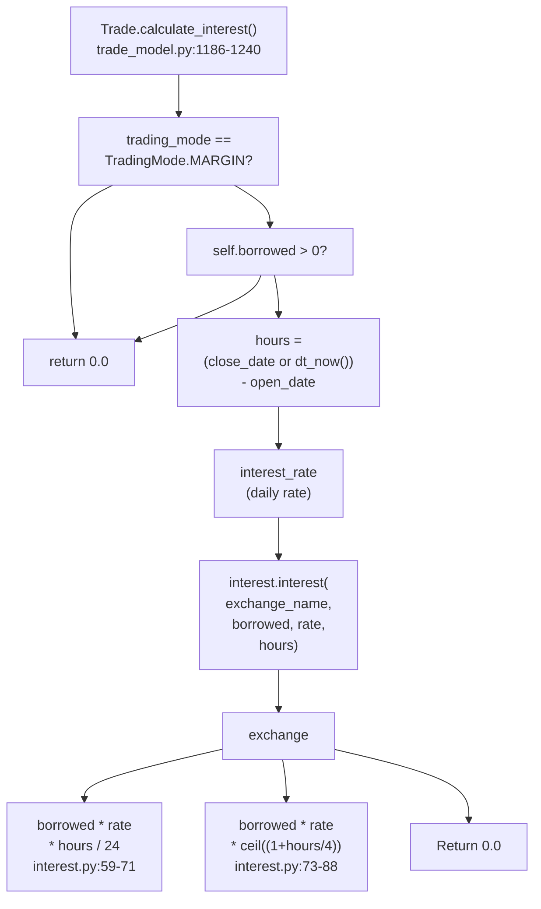

**Sources:**

* [freqtrade/persistence/trade\_model.py1186-1240](https://github.com/freqtrade/freqtrade/blob/8e91fea1/freqtrade/persistence/trade_model.py#L1186-L1240)
* [freqtrade/leverage/interest.py44-88](https://github.com/freqtrade/freqtrade/blob/8e91fea1/freqtrade/leverage/interest.py#L44-L88)

### Interest Calculation Examples

From test cases [tests/persistence/test\_persistence.py177-279](https://github.com/freqtrade/freqtrade/blob/8e91fea1/tests/persistence/test_persistence.py#L177-L279):

| Exchange | Leverage | Duration | Rate | Interest (Quote/Base) |
| --- | --- | --- | --- | --- |
| Binance | 3x long | 10 min | 0.0005 | 0.00083 quote |
| Binance | 3x short | 10 min | 0.0005 | 0.000625 base |
| Kraken | 3x long | 10 min | 0.0005 | 0.040 quote |
| Kraken | 3x short | 10 min | 0.0005 | 0.030 base |
| Binance | 5x long | 295 min | 0.0005 | 0.005 quote |

**Sources:**

* [freqtrade/persistence/trade\_model.py1186-1240](https://github.com/freqtrade/freqtrade/blob/8e91fea1/freqtrade/persistence/trade_model.py#L1186-L1240)
* [freqtrade/leverage/interest.py1-100](https://github.com/freqtrade/freqtrade/blob/8e91fea1/freqtrade/leverage/interest.py#L1-L100)
* [tests/persistence/test\_persistence.py177-279](https://github.com/freqtrade/freqtrade/blob/8e91fea1/tests/persistence/test_persistence.py#L177-L279)

---

## Contract Sizes and Precision

Futures contracts often have contract sizes != 1, requiring conversion between contracts and amounts. For example, BTC/USDT:USDT on some exchanges has a contract size of 0.001 BTC per contract.

### Contract Size Handling

Diagram: Contract Size Conversion Flow

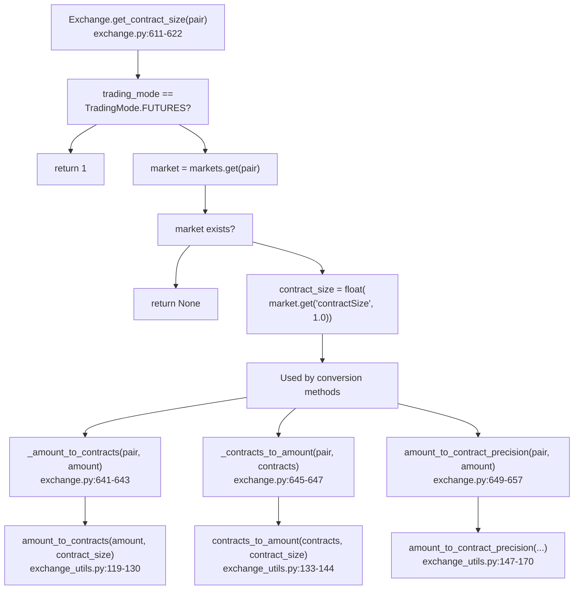

**Sources:**

* [freqtrade/exchange/exchange.py611-622](https://github.com/freqtrade/freqtrade/blob/8e91fea1/freqtrade/exchange/exchange.py#L611-L622)
* [freqtrade/exchange/exchange.py641-657](https://github.com/freqtrade/freqtrade/blob/8e91fea1/freqtrade/exchange/exchange.py#L641-L657)
* [freqtrade/exchange/exchange\_utils.py119-170](https://github.com/freqtrade/freqtrade/blob/8e91fea1/freqtrade/exchange/exchange_utils.py#L119-L170)

### Precision Handling

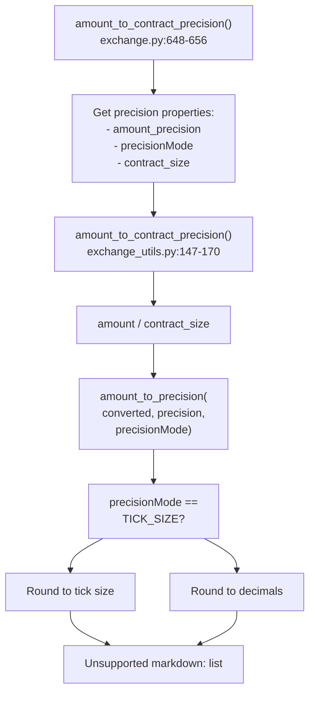

**Sources:**

* [freqtrade/exchange/exchange.py610-622](https://github.com/freqtrade/freqtrade/blob/8e91fea1/freqtrade/exchange/exchange.py#L610-L622)
* [freqtrade/exchange/exchange.py648-656](https://github.com/freqtrade/freqtrade/blob/8e91fea1/freqtrade/exchange/exchange.py#L648-L656)
* [freqtrade/exchange/exchange\_utils.py147-170](https://github.com/freqtrade/freqtrade/blob/8e91fea1/freqtrade/exchange/exchange_utils.py#L147-L170)

---

## Trade Model Adjustments for Leverage

### Profit Calculation Differences

The `Trade` model (and its backtesting counterpart `LocalTrade`) calculate profit with leverage, interest, and funding fees.

Diagram: `Trade.calc_profit()` and `Trade.calc_profit_ratio()` Flow

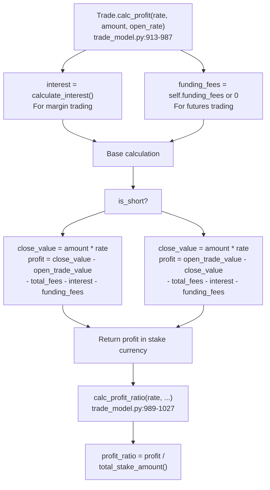

**Sources:**

* [freqtrade/persistence/trade\_model.py913-987](https://github.com/freqtrade/freqtrade/blob/8e91fea1/freqtrade/persistence/trade_model.py#L913-L987)
* [freqtrade/persistence/trade\_model.py989-1027](https://github.com/freqtrade/freqtrade/blob/8e91fea1/freqtrade/persistence/trade_model.py#L989-L1027)
* [freqtrade/persistence/trade\_model.py826-863](https://github.com/freqtrade/freqtrade/blob/8e91fea1/freqtrade/persistence/trade_model.py#L826-L863)

### Open Trade Value

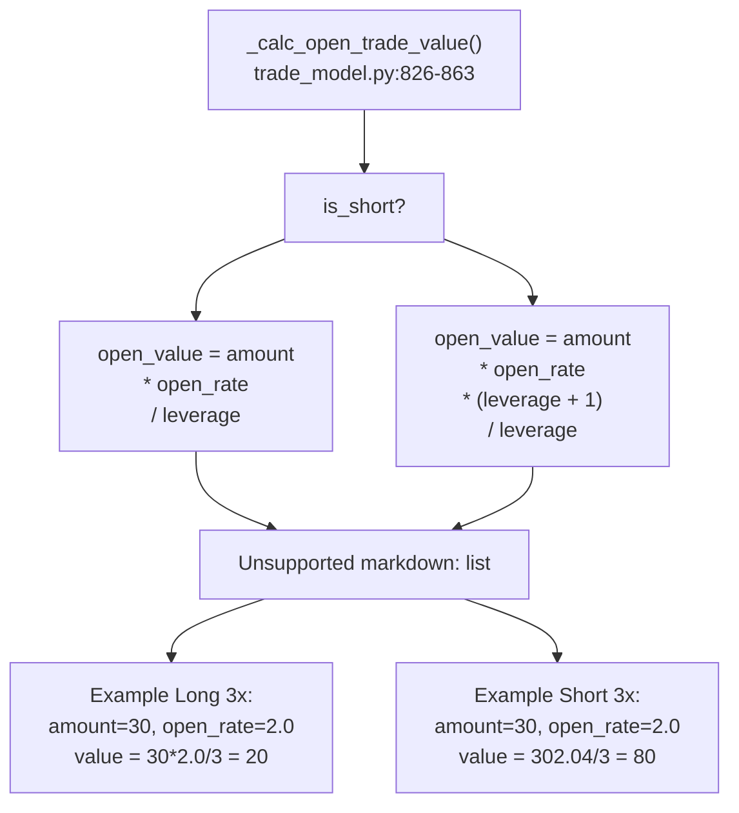

**Sources:**

* [freqtrade/persistence/trade\_model.py826-863](https://github.com/freqtrade/freqtrade/blob/8e91fea1/freqtrade/persistence/trade_model.py#L826-L863)
* [freqtrade/persistence/trade\_model.py913-987](https://github.com/freqtrade/freqtrade/blob/8e91fea1/freqtrade/persistence/trade_model.py#L913-L987)

---

## Liquidation and Stoploss Monitoring

### Position Monitoring in `exit_positions()`

The bot continuously monitors positions for stoploss and liquidation conditions. The `stoploss_or_liquidation` property ensures the bot exits before liquidation occurs.

Diagram: Exit Position Monitoring Flow

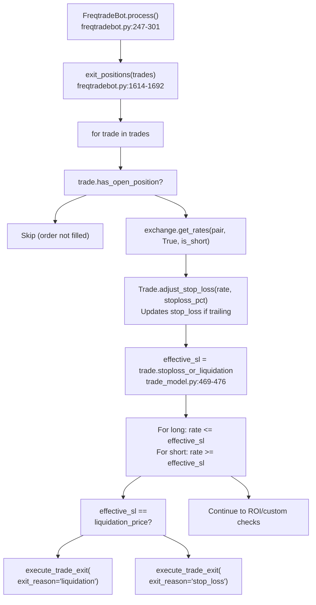

**Sources:**

* [freqtrade/freqtradebot.py1614-1692](https://github.com/freqtrade/freqtrade/blob/8e91fea1/freqtrade/freqtradebot.py#L1614-L1692)
* [freqtrade/persistence/trade\_model.py469-476](https://github.com/freqtrade/freqtrade/blob/8e91fea1/freqtrade/persistence/trade_model.py#L469-L476)
* [freqtrade/freqtradebot.py1522-1612](https://github.com/freqtrade/freqtrade/blob/8e91fea1/freqtrade/freqtradebot.py#L1522-L1612)

### Cross Margin Risk

In cross margin mode (`MarginMode.CROSS`), all positions share the same margin balance. The liquidation price of one position depends on the unrealized PNL and maintenance margin of all other positions.

Diagram: Cross Margin Liquidation Price Dependencies

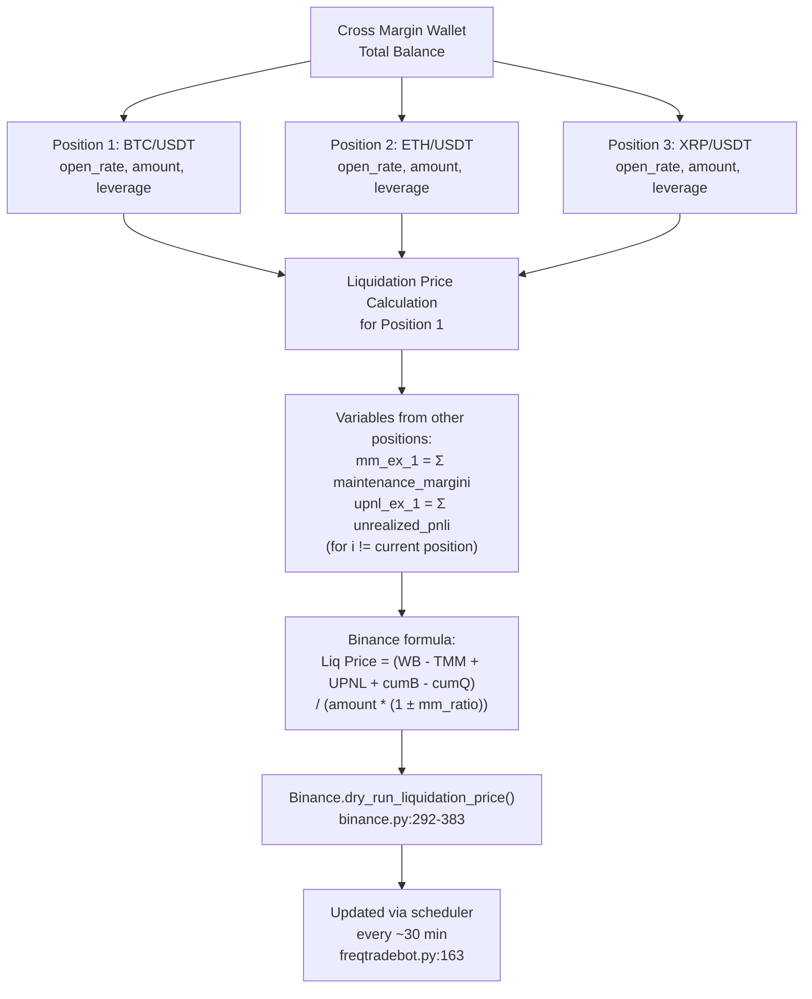

**Sources:**

* [freqtrade/exchange/binance.py292-383](https://github.com/freqtrade/freqtrade/blob/8e91fea1/freqtrade/exchange/binance.py#L292-L383)
* [freqtrade/freqtradebot.py357-365](https://github.com/freqtrade/freqtrade/blob/8e91fea1/freqtrade/freqtradebot.py#L357-L365)
* [freqtrade/leverage/liquidation\_price.py7-150](https://github.com/freqtrade/freqtrade/blob/8e91fea1/freqtrade/leverage/liquidation_price.py#L7-L150)

---

## Exchange-Specific Implementations

### Binance Futures

**Initialization checks** [freqtrade/exchange/binance.py110-146](https://github.com/freqtrade/freqtrade/blob/8e91fea1/freqtrade/exchange/binance.py#L110-L146):

* Verifies dual side position mode is disabled (hedge mode not supported)
* Checks multi-asset margin mode (only for cross margin)

**Configuration:**

```
```
{
    "exchange": {
        "name": "binance",
    },
    "trading_mode": "futures",
    "margin_mode": "isolated",  # or "cross"
    "liquidation_buffer": 0.05  # 5% buffer
}
```
```

**Supported features:**

* Both isolated and cross margin
* Liquidation price from API or calculated
* Mark price for stop orders
* Proxy coin for cross margin collateral

### Kraken Margin/Futures

**Limitations** [freqtrade/exchange/kraken.py41-45](https://github.com/freqtrade/freqtrade/blob/8e91fea1/freqtrade/exchange/kraken.py#L41-L45):

* Limited futures/margin support
* Requires `time_in_ratio` for funding calculations
* Leverage set in order parameters, not position mode

**Leverage setting** [freqtrade/exchange/kraken.py130-150](https://github.com/freqtrade/freqtrade/blob/8e91fea1/freqtrade/exchange/kraken.py#L130-L150):

```
```
def _get_params(self, side, ordertype, leverage, ...):
    params = super()._get_params(...)
    if leverage > 1.0:
        params["leverage"] = round(leverage)
    return params
```
```

### Supported Trading Mode Matrix

This table reflects the `_supported_trading_mode_margin_pairs` property defined in each exchange class:

| Exchange | SPOT | MARGIN | FUTURES (Cross) | FUTURES (Isolated) |
| --- | --- | --- | --- | --- |
| Binance | ✓ | ✗ | ✓ | ✓ |
| Bybit | ✓ | ✗ | ✓ | ✓ |
| OKX | ✓ | ✗ | ✓ | ✓ |
| Kraken | ✓ | ✗ | ✗ | ✗ |
| Gate.io | ✓ | ✗ | ✓ | ✓ |

The base `Exchange` class defaults to only `(TradingMode.SPOT, MarginMode.NONE)` at [freqtrade/exchange/exchange.py174-177](https://github.com/freqtrade/freqtrade/blob/8e91fea1/freqtrade/exchange/exchange.py#L174-L177)

**Sources:**

* [freqtrade/exchange/exchange.py174-177](https://github.com/freqtrade/freqtrade/blob/8e91fea1/freqtrade/exchange/exchange.py#L174-L177)
* [freqtrade/exchange/binance.py72-77](https://github.com/freqtrade/freqtrade/blob/8e91fea1/freqtrade/exchange/binance.py#L72-L77)
* [freqtrade/exchange/kraken.py40-44](https://github.com/freqtrade/freqtrade/blob/8e91fea1/freqtrade/exchange/kraken.py#L40-L44)

---

## Configuration Example

Complete configuration for futures trading:

```
```
{
    "trading_mode": "futures",
    "margin_mode": "isolated",
    "liquidation_buffer": 0.05,
    
    "stake_currency": "USDT",
    "stake_amount": "unlimited",
    
    "exchange": {
        "name": "binance",
        "ccxt_config": {},
        "ccxt_async_config": {}
    },
    
    "leverage": 3.0,
    
    "order_types": {
        "entry": "limit",
        "exit": "limit",
        "stoploss": "market",
        "stoploss_on_exchange": true
    }
}
```
```

**Key Configuration Parameters:**

* `trading_mode`: `"spot"`, `"margin"`, or `"futures"`
* `margin_mode`: `"isolated"` or `"cross"`
* `liquidation_buffer`: Percentage buffer before liquidation (default: 0.05 = 5%)
* `leverage`: Default leverage (can be overridden in strategy)

**Sources:**

* [freqtrade/freqtradebot.py113-114](https://github.com/freqtrade/freqtrade/blob/8e91fea1/freqtrade/freqtradebot.py#L113-L114)
* [freqtrade/exchange/exchange.py205-218](https://github.com/freqtrade/freqtrade/blob/8e91fea1/freqtrade/exchange/exchange.py#L205-L218)

---

## Database Schema Changes

Leverage-related fields in the `trades` table:

| Column | Type | Description |
| --- | --- | --- |
| `trading_mode` | String | SPOT, MARGIN, or FUTURES |
| `leverage` | Float | Leverage multiplier (default: 1.0) |
| `is_short` | Boolean | True for short positions |
| `liquidation_price` | Float | Calculated liquidation price |
| `interest_rate` | Float | Daily interest rate for margin |
| `funding_fees` | Float | Accumulated funding fees |
| `funding_fee_running` | Float | Running funding fees (internal) |

**Migration:** [freqtrade/persistence/migrations.py109-127](https://github.com/freqtrade/freqtrade/blob/8e91fea1/freqtrade/persistence/migrations.py#L109-L127)

**Sources:**

* [freqtrade/persistence/trade\_model.py452-467](https://github.com/freqtrade/freqtrade/blob/8e91fea1/freqtrade/persistence/trade_model.py#L452-L467)
* [freqtrade/persistence/migrations.py109-127](https://github.com/freqtrade/freqtrade/blob/8e91fea1/freqtrade/persistence/migrations.py#L109-L127)