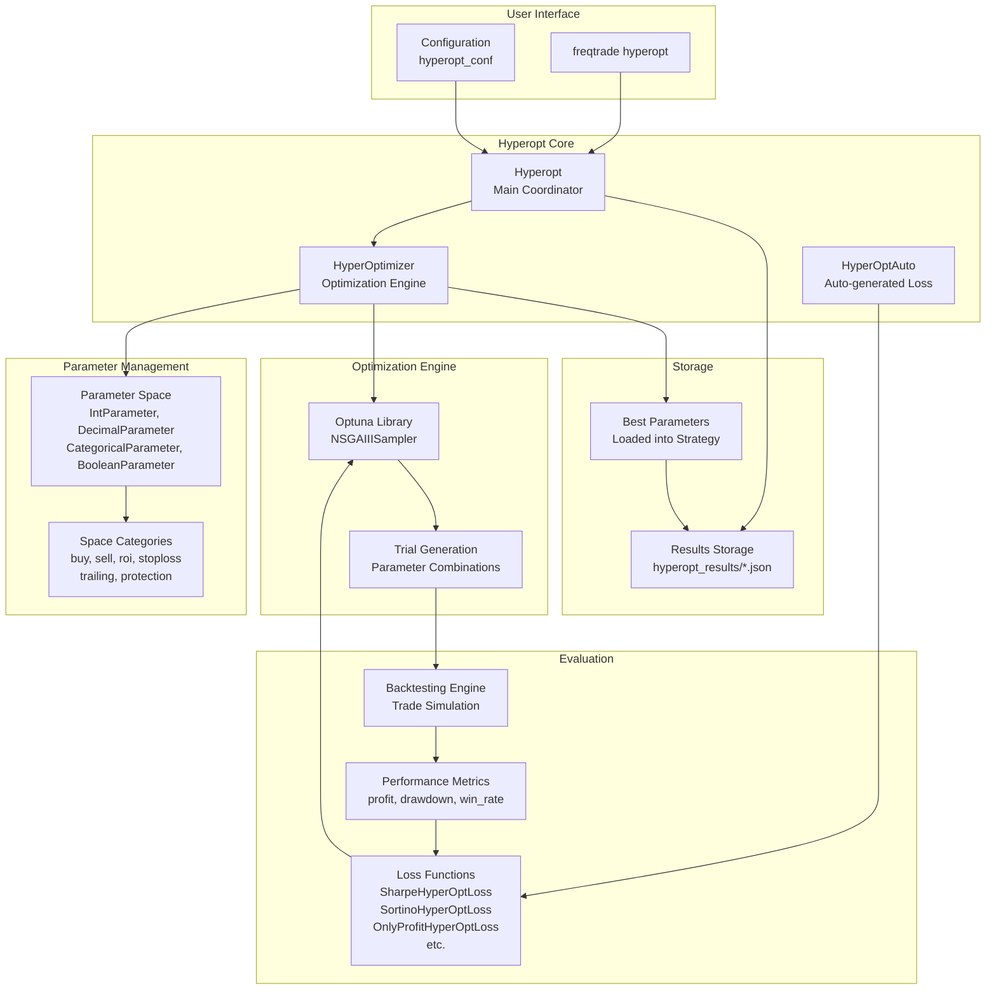
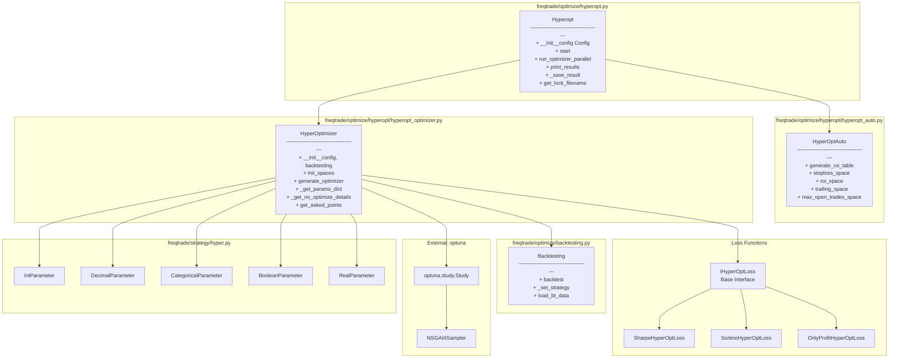
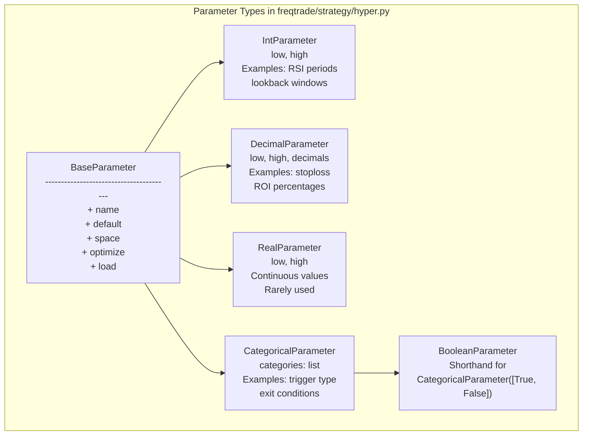
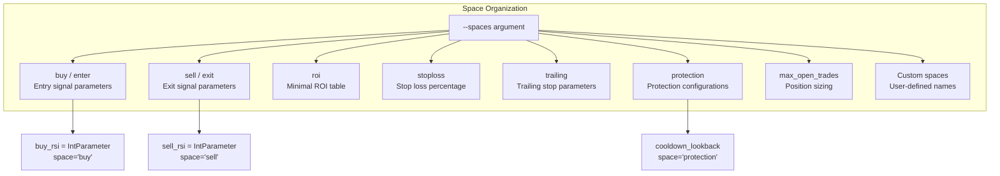
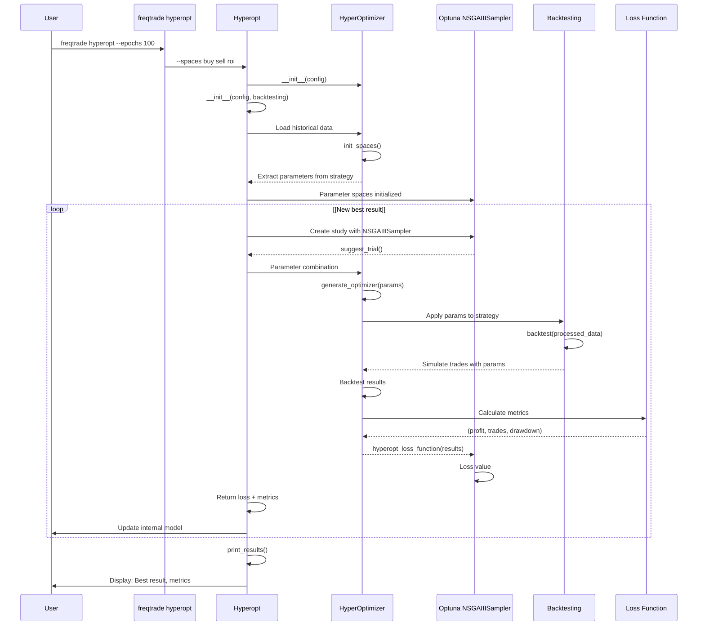
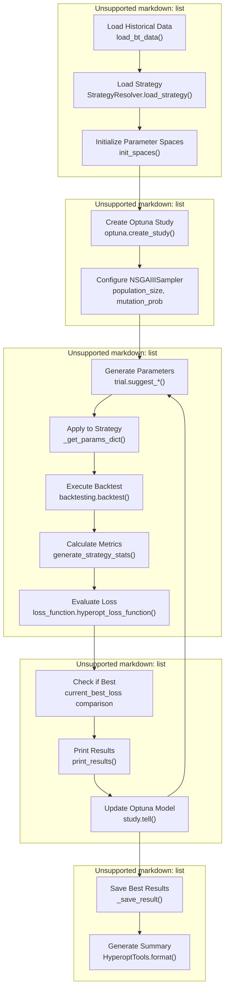
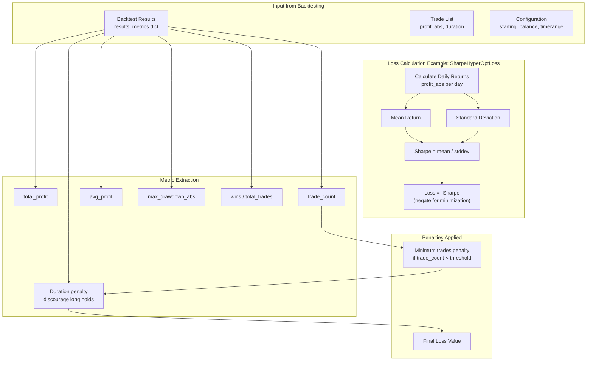
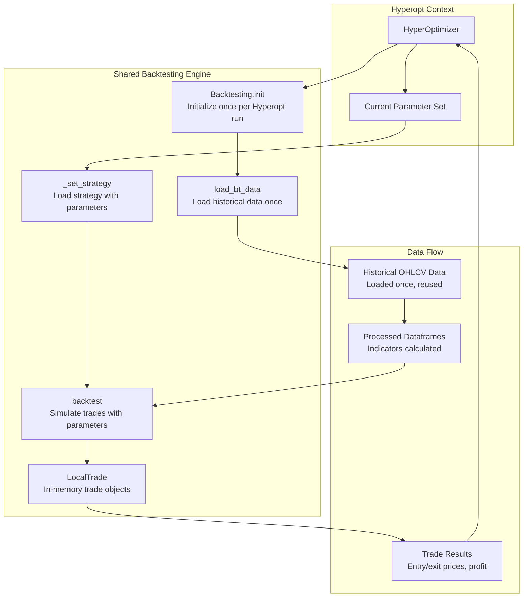
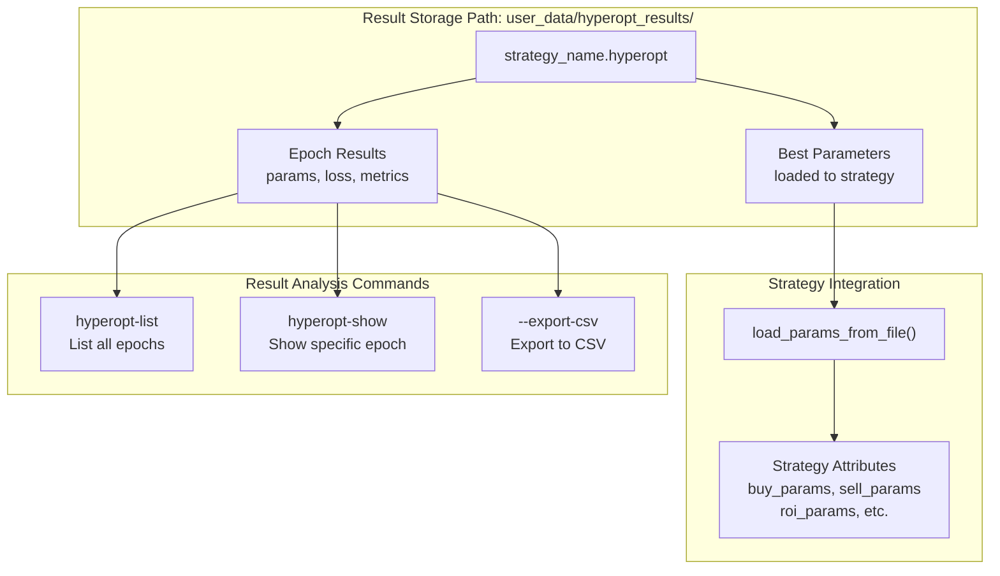

# Hyperparameter Optimization

Relevant source files

* [docs/utils.md](https://github.com/freqtrade/freqtrade/blob/8e91fea1/docs/utils.md)
* [freqtrade/commands/\_\_init\_\_.py](https://github.com/freqtrade/freqtrade/blob/8e91fea1/freqtrade/commands/__init__.py)
* [freqtrade/commands/arguments.py](https://github.com/freqtrade/freqtrade/blob/8e91fea1/freqtrade/commands/arguments.py)
* [freqtrade/commands/cli\_options.py](https://github.com/freqtrade/freqtrade/blob/8e91fea1/freqtrade/commands/cli_options.py)
* [freqtrade/commands/data\_commands.py](https://github.com/freqtrade/freqtrade/blob/8e91fea1/freqtrade/commands/data_commands.py)
* [freqtrade/commands/deploy\_commands.py](https://github.com/freqtrade/freqtrade/blob/8e91fea1/freqtrade/commands/deploy_commands.py)
* [freqtrade/commands/hyperopt\_commands.py](https://github.com/freqtrade/freqtrade/blob/8e91fea1/freqtrade/commands/hyperopt_commands.py)
* [freqtrade/commands/list\_commands.py](https://github.com/freqtrade/freqtrade/blob/8e91fea1/freqtrade/commands/list_commands.py)
* [freqtrade/configuration/configuration.py](https://github.com/freqtrade/freqtrade/blob/8e91fea1/freqtrade/configuration/configuration.py)
* [freqtrade/loggers/rich\_console.py](https://github.com/freqtrade/freqtrade/blob/8e91fea1/freqtrade/loggers/rich_console.py)
* [freqtrade/optimize/backtesting.py](https://github.com/freqtrade/freqtrade/blob/8e91fea1/freqtrade/optimize/backtesting.py)
* [freqtrade/optimize/hyperopt\_tools.py](https://github.com/freqtrade/freqtrade/blob/8e91fea1/freqtrade/optimize/hyperopt_tools.py)
* [freqtrade/util/progress\_tracker.py](https://github.com/freqtrade/freqtrade/blob/8e91fea1/freqtrade/util/progress_tracker.py)
* [freqtrade/util/rich\_tables.py](https://github.com/freqtrade/freqtrade/blob/8e91fea1/freqtrade/util/rich_tables.py)
* [tests/commands/test\_commands.py](https://github.com/freqtrade/freqtrade/blob/8e91fea1/tests/commands/test_commands.py)
* [tests/optimize/\_\_init\_\_.py](https://github.com/freqtrade/freqtrade/blob/8e91fea1/tests/optimize/__init__.py)
* [tests/optimize/test\_backtest\_detail.py](https://github.com/freqtrade/freqtrade/blob/8e91fea1/tests/optimize/test_backtest_detail.py)
* [tests/optimize/test\_backtesting.py](https://github.com/freqtrade/freqtrade/blob/8e91fea1/tests/optimize/test_backtesting.py)
* [tests/optimize/test\_hyperopt.py](https://github.com/freqtrade/freqtrade/blob/8e91fea1/tests/optimize/test_hyperopt.py)
* [tests/optimize/test\_hyperopt\_tools.py](https://github.com/freqtrade/freqtrade/blob/8e91fea1/tests/optimize/test_hyperopt_tools.py)
* [tests/optimize/test\_optimize\_reports.py](https://github.com/freqtrade/freqtrade/blob/8e91fea1/tests/optimize/test_optimize_reports.py)

## Purpose and Scope

This document describes the Hyperparameter Optimization (Hyperopt) system in Freqtrade, which enables automated discovery of optimal strategy parameters through intelligent search algorithms. Hyperopt runs the backtesting engine repeatedly with different parameter combinations, using machine learning techniques from the Optuna library to efficiently explore the parameter space and maximize a configurable objective function.

For information about running backtests without optimization, see [Backtesting System](/freqtrade/freqtrade/3.1-backtesting-system). For machine learning-based strategy features, see [FreqAI Machine Learning System](/freqtrade/freqtrade/5.1-freqai-machine-learning-system).

---

## System Overview

The Hyperopt system wraps the Backtesting engine in an optimization loop that systematically searches for optimal strategy parameters. Unlike manual parameter tuning, Hyperopt uses intelligent sampling algorithms (primarily Optuna's NSGAIIISampler) to converge on high-performing parameter combinations efficiently.



**Sources:** [freqtrade/optimize/backtesting.py111-218](https://github.com/freqtrade/freqtrade/blob/8e91fea1/freqtrade/optimize/backtesting.py#L111-L218) [tests/optimize/test\_hyperopt.py359-414](https://github.com/freqtrade/freqtrade/blob/8e91fea1/tests/optimize/test_hyperopt.py#L359-L414) [docs/hyperopt.md1-75](https://github.com/freqtrade/freqtrade/blob/8e91fea1/docs/hyperopt.md#L1-L75)

---

## Architecture Components

### Main Classes and Their Responsibilities



| Class | File | Primary Responsibility |
| --- | --- | --- |
| `Hyperopt` | `freqtrade/optimize/hyperopt.py` | Main coordinator; manages optimization lifecycle, parallel execution, result storage |
| `HyperOptimizer` | `freqtrade/optimize/hyperopt/hyperopt_optimizer.py` | Core optimization logic; interfaces with Optuna, manages parameter spaces |
| `HyperOptAuto` | `freqtrade/optimize/hyperopt/hyperopt_auto.py` | Auto-generates standard parameter spaces (ROI, stoploss, trailing) |
| `IHyperOptLoss` | `freqtrade/optimize/hyperopt_loss/*.py` | Base class for loss functions; evaluates backtest performance |
| Parameter Classes | `freqtrade/strategy/hyper.py` | Define searchable parameter ranges in strategies |

**Sources:** [freqtrade/optimize/backtesting.py111-218](https://github.com/freqtrade/freqtrade/blob/8e91fea1/freqtrade/optimize/backtesting.py#L111-L218) [tests/optimize/test\_hyperopt.py1-32](https://github.com/freqtrade/freqtrade/blob/8e91fea1/tests/optimize/test_hyperopt.py#L1-L32) [docs/hyperopt.md215-237](https://github.com/freqtrade/freqtrade/blob/8e91fea1/docs/hyperopt.md#L215-L237)

---

## Parameter Types and Spaces

### Parameter Type Definitions

Freqtrade provides five parameter types for defining search spaces within strategies:



**Parameter Configuration Example:**

| Parameter | Type | Configuration | Purpose |
| --- | --- | --- | --- |
| `buy_rsi` | `IntParameter` | `IntParameter(20, 40, default=30, space="buy")` | RSI threshold for entry signals |
| `buy_adx` | `DecimalParameter` | `DecimalParameter(20, 40, decimals=1, default=30.1, space="buy")` | ADX threshold with decimal precision |
| `buy_trigger` | `CategoricalParameter` | `CategoricalParameter(["bb_lower", "macd_cross"], default="bb_lower")` | Choice between entry triggers |
| `buy_adx_enabled` | `BooleanParameter` | `BooleanParameter(default=True, space="buy")` | Enable/disable ADX guard |
| `stop_duration` | `IntParameter` | `IntParameter(12, 200, default=5, space="protection")` | Protection duration in candles |

**Sources:** [docs/hyperopt.md215-237](https://github.com/freqtrade/freqtrade/blob/8e91fea1/docs/hyperopt.md#L215-L237) [docs/hyperopt.md149-176](https://github.com/freqtrade/freqtrade/blob/8e91fea1/docs/hyperopt.md#L149-L176) [tests/optimize/test\_hyperopt.py345-357](https://github.com/freqtrade/freqtrade/blob/8e91fea1/tests/optimize/test_hyperopt.py#L345-L357)

### Space Categories

Parameters are organized into logical spaces that can be optimized independently or together:



**Space Assignment Rules:**

* Parameters prefixed with `buy_*`, `sell_*`, `enter_*`, `exit_*`, or `protection_*` are auto-assigned to respective spaces
* Explicit space assignment via `space='...'` parameter overrides auto-detection
* Parameters without space assignment are ignored during optimization
* Custom space names enable fine-grained control over parameter grouping

**Sources:** [docs/hyperopt.md169-174](https://github.com/freqtrade/freqtrade/blob/8e91fea1/docs/hyperopt.md#L169-L174) [docs/hyperopt.md42-67](https://github.com/freqtrade/freqtrade/blob/8e91fea1/docs/hyperopt.md#L42-L67) [tests/optimize/test\_hyperopt.py501-638](https://github.com/freqtrade/freqtrade/blob/8e91fea1/tests/optimize/test_hyperopt.py#L501-L638)

---

## Optimization Workflow

### Complete Optimization Loop



**Sources:** [tests/optimize/test\_hyperopt.py359-414](https://github.com/freqtrade/freqtrade/blob/8e91fea1/tests/optimize/test_hyperopt.py#L359-L414) [docs/hyperopt.md76-86](https://github.com/freqtrade/freqtrade/blob/8e91fea1/docs/hyperopt.md#L76-L86) [freqtrade/optimize/backtesting.py111-218](https://github.com/freqtrade/freqtrade/blob/8e91fea1/freqtrade/optimize/backtesting.py#L111-L218)

### Execution Flow Detail

The optimization process follows these stages:



**Epoch Processing Details:**

1. **Parameter Suggestion** - Optuna's NSGAIIISampler proposes parameter values based on previous trials
2. **Strategy Configuration** - Parameters are injected into strategy instance via `_get_params_dict()`
3. **Backtesting** - Full backtest runs with current parameter set, producing trade list
4. **Metric Calculation** - `generate_strategy_stats()` computes profit, drawdown, win rate, etc.
5. **Loss Evaluation** - Loss function converts metrics to single scalar (lower is better)
6. **Model Update** - Optuna updates its internal model to guide next parameter suggestion

**Sources:** [tests/optimize/test\_hyperopt.py501-638](https://github.com/freqtrade/freqtrade/blob/8e91fea1/tests/optimize/test_hyperopt.py#L501-L638) [docs/hyperopt.md76-86](https://github.com/freqtrade/freqtrade/blob/8e91fea1/docs/hyperopt.md#L76-L86) [freqtrade/optimize/backtesting.py462-517](https://github.com/freqtrade/freqtrade/blob/8e91fea1/freqtrade/optimize/backtesting.py#L462-L517)

---

## Loss Functions

Loss functions convert backtest results into a single scalar value that Optuna minimizes. Lower loss values indicate better performance.

### Available Loss Functions

| Loss Function | File Pattern | Optimization Objective | Use Case |
| --- | --- | --- | --- |
| `SharpeHyperOptLoss` | `hyperopt_loss/sharpe_hyperopt_loss.py` | Maximize Sharpe ratio | Risk-adjusted returns, stable strategies |
| `SharpeHyperOptLossDaily` | `hyperopt_loss/sharpe_hyperopt_loss.py` | Daily Sharpe ratio | Daily performance optimization |
| `SortinoHyperOptLoss` | `hyperopt_loss/sortino_hyperopt_loss.py` | Maximize Sortino ratio | Downside risk focus |
| `SortinoHyperOptLossDaily` | `hyperopt_loss/sortino_hyperopt_loss.py` | Daily Sortino ratio | Daily downside risk |
| `OnlyProfitHyperOptLoss` | `hyperopt_loss/onlyprofit_hyperopt_loss.py` | Maximize total profit | Pure profit focus |
| `MaxDrawDownHyperOptLoss` | `hyperopt_loss/max_drawdown_hyperopt_loss.py` | Minimize max drawdown | Capital preservation |
| `MaxDrawDownRelativeHyperOptLoss` | `hyperopt_loss/max_drawdown_hyperopt_loss.py` | Minimize relative drawdown | Drawdown relative to profit |
| `CalmarHyperOptLoss` | `hyperopt_loss/calmar_hyperopt_loss.py` | Maximize Calmar ratio | Return vs drawdown |
| `ProfitDrawDownHyperOptLoss` | `hyperopt_loss/profit_draw_down_hyperopt_loss.py` | Balance profit & drawdown | Balanced optimization |

### Loss Function Calculation



**Penalty Mechanisms:**

* **Minimum Trade Count**: If `trade_count < hyperopt_min_trades`, adds penalty to discourage parameter sets that produce too few trades
* **Duration Penalty**: Some loss functions penalize excessively long average trade duration
* **Draw-down Limits**: Excessive drawdown can trigger additional penalties

**Sources:** [tests/optimize/test\_hyperopt.py416-488](https://github.com/freqtrade/freqtrade/blob/8e91fea1/tests/optimize/test_hyperopt.py#L416-L488) [docs/hyperopt.md426-585](https://github.com/freqtrade/freqtrade/blob/8e91fea1/docs/hyperopt.md#L426-L585) [tests/optimize/test\_optimize\_reports.py101-259](https://github.com/freqtrade/freqtrade/blob/8e91fea1/tests/optimize/test_optimize_reports.py#L101-L259)

---

## Integration with Backtesting

### Backtesting Engine Reuse

Hyperopt does not reimplement trade simulation logic. Instead, it leverages the existing `Backtesting` class:



**Key Optimizations:**

1. **Single Data Load** - Historical data loaded once before epoch loop begins
2. **Indicator Caching** - By default, `populate_indicators()` runs once; indicators reused across epochs
   * Exception: `--analyze-per-epoch` flag recalculates indicators each epoch (slower, more RAM-efficient)
3. **LocalTrade Usage** - In-memory `LocalTrade` objects instead of database-backed `Trade` for speed
4. **Parallel Execution** - `run_optimizer_parallel()` enables multi-process execution with `--jobs N`

**Sources:** [freqtrade/optimize/backtesting.py120-219](https://github.com/freqtrade/freqtrade/blob/8e91fea1/freqtrade/optimize/backtesting.py#L120-L219) [docs/hyperopt.md324-333](https://github.com/freqtrade/freqtrade/blob/8e91fea1/docs/hyperopt.md#L324-L333) [tests/optimize/test\_backtesting.py754-857](https://github.com/freqtrade/freqtrade/blob/8e91fea1/tests/optimize/test_backtesting.py#L754-L857)

### Indicator Calculation Strategy

Two approaches for indicator calculation during hyperopt:

**Default Mode (Fast, High RAM):**

```
```
# populate_indicators runs once
# All parameter values in range calculated upfront
for val in self.buy_ema_short.range:
    dataframe[f'ema_short_{val}'] = ta.EMA(dataframe, timeperiod=val)

# populate_entry_trend selects the active value
dataframe['enter_long'] = (
    qtpylib.crossed_above(
        dataframe[f'ema_short_{self.buy_ema_short.value}'],
        dataframe[f'ema_long_{self.buy_ema_long.value}']
    )
)
```
```

**`--analyze-per-epoch` Mode (Slower, Low RAM):**

```
```
# populate_indicators runs every epoch
# Only current parameter value calculated
dataframe['ema_short'] = ta.EMA(dataframe, timeperiod=self.buy_ema_short.value)
dataframe['ema_long'] = ta.EMA(dataframe, timeperiod=self.buy_ema_long.value)

# populate_entry_trend uses directly
dataframe['enter_long'] = (
    qtpylib.crossed_above(
        dataframe['ema_short'],
        dataframe['ema_long']
    )
)
```
```

**Sources:** [docs/hyperopt.md238-333](https://github.com/freqtrade/freqtrade/blob/8e91fea1/docs/hyperopt.md#L238-L333) [docs/hyperopt.md324-333](https://github.com/freqtrade/freqtrade/blob/8e91fea1/docs/hyperopt.md#L324-L333)

---

## Configuration and Execution

### Configuration Parameters

Key configuration options in `config.json`:

| Parameter | Type | Default | Description |
| --- | --- | --- | --- |
| `hyperopt_loss` | string | Required | Loss function class name |
| `epochs` | integer | Required | Number of optimization iterations |
| `spaces` | list[string] | `["default"]` | Parameter spaces to optimize |
| `hyperopt_jobs` | integer | CPU count | Parallel job count |
| `hyperopt_min_trades` | integer | 10 | Minimum trades for valid result |
| `hyperopt_random_state` | integer | None | Random seed for reproducibility |
| `hyperopt_show_index` | integer | -1 | Result index to display details |
| `print_colorized` | boolean | True | Colorized output |
| `print_json` | boolean | False | JSON output format |

### Command-Line Execution

```
```
# Basic hyperopt execution
freqtrade hyperopt \
    --strategy MyStrategy \
    --hyperopt-loss SharpeHyperOptLossDaily \
    --spaces buy sell roi stoploss \
    --epochs 100

# Parallel execution with 4 processes
freqtrade hyperopt \
    --strategy MyStrategy \
    --hyperopt-loss SharpeHyperOptLossDaily \
    --spaces buy sell \
    --epochs 500 \
    --jobs 4

# Memory-efficient mode
freqtrade hyperopt \
    --strategy MyStrategy \
    --hyperopt-loss SharpeHyperOptLossDaily \
    --spaces buy \
    --epochs 100 \
    --analyze-per-epoch

# Specific timerange
freqtrade hyperopt \
    --strategy MyStrategy \
    --hyperopt-loss SharpeHyperOptLossDaily \
    --spaces default \
    --epochs 300 \
    --timerange 20210101-20210601
```
```

**Sources:** [docs/hyperopt.md37-75](https://github.com/freqtrade/freqtrade/blob/8e91fea1/docs/hyperopt.md#L37-L75) [tests/optimize/test\_hyperopt.py58-139](https://github.com/freqtrade/freqtrade/blob/8e91fea1/tests/optimize/test_hyperopt.py#L58-L139)

### Result Storage and Retrieval



**Result File Structure:**

* Location: `user_data/hyperopt_results/{strategy_name}.hyperopt`
* Format: JSON with one object per epoch
* Contents: Parameters, loss value, metrics (profit, trades, drawdown)
* Best result automatically loaded into strategy when `load=True` on parameters

**Retrieval Commands:**

```
```
# List all hyperopt results for a strategy
freqtrade hyperopt-list --strategy MyStrategy

# Show details of best result
freqtrade hyperopt-show --strategy MyStrategy

# Show specific epoch (e.g., epoch 42)
freqtrade hyperopt-show --strategy MyStrategy --hyperopt-index 42

# Export results to CSV
freqtrade hyperopt-list --strategy MyStrategy --export-csv results.csv
```
```

**Sources:** [docs/hyperopt.md586-718](https://github.com/freqtrade/freqtrade/blob/8e91fea1/docs/hyperopt.md#L586-L718) [tests/optimize/test\_optimize\_reports.py1-60](https://github.com/freqtrade/freqtrade/blob/8e91fea1/tests/optimize/test_optimize_reports.py#L1-L60)

---

## Advanced Features

### Protection Optimization

Strategies can define optimizable protection configurations:

```
```
class MyStrategy(IStrategy):
    cooldown_lookback = IntParameter(2, 48, default=5, space="protection")
    stop_duration = IntParameter(12, 200, default=5, space="protection")
    use_stop_protection = BooleanParameter(default=True, space="protection")

    @property
    def protections(self):
        prot = []
        prot.append({
            "method": "CooldownPeriod",
            "stop_duration_candles": self.cooldown_lookback.value
        })
        if self.use_stop_protection.value:
            prot.append({
                "method": "StoplossGuard",
                "lookback_period_candles": 24 * 3,
                "trade_limit": 4,
                "stop_duration_candles": self.stop_duration.value,
                "only_per_pair": False
            })
        return prot
```
```

**Note:** Protection space is not part of `--spaces default` and must be explicitly specified.

**Sources:** [docs/hyperopt.md334-393](https://github.com/freqtrade/freqtrade/blob/8e91fea1/docs/hyperopt.md#L334-L393)

### Max Entry Position Adjustment

Optimize position sizing adjustments:

```
```
max_entry_position_adjustment = IntParameter(-1, 10, default=1, space="buy")
```
```

Values:

* `-1`: Unlimited adjustments
* `0`: No adjustments
* `N > 0`: Up to N adjustments per trade

**Sources:** [docs/hyperopt.md426-445](https://github.com/freqtrade/freqtrade/blob/8e91fea1/docs/hyperopt.md#L426-L445)

### Custom Space Names

Define custom space names for fine-grained optimization control:

```
```
# Group related parameters in custom space
momentum_rsi = IntParameter(10, 40, default=30, space="momentum")
momentum_adx = DecimalParameter(20, 40, default=30.0, space="momentum")
volatility_bb_dev = DecimalParameter(1.5, 3.0, default=2.0, space="volatility")
```
```

Then optimize specific groups:

```
```
freqtrade hyperopt --spaces momentum --epochs 100
freqtrade hyperopt --spaces volatility --epochs 100
freqtrade hyperopt --spaces momentum volatility --epochs 200
```
```

**Sources:** [docs/hyperopt.md169-174](https://github.com/freqtrade/freqtrade/blob/8e91fea1/docs/hyperopt.md#L169-L174)

---

## Performance Considerations

### Optimization Speed

Factors affecting hyperopt performance:

| Factor | Impact | Mitigation |
| --- | --- | --- |
| Data volume | Linear with candle count | Use `--timerange` to limit data |
| Number of pairs | Linear with pair count | Reduce whitelist during optimization |
| Strategy complexity | Linear with indicator count | Pre-calculate expensive indicators |
| Indicator calculation | High if using `.range` | Use `--analyze-per-epoch` or move to entry/exit |
| Parallel jobs | Inverse with `--jobs N` | Set to CPU core count |
| Epoch count | Linear with `--epochs` | Start with fewer epochs, increase if needed |

### Memory Management

**High RAM Usage Scenarios:**

* Using `.range` property on parameters to pre-calculate all indicator values
* Large parameter spaces (e.g., `IntParameter(1, 1000)`)
* Many pairs with long history

**Memory Reduction Strategies:**

1. Use `--analyze-per-epoch` flag to calculate indicators per epoch instead of upfront
2. Reduce parameter ranges to minimum viable values
3. Reduce pair count during optimization
4. Reduce `--jobs` count if hitting OOM errors
5. Use smaller `--timerange` windows

**Sources:** [docs/hyperopt.md324-333](https://github.com/freqtrade/freqtrade/blob/8e91fea1/docs/hyperopt.md#L324-L333)

### Filelock and Concurrent Execution

Hyperopt uses filelock to prevent multiple simultaneous runs on the same strategy:

```
```
lock_filename = Hyperopt.get_lock_filename(config)
# File: user_data/hyperopt_results/{strategy_name}.hyperopt.lock
```
```

If a lock file exists, hyperopt will not start. Remove stale locks manually if needed:

```
```
rm user_data/hyperopt_results/MyStrategy.hyperopt.lock
```
```

**Sources:** [tests/optimize/test\_hyperopt.py271-291](https://github.com/freqtrade/freqtrade/blob/8e91fea1/tests/optimize/test_hyperopt.py#L271-L291)

---

## Best Practices

### Optimization Strategy

1. **Start Small** - Begin with one space (e.g., `--spaces buy`) and 50-100 epochs
2. **Incremental Optimization** - Optimize spaces separately before combining
3. **Validate Results** - Always backtest optimal parameters on different timerange
4. **Avoid Overfitting** - Higher epochs and more parameters increase overfitting risk
5. **Use Appropriate Loss** - Match loss function to trading goal (profit vs. risk-adjusted)

### Parameter Design

1. **Reasonable Ranges** - Don't use excessively wide ranges (e.g., RSI 1-100 → use 20-80)
2. **Logical Grouping** - Use custom spaces to group related parameters
3. **Minimal Parameters** - Fewer parameters reduce overfitting risk
4. **Conservative Defaults** - Set `default=` to conservative values that work without optimization

### Validation

```
```
# Step 1: Optimize on training period
freqtrade hyperopt \
    --strategy MyStrategy \
    --timerange 20210101-20210601 \
    --epochs 100

# Step 2: Backtest on test period (different dates)
freqtrade backtesting \
    --strategy MyStrategy \
    --timerange 20210601-20210901

# Step 3: Compare results - similar performance indicates robustness
```
```

**Sources:** [docs/hyperopt.md719-927](https://github.com/freqtrade/freqtrade/blob/8e91fea1/docs/hyperopt.md#L719-L927) [docs/backtesting.md1-50](https://github.com/freqtrade/freqtrade/blob/8e91fea1/docs/backtesting.md#L1-L50)