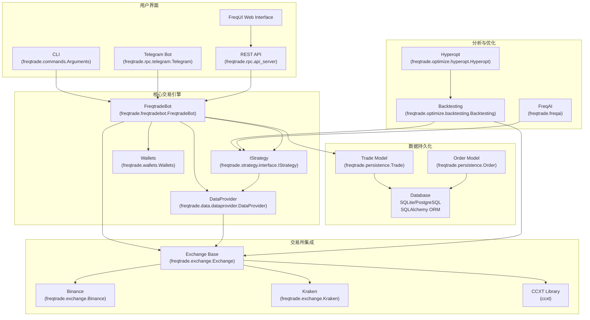
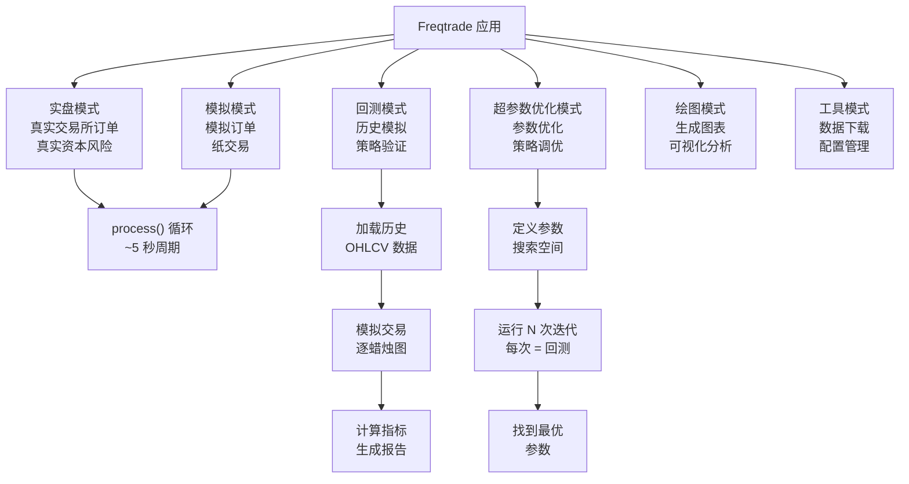

# Freqtrade 源码分析

Freqtrade 是一个用 Python 编写的开源加密货币量化交易机器人，支持回测、实盘交易和策略优化。

## 📖 项目概览

- **项目地址**: https://github.com/freqtrade/freqtrade
- **主要语言**: Python
- **核心功能**: 策略回测、实盘交易、超参数优化、机器学习集成
- **技术栈**: Python, pandas, ccxt, SQLAlchemy, FastAPI

## 🎯 Freqtrade 是什么？

Freqtrade 是一个加密货币算法交易机器人，支持：

* **自动化交易** 在 20+ 个加密货币交易所（现货和期货市场）
* **策略回测** 基于历史市场数据
* **超参数优化** 调整策略参数
* **机器学习集成** 通过 FreqAI 进行预测建模
* **多种控制接口** 包括 CLI、Telegram、REST API 和 Web UI

该机器人通过持续分析市场数据、生成入场/出场信号并在连接的交易所下单来执行用户定义的交易策略。它支持多头和空头头寸、杠杆交易以及仓位调整和自定义出场逻辑等高级功能。

## 🚀 核心能力

| 能力 | 描述 |
| --- | --- |
| **实盘交易** | 在连接的交易所上实时执行策略，完整的订单管理 |
| **模拟交易** | 模拟订单执行的纸交易模式，无需风险资本 |
| **回测** | 在历史数据上测试策略，准确模拟订单成交和费用 |
| **超参数优化** | 使用 Optuna 自动调整参数以找到最优策略配置 |
| **FreqAI** | 机器学习集成，用于基于预测的交易策略 |
| **多交易所** | 通过 CCXT 库支持 20+ 个交易所，包括 Binance、Kraken、Bybit 等 |
| **现货与期货** | 交易现货市场和杠杆期货/保证金头寸 |
| **仓位管理** | DCA（美元成本平均法）、部分出场、追踪止损、自定义出场逻辑 |

## 🏗️ 系统架构

### 高层组件图

### 核心组件

#### FreqtradeBot（主协调器）

`FreqtradeBot` 类是协调所有子系统的中央协调器。它实现了主交易循环（`process()` 方法），在实盘/模拟模式下大约每 5 秒运行一次。

**主要职责：**

* 初始化和协调所有子系统（交易所、策略、持久化、RPC）
* 执行主处理循环：刷新数据 → 分析信号 → 管理仓位 → 执行订单
* 处理从入场到出场的交易生命周期
* 管理未完成订单、超时和取消
* 更新期货交易的资金费用和清算价格

#### IStrategy（用户交易逻辑）

`IStrategy` 抽象类定义了用户定义交易策略的接口。用户实现三个必需方法：

* `populate_indicators()`: 计算技术指标
* `populate_entry_trend()`: 生成入场信号
* `populate_exit_trend()`: 生成出场信号

以及许多用于高级控制的可选回调：

* `custom_stoploss()`, `custom_roi()`, `custom_exit()`
* `confirm_trade_entry()`, `confirm_trade_exit()`
* `adjust_trade_position()` 用于仓位调整/DCA

#### 交易所层

`Exchange` 基类通过 CCXT 库提供与加密货币交易所的统一接口。交易所特定的子类如 `Binance` 和 `Kraken` 实现交易所特定的行为。

**能力：**

* 市场数据获取（OHLCV 蜡烛图、行情、订单簿）
* 订单执行（市价单、限价单、止损单）
* 余额管理和仓位跟踪
* WebSocket 支持实时数据（部分交易所）

#### DataProvider

`DataProvider` 类集中访问市场数据，并以一致的格式提供给策略。它实现缓存并处理数据刷新周期。

#### 持久化层

持久化层使用 SQLAlchemy ORM，有两个主要模型：

* `Trade` - 表示开放或关闭的仓位
* `Order` - 表示交易中的单个订单

支持 SQLite（默认）和 PostgreSQL 用于生产部署。

## ⚙️ 操作模式

### 模式概览

### 实盘和模拟模式

两种模式使用相同的 `FreqtradeBot` 类并共享相同的代码路径。唯一的区别是模拟模式在本地模拟订单执行，而不是将订单发送到交易所。

**处理循环：**

1. 如果需要，重新加载市场
2. 从交易所刷新 OHLCV 数据
3. 运行 `strategy.analyze()` 填充指标和信号
4. 管理未完成订单（超时、替换）
5. 评估开放交易的出场条件
6. 如果 `position_adjustment_enable=True`，调整仓位
7. 如果检测到信号，进入新仓位
8. 处理 RPC 消息队列以获取通知

### 回测模式

`Backtesting` 类在历史数据上模拟交易。关键特性：

* 从本地存储或交易所加载历史 OHLCV 数据
* 使用 `LocalTrade` 而不是 `Trade` 以避免数据库操作
* 基于蜡烛图数据（高/低价格）模拟订单成交
* 根据交易所费用结构计算实际费用
* 生成详细的性能指标和图表

**关键区别：** 在回测中，整个数据框一次性传递给 `populate_*()` 方法，而在实盘交易中，只有最新的蜡烛图被增量分析。这需要仔细的策略设计以避免前视偏差。

### 超参数优化模式

`Hyperopt` 类包装回测引擎并使用 Optuna 库来找到最优策略参数。它：

* 通过 `HyperStrategyMixin` 定义参数空间（买入/卖出/ROI/止损）
* 使用不同的参数组合运行数千次回测迭代
* 使用损失函数（夏普比率、索提诺比率等）评估每次迭代
* 报告最佳性能参数集

## 🛠️ 技术栈

### 核心依赖

Freqtrade 使用模块化依赖方法：

* **核心需求**: 基本交易操作的最小依赖
* **超参数优化需求**: 优化的额外依赖（scipy, optuna, scikit-learn）
* **FreqAI 需求**: 预测建模的 ML 库（LightGBM, XGBoost, TensorBoard）
* **绘图需求**: 可视化库（单独文件）
* **开发需求**: 测试和代码质量工具（单独文件）

这允许用户仅安装他们需要的内容，减少安装占用空间。

## 📊 数据流

### 实盘交易数据流

策略执行遵循严格的顺序以确保一致性：

1. **数据刷新**: `DataProvider.refresh()` 从交易所获取最新的 OHLCV 数据
2. **指标计算**: `Strategy.populate_indicators()` 向数据框添加技术指标
3. **信号生成**: `populate_entry_trend()` 和 `populate_exit_trend()` 生成交易信号
4. **出场评估**: 对于每个开放交易，评估出场条件（止损、ROI、自定义出场）
5. **入场评估**: 对于有入场信号的交易对，检查确认并执行入场
6. **订单管理**: 更新订单状态，处理超时，管理交易所上的止损

**关键原则**: 所有操作在单个迭代中使用相同的 OHLCV 数据快照以确保一致性。下一次迭代获取新数据。

## ⚙️ 配置系统

Freqtrade 使用具有多个覆盖级别的分层配置系统：

1. **配置文件** (`config.json`) - 基础配置
2. **环境变量** - 覆盖配置文件值
3. **CLI 参数** - 覆盖配置和环境

配置优先级：**CLI > 环境 > 配置文件**

配置结构包括：

* 交易所设置（API 密钥、交易所名称、交易模式）
* 策略设置（时间框架、持仓金额、最大开放交易数）
* 入场/出场定价规则
* 订单类型和时间有效性设置
* RPC 设置（Telegram、API 服务器）
* 回测/超参数优化参数

## 📄 分析文档

### 架构设计
- [[architecture-overview.md|架构概览]] - 整体架构分析
- [[dependencies-and-requirements.md|依赖与需求]] - 模块划分与职责

### 核心模块
- [[freqtradebot-core.md|FreqtradeBot 核心]] - 策略引擎分析
- [[backtesting-engine.md|回测系统]] - 回测系统实现
- [[exchange-integration.md|交易所集成]] - 交易所接口封装
- [[persistence-layer.md|持久化层]] - 风险管理模块

### 策略开发
- [[strategy-interface-and-development.md|策略接口与开发]] - 策略框架设计
- [[strategy-callbacks-and-customization.md|策略回调与定制]] - 高级策略功能
- [[position-adjustment-and-dca.md|仓位调整与 DCA]] - 仓位管理机制

### 测试与优化
- [[testing-and-optimization.md|测试与优化]] - 测试基础设施
- [[hyperparameter-optimization.md|超参数优化]] - 参数优化系统

### 用户界面与控制
- [[command-line-interface.md|命令行界面]] - CLI 系统
- [[telegram-bot-interface.md|Telegram 机器人界面]] - 远程控制
- [[rest-api-and-web-socket.md|REST API 与 WebSocket]] - API 接口

### 高级功能
- [[freq-ai-machine-learning-system.md|FreqAI 机器学习系统]] - ML 集成
- [[futures-and-margin-trading.md|期货与保证金交易]] - 杠杆交易
- [[advanced-features.md|高级功能]] - 其他高级特性

### 开发与部署
- [[development-and-deployment.md|开发与部署]] - 开发环境
- [[development-environment-setup.md|开发环境设置]] - 环境配置
- [[cicd-pipeline-and-docker.md|CI/CD 流水线与 Docker]] - 部署流程

## 🔗 相关资源

- [[../../finance-quant/index.md|量化交易知识]] - 量化交易相关理论
- [[../../ai-ml/index.md|AI & Machine Learning]] - 机器学习应用

## 📌 学习重点

1. **策略框架设计**：如何设计灵活可扩展的策略系统
2. **回测引擎实现**：高效准确的回测系统架构
3. **风险控制**：实盘交易中的风险管理机制
4. **性能优化**：大数据量下的性能优化技巧

## 🚀 快速开始

要开始使用 Freqtrade：

1. **安装**: 参见 [[installation-and-setup.md|安装与设置]] 获取详细安装说明
2. **配置**: 创建配置文件 - 参见 [[configuration-system.md|配置系统]]
3. **策略开发**: 编写策略 - 参见 [[strategy-interface-and-development.md|策略接口与开发]]
4. **回测**: 在历史数据上测试策略 - 参见 [[backtesting-engine.md|回测系统]]
5. **模拟交易**: 运行纸交易以验证 - 参见操作模式部分
6. **实盘交易**: 有信心时部署到实盘交易

有关每个步骤的详细信息，请参阅本 Wiki 的相应部分。

---

*创建: 2026-01-02 | 更新: 2026-01-02*

[architecture-overview.md|架构概览]: architecture-overview.md "Architecture Overview"
[dependencies-and-requirements.md|依赖与需求]: dependencies-and-requirements.md "Dependencies and Requirements"
[backtesting-engine.md|回测系统]: backtesting-engine.md "Backtesting Engine"
[exchange-integration.md|交易所集成]: exchange-integration.md "Exchange Integration"
[persistence-layer.md|持久化层]: persistence-layer.md "Persistence Layer"
[strategy-interface-and-development.md|策略接口与开发]: strategy-interface-and-development.md "Strategy Interface and Development"
[strategy-callbacks-and-customization.md|策略回调与定制]: strategy-callbacks-and-customization.md "Strategy Callbacks and Customization"
[position-adjustment-and-dca.md|仓位调整与 DCA]: position-adjustment-and-dca.md "Position Adjustment and DCA"
[testing-and-optimization.md|测试与优化]: testing-and-optimization.md "Testing and Optimization"
[hyperparameter-optimization.md|超参数优化]: hyperparameter-optimization.md "Hyperparameter Optimization"
[command-line-interface.md|命令行界面]: command-line-interface.md "Command Line Interface"
[telegram-bot-interface.md|Telegram 机器人界面]: telegram-bot-interface.md "Telegram Bot Interface"
[rest-api-and-web-socket.md|REST API 与 WebSocket]: rest-api-and-web-socket.md "REST API and WebSocket"
[freq-ai-machine-learning-system.md|FreqAI 机器学习系统]: freq-ai-machine-learning-system.md "FreqAI Machine Learning System"
[futures-and-margin-trading.md|期货与保证金交易]: futures-and-margin-trading.md "Futures and Margin Trading"
[advanced-features.md|高级功能]: advanced-features.md "Advanced Features"
[development-and-deployment.md|开发与部署]: development-and-deployment.md "Development and Deployment"
[development-environment-setup.md|开发环境设置]: development-environment-setup.md "Development Environment Setup"
[cicd-pipeline-and-docker.md|CI/CD 流水线与 Docker]: cicd-pipeline-and-docker.md "CI/CD Pipeline and Docker"
[../../finance-quant/index.md|量化交易知识]: ../../finance-quant/index.md "金融量化"
[../../ai-ml/index.md|AI & Machine Learning]: ../../ai-ml/index.md "AI & Machine Learning"
[installation-and-setup.md|安装与设置]: installation-and-setup.md "Installation and Setup"
[configuration-system.md|配置系统]: configuration-system.md "Configuration System"