# Installation and Setup

Relevant source files

* [.github/workflows/ci.yml](https://github.com/freqtrade/freqtrade/blob/8e91fea1/.github/workflows/ci.yml)
* [.pre-commit-config.yaml](https://github.com/freqtrade/freqtrade/blob/8e91fea1/.pre-commit-config.yaml)
* [Dockerfile](https://github.com/freqtrade/freqtrade/blob/8e91fea1/Dockerfile)
* [docker/Dockerfile.armhf](https://github.com/freqtrade/freqtrade/blob/8e91fea1/docker/Dockerfile.armhf)
* [docs/includes/pricing.md](https://github.com/freqtrade/freqtrade/blob/8e91fea1/docs/includes/pricing.md)
* [docs/requirements-docs.txt](https://github.com/freqtrade/freqtrade/blob/8e91fea1/docs/requirements-docs.txt)
* [ft\_client/requirements.txt](https://github.com/freqtrade/freqtrade/blob/8e91fea1/ft_client/requirements.txt)
* [pyproject.toml](https://github.com/freqtrade/freqtrade/blob/8e91fea1/pyproject.toml)
* [requirements-dev.txt](https://github.com/freqtrade/freqtrade/blob/8e91fea1/requirements-dev.txt)
* [requirements-freqai.txt](https://github.com/freqtrade/freqtrade/blob/8e91fea1/requirements-freqai.txt)
* [requirements-hyperopt.txt](https://github.com/freqtrade/freqtrade/blob/8e91fea1/requirements-hyperopt.txt)
* [requirements.txt](https://github.com/freqtrade/freqtrade/blob/8e91fea1/requirements.txt)
* [setup.sh](https://github.com/freqtrade/freqtrade/blob/8e91fea1/setup.sh)
* [tests/test\_pip\_audit.py](https://github.com/freqtrade/freqtrade/blob/8e91fea1/tests/test_pip_audit.py)

## Purpose and Scope

This document covers the installation process for Freqtrade, including system requirements, dependency management, and initial setup. It explains how to install the core trading bot and optional feature modules (hyperopt, freqai, plotting). For information about configuring the bot after installation, see [Configuration System](/freqtrade/freqtrade/1.4-configuration-system). For details about the development environment and CI/CD pipeline, see [Development Environment Setup](/freqtrade/freqtrade/6.1-development-environment-setup).

---

## System Requirements

Freqtrade requires the following minimum specifications:

| Requirement | Specification |
| --- | --- |
| Python Version | 3.11, 3.12, or 3.13 |
| Operating System | Linux, macOS, Windows (with WSL recommended) |
| Architecture | 64-bit (32-bit not supported on Windows) |
| Memory | Minimum 2GB RAM (4GB+ recommended for FreqAI) |
| Disk Space | ~1GB for installation, additional space for historical data |
| C/C++ Compiler | Required for some dependencies (TA-Lib, etc.) |

**Sources:** [pyproject.toml16-27](https://github.com/freqtrade/freqtrade/blob/8e91fea1/pyproject.toml#L16-L27) [docs/windows\_installation.md34-36](https://github.com/freqtrade/freqtrade/blob/8e91fea1/docs/windows_installation.md#L34-L36)

---

## Installation Methods Overview

Three primary installation methods are available, each implemented differently in the codebase:

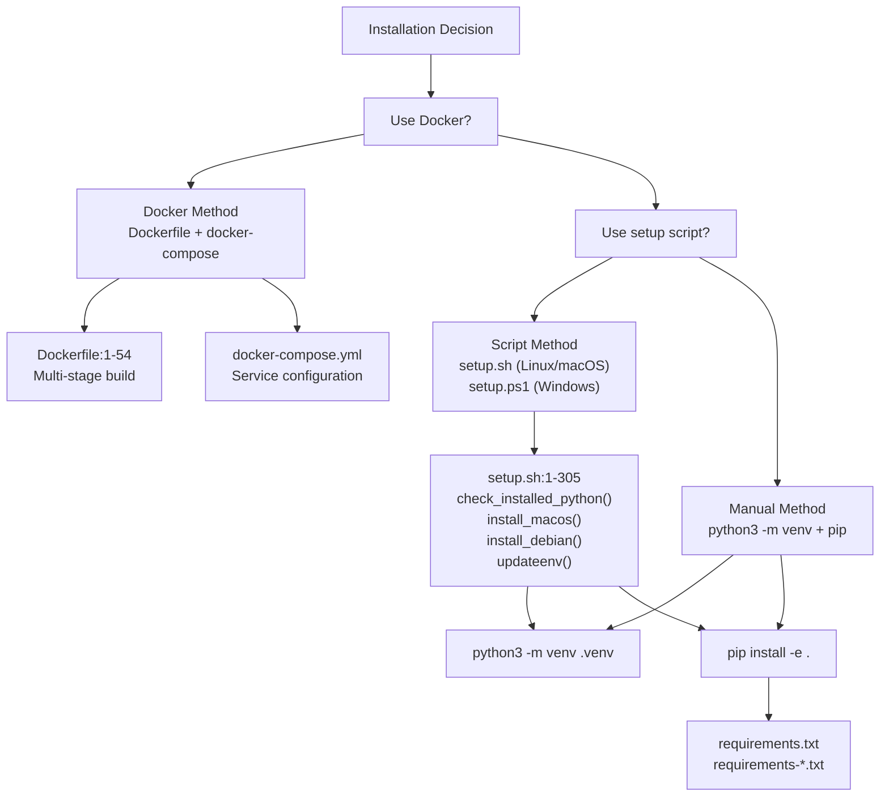

**Sources:** [setup.sh1-305](https://github.com/freqtrade/freqtrade/blob/8e91fea1/setup.sh#L1-L305) [Dockerfile1-54](https://github.com/freqtrade/freqtrade/blob/8e91fea1/Dockerfile#L1-L54) [docs/installation.md1-397](https://github.com/freqtrade/freqtrade/blob/8e91fea1/docs/installation.md#L1-L397)

---

## Docker Installation

Docker uses a multi-stage build process defined in [Dockerfile1-54](https://github.com/freqtrade/freqtrade/blob/8e91fea1/Dockerfile#L1-L54) The image includes all dependencies pre-installed, including hyperopt support.

### Dockerfile Multi-Stage Build

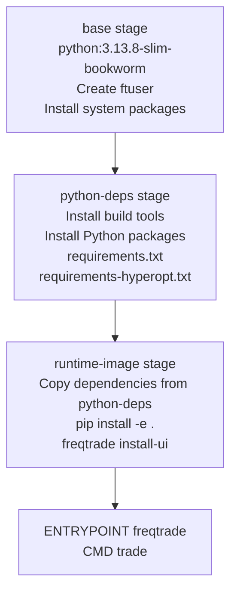

### Base Stage Components

The base stage [Dockerfile1-22](https://github.com/freqtrade/freqtrade/blob/8e91fea1/Dockerfile#L1-L22) sets up:

* Python 3.13.8 on Debian Bookworm
* User `ftuser` (UID 1000) with sudo access
* System dependencies: `libatlas3-base`, `curl`, `sqlite3`, `libgomp1`
* Environment: `FT_APP_ENV=docker`, `PATH` includes `/home/ftuser/.local/bin`

### Python Dependencies Stage

The python-deps stage [Dockerfile24-35](https://github.com/freqtrade/freqtrade/blob/8e91fea1/Dockerfile#L24-L35) installs:

* Build tools: `gcc`, `cmake`, `pkg-config`
* NumPy with version constraint: `numpy<3.0`
* Hyperopt dependencies from [requirements-hyperopt.txt1-10](https://github.com/freqtrade/freqtrade/blob/8e91fea1/requirements-hyperopt.txt#L1-L10)

### Runtime Stage

The runtime-image stage [Dockerfile37-54](https://github.com/freqtrade/freqtrade/blob/8e91fea1/Dockerfile#L37-L54) performs:

1. Copy compiled libraries and packages from python-deps
2. Install Freqtrade in editable mode: `pip install -e .`
3. Create user\_data directory
4. Install FreqUI: `freqtrade install-ui`
5. Set entrypoint to `freqtrade` command

### Docker Usage

```
```
# Using docker-compose (recommended)
docker compose up -d

# Manual docker run
docker run -d \
  --name freqtrade \
  -v ./user_data:/freqtrade/user_data \
  -v ./config.json:/freqtrade/config.json \
  freqtradeorg/freqtrade:stable trade --config config.json
```
```

**Sources:** [Dockerfile1-54](https://github.com/freqtrade/freqtrade/blob/8e91fea1/Dockerfile#L1-L54) [docker/Dockerfile.armhf1-58](https://github.com/freqtrade/freqtrade/blob/8e91fea1/docker/Dockerfile.armhf#L1-L58) [.github/workflows/ci.yml414-428](https://github.com/freqtrade/freqtrade/blob/8e91fea1/.github/workflows/ci.yml#L414-L428)

---

## Automated Setup with setup.sh Script

The [setup.sh1-305](https://github.com/freqtrade/freqtrade/blob/8e91fea1/setup.sh#L1-L305) script provides automated installation for Linux and macOS. It detects the Python version, creates a virtual environment, and installs dependencies based on user preferences.

### setup.sh Execution Flow

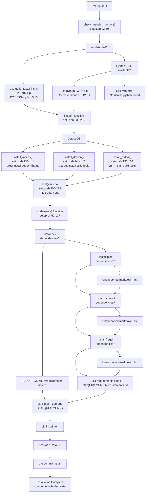

### Key Functions in setup.sh

| Function | Lines | Purpose |
| --- | --- | --- |
| `check_installed_python()` | [setup.sh22-50](https://github.com/freqtrade/freqtrade/blob/8e91fea1/setup.sh#L22-L50) | Detect Python 3.11-3.13 or uv package manager |
| `install_macos()` | [setup.sh130-141](https://github.com/freqtrade/freqtrade/blob/8e91fea1/setup.sh#L130-L141) | Install Homebrew dependencies (gettext, libomp) |
| `install_debian()` | [setup.sh144-147](https://github.com/freqtrade/freqtrade/blob/8e91fea1/setup.sh#L144-L147) | Install apt packages (gcc, build-essential, python3-dev) |
| `install_redhat()` | [setup.sh150-153](https://github.com/freqtrade/freqtrade/blob/8e91fea1/setup.sh#L150-L153) | Install yum packages for RedHat/CentOS |
| `recreate_environments()` | [setup.sh178-202](https://github.com/freqtrade/freqtrade/blob/8e91fea1/setup.sh#L178-L202) | Delete old .venv, create new with python3 -m venv or uv venv |
| `updateenv()` | [setup.sh52-127](https://github.com/freqtrade/freqtrade/blob/8e91fea1/setup.sh#L52-L127) | Interactive prompts, pip install dependencies |
| `update()` | [setup.sh156-165](https://github.com/freqtrade/freqtrade/blob/8e91fea1/setup.sh#L156-L165) | git pull and updateenv for updates |
| `reset()` | [setup.sh205-233](https://github.com/freqtrade/freqtrade/blob/8e91fea1/setup.sh#L205-L233) | Hard reset branch, recreate venv |

### uv Package Manager Support

The script detects [uv](https://docs.astral.sh/uv/) for faster installations [setup.sh28-33](https://github.com/freqtrade/freqtrade/blob/8e91fea1/setup.sh#L28-L33):

```
```
if [ -x "$(command -v uv)" ]; then
    echo "uv detected — using it instead of pip for faster installation."
    PIP="uv pip"
    PYTHON="python3.13"
    UV=true
fi
```
```

When uv is available, the virtual environment is created with [setup.sh191-193](https://github.com/freqtrade/freqtrade/blob/8e91fea1/setup.sh#L191-L193):

```
```
uv venv .venv --python=${PYTHON}
```
```

**Sources:** [setup.sh1-305](https://github.com/freqtrade/freqtrade/blob/8e91fea1/setup.sh#L1-L305) [docs/installation.md140-176](https://github.com/freqtrade/freqtrade/blob/8e91fea1/docs/installation.md#L140-L176)

---

## Manual Installation Process

Manual installation provides full control over the installation process and is documented in [docs/installation.md199-224](https://github.com/freqtrade/freqtrade/blob/8e91fea1/docs/installation.md#L199-L224)

### Step-by-Step Installation

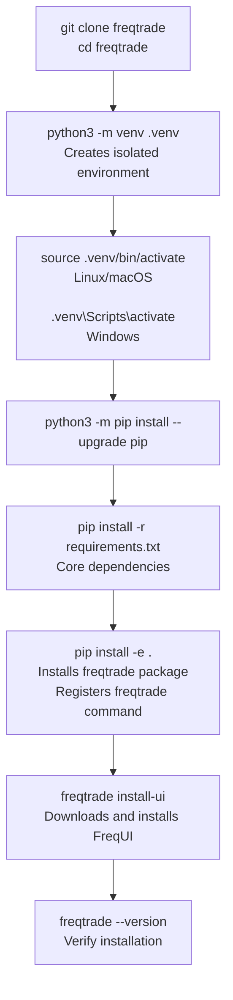

### Virtual Environment Structure

When created, the `.venv` directory contains:

```
.venv/
├── bin/                      # Executables (Linux/macOS)
│   ├── activate             # Activation script
│   ├── pip                  # Virtual env pip
│   └── python               # Virtual env python
├── lib/
│   └── python3.X/
│       └── site-packages/   # Installed packages
└── pyvenv.cfg               # Virtual env configuration
```

### Editable Installation with pip install -e

The `-e` flag installs in "editable" or "development" mode [pyproject.toml140-154](https://github.com/freqtrade/freqtrade/blob/8e91fea1/pyproject.toml#L140-L154) This:

1. Creates a link to source files instead of copying them
2. Allows code changes without reinstalling
3. Registers the `freqtrade` command via entry point [pyproject.toml140-141](https://github.com/freqtrade/freqtrade/blob/8e91fea1/pyproject.toml#L140-L141):

   ```
   ```
   [project.scripts]
   freqtrade = "freqtrade.main:main"
   ```
   ```

### setuptools Configuration

The build system is defined in [pyproject.toml1-3](https://github.com/freqtrade/freqtrade/blob/8e91fea1/pyproject.toml#L1-L3):

```
```
[build-system]
requires = ["setuptools >= 64.0.0", "wheel"]
build-backend = "setuptools.build_meta"
```
```

Package discovery uses [pyproject.toml143-151](https://github.com/freqtrade/freqtrade/blob/8e91fea1/pyproject.toml#L143-L151):

```
```
[tool.setuptools.packages.find]
where = ["."]
include = ["freqtrade*"]
exclude = ["tests", "tests.*", "user_data", "user_data*"]
```
```

**Sources:** [docs/installation.md199-224](https://github.com/freqtrade/freqtrade/blob/8e91fea1/docs/installation.md#L199-L224) [pyproject.toml1-154](https://github.com/freqtrade/freqtrade/blob/8e91fea1/pyproject.toml#L1-L154) [setup.sh195-201](https://github.com/freqtrade/freqtrade/blob/8e91fea1/setup.sh#L195-L201)

---

## Dependency System Architecture

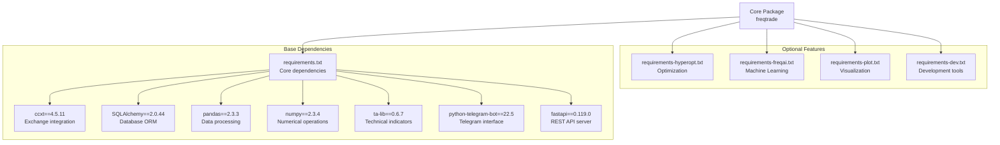

**Sources:** [requirements.txt1-64](https://github.com/freqtrade/freqtrade/blob/8e91fea1/requirements.txt#L1-L64) [pyproject.toml30-73](https://github.com/freqtrade/freqtrade/blob/8e91fea1/pyproject.toml#L30-L73)

---

## Core Dependencies System

Core dependencies are specified in [requirements.txt1-64](https://github.com/freqtrade/freqtrade/blob/8e91fea1/requirements.txt#L1-L64) with exact version pins for reproducibility. These are also declared in [pyproject.toml30-73](https://github.com/freqtrade/freqtrade/blob/8e91fea1/pyproject.toml#L30-L73) for pip installation.

### Dependency Categories and Key Versions

```mermaid
flowchart TD

FREQTRADE["freqtrade core"]
CCXT["ccxt>=4.5.4<br>Multi-exchange support"]
AIOHTTP["aiohttp<br>Async HTTP client"]
HTTPX["httpx>=0.24.1<br>HTTP client"]
CRYPTO["cryptography<br>API authentication"]
NUMPY["numpy>2.0,<3.0<br>Numerical arrays"]
PANDAS["pandas>=2.2.0,<3.0<br>Dataframes"]
TALIB["TA-Lib<0.7<br>Technical indicators"]
PANDAS_TA["ft-pandas-ta<br>Additional indicators"]
TECHNICAL["technical<br>Custom indicators"]
SQLALCHEMY["SQLAlchemy>=2.0.6<br>ORM and database"]
ALEMBIC["(via SQLAlchemy)<br>Database migrations"]
TELEGRAM["python-telegram-bot>=20.1<br>Telegram RPC"]
FASTAPI["fastapi<br>REST API server"]
UVICORN["uvicorn<br>ASGI server"]
WEBSOCKETS["websockets<br>WebSocket support"]
RAPIDJSON["python-rapidjson<br>Fast JSON parsing"]
ORJSON["orjson<br>Fast JSON serialization"]
PYARROW["pyarrow<br>Feather format<br>(not on armv7l)"]
JSONSCHEMA["jsonschema<br>Config validation"]
QUESTIONARY["questionary<br>Interactive prompts"]
JINJA2["jinja2<br>Template rendering"]
CACHETOOLS["cachetools<br>LRU caching"]
JOBLIB["joblib>=1.2.0<br>Parallel processing"]
SCHEDULE["schedule<br>Task scheduling"]
PSUTIL["psutil<br>Process monitoring"]

FREQTRADE --> CCXT
FREQTRADE --> NUMPY
FREQTRADE --> PANDAS
FREQTRADE --> SQLALCHEMY
FREQTRADE --> TELEGRAM
FREQTRADE --> FASTAPI
FREQTRADE --> RAPIDJSON
FREQTRADE --> JSONSCHEMA
FREQTRADE --> CACHETOOLS

subgraph Utilities ["Utilities"]
    CACHETOOLS
    JOBLIB
    SCHEDULE
    PSUTIL
end

subgraph Configuration ["Configuration"]
    JSONSCHEMA
    QUESTIONARY
    JINJA2
end

subgraph subGraph4 ["Data Formats"]
    RAPIDJSON
    ORJSON
    PYARROW
end

subgraph subGraph3 ["User Interfaces"]
    TELEGRAM
    FASTAPI
    UVICORN
    WEBSOCKETS
end

subgraph subGraph2 ["Persistence Layer"]
    SQLALCHEMY
    ALEMBIC
end

subgraph subGraph1 ["Data Processing"]
    NUMPY
    PANDAS
    TALIB
    PANDAS_TA
    TECHNICAL
end

subgraph subGraph0 ["Exchange Layer"]
    CCXT
    AIOHTTP
    HTTPX
    CRYPTO
end
```

### Critical Version Constraints

From [pyproject.toml30-73](https://github.com/freqtrade/freqtrade/blob/8e91fea1/pyproject.toml#L30-L73):

| Package | Version Constraint | Reason |
| --- | --- | --- |
| `ccxt` | `>=4.5.4` | Exchange API compatibility |
| `SQLAlchemy` | `>=2.0.6` | Required for async support and modern ORM |
| `pandas` | `>=2.2.0,<3.0` | DataFrame API stability |
| `numpy` | `>2.0,<3.0` | Prevent breaking changes from NumPy 3.x |
| `python-telegram-bot` | `>=20.1` | Telegram Bot API updates |
| `TA-Lib` | `<0.7` | Indicator calculation compatibility |
| `pyarrow` | `platform_machine != "armv7l"` | Not available on ARM 32-bit |

### System Package Dependencies

From [Dockerfile14](https://github.com/freqtrade/freqtrade/blob/8e91fea1/Dockerfile#L14-L14) and [setup.sh144-147](https://github.com/freqtrade/freqtrade/blob/8e91fea1/setup.sh#L144-L147):

**Debian/Ubuntu:**

```
```
sudo apt-get install -y \
  gcc build-essential autoconf libtool pkg-config \
  python3-dev python3-venv python3-pip \
  libatlas-base-dev
```
```

**macOS (via Homebrew) [setup.sh137](https://github.com/freqtrade/freqtrade/blob/8e91fea1/setup.sh#L137-L137):**

```
```
brew install gettext libomp
```
```

**Sources:** [requirements.txt1-64](https://github.com/freqtrade/freqtrade/blob/8e91fea1/requirements.txt#L1-L64) [pyproject.toml30-73](https://github.com/freqtrade/freqtrade/blob/8e91fea1/pyproject.toml#L30-L73) [Dockerfile14](https://github.com/freqtrade/freqtrade/blob/8e91fea1/Dockerfile#L14-L14) [setup.sh130-147](https://github.com/freqtrade/freqtrade/blob/8e91fea1/setup.sh#L130-L147)

---

## Optional Feature Modules

Optional dependencies are organized into separate requirement files and pyproject.toml extras [pyproject.toml75-132](https://github.com/freqtrade/freqtrade/blob/8e91fea1/pyproject.toml#L75-L132)

### Installation via Extras

```
```
# Single extra
pip install -e .[hyperopt]
pip install -e .[freqai]
pip install -e .[plot]

# Multiple extras
pip install -e .[hyperopt,freqai,plot]

# All features
pip install -e .[all]

# Development (includes all + dev tools)
pip install -e .[dev]
```
```

### Hyperopt Dependencies

From [requirements-hyperopt.txt1-10](https://github.com/freqtrade/freqtrade/blob/8e91fea1/requirements-hyperopt.txt#L1-L10) and [pyproject.toml78-84](https://github.com/freqtrade/freqtrade/blob/8e91fea1/pyproject.toml#L78-L84):

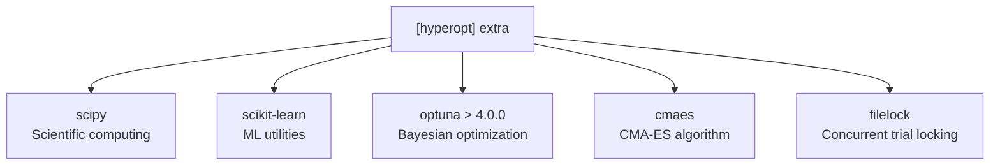

**Usage:** Required for `freqtrade hyperopt` command and hyperparameter optimization.

### FreqAI Dependencies

From [requirements-freqai.txt1-48](https://github.com/freqtrade/freqtrade/blob/8e91fea1/requirements-freqai.txt#L1-L48) and [pyproject.toml85-93](https://github.com/freqtrade/freqtrade/blob/8e91fea1/pyproject.toml#L85-L93):

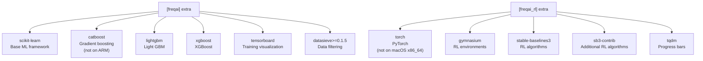

**Platform Exclusions:**

* `catboost`: Excluded on ARM (`platform_machine != 'arm'`) [pyproject.toml88](https://github.com/freqtrade/freqtrade/blob/8e91fea1/pyproject.toml#L88-L88)
* `torch`, `stable-baselines3`, `sb3-contrib`: Excluded on macOS x86\_64 [pyproject.toml95-98](https://github.com/freqtrade/freqtrade/blob/8e91fea1/pyproject.toml#L95-L98)

**Usage:** Required for FreqAI machine learning features.

### Plot Dependencies

From [requirements-plot.txt1-4](https://github.com/freqtrade/freqtrade/blob/8e91fea1/requirements-plot.txt#L1-L4) and [pyproject.toml77](https://github.com/freqtrade/freqtrade/blob/8e91fea1/pyproject.toml#L77-L77):

```
```
plotly>=4.0
```
```

**Usage:** Required for `freqtrade plot-dataframe` and `freqtrade plot-profit` commands.

### Development Dependencies

From [requirements-dev.txt1-33](https://github.com/freqtrade/freqtrade/blob/8e91fea1/requirements-dev.txt#L1-L33) and [pyproject.toml101-120](https://github.com/freqtrade/freqtrade/blob/8e91fea1/pyproject.toml#L101-L120):

```mermaid
flowchart TD

DEV["[develop] extra"]
PYTEST["pytest==9.0.1<br>Test framework"]
PYTEST_ASYNCIO["pytest-asyncio==1.3.0<br>Async test support"]
PYTEST_COV["pytest-cov==7.0.0<br>Coverage reporting"]
PYTEST_MOCK["pytest-mock==3.15.1<br>Mocking utilities"]
PYTEST_RANDOM["pytest-random-order==1.2.0<br>Random test order"]
PYTEST_TIMEOUT["pytest-timeout==2.4.0<br>Test timeouts"]
PYTEST_XDIST["pytest-xdist==3.8.0<br>Parallel testing"]
TIME_MACHINE["time-machine==3.1.0<br>Datetime mocking"]
RUFF["ruff==0.14.6<br>Linter + formatter"]
MYPY["mypy==1.18.2<br>Type checker"]
ISORT["isort==7.0.0<br>Import sorter"]
PRECOMMIT["pre-commit==4.5.0<br>Git hooks"]
SCIPY_STUBS["scipy-stubs==1.16.3.1"]
TYPES_CACHE["types-cachetools==6.2.0.20251022"]
TYPES_FILELOCK["types-filelock==3.2.7"]
TYPES_REQUESTS["types-requests==2.32.4.20250913"]
TYPES_TABULATE["types-tabulate==0.9.0.20241207"]
TYPES_DATEUTIL["types-python-dateutil==2.9.0.20251115"]

DEV --> PYTEST
DEV --> PYTEST_ASYNCIO
DEV --> PYTEST_COV
DEV --> RUFF
DEV --> MYPY
DEV --> ISORT
DEV --> PRECOMMIT
DEV --> SCIPY_STUBS

subgraph subGraph2 ["Type Stubs"]
    SCIPY_STUBS
    TYPES_CACHE
    TYPES_FILELOCK
    TYPES_REQUESTS
    TYPES_TABULATE
    TYPES_DATEUTIL
end

subgraph subGraph1 ["Code Quality"]
    RUFF
    MYPY
    ISORT
    PRECOMMIT
end

subgraph Testing ["Testing"]
    PYTEST
    PYTEST_ASYNCIO
    PYTEST_COV
    PYTEST_MOCK
    PYTEST_RANDOM
    PYTEST_TIMEOUT
    PYTEST_XDIST
    TIME_MACHINE
end
```

**Usage:** Required for development, testing, and contributing to Freqtrade.

**Sources:** [requirements-hyperopt.txt1-10](https://github.com/freqtrade/freqtrade/blob/8e91fea1/requirements-hyperopt.txt#L1-L10) [requirements-freqai.txt1-48](https://github.com/freqtrade/freqtrade/blob/8e91fea1/requirements-freqai.txt#L1-L48) [requirements-plot.txt1-4](https://github.com/freqtrade/freqtrade/blob/8e91fea1/requirements-plot.txt#L1-L4) [requirements-dev.txt1-33](https://github.com/freqtrade/freqtrade/blob/8e91fea1/requirements-dev.txt#L1-L33) [pyproject.toml75-132](https://github.com/freqtrade/freqtrade/blob/8e91fea1/pyproject.toml#L75-L132)

---

## Dependency Installation Flow

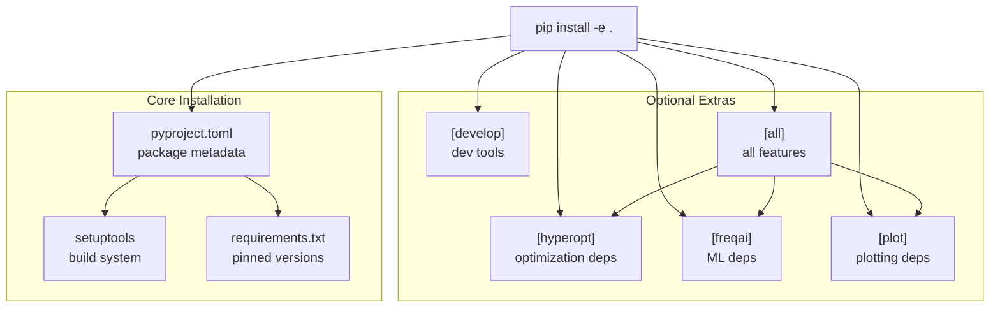

**Sources:** [pyproject.toml1-142](https://github.com/freqtrade/freqtrade/blob/8e91fea1/pyproject.toml#L1-L142)

---

## Post-Installation Configuration

### Initialize User Directory

The `create-userdir` command creates the default directory structure:

```
```
freqtrade create-userdir --userdir user_data
```
```

This creates the following structure (excluded from package via [pyproject.toml150](https://github.com/freqtrade/freqtrade/blob/8e91fea1/pyproject.toml#L150-L150)):

```
user_data/
├── backtest_results/        # Backtesting output JSON files
├── data/                    # Historical OHLCV data
│   └── binance/            # Example: organized by exchange
│       ├── BTC_USDT-5m.feather
│       └── ETH_USDT-5m.feather
├── hyperopt_results/        # Hyperopt result JSON files
├── logs/                    # Application logs
│   └── freqtrade.log
├── notebooks/               # Jupyter analysis notebooks
├── plot/                    # Plot outputs (HTML, PNG)
└── strategies/              # User strategy files
    └── sample_strategy.py
```

### Generate Initial Configuration

The `new-config` command creates a configuration file interactively:

```
```
# Create new configuration
freqtrade new-config --config user_data/config.json

# Example non-interactive
freqtrade new-config \
  --config config.json \
  --exchange binance \
  --dry-run
```
```

The generated config includes:

* Exchange selection and API credentials
* Stake currency and amount
* Trading mode (spot/futures)
* Pairlist configuration
* Telegram and API server settings

See [Configuration System](/freqtrade/freqtrade/1.4-configuration-system) for detailed configuration options.

### Command-Line Entry Point

The installation registers `freqtrade` as a console script [pyproject.toml140-141](https://github.com/freqtrade/freqtrade/blob/8e91fea1/pyproject.toml#L140-L141):

```
```
[project.scripts]
freqtrade = "freqtrade.main:main"
```
```

This entry point maps to [freqtrade/main.py1-40](https://github.com/freqtrade/freqtrade/blob/8e91fea1/freqtrade/main.py#L1-L40) which parses arguments and dispatches to subcommands:

```
```
def main():
    """Main entry point for freqtrade CLI."""
    return_code = 1
    try:
        arguments = Arguments(sys.argv[1:])
        args = arguments.get_parsed_arg()
        
        # Initialize logging
        setup_logging(args)
        
        # Execute subcommand
        return_code = args<FileRef file-url="https://github.com/freqtrade/freqtrade/blob/8e91fea1/'func'" undefined  file-path="'func'">Hii</FileRef>
    except SystemExit as e:
        return_code = e.code
    except Exception:
        logger.exception("Fatal exception!")
    finally:
        sys.exit(return_code)
```
```

### Verify Installation

```
```
# Check version
freqtrade --version
# Output: freqtrade 2025.X

# List available strategies
freqtrade list-strategies --userdir user_data

# Test pairlist configuration
freqtrade test-pairlist --config user_data/config.json

# Start in dry-run mode
freqtrade trade --config user_data/config.json --strategy SampleStrategy
```
```

**Sources:** [pyproject.toml140-151](https://github.com/freqtrade/freqtrade/blob/8e91fea1/pyproject.toml#L140-L151) [docs/installation.md346-365](https://github.com/freqtrade/freqtrade/blob/8e91fea1/docs/installation.md#L346-L365) [docs/bot-usage.md62-83](https://github.com/freqtrade/freqtrade/blob/8e91fea1/docs/bot-usage.md#L62-L83)

---

## Development Environment Setup

### Pre-commit Hook Installation

The pre-commit configuration [.pre-commit-config.yaml1-89](https://github.com/freqtrade/freqtrade/blob/8e91fea1/.pre-commit-config.yaml#L1-L89) defines code quality checks that run automatically before commits.

```
```
# Install development dependencies
pip install -e .[develop]

# Install git hooks (adds .git/hooks/pre-commit)
pre-commit install

# Manually run all checks
pre-commit run -a
```
```

When installed, `pre-commit install` modifies `.git/hooks/pre-commit` to execute checks on staged files.

### Pre-commit Check Flow

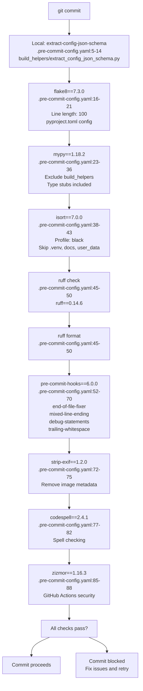

### Tool Configuration in pyproject.toml

#### Ruff Configuration [pyproject.toml252-328](https://github.com/freqtrade/freqtrade/blob/8e91fea1/pyproject.toml#L252-L328)

```
```
[tool.ruff]
line-length = 100
extend-exclude = [".env", ".venv"]

[tool.ruff.lint]
extend-select = ["C90", "B", "F", "E", "W", "UP", "I", "A", "TID", "YTT", "S", "PTH", "RUF", "ASYNC", "NPY"]
```
```

Rules enabled:

* `C90`: McCabe complexity (max 12)
* `B`: bugbear (common bugs)
* `F`: pyflakes
* `E/W`: pycodestyle
* `UP`: pyupgrade (modern Python syntax)
* `I`: isort (import sorting)
* `S`: bandit (security checks)
* `RUF`: Ruff-specific rules

#### Mypy Configuration [pyproject.toml194-217](https://github.com/freqtrade/freqtrade/blob/8e91fea1/pyproject.toml#L194-L217)

```
```
[tool.mypy]
ignore_missing_imports = true
warn_unused_ignores = true
plugins = ["sqlalchemy.ext.mypy.plugin"]
```
```

Overrides:

* Tests: `ignore_errors = true` [pyproject.toml207-208](https://github.com/freqtrade/freqtrade/blob/8e91fea1/pyproject.toml#L207-L208)
* Strategy templates: Disable `attr-defined` for ta-lib [pyproject.toml211-216](https://github.com/freqtrade/freqtrade/blob/8e91fea1/pyproject.toml#L211-L216)

#### Isort Configuration [pyproject.toml177-183](https://github.com/freqtrade/freqtrade/blob/8e91fea1/pyproject.toml#L177-L183)

```
```
[tool.isort]
line_length = 100
profile = "black"
lines_after_imports = 2
skip_glob = ["**/.env*", "**/env/*", "**/.venv/*", "**/docs/*", "**/user_data/*"]
known_first_party = ["freqtrade_client"]
```
```

#### Pytest Configuration [pyproject.toml185-192](https://github.com/freqtrade/freqtrade/blob/8e91fea1/pyproject.toml#L185-L192)

```
```
[tool.pytest.ini_options]
asyncio_mode = "auto"
asyncio_default_fixture_loop_scope = "function"
addopts = "--dist loadscope"
```
```

**Sources:** [.pre-commit-config.yaml1-89](https://github.com/freqtrade/freqtrade/blob/8e91fea1/.pre-commit-config.yaml#L1-L89) [pyproject.toml177-328](https://github.com/freqtrade/freqtrade/blob/8e91fea1/pyproject.toml#L177-L328) [docs/developer.md29-41](https://github.com/freqtrade/freqtrade/blob/8e91fea1/docs/developer.md#L29-L41)

---

## Platform-Specific Considerations

### Windows Installation

#### Visual C++ Build Tools Requirement

Many Python packages require compilation. Windows users must install Microsoft Visual C++ Build Tools:

1. Download from [Visual Studio Build Tools](https://visualstudio.microsoft.com/visual-cpp-build-tools/)
2. Install "Desktop development with C++" workload
3. Restart terminal after installation

**Error Message:**

```
error: Microsoft Visual C++ 14.0 is required. Get it with "Microsoft Visual C++ Build Tools"
```

#### Windows Subsystem for Linux (WSL)

For better compatibility, Windows users should consider WSL2:

```
```
# In WSL2 Ubuntu
git clone https://github.com/freqtrade/freqtrade.git
cd freqtrade
./setup.sh
```
```

**Sources:** [docs/windows\_installation.md42-52](https://github.com/freqtrade/freqtrade/blob/8e91fea1/docs/windows_installation.md#L42-L52)

### ARM Architecture Support

Special considerations for ARM platforms:

| Package | ARM Limitation | Alternative |
| --- | --- | --- |
| `pyarrow` | Not available on armv7l | Install with condition |
| `catboost` | Not available on ARM | Excluded from FreqAI on ARM |

The `pyproject.toml` handles this automatically:

```
```
# Conditional dependency installation
'pyarrow; platform_machine != "armv7l"'
"catboost; platform_machine != 'arm'"
```
```

**Sources:** [requirements.txt28-30](https://github.com/freqtrade/freqtrade/blob/8e91fea1/requirements.txt#L28-L30) [pyproject.toml55](https://github.com/freqtrade/freqtrade/blob/8e91fea1/pyproject.toml#L55-L55) [pyproject.toml88](https://github.com/freqtrade/freqtrade/blob/8e91fea1/pyproject.toml#L88-L88)

---

## Verification and Testing

### Installation Verification Commands

```
```
# Check installed version
freqtrade --version
# Expected: freqtrade 2025.X

# Verify Python can import the package
python -c "import freqtrade; print(freqtrade.__version__)"

# Check CLI is accessible
which freqtrade
# Expected: /path/to/.venv/bin/freqtrade

# List available commands
freqtrade --help
```
```

### Dependency Verification

```
```
# List core packages
pip list | grep -E '(ccxt|pandas|numpy|SQLAlchemy|telegram)'

# Check optional dependencies
python -c "import optuna" && echo "Hyperopt: OK"
python -c "import lightgbm" && echo "FreqAI: OK"
python -c "import plotly" && echo "Plotting: OK"

# Verify specific versions
pip show ccxt pandas numpy
```
```

### Running the Test Suite

The test suite is configured in [pyproject.toml185-192](https://github.com/freqtrade/freqtrade/blob/8e91fea1/pyproject.toml#L185-L192) and uses pytest with multiple plugins.

```
```
# Run all tests (requires pytest and dev dependencies)
pytest

# Run with test distribution (faster on multi-core)
pytest -n auto

# Run with coverage report
pytest --cov=freqtrade --cov-config=.coveragerc --cov-report=html

# Run specific test file
pytest tests/test_freqtradebot.py

# Run specific test function
pytest tests/test_freqtradebot.py::test_bot_cleanup_closed_trades

# Run with random order (catch order dependencies)
pytest --random-order
```
```

### CI Test Configuration

The CI pipeline [.github/workflows/ci.yml22-175](https://github.com/freqtrade/freqtrade/blob/8e91fea1/.github/workflows/ci.yml#L22-L175) runs tests on multiple platforms:

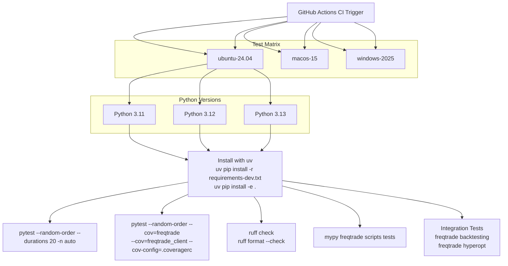

**Test Execution on CI:**

* Matrix of 6 OS × 3 Python versions = 18 test runs
* Ubuntu 24.04 + Python 3.12: Run with coverage [.github/workflows/ci.yml72-76](https://github.com/freqtrade/freqtrade/blob/8e91fea1/.github/workflows/ci.yml#L72-L76)
* All others: Run without coverage for speed [.github/workflows/ci.yml67-70](https://github.com/freqtrade/freqtrade/blob/8e91fea1/.github/workflows/ci.yml#L67-L70)
* Integration tests: Backtesting and hyperopt [.github/workflows/ci.yml125-138](https://github.com/freqtrade/freqtrade/blob/8e91fea1/.github/workflows/ci.yml#L125-L138)

**Sources:** [pyproject.toml185-192](https://github.com/freqtrade/freqtrade/blob/8e91fea1/pyproject.toml#L185-L192) [.github/workflows/ci.yml22-175](https://github.com/freqtrade/freqtrade/blob/8e91fea1/.github/workflows/ci.yml#L22-L175) [docs/developer.md56-85](https://github.com/freqtrade/freqtrade/blob/8e91fea1/docs/developer.md#L56-L85)

---

## Updating Freqtrade

### Update Methods by Installation Type

| Installation Method | Update Command | Notes |
| --- | --- | --- |
| Docker | `docker compose pull && docker compose up -d` | Updates to latest image |
| Script (setup.sh) | `./setup.sh --update` | Deactivate venv first |
| Manual | See manual update flow below | Multi-step process |

### setup.sh Update Function

The `--update` flag [setup.sh156-165](https://github.com/freqtrade/freqtrade/blob/8e91fea1/setup.sh#L156-L165) performs:

1. `git pull` to fetch latest code
2. Environment check and upgrade [setup.sh158-161](https://github.com/freqtrade/freqtrade/blob/8e91fea1/setup.sh#L158-L161)
3. Call `updateenv()` to reinstall dependencies [setup.sh162](https://github.com/freqtrade/freqtrade/blob/8e91fea1/setup.sh#L162-L162)

```
```
# Deactivate virtual environment first
deactivate

# Run update
./setup.sh --update

# Reactivate
source .venv/bin/activate
```
```

### Manual Update Process

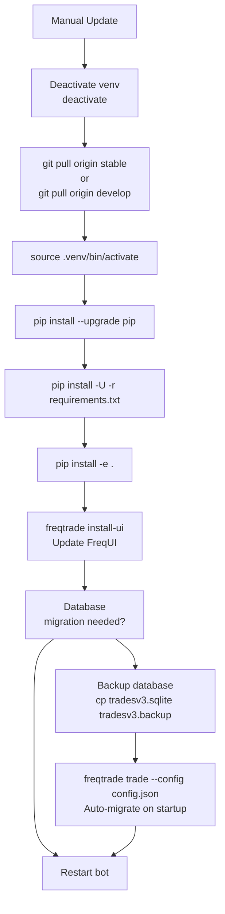

### Database Migrations

Freqtrade uses SQLAlchemy migrations. When updating:

1. Backup database first: `cp tradesv3.sqlite tradesv3.backup`
2. Migrations run automatically on bot startup
3. Migration code is in `freqtrade/persistence/migrations.py`

### Switching Between Branches

```
```
# Switch to stable branch
git checkout stable
git pull origin stable
./setup.sh --update

# Switch to develop branch (latest features)
git checkout develop
git pull origin develop
./setup.sh --update
```
```

### Docker Image Tags for Updates

From [.github/workflows/docker-build.yml](https://github.com/freqtrade/freqtrade/blob/8e91fea1/.github/workflows/docker-build.yml):

* `stable`: Tracks the stable branch releases
* `develop`: Auto-built on every commit to develop
* `latest`: Alias for the latest stable release
* Version tags: `2025.1`, `2025.2`, etc.

**Sources:** [setup.sh156-165](https://github.com/freqtrade/freqtrade/blob/8e91fea1/setup.sh#L156-L165) [docs/installation.md155-176](https://github.com/freqtrade/freqtrade/blob/8e91fea1/docs/installation.md#L155-L176) [docs/bot-usage.md1-7](https://github.com/freqtrade/freqtrade/blob/8e91fea1/docs/bot-usage.md#L1-L7)

---

## Package Build Configuration

### Build System

Freqtrade uses `setuptools` as the build backend:

```
```
[build-system]
requires = ["setuptools >= 64.0.0", "wheel"]
build-backend = "setuptools.build_meta"
```
```

### Package Distribution

The build process generates two distribution types:

1. **Source Distribution (sdist)**: `*.tar.gz` file containing source code
2. **Wheel Distribution (bdist\_wheel)**: `*.whl` file for faster installation

Build commands:

```
```
# Build both distributions
python -m build

# Output in dist/ directory:
# - freqtrade-<version>.tar.gz
# - freqtrade-<version>-py3-none-any.whl
```
```

**Sources:** [pyproject.toml1-3](https://github.com/freqtrade/freqtrade/blob/8e91fea1/pyproject.toml#L1-L3)

---

## ft\_client Separate Package

Freqtrade includes a lightweight client library (`ft_client`) that can be installed independently:

```
```
# Install from PyPI
pip install freqtrade-client

# Install from source
cd ft_client
pip install -e .
```
```

### ft\_client Dependencies

Minimal dependencies for API client usage:

```
```
# ft_client/requirements.txt
requests==2.32.5
python-rapidjson==1.21
```
```

### Entry Point

```
```
# Registered command
freqtrade-client = "freqtrade_client.ft_client:main"
```
```

**Sources:** [ft\_client/requirements.txt1-4](https://github.com/freqtrade/freqtrade/blob/8e91fea1/ft_client/requirements.txt#L1-L4) [ft\_client/pyproject.toml1-54](https://github.com/freqtrade/freqtrade/blob/8e91fea1/ft_client/pyproject.toml#L1-L54) [ft\_client/README.md1-8](https://github.com/freqtrade/freqtrade/blob/8e91fea1/ft_client/README.md#L1-L8)

---

## Troubleshooting Common Issues

### TA-Lib Installation Failures

**Issue:** TA-Lib compilation fails on installation

**Solutions:**

* **Linux:** Install system package first: `sudo apt-get install ta-lib`
* **macOS:** Use Homebrew: `brew install ta-lib`
* **Windows:** Use pre-built wheels or install via conda

### Import Errors After Installation

**Issue:** `ModuleNotFoundError` when running freqtrade

**Solutions:**

1. Ensure virtual environment is activated
2. Reinstall in editable mode: `pip install -e .`
3. Check Python version: `python --version` (must be 3.11+)

### Dependency Conflicts

**Issue:** Package version conflicts during installation

**Solutions:**

1. Create fresh virtual environment
2. Use exact versions from requirements files
3. Check platform-specific exclusions (ARM, Windows)

**Sources:** [docs/updating.md41-44](https://github.com/freqtrade/freqtrade/blob/8e91fea1/docs/updating.md#L41-L44) [docs/windows\_installation.md42-52](https://github.com/freqtrade/freqtrade/blob/8e91fea1/docs/windows_installation.md#L42-L52)