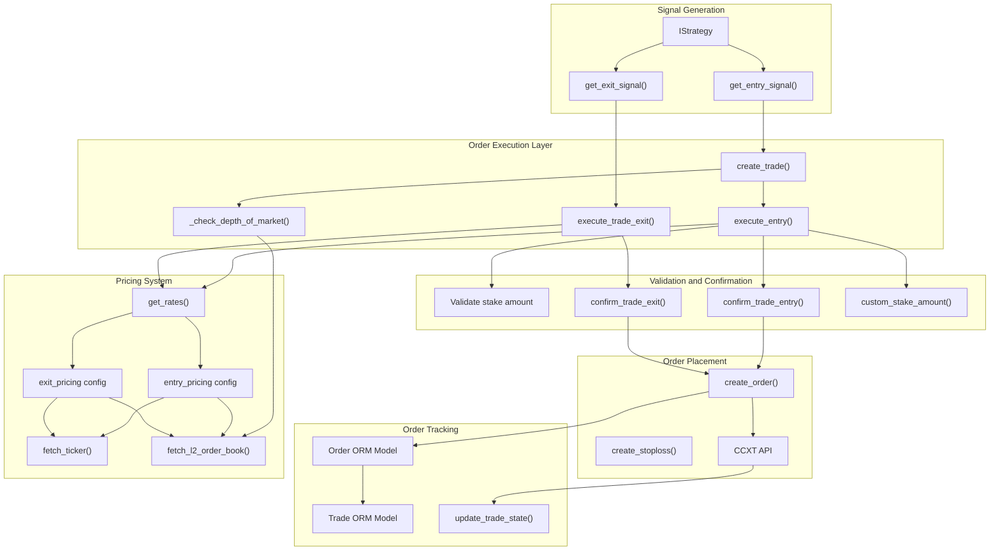
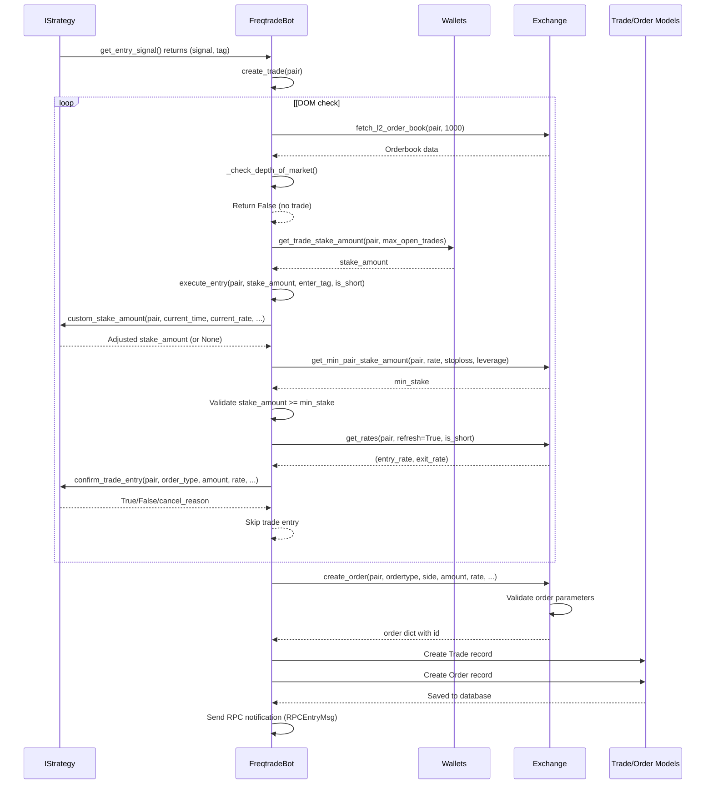
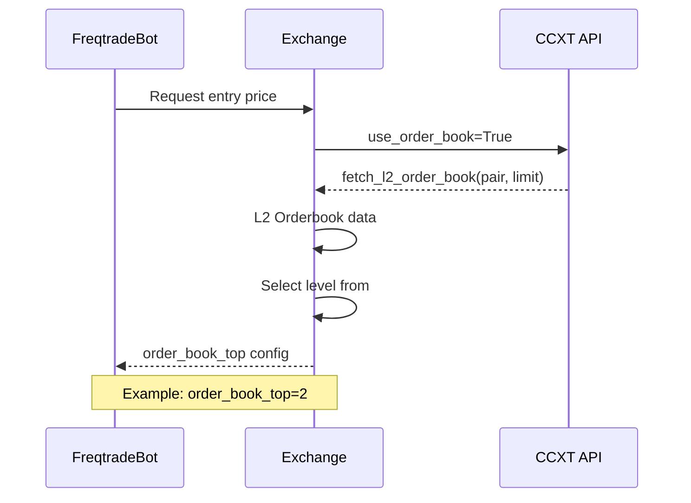
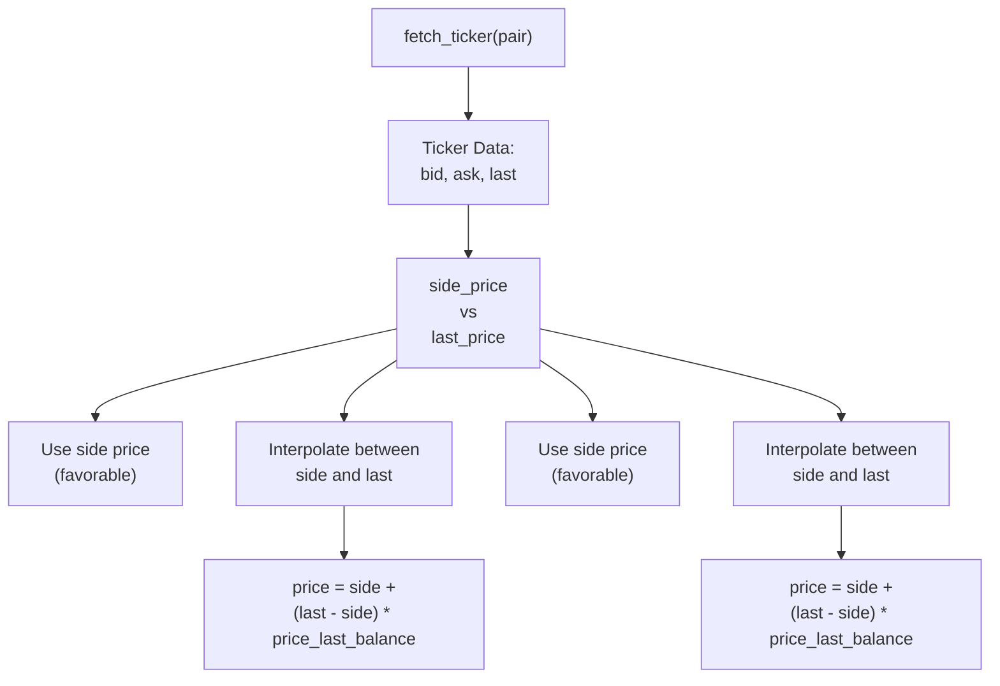
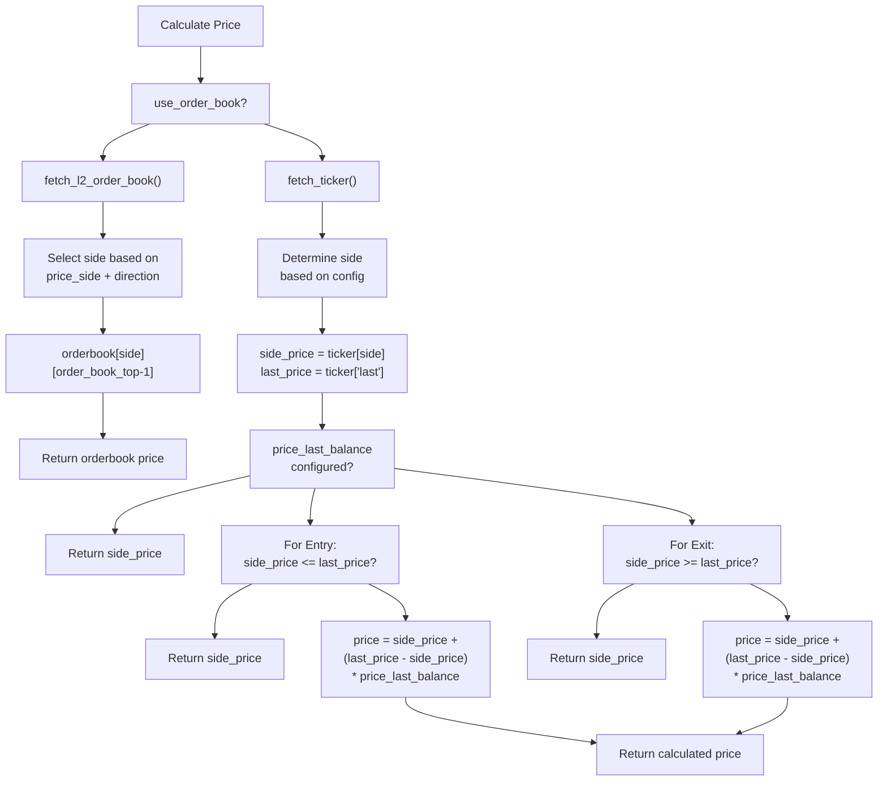
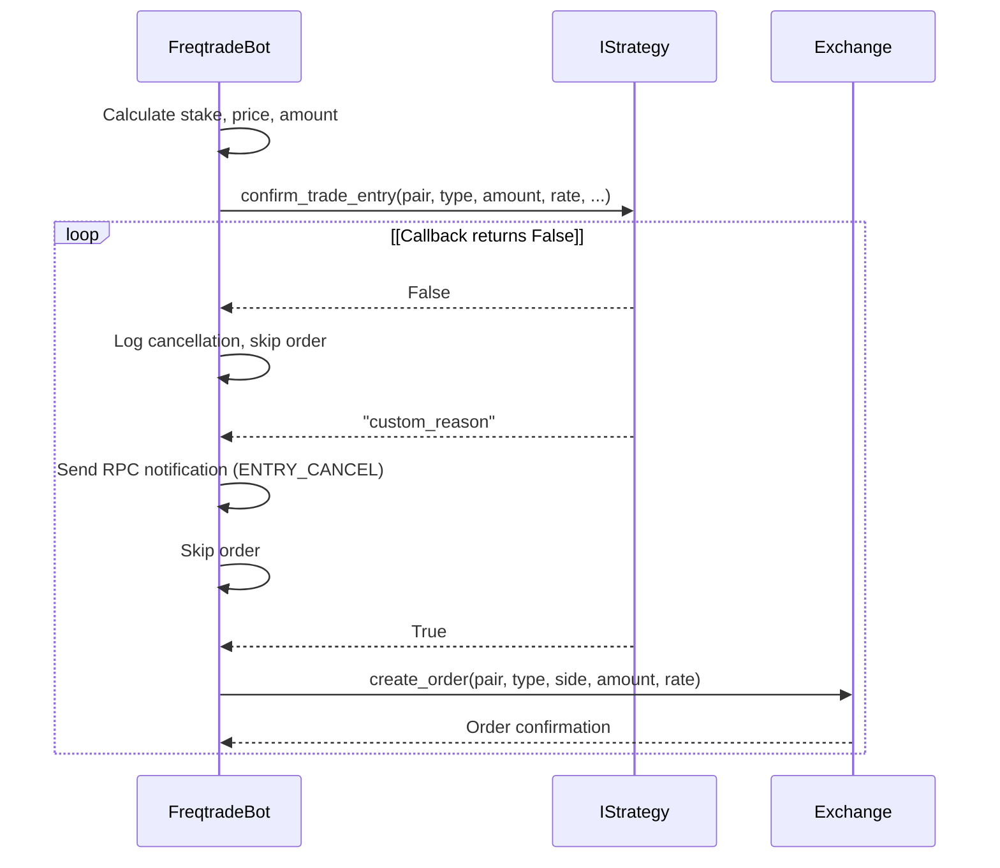
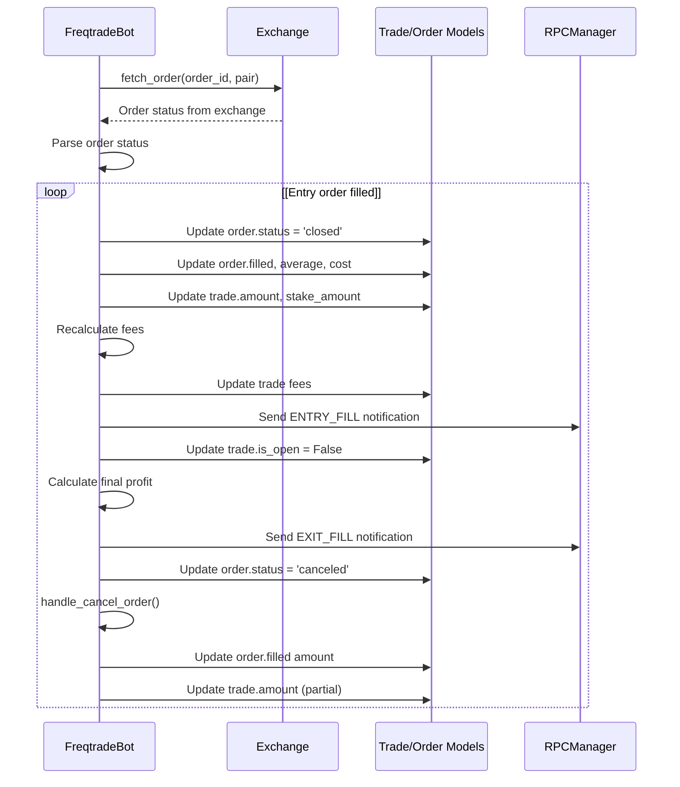
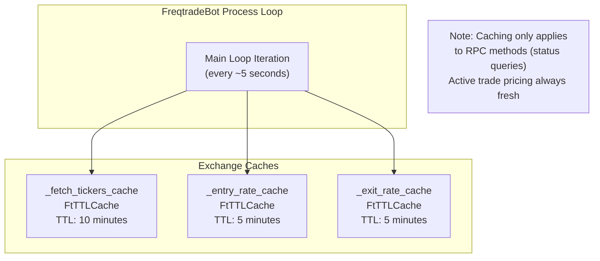

# Order Execution and Pricing

Relevant source files

* [docs/includes/pricing.md](https://github.com/freqtrade/freqtrade/blob/8e91fea1/docs/includes/pricing.md)
* [docs/requirements-docs.txt](https://github.com/freqtrade/freqtrade/blob/8e91fea1/docs/requirements-docs.txt)
* [freqtrade/exchange/binance.py](https://github.com/freqtrade/freqtrade/blob/8e91fea1/freqtrade/exchange/binance.py)
* [freqtrade/exchange/exchange.py](https://github.com/freqtrade/freqtrade/blob/8e91fea1/freqtrade/exchange/exchange.py)
* [freqtrade/exchange/kraken.py](https://github.com/freqtrade/freqtrade/blob/8e91fea1/freqtrade/exchange/kraken.py)
* [freqtrade/freqtradebot.py](https://github.com/freqtrade/freqtrade/blob/8e91fea1/freqtrade/freqtradebot.py)
* [ft\_client/requirements.txt](https://github.com/freqtrade/freqtrade/blob/8e91fea1/ft_client/requirements.txt)
* [requirements-freqai.txt](https://github.com/freqtrade/freqtrade/blob/8e91fea1/requirements-freqai.txt)
* [requirements-hyperopt.txt](https://github.com/freqtrade/freqtrade/blob/8e91fea1/requirements-hyperopt.txt)
* [requirements.txt](https://github.com/freqtrade/freqtrade/blob/8e91fea1/requirements.txt)
* [tests/conftest.py](https://github.com/freqtrade/freqtrade/blob/8e91fea1/tests/conftest.py)
* [tests/exchange/test\_binance.py](https://github.com/freqtrade/freqtrade/blob/8e91fea1/tests/exchange/test_binance.py)
* [tests/exchange/test\_exchange.py](https://github.com/freqtrade/freqtrade/blob/8e91fea1/tests/exchange/test_exchange.py)
* [tests/exchange/test\_kraken.py](https://github.com/freqtrade/freqtrade/blob/8e91fea1/tests/exchange/test_kraken.py)

## Overview

The Order Execution and Pricing system handles the complete lifecycle from trade signal to order placement on the exchange. This encompasses two primary responsibilities: **order execution** (creating, validating, and placing orders) and **pricing** (determining the exact price at which orders are placed). The system operates in two primary contexts: entry (opening trades) and exit (closing trades), each with independent configuration, validation, and confirmation logic.

This document covers the complete order execution flow, pricing determination mechanisms, order validation, confirmation callbacks, and order state management. For trade entry/exit signal logic, see page 2.3. For order lifecycle management after placement, see page 2.5.

**Sources:** [freqtrade/freqtradebot.py863-1048](https://github.com/freqtrade/freqtrade/blob/8e91fea1/freqtrade/freqtradebot.py#L863-L1048) [freqtrade/freqtradebot.py653-711](https://github.com/freqtrade/freqtrade/blob/8e91fea1/freqtrade/freqtradebot.py#L653-L711) [docs/includes/pricing.md1-147](https://github.com/freqtrade/freqtrade/blob/8e91fea1/docs/includes/pricing.md#L1-L147)

## System Architecture

**Diagram: Complete Order Execution and Pricing Flow**



**Sources:** [freqtrade/freqtradebot.py653-711](https://github.com/freqtrade/freqtrade/blob/8e91fea1/freqtrade/freqtradebot.py#L653-L711) [freqtrade/freqtradebot.py863-1048](https://github.com/freqtrade/freqtrade/blob/8e91fea1/freqtrade/freqtradebot.py#L863-L1048) [freqtrade/exchange/exchange.py1815-1941](https://github.com/freqtrade/freqtrade/blob/8e91fea1/freqtrade/exchange/exchange.py#L1815-L1941)

## Order Execution Flow

The order execution system coordinates multiple steps from trade signal to order placement, including validation, pricing, confirmation, and state tracking.

**Diagram: Entry Order Execution Sequence**



**Sources:** [freqtrade/freqtradebot.py653-711](https://github.com/freqtrade/freqtrade/blob/8e91fea1/freqtrade/freqtradebot.py#L653-L711) [freqtrade/freqtradebot.py863-1048](https://github.com/freqtrade/freqtrade/blob/8e91fea1/freqtrade/freqtradebot.py#L863-L1048)

### Entry Order Execution: execute\_entry()

The `execute_entry()` method in `FreqtradeBot` is the central entry point for creating new trades. It orchestrates the complete flow from stake calculation to order placement.

**Key Parameters:**

* `pair`: Trading pair (e.g., "ETH/BTC")
* `stake_amount`: Amount of stake currency to use
* `price`: Optional override price (used for position adjustments)
* `is_short`: Boolean indicating short position
* `ordertype`: Order type override (limit/market)
* `enter_tag`: Entry signal tag from strategy
* `trade`: Existing trade object (for position adjustments)
* `mode`: Execution mode: "initial" or "pos\_adjust"

**Execution Steps:**

1. **Stake Amount Customization**: Calls `strategy.custom_stake_amount()` to allow strategy-level stake adjustments
2. **Leverage Calculation**: Determines leverage via `strategy.leverage()` callback
3. **Amount Calculation**: Converts stake to trading amount accounting for leverage
4. **Minimum Stake Validation**: Validates against `exchange.get_min_pair_stake_amount()`
5. **Maximum Stake Validation**: Validates against `exchange.get_max_pair_stake_amount()`
6. **Price Determination**: Calls `exchange.get_rates()` to get entry/exit prices
7. **Order Type Resolution**: Determines final order type from strategy configuration
8. **Entry Confirmation**: Calls `strategy.confirm_trade_entry()` for final approval
9. **Order Creation**: Creates order via `exchange.create_order()`
10. **Trade/Order Persistence**: Creates `Trade` and `Order` database records
11. **Stoploss Order**: Places initial stoploss order if configured
12. **RPC Notification**: Sends `RPCEntryMsg` notification

**Sources:** [freqtrade/freqtradebot.py863-1048](https://github.com/freqtrade/freqtrade/blob/8e91fea1/freqtrade/freqtradebot.py#L863-L1048)

### Exit Order Execution: execute\_trade\_exit()

The `execute_trade_exit()` method handles closing trades, with support for partial exits and various exit types.

**Key Parameters:**

* `trade`: The `Trade` object to exit
* `exit_rate`: Price at which to exit
* `exit_check`: `ExitCheckTuple` containing exit type and reason
* `sub_trade_amt`: Optional amount for partial exit (DCA)
* `exit_tag`: Custom exit tag

**Execution Steps:**

1. **Exit Amount Determination**: Calculates full or partial exit amount
2. **Remaining Amount Validation**: For partial exits, ensures remaining amount meets minimum
3. **Price Determination**: Uses provided `exit_rate` or calls `exchange.get_rates()`
4. **Exit Confirmation**: Calls `strategy.confirm_trade_exit()` for approval
5. **Custom Exit Price**: Calls `strategy.custom_exit_price()` for price adjustment
6. **Order Type Resolution**: Determines order type from strategy configuration
7. **Order Creation**: Creates exit order via `exchange.create_order()`
8. **Trade State Update**: Updates trade status and profit calculations
9. **Stoploss Cancellation**: Cancels existing stoploss orders
10. **RPC Notification**: Sends `RPCExitMsg` notification

**Sources:** [freqtrade/freqtradebot.py1471-1649](https://github.com/freqtrade/freqtrade/blob/8e91fea1/freqtrade/freqtradebot.py#L1471-L1649)

## Pricing Configuration

The pricing system is controlled via two configuration dictionaries: `entry_pricing` and `exit_pricing`. These configurations determine how prices are retrieved and calculated before order placement.

### Entry Pricing Configuration

| Parameter | Type | Default | Description |
| --- | --- | --- | --- |
| `price_side` | str | `"same"` | Side of orderbook to use: `"bid"`, `"ask"`, `"same"`, `"other"` |
| `use_order_book` | bool | `False` | Whether to use orderbook or ticker data |
| `order_book_top` | int | `1` | Which orderbook level to use (1=top of book) |
| `price_last_balance` | float | `0.0` | Balance between side price and last price (0.0-1.0) |
| `check_depth_of_market.enabled` | bool | `False` | Enable depth of market validation |
| `check_depth_of_market.bids_to_ask_delta` | float | `1.0` | Minimum ratio of bid/ask depth to allow entry |

### Exit Pricing Configuration

| Parameter | Type | Default | Description |
| --- | --- | --- | --- |
| `price_side` | str | `"ask"` | Side of orderbook to use: `"bid"`, `"ask"`, `"same"`, `"other"` |
| `use_order_book` | bool | `False` | Whether to use orderbook or ticker data |
| `order_book_top` | int | `1` | Which orderbook level to use (1=top of book) |
| `price_last_balance` | float | `0.0` | Balance between side price and last price (0.0-1.0) |

**Configuration Example:**

```
```
{
  "entry_pricing": {
    "price_side": "same",
    "use_order_book": false,
    "order_book_top": 1,
    "price_last_balance": 0.0,
    "check_depth_of_market": {
      "enabled": false,
      "bids_to_ask_delta": 1.0
    }
  },
  "exit_pricing": {
    "price_side": "same",
    "use_order_book": false,
    "order_book_top": 1,
    "price_last_balance": 0.0
  }
}
```
```

**Sources:** [tests/conftest.py609-618](https://github.com/freqtrade/freqtrade/blob/8e91fea1/tests/conftest.py#L609-L618) [docs/includes/pricing.md12-147](https://github.com/freqtrade/freqtrade/blob/8e91fea1/docs/includes/pricing.md#L12-L147)

## Price Side Selection Logic

The `price_side` configuration determines which side of the orderbook spread is used for pricing. The system supports both absolute sides (`"bid"`, `"ask"`) and relative sides (`"same"`, `"other"`).

### Price Side Resolution Matrix

```mermaid
flowchart TD

ShortExit_Same["price_side='same'"]
ShortExit_Bid3["Uses BID side<br>99 (no spread cross)"]
ShortExit_Other["price_side='other'"]
ShortExit_Ask3["Uses ASK side<br>101 (crosses spread)"]
ShortEntry_Same["price_side='same'"]
ShortEntry_Ask2["Uses ASK side<br>101 (no spread cross)"]
ShortEntry_Other["price_side='other'"]
ShortEntry_Bid2["Uses BID side<br>99 (crosses spread)"]
LongExit_Same["price_side='same'"]
LongExit_Ask["Uses ASK side<br>101 (no spread cross)"]
LongExit_Other["price_side='other'"]
LongExit_Bid["Uses BID side<br>99 (crosses spread)"]
LongExit_Bid_Direct["price_side='bid'"]
LongExit_Ask_Direct["price_side='ask'"]
LongEntry_Same["price_side='same'"]
LongEntry_Bid["Uses BID side<br>99 (no spread cross)"]
LongEntry_Other["price_side='other'"]
LongEntry_Ask["Uses ASK side<br>101 (crosses spread)"]
LongEntry_Bid_Direct["price_side='bid'"]
LongEntry_Ask_Direct["price_side='ask'"]


subgraph subGraph3 ["Short Trade Exit (Buy Order)"]
    ShortExit_Same
    ShortExit_Bid3
    ShortExit_Other
    ShortExit_Ask3
    ShortExit_Same --> ShortExit_Bid3
    ShortExit_Other --> ShortExit_Ask3
end

subgraph subGraph2 ["Short Trade Entry (Sell Order)"]
    ShortEntry_Same
    ShortEntry_Ask2
    ShortEntry_Other
    ShortEntry_Bid2
    ShortEntry_Same --> ShortEntry_Ask2
    ShortEntry_Other --> ShortEntry_Bid2
end

subgraph subGraph1 ["Long Trade Exit (Sell Order)"]
    LongExit_Same
    LongExit_Ask
    LongExit_Other
    LongExit_Bid
    LongExit_Bid_Direct
    LongExit_Ask_Direct
    LongExit_Same --> LongExit_Ask
    LongExit_Other --> LongExit_Bid
    LongExit_Bid_Direct --> LongExit_Bid
    LongExit_Ask_Direct --> LongExit_Ask
end

subgraph subGraph0 ["Long Trade Entry (Buy Order)"]
    LongEntry_Same
    LongEntry_Bid
    LongEntry_Other
    LongEntry_Ask
    LongEntry_Bid_Direct
    LongEntry_Ask_Direct
    LongEntry_Same --> LongEntry_Bid
    LongEntry_Other --> LongEntry_Ask
    LongEntry_Bid_Direct --> LongEntry_Bid
    LongEntry_Ask_Direct --> LongEntry_Ask
end
```



### Example Orderbook Spread

```
103  (ask level 3)
102  (ask level 2)
101  (ask level 1) <- top of ask
─────────────────── Current spread
99   (bid level 1) <- top of bid
98   (bid level 2)
97   (bid level 3)
```

**Key Concept:** Using `"same"` keeps orders on the maker side (avoiding spread crossing), while `"other"` crosses the spread for faster execution but typically incurs taker fees.

**Sources:** [docs/includes/pricing.md14-110](https://github.com/freqtrade/freqtrade/blob/8e91fea1/docs/includes/pricing.md#L14-L110) [tests/exchange/test\_exchange.py56-105](https://github.com/freqtrade/freqtrade/blob/8e91fea1/tests/exchange/test_exchange.py#L56-L105)

## Pricing Modes

The system operates in two distinct modes based on the `use_order_book` configuration flag.

### Orderbook-Based Pricing



When `use_order_book=True`, the system fetches L2 orderbook data and selects a price from a specific depth level. The `order_book_top` parameter specifies which level to use (1-indexed), allowing strategies to place orders deeper in the book for better prices but slower fills.

**Implementation:** The method `fetch_l2_order_book()` retrieves aggregated orderbook data, and the pricing logic indexes into the appropriate side's price levels.

**Sources:** [freqtrade/exchange/exchange.py](https://github.com/freqtrade/freqtrade/blob/8e91fea1/freqtrade/exchange/exchange.py) [docs/includes/pricing.md54-56](https://github.com/freqtrade/freqtrade/blob/8e91fea1/docs/includes/pricing.md#L54-L56)

### Ticker-Based Pricing



When `use_order_book=False`, the system uses ticker data (bid/ask/last prices) and applies interpolation logic. The `price_last_balance` parameter controls the weighting between the `side` price and `last` traded price:

* `price_last_balance = 0.0`: Use pure side price
* `price_last_balance = 1.0`: Use last traded price
* `0.0 < price_last_balance < 1.0`: Linear interpolation between side and last

**Test Data Example:** For entry with `ask=20, bid=19, last=10, price_last_balance=0.5, price_side="ask"`, the calculated price is `15` (halfway between ask 20 and last 10).

**Sources:** [tests/exchange/test\_exchange.py56-83](https://github.com/freqtrade/freqtrade/blob/8e91fea1/tests/exchange/test_exchange.py#L56-L83) [docs/includes/pricing.md57-63](https://github.com/freqtrade/freqtrade/blob/8e91fea1/docs/includes/pricing.md#L57-L63)

## Price Calculation Algorithm

The core pricing algorithm follows this logic flow:



### Test Cases Demonstrating Algorithm

From the test data, here are representative cases:

| price\_side | ask | bid | last | price\_last\_balance | Result | Logic |
| --- | --- | --- | --- | --- | --- | --- |
| `"ask"` | 20 | 19 | 10 | 0.0 | 20 | Use ask (side price) |
| `"ask"` | 20 | 19 | 10 | 1.0 | 10 | Use last price |
| `"ask"` | 20 | 19 | 10 | 0.5 | 15 | Interpolate: 20 + (10-20)\*0.5 |
| `"ask"` | 5 | 6 | 10 | 0.5 | 5 | last > ask, use ask |
| `"bid"` | 21 | 20 | 10 | 0.5 | 15 | Interpolate: 20 + (10-20)\*0.5 |

**Sources:** [tests/exchange/test\_exchange.py56-105](https://github.com/freqtrade/freqtrade/blob/8e91fea1/tests/exchange/test_exchange.py#L56-L105)

## Depth of Market Validation

The Depth of Market (DOM) check is an optional entry filter that analyzes orderbook liquidity before allowing trade entries. This prevents entering trades in illiquid markets with potential for significant slippage.

```mermaid
sequenceDiagram
  participant FreqtradeBot.create_trade()
  participant _check_depth_of_market()
  participant Exchange

  FreqtradeBot.create_trade()->>FreqtradeBot.create_trade(): Check entry_pricing config
  loop [For Long Entry]
    FreqtradeBot.create_trade()->>_check_depth_of_market(): Validate market depth
    _check_depth_of_market()->>Exchange: fetch_l2_order_book(pair, 1000)
    Exchange-->>_check_depth_of_market(): Full orderbook data
    _check_depth_of_market()->>_check_depth_of_market(): Calculate total bid depth
    _check_depth_of_market()->>_check_depth_of_market(): Calculate total ask depth
    _check_depth_of_market()->>_check_depth_of_market(): entry_side = bids_depth
    _check_depth_of_market()->>_check_depth_of_market(): exit_side = asks_depth
    _check_depth_of_market()->>_check_depth_of_market(): entry_side = asks_depth
    _check_depth_of_market()->>_check_depth_of_market(): exit_side = bids_depth
    _check_depth_of_market()-->>FreqtradeBot.create_trade(): delta = entry_side / exit_side
    FreqtradeBot.create_trade()->>FreqtradeBot.create_trade(): Compare to bids_to_ask_delta
    _check_depth_of_market()-->>FreqtradeBot.create_trade(): Validation PASS
    FreqtradeBot.create_trade()->>FreqtradeBot.create_trade(): Allow entry
    FreqtradeBot.create_trade()->>FreqtradeBot.create_trade(): Proceed with execute_entry()
  end
```

### Implementation Details

The `_check_depth_of_market()` method in `FreqtradeBot`:

1. Fetches up to 1000 orderbook levels via `fetch_l2_order_book(pair, 1000)`
2. Converts orderbook to DataFrame using `order_book_to_dataframe()`
3. Sums total amounts on bid side (`b_size`) and ask side (`a_size`)
4. Determines entry/exit sides based on trade direction (long vs short)
5. Calculates delta ratio: `entry_side_depth / exit_side_depth`
6. Compares delta to configured `bids_to_ask_delta` threshold

**Configuration Example:**

```
```
"entry_pricing": {
  "check_depth_of_market": {
    "enabled": true,
    "bids_to_ask_delta": 1.5
  }
}
```
```

A `bids_to_ask_delta` of 1.5 means bid depth must be at least 1.5x the ask depth for a long entry to be allowed.

**Sources:** [freqtrade/freqtradebot.py831-861](https://github.com/freqtrade/freqtrade/blob/8e91fea1/freqtrade/freqtradebot.py#L831-L861) [freqtrade/freqtradebot.py693-705](https://github.com/freqtrade/freqtrade/blob/8e91fea1/freqtrade/freqtradebot.py#L693-L705) [freqtrade/data/converter.py](https://github.com/freqtrade/freqtrade/blob/8e91fea1/freqtrade/data/converter.py)

## Order Validation

Order validation occurs at multiple stages before order placement to prevent invalid orders and exchange rejections.

### Stake Amount Validation

The system validates stake amounts against exchange-defined minimum and maximum limits.

**Minimum Stake Validation:**

```
```
# FreqtradeBot.execute_entry()
min_stake_amount = self.exchange.get_min_pair_stake_amount(
    pair, entry_price, self.strategy.stoploss, leverage
)
if stake_amount < min_stake_amount:
    logger.warning(f"Stake amount {stake_amount} is below minimum {min_stake_amount}")
    return False
```
```

The `get_min_pair_stake_amount()` method considers:

* Exchange `limits.cost.min` (minimum notional value)
* Exchange `limits.amount.min` (minimum amount)
* Stoploss buffer (5% default)
* Leverage multiplier

**Maximum Stake Validation:**

```
```
max_stake_amount = self.exchange.get_max_pair_stake_amount(
    pair, entry_price, leverage
)
if stake_amount > max_stake_amount:
    stake_amount = max_stake_amount
```
```

**Sources:** [freqtrade/freqtradebot.py920-945](https://github.com/freqtrade/freqtrade/blob/8e91fea1/freqtrade/freqtradebot.py#L920-L945) [freqtrade/exchange/exchange.py2129-2208](https://github.com/freqtrade/freqtrade/blob/8e91fea1/freqtrade/exchange/exchange.py#L2129-L2208)

### Price Precision and Validation

Prices are validated and rounded according to exchange precision requirements:

```
```
# Exchange.create_order()
rate = self.price_to_precision(pair, rate)
amount = self.amount_to_precision(pair, amount)
```
```

The `price_to_precision()` method handles:

* Exchange `precisionMode` (decimal places vs tick size)
* Market-specific precision from `markets[pair]['precision']['price']`
* Rounding mode (ROUND\_UP for buys, ROUND\_DOWN for sells)

**Sources:** [freqtrade/exchange/exchange.py660-719](https://github.com/freqtrade/freqtrade/blob/8e91fea1/freqtrade/exchange/exchange.py#L660-L719) [freqtrade/exchange/exchange\_utils.py82-130](https://github.com/freqtrade/freqtrade/blob/8e91fea1/freqtrade/exchange/exchange_utils.py#L82-L130)

### Order Parameter Validation

The `Exchange._validate_order_time_in_force()` method validates time-in-force parameters against exchange capabilities:

```
```
def validate_order_time_in_force(self, order_time_in_force: dict) -> None:
    if any(tif not in self._ft_has["order_time_in_force"] 
           for tif in order_time_in_force.values()):
        raise OperationalException(
            f"Time in force not supported for {self.name}"
        )
```
```

**Sources:** [freqtrade/exchange/exchange.py791-817](https://github.com/freqtrade/freqtrade/blob/8e91fea1/freqtrade/exchange/exchange.py#L791-L817)

## Confirmation Callbacks

Strategies can implement confirmation callbacks to apply custom validation logic before orders are placed. These callbacks provide a final opportunity to cancel or modify orders based on real-time conditions.

### confirm\_trade\_entry()

Called immediately before placing an entry order. Can cancel the entry or apply custom logic.

**Method Signature:**

```
```
def confirm_trade_entry(
    self,
    pair: str,
    order_type: str,
    amount: float,
    rate: float,
    time_in_force: str,
    current_time: datetime,
    entry_tag: str | None,
    side: str,
    **kwargs
) -> bool:
    return True  # Allow entry
```
```

**Parameters:**

* `pair`: Trading pair
* `order_type`: "limit" or "market"
* `amount`: Order amount in base currency
* `rate`: Order price
* `time_in_force`: "GTC", "IOC", etc.
* `current_time`: Current datetime
* `entry_tag`: Entry signal tag
* `side`: "buy" or "sell"

**Return Values:**

* `True`: Proceed with order
* `False`: Cancel order (logged but not notified)
* `"cancel_reason"`: Cancel with custom reason (triggers notification)

**Use Cases:**

* Additional technical indicator checks
* Order flow validation
* Volume profile analysis
* Risk management checks
* External signal validation

**Sources:** [freqtrade/strategy/interface.py1464-1501](https://github.com/freqtrade/freqtrade/blob/8e91fea1/freqtrade/strategy/interface.py#L1464-L1501)

### confirm\_trade\_exit()

Called before placing an exit order. Can cancel exits or modify exit logic.

**Method Signature:**

```
```
def confirm_trade_exit(
    self,
    pair: str,
    trade: Trade,
    order_type: str,
    amount: float,
    rate: float,
    time_in_force: str,
    exit_reason: str,
    current_time: datetime,
    **kwargs
) -> bool:
    return True  # Allow exit
```
```

**Parameters:**

* `pair`: Trading pair
* `trade`: Full `Trade` object with history
* `order_type`: "limit" or "market"
* `amount`: Exit amount
* `rate`: Exit price
* `time_in_force`: "GTC", "IOC", etc.
* `exit_reason`: Exit type (roi, stoploss, exit\_signal, etc.)
* `current_time`: Current datetime

**Return Values:**

* `True`: Proceed with exit
* `False`: Cancel exit (logged but not notified)
* `"cancel_reason"`: Cancel with custom reason

**Use Cases:**

* Prevent premature exits during volatility
* Hold through certain market conditions
* Validate against external signals
* Multi-timeframe confirmation

**Sources:** [freqtrade/strategy/interface.py1503-1539](https://github.com/freqtrade/freqtrade/blob/8e91fea1/freqtrade/strategy/interface.py#L1503-L1539)

### Confirmation Callback Flow

**Diagram: Confirmation Callback Integration**



**Sources:** [freqtrade/freqtradebot.py1015-1028](https://github.com/freqtrade/freqtrade/blob/8e91fea1/freqtrade/freqtradebot.py#L1015-L1028) [freqtrade/freqtradebot.py1573-1583](https://github.com/freqtrade/freqtrade/blob/8e91fea1/freqtrade/freqtradebot.py#L1573-L1583)

## Order State Management

After order placement, the system tracks order state through database models and exchange synchronization.

### Order and Trade Models

**Trade Model** (`freqtrade.persistence.Trade`):

* Represents an open or closed trading position
* Contains multiple `Order` objects
* Tracks overall position metrics (entry rate, exit rate, profit, etc.)

**Order Model** (`freqtrade.persistence.Order`):

* Represents individual orders (entry, exit, stoploss)
* Links to parent `Trade` via `ft_trade_id`
* Tracks order-specific data (order\_id, status, filled amount, etc.)

**Order States:**

* `open`: Order placed but not filled
* `closed`: Order fully filled
* `canceled`: Order canceled
* `expired`: Order expired

**Sources:** [freqtrade/persistence/models.py100-350](https://github.com/freqtrade/freqtrade/blob/8e91fea1/freqtrade/persistence/models.py#L100-L350) [freqtrade/persistence/models.py352-1400](https://github.com/freqtrade/freqtrade/blob/8e91fea1/freqtrade/persistence/models.py#L352-L1400)

### Order Creation and Tracking

When an order is created, both the exchange order and database records are created:

```
```
# FreqtradeBot.execute_entry()
order = self.exchange.create_order(
    pair=pair,
    ordertype=order_type,
    side=trade_side,
    amount=amount,
    rate=enter_limit_requested,
    leverage=leverage,
    reduceOnly=False,
    time_in_force=time_in_force
)

# Create database records
trade = Trade(
    pair=pair,
    stake_amount=stake_amount,
    amount=amount,
    open_rate=enter_limit_requested,
    # ... other fields
)

order_obj = Order(
    ft_trade_id=trade.id,
    order_id=order['id'],
    ft_order_side=trade.entry_side,
    ft_pair=trade.pair,
    ft_is_open=True,
    # ... other fields
)

trade.orders.append(order_obj)
Trade.session.add(trade)
Trade.commit()
```
```

**Sources:** [freqtrade/freqtradebot.py1030-1048](https://github.com/freqtrade/freqtrade/blob/8e91fea1/freqtrade/freqtradebot.py#L1030-L1048)

### Order State Updates: update\_trade\_state()

The `update_trade_state()` method synchronizes order state between the exchange and database:

**Diagram: Order State Update Flow**



**Key Actions:**

1. Fetches order from exchange via `fetch_order()` or `fetch_order_or_stoploss_order()`
2. Parses filled amount, average price, fees
3. Updates `Order` model with current state
4. Updates parent `Trade` model with cumulative data
5. Recalculates fees from exchange data
6. Sends RPC notifications on state changes

**Sources:** [freqtrade/freqtradebot.py1191-1378](https://github.com/freqtrade/freqtrade/blob/8e91fea1/freqtrade/freqtradebot.py#L1191-L1378)

### Order Timeout Handling

The system monitors open orders for timeouts based on `unfilledtimeout` configuration:

**Timeout Configuration:**

```
```
{
  "unfilledtimeout": {
    "entry": 10,    // Entry order timeout in minutes
    "exit": 30,     // Exit order timeout in minutes
    "exit_timeout_count": 0,  // Number of exit timeouts before force-exit
    "unit": "minutes"
  }
}
```
```

**Timeout Handling Flow:**

1. `manage_open_orders()` checks all open orders
2. Compares order age against timeout configuration
3. For timed-out orders:
   * Entry orders: Canceled and trade deleted (or reduced if partially filled)
   * Exit orders: Canceled and replacement exit placed
4. After `exit_timeout_count` consecutive exit timeouts, forces market exit

**Sources:** [freqtrade/freqtradebot.py1380-1469](https://github.com/freqtrade/freqtrade/blob/8e91fea1/freqtrade/freqtradebot.py#L1380-L1469)

## Key Implementation Classes and Methods

### FreqtradeBot Order Methods

| Method | Purpose | Returns |
| --- | --- | --- |
| `create_trade(pair)` | Entry point for trade creation | bool (success) |
| `execute_entry(pair, stake_amount, ...)` | Execute entry order | bool (success) |
| `execute_trade_exit(trade, exit_rate, ...)` | Execute exit order | bool (success) |
| `update_trade_state(trade, order_id, action, ...)` | Sync order state from exchange | None |
| `handle_cancel_order(order, trade, reason)` | Handle order cancellation | None |
| `manage_open_orders()` | Check and timeout open orders | None |

**Sources:** [freqtrade/freqtradebot.py653-711](https://github.com/freqtrade/freqtrade/blob/8e91fea1/freqtrade/freqtradebot.py#L653-L711) [freqtrade/freqtradebot.py863-1048](https://github.com/freqtrade/freqtrade/blob/8e91fea1/freqtrade/freqtradebot.py#L863-L1048) [freqtrade/freqtradebot.py1471-1649](https://github.com/freqtrade/freqtrade/blob/8e91fea1/freqtrade/freqtradebot.py#L1471-L1649) [freqtrade/freqtradebot.py1191-1378](https://github.com/freqtrade/freqtrade/blob/8e91fea1/freqtrade/freqtradebot.py#L1191-L1378)

### Exchange Order Methods

| Method | Purpose | Returns |
| --- | --- | --- |
| `create_order(pair, ordertype, side, amount, rate, ...)` | Place order on exchange | Order dict |
| `fetch_order(order_id, pair)` | Retrieve order status | Order dict |
| `cancel_order(order_id, pair)` | Cancel open order | Order dict |
| `get_rates(pair, refresh, is_short)` | Get entry and exit rates | Tuple (entry\_rate, exit\_rate) |
| `fetch_ticker(pair)` | Retrieve ticker data | Ticker dict |
| `fetch_l2_order_book(pair, limit)` | Retrieve orderbook | OrderBook dict |

**Sources:** [freqtrade/exchange/exchange.py1815-1941](https://github.com/freqtrade/freqtrade/blob/8e91fea1/freqtrade/exchange/exchange.py#L1815-L1941) [freqtrade/exchange/exchange.py2055-2127](https://github.com/freqtrade/freqtrade/blob/8e91fea1/freqtrade/exchange/exchange.py#L2055-L2127) [freqtrade/exchange/exchange.py2272-2326](https://github.com/freqtrade/freqtrade/blob/8e91fea1/freqtrade/exchange/exchange.py#L2272-L2326)

### Strategy Callback Methods

| Method | Purpose | Returns |
| --- | --- | --- |
| `custom_stake_amount(pair, current_time, current_rate, ...)` | Customize stake amount | float or None |
| `confirm_trade_entry(pair, order_type, amount, rate, ...)` | Confirm entry before order | bool or str |
| `confirm_trade_exit(pair, trade, order_type, amount, rate, ...)` | Confirm exit before order | bool or str |
| `custom_entry_price(pair, trade, current_time, proposed_rate, ...)` | Adjust entry price | float or None |
| `custom_exit_price(pair, trade, current_time, proposed_rate, ...)` | Adjust exit price | float or None |

**Sources:** [freqtrade/strategy/interface.py1464-1539](https://github.com/freqtrade/freqtrade/blob/8e91fea1/freqtrade/strategy/interface.py#L1464-L1539) [freqtrade/strategy/interface.py1411-1462](https://github.com/freqtrade/freqtrade/blob/8e91fea1/freqtrade/strategy/interface.py#L1411-L1462)

## Market Order Pricing Considerations

When using market orders (`order_types.entry = "market"` or `order_types.exit = "market"`), the pricing system still calculates a reference price for dry-run simulation and order validation. However, the configuration must be adjusted to reflect market order behavior.

### Recommended Market Order Configuration

```
```
{
  "order_types": {
    "entry": "market",
    "exit": "market"
  },
  "entry_pricing": {
    "price_side": "other"
  },
  "exit_pricing": {
    "price_side": "other"
  }
}
```
```

**Rationale:** Market orders execute at the "other" side of the spread by definition. Setting `price_side="other"` ensures the dry-run simulation uses realistic pricing that matches actual market order fills. Using `"same"` side would underestimate slippage and lead to inaccurate backtesting results.

**Sources:** [docs/includes/pricing.md125-146](https://github.com/freqtrade/freqtrade/blob/8e91fea1/docs/includes/pricing.md#L125-L146)

## Caching and Performance

The Exchange class implements caching for pricing data to reduce API calls and respect rate limits:

### Pricing Cache Configuration



| Cache | TTL | Purpose |
| --- | --- | --- |
| `_fetch_tickers_cache` | 10 minutes | Cache ticker data for multiple pairs |
| `_entry_rate_cache` | 5 minutes | Cache entry rates for RPC status calls |
| `_exit_rate_cache` | 5 minutes | Cache exit rates for RPC status calls |

**Important:** Caching is bypassed for active trade operations. Prices for new entries and exits are always fetched fresh to ensure accuracy.

**Sources:** [freqtrade/exchange/exchange.py232-238](https://github.com/freqtrade/freqtrade/blob/8e91fea1/freqtrade/exchange/exchange.py#L232-L238)

## Exchange-Specific Implementations

Some exchanges require custom pricing logic:

### Binance Futures

```
```
# Binance futures tickers lack bid/ask data
# Must merge with fetch_bids_asks() results
```
```

The Binance implementation overrides `get_tickers()` to merge ticker data with bid/ask data from `fetch_bids_asks()` because Binance futures API returns incomplete ticker information.

**Sources:** [freqtrade/exchange/binance.py94-107](https://github.com/freqtrade/freqtrade/blob/8e91fea1/freqtrade/exchange/binance.py#L94-L107)

### Kraken

Kraken has specific orderbook behavior but uses the standard pricing implementation. Special considerations exist for margin/futures modes that affect pricing through the `_get_params()` method.

**Sources:** [freqtrade/exchange/kraken.py130-150](https://github.com/freqtrade/freqtrade/blob/8e91fea1/freqtrade/exchange/kraken.py#L130-L150)

## Configuration Validation

The Exchange class validates pricing configuration during initialization via the `validate_pricing()` method. Validation checks include:

1. **price\_side values:** Must be one of `"bid"`, `"ask"`, `"same"`, `"other"`
2. **order\_book\_top:** Must be positive integer
3. **price\_last\_balance:** Must be between 0.0 and 1.0
4. **Orderbook support:** Verifies exchange supports orderbook fetching if `use_order_book=True`

Invalid configurations raise `ConfigurationError` during bot startup, preventing runtime failures.

**Sources:** [freqtrade/exchange/exchange.py343-356](https://github.com/freqtrade/freqtrade/blob/8e91fea1/freqtrade/exchange/exchange.py#L343-L356)

## Testing and Test Data

The pricing system has extensive test coverage with parametrized test cases:

### Entry Rate Test Matrix

The test suite includes 23 parametrized test cases for entry rate calculation covering:

* All combinations of `price_side` values (`"bid"`, `"ask"`, `"same"`, `"other"`)
* Various orderbook states (ask > bid, bid > ask, last unavailable)
* Different `price_last_balance` values (0.0, 0.3, 0.5, 0.7, 1.0)

### Exit Rate Test Matrix

19 parametrized test cases for exit rate calculation covering similar combinations.

**Test Example:**

```
```
# From test_exchange.py
("ask", 20, 19, 10, 0.5, 15)
# Means: price_side="ask", ask=20, bid=19, last=10, 
#        price_last_balance=0.5, expected_result=15
```
```

**Sources:** [tests/exchange/test\_exchange.py56-105](https://github.com/freqtrade/freqtrade/blob/8e91fea1/tests/exchange/test_exchange.py#L56-L105) [tests/exchange/test\_binance.py](https://github.com/freqtrade/freqtrade/blob/8e91fea1/tests/exchange/test_binance.py) [tests/exchange/test\_kraken.py](https://github.com/freqtrade/freqtrade/blob/8e91fea1/tests/exchange/test_kraken.py)