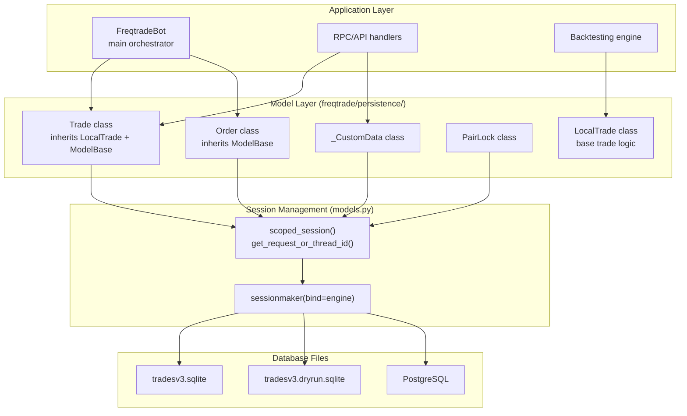
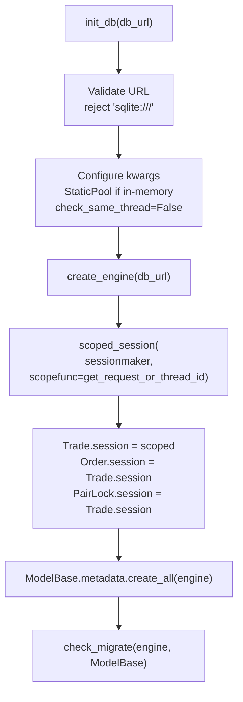
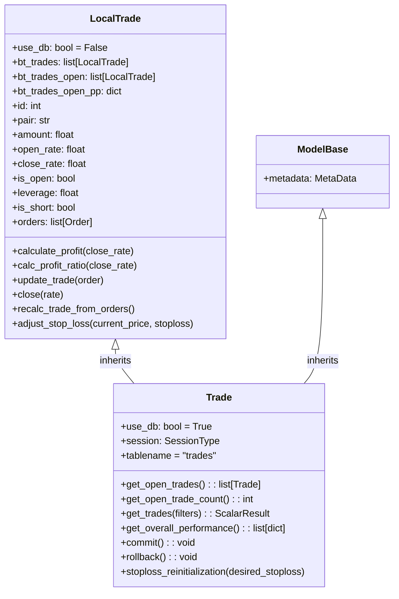
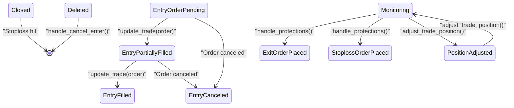
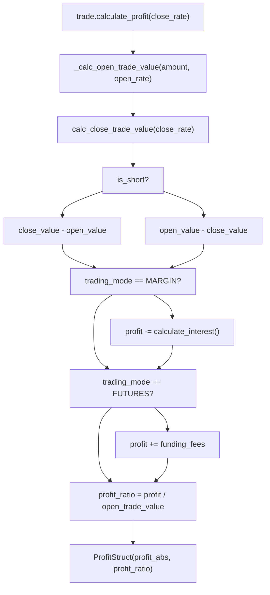
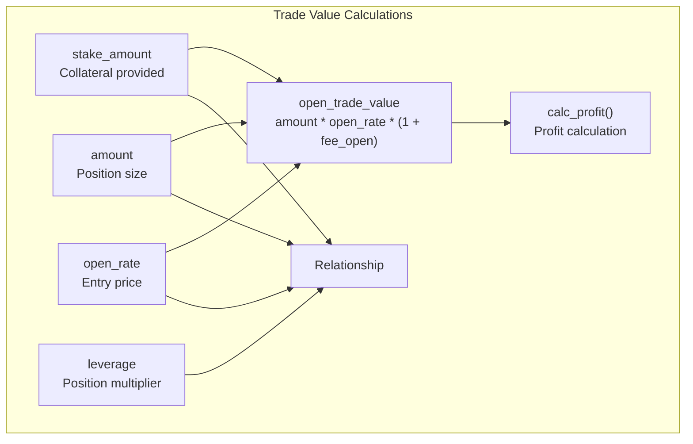
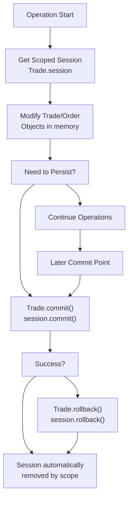
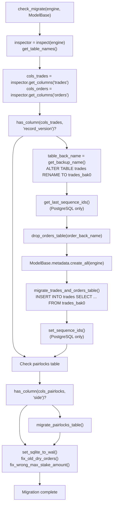

# Persistence Layer

Relevant source files

* [freqtrade/persistence/migrations.py](https://github.com/freqtrade/freqtrade/blob/8e91fea1/freqtrade/persistence/migrations.py)
* [freqtrade/persistence/models.py](https://github.com/freqtrade/freqtrade/blob/8e91fea1/freqtrade/persistence/models.py)
* [freqtrade/persistence/trade\_model.py](https://github.com/freqtrade/freqtrade/blob/8e91fea1/freqtrade/persistence/trade_model.py)
* [tests/conftest\_trades.py](https://github.com/freqtrade/freqtrade/blob/8e91fea1/tests/conftest_trades.py)
* [tests/persistence/test\_persistence.py](https://github.com/freqtrade/freqtrade/blob/8e91fea1/tests/persistence/test_persistence.py)

## Purpose and Scope

This document describes Freqtrade's persistence layer, which manages the storage and retrieval of trade and order data using SQLAlchemy ORM. The persistence layer is responsible for maintaining trade state, calculating profits across different trading modes (spot, margin, futures), and ensuring data consistency through database transactions and migrations.

For information about how the persistence layer is used by the main bot orchestrator, see [FreqtradeBot Core](/freqtrade/freqtrade/2.1-freqtradebot-core). For details on exchange-specific order handling, see [Exchange Integration](/freqtrade/freqtrade/2.3-strategy-interface-and-development).

## Database Architecture Overview

The persistence layer is built on SQLAlchemy ORM and supports multiple database backends (SQLite, PostgreSQL, MySQL). The architecture distinguishes between live trading with database persistence and backtesting with in-memory models.



**Sources:** [freqtrade/persistence/models.py47-98](https://github.com/freqtrade/freqtrade/blob/8e91fea1/freqtrade/persistence/models.py#L47-L98) [freqtrade/persistence/trade\_model.py65-1500](https://github.com/freqtrade/freqtrade/blob/8e91fea1/freqtrade/persistence/trade_model.py#L65-L1500) [freqtrade/persistence/base.py](https://github.com/freqtrade/freqtrade/blob/8e91fea1/freqtrade/persistence/base.py)

### Database Initialization

Database initialization occurs via `init_db(db_url)` in [freqtrade/persistence/models.py47-98](https://github.com/freqtrade/freqtrade/blob/8e91fea1/freqtrade/persistence/models.py#L47-L98) which sets up the SQLAlchemy engine and scoped sessions:



**Key implementation details:**

* **SQLite in-memory (`sqlite://`)**: Uses `StaticPool` to maintain persistent connection across requests [freqtrade/persistence/models.py61-66](https://github.com/freqtrade/freqtrade/blob/8e91fea1/freqtrade/persistence/models.py#L61-L66)
* **Thread safety**: SQLite connections use `check_same_thread=False` to allow multi-threaded access [freqtrade/persistence/models.py68-73](https://github.com/freqtrade/freqtrade/blob/8e91fea1/freqtrade/persistence/models.py#L68-L73)
* **Scoped sessions**: Use `get_request_or_thread_id()` as `scopefunc` to isolate sessions per FastAPI request or thread [freqtrade/persistence/models.py32-41](https://github.com/freqtrade/freqtrade/blob/8e91fea1/freqtrade/persistence/models.py#L32-L41) [freqtrade/persistence/models.py85-87](https://github.com/freqtrade/freqtrade/blob/8e91fea1/freqtrade/persistence/models.py#L85-L87)
* **Session assignment**: All model classes share the same scoped session factory [freqtrade/persistence/models.py85-90](https://github.com/freqtrade/freqtrade/blob/8e91fea1/freqtrade/persistence/models.py#L85-L90)

**Sources:** [freqtrade/persistence/models.py47-98](https://github.com/freqtrade/freqtrade/blob/8e91fea1/freqtrade/persistence/models.py#L47-L98) [freqtrade/freqtradebot.py107](https://github.com/freqtrade/freqtrade/blob/8e91fea1/freqtrade/freqtradebot.py#L107-L107)

## Trade Model Architecture

### LocalTrade vs Trade Distinction

Freqtrade uses two related classes for trade representation:

| Aspect | LocalTrade | Trade |
| --- | --- | --- |
| **Base class** | Plain Python class | Inherits from LocalTrade + ModelBase (SQLAlchemy) |
| **Use case** | Backtesting | Live trading, dry-run |
| **Storage** | In-memory lists: `bt_trades`, `bt_trades_open` | Database via SQLAlchemy session |
| **Performance** | Fast (no DB overhead) | Slower (DB writes) |
| **Session** | `use_db = False` | `use_db = True` |



**Sources:** [freqtrade/persistence/trade\_model.py381-467](https://github.com/freqtrade/freqtrade/blob/8e91fea1/freqtrade/persistence/trade_model.py#L381-L467) [freqtrade/persistence/trade\_model.py1443-1920](https://github.com/freqtrade/freqtrade/blob/8e91fea1/freqtrade/persistence/trade_model.py#L1443-L1920)

### Core Trade Fields

The `Trade` model contains comprehensive fields organized by category:

#### Identification and Basic Info

```
```
id: int                    # Primary key
exchange: str              # Exchange name (lowercase)
pair: str                  # Trading pair (e.g., "ETH/BTC")
base_currency: str         # Base currency extracted from pair
stake_currency: str        # Quote currency
strategy: str              # Strategy name that created trade
timeframe: int             # Timeframe in minutes
```
```

#### Position Details

```
```
is_open: bool              # Trade state
open_date: datetime        # Entry timestamp
close_date: datetime       # Exit timestamp (if closed)
amount: float              # Position size in base currency
amount_requested: float    # Original requested amount
stake_amount: float        # Collateral in stake currency
max_stake_amount: float    # Maximum stake used (DCA)
```
```

#### Entry/Exit Rates

```
```
open_rate: float           # Actual entry price
open_rate_requested: float # Requested entry price
close_rate: float          # Actual exit price
close_rate_requested: float # Requested exit price
```
```

#### Risk Management

```
```
stop_loss: float           # Absolute stop loss price
stop_loss_pct: float       # Stop loss percentage
initial_stop_loss: float   # Initial SL (for trailing)
initial_stop_loss_pct: float
is_stop_loss_trailing: bool
max_rate: float            # Highest price reached
min_rate: float            # Lowest price reached
```
```

#### Leverage and Margin (Futures/Margin Trading)

```
```
trading_mode: TradingMode  # SPOT, MARGIN, or FUTURES
leverage: float            # Position leverage (1.0 = no leverage)
is_short: bool             # Short position flag
liquidation_price: float   # Liquidation price
interest_rate: float       # Margin interest rate
funding_fees: float        # Total funding fees paid/received
funding_fee_running: float # Running funding fees (not finalized)
```
```

#### Fees

```
```
fee_open: float            # Entry fee rate
fee_open_cost: float       # Entry fee amount
fee_open_currency: str     # Currency of entry fee
fee_close: float           # Exit fee rate
fee_close_cost: float      # Exit fee amount
fee_close_currency: str    # Currency of exit fee
```
```

#### Exit Information

```
```
exit_reason: str           # Reason for exit (roi, stoploss, etc.)
exit_order_status: str     # Status of exit order
enter_tag: str             # Custom entry tag from strategy
```
```

#### Precision and Contract Information

```
```
amount_precision: float    # Exchange amount precision
price_precision: float     # Exchange price precision
precision_mode: int        # CCXT precision mode
precision_mode_price: int  # Price-specific precision mode
contract_size: float       # Contract size (futures)
```
```

**Sources:** [freqtrade/persistence/trade\_model.py381-466](https://github.com/freqtrade/freqtrade/blob/8e91fea1/freqtrade/persistence/trade_model.py#L381-L466) [freqtrade/persistence/trade\_model.py1503-1650](https://github.com/freqtrade/freqtrade/blob/8e91fea1/freqtrade/persistence/trade_model.py#L1503-L1650)

### Trade State Lifecycle



**Key state transitions:**

* **Entry creation:** `Trade()` constructor called with `is_open=True`, orders list initialized [freqtrade/freqtradebot.py863-1000](https://github.com/freqtrade/freqtrade/blob/8e91fea1/freqtrade/freqtradebot.py#L863-L1000)
* **Order updates:** `trade.update_trade(order)` processes order fills [freqtrade/persistence/trade\_model.py885-938](https://github.com/freqtrade/freqtrade/blob/8e91fea1/freqtrade/persistence/trade_model.py#L885-L938)
* **Monitoring:** `FreqtradeBot.process()` loop checks exit conditions each iteration [freqtrade/freqtradebot.py247-302](https://github.com/freqtrade/freqtrade/blob/8e91fea1/freqtrade/freqtradebot.py#L247-L302)
* **Exit:** `trade.close(rate)` sets `close_rate`, `is_open=False`, `close_date` [freqtrade/persistence/trade\_model.py940-954](https://github.com/freqtrade/freqtrade/blob/8e91fea1/freqtrade/persistence/trade_model.py#L940-L954)
* **Cancellation:** `handle_cancel_enter()` removes fully canceled entry trades [freqtrade/freqtradebot.py559-599](https://github.com/freqtrade/freqtrade/blob/8e91fea1/freqtrade/freqtradebot.py#L559-L599)

**Sources:** [freqtrade/persistence/trade\_model.py885-954](https://github.com/freqtrade/freqtrade/blob/8e91fea1/freqtrade/persistence/trade_model.py#L885-L954) [freqtrade/freqtradebot.py247-302](https://github.com/freqtrade/freqtrade/blob/8e91fea1/freqtrade/freqtradebot.py#L247-L302) [freqtrade/freqtradebot.py559-599](https://github.com/freqtrade/freqtrade/blob/8e91fea1/freqtrade/freqtradebot.py#L559-L599)

### Key Trade Properties

The `Trade` model provides computed properties for accessing related data:

#### Side and Direction Properties

```
```
@property
def entry_side(self) -> str:
    # Returns "sell" for shorts, "buy" for longs
    
@property
def exit_side(self) -> BuySell:
    # Returns "buy" for shorts, "sell" for longs
    
@property
def trade_direction(self) -> LongShort:
    # Returns "short" or "long"
```
```

#### Date Properties with UTC Timezone

```
```
@property
def open_date_utc(self) -> datetime:
    # open_date with UTC timezone
    
@property
def close_date_utc(self) -> datetime | None:
    # close_date with UTC timezone
    
@property
def date_last_filled_utc(self) -> datetime:
    # Date of last filled order
```
```

#### Order Access Properties

```
```
@property
def open_orders(self) -> list[Order]:
    # All open orders excluding stoploss
    
@property
def has_open_orders(self) -> bool:
    # True if any non-stoploss orders are open
    
@property
def open_sl_orders(self) -> list[Order]:
    # Open stoploss orders
```
```

**Sources:** [freqtrade/persistence/trade\_model.py545-620](https://github.com/freqtrade/freqtrade/blob/8e91fea1/freqtrade/persistence/trade_model.py#L545-L620)

## Order Model

The `Order` model represents individual exchange orders and maintains a one-to-many relationship with trades.

### Order Schema

```
#mermaid-h6m0xt99dcu{font-family:ui-sans-serif,-apple-system,system-ui,Segoe UI,Helvetica;font-size:16px;fill:#333;}@keyframes edge-animation-frame{from{stroke-dashoffset:0;}}@keyframes dash{to{stroke-dashoffset:0;}}#mermaid-h6m0xt99dcu .edge-animation-slow{stroke-dasharray:9,5!important;stroke-dashoffset:900;animation:dash 50s linear infinite;stroke-linecap:round;}#mermaid-h6m0xt99dcu .edge-animation-fast{stroke-dasharray:9,5!important;stroke-dashoffset:900;animation:dash 20s linear infinite;stroke-linecap:round;}#mermaid-h6m0xt99dcu .error-icon{fill:#dddddd;}#mermaid-h6m0xt99dcu .error-text{fill:#222222;stroke:#222222;}#mermaid-h6m0xt99dcu .edge-thickness-normal{stroke-width:1px;}#mermaid-h6m0xt99dcu .edge-thickness-thick{stroke-width:3.5px;}#mermaid-h6m0xt99dcu .edge-pattern-solid{stroke-dasharray:0;}#mermaid-h6m0xt99dcu .edge-thickness-invisible{stroke-width:0;fill:none;}#mermaid-h6m0xt99dcu .edge-pattern-dashed{stroke-dasharray:3;}#mermaid-h6m0xt99dcu .edge-pattern-dotted{stroke-dasharray:2;}#mermaid-h6m0xt99dcu .marker{fill:#999;stroke:#999;}#mermaid-h6m0xt99dcu .marker.cross{stroke:#999;}#mermaid-h6m0xt99dcu svg{font-family:ui-sans-serif,-apple-system,system-ui,Segoe UI,Helvetica;font-size:16px;}#mermaid-h6m0xt99dcu p{margin:0;}#mermaid-h6m0xt99dcu .entityBox{fill:#ffffff;stroke:#dddddd;}#mermaid-h6m0xt99dcu .relationshipLabelBox{fill:#dddddd;opacity:0.7;background-color:#dddddd;}#mermaid-h6m0xt99dcu .relationshipLabelBox rect{opacity:0.5;}#mermaid-h6m0xt99dcu .labelBkg{background-color:rgba(221, 221, 221, 0.5);}#mermaid-h6m0xt99dcu .edgeLabel .label{fill:#dddddd;font-size:14px;}#mermaid-h6m0xt99dcu .label{font-family:ui-sans-serif,-apple-system,system-ui,Segoe UI,Helvetica;color:#333;}#mermaid-h6m0xt99dcu .edge-pattern-dashed{stroke-dasharray:8,8;}#mermaid-h6m0xt99dcu .node rect,#mermaid-h6m0xt99dcu .node circle,#mermaid-h6m0xt99dcu .node ellipse,#mermaid-h6m0xt99dcu .node polygon{fill:#ffffff;stroke:#dddddd;stroke-width:1px;}#mermaid-h6m0xt99dcu .relationshipLine{stroke:#999;stroke-width:1;fill:none;}#mermaid-h6m0xt99dcu .marker{fill:none!important;stroke:#999!important;stroke-width:1;}#mermaid-h6m0xt99dcu :root{--mermaid-font-family:"trebuchet ms",verdana,arial,sans-serif;}

has many


Trade


int


id


PK


string


pair


float


amount


bool


is_open


datetime


open_date


Order


int


id


PK


int


ft_trade_id


FK


string


ft_order_side


buy/sell/stoploss


string


ft_pair


bool


ft_is_open


float


ft_amount


float


ft_price


string


order_id


Exchange order ID


string


status


open/closed/canceled


string


order_type


limit/market/stop_loss_limit


float


price


float


average


Average fill price


float


filled


Filled amount


float


remaining


float


cost


datetime


order_date


datetime


order_filled_date


float


ft_fee_base


Fee in base currency


string


ft_order_tag


Custom order tag
```

**Unique constraint:** `(ft_pair, order_id)` ensures no duplicate orders per pair [freqtrade/persistence/trade\_model.py83](https://github.com/freqtrade/freqtrade/blob/8e91fea1/freqtrade/persistence/trade_model.py#L83-L83)

### Order State Management

Orders track their lifecycle through status fields:

| Status | Meaning | `ft_is_open` |
| --- | --- | --- |
| `"open"` | Order placed, awaiting fill | `True` |
| `"closed"` | Order fully filled | `False` |
| `"canceled"` | Order canceled before fill | `False` |
| `"expired"` | Order expired (time-limited) | `False` |
| `"rejected"` | Order rejected by exchange | `False` |

**Status determination:** Uses CCXT constants `NON_OPEN_EXCHANGE_STATES` [freqtrade/persistence/trade\_model.py223-224](https://github.com/freqtrade/freqtrade/blob/8e91fea1/freqtrade/persistence/trade_model.py#L223-L224)

### CCXT Integration

The `Order` class synchronizes with CCXT exchange order objects through bidirectional conversion methods:

```mermaid
sequenceDiagram
  participant FreqtradeBot
  participant Order
  participant exchange.create_order()
  participant Trade.session

  FreqtradeBot->>exchange.create_order(): create_order(pair, type, side, amount)
  exchange.create_order()-->>FreqtradeBot: ccxt_order dict
  FreqtradeBot->>Order: Order.parse_from_ccxt_object(ccxt_order, pair, side)
  Order->>Order: Extract id, status, price, amount, filled
  FreqtradeBot->>Trade.session: trade.orders.append(order)
  note over FreqtradeBot,Trade.session: Later in process() loop
  FreqtradeBot->>exchange.create_order(): fetch_order(order_id)
  exchange.create_order()-->>FreqtradeBot: updated ccxt_order dict
  FreqtradeBot->>Order: order.update_from_ccxt_object(ccxt_order)
  Order->>Order: Update status, filled, remaining, order_filled_date
  Order->>Order: Set ft_is_open based on status
  FreqtradeBot->>Trade.session: Trade.commit()
```

**Key methods:**

* `Order.parse_from_ccxt_object(order, pair, side)`: Creates new Order instance from CCXT order dict [freqtrade/persistence/trade\_model.py341-362](https://github.com/freqtrade/freqtrade/blob/8e91fea1/freqtrade/persistence/trade_model.py#L341-L362)
* `order.update_from_ccxt_object(order)`: Updates Order fields from CCXT order dict, sets `ft_is_open`, updates timestamps [freqtrade/persistence/trade\_model.py197-230](https://github.com/freqtrade/freqtrade/blob/8e91fea1/freqtrade/persistence/trade_model.py#L197-L230)
* `order.to_ccxt_object(stopPriceName)`: Converts Order back to CCXT-compatible dict format [freqtrade/persistence/trade\_model.py231-257](https://github.com/freqtrade/freqtrade/blob/8e91fea1/freqtrade/persistence/trade_model.py#L231-L257)
* `Order.update_orders(orders, order)`: Static method to batch-update orders from CCXT response [freqtrade/persistence/trade\_model.py324-338](https://github.com/freqtrade/freqtrade/blob/8e91fea1/freqtrade/persistence/trade_model.py#L324-L338)

**Sources:** [freqtrade/persistence/trade\_model.py197-362](https://github.com/freqtrade/freqtrade/blob/8e91fea1/freqtrade/persistence/trade_model.py#L197-L362) [freqtrade/freqtradebot.py1200-1350](https://github.com/freqtrade/freqtrade/blob/8e91fea1/freqtrade/freqtradebot.py#L1200-L1350)

### Order Safe Properties

The Order model provides "safe" properties that handle null values:

```
```
@property
def safe_amount(self) -> float:
    # Returns amount or ft_amount (fallback)
    
@property
def safe_price(self) -> float:
    # Returns average > price > stop_price > ft_price
    
@property
def safe_filled(self) -> float:
    # Returns filled or 0.0
    
@property
def safe_cost(self) -> float:
    # Returns cost or 0.0
    
@property
def safe_remaining(self) -> float:
    # Calculates remaining amount
```
```

These properties prevent null pointer errors when orders are incomplete [freqtrade/persistence/trade\_model.py131-166](https://github.com/freqtrade/freqtrade/blob/8e91fea1/freqtrade/persistence/trade_model.py#L131-L166)

**Sources:** [freqtrade/persistence/trade\_model.py120-188](https://github.com/freqtrade/freqtrade/blob/8e91fea1/freqtrade/persistence/trade_model.py#L120-L188)

## Profit Calculations

Profit calculations vary significantly based on trading mode (spot, margin, futures) and position direction (long/short).

### Profit Calculation Flow



### Spot Trading Profit

For spot trading (no leverage), profit is straightforward:

```
# Long position
close_value = amount * close_rate * (1 - fee_close)
open_value = amount * open_rate * (1 + fee_open)
profit = close_value - open_value

# Profit ratio
profit_ratio = profit / open_value
```

**Implementation:** [freqtrade/persistence/trade\_model.py920-950](https://github.com/freqtrade/freqtrade/blob/8e91fea1/freqtrade/persistence/trade_model.py#L920-L950)

### Margin Trading Profit

Margin trading adds interest charges calculated via `trade.calculate_interest()`:

**Borrowed amount calculation:**

```
```
# For longs: borrow quote currency
if not is_short:
    borrowed = (amount * open_rate) * ((leverage - 1) / leverage)
# For shorts: borrow base currency  
else:
    borrowed = amount
```
```

[freqtrade/persistence/trade\_model.py491-503](https://github.com/freqtrade/freqtrade/blob/8e91fea1/freqtrade/persistence/trade_model.py#L491-L503)

**Interest calculation:**

```
```
hours = (close_date - open_date).total_seconds() / 3600

# Exchange-specific time period calculation
if exchange == "binance":
    time_periods = ceil(hours) / 24  # Daily rate
elif exchange == "kraken":
    time_periods = ceil(1 + hours / 4)  # 4-hour periods

interest = borrowed * interest_rate * time_periods
```
```

[freqtrade/leverage/interest.py](https://github.com/freqtrade/freqtrade/blob/8e91fea1/freqtrade/leverage/interest.py)

**Profit adjustment:**

```
```
# In trade.calculate_profit()
if trading_mode == TradingMode.MARGIN:
    total_interest = self.calculate_interest()
    profit -= total_interest
```
```

[freqtrade/persistence/trade\_model.py1110-1150](https://github.com/freqtrade/freqtrade/blob/8e91fea1/freqtrade/persistence/trade_model.py#L1110-L1150)

**Sources:** [freqtrade/persistence/trade\_model.py491-503](https://github.com/freqtrade/freqtrade/blob/8e91fea1/freqtrade/persistence/trade_model.py#L491-L503) [freqtrade/persistence/trade\_model.py1110-1150](https://github.com/freqtrade/freqtrade/blob/8e91fea1/freqtrade/persistence/trade_model.py#L1110-L1150) [freqtrade/leverage/interest.py](https://github.com/freqtrade/freqtrade/blob/8e91fea1/freqtrade/leverage/interest.py) [tests/persistence/test\_persistence.py177-279](https://github.com/freqtrade/freqtrade/blob/8e91fea1/tests/persistence/test_persistence.py#L177-L279)

### Futures Trading Profit

Futures trading includes funding fees tracked in `trade.funding_fees`:

**Funding fee accumulation:**

```
```
# In FreqtradeBot._update_funding_fees()
funding_fees = exchange.get_funding_fees(pair, amount, open_date)
trade.set_funding_fees(funding_fees)
# Updates trade.funding_fees and trade.funding_fee_running
```
```

[freqtrade/freqtradebot.py367-378](https://github.com/freqtrade/freqtrade/blob/8e91fea1/freqtrade/freqtradebot.py#L367-L378)

**Profit adjustment in `calculate_profit()`:**

```
```
if trading_mode == TradingMode.FUTURES:
    # Funding fees already include sign (+ for shorts receiving, - for longs paying)
    profit += self.funding_fees
```
```

[freqtrade/persistence/trade\_model.py1020-1080](https://github.com/freqtrade/freqtrade/blob/8e91fea1/freqtrade/persistence/trade_model.py#L1020-L1080)

**Funding fee transfer on order fill:**

```
```
# In trade.update_trade(order)
if order.ft_order_side != "stoploss":
    order.funding_fee = self.funding_fee_running
    self.funding_fee_running = 0.0
```
```

[freqtrade/persistence/trade\_model.py897-900](https://github.com/freqtrade/freqtrade/blob/8e91fea1/freqtrade/persistence/trade_model.py#L897-L900)

**Funding fee specifics:**

* Calculated by exchange API based on mark price
* Charged at fixed intervals (typically 8 hours for perpetual futures)
* Positive value = trader receives funding (shorts in positive funding rate market)
* Negative value = trader pays funding (longs in positive funding rate market)

**Sources:** [freqtrade/persistence/trade\_model.py794-803](https://github.com/freqtrade/freqtrade/blob/8e91fea1/freqtrade/persistence/trade_model.py#L794-L803) [freqtrade/persistence/trade\_model.py897-900](https://github.com/freqtrade/freqtrade/blob/8e91fea1/freqtrade/persistence/trade_model.py#L897-L900) [freqtrade/persistence/trade\_model.py1020-1080](https://github.com/freqtrade/freqtrade/blob/8e91fea1/freqtrade/persistence/trade_model.py#L1020-L1080) [freqtrade/freqtradebot.py367-378](https://github.com/freqtrade/freqtrade/blob/8e91fea1/freqtrade/freqtradebot.py#L367-L378)

### Profit Ratio Calculation

Profit ratio normalizes profit relative to stake:

```
```
# For long positions
profit_ratio = profit_abs / open_trade_value

# For short positions  
profit_ratio = profit_abs / stake_amount

# open_trade_value includes fees and leverage
open_trade_value = amount * open_rate * (1 + fee_open) / leverage
```
```

This ratio is used for:

* Strategy callbacks (`custom_exit`, `custom_stoploss`)
* ROI threshold checks
* Performance metrics

**Sources:** [freqtrade/persistence/trade\_model.py950-1000](https://github.com/freqtrade/freqtrade/blob/8e91fea1/freqtrade/persistence/trade_model.py#L950-L1000)

### Trade Value Properties



**Key relationships:**

* `stake_amount` = collateral provided by trader
* `amount` = position size (stake\_amount \* leverage / open\_rate)
* `open_trade_value` = total position value including fees

**Sources:** [freqtrade/persistence/trade\_model.py885-920](https://github.com/freqtrade/freqtrade/blob/8e91fea1/freqtrade/persistence/trade_model.py#L885-L920)

## Database Queries

The Trade model provides class methods for common queries:

### Query Methods Table

| Method | Purpose | Returns | Index Used |
| --- | --- | --- | --- |
| `get_open_trades()` | All open trades | `list[Trade]` | `is_open=True` |
| `get_open_trade_count()` | Count of open trades | `int` | `is_open=True` |
| `get_trades()` | Filtered trades with conditions | `ScalarResult[Trade]` | Various |
| `get_trades_proxy()` | Trades with lazy loading | `Sequence[Trade]` | Various |
| `get_closed_trades()` | All closed trades | `ScalarResult[Trade]` | `is_open=False` |
| `get_overall_performance()` | Per-pair performance | `list[dict]` | Aggregate query |
| `get_best_pair()` | Best performing pair | `dict` | Aggregate query |
| `get_total_closed_profit()` | Total profit | `float` | Sum aggregation |

**Example query implementation:**

```
```
@staticmethod
def get_open_trades() -> list["Trade"]:
    """
    Query all open trades.
    """
    return Trade.session.scalars(
        select(Trade).filter(Trade.is_open.is_(True))
    ).all()
```
```

**Sources:** [freqtrade/persistence/trade\_model.py1650-1850](https://github.com/freqtrade/freqtrade/blob/8e91fea1/freqtrade/persistence/trade_model.py#L1650-L1850)

### Query Optimization

The schema includes indexes on frequently queried fields:

```
```
# Primary indexes
id: int = mapped_column(Integer, primary_key=True)

# Query indexes  
is_open: Mapped[bool] = mapped_column(nullable=False, index=True, default=True)
open_date: Mapped[datetime] = mapped_column(nullable=False, index=True, default=dt_now)
close_date: Mapped[datetime | None] = mapped_column(nullable=True)

# Order relationship index
ft_trade_id: Mapped[int] = mapped_column(Integer, ForeignKey("trades.id"), index=True)
```
```

**Sources:** [freqtrade/persistence/trade\_model.py1503-1650](https://github.com/freqtrade/freqtrade/blob/8e91fea1/freqtrade/persistence/trade_model.py#L1503-L1650)

## Transaction Management

### Session Lifecycle



**Commit points in FreqtradeBot:**

1. After processing all exits: [freqtrade/freqtradebot.py288](https://github.com/freqtrade/freqtrade/blob/8e91fea1/freqtrade/freqtradebot.py#L288-L288)
2. After processing entries: [freqtrade/freqtradebot.py299](https://github.com/freqtrade/freqtrade/blob/8e91fea1/freqtrade/freqtradebot.py#L299-L299)
3. After startup updates: [freqtrade/freqtradebot.py244](https://github.com/freqtrade/freqtrade/blob/8e91fea1/freqtrade/freqtradebot.py#L244-L244)
4. On cleanup: [freqtrade/freqtradebot.py221](https://github.com/freqtrade/freqtrade/blob/8e91fea1/freqtrade/freqtradebot.py#L221-L221)

**Sources:** [freqtrade/persistence/trade\_model.py1890-1920](https://github.com/freqtrade/freqtrade/blob/8e91fea1/freqtrade/persistence/trade_model.py#L1890-L1920) [freqtrade/freqtradebot.py197-226](https://github.com/freqtrade/freqtrade/blob/8e91fea1/freqtrade/freqtradebot.py#L197-L226)

### Rollback Handling

The session can be rolled back on errors:

```
```
try:
    # Modify trades
    trade.close_date = dt_now()
    Trade.commit()
except Exception:
    Trade.rollback()
    raise
```
```

**Automatic rollback:** In RPC/API context, wrapped by `custom_data_rpc_wrapper()` [freqtrade/persistence/models.py100-116](https://github.com/freqtrade/freqtrade/blob/8e91fea1/freqtrade/persistence/models.py#L100-L116)

**Sources:** [freqtrade/persistence/models.py100-116](https://github.com/freqtrade/freqtrade/blob/8e91fea1/freqtrade/persistence/models.py#L100-L116) [freqtrade/persistence/trade\_model.py1890-1920](https://github.com/freqtrade/freqtrade/blob/8e91fea1/freqtrade/persistence/trade_model.py#L1890-L1920)

## Schema Migrations

Freqtrade uses manual migration logic to handle schema changes between versions.

### Migration Architecture



**Sources:** [freqtrade/persistence/migrations.py353-410](https://github.com/freqtrade/freqtrade/blob/8e91fea1/freqtrade/persistence/migrations.py#L353-L410) [freqtrade/persistence/migrations.py74-223](https://github.com/freqtrade/freqtrade/blob/8e91fea1/freqtrade/persistence/migrations.py#L74-L223)

### Column Migration Logic

The migration handles missing columns with default values:

```
```
# Example from migrate_trades_and_orders_table
base_currency = get_column_def(cols, "base_currency", "null")
stake_currency = get_column_def(cols, "stake_currency", "null")
fee_open = get_column_def(cols, "fee_open", "fee")
leverage = get_column_def(cols, "leverage", "1.0")
is_short = get_column_def(cols, "is_short", "0")  # SQLite boolean
funding_fees = get_column_def(cols, "funding_fees", "0.0")
```
```

**Migration SQL example:**

```
```
INSERT INTO trades (
    id, exchange, pair, base_currency, stake_currency,
    leverage, is_short, funding_fees, ...
)
SELECT 
    id, lower(exchange), pair, 
    null base_currency,  -- Added in later version
    null stake_currency,  -- Added in later version
    1.0 leverage,  -- Default for old trades
    0 is_short,  -- Default: long positions
    0.0 funding_fees,  -- Default: no funding
    ...
FROM trades_bak0
```
```

**Sources:** [freqtrade/persistence/migrations.py74-223](https://github.com/freqtrade/freqtrade/blob/8e91fea1/freqtrade/persistence/migrations.py#L74-L223)

### Exit Reason Rename Migration

Historical rename of exit reasons is handled during migration:

```
```
# In migrate_trades_and_orders_table SQL
case when {exit_reason} = 'sell_signal' then 'exit_signal'
     when {exit_reason} = 'custom_sell' then 'custom_exit'
     when {exit_reason} = 'force_sell' then 'force_exit'
     when {exit_reason} = 'emergency_sell' then 'emergency_exit'
     else {exit_reason}
end exit_reason
```
```

This ensures backward compatibility with older database versions [freqtrade/persistence/migrations.py199-204](https://github.com/freqtrade/freqtrade/blob/8e91fea1/freqtrade/persistence/migrations.py#L199-L204)

**Sources:** [freqtrade/persistence/migrations.py199-204](https://github.com/freqtrade/freqtrade/blob/8e91fea1/freqtrade/persistence/migrations.py#L199-L204)

## Usage Patterns in FreqtradeBot

### Creating a New Trade

```mermaid
sequenceDiagram
  participant FreqtradeBot
  participant IStrategy
  participant Trade
  participant Order
  participant exchange.create_order()
  participant Trade.session

  FreqtradeBot->>IStrategy: get_entry_signal(pair, df)
  IStrategy-->>FreqtradeBot: SignalDirection.LONG / SHORT
  FreqtradeBot->>FreqtradeBot: stake_amount = get_trade_stake_amount()
  FreqtradeBot->>IStrategy: confirm_trade_entry(pair, order_type, amount, rate)
  IStrategy-->>FreqtradeBot: True (confirmed)
  FreqtradeBot->>exchange.create_order(): create_order(pair, 'limit', side, amount, rate)
  exchange.create_order()-->>FreqtradeBot: order_dict
  FreqtradeBot->>Trade: trade = Trade(pair=pair, stake_amount=stake, open_rate=rate, ...)
  FreqtradeBot->>Order: order = Order.parse_from_ccxt_object(order_dict, pair, side)
  FreqtradeBot->>Trade: trade.orders.append(order)
  FreqtradeBot->>Trade.session: Trade.session.add(trade)
  note over FreqtradeBot,Trade.session: Trade in session, not yet persisted
  FreqtradeBot->>FreqtradeBot: Process other pairs...
  FreqtradeBot->>Trade.session: Trade.commit()
  note over Trade.session: All trades persisted to database
```

**Key steps in `execute_entry()` [freqtrade/freqtradebot.py863-1000](https://github.com/freqtrade/freqtrade/blob/8e91fea1/freqtrade/freqtradebot.py#L863-L1000):**

1. Calculate stake amount via `get_trade_stake_amount()`
2. Get entry confirmation from strategy via `confirm_trade_entry()`
3. Create exchange order via `exchange.create_order()`
4. Construct `Trade` object with initial values
5. Parse order into `Order` object via `Order.parse_from_ccxt_object()`
6. Append order to `trade.orders` list
7. Add trade to session via `Trade.session.add(trade)`
8. Continue processing, commit later via `Trade.commit()`

**Sources:** [freqtrade/freqtradebot.py863-1000](https://github.com/freqtrade/freqtrade/blob/8e91fea1/freqtrade/freqtradebot.py#L863-L1000)

### Updating Trade State

```mermaid
sequenceDiagram
  participant FreqtradeBot
  participant Trade
  participant Order
  participant exchange.fetch_order()
  participant Trade.session

  loop [Order status changed to filled]
    FreqtradeBot->>Trade: Trade.get_open_trades()
    Trade-->>FreqtradeBot: list[Trade]
    FreqtradeBot->>FreqtradeBot: update_trade_state(trade)
    FreqtradeBot->>Order: order = trade.select_order(entry_side, is_open=True)
    FreqtradeBot->>exchange.fetch_order(): fetch_order(order.order_id)
    exchange.fetch_order()-->>FreqtradeBot: ccxt_order
    FreqtradeBot->>Order: order.update_from_ccxt_object(ccxt_order)
    FreqtradeBot->>Trade: trade.update_trade(order)
    Trade->>Trade: recalc_trade_from_orders()
    Trade->>Trade: adjust_stop_loss(open_rate, stoploss_pct)
    FreqtradeBot->>FreqtradeBot: handle_protections(trade)
    FreqtradeBot->>FreqtradeBot: Check exit conditions
    FreqtradeBot->>FreqtradeBot: execute_trade_exit(trade)
    FreqtradeBot->>exchange.fetch_order(): create_order(exit)
    FreqtradeBot->>Order: exit_order = Order.parse_from_ccxt_object()
    FreqtradeBot->>Trade: trade.orders.append(exit_order)
    FreqtradeBot->>Trade.session: Trade.commit()
  end
```

**Key methods:**

* `update_trade_state(trade)`: Fetches order updates from exchange, calls `trade.update_trade(order)` [freqtrade/freqtradebot.py1200-1350](https://github.com/freqtrade/freqtrade/blob/8e91fea1/freqtrade/freqtradebot.py#L1200-L1350)
* `trade.update_trade(order)`: Updates trade amounts/rates from order, calls `recalc_trade_from_orders()` [freqtrade/persistence/trade\_model.py885-938](https://github.com/freqtrade/freqtrade/blob/8e91fea1/freqtrade/persistence/trade_model.py#L885-L938)
* `trade.recalc_trade_from_orders()`: Recalculates `amount`, `stake_amount`, `open_rate` from filled orders [freqtrade/persistence/trade\_model.py735-786](https://github.com/freqtrade/freqtrade/blob/8e91fea1/freqtrade/persistence/trade_model.py#L735-L786)
* `trade.adjust_stop_loss(current_price, stoploss)`: Updates `stop_loss`, `initial_stop_loss`, handles trailing [freqtrade/persistence/trade\_model.py814-883](https://github.com/freqtrade/freqtrade/blob/8e91fea1/freqtrade/persistence/trade_model.py#L814-L883)

**Sources:** [freqtrade/freqtradebot.py247-302](https://github.com/freqtrade/freqtrade/blob/8e91fea1/freqtrade/freqtradebot.py#L247-L302) [freqtrade/freqtradebot.py1200-1350](https://github.com/freqtrade/freqtrade/blob/8e91fea1/freqtrade/freqtradebot.py#L1200-L1350) [freqtrade/persistence/trade\_model.py735-938](https://github.com/freqtrade/freqtrade/blob/8e91fea1/freqtrade/persistence/trade_model.py#L735-L938)

### Querying Trade History

The persistence layer is frequently queried by RPC/API endpoints:

```
```
# Get all open trades
trades = Trade.get_open_trades()

# Get trades with filters
trades = Trade.get_trades([
    Trade.is_open.is_(False),
    Trade.close_date >= start_date
]).all()

# Get aggregate statistics  
performance = Trade.get_overall_performance()
# Returns: [{'pair': 'ETH/BTC', 'profit': 0.05, 'count': 10}, ...]

total_profit = Trade.get_total_closed_profit()
```
```

**RPC usage example:** [freqtrade/rpc/rpc.py](https://github.com/freqtrade/freqtrade/blob/8e91fea1/freqtrade/rpc/rpc.py) extensively queries trades for status, profit, and performance data.

**Sources:** [freqtrade/persistence/trade\_model.py1650-1850](https://github.com/freqtrade/freqtrade/blob/8e91fea1/freqtrade/persistence/trade_model.py#L1650-L1850) [freqtrade/rpc/rpc.py](https://github.com/freqtrade/freqtrade/blob/8e91fea1/freqtrade/rpc/rpc.py)

## Dry-Run vs Live Database

Freqtrade maintains separate database files for dry-run and live trading to prevent data contamination:

| Mode | Database File | Purpose | `use_db` |
| --- | --- | --- | --- |
| Live | `tradesv3.sqlite` | Real trading data | `True` |
| Dry-run | `tradesv3.dryrun.sqlite` | Simulated trading data | `True` |
| Backtesting | In-memory (no file) | Historical simulation | `False` |

**Database file selection logic:**

```
```
# In FreqtradeBot.__init__()
if config.get('dry_run'):
    db_url = config['db_url'].replace('tradesv3.sqlite', 'tradesv3.dryrun.sqlite')
else:
    db_url = config['db_url']

init_db(db_url)
Trade.use_db = True
```
```

[freqtrade/freqtradebot.py107](https://github.com/freqtrade/freqtrade/blob/8e91fea1/freqtrade/freqtradebot.py#L107-L107)

**Use cases:**

* **Live mode**: Writes to `tradesv3.sqlite` for production trade tracking
* **Dry-run mode**: Writes to `tradesv3.dryrun.sqlite` for paper trading without affecting live database
* **Backtesting mode**: Uses `LocalTrade` class with `use_db=False`, stores trades in `LocalTrade.bt_trades` list [freqtrade/persistence/trade\_model.py387-395](https://github.com/freqtrade/freqtrade/blob/8e91fea1/freqtrade/persistence/trade_model.py#L387-L395)

This separation allows running dry-run and live instances simultaneously without database conflicts.

**Sources:** [freqtrade/freqtradebot.py107](https://github.com/freqtrade/freqtrade/blob/8e91fea1/freqtrade/freqtradebot.py#L107-L107) [freqtrade/persistence/trade\_model.py387-395](https://github.com/freqtrade/freqtrade/blob/8e91fea1/freqtrade/persistence/trade_model.py#L387-L395)

## Performance Considerations

### Index Usage

Critical indexes for query performance:

```
```
# Fast trade lookups
is_open: index=True              # get_open_trades()
open_date: index=True            # Date-range queries
pair: String(25)                 # Per-pair queries

# Fast order lookups
ft_trade_id: ForeignKey, index=True  # Orders for trade
ft_is_open: index=True           # Open orders query
order_id: String(255), index=True # Fetch by exchange ID

# Unique constraint also acts as index
(ft_pair, order_id): UniqueConstraint  # Duplicate prevention
```
```

**Sources:** [freqtrade/persistence/trade\_model.py1503-1650](https://github.com/freqtrade/freqtrade/blob/8e91fea1/freqtrade/persistence/trade_model.py#L1503-L1650) [freqtrade/persistence/trade\_model.py65-100](https://github.com/freqtrade/freqtrade/blob/8e91fea1/freqtrade/persistence/trade_model.py#L65-L100)

### Session Management Best Practices

```
```
# ✅ Good: Batch commits
for pair in pairs:
    create_trade(pair)
Trade.commit()  # Single commit at end

# ❌ Bad: Commit per operation  
for pair in pairs:
    create_trade(pair)
    Trade.commit()  # Multiple commits

# ✅ Good: Use scoped session (automatic cleanup)
def rpc_handler():
    trades = Trade.get_open_trades()
    # Session automatically removed at end of scope
    
# ✅ Good: Explicit rollback on error
try:
    modify_trades()
    Trade.commit()
except Exception:
    Trade.rollback()
    raise
```
```

**Sources:** [freqtrade/freqtradebot.py247-302](https://github.com/freqtrade/freqtrade/blob/8e91fea1/freqtrade/freqtradebot.py#L247-L302) [freqtrade/persistence/models.py100-116](https://github.com/freqtrade/freqtrade/blob/8e91fea1/freqtrade/persistence/models.py#L100-L116)

### LocalTrade Performance

Backtesting uses `LocalTrade` for performance:

| Aspect | LocalTrade | Trade |
| --- | --- | --- |
| Storage | Python lists | SQLAlchemy session |
| Write speed | Instant (memory) | ~1ms per commit |
| Query speed | List iteration | SQL query overhead |
| Memory usage | All in RAM | Paginated from disk |

**Backtesting optimization:** Uses `LocalTrade.add_bt_trade()` to avoid DB overhead during simulation [freqtrade/persistence/trade\_model.py1366-1380](https://github.com/freqtrade/freqtrade/blob/8e91fea1/freqtrade/persistence/trade_model.py#L1366-L1380)

**Sources:** [freqtrade/persistence/trade\_model.py381-467](https://github.com/freqtrade/freqtrade/blob/8e91fea1/freqtrade/persistence/trade_model.py#L381-L467) [freqtrade/optimize/backtesting.py](https://github.com/freqtrade/freqtrade/blob/8e91fea1/freqtrade/optimize/backtesting.py)