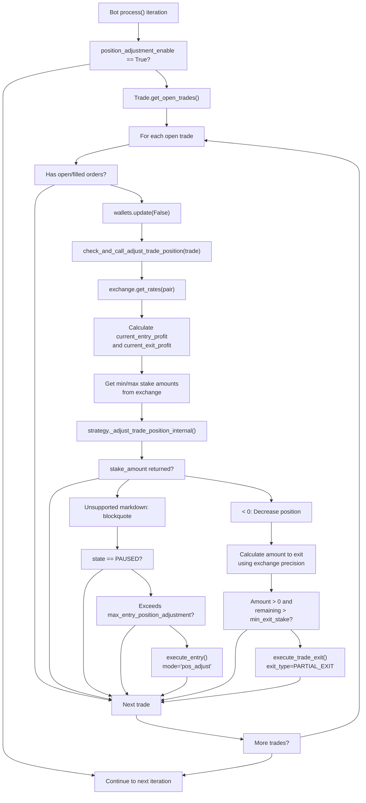
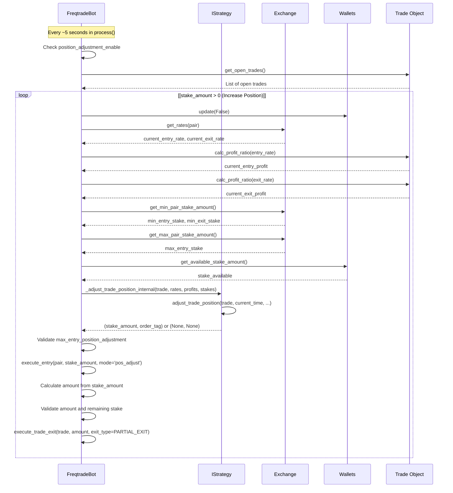
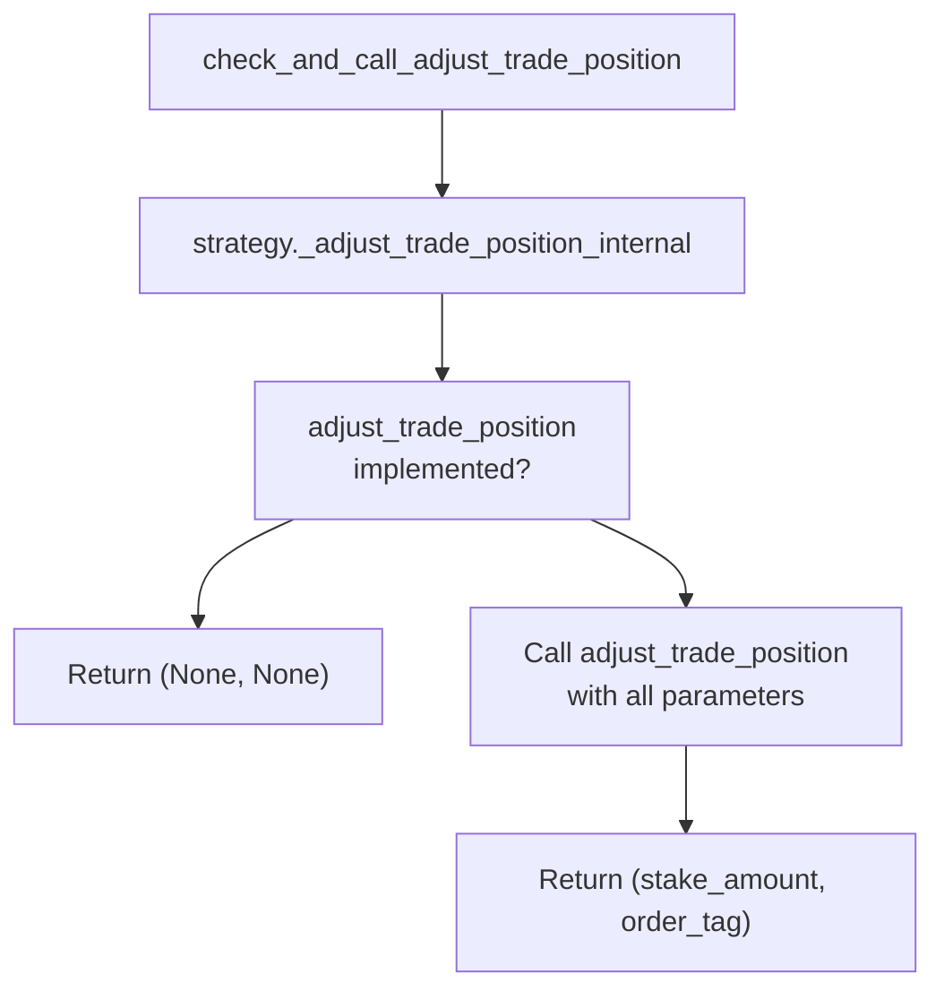
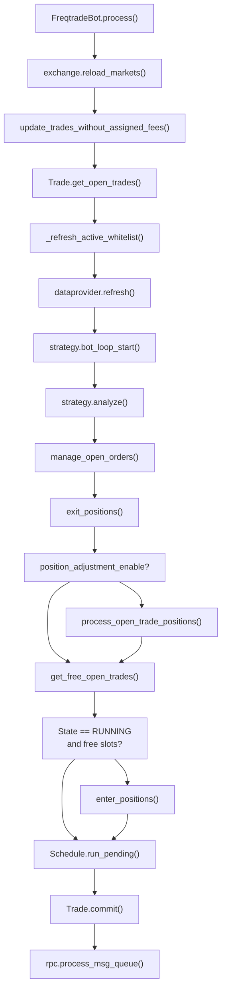

# Position Adjustment and DCA

Relevant source files

* [docs/bot-basics.md](https://github.com/freqtrade/freqtrade/blob/8e91fea1/docs/bot-basics.md)
* [docs/strategy-advanced.md](https://github.com/freqtrade/freqtrade/blob/8e91fea1/docs/strategy-advanced.md)
* [docs/strategy-callbacks.md](https://github.com/freqtrade/freqtrade/blob/8e91fea1/docs/strategy-callbacks.md)
* [docs/strategy-customization.md](https://github.com/freqtrade/freqtrade/blob/8e91fea1/docs/strategy-customization.md)
* [docs/strategy\_migration.md](https://github.com/freqtrade/freqtrade/blob/8e91fea1/docs/strategy_migration.md)
* [freqtrade/enums/exittype.py](https://github.com/freqtrade/freqtrade/blob/8e91fea1/freqtrade/enums/exittype.py)
* [freqtrade/exchange/binance.py](https://github.com/freqtrade/freqtrade/blob/8e91fea1/freqtrade/exchange/binance.py)
* [freqtrade/exchange/exchange.py](https://github.com/freqtrade/freqtrade/blob/8e91fea1/freqtrade/exchange/exchange.py)
* [freqtrade/exchange/kraken.py](https://github.com/freqtrade/freqtrade/blob/8e91fea1/freqtrade/exchange/kraken.py)
* [freqtrade/freqtradebot.py](https://github.com/freqtrade/freqtrade/blob/8e91fea1/freqtrade/freqtradebot.py)
* [freqtrade/strategy/\_\_init\_\_.py](https://github.com/freqtrade/freqtrade/blob/8e91fea1/freqtrade/strategy/__init__.py)
* [freqtrade/strategy/informative\_decorator.py](https://github.com/freqtrade/freqtrade/blob/8e91fea1/freqtrade/strategy/informative_decorator.py)
* [freqtrade/strategy/interface.py](https://github.com/freqtrade/freqtrade/blob/8e91fea1/freqtrade/strategy/interface.py)
* [freqtrade/strategy/strategy\_helper.py](https://github.com/freqtrade/freqtrade/blob/8e91fea1/freqtrade/strategy/strategy_helper.py)
* [freqtrade/templates/strategy\_subtemplates/strategy\_methods\_advanced.j2](https://github.com/freqtrade/freqtrade/blob/8e91fea1/freqtrade/templates/strategy_subtemplates/strategy_methods_advanced.j2)
* [tests/conftest.py](https://github.com/freqtrade/freqtrade/blob/8e91fea1/tests/conftest.py)
* [tests/exchange/test\_binance.py](https://github.com/freqtrade/freqtrade/blob/8e91fea1/tests/exchange/test_binance.py)
* [tests/exchange/test\_exchange.py](https://github.com/freqtrade/freqtrade/blob/8e91fea1/tests/exchange/test_exchange.py)
* [tests/exchange/test\_kraken.py](https://github.com/freqtrade/freqtrade/blob/8e91fea1/tests/exchange/test_kraken.py)
* [tests/strategy/strats/informative\_decorator\_strategy.py](https://github.com/freqtrade/freqtrade/blob/8e91fea1/tests/strategy/strats/informative_decorator_strategy.py)
* [tests/strategy/test\_strategy\_helpers.py](https://github.com/freqtrade/freqtrade/blob/8e91fea1/tests/strategy/test_strategy_helpers.py)

## Purpose and Scope

This document describes the Position Adjustment system in Freqtrade, which allows strategies to dynamically modify existing open positions by either increasing the position size (Dollar Cost Averaging / DCA) or decreasing it (partial exits). This functionality enables advanced position management beyond the initial entry.

For information about initial trade entry logic, see [Order Execution and Pricing](/freqtrade/freqtrade/2.6-order-execution-and-pricing). For custom exit signals that close entire positions, see [Strategy Callbacks and Customization](/freqtrade/freqtrade/5.2-strategy-callbacks-and-customization).

---

## System Overview

Position adjustment is an optional feature that must be explicitly enabled in the strategy. When enabled, Freqtrade periodically evaluates open trades and calls the strategy's `adjust_trade_position()` callback, which can return a stake amount to either:

* **Increase the position** (positive stake amount): Add to the existing position, averaging the entry price
* **Decrease the position** (negative stake amount): Partially exit the position, realizing profit or loss on the sold portion

The system operates independently of the normal entry/exit signal logic and runs on every bot iteration for positions that have open or recently filled orders.

**Key Characteristics:**

| Aspect | Description |
| --- | --- |
| Execution Frequency | Every bot iteration (~5 seconds) for qualifying trades |
| Control Flag | `position_adjustment_enable` (default: `False`) |
| Max Adjustments | Controlled by `max_entry_position_adjustment` (default: `-1` = unlimited) |
| Applies To | Open trades with filled or open orders |
| Interaction | Works alongside normal entry/exit logic |

Sources: [freqtrade/freqtradebot.py290-293](https://github.com/freqtrade/freqtrade/blob/8e91fea1/freqtrade/freqtradebot.py#L290-L293) [freqtrade/strategy/interface.py116-118](https://github.com/freqtrade/freqtrade/blob/8e91fea1/freqtrade/strategy/interface.py#L116-L118)

---

## Configuration and Enabling

### Strategy-Level Configuration

Position adjustment is disabled by default and must be enabled in the strategy class:

```
```
class MyStrategy(IStrategy):
    position_adjustment_enable = True
    max_entry_position_adjustment = -1  # -1 for unlimited, or set a specific limit
```
```

**Configuration Parameters:**

| Parameter | Type | Default | Description |
| --- | --- | --- | --- |
| `position_adjustment_enable` | `bool` | `False` | Master switch for position adjustment feature |
| `max_entry_position_adjustment` | `int` | `-1` | Maximum number of position increases allowed (`-1` = unlimited) |

The `max_entry_position_adjustment` limit only applies to position increases (DCA), not to partial exits (position decreases).

Sources: [freqtrade/strategy/interface.py116-118](https://github.com/freqtrade/freqtrade/blob/8e91fea1/freqtrade/strategy/interface.py#L116-L118) [freqtrade/freqtradebot.py777-783](https://github.com/freqtrade/freqtrade/blob/8e91fea1/freqtrade/freqtradebot.py#L777-L783)

---

## Execution Flow

### High-Level Process Flow



**Key Decision Points:**

1. **Position Adjustment Enabled Check** ([line 291](https://github.com/freqtrade/freqtrade/blob/8e91fea1/line 291)): Only proceeds if `strategy.position_adjustment_enable` is `True`
2. **Trade Qualification** ([line 724](https://github.com/freqtrade/freqtrade/blob/8e91fea1/line 724)): Trade must have open position or open orders
3. **State Check** ([line 772-774](https://github.com/freqtrade/freqtrade/blob/8e91fea1/line 772-774)): Aborts position increase if bot is in PAUSED state
4. **Max Entries Check** ([line 777-781](https://github.com/freqtrade/freqtrade/blob/8e91fea1/line 777-781)): For increases, validates against `max_entry_position_adjustment`
5. **Amount Validation** ([line 808-821](https://github.com/freqtrade/freqtrade/blob/8e91fea1/line 808-821)): For decreases, ensures remaining position meets minimum stake requirements

Sources: [freqtrade/freqtradebot.py291-293](https://github.com/freqtrade/freqtrade/blob/8e91fea1/freqtrade/freqtradebot.py#L291-L293) [freqtrade/freqtradebot.py716-829](https://github.com/freqtrade/freqtrade/blob/8e91fea1/freqtrade/freqtradebot.py#L716-L829)

### Detailed Call Sequence



Sources: [freqtrade/freqtradebot.py716-829](https://github.com/freqtrade/freqtrade/blob/8e91fea1/freqtrade/freqtradebot.py#L716-L829)

---

## The adjust\_trade\_position Callback

### Callback Signature

The `adjust_trade_position()` method is the strategy's interface to the position adjustment system. It receives comprehensive information about the current trade state and market conditions.

```
```
def adjust_trade_position(
    self,
    trade: Trade,
    current_time: datetime,
    current_rate: float,
    current_profit: float,
    min_stake: float | None,
    max_stake: float,
    current_entry_rate: float,
    current_exit_rate: float,
    current_entry_profit: float,
    current_exit_profit: float,
    **kwargs
) -> tuple[float | None, str | None]:
    """
    Returns: (stake_amount, order_tag)
    - stake_amount: 
        - Positive: Amount to add to position
        - Negative: Stake value to remove from position
        - None: No adjustment
    - order_tag: Optional tag for the adjustment order
    """
```
```

### Parameter Details

| Parameter | Type | Description |
| --- | --- | --- |
| `trade` | `Trade` | Trade object with full position information |
| `current_time` | `datetime` | Current timestamp (use this, not `datetime.now()`) |
| `current_rate` | `float` | Alias for `current_entry_rate` (for backwards compatibility) |
| `current_profit` | `float` | Alias for `current_entry_profit` (for backwards compatibility) |
| `min_stake` | `float | None` | Minimum stake amount for entry (from exchange limits) |
| `max_stake` | `float` | Maximum stake amount (min of exchange limit and available balance) |
| `current_entry_rate` | `float` | Current entry price (bid for long, ask for short) |
| `current_exit_rate` | `float` | Current exit price (ask for long, bid for short) |
| `current_entry_profit` | `float` | Profit ratio if entered at `current_entry_rate` |
| `current_exit_profit` | `float` | Profit ratio if exited at `current_exit_rate` |

**Return Values:**

* `(None, None)`: No adjustment desired
* `(positive_float, tag)`: Increase position by stake amount
* `(negative_float, tag)`: Decrease position by stake value

Sources: [freqtrade/strategy/interface.py541-597](https://github.com/freqtrade/freqtrade/blob/8e91fea1/freqtrade/strategy/interface.py#L541-L597)

### Internal Wrapper

The callback is invoked through `_adjust_trade_position_internal()`, which provides the backward compatibility layer and parameter mapping:



Sources: [freqtrade/strategy/interface.py598-642](https://github.com/freqtrade/freqtrade/blob/8e91fea1/freqtrade/strategy/interface.py#L598-L642)

---

## Position Increase (DCA - Dollar Cost Averaging)

### Mechanism

When `adjust_trade_position()` returns a positive stake amount, Freqtrade executes an additional entry order using the same entry logic as initial trades, but with `mode='pos_adjust'`:

1. **Stake Amount Returned**: Strategy returns positive float (e.g., `50.0` for $50 USD)
2. **Validation**: Checks `max_entry_position_adjustment` limit
3. **Order Execution**: Calls `execute_entry()` with the specified stake amount
4. **Position Update**: Trade object's `amount`, `stake_amount`, and `open_rate` are updated when order fills

### Entry Counter

The number of successful entries is tracked in `trade.nr_of_successful_entries`, which can be used to limit adjustments:

```
```
def adjust_trade_position(self, trade: Trade, ...) -> tuple[float | None, str | None]:
    count_of_entries = trade.nr_of_successful_entries
    if count_of_entries > self.max_entry_position_adjustment:
        return None, None
    # DCA logic here
```
```

Note: The limit check is also performed automatically at [freqtrade/freqtradebot.py777-781](https://github.com/freqtrade/freqtrade/blob/8e91fea1/freqtrade/freqtradebot.py#L777-L781)

### Average Entry Price Calculation

When a position adjustment entry fills, the `Trade` object automatically recalculates the weighted average entry price:

```
new_open_rate = (old_stake_amount * old_open_rate + new_stake_amount * new_price) 
                / (old_stake_amount + new_stake_amount)
```

This calculation is handled by the persistence layer when the order is filled.

### Example: Simple DCA on Dips

```
```
def adjust_trade_position(self, trade: Trade, current_time: datetime,
                         current_rate: float, current_profit: float,
                         min_stake: float, max_stake: float, **kwargs):
    """Add to position when price dips below entry by 2%, 4%, 6%"""
    
    # Only DCA on losing positions
    if current_profit > -0.02:
        return None, None
    
    # Limit to 3 additional entries
    if trade.nr_of_successful_entries >= 4:  # 1 initial + 3 adjustments
        return None, None
    
    # Calculate DCA levels
    filled_entries = trade.select_filled_orders(trade.entry_side)
    if len(filled_entries) == 1 and current_profit < -0.02:
        return min_stake * 1.5, 'dca_1'
    elif len(filled_entries) == 2 and current_profit < -0.04:
        return min_stake * 2.0, 'dca_2'
    elif len(filled_entries) == 3 and current_profit < -0.06:
        return min_stake * 2.5, 'dca_3'
    
    return None, None
```
```

Sources: [freqtrade/freqtradebot.py771-793](https://github.com/freqtrade/freqtrade/blob/8e91fea1/freqtrade/freqtradebot.py#L771-L793) [freqtrade/persistence/models.py](https://github.com/freqtrade/freqtrade/blob/8e91fea1/freqtrade/persistence/models.py)

---

## Position Decrease (Partial Exit)

### Mechanism

When `adjust_trade_position()` returns a negative stake amount, Freqtrade calculates the corresponding position amount to sell and executes a partial exit:

1. **Negative Stake Returned**: Strategy returns negative float (e.g., `-30.0` to exit $30 worth)
2. **Amount Calculation**: Converts stake amount to base currency amount using precision rules
3. **Validation**: Ensures remaining position meets minimum stake requirements
4. **Order Execution**: Calls `execute_trade_exit()` with `exit_type=ExitType.PARTIAL_EXIT`
5. **Position Update**: Trade amount and stake are reduced; realized profit is recorded

### Amount Calculation Logic

The conversion from stake amount to base currency amount follows this logic ([lines 796-806](https://github.com/freqtrade/freqtrade/blob/8e91fea1/lines 796-806)):

```
```
# stake_amount is negative, e.g., -50.0
# Convert to positive amount in base currency
amount = exchange.amount_to_contract_precision(
    pair,
    abs(
        float(
            FtPrecise(stake_amount) * FtPrecise(trade.amount) / FtPrecise(trade.stake_amount)
        )
    ),
)
```
```

This ensures the amount respects exchange precision requirements and contract sizes for futures trading.

### Validation Requirements

Before executing a partial exit, the system validates ([lines 808-821](https://github.com/freqtrade/freqtrade/blob/8e91fea1/lines 808-821)):

1. **Amount Check**: Calculated amount must be greater than 0 after precision adjustments
2. **Remaining Stake Check**:
   * `remaining = (trade.amount - amount) * current_exit_rate`
   * If `remaining < min_exit_stake`, the partial exit is rejected

This prevents creating positions that are too small to exit on the exchange.

### Realized vs Unrealized Profit

Partial exits introduce the concept of realized profit:

* **Unrealized Profit**: Profit on the remaining open position
* **Realized Profit**: Profit already locked in from partial exits
* **Total Profit**: Sum of realized and unrealized profit

The `Trade` object tracks these separately, and they are visible in the UI and logs.

### Example: Partial Profit Taking

```
```
def adjust_trade_position(self, trade: Trade, current_time: datetime,
                         current_rate: float, current_profit: float,
                         min_stake: float | None, max_stake: float,
                         current_entry_rate: float, current_exit_rate: float,
                         current_entry_profit: float, current_exit_profit: float,
                         **kwargs):
    """Take partial profits at 5%, 10%, 15% profit levels"""
    
    # Only on profitable positions
    if current_exit_profit <= 0.05:
        return None, None
    
    # Track exits in custom data
    exits_done = trade.get_custom_data('partial_exits_done', default=0)
    
    if exits_done == 0 and current_exit_profit > 0.05:
        # Exit 33% at 5% profit
        exit_stake = -1 * (trade.stake_amount * 0.33)
        trade.set_custom_data('partial_exits_done', 1)
        return exit_stake, 'take_profit_1'
    
    elif exits_done == 1 and current_exit_profit > 0.10:
        # Exit 50% of remaining at 10% profit
        exit_stake = -1 * (trade.stake_amount * 0.50)
        trade.set_custom_data('partial_exits_done', 2)
        return exit_stake, 'take_profit_2'
    
    elif exits_done == 2 and current_exit_profit > 0.15:
        # Exit remaining at 15% profit (full exit via normal exit signal is better)
        return None, None
    
    return None, None
```
```

Sources: [freqtrade/freqtradebot.py795-829](https://github.com/freqtrade/freqtrade/blob/8e91fea1/freqtrade/freqtradebot.py#L795-L829) [freqtrade/enums/exittype.py18](https://github.com/freqtrade/freqtrade/blob/8e91fea1/freqtrade/enums/exittype.py#L18-L18)

---

## Integration with Bot Execution Loop

### Position in Main Process Loop

Position adjustment occurs at a specific point in the main `process()` loop:



**Key Ordering:**

1. Exit logic runs first (`exit_positions()`)
2. Position adjustments run second (`process_open_trade_positions()`)
3. New entries run last (`enter_positions()`)

This ordering ensures:

* Exits are prioritized over adjustments
* Adjustments happen before considering new trades
* Available capital is updated after each step

Sources: [freqtrade/freqtradebot.py247-301](https://github.com/freqtrade/freqtrade/blob/8e91fea1/freqtrade/freqtradebot.py#L247-L301)

### Locking and Thread Safety

Position adjustments are protected by the `_exit_lock` to prevent race conditions with force-exit commands:

```
```
# From process() method
with self._exit_lock:
    trades = Trade.get_open_trades()
    self.exit_positions(trades)
    Trade.commit()

if self.strategy.position_adjustment_enable:
    with self._exit_lock:
        self.process_open_trade_positions()
```
```

This ensures that position adjustments and exit operations don't interfere with each other, which is particularly important when orders are being placed or cancelled.

Sources: [freqtrade/freqtradebot.py284-293](https://github.com/freqtrade/freqtrade/blob/8e91fea1/freqtrade/freqtradebot.py#L284-L293)

---

## Limits and Constraints

### Maximum Entry Adjustments

The `max_entry_position_adjustment` setting controls how many times a position can be increased:

| Value | Meaning |
| --- | --- |
| `-1` | Unlimited adjustments (default) |
| `0` | No adjustments allowed |
| `N > 0` | Maximum of N adjustments |

**Counting Logic:**

* Initial entry does NOT count toward the limit
* `trade.nr_of_successful_entries` includes the initial entry
* Check is: `count_of_entries > max_entry_position_adjustment`

Example:

```
```
max_entry_position_adjustment = 2  # Allow 2 DCA orders

# trade.nr_of_successful_entries progression:
# 1: Initial entry
# 2: First DCA (allowed)
# 3: Second DCA (allowed)
# 4: Third DCA (blocked - exceeds limit)
```
```

Sources: [freqtrade/freqtradebot.py777-783](https://github.com/freqtrade/freqtrade/blob/8e91fea1/freqtrade/freqtradebot.py#L777-L783)

### Exchange Constraints

Position adjustments must respect exchange-specific limits:

**Entry Adjustments:**

* `min_stake`: Minimum stake amount (from `exchange.get_min_pair_stake_amount()`)
* `max_stake`: Lesser of:
  + `exchange.get_max_pair_stake_amount()`
  + `wallets.get_available_stake_amount()`

**Exit Adjustments:**

* `min_exit_stake`: Minimum remaining stake after partial exit
* Contract size precision (for futures)
* Amount must be > 0 after precision adjustments

### State Restrictions

Position increases (DCA) are blocked when `bot.state == State.PAUSED`:

```
```
if self.state == State.PAUSED:
    logger.debug("Position adjustment aborted because the bot is in PAUSED state")
    return
```
```

Partial exits are NOT blocked by PAUSED state.

Sources: [freqtrade/freqtradebot.py772-774](https://github.com/freqtrade/freqtrade/blob/8e91fea1/freqtrade/freqtradebot.py#L772-L774)

### Interaction with Open Orders

Position adjustment only processes trades that meet this condition:

```
```
if trade.has_open_position or trade.has_open_orders:
    # Process adjustment
```
```

This means:

* Trades with pending entry orders can be adjusted
* Trades with pending exit orders can be adjusted
* Fully closed trades are not processed

The system does NOT currently support multiple simultaneous adjustment orders (indicated by the TODO comment at [line 723](https://github.com/freqtrade/freqtrade/blob/8e91fea1/line 723)).

Sources: [freqtrade/freqtradebot.py721-724](https://github.com/freqtrade/freqtrade/blob/8e91fea1/freqtrade/freqtradebot.py#L721-L724)

---

## Best Practices and Considerations

### Risk Management

**DCA Considerations:**

* Always set a maximum DCA limit to prevent runaway position sizing
* Consider market volatility when sizing DCA amounts
* Use `current_entry_profit` to trigger DCA at specific drawdown levels
* Account for available capital (`max_stake`) before returning stake amount

**Partial Exit Considerations:**

* Ensure remaining position size meets exchange minimums
* Consider exchange fees when calculating profit taking levels
* Use `current_exit_profit` (not `current_entry_profit`) for exit decisions
* Track partial exits using persistent trade custom data

### Performance Optimization

Since `adjust_trade_position()` is called every ~5 seconds per open trade:

* Avoid heavy computations or API calls
* Cache frequently used data in strategy attributes
* Use `trade.get_custom_data()` for per-trade state tracking
* Return `(None, None)` quickly when no adjustment is needed

### Data Availability

**Available Data Sources:**

```
```
def adjust_trade_position(self, trade: Trade, ...):
    # Access current dataframe
    dataframe, _ = self.dp.get_analyzed_dataframe(trade.pair, self.timeframe)
    last_candle = dataframe.iloc[-1]
    
    # Access trade orders
    filled_orders = trade.select_filled_orders(trade.entry_side)
    
    # Access custom data
    my_state = trade.get_custom_data('my_key', default=0)
    
    # Access wallet information (via self.wallets in strategy)
    # Available balance is passed as max_stake parameter
```
```

**Important:** Use `current_time` parameter, not `datetime.now()`, for time-based logic to ensure backtesting compatibility.

### Testing and Validation

**Backtesting:**

* Position adjustments work in backtesting mode
* All limits and constraints are enforced
* Use `--breakdown` option to see per-trade entry/exit details
* Partial exits show as separate events in backtest results

**Dry-Run Testing:**

* Fully test position adjustment logic in dry-run before live trading
* Monitor logs for adjustment decision points
* Verify remaining position sizes meet exchange minimums
* Check that `max_entry_position_adjustment` limits are enforced correctly

Sources: [freqtrade/freqtradebot.py716-829](https://github.com/freqtrade/freqtrade/blob/8e91fea1/freqtrade/freqtradebot.py#L716-L829) [docs/strategy-callbacks.md20](https://github.com/freqtrade/freqtrade/blob/8e91fea1/docs/strategy-callbacks.md#L20-L20)

---

## Related Callbacks and Features

### Custom Stoploss After Adjustment

The `custom_stoploss()` callback can be called with an `after_fill` parameter to adjust stoploss after position adjustments. This allows widening or tightening the stoploss based on the new position:

```
```
def custom_stoploss(self, pair: str, trade: Trade, current_time: datetime,
                   current_rate: float, current_profit: float, 
                   after_fill: bool, **kwargs) -> float | None:
    if after_fill:
        # Adjust stoploss after position adjustment
        return -0.05  # Tighter stoploss after DCA
    return None
```
```

This requires the `after_fill` parameter to be present in the function signature.

### Order Filled Callback

The `order_filled()` callback is triggered for all filled orders, including position adjustment orders:

```
```
def order_filled(self, pair: str, trade: Trade, order: Order, 
                current_time: datetime, **kwargs) -> None:
    if order.ft_order_side == trade.entry_side and trade.nr_of_successful_entries > 1:
        # This was a position adjustment entry
        logger.info(f"DCA order filled for {pair}")
```
```

### Storing Adjustment State

Use persistent custom data to track adjustment state across bot restarts:

```
```
def adjust_trade_position(self, trade: Trade, ...):
    # Read state
    adjustment_count = trade.get_custom_data('dca_count', default=0)
    
    if should_adjust:
        # Update state
        trade.set_custom_data('dca_count', adjustment_count + 1)
        trade.set_custom_data('last_adjustment_time', current_time.isoformat())
        return stake_amount, 'dca_order'
    
    return None, None
```
```

Sources: [docs/strategy-callbacks.md193-201](https://github.com/freqtrade/freqtrade/blob/8e91fea1/docs/strategy-callbacks.md#L193-L201) [docs/strategy-callbacks.md427-439](https://github.com/freqtrade/freqtrade/blob/8e91fea1/docs/strategy-callbacks.md#L427-L439) [docs/strategy-advanced.md14-99](https://github.com/freqtrade/freqtrade/blob/8e91fea1/docs/strategy-advanced.md#L14-L99)