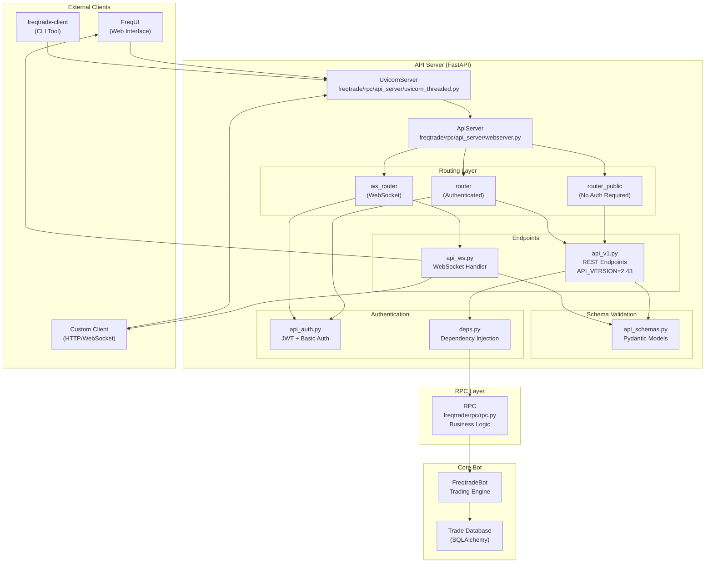
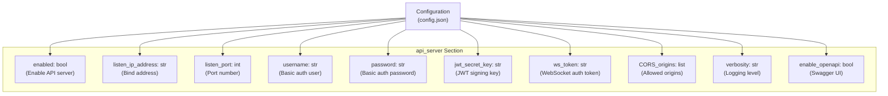
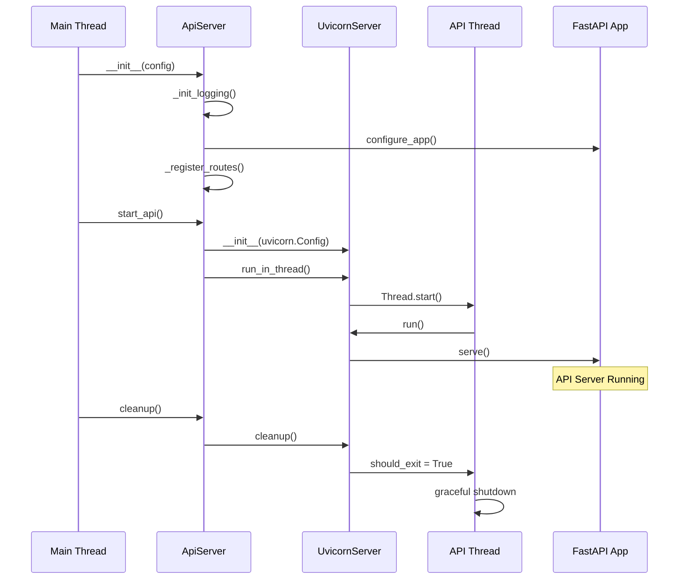
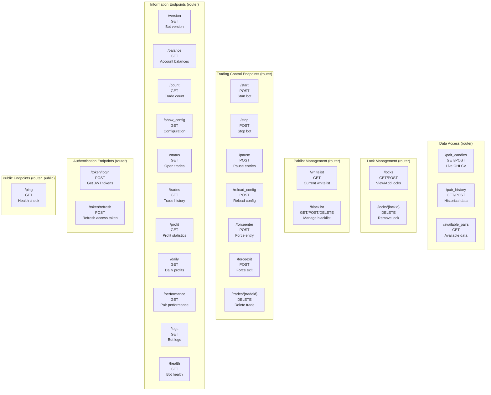
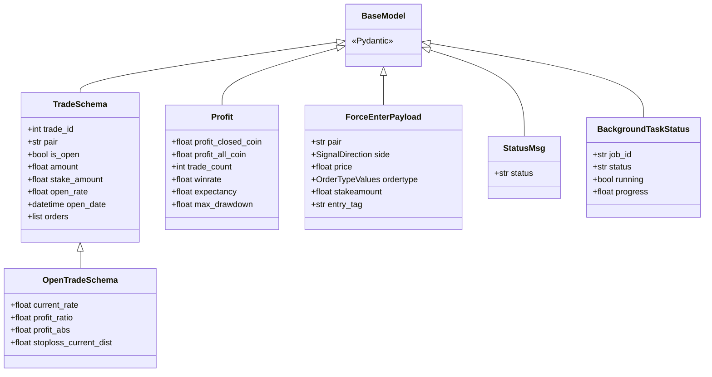
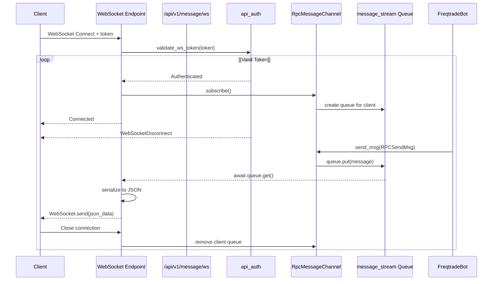
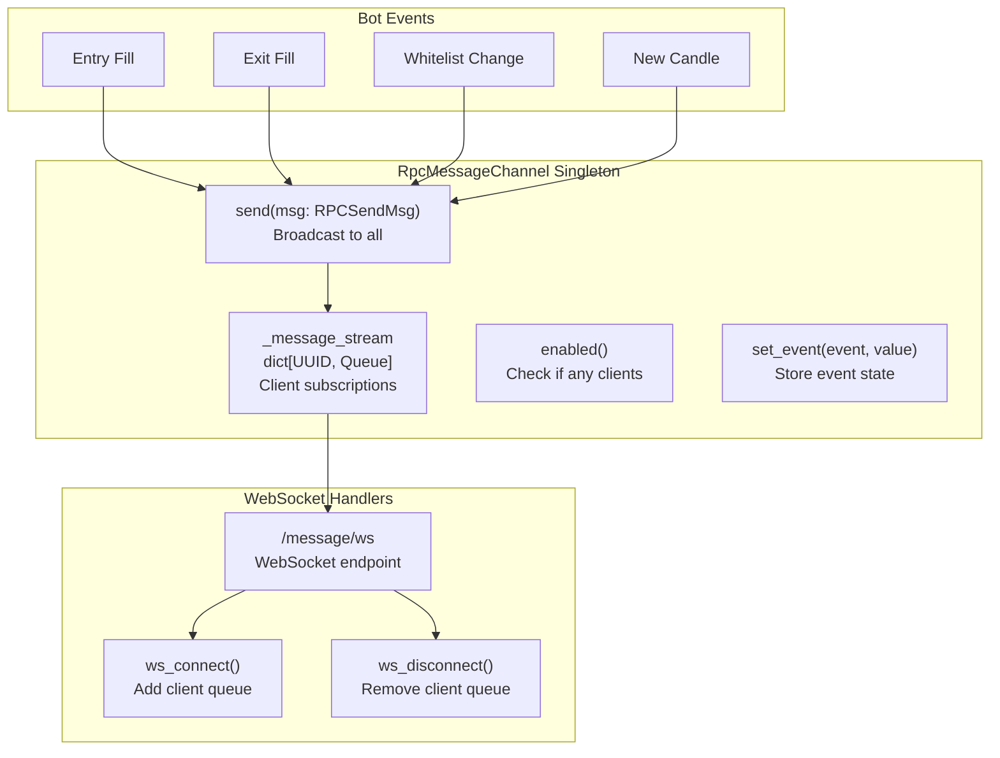
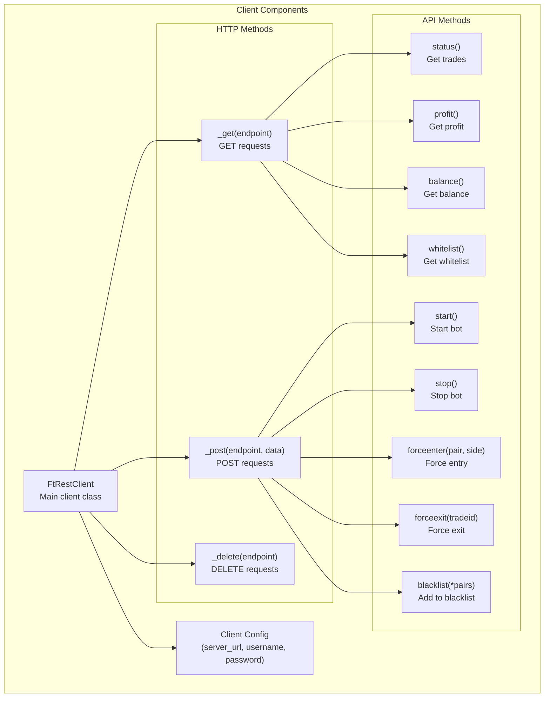
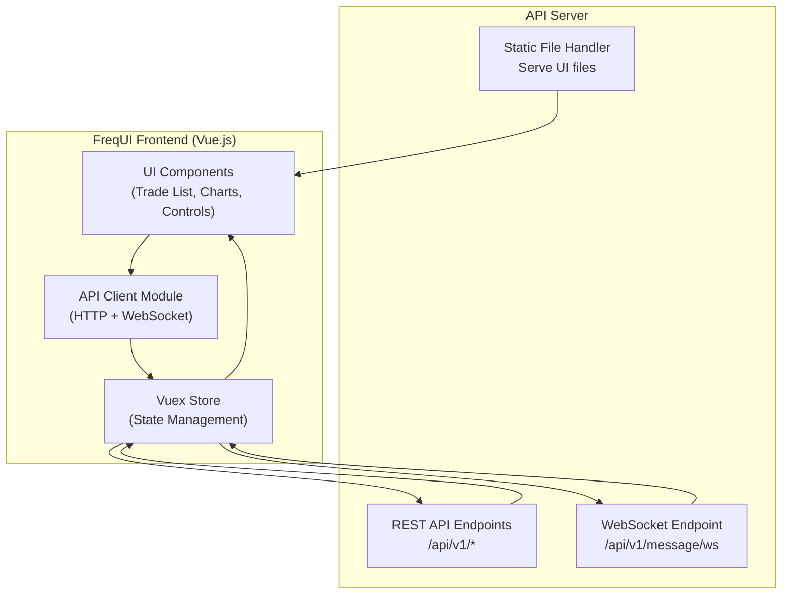
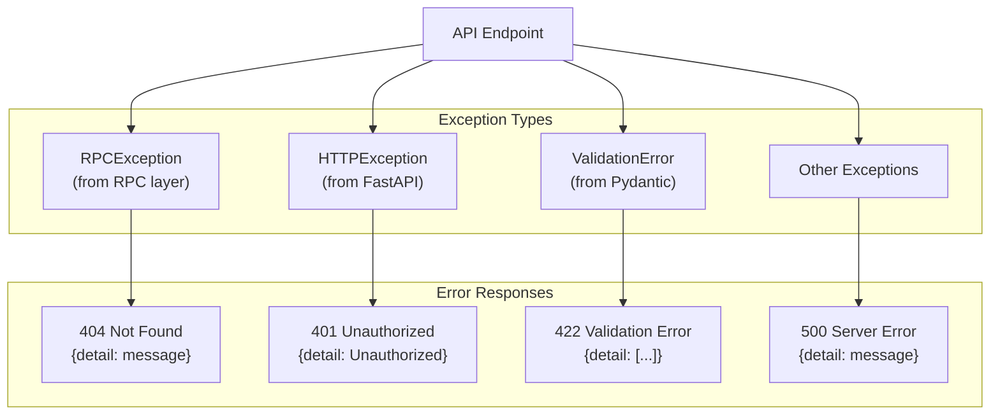

# REST API and WebSocket

Relevant source files

* [docs/rest-api.md](https://github.com/freqtrade/freqtrade/blob/8e91fea1/docs/rest-api.md)
* [docs/telegram-usage.md](https://github.com/freqtrade/freqtrade/blob/8e91fea1/docs/telegram-usage.md)
* [freqtrade/rpc/api\_server/api\_schemas.py](https://github.com/freqtrade/freqtrade/blob/8e91fea1/freqtrade/rpc/api_server/api_schemas.py)
* [freqtrade/rpc/api\_server/api\_v1.py](https://github.com/freqtrade/freqtrade/blob/8e91fea1/freqtrade/rpc/api_server/api_v1.py)
* [freqtrade/rpc/rpc.py](https://github.com/freqtrade/freqtrade/blob/8e91fea1/freqtrade/rpc/rpc.py)
* [freqtrade/rpc/telegram.py](https://github.com/freqtrade/freqtrade/blob/8e91fea1/freqtrade/rpc/telegram.py)
* [scripts/rest\_client.py](https://github.com/freqtrade/freqtrade/blob/8e91fea1/scripts/rest_client.py)
* [tests/rpc/test\_rpc.py](https://github.com/freqtrade/freqtrade/blob/8e91fea1/tests/rpc/test_rpc.py)
* [tests/rpc/test\_rpc\_apiserver.py](https://github.com/freqtrade/freqtrade/blob/8e91fea1/tests/rpc/test_rpc_apiserver.py)
* [tests/rpc/test\_rpc\_telegram.py](https://github.com/freqtrade/freqtrade/blob/8e91fea1/tests/rpc/test_rpc_telegram.py)

This document describes the REST API server and WebSocket system that enable external access to Freqtrade bot functionality. The API provides programmatic control over trading operations, access to bot state and performance metrics, and real-time message streaming via WebSocket. For information about the Telegram bot interface, see [4.2](/freqtrade/freqtrade/4.2-rpc-system-architecture). For the RPC core system that underlies both interfaces, see [4.1](/freqtrade/freqtrade/4.1-command-line-interface).

## Purpose and Scope

The REST API and WebSocket system serves as a programmatic interface to Freqtrade, enabling:

* **Remote Control**: Start, stop, pause bot operations; force entry/exit trades
* **Monitoring**: Query trade status, performance metrics, system health
* **Configuration Management**: View and reload configuration dynamically
* **Data Access**: Retrieve OHLCV candles, analyzed dataframes, backtest results
* **Real-time Streaming**: Subscribe to bot events via WebSocket (entries, exits, signals)
* **FreqUI Integration**: Powers the web-based user interface

The system is implemented using FastAPI and provides both synchronous REST endpoints and asynchronous WebSocket channels.

## Architecture Overview



**Sources**: [freqtrade/rpc/api\_server/api\_v1.py1-100](https://github.com/freqtrade/freqtrade/blob/8e91fea1/freqtrade/rpc/api_server/api_v1.py#L1-L100) [freqtrade/rpc/api\_server/webserver.py](https://github.com/freqtrade/freqtrade/blob/8e91fea1/freqtrade/rpc/api_server/webserver.py) [tests/rpc/test\_rpc\_apiserver.py56-90](https://github.com/freqtrade/freqtrade/blob/8e91fea1/tests/rpc/test_rpc_apiserver.py#L56-L90)

The API server runs in a separate thread managed by `UvicornServer`, providing isolation from the main trading loop. The `ApiServer` class initializes FastAPI application, registers routes, and manages the server lifecycle. All authenticated endpoints depend on the `RPC` instance to execute operations against the bot.

## Configuration

### Basic Configuration Structure



**Sources**: [tests/rpc/test\_rpc\_apiserver.py60-72](https://github.com/freqtrade/freqtrade/blob/8e91fea1/tests/rpc/test_rpc_apiserver.py#L60-L72) [docs/rest-api.md13-26](https://github.com/freqtrade/freqtrade/blob/8e91fea1/docs/rest-api.md#L13-L26)

### Configuration Parameters

| Parameter | Type | Description | Default |
| --- | --- | --- | --- |
| `enabled` | bool | Enable/disable API server | `false` |
| `listen_ip_address` | string | IP address to bind (use "0.0.0.0" for all interfaces) | `"127.0.0.1"` |
| `listen_port` | int | TCP port number | `8080` |
| `username` | string | Username for Basic authentication | Required |
| `password` | string | Password for Basic authentication | Required |
| `jwt_secret_key` | string | Secret key for JWT token signing | Auto-generated |
| `ws_token` | string | Token for WebSocket authentication | Optional |
| `CORS_origins` | list[str] | Allowed CORS origins for web clients | `[]` |
| `verbosity` | string | API server logging level (error/info/debug) | `"error"` |
| `enable_openapi` | bool | Enable OpenAPI/Swagger documentation UI | `false` |

**Security Considerations**: The API server listens on `127.0.0.1` (localhost only) by default. When deploying in Docker or remote environments, binding to `0.0.0.0` exposes the API to external connections. The configuration validation in [freqtrade/rpc/api\_server/webserver.py](https://github.com/freqtrade/freqtrade/blob/8e91fea1/freqtrade/rpc/api_server/webserver.py) emits warnings when insecure settings are detected (default JWT secret, empty password, public binding).

**Sources**: [tests/rpc/test\_rpc\_apiserver.py339-364](https://github.com/freqtrade/freqtrade/blob/8e91fea1/tests/rpc/test_rpc_apiserver.py#L339-L364) [tests/rpc/test\_rpc\_apiserver.py407-499](https://github.com/freqtrade/freqtrade/blob/8e91fea1/tests/rpc/test_rpc_apiserver.py#L407-L499)

## Server Lifecycle



**Sources**: [tests/rpc/test\_rpc\_apiserver.py366-405](https://github.com/freqtrade/freqtrade/blob/8e91fea1/tests/rpc/test_rpc_apiserver.py#L366-L405) [freqtrade/rpc/api\_server/uvicorn\_threaded.py](https://github.com/freqtrade/freqtrade/blob/8e91fea1/freqtrade/rpc/api_server/uvicorn_threaded.py)

The `UvicornServer` class extends `uvicorn.Server` to support running in a background thread via `run_in_thread()`. The server initialization occurs in the main thread, but the actual serving loop runs in a daemon thread that is started with a timeout mechanism to ensure the server becomes available. The `cleanup()` method performs graceful shutdown by setting `should_exit = True` and waiting for the thread to complete.

## Authentication System

### Authentication Flow

```mermaid
sequenceDiagram
  participant Client
  participant API Endpoint
  participant deps.get_rpc()
  participant api_auth
  participant RPC

  loop [Basic Authentication]
    Client->>API Endpoint: Request + Basic Auth Header
    API Endpoint->>deps.get_rpc(): Dependency Injection
    deps.get_rpc()->>api_auth: verify_auth()
    api_auth->>api_auth: Check username/password
    api_auth-->>deps.get_rpc(): Validated or 401
    deps.get_rpc()->>RPC: get_rpc_optional()
    RPC-->>API Endpoint: RPC instance
    API Endpoint->>Client: Response
    Client->>API Endpoint: POST /token/login + Basic Auth
    API Endpoint->>api_auth: create_token(identity, secret)
    api_auth-->>Client: access_token + refresh_token
    Client->>API Endpoint: Request + Bearer Token
    API Endpoint->>api_auth: get_user_from_token(token, secret)
    api_auth-->>API Endpoint: username or 401
    API Endpoint->>Client: Response
    Client->>API Endpoint: WS /message/ws?token=ws_token
    API Endpoint->>api_auth: validate_ws_token()
    api_auth-->>Client: WebSocket Connected
    api_auth-->>Client: WebSocketDisconnect
  end
```

**Sources**: [freqtrade/rpc/api\_server/api\_auth.py](https://github.com/freqtrade/freqtrade/blob/8e91fea1/freqtrade/rpc/api_server/api_auth.py) [tests/rpc/test\_rpc\_apiserver.py197-236](https://github.com/freqtrade/freqtrade/blob/8e91fea1/tests/rpc/test_rpc_apiserver.py#L197-L236) [tests/rpc/test\_rpc\_apiserver.py270-312](https://github.com/freqtrade/freqtrade/blob/8e91fea1/tests/rpc/test_rpc_apiserver.py#L270-L312)

### Authentication Methods

The API server supports three authentication methods:

**1. Basic Authentication**: Standard HTTP Basic Auth using `username` and `password` from configuration. Used for initial access and token generation.

```
```
# Usage in tests
headers = {"Authorization": _basic_auth_str(_TEST_USER, _TEST_PASS)}
```
```

**2. JWT Token Authentication**: After obtaining tokens via `/token/login`, clients use Bearer tokens for subsequent requests. Tokens come in two types:

* `access_token`: Short-lived token for API requests
* `refresh_token`: Long-lived token to obtain new access tokens via `/token/refresh`

Token creation and validation occur in [freqtrade/rpc/api\_server/api\_auth.py](https://github.com/freqtrade/freqtrade/blob/8e91fea1/freqtrade/rpc/api_server/api_auth.py) using the `create_token()` and `get_user_from_token()` functions.

**3. WebSocket Token Authentication**: WebSocket connections accept either:

* The `ws_token` from configuration (query parameter: `?token=<ws_token>`)
* A valid JWT access token (query parameter: `?token=<jwt_token>`)

**Public Endpoints**: The `/ping` endpoint on `router_public` requires no authentication and can be used for health checks.

**Sources**: [tests/rpc/test\_rpc\_apiserver.py197-215](https://github.com/freqtrade/freqtrade/blob/8e91fea1/tests/rpc/test_rpc_apiserver.py#L197-L215) [tests/rpc/test\_rpc\_apiserver.py217-236](https://github.com/freqtrade/freqtrade/blob/8e91fea1/tests/rpc/test_rpc_apiserver.py#L217-L236) [tests/rpc/test\_rpc\_apiserver.py270-295](https://github.com/freqtrade/freqtrade/blob/8e91fea1/tests/rpc/test_rpc_apiserver.py#L270-L295)

## REST API Endpoints

### Endpoint Organization



**Sources**: [freqtrade/rpc/api\_server/api\_v1.py97-470](https://github.com/freqtrade/freqtrade/blob/8e91fea1/freqtrade/rpc/api_server/api_v1.py#L97-L470)

### Key Endpoint Groups

#### Bot Control

| Endpoint | Method | Description | Response Schema |
| --- | --- | --- | --- |
| `/start` | POST | Start the trading bot | `StatusMsg` |
| `/stop` | POST | Stop the trading bot | `StatusMsg` |
| `/pause` | POST | Pause entries (aliases: `/stopentry`, `/stopbuy`) | `StatusMsg` |
| `/reload_config` | POST | Reload configuration from disk | `StatusMsg` |

The control endpoints interact with the bot state machine. The `/pause` endpoint sets the bot to `State.RUNNING` but disables new entries. The implementation is in [freqtrade/rpc/rpc.py](https://github.com/freqtrade/freqtrade/blob/8e91fea1/freqtrade/rpc/rpc.py) methods `_rpc_start()`, `_rpc_stop()`, and `_rpc_pause()`.

**Sources**: [freqtrade/rpc/api\_server/api\_v1.py379-399](https://github.com/freqtrade/freqtrade/blob/8e91fea1/freqtrade/rpc/api_server/api_v1.py#L379-L399) [tests/rpc/test\_rpc\_apiserver.py314-337](https://github.com/freqtrade/freqtrade/blob/8e91fea1/tests/rpc/test_rpc_apiserver.py#L314-L337)

#### Trade Management

| Endpoint | Method | Description | Request Schema | Response Schema |
| --- | --- | --- | --- | --- |
| `/status` | GET | List all open trades | - | `list[OpenTradeSchema]` |
| `/trade/{tradeid}` | GET | Get specific trade details | - | `OpenTradeSchema` |
| `/trades` | GET | Trade history (max 500) | Query: `limit`, `offset`, `order_by_id` | `TradeResponse` |
| `/trades/{tradeid}` | DELETE | Delete trade from DB | - | `DeleteTrade` |
| `/forceenter` | POST | Force immediate entry | `ForceEnterPayload` | `ForceEnterResponse` |
| `/forceexit` | POST | Force immediate exit | `ForceExitPayload` | `ResultMsg` |

The `/status` endpoint returns an empty list instead of raising an exception when no trades exist, enabling simpler client code. The `/trades` endpoint supports pagination via `limit` and `offset` parameters, with sorting controlled by `order_by_id` (default: `True` for ascending trade ID order).

**Sources**: [freqtrade/rpc/api\_server/api\_v1.py209-242](https://github.com/freqtrade/freqtrade/blob/8e91fea1/freqtrade/rpc/api_server/api_v1.py#L209-L242) [tests/rpc/test\_rpc\_apiserver.py760-798](https://github.com/freqtrade/freqtrade/blob/8e91fea1/tests/rpc/test_rpc_apiserver.py#L760-L798)

#### Performance Metrics

| Endpoint | Method | Description | Query Parameters | Response Schema |
| --- | --- | --- | --- | --- |
| `/profit` | GET | Overall profit statistics | - | `Profit` |
| `/profit_all` | GET | Profit by direction (long/short) | - | `ProfitAll` |
| `/daily` | GET | Daily profit breakdown | `timescale` (default: 7) | `DailyWeeklyMonthly` |
| `/weekly` | GET | Weekly profit breakdown | `timescale` (default: 4) | `DailyWeeklyMonthly` |
| `/monthly` | GET | Monthly profit breakdown | `timescale` (default: 3) | `DailyWeeklyMonthly` |
| `/performance` | GET | Performance by pair | - | `list[PerformanceEntry]` |
| `/entries` | GET | Statistics by entry tag | `pair` (optional) | `list[Entry]` |
| `/exits` | GET | Statistics by exit reason | `pair` (optional) | `list[Exit]` |
| `/mix_tags` | GET | Combined entry tag + exit reason stats | `pair` (optional) | `list[MixTag]` |

The profit endpoints call `RPC._rpc_trade_statistics()` with optional direction filtering for long/short separation. The time-based endpoints (`/daily`, `/weekly`, `/monthly`) use `RPC._rpc_timeunit_profit()` with different timeunit parameters.

**Sources**: [freqtrade/rpc/api\_server/api\_v1.py148-206](https://github.com/freqtrade/freqtrade/blob/8e91fea1/freqtrade/rpc/api_server/api_v1.py#L148-L206) [tests/rpc/test\_rpc\_apiserver.py698-757](https://github.com/freqtrade/freqtrade/blob/8e91fea1/tests/rpc/test_rpc_apiserver.py#L698-L757)

#### Data Access (Alpha)

| Endpoint | Method | Description | Request Schema | Response Schema |
| --- | --- | --- | --- | --- |
| `/pair_candles` | GET | Live OHLCV data | Query: `pair`, `timeframe`, `limit` | `PairHistory` |
| `/pair_candles` | POST | Live OHLCV (filtered columns) | `PairCandlesRequest` | `PairHistory` |
| `/pair_history` | GET/POST | Historical analyzed dataframe | `PairHistoryRequest` | `PairHistory` |
| `/available_pairs` | GET | List available backtest data | Query: `timeframe`, `stake_currency` | `AvailablePairs` |

The data endpoints provide access to both live data (via `DataProvider`) and historical data (via datahandlers). The POST variants accept a `columns` parameter to filter returned columns, reducing response size. These endpoints are marked as "Alpha" status and may change in future versions.

**Sources**: [freqtrade/rpc/api\_server/api\_v1.py401-453](https://github.com/freqtrade/freqtrade/blob/8e91fea1/freqtrade/rpc/api_server/api_v1.py#L401-L453) [freqtrade/rpc/rpc.py](https://github.com/freqtrade/freqtrade/blob/8e91fea1/freqtrade/rpc/rpc.py)

### API Schema Definitions

The API uses Pydantic models for request/response validation and serialization. Key schemas include:



**Sources**: [freqtrade/rpc/api\_server/api\_schemas.py1-700](https://github.com/freqtrade/freqtrade/blob/8e91fea1/freqtrade/rpc/api_server/api_schemas.py#L1-L700)

The schemas use Pydantic v2 features including `BaseModel`, field validation, and serialization. Complex nested structures like `TradeSchema` with embedded `OrderSchema` lists are fully typed. Optional fields use `| None` union types with defaults.

## WebSocket System

### WebSocket Architecture



**Sources**: [freqtrade/rpc/api\_server/api\_ws.py](https://github.com/freqtrade/freqtrade/blob/8e91fea1/freqtrade/rpc/api_server/api_ws.py) [freqtrade/rpc/api\_server/ws/channel.py](https://github.com/freqtrade/freqtrade/blob/8e91fea1/freqtrade/rpc/api_server/ws/channel.py)

### WebSocket Message Types

The WebSocket broadcasts `RPCMessageType` events from the bot. Message types include:

| Message Type | Description | Payload Fields |
| --- | --- | --- |
| `STATUS` | Bot status changes | `status` |
| `WARNING` | Warning messages | `status` |
| `EXCEPTION` | Error/exception occurred | `status` |
| `STARTUP` | Bot startup message | `status` |
| `ENTRY` | New entry order placed | `pair`, `amount`, `open_rate`, `direction` |
| `ENTRY_FILL` | Entry order filled | `pair`, `amount`, `open_rate`, `stake_amount` |
| `ENTRY_CANCEL` | Entry order cancelled | `pair`, `reason` |
| `EXIT` | Exit order placed | `pair`, `amount`, `profit_ratio` |
| `EXIT_FILL` | Exit order filled | `pair`, `profit_ratio`, `close_rate` |
| `EXIT_CANCEL` | Exit order cancelled | `pair`, `reason` |
| `PROTECTION_TRIGGER` | Protection triggered for pair | `pair`, `reason`, `lock_end_time` |
| `PROTECTION_TRIGGER_GLOBAL` | Global protection triggered | `reason`, `lock_end_time` |
| `STRATEGY_MSG` | Custom strategy message | `msg` |
| `WHITELIST` | Whitelist update | `whitelist` |
| `ANALYZED_DF` | New analyzed dataframe | `pair`, `timeframe`, `data` |
| `NEW_CANDLE` | New candle received | `pair`, `timeframe` |

**Sources**: [freqtrade/enums/rpcmessagetype.py](https://github.com/freqtrade/freqtrade/blob/8e91fea1/freqtrade/enums/rpcmessagetype.py) [freqtrade/rpc/rpc\_types.py](https://github.com/freqtrade/freqtrade/blob/8e91fea1/freqtrade/rpc/rpc_types.py)

### WebSocket Message Channel

The `RpcMessageChannel` class manages WebSocket subscriptions and message distribution:



**Sources**: [freqtrade/rpc/api\_server/ws/channel.py](https://github.com/freqtrade/freqtrade/blob/8e91fea1/freqtrade/rpc/api_server/ws/channel.py) [freqtrade/rpc/api\_server/api\_ws.py](https://github.com/freqtrade/freqtrade/blob/8e91fea1/freqtrade/rpc/api_server/api_ws.py)

The channel uses a singleton pattern to maintain a global registry of WebSocket clients. Each client gets a unique `asyncio.Queue` identified by UUID. When `send()` is called, the message is placed in all active client queues for delivery. The WebSocket endpoint continuously reads from its queue and sends JSON-serialized messages to the client.

**Message Serialization**: Messages are converted to JSON using `rapidjson` with `RapidJSONResponse` class for efficient serialization. The `RPCSendMsg` TypedDict is serialized directly without additional schema conversion.

**Sources**: [freqtrade/rpc/api\_server/api\_ws.py](https://github.com/freqtrade/freqtrade/blob/8e91fea1/freqtrade/rpc/api_server/api_ws.py) [freqtrade/rpc/api\_server/ws/serializer.py](https://github.com/freqtrade/freqtrade/blob/8e91fea1/freqtrade/rpc/api_server/ws/serializer.py)

## API Client Library

### freqtrade-client Package

The `freqtrade-client` package provides a lightweight Python client for API access. It can be installed independently: `pip install freqtrade-client`.



**Sources**: [scripts/rest\_client.py1-15](https://github.com/freqtrade/freqtrade/blob/8e91fea1/scripts/rest_client.py#L1-L15) [freqtrade\_client/ft\_client.py](https://github.com/freqtrade/freqtrade/blob/8e91fea1/freqtrade_client/ft_client.py)

### Usage Example

```
```
from freqtrade_client import FtRestClient

# Initialize client
client = FtRestClient(
    server_url="http://127.0.0.1:8080",
    username="Freqtrader",
    password="SuperSecret1!"
)

# Check bot status
ping = client.ping()
print(ping)  # {'status': 'pong'}

# Get open trades
trades = client.status()

# Force enter a trade
client.forceenter("BTC/USDT", side="long")

# Get profit statistics
profit = client.profit()

# Manage blacklist
client.blacklist("BTC/USDT", "ETH/USDT")
```
```

**Sources**: [docs/rest-api.md130-149](https://github.com/freqtrade/freqtrade/blob/8e91fea1/docs/rest-api.md#L130-L149)

The client automatically handles authentication using HTTP Basic Auth. For endpoints requiring complex payloads, the client provides method signatures matching the API schemas. The underlying HTTP methods (`_get`, `_post`, `_delete`) handle JSON serialization and deserialization.

### Command-Line Interface

The `freqtrade-client` package also provides a CLI:

```
```
# Using default config
freqtrade-client status

# With custom config
freqtrade-client --config rest_config.json profit

# With keyword arguments
freqtrade-client --config rest_config.json forceenter BTC/USDT long enter_tag=Manual
```
```

**Sources**: [docs/rest-api.md97-127](https://github.com/freqtrade/freqtrade/blob/8e91fea1/docs/rest-api.md#L97-L127)

The CLI wraps the `FtRestClient` methods and provides formatted output. The `help` command lists all available commands with their parameters.

## Integration with FreqUI

FreqUI is the official web-based frontend for Freqtrade, built as a Vue.js single-page application that consumes the REST API and WebSocket.



**Sources**: [freqtrade/rpc/api\_server/webserver.py](https://github.com/freqtrade/freqtrade/blob/8e91fea1/freqtrade/rpc/api_server/webserver.py) [docs/freq-ui.md](https://github.com/freqtrade/freqtrade/blob/8e91fea1/docs/freq-ui.md)

### API Server UI Serving

The API server serves FreqUI static files from a configured directory. If the UI is not installed, it serves a fallback HTML page with installation instructions. The routing logic in [freqtrade/rpc/api\_server/webserver.py](https://github.com/freqtrade/freqtrade/blob/8e91fea1/freqtrade/rpc/api_server/webserver.py) handles:

1. **Static Assets**: Serve .js, .css, .ico files directly
2. **SPA Routes**: Forward unmatched routes to index.html for client-side routing
3. **Security**: Directory traversal prevention

**Sources**: [tests/rpc/test\_rpc\_apiserver.py158-186](https://github.com/freqtrade/freqtrade/blob/8e91fea1/tests/rpc/test_rpc_apiserver.py#L158-L186)

### Real-time Updates

FreqUI subscribes to the WebSocket endpoint on connection to receive real-time updates:

* **Trade Events**: Entry/exit fills appear immediately in the trade list
* **Profit Updates**: Profit charts update as trades close
* **Whitelist Changes**: Pair list refreshes when pairlist updates
* **New Candles**: Chart data updates when new candles arrive

The WebSocket connection is maintained continuously, with automatic reconnection on disconnect. The UI displays connection status and handles offline scenarios gracefully.

**Sources**: [freqtrade/rpc/api\_server/api\_ws.py](https://github.com/freqtrade/freqtrade/blob/8e91fea1/freqtrade/rpc/api_server/api_ws.py) [docs/freq-ui.md](https://github.com/freqtrade/freqtrade/blob/8e91fea1/docs/freq-ui.md)

## API Versioning

The API uses a versioning scheme defined in `API_VERSION` constant:

```
```
# freqtrade/rpc/api_server/api_v1.py
API_VERSION = 2.43
```
```

**Sources**: [freqtrade/rpc/api\_server/api\_v1.py65-94](https://github.com/freqtrade/freqtrade/blob/8e91fea1/freqtrade/rpc/api_server/api_v1.py#L65-L94)

### Version History

The API version follows a decimal scheme (X.YY) where:

* Major version (X): Significant breaking changes
* Minor version (YY): Feature additions, backward-compatible changes

Version 2.x includes:

* **2.14**: Entry/exit orders in trade response
* **2.15**: Backtest history endpoints
* **2.20**: WebSocket endpoints
* **2.21**: New candle message type
* **2.22**: FreqAI backtesting support
* **2.27**: Trade reload endpoint
* **2.30**: Pairlist evaluation endpoint
* **2.34**: Entry/exit/mix\_tags statistics
* **2.43**: Current version with profit\_all endpoint

Clients should check `API_VERSION` via the `/show_config` endpoint to ensure compatibility. The version is returned in the response:

```
```
{
  "api_version": 2.43,
  "version": "2024.1",
  ...
}
```
```

**Sources**: [freqtrade/rpc/api\_server/api\_v1.py287-295](https://github.com/freqtrade/freqtrade/blob/8e91fea1/freqtrade/rpc/api_server/api_v1.py#L287-L295)

## CORS Configuration

Cross-Origin Resource Sharing (CORS) allows web applications from different origins to access the API:

```
```
# Configuration
"api_server": {
    "CORS_origins": ["http://example.com", "https://freqtrade.io"]
}
```
```

The CORS middleware in FastAPI validates requests against the configured origins. When a valid origin is provided, the API includes CORS headers in responses:

```
access-control-allow-origin: http://example.com
access-control-allow-credentials: true
```

**Sources**: [tests/rpc/test\_rpc\_apiserver.py142-148](https://github.com/freqtrade/freqtrade/blob/8e91fea1/tests/rpc/test_rpc_apiserver.py#L142-L148)

Without proper CORS configuration, browsers block requests from web applications hosted on different domains. This is essential for FreqUI when the UI and API are served from different origins.

## Dependency Injection

The API endpoints use FastAPI's dependency injection system to obtain `RPC` and `Config` instances:

```
```
# From freqtrade/rpc/api_server/deps.py
def get_rpc() -> RPC:
    """Get RPC instance - raises HTTPException if not available"""
    
def get_rpc_optional() -> RPC | None:
    """Get RPC instance - returns None if not available"""
    
def get_config() -> Config:
    """Get configuration dict"""
    
def get_exchange(config: Config = Depends(get_config)):
    """Get Exchange instance"""
```
```

**Sources**: [freqtrade/rpc/api\_server/deps.py](https://github.com/freqtrade/freqtrade/blob/8e91fea1/freqtrade/rpc/api_server/deps.py) [freqtrade/rpc/api\_server/api\_v1.py114-125](https://github.com/freqtrade/freqtrade/blob/8e91fea1/freqtrade/rpc/api_server/api_v1.py#L114-L125)

These dependency functions are injected into endpoint handlers:

```
```
@router.get("/balance", response_model=Balances, tags=["info"])
def balance(rpc: RPC = Depends(get_rpc), config=Depends(get_config)):
    return rpc._rpc_balance(
        config["stake_currency"],
        config.get("fiat_display_currency", ""),
    )
```
```

This pattern provides:

* **Separation of concerns**: Endpoints focus on HTTP handling, RPC handles business logic
* **Testability**: Dependencies can be mocked in tests
* **Optional RPC**: Some endpoints work without an active bot (e.g., `/show_config` in webserver mode)

The `get_rpc_optional()` variant allows endpoints to function when no bot is running, useful for configuration-only operations or static data serving.

## Error Handling

The API uses FastAPI's exception handling to provide consistent error responses:



**Sources**: [freqtrade/rpc/api\_server/api\_v1.py231-237](https://github.com/freqtrade/freqtrade/blob/8e91fea1/freqtrade/rpc/api_server/api_v1.py#L231-L237) [freqtrade/rpc/rpc.py58-75](https://github.com/freqtrade/freqtrade/blob/8e91fea1/freqtrade/rpc/rpc.py#L58-L75)

### Common Error Scenarios

**1. Authentication Failures** (401 Unauthorized):

* Invalid username/password
* Expired JWT token
* Missing authorization header

**2. Resource Not Found** (404 Not Found):

* Trade ID doesn't exist
* Strategy not found
* Requested pair not available

**3. Validation Errors** (422 Unprocessable Entity):

* Invalid payload format
* Missing required fields
* Type mismatches

**4. Operational Errors** (Handled in RPC layer):

* Bot not running (when required)
* Exchange connection issues
* Database errors

The `RPCException` class provides structured error messages that are caught and converted to appropriate HTTP error responses. For example:

```
```
# In endpoint
try:
    return rpc._rpc_trade_status([tradeid])[0]
except (RPCException, KeyError):
    raise HTTPException(status_code=404, detail="Trade not found.")
```
```

**Sources**: [freqtrade/rpc/api\_server/api\_v1.py231-237](https://github.com/freqtrade/freqtrade/blob/8e91fea1/freqtrade/rpc/api_server/api_v1.py#L231-L237)

## Background Tasks

Some endpoints trigger long-running operations that execute asynchronously:

```mermaid
sequenceDiagram
  participant Client
  participant /backtest
  participant ApiBG
  participant (Background Manager)
  participant Background Task
  participant Result Storage

  Client->>/backtest: POST /backtest (payload)
  /backtest->>ApiBG: get_job_id()
  ApiBG-->>/backtest: job_id
  /backtest->>ApiBG: add_background_task(job_id, func)
  ApiBG->>Background Task: asyncio.create_task()
  /backtest-->>Client: {"job_id": "uuid", "status": "running"}
  Client->>/backtest: GET /backtest/{job_id}
  /backtest->>ApiBG: get_job_status(job_id)
  loop [Task Running]
    ApiBG-->>Client: {"status": "running", "progress": 0.5}
    ApiBG->>Result Storage: retrieve result
    Result Storage-->>Client: {"status": "success", "result": {...}}
    ApiBG-->>Client: {"status": "failed", "error": "..."}
  end
```

**Sources**: [freqtrade/rpc/api\_server/webserver\_bgwork.py](https://github.com/freqtrade/freqtrade/blob/8e91fea1/freqtrade/rpc/api_server/webserver_bgwork.py) [freqtrade/rpc/api\_server/api\_schemas.py38-55](https://github.com/freqtrade/freqtrade/blob/8e91fea1/freqtrade/rpc/api_server/api_schemas.py#L38-L55)

Background tasks include:

* **Backtesting**: `/backtest` endpoint runs strategy backtests
* **Pairlist Evaluation**: `/pairlists/evaluate` tests pairlist configurations
* **Data Download**: `/download-data` fetches historical OHLCV data

Each background task returns a `BgJobStarted` response with a `job_id`. Clients poll the status endpoint to check progress and retrieve results when complete. Task state is stored in `ApiBG._background_tasks` dictionary with `BackgroundTaskStatus` objects.

**Sources**: [freqtrade/rpc/api\_server/api\_schemas.py38-55](https://github.com/freqtrade/freqtrade/blob/8e91fea1/freqtrade/rpc/api_server/api_schemas.py#L38-L55)

---

This REST API and WebSocket system provides comprehensive programmatic access to Freqtrade functionality, enabling integration with custom tools, automated trading systems, and the FreqUI web interface.