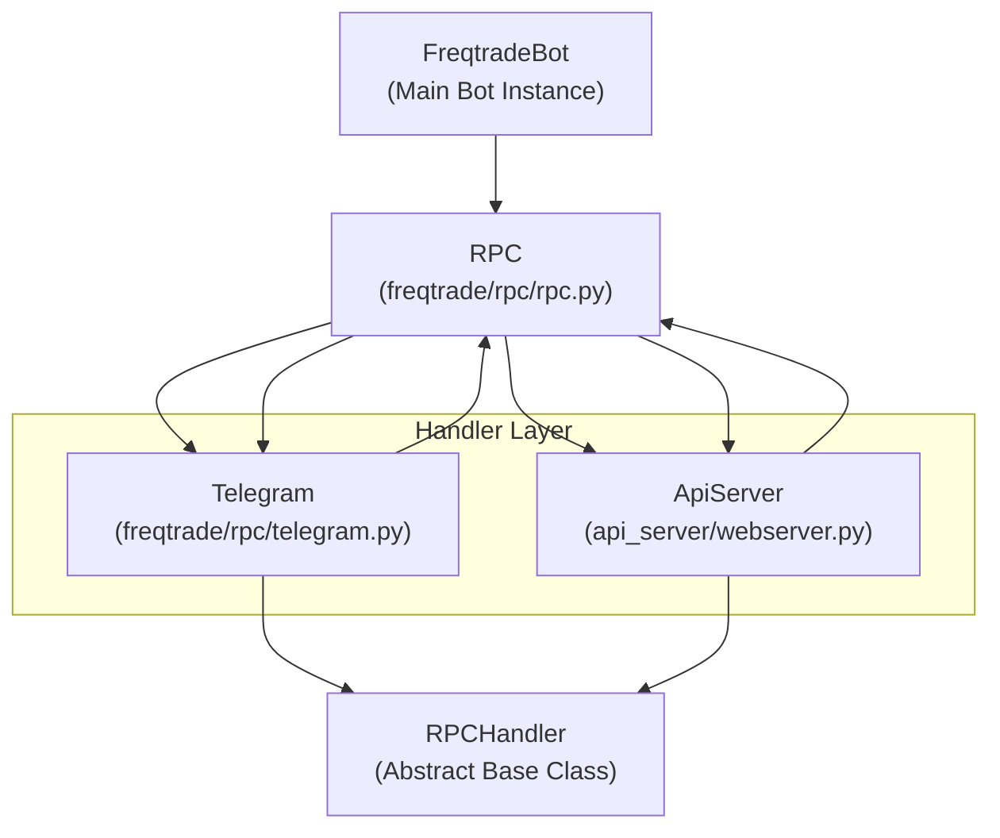
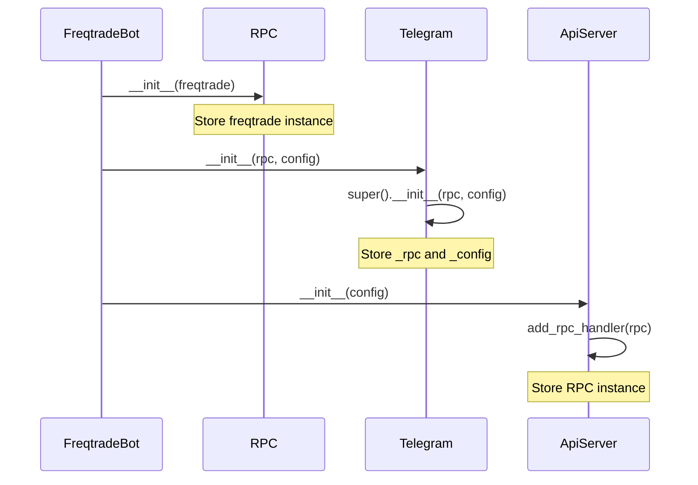
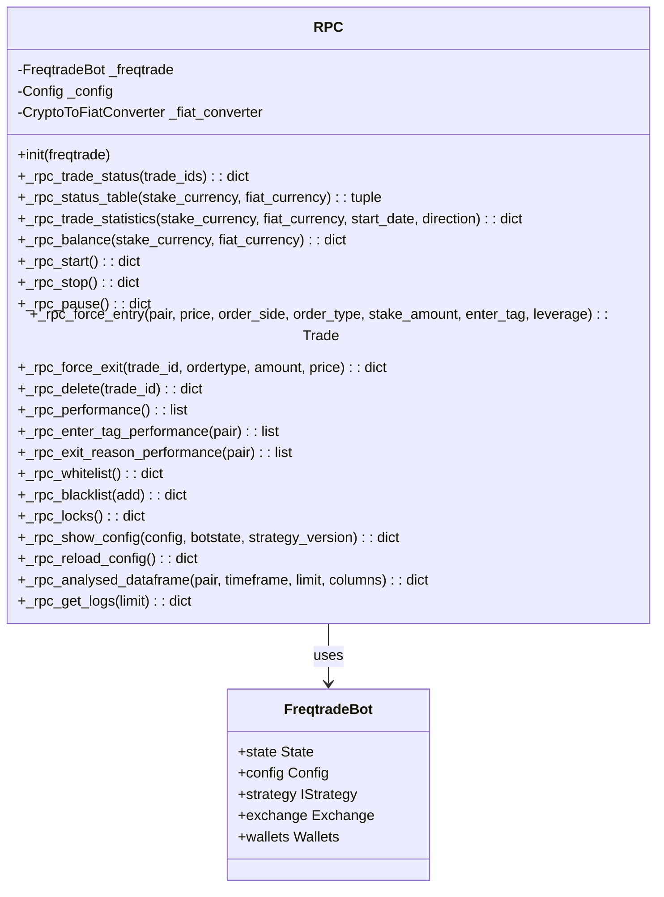
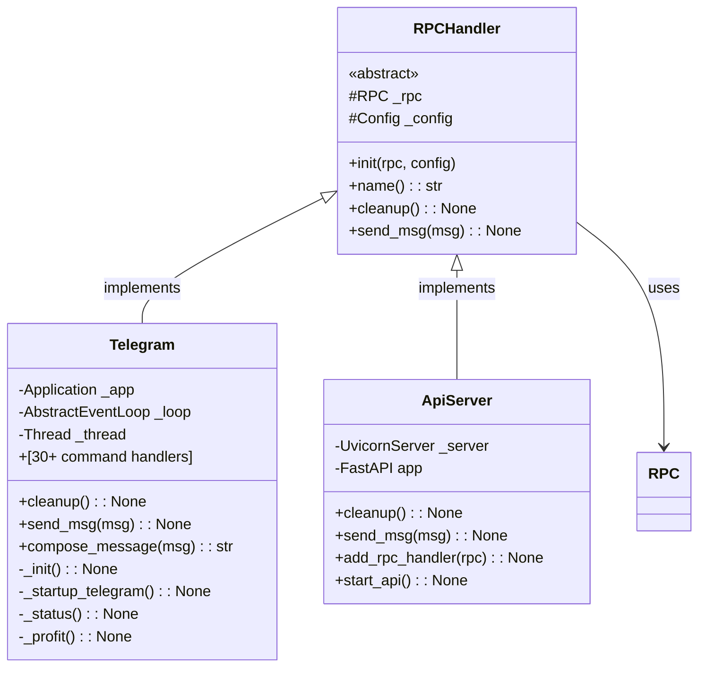
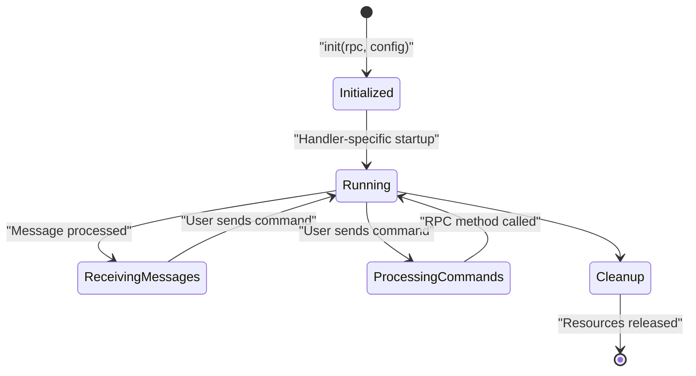
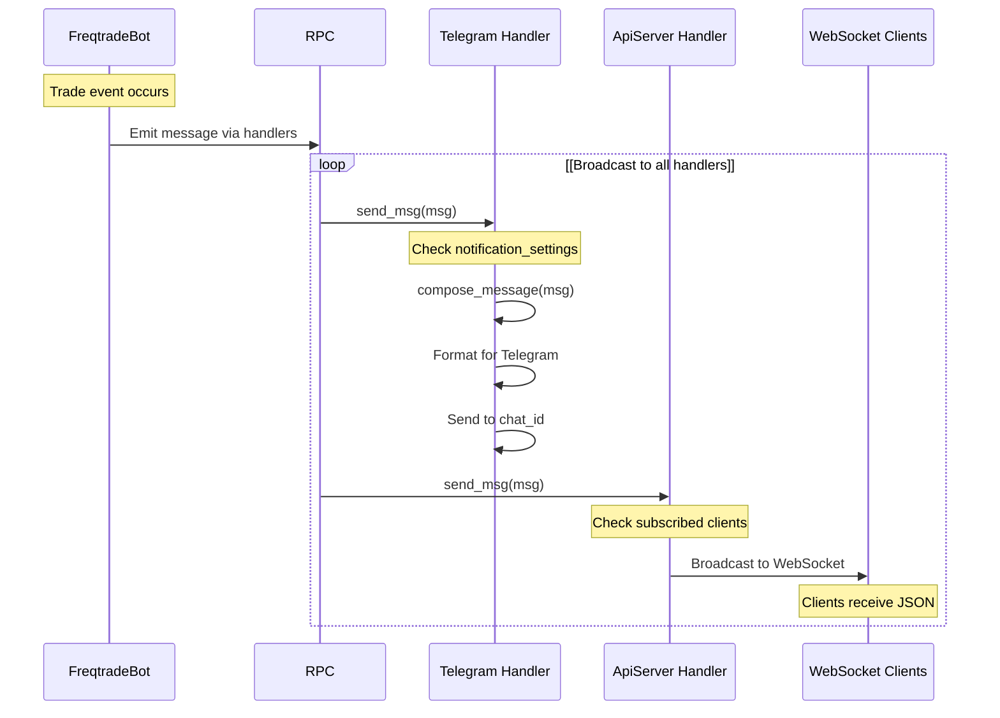
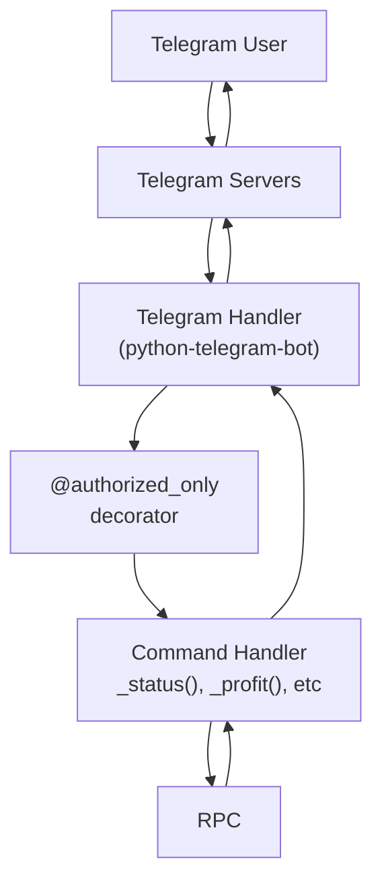
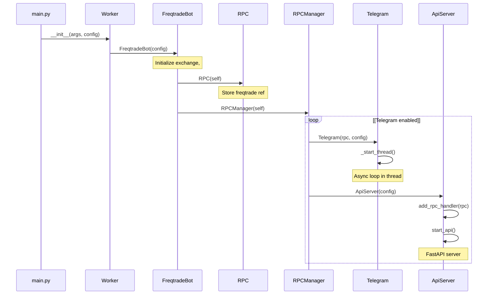
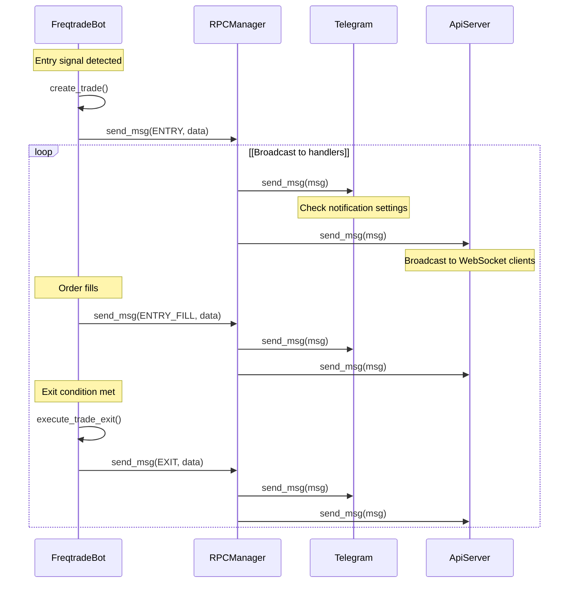

# RPC System Architecture

Relevant source files

* [docs/rest-api.md](https://github.com/freqtrade/freqtrade/blob/8e91fea1/docs/rest-api.md)
* [docs/telegram-usage.md](https://github.com/freqtrade/freqtrade/blob/8e91fea1/docs/telegram-usage.md)
* [freqtrade/rpc/api\_server/api\_schemas.py](https://github.com/freqtrade/freqtrade/blob/8e91fea1/freqtrade/rpc/api_server/api_schemas.py)
* [freqtrade/rpc/api\_server/api\_v1.py](https://github.com/freqtrade/freqtrade/blob/8e91fea1/freqtrade/rpc/api_server/api_v1.py)
* [freqtrade/rpc/rpc.py](https://github.com/freqtrade/freqtrade/blob/8e91fea1/freqtrade/rpc/rpc.py)
* [freqtrade/rpc/telegram.py](https://github.com/freqtrade/freqtrade/blob/8e91fea1/freqtrade/rpc/telegram.py)
* [scripts/rest\_client.py](https://github.com/freqtrade/freqtrade/blob/8e91fea1/scripts/rest_client.py)
* [tests/rpc/test\_rpc.py](https://github.com/freqtrade/freqtrade/blob/8e91fea1/tests/rpc/test_rpc.py)
* [tests/rpc/test\_rpc\_apiserver.py](https://github.com/freqtrade/freqtrade/blob/8e91fea1/tests/rpc/test_rpc_apiserver.py)
* [tests/rpc/test\_rpc\_telegram.py](https://github.com/freqtrade/freqtrade/blob/8e91fea1/tests/rpc/test_rpc_telegram.py)

## Purpose and Scope

This document describes the Remote Procedure Call (RPC) system architecture in Freqtrade, which provides the foundation for all user interfaces to interact with the trading bot. The RPC system consists of a core `RPC` class that implements bot operations, an abstract `RPCHandler` interface that defines how communication handlers integrate with the bot, and a message passing system for sending notifications.

For specific implementation details of individual interfaces, see:

* Command Line Interface operations: [4.1](/freqtrade/freqtrade/4.1-command-line-interface)
* Telegram bot commands and features: [4.3](/freqtrade/freqtrade/4.3-telegram-bot-interface)
* REST API endpoints and WebSocket subscriptions: [4.4](/freqtrade/freqtrade/4.4-rest-api-and-websocket)

This page focuses on the core abstraction layer, handler integration patterns, and message flow architecture.

---

## Core Architecture Overview

The RPC system employs a layered architecture with clear separation between business logic and communication protocols. The `RPC` class provides bot operation methods, while the `RPCHandler` abstract base class defines the contract for communication handlers.

### Component Relationships



**Sources:** [freqtrade/rpc/rpc.py78-124](https://github.com/freqtrade/freqtrade/blob/8e91fea1/freqtrade/rpc/rpc.py#L78-L124) [freqtrade/rpc/telegram.py142-158](https://github.com/freqtrade/freqtrade/blob/8e91fea1/freqtrade/rpc/telegram.py#L142-L158)

### Initialization Flow



**Sources:** [freqtrade/rpc/rpc.py115-124](https://github.com/freqtrade/freqtrade/blob/8e91fea1/freqtrade/rpc/rpc.py#L115-L124) [freqtrade/rpc/telegram.py145-158](https://github.com/freqtrade/freqtrade/blob/8e91fea1/freqtrade/rpc/telegram.py#L145-L158) [tests/rpc/test\_rpc\_apiserver.py339-363](https://github.com/freqtrade/freqtrade/blob/8e91fea1/tests/rpc/test_rpc_apiserver.py#L339-L363)

---

## RPC Core Class

The `RPC` class at [freqtrade/rpc/rpc.py103-2047](https://github.com/freqtrade/freqtrade/blob/8e91fea1/freqtrade/rpc/rpc.py#L103-L2047) provides the business logic layer for all bot operations. It acts as a facade over `FreqtradeBot`, exposing bot functionality through standardized methods.

### Core Responsibilities

| Responsibility | Methods | Description |
| --- | --- | --- |
| **Trade Status** | `_rpc_trade_status()` | Retrieve open/closed trade information |
| **Statistics** | `_rpc_trade_statistics()` `_rpc_stats()` `_rpc_performance()` | Calculate profit metrics, exit reasons, performance by pair |
| **Bot Control** | `_rpc_start()` `_rpc_stop()` `_rpc_pause()` | Control bot state transitions |
| **Trade Management** | `_rpc_force_entry()` `_rpc_force_exit()` `_rpc_delete()` | Execute forced trades and manage positions |
| **Configuration** | `_rpc_show_config()` `_rpc_reload_config()` | Access and modify bot configuration |
| **Market Data** | `_rpc_analysed_dataframe()` `_rpc_whitelist()` `_rpc_blacklist()` | Query market data and pair lists |

**Sources:** [freqtrade/rpc/rpc.py103-2047](https://github.com/freqtrade/freqtrade/blob/8e91fea1/freqtrade/rpc/rpc.py#L103-L2047)

### RPC Class Structure



**Sources:** [freqtrade/rpc/rpc.py103-2047](https://github.com/freqtrade/freqtrade/blob/8e91fea1/freqtrade/rpc/rpc.py#L103-L2047)

### Key Method Patterns

RPC methods follow consistent patterns:

1. **Query Methods** - Return data dictionaries for display:

   * Prefix: `_rpc_`
   * Raise `RPCException` for error conditions
   * Return structured dictionaries matching API schemas
2. **Action Methods** - Execute bot operations:

   * Validate preconditions
   * Call `_freqtrade` methods
   * Return status dictionaries
3. **Static Methods** - Configuration helpers:

   * `_rpc_show_config()` at [freqtrade/rpc/rpc.py126-183](https://github.com/freqtrade/freqtrade/blob/8e91fea1/freqtrade/rpc/rpc.py#L126-L183)
   * `_rpc_get_logs()` - no bot instance required

**Example: Trade Status Method**

```
```
# Simplified from freqtrade/rpc/rpc.py:185-289
def _rpc_trade_status(self, trade_ids: list[int] | None = None) -> list[dict[str, Any]]:
    """Fetch open trades or specific trades by ID"""
    if trade_ids:
        trades = Trade.get_trades(trade_filter=Trade.id.in_(trade_ids)).all()
    else:
        trades = Trade.get_open_trades()
    
    if not trades:
        raise RPCException("no active trade")
    
    results = []
    for trade in trades:
        # Calculate current profit, format data
        # Build comprehensive trade dictionary
        results.append(trade_dict)
    return results
```
```

**Sources:** [freqtrade/rpc/rpc.py185-289](https://github.com/freqtrade/freqtrade/blob/8e91fea1/freqtrade/rpc/rpc.py#L185-L289)

---

## RPCHandler Interface

The `RPCHandler` abstract base class at [freqtrade/rpc/rpc.py78-101](https://github.com/freqtrade/freqtrade/blob/8e91fea1/freqtrade/rpc/rpc.py#L78-L101) defines the contract that all communication handlers must implement. It provides the foundation for bidirectional communication: handlers receive messages from the bot and expose operations to users.

### Interface Definition



**Sources:** [freqtrade/rpc/rpc.py78-101](https://github.com/freqtrade/freqtrade/blob/8e91fea1/freqtrade/rpc/rpc.py#L78-L101) [freqtrade/rpc/telegram.py142-387](https://github.com/freqtrade/freqtrade/blob/8e91fea1/freqtrade/rpc/telegram.py#L142-L387)

### Handler Lifecycle



**Sources:** [freqtrade/rpc/rpc.py78-101](https://github.com/freqtrade/freqtrade/blob/8e91fea1/freqtrade/rpc/rpc.py#L78-L101) [freqtrade/rpc/telegram.py379-387](https://github.com/freqtrade/freqtrade/blob/8e91fea1/freqtrade/rpc/telegram.py#L379-L387)

### Abstract Method Requirements

| Method | Signature | Purpose |
| --- | --- | --- |
| `cleanup()` | `cleanup(self) -> None` | Release resources (threads, connections, file handles) |
| `send_msg()` | `send_msg(self, msg: RPCSendMsg) -> None` | Deliver notification messages to users |

**Base Class Properties:**

* `name` property at [freqtrade/rpc/rpc.py89-92](https://github.com/freqtrade/freqtrade/blob/8e91fea1/freqtrade/rpc/rpc.py#L89-L92) - Returns lowercase class name
* `_rpc` attribute - Reference to RPC instance for calling bot operations
* `_config` attribute - Configuration dictionary with handler-specific settings

**Sources:** [freqtrade/rpc/rpc.py78-101](https://github.com/freqtrade/freqtrade/blob/8e91fea1/freqtrade/rpc/rpc.py#L78-L101)

---

## Message Passing System

The RPC system uses a message passing architecture where the bot broadcasts notifications to all registered handlers. Messages are typed by `RPCMessageType` and carry structured data in `RPCSendMsg` dictionaries.

### Message Flow Architecture



**Sources:** [freqtrade/rpc/telegram.py616-629](https://github.com/freqtrade/freqtrade/blob/8e91fea1/freqtrade/rpc/telegram.py#L616-L629) [freqtrade/rpc/telegram.py542-588](https://github.com/freqtrade/freqtrade/blob/8e91fea1/freqtrade/rpc/telegram.py#L542-L588)

### Message Type Structure

The `RPCSendMsg` type (from `freqtrade/rpc/rpc_types.py`, not shown but referenced) is a typed dictionary containing:

```
```
{
    "type": RPCMessageType,  # ENTRY, EXIT, STATUS, WARNING, etc.
    "data": dict,            # Type-specific payload
    # Common fields for trade messages:
    "trade_id": int,
    "pair": str,
    "exchange": str,
    # Entry-specific:
    "enter_tag": str,
    "amount": float,
    "open_rate": float,
    # Exit-specific:
    "exit_reason": str,
    "profit_ratio": float,
    "close_rate": float,
    # Status messages:
    "status": str,
    # etc.
}
```
```

### Message Types and Handlers

| Message Type | Example Data | Handler Behavior |
| --- | --- | --- |
| `ENTRY` | Order placed | Telegram: Format entry notification API: Broadcast to WebSocket |
| `ENTRY_FILL` | Order filled | Telegram: Show filled order details API: Update trade status |
| `EXIT` | Exit order placed | Telegram: Format exit notification API: Broadcast exit event |
| `EXIT_FILL` | Exit completed | Telegram: Show profit/loss API: Final trade update |
| `ENTRY_CANCEL` `EXIT_CANCEL` | Order cancelled | Telegram: Warning notification API: Status update |
| `STATUS` | Bot state change | Telegram: Status message API: State broadcast |
| `WARNING` | Bot warning | Telegram: Warning emoji + message API: Log warning |
| `EXCEPTION` | Bot error | Telegram: Error notification API: Error broadcast |
| `PROTECTION_TRIGGER` | Pair locked | Telegram: Protection notice API: Lock event |
| `STRATEGY_MSG` | Custom message | Telegram: Forward if enabled API: Custom broadcast |

**Sources:** [freqtrade/rpc/telegram.py542-588](https://github.com/freqtrade/freqtrade/blob/8e91fea1/freqtrade/rpc/telegram.py#L542-L588) [freqtrade/enums/rpcmessagetype.py (referenced)](https://github.com/freqtrade/freqtrade/blob/8e91fea1/freqtrade/enums/rpcmessagetype.py (referenced))

### Message Formatting Example

The Telegram handler demonstrates message composition at [freqtrade/rpc/telegram.py542-588](https://github.com/freqtrade/freqtrade/blob/8e91fea1/freqtrade/rpc/telegram.py#L542-L588):

```
```
def compose_message(self, msg: RPCSendMsg) -> str | None:
    if msg["type"] == RPCMessageType.ENTRY:
        message = self._format_entry_msg(msg)
    elif msg["type"] == RPCMessageType.EXIT:
        message = self._format_exit_msg(msg)
    # ... handle other types
    return message
```
```

Entry message formatting at [freqtrade/rpc/telegram.py414-451](https://github.com/freqtrade/freqtrade/blob/8e91fea1/freqtrade/rpc/telegram.py#L414-L451) produces:

```
✓ *Binance:* New Trade (#123)
*Pair:* `BTC/USDT`
*Enter Tag:* `breakout_signal`
*Amount:* `0.05`
*Direction:* `Long (3x)`
*Open Rate:* `45000.00 USDT`
*Total:* `2250.00 USDT`
```

**Sources:** [freqtrade/rpc/telegram.py542-588](https://github.com/freqtrade/freqtrade/blob/8e91fea1/freqtrade/rpc/telegram.py#L542-L588) [freqtrade/rpc/telegram.py414-451](https://github.com/freqtrade/freqtrade/blob/8e91fea1/freqtrade/rpc/telegram.py#L414-L451)

### Notification Control

Handlers can filter messages based on configuration. Telegram example at [freqtrade/rpc/telegram.py590-614](https://github.com/freqtrade/freqtrade/blob/8e91fea1/freqtrade/rpc/telegram.py#L590-L614):

```
```
def _message_loudness(self, msg: RPCSendMsg) -> str:
    """Determine message verbosity: 'on', 'silent', or 'off'"""
    msg_type = msg["type"]
    noti = self._config["telegram"] \
        .get("notification_settings", {}) \
        .get(str(msg_type), "on")
    return noti

def send_msg(self, msg: RPCSendMsg) -> None:
    noti = self._message_loudness(msg)
    if noti == "off":
        return  # Skip message
    
    message = self.compose_message(deepcopy(msg))
    if message:
        asyncio.run_coroutine_threadsafe(
            self._send_msg(message, disable_notification=(noti == "silent")),
            self._loop
        )
```
```

**Sources:** [freqtrade/rpc/telegram.py590-629](https://github.com/freqtrade/freqtrade/blob/8e91fea1/freqtrade/rpc/telegram.py#L590-L629)

---

## Handler Implementations

### Telegram Handler

The `Telegram` class at [freqtrade/rpc/telegram.py142-2316](https://github.com/freqtrade/freqtrade/blob/8e91fea1/freqtrade/rpc/telegram.py#L142-L2316) implements an asynchronous bot using the `python-telegram-bot` library. It runs in a separate thread with its own event loop.

**Key Components:**

* **Threading Model**: Separate thread at [freqtrade/rpc/telegram.py159-164](https://github.com/freqtrade/freqtrade/blob/8e91fea1/freqtrade/rpc/telegram.py#L159-L164) with dedicated asyncio loop
* **Authorization**: `authorized_only` decorator at [freqtrade/rpc/telegram.py92-139](https://github.com/freqtrade/freqtrade/blob/8e91fea1/freqtrade/rpc/telegram.py#L92-L139) checks `chat_id`, `topic_id`, and `authorized_users`
* **Command Handlers**: 30+ commands registered at [freqtrade/rpc/telegram.py266-311](https://github.com/freqtrade/freqtrade/blob/8e91fea1/freqtrade/rpc/telegram.py#L266-L311)
* **Callback Handlers**: Inline keyboard buttons at [freqtrade/rpc/telegram.py312-332](https://github.com/freqtrade/freqtrade/blob/8e91fea1/freqtrade/rpc/telegram.py#L312-L332)

**Telegram-Specific Flow:**



**Sources:** [freqtrade/rpc/telegram.py142-387](https://github.com/freqtrade/freqtrade/blob/8e91fea1/freqtrade/rpc/telegram.py#L142-L387) [freqtrade/rpc/telegram.py92-139](https://github.com/freqtrade/freqtrade/blob/8e91fea1/freqtrade/rpc/telegram.py#L92-L139)

### API Server Handler

The `ApiServer` implementation provides HTTP REST endpoints and WebSocket support. While the full implementation is in `freqtrade/rpc/api_server/webserver.py` (not provided), we can see its usage pattern:

**REST API Pattern** at [freqtrade/rpc/api\_server/api\_v1.py104-456](https://github.com/freqtrade/freqtrade/blob/8e91fea1/freqtrade/rpc/api_server/api_v1.py#L104-L456):

```
```
@router.get("/status", response_model=list[OpenTradeSchema])
def status(rpc: RPC = Depends(get_rpc)):
    """REST endpoint calls RPC method directly"""
    try:
        return rpc._rpc_trade_status()
    except RPCException:
        return []
```
```

**Dependency Injection** at [freqtrade/rpc/api\_server/deps.py (referenced)](https://github.com/freqtrade/freqtrade/blob/8e91fea1/freqtrade/rpc/api_server/deps.py (referenced)):

* `get_rpc()` - Returns RPC instance from ApiServer
* `get_config()` - Returns configuration
* `get_exchange()` - Returns exchange instance

**WebSocket Message Broadcasting:**

When bot sends messages, ApiServer broadcasts them to subscribed WebSocket clients. Clients subscribe by sending:

```
```
{
  "type": "subscribe",
  "data": ["whitelist", "analyzed_df", "entry", "exit"]
}
```
```

**Sources:** [freqtrade/rpc/api\_server/api\_v1.py1-456](https://github.com/freqtrade/freqtrade/blob/8e91fea1/freqtrade/rpc/api_server/api_v1.py#L1-L456) [docs/rest-api.md220-285](https://github.com/freqtrade/freqtrade/blob/8e91fea1/docs/rest-api.md#L220-L285)

---

## Integration with FreqtradeBot

The RPC system integrates tightly with `FreqtradeBot` through initialization and runtime interaction patterns.

### Initialization Pattern



**Sources:** [freqtrade/rpc/rpc.py115-124](https://github.com/freqtrade/freqtrade/blob/8e91fea1/freqtrade/rpc/rpc.py#L115-L124) [freqtrade/rpc/telegram.py145-164](https://github.com/freqtrade/freqtrade/blob/8e91fea1/freqtrade/rpc/telegram.py#L145-L164)

### Runtime Message Flow

The bot sends messages at key points during trade execution:



**Sources:** [freqtrade/rpc/telegram.py616-629](https://github.com/freqtrade/freqtrade/blob/8e91fea1/freqtrade/rpc/telegram.py#L616-L629)

### RPC Method Call Pattern

User commands flow through handlers to RPC methods:

| User Action | Handler Method | RPC Method Called | Bot Impact |
| --- | --- | --- | --- |
| `/status` | `Telegram._status()` | `rpc._rpc_trade_status()` | Query only |
| `/profit` | `Telegram._profit()` | `rpc._rpc_trade_statistics()` | Query only |
| `/start` | `Telegram._start()` | `rpc._rpc_start()` | Changes `bot.state` to `RUNNING` |
| `/stop` | `Telegram._stop()` | `rpc._rpc_stop()` | Changes `bot.state` to `STOPPED` |
| `/forceexit 123` | `Telegram._force_exit()` | `rpc._rpc_force_exit("123")` | Calls `bot.execute_trade_exit()` |
| `/forcelong BTC/USDT` | `Telegram._force_enter()` | `rpc._rpc_force_entry("BTC/USDT", ...)` | Calls `bot._create_trade()` |
| `GET /status` | `api_v1.status()` | `rpc._rpc_trade_status()` | Query only |
| `POST /forceenter` | `api_v1.force_entry()` | `rpc._rpc_force_entry(...)` | Calls `bot._create_trade()` |

**Sources:** [freqtrade/rpc/telegram.py730-870](https://github.com/freqtrade/freqtrade/blob/8e91fea1/freqtrade/rpc/telegram.py#L730-L870) [freqtrade/rpc/api\_server/api\_v1.py211-256](https://github.com/freqtrade/freqtrade/blob/8e91fea1/freqtrade/rpc/api_server/api_v1.py#L211-L256)

### Error Handling

RPC methods raise `RPCException` at [freqtrade/rpc/rpc.py59-76](https://github.com/freqtrade/freqtrade/blob/8e91fea1/freqtrade/rpc/rpc.py#L59-L76) for operational errors:

```
```
# Example from _rpc_trade_status()
if not trades:
    raise RPCException("no active trade")
```
```

Handlers catch and format these exceptions:

**Telegram** at [freqtrade/rpc/telegram.py132-137](https://github.com/freqtrade/freqtrade/blob/8e91fea1/freqtrade/rpc/telegram.py#L132-L137):

```
```
try:
    return await command_handler(self, *args, **kwargs)
except RPCException as e:
    await self._send_msg(str(e))
```
```

**REST API** at [freqtrade/rpc/api\_server/api\_v1.py213-216](https://github.com/freqtrade/freqtrade/blob/8e91fea1/freqtrade/rpc/api_server/api_v1.py#L213-L216):

```
```
def status(rpc: RPC = Depends(get_rpc)):
    try:
        return rpc._rpc_trade_status()
    except RPCException:
        return []  # Empty list for no trades
```
```

**Sources:** [freqtrade/rpc/rpc.py59-76](https://github.com/freqtrade/freqtrade/blob/8e91fea1/freqtrade/rpc/rpc.py#L59-L76) [freqtrade/rpc/telegram.py132-137](https://github.com/freqtrade/freqtrade/blob/8e91fea1/freqtrade/rpc/telegram.py#L132-L137) [freqtrade/rpc/api\_server/api\_v1.py211-216](https://github.com/freqtrade/freqtrade/blob/8e91fea1/freqtrade/rpc/api_server/api_v1.py#L211-L216)

---

## Key Design Patterns

### 1. Facade Pattern

The `RPC` class acts as a facade over `FreqtradeBot`, providing simplified, stable interfaces for complex bot operations.

### 2. Observer Pattern

Handlers observe bot events through the `send_msg()` callback mechanism, receiving notifications without tight coupling.

### 3. Strategy Pattern

Different handlers implement the same `RPCHandler` interface, allowing the bot to broadcast messages without knowing handler specifics.

### 4. Dependency Injection

The API server uses FastAPI's dependency injection (e.g., `Depends(get_rpc)`) to provide the RPC instance to endpoint functions.

### 5. Thread Isolation

Telegram handler runs in a separate thread with its own asyncio event loop, preventing blocking the main bot thread.

**Sources:** [freqtrade/rpc/rpc.py103-2047](https://github.com/freqtrade/freqtrade/blob/8e91fea1/freqtrade/rpc/rpc.py#L103-L2047) [freqtrade/rpc/rpc.py78-101](https://github.com/freqtrade/freqtrade/blob/8e91fea1/freqtrade/rpc/rpc.py#L78-L101) [freqtrade/rpc/telegram.py159-164](https://github.com/freqtrade/freqtrade/blob/8e91fea1/freqtrade/rpc/telegram.py#L159-L164) [freqtrade/rpc/api\_server/api\_v1.py1-456](https://github.com/freqtrade/freqtrade/blob/8e91fea1/freqtrade/rpc/api_server/api_v1.py#L1-L456)