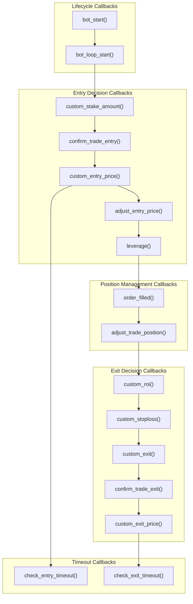
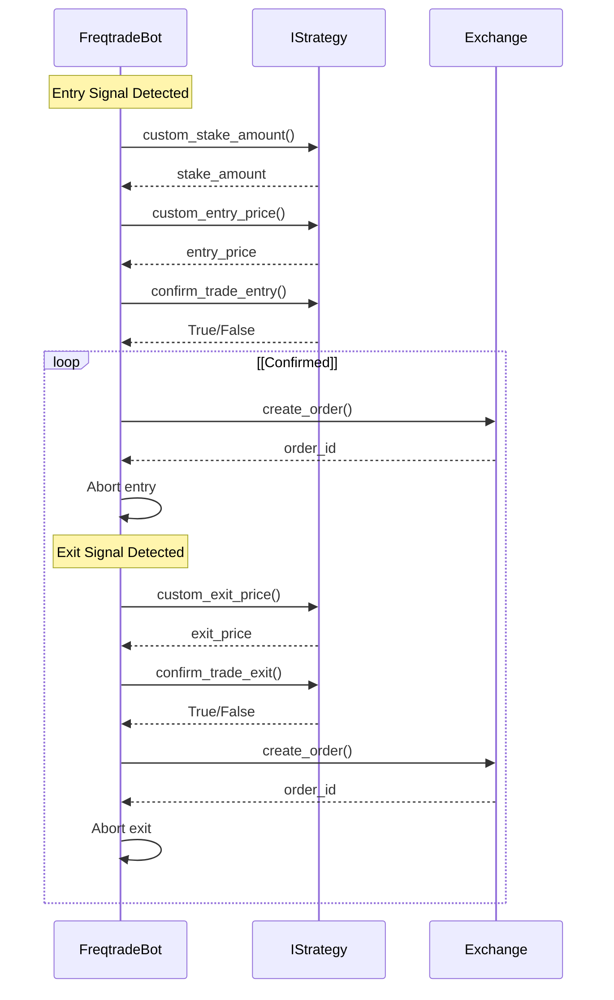
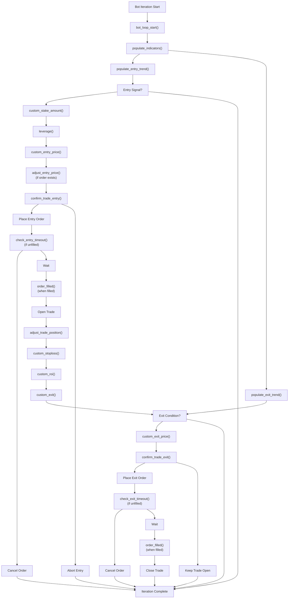
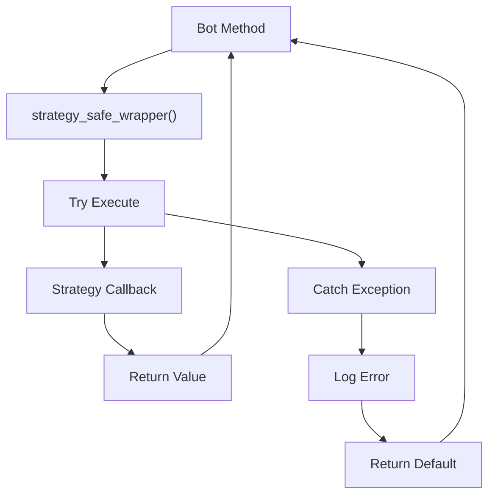

# Strategy Callbacks and Customization

Relevant source files

* [docs/bot-basics.md](https://github.com/freqtrade/freqtrade/blob/8e91fea1/docs/bot-basics.md)
* [docs/strategy-advanced.md](https://github.com/freqtrade/freqtrade/blob/8e91fea1/docs/strategy-advanced.md)
* [docs/strategy-callbacks.md](https://github.com/freqtrade/freqtrade/blob/8e91fea1/docs/strategy-callbacks.md)
* [docs/strategy-customization.md](https://github.com/freqtrade/freqtrade/blob/8e91fea1/docs/strategy-customization.md)
* [docs/strategy\_migration.md](https://github.com/freqtrade/freqtrade/blob/8e91fea1/docs/strategy_migration.md)
* [freqtrade/enums/exittype.py](https://github.com/freqtrade/freqtrade/blob/8e91fea1/freqtrade/enums/exittype.py)
* [freqtrade/strategy/\_\_init\_\_.py](https://github.com/freqtrade/freqtrade/blob/8e91fea1/freqtrade/strategy/__init__.py)
* [freqtrade/strategy/informative\_decorator.py](https://github.com/freqtrade/freqtrade/blob/8e91fea1/freqtrade/strategy/informative_decorator.py)
* [freqtrade/strategy/interface.py](https://github.com/freqtrade/freqtrade/blob/8e91fea1/freqtrade/strategy/interface.py)
* [freqtrade/strategy/strategy\_helper.py](https://github.com/freqtrade/freqtrade/blob/8e91fea1/freqtrade/strategy/strategy_helper.py)
* [freqtrade/templates/strategy\_subtemplates/strategy\_methods\_advanced.j2](https://github.com/freqtrade/freqtrade/blob/8e91fea1/freqtrade/templates/strategy_subtemplates/strategy_methods_advanced.j2)
* [tests/strategy/strats/informative\_decorator\_strategy.py](https://github.com/freqtrade/freqtrade/blob/8e91fea1/tests/strategy/strats/informative_decorator_strategy.py)
* [tests/strategy/test\_strategy\_helpers.py](https://github.com/freqtrade/freqtrade/blob/8e91fea1/tests/strategy/test_strategy_helpers.py)

This page documents the strategy callback system that allows fine-grained customization of trading behavior beyond the basic signal generation methods (`populate_indicators`, `populate_entry_trend`, `populate_exit_trend`). Callbacks provide hooks into various points in the bot's execution lifecycle to implement advanced features like dynamic position sizing, custom stop losses, order price adjustments, and trade confirmation logic.

For basic strategy development concepts, see [Strategy System](/freqtrade/freqtrade/2.3-strategy-interface-and-development). For information about FreqAI-specific callbacks, see [FreqAI Machine Learning System](/freqtrade/freqtrade/5.1-freqai-machine-learning-system). For protection mechanisms, see [Protection and Risk Management](/freqtrade/freqtrade/5.3-position-adjustment-and-dca).

## Callback Overview

Strategy callbacks are optional methods defined in the `IStrategy` interface that the bot invokes at specific points during execution. Unlike the vectorized `populate_*` methods which process entire dataframes, callbacks are called individually per trade or per iteration and should execute quickly to avoid delays.

**Key Characteristics:**

* **Optional Implementation**: Only implement callbacks that your strategy requires
* **Performance Critical**: Callbacks are called frequently; avoid heavy computations
* **State Access**: Most callbacks receive trade objects and current market data
* **Return Values**: Callbacks can override default bot behavior by returning specific values

### Callback Categories



Sources: [freqtrade/strategy/interface.py227-778](https://github.com/freqtrade/freqtrade/blob/8e91fea1/freqtrade/strategy/interface.py#L227-L778) [docs/strategy-callbacks.md1-800](https://github.com/freqtrade/freqtrade/blob/8e91fea1/docs/strategy-callbacks.md#L1-L800)

## Lifecycle Callbacks

### bot\_start()

Called once when the strategy is loaded, after the dataprovider and wallets are initialized. Used for one-time setup tasks.

**Method Signature:**

```
```
def bot_start(self, **kwargs) -> None
```
```

**Common Use Cases:**

* Load external configuration or remote data
* Initialize custom data structures
* Setup FreqAI models (automatically handled)

**Execution Context:**

* Called once at bot startup
* During hyperopt, called once at the beginning
* Has access to `self.dp` (DataProvider) and `self.wallets`

Sources: [freqtrade/strategy/interface.py274-279](https://github.com/freqtrade/freqtrade/blob/8e91fea1/freqtrade/strategy/interface.py#L274-L279) [freqtrade/freqtradebot.py176](https://github.com/freqtrade/freqtrade/blob/8e91fea1/freqtrade/freqtradebot.py#L176-L176)

### bot\_loop\_start()

Called at the start of every bot iteration (approximately every 5 seconds in live/dry-run mode, once per candle in backtesting).

**Method Signature:**

```
```
def bot_loop_start(self, current_time: datetime, **kwargs) -> None
```
```

**Parameters:**

* `current_time`: Current datetime object
* `**kwargs`: Future compatibility parameter

**Common Use Cases:**

* Fetch external data needed by multiple pairs
* Update shared state across all pairs
* Perform periodic maintenance tasks

**Important Notes:**

* Keep execution time minimal to avoid delays
* Called before indicator population and trade processing
* In backtesting, called once per candle regardless of number of pairs

Sources: [freqtrade/strategy/interface.py281-289](https://github.com/freqtrade/freqtrade/blob/8e91fea1/freqtrade/strategy/interface.py#L281-L289) [freqtrade/freqtradebot.py270-272](https://github.com/freqtrade/freqtrade/blob/8e91fea1/freqtrade/freqtradebot.py#L270-L272)

## Position Sizing Callbacks

### custom\_stake\_amount()

Allows dynamic position sizing based on market conditions or trade characteristics.

**Method Signature:**

```
```
def custom_stake_amount(
    self,
    pair: str,
    current_time: datetime,
    current_rate: float,
    proposed_stake: float,
    min_stake: float | None,
    max_stake: float,
    leverage: float,
    entry_tag: str | None,
    side: str,
    **kwargs
) -> float
```
```

**Parameters:**

* `pair`: Trading pair
* `current_time`: Current datetime
* `current_rate`: Current entry rate
* `proposed_stake`: Default stake amount calculated by the bot
* `min_stake`: Minimum stake amount allowed (exchange limit)
* `max_stake`: Maximum stake amount available
* `leverage`: Leverage to be used for the trade
* `entry_tag`: Optional entry tag from signal
* `side`: 'long' or 'short'

**Return Value:**

* Float: Custom stake amount
* Returning `proposed_stake` uses the default
* Returning `0` or `None` prevents the trade
* Values outside `min_stake`-`max_stake` are clamped automatically

**Important Considerations:**

* The bot automatically validates return values against wallet balance and exchange limits
* Exceptions are caught and logged; bot falls back to `proposed_stake`
* Called during entry signal processing, before `confirm_trade_entry()`

Sources: [freqtrade/strategy/interface.py609-664](https://github.com/freqtrade/freqtrade/blob/8e91fea1/freqtrade/strategy/interface.py#L609-L664) [freqtrade/freqtradebot.py889-931](https://github.com/freqtrade/freqtrade/blob/8e91fea1/freqtrade/freqtradebot.py#L889-L931)

## Exit Decision Callbacks

### custom\_exit()

Provides custom exit logic beyond standard signals, ROI, and stoploss.

**Method Signature:**

```
```
def custom_exit(
    self,
    pair: str,
    trade: Trade,
    current_time: datetime,
    current_rate: float,
    current_profit: float,
    **kwargs
) -> str | bool | None
```
```

**Parameters:**

* `pair`: Trading pair
* `trade`: Trade object with full trade history
* `current_time`: Current datetime
* `current_rate`: Current market rate
* `current_profit`: Current profit ratio

**Return Value:**

* `str`: Exit reason (max 64 characters)
* `True`: Exit without specific reason
* `None` or `False`: No exit

**Behavior:**

* Called every iteration for open trades
* Triggered even if `use_exit_signal=False`
* Ignores `exit_profit_only` setting
* Exit reason appears in trade history and logs

Sources: [freqtrade/strategy/interface.py565-607](https://github.com/freqtrade/freqtrade/blob/8e91fea1/freqtrade/strategy/interface.py#L565-L607) [docs/strategy-callbacks.md124-164](https://github.com/freqtrade/freqtrade/blob/8e91fea1/docs/strategy-callbacks.md#L124-L164)

### custom\_roi()

Implements dynamic ROI thresholds that can override the static `minimal_roi` table.

**Method Signature:**

```
```
def custom_roi(
    self,
    pair: str,
    trade: Trade,
    current_time: datetime,
    trade_duration: int,
    entry_tag: str | None,
    side: str,
    **kwargs
) -> float | None
```
```

**Parameters:**

* `trade_duration`: Trade duration in minutes
* Other parameters similar to `custom_exit()`

**Return Value:**

* `float`: New ROI threshold as ratio (e.g., 0.05 for +5%)
* `None`: Fall back to `minimal_roi` table

**Important Notes:**

* Only called when `use_custom_roi=True` is set on the strategy
* Works in combination with `minimal_roi`; exit triggers when either threshold is reached
* Return value represents the minimum profit ratio needed for ROI exit

Sources: [freqtrade/strategy/interface.py472-499](https://github.com/freqtrade/freqtrade/blob/8e91fea1/freqtrade/strategy/interface.py#L472-L499) [docs/strategy-callbacks.md435-489](https://github.com/freqtrade/freqtrade/blob/8e91fea1/docs/strategy-callbacks.md#L435-L489)

### custom\_stoploss()

Implements dynamic stop-loss logic that can adjust based on market conditions.

**Method Signature:**

```
```
def custom_stoploss(
    self,
    pair: str,
    trade: Trade,
    current_time: datetime,
    current_rate: float,
    current_profit: float,
    after_fill: bool,
    **kwargs
) -> float | None
```
```

**Parameters:**

* `after_fill`: `True` when called after a position adjustment order fills
* Other parameters similar to `custom_exit()`

**Return Value:**

* `float`: Stoploss distance as negative ratio (e.g., -0.05 for 5% below current price)
* `None`: No change to stoploss
* Absolute value is used (sign is ignored)

**Important Behavior:**

* Only called when `use_custom_stoploss=True` is set
* Stoploss can only move upward (tighten); downward moves are ignored
* Strategy's `stoploss` attribute serves as absolute minimum
* Exit reason will be `"trailing_stop_loss"` when triggered
* For futures, return value represents risk ratio accounting for leverage

**Special Case - Position Adjustments:**

* When `after_fill=True`, stoploss can move in any direction (including widening)
* Allows recalculating stoploss after DCA or position scaling

Sources: [freqtrade/strategy/interface.py441-470](https://github.com/freqtrade/freqtrade/blob/8e91fea1/freqtrade/strategy/interface.py#L441-L470) [docs/strategy-callbacks.md166-205](https://github.com/freqtrade/freqtrade/blob/8e91fea1/docs/strategy-callbacks.md#L166-L205)

## Order Pricing Callbacks

### custom\_entry\_price()

Allows custom entry order pricing logic.

**Method Signature:**

```
```
def custom_entry_price(
    self,
    pair: str,
    trade: Trade | None,
    current_time: datetime,
    proposed_rate: float,
    entry_tag: str | None,
    side: str,
    **kwargs
) -> float
```
```

**Parameters:**

* `trade`: `None` for initial entries, `Trade` object for position adjustments
* `proposed_rate`: Price calculated by bot based on `entry_pricing` settings
* `side`: 'long' or 'short'

**Return Value:**

* `float`: Custom entry price
* Returning `proposed_rate` uses default pricing

**Validation:**

* Return value must be within exchange's price filter limits
* Invalid prices result in order rejection

Sources: [freqtrade/strategy/interface.py501-527](https://github.com/freqtrade/freqtrade/blob/8e91fea1/freqtrade/strategy/interface.py#L501-L527) [freqtrade/freqtradebot.py889-1000](https://github.com/freqtrade/freqtrade/blob/8e91fea1/freqtrade/freqtradebot.py#L889-L1000)

### custom\_exit\_price()

Allows custom exit order pricing logic.

**Method Signature:**

```
```
def custom_exit_price(
    self,
    pair: str,
    trade: Trade,
    current_time: datetime,
    proposed_rate: float,
    current_profit: float,
    exit_tag: str | None,
    **kwargs
) -> float
```
```

**Parameters:**

* Similar to `custom_entry_price()` but includes:
* `current_profit`: Current profit ratio
* `exit_tag`: Optional exit reason

Sources: [freqtrade/strategy/interface.py529-563](https://github.com/freqtrade/freqtrade/blob/8e91fea1/freqtrade/strategy/interface.py#L529-L563)

### adjust\_entry\_price()

Allows modifying existing limit entry orders based on market conditions.

**Method Signature:**

```
```
def adjust_entry_price(
    self,
    trade: Trade,
    order: Order | None,
    pair: str,
    current_time: datetime,
    proposed_rate: float,
    current_order_rate: float,
    entry_tag: str | None,
    side: str,
    **kwargs
) -> float
```
```

**Parameters:**

* `order`: Current open order object
* `current_order_rate`: Current price of the open order
* `proposed_rate`: New proposed price based on current market

**Return Value:**

* `float`: New order price
* Returning `current_order_rate` keeps existing order unchanged
* Returning different value cancels and replaces the order

**Important Notes:**

* Only called for unfilled limit orders
* Frequent order replacement can incur exchange fees
* Use `current_time` comparisons, not `datetime.now()`

Sources: [freqtrade/strategy/interface.py712-757](https://github.com/freqtrade/freqtrade/blob/8e91fea1/freqtrade/strategy/interface.py#L712-L757) [freqtrade/freqtradebot.py1365-1425](https://github.com/freqtrade/freqtrade/blob/8e91fea1/freqtrade/freqtradebot.py#L1365-L1425)

## Trade Confirmation Callbacks



Sources: [freqtrade/freqtradebot.py652-1000](https://github.com/freqtrade/freqtrade/blob/8e91fea1/freqtrade/freqtradebot.py#L652-L1000) [freqtrade/freqtradebot.py1682-1900](https://github.com/freqtrade/freqtrade/blob/8e91fea1/freqtrade/freqtradebot.py#L1682-L1900)

### confirm\_trade\_entry()

Final gate before placing an entry order. Can be used to perform last-minute checks or reject entries based on external conditions.

**Method Signature:**

```
```
def confirm_trade_entry(
    self,
    pair: str,
    order_type: str,
    amount: float,
    rate: float,
    time_in_force: str,
    current_time: datetime,
    entry_tag: str | None,
    side: str,
    **kwargs
) -> bool
```
```

**Parameters:**

* `order_type`: 'limit' or 'market'
* `amount`: Trade amount in base currency
* `rate`: Order price (proposed or current market)
* `time_in_force`: 'GTC', 'FOK', 'IOC', or 'PO'

**Return Value:**

* `True`: Confirm and place order
* `False`: Reject and abort entry

**Performance Considerations:**

* **Critical timing**: Called immediately before order placement
* Avoid heavy computations or network requests
* Delays can cause missed entry opportunities or price slippage

Sources: [freqtrade/strategy/interface.py353-387](https://github.com/freqtrade/freqtrade/blob/8e91fea1/freqtrade/strategy/interface.py#L353-L387) [freqtrade/freqtradebot.py966-985](https://github.com/freqtrade/freqtrade/blob/8e91fea1/freqtrade/freqtradebot.py#L966-L985)

### confirm\_trade\_exit()

Final gate before placing an exit order.

**Method Signature:**

```
```
def confirm_trade_exit(
    self,
    pair: str,
    trade: Trade,
    order_type: str,
    amount: float,
    rate: float,
    time_in_force: str,
    exit_reason: str,
    current_time: datetime,
    **kwargs
) -> bool
```
```

**Parameters:**

* `exit_reason`: Reason for exit ('roi', 'stop\_loss', 'exit\_signal', 'force\_exit', etc.)
* Other parameters similar to `confirm_trade_entry()`

**Return Value:**

* `True`: Confirm and place order
* `False`: Reject and keep trade open

**Important Notes:**

* Not called for stoploss orders placed on exchange
* Exit reason available for conditional logic
* Same performance considerations as `confirm_trade_entry()`

Sources: [freqtrade/strategy/interface.py389-425](https://github.com/freqtrade/freqtrade/blob/8e91fea1/freqtrade/strategy/interface.py#L389-L425) [freqtrade/freqtradebot.py1747-1765](https://github.com/freqtrade/freqtrade/blob/8e91fea1/freqtrade/freqtradebot.py#L1747-L1765)

## Position Adjustment Callbacks

### adjust\_trade\_position()

Enables DCA (Dollar Cost Averaging), position scaling, and partial exits for open trades.

**Method Signature:**

```
```
def adjust_trade_position(
    self,
    trade: Trade,
    current_time: datetime,
    current_rate: float,
    current_profit: float,
    min_stake: float | None,
    max_stake: float,
    current_entry_rate: float,
    current_exit_rate: float,
    current_entry_profit: float,
    current_exit_profit: float,
    **kwargs
) -> tuple[float | None, str]
```
```

**Parameters:**

* `min_stake`: Minimum stake for additional position
* `max_stake`: Maximum stake available
* `current_entry_rate`: Current rate for entry side
* `current_exit_rate`: Current rate for exit side
* `current_entry_profit`: Profit if entering at current rate
* `current_exit_profit`: Profit if exiting at current rate

**Return Value:**

* Tuple of `(stake_amount, order_tag)`
* `stake_amount > 0`: Increase position (DCA)
* `stake_amount < 0`: Decrease position (partial exit, interpreted as percentage of total position)
* `stake_amount = None`: No adjustment
* `order_tag`: Optional tag for the adjustment order

**Requirements:**

* Set `position_adjustment_enable = True` in strategy
* Set `max_entry_position_adjustment` to control maximum adjustments (-1 for unlimited)

**Execution Flow:**

1. Bot calls callback for each open trade
2. If positive stake returned, creates additional entry order
3. If negative stake returned, creates partial exit order
4. After order fills, `custom_stoploss()` is called with `after_fill=True`

Sources: [freqtrade/strategy/interface.py674-710](https://github.com/freqtrade/freqtrade/blob/8e91fea1/freqtrade/strategy/interface.py#L674-L710) [freqtrade/freqtradebot.py716-830](https://github.com/freqtrade/freqtrade/blob/8e91fea1/freqtrade/freqtradebot.py#L716-L830)

## Order Event Callbacks

### order\_filled()

Called immediately after any order fills (entry, exit, stoploss, or position adjustment).

**Method Signature:**

```
```
def order_filled(
    self,
    pair: str,
    trade: Trade,
    order: Order,
    current_time: datetime,
    **kwargs
) -> None
```
```

**Parameters:**

* `order`: Filled order object containing order details
* `trade`: Updated trade object reflecting the filled order

**Common Use Cases:**

* Update custom trade metadata
* Trigger external notifications
* Log trade events
* Update external systems

**Characteristics:**

* Called for all order types (entry, exit, stoploss, position adjustment)
* Trade object reflects state after order fill
* Cannot affect order execution (informational only)

Sources: [freqtrade/strategy/interface.py427-439](https://github.com/freqtrade/freqtrade/blob/8e91fea1/freqtrade/strategy/interface.py#L427-L439) [freqtrade/freqtradebot.py1574-1583](https://github.com/freqtrade/freqtrade/blob/8e91fea1/freqtrade/freqtradebot.py#L1574-L1583)

## Timeout Callbacks

### check\_entry\_timeout() and check\_exit\_timeout()

Allow custom timeout logic for unfilled entry and exit orders.

**Method Signatures:**

```
```
def check_entry_timeout(
    self,
    pair: str,
    trade: Trade,
    order: Order,
    current_time: datetime,
    **kwargs
) -> bool

def check_exit_timeout(
    self,
    pair: str,
    trade: Trade,
    order: Order,
    current_time: datetime,
    **kwargs
) -> bool
```
```

**Return Value:**

* `True`: Cancel the order
* `False`: Keep order open

**Important Notes:**

* Configuration timeouts in `unfilledtimeout` are checked first
* Only called for orders that haven't exceeded config timeout
* Set high values in config to rely primarily on callback logic
* Use `current_time` parameter, not `datetime.now()`, for backtesting compatibility

Sources: [freqtrade/strategy/interface.py299-351](https://github.com/freqtrade/freqtrade/blob/8e91fea1/freqtrade/strategy/interface.py#L299-L351) [freqtrade/freqtradebot.py1225-1280](https://github.com/freqtrade/freqtrade/blob/8e91fea1/freqtrade/freqtradebot.py#L1225-L1280)

## Leverage Callback

### leverage()

Determines leverage for futures/margin trades on a per-trade basis.

**Method Signature:**

```
```
def leverage(
    self,
    pair: str,
    current_time: datetime,
    current_rate: float,
    proposed_leverage: float,
    max_leverage: float,
    entry_tag: str | None,
    side: str,
    **kwargs
) -> float
```
```

**Parameters:**

* `proposed_leverage`: Default leverage from config
* `max_leverage`: Maximum leverage allowed by exchange for this pair
* `side`: 'long' or 'short'

**Return Value:**

* `float`: Leverage to use (between 1.0 and `max_leverage`)
* Invalid values are clamped automatically

**Requirements:**

* Only relevant for futures/margin trading modes
* Set `leverage()` callback to override config's static leverage setting

Sources: [freqtrade/strategy/interface.py759-778](https://github.com/freqtrade/freqtrade/blob/8e91fea1/freqtrade/strategy/interface.py#L759-L778) [freqtrade/freqtradebot.py924-948](https://github.com/freqtrade/freqtrade/blob/8e91fea1/freqtrade/freqtradebot.py#L924-L948)

## Callback Execution Flow



Sources: [freqtrade/freqtradebot.py247-302](https://github.com/freqtrade/freqtrade/blob/8e91fea1/freqtrade/freqtradebot.py#L247-L302) [freqtrade/freqtradebot.py603-1900](https://github.com/freqtrade/freqtrade/blob/8e91fea1/freqtrade/freqtradebot.py#L603-L1900)

## Strategy Callback Integration Points

The following table shows where each callback is invoked in the bot's execution and what file/methods are responsible:

| Callback | Invoked By | File Location | Execution Context |
| --- | --- | --- | --- |
| `bot_start()` | `StrategyResolver.load_strategy()` → `IStrategy.ft_bot_start()` | [freqtrade/strategy/interface.py210-218](https://github.com/freqtrade/freqtrade/blob/8e91fea1/freqtrade/strategy/interface.py#L210-L218) | Once at startup |
| `bot_loop_start()` | `FreqtradeBot.process()` | [freqtrade/freqtradebot.py270-272](https://github.com/freqtrade/freqtrade/blob/8e91fea1/freqtrade/freqtradebot.py#L270-L272) | Every iteration start |
| `custom_stake_amount()` | `FreqtradeBot.execute_entry()` | [freqtrade/freqtradebot.py932-964](https://github.com/freqtrade/freqtrade/blob/8e91fea1/freqtrade/freqtradebot.py#L932-L964) | Before entry order |
| `custom_entry_price()` | `FreqtradeBot.get_valid_enter_price_and_stake()` | [freqtrade/freqtradebot.py1044-1070](https://github.com/freqtrade/freqtrade/blob/8e91fea1/freqtrade/freqtradebot.py#L1044-L1070) | Entry order pricing |
| `adjust_entry_price()` | `FreqtradeBot.manage_open_orders()` → `check_for_open_entry_orders()` | [freqtrade/freqtradebot.py1365-1425](https://github.com/freqtrade/freqtrade/blob/8e91fea1/freqtrade/freqtradebot.py#L1365-L1425) | Unfilled entry orders |
| `leverage()` | `FreqtradeBot.get_valid_enter_price_and_stake()` | [freqtrade/freqtradebot.py1009-1020](https://github.com/freqtrade/freqtrade/blob/8e91fea1/freqtrade/freqtradebot.py#L1009-L1020) | Before entry order |
| `confirm_trade_entry()` | `FreqtradeBot.execute_entry()` | [freqtrade/freqtradebot.py966-985](https://github.com/freqtrade/freqtrade/blob/8e91fea1/freqtrade/freqtradebot.py#L966-L985) | Before placing order |
| `adjust_trade_position()` | `FreqtradeBot.check_and_call_adjust_trade_position()` | [freqtrade/freqtradebot.py734-830](https://github.com/freqtrade/freqtrade/blob/8e91fea1/freqtrade/freqtradebot.py#L734-L830) | Every iteration for open trades |
| `custom_stoploss()` | `FreqtradeBot.handle_stoploss_on_exchange()`, `FreqtradeBot.handle_trade()` | [freqtrade/freqtradebot.py1510-1650](https://github.com/freqtrade/freqtrade/blob/8e91fea1/freqtrade/freqtradebot.py#L1510-L1650) | Every iteration for open trades |
| `custom_roi()` | `IStrategy.min_roi_reached()` | [freqtrade/strategy/interface.py997-1018](https://github.com/freqtrade/freqtrade/blob/8e91fea1/freqtrade/strategy/interface.py#L997-L1018) | During exit checks |
| `custom_exit()` | `IStrategy.should_exit()` | [freqtrade/strategy/interface.py1116-1138](https://github.com/freqtrade/freqtrade/blob/8e91fea1/freqtrade/strategy/interface.py#L1116-L1138) | Every iteration for open trades |
| `custom_exit_price()` | `FreqtradeBot.get_valid_exit_price()` | [freqtrade/freqtradebot.py1695-1720](https://github.com/freqtrade/freqtrade/blob/8e91fea1/freqtrade/freqtradebot.py#L1695-L1720) | Exit order pricing |
| `confirm_trade_exit()` | `FreqtradeBot.execute_trade_exit()` | [freqtrade/freqtradebot.py1747-1765](https://github.com/freqtrade/freqtrade/blob/8e91fea1/freqtrade/freqtradebot.py#L1747-L1765) | Before placing exit order |
| `order_filled()` | `FreqtradeBot.update_trade_state()` | [freqtrade/freqtradebot.py1574-1583](https://github.com/freqtrade/freqtrade/blob/8e91fea1/freqtrade/freqtradebot.py#L1574-L1583) | After any order fills |
| `check_entry_timeout()` | `FreqtradeBot.check_for_open_entry_orders()` | [freqtrade/freqtradebot.py1225-1280](https://github.com/freqtrade/freqtrade/blob/8e91fea1/freqtrade/freqtradebot.py#L1225-L1280) | Unfilled entry orders |
| `check_exit_timeout()` | `FreqtradeBot.check_for_open_exit_orders()` | [freqtrade/freqtradebot.py1320-1360](https://github.com/freqtrade/freqtrade/blob/8e91fea1/freqtrade/freqtradebot.py#L1320-L1360) | Unfilled exit orders |

Sources: [freqtrade/freqtradebot.py247-1900](https://github.com/freqtrade/freqtrade/blob/8e91fea1/freqtrade/freqtradebot.py#L247-L1900) [freqtrade/strategy/interface.py210-1200](https://github.com/freqtrade/freqtrade/blob/8e91fea1/freqtrade/strategy/interface.py#L210-L1200)

## Safe Wrapper Mechanism

All strategy callbacks are invoked through `strategy_safe_wrapper()` which provides error handling and prevents strategy exceptions from crashing the bot.



**Key Features:**

* Catches all exceptions from strategy code
* Logs exceptions with full traceback
* Returns default/fallback values on error
* Optional suppression of errors for non-critical callbacks

Sources: [freqtrade/strategy/strategy\_wrapper.py1-100](https://github.com/freqtrade/freqtrade/blob/8e91fea1/freqtrade/strategy/strategy_wrapper.py#L1-L100) [freqtrade/freqtradebot.py270-272](https://github.com/freqtrade/freqtrade/blob/8e91fea1/freqtrade/freqtradebot.py#L270-L272)

## Best Practices

### Performance Guidelines

1. **Minimize Execution Time**: Callbacks like `confirm_trade_entry()` and `confirm_trade_exit()` are timing-critical. Avoid:

   * Network requests (API calls, database queries)
   * Heavy computations or loops
   * File I/O operations
2. **Use Cached Data**: Access dataframes via `self.dp.get_analyzed_dataframe()` which returns already-computed indicators.
3. **Batch Operations**: Use `bot_loop_start()` for operations that apply to all pairs rather than repeating them in per-trade callbacks.

### Backtesting Compatibility

1. **Use `current_time` Parameter**: Never use `datetime.now()` or `datetime.utcnow()` in callbacks. Always use the `current_time` parameter provided:

   ```
   ```
   # ❌ Wrong
   if datetime.now() - trade.open_date > timedelta(days=1):
       return True

   # ✅ Correct
   if current_time - trade.open_date_utc > timedelta(days=1):
       return True
   ```
   ```
2. **Avoid Future Data**: Don't access dataframe indices that might not exist in backtesting (e.g., `dataframe.iloc[-1]` in `populate_*` methods).

### Error Handling

1. **Return Safe Defaults**: When returning values, ensure they are valid:

   ```
   ```
   # ✅ Safe default
   def custom_stake_amount(self, pair, ..., proposed_stake, ...):
       try:
           # Custom logic
           return calculated_stake
       except Exception as e:
           logger.error(f"Error in custom_stake_amount: {e}")
           return proposed_stake  # Safe fallback
   ```
   ```
2. **Validate Inputs**: Check for None values and edge cases before processing.
3. **Include `**kwargs`**: Always include `**kwargs` in callback signatures for forward compatibility:

   ```
   ```
   def custom_exit(self, pair, trade, current_time, current_rate, current_profit, **kwargs):
       pass  # **kwargs allows new parameters in future versions
   ```
   ```

### Trade State Management

1. **Use Trade Object Properties**: The `Trade` object provides many useful properties:

   * `trade.is_open`: Whether trade is currently open
   * `trade.is_short`: Whether this is a short trade
   * `trade.nr_of_successful_entries`: Number of successful entry orders
   * `trade.orders`: List of all orders for this trade
   * `trade.select_order()`: Helper to find specific orders
2. **Persistent Storage**: Use `trade.set_custom_data()` / `trade.get_custom_data()` for storing trade-specific information that persists across bot restarts (see [Advanced Strategies](/freqtrade/freqtrade/5.3-position-adjustment-and-dca) for details).

Sources: [docs/strategy-callbacks.md1-800](https://github.com/freqtrade/freqtrade/blob/8e91fea1/docs/strategy-callbacks.md#L1-L800) [docs/strategy-advanced.md1-200](https://github.com/freqtrade/freqtrade/blob/8e91fea1/docs/strategy-advanced.md#L1-L200)