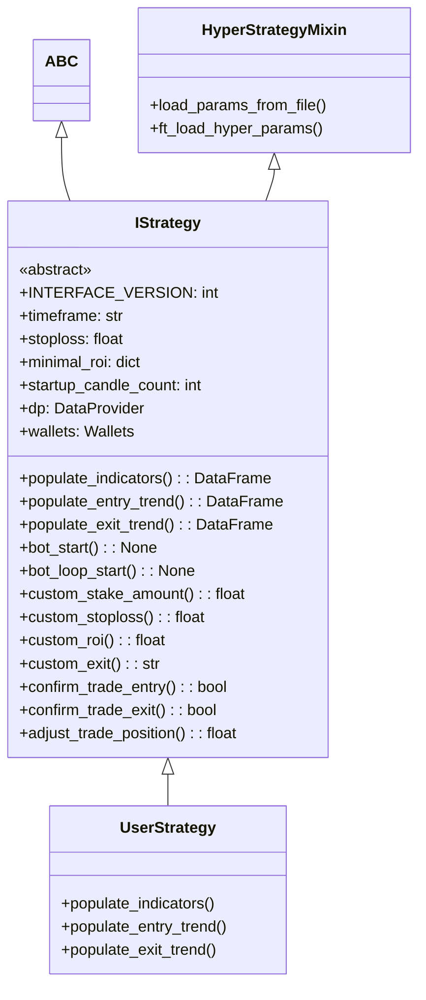
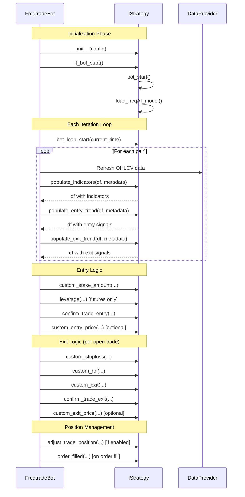
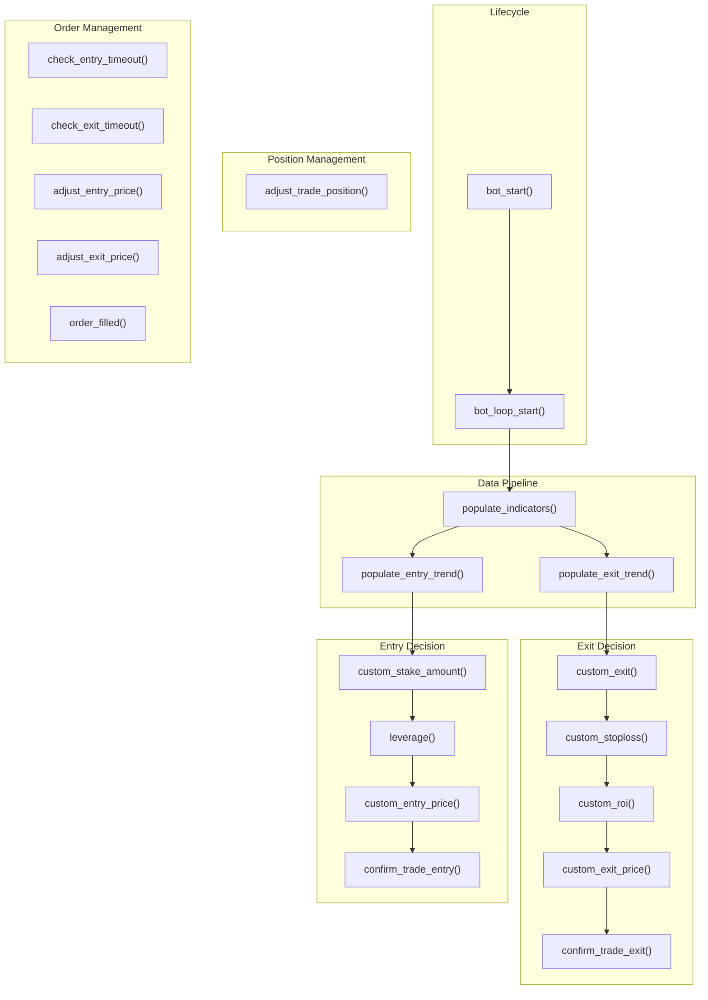
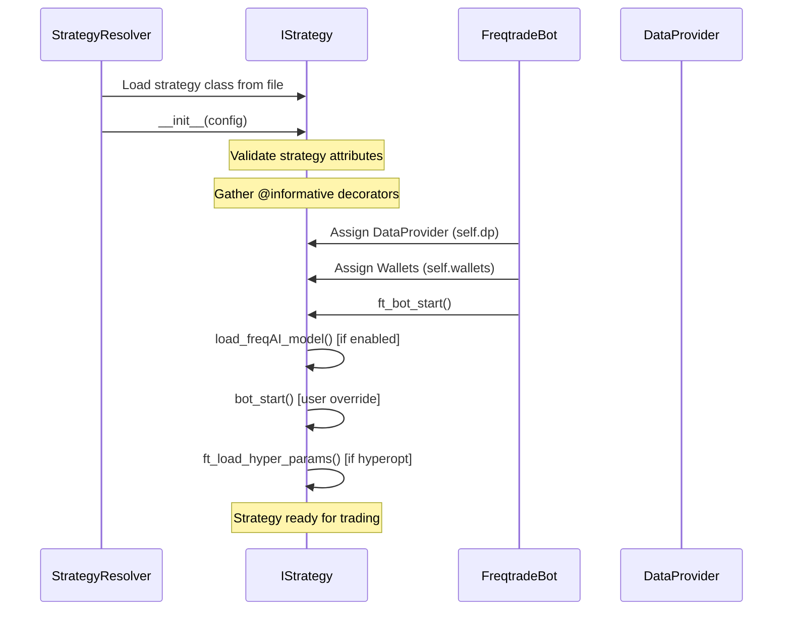

# Strategy Interface and Development

Relevant source files

* [docs/bot-basics.md](https://github.com/freqtrade/freqtrade/blob/8e91fea1/docs/bot-basics.md)
* [docs/strategy-advanced.md](https://github.com/freqtrade/freqtrade/blob/8e91fea1/docs/strategy-advanced.md)
* [docs/strategy-callbacks.md](https://github.com/freqtrade/freqtrade/blob/8e91fea1/docs/strategy-callbacks.md)
* [docs/strategy-customization.md](https://github.com/freqtrade/freqtrade/blob/8e91fea1/docs/strategy-customization.md)
* [docs/strategy\_migration.md](https://github.com/freqtrade/freqtrade/blob/8e91fea1/docs/strategy_migration.md)
* [freqtrade/enums/exittype.py](https://github.com/freqtrade/freqtrade/blob/8e91fea1/freqtrade/enums/exittype.py)
* [freqtrade/strategy/\_\_init\_\_.py](https://github.com/freqtrade/freqtrade/blob/8e91fea1/freqtrade/strategy/__init__.py)
* [freqtrade/strategy/informative\_decorator.py](https://github.com/freqtrade/freqtrade/blob/8e91fea1/freqtrade/strategy/informative_decorator.py)
* [freqtrade/strategy/interface.py](https://github.com/freqtrade/freqtrade/blob/8e91fea1/freqtrade/strategy/interface.py)
* [freqtrade/strategy/strategy\_helper.py](https://github.com/freqtrade/freqtrade/blob/8e91fea1/freqtrade/strategy/strategy_helper.py)
* [freqtrade/templates/strategy\_subtemplates/strategy\_methods\_advanced.j2](https://github.com/freqtrade/freqtrade/blob/8e91fea1/freqtrade/templates/strategy_subtemplates/strategy_methods_advanced.j2)
* [tests/strategy/strats/informative\_decorator\_strategy.py](https://github.com/freqtrade/freqtrade/blob/8e91fea1/tests/strategy/strats/informative_decorator_strategy.py)
* [tests/strategy/test\_strategy\_helpers.py](https://github.com/freqtrade/freqtrade/blob/8e91fea1/tests/strategy/test_strategy_helpers.py)

This page documents the `IStrategy` interface, which defines how trading strategies are implemented in Freqtrade. Strategies contain all trading logic including indicator calculation, entry/exit signal generation, and trade management callbacks.

**Scope**: This page covers the strategy interface structure, mandatory methods, optional callbacks, and development patterns. For callback implementation details, see [Strategy Callbacks and Customization](/freqtrade/freqtrade/5.2-strategy-callbacks-and-customization). For basic strategy development workflow, see other documentation. For data access patterns in strategies, see [Data Provider and Market Data Flow](/freqtrade/freqtrade/2.4-data-provider-and-market-data-flow).

---

## IStrategy Interface Overview

The [`IStrategy`](https://github.com/freqtrade/freqtrade/blob/8e91fea1/`IStrategy`) abstract base class defines the contract between user strategies and the Freqtrade bot. All custom strategies must inherit from this class and implement its mandatory methods.

### Interface Version

Strategies specify their interface version via the `INTERFACE_VERSION` class attribute:

```
```
INTERFACE_VERSION: int = 3
```
```

* **Version 1**: Deprecated, no longer supported
* **Version 2**: Introduced `metadata` dict in populate methods
* **Version 3**: Added support for short trades and leverage (current)

[freqtrade/strategy/interface.py62-67](https://github.com/freqtrade/freqtrade/blob/8e91fea1/freqtrade/strategy/interface.py#L62-L67)

### Core Class Structure



**Sources**: [freqtrade/strategy/interface.py51-157](https://github.com/freqtrade/freqtrade/blob/8e91fea1/freqtrade/strategy/interface.py#L51-L157)

---

## Mandatory Methods

Every strategy must implement three abstract methods that define the core trading logic:

### populate\_indicators

Calculates technical indicators on OHLCV data. Called once per pair during each data refresh cycle.

```
```
@abstractmethod
def populate_indicators(self, dataframe: DataFrame, metadata: dict) -> DataFrame:
    """
    :param dataframe: DataFrame with OHLCV data from exchange
    :param metadata: Additional info including 'pair'
    :return: DataFrame with calculated indicators
    """
```
```

**Key points**:

* Adds indicator columns to the dataframe
* Must return the dataframe with original OHLCV columns intact
* Called before entry/exit trend methods
* The `metadata['pair']` contains the trading pair being analyzed

[freqtrade/strategy/interface.py227-235](https://github.com/freqtrade/freqtrade/blob/8e91fea1/freqtrade/strategy/interface.py#L227-L235)

### populate\_entry\_trend

Generates entry signals by setting the `enter_long` column (and optionally `enter_short` for shorts).

```
```
def populate_entry_trend(self, dataframe: DataFrame, metadata: dict) -> DataFrame:
    """
    :param dataframe: DataFrame with indicators
    :param metadata: Additional info including 'pair'
    :return: DataFrame with entry signal columns
    """
```
```

**Signal columns**:

* `enter_long`: Set to `1` for long entry signals, `0` otherwise
* `enter_short`: Set to `1` for short entry signals (if `can_short = True`)
* `enter_tag`: Optional string to tag the entry reason (max 255 chars)

[freqtrade/strategy/interface.py246-253](https://github.com/freqtrade/freqtrade/blob/8e91fea1/freqtrade/strategy/interface.py#L246-L253)

### populate\_exit\_trend

Generates exit signals by setting the `exit_long` column (and optionally `exit_short` for shorts).

```
```
def populate_exit_trend(self, dataframe: DataFrame, metadata: dict) -> DataFrame:
    """
    :param dataframe: DataFrame with indicators
    :param metadata: Additional info including 'pair'
    :return: DataFrame with exit signal columns
    """
```
```

**Signal columns**:

* `exit_long`: Set to `1` for long exit signals, `0` otherwise
* `exit_short`: Set to `1` for short exit signals
* `exit_tag`: Optional string to tag the exit reason (max 100 chars)

[freqtrade/strategy/interface.py265-272](https://github.com/freqtrade/freqtrade/blob/8e91fea1/freqtrade/strategy/interface.py#L265-L272)

**Sources**: [freqtrade/strategy/interface.py227-272](https://github.com/freqtrade/freqtrade/blob/8e91fea1/freqtrade/strategy/interface.py#L227-L272) [docs/strategy-customization.md280-410](https://github.com/freqtrade/freqtrade/blob/8e91fea1/docs/strategy-customization.md#L280-L410)

---

## Strategy Execution Flow

The following diagram shows how strategy methods are called during the bot's main execution loop:



**Method Call Frequency**:

| Method | Live/Dry-Run | Backtesting |
| --- | --- | --- |
| `populate_indicators()` | Once per candle close | Once for entire dataset |
| `populate_entry_trend()` | Once per candle close | Once for entire dataset |
| `populate_exit_trend()` | Once per candle close | Once for entire dataset |
| `bot_loop_start()` | Every ~5 seconds | Once per candle |
| `custom_exit()` | Every ~5 seconds | Once per candle |
| `custom_stoploss()` | Every ~5 seconds | Once per candle |
| `confirm_trade_entry()` | When placing order | When signal detected |
| `order_filled()` | When order fills | When order simulated |

**Sources**: [freqtrade/strategy/interface.py210-225](https://github.com/freqtrade/freqtrade/blob/8e91fea1/freqtrade/strategy/interface.py#L210-L225) [docs/bot-basics.md36-106](https://github.com/freqtrade/freqtrade/blob/8e91fea1/docs/bot-basics.md#L36-L106)

---

## Optional Lifecycle Callbacks

### bot\_start

Called once when the strategy is first loaded, after the `DataProvider` and `Wallets` are initialized.

```
```
def bot_start(self, **kwargs) -> None:
    """
    Called only once after bot instantiation.
    Use for one-time initialization tasks.
    """
```
```

**Use cases**:

* Initialize external data sources
* Load custom models or data
* Set up persistent state

[freqtrade/strategy/interface.py274-279](https://github.com/freqtrade/freqtrade/blob/8e91fea1/freqtrade/strategy/interface.py#L274-L279)

### bot\_loop\_start

Called at the start of each bot iteration (every ~5 seconds in live, once per candle in backtesting).

```
```
def bot_loop_start(self, current_time: datetime, **kwargs) -> None:
    """
    Called at the start of each iteration.
    Use for pair-independent tasks.
    
    :param current_time: Current datetime
    """
```
```

**Use cases**:

* Fetch external data for all pairs
* Update global state
* Perform periodic calculations

[freqtrade/strategy/interface.py281-289](https://github.com/freqtrade/freqtrade/blob/8e91fea1/freqtrade/strategy/interface.py#L281-L289)

**Sources**: [freqtrade/strategy/interface.py274-289](https://github.com/freqtrade/freqtrade/blob/8e91fea1/freqtrade/strategy/interface.py#L274-L289) [docs/strategy-callbacks.md33-86](https://github.com/freqtrade/freqtrade/blob/8e91fea1/docs/strategy-callbacks.md#L33-L86)

---

## Trade Entry Callbacks

### custom\_stake\_amount

Customizes the stake amount for each new trade.

```
```
def custom_stake_amount(
    self,
    pair: str,
    current_time: datetime,
    current_rate: float,
    proposed_stake: float,
    min_stake: float | None,
    max_stake: float,
    leverage: float,
    entry_tag: str | None,
    side: str,
    **kwargs
) -> float:
    """
    :param proposed_stake: Bot's proposed stake amount
    :param min_stake: Minimum allowed by exchange
    :param max_stake: Maximum allowed (balance or limits)
    :param side: 'long' or 'short'
    :return: Stake amount (between min_stake and max_stake)
    """
```
```

**Behavior**:

* Return `0` or `None` to prevent trade
* Bot clamps returned value to `[min_stake, max_stake]`
* Exceptions fall back to `proposed_stake`

[freqtrade/strategy/interface.py620-647](https://github.com/freqtrade/freqtrade/blob/8e91fea1/freqtrade/strategy/interface.py#L620-L647)

### confirm\_trade\_entry

Final confirmation before placing entry order. **Timing-critical** - avoid heavy computation.

```
```
def confirm_trade_entry(
    self,
    pair: str,
    order_type: str,
    amount: float,
    rate: float,
    time_in_force: str,
    current_time: datetime,
    entry_tag: str | None,
    side: str,
    **kwargs
) -> bool:
    """
    Called right before placing entry order.
    
    :param side: 'long' or 'short'
    :return: True to place order, False to abort
    """
```
```

[freqtrade/strategy/interface.py353-387](https://github.com/freqtrade/freqtrade/blob/8e91fea1/freqtrade/strategy/interface.py#L353-L387)

### custom\_entry\_price

Overrides the calculated entry price for limit orders.

```
```
def custom_entry_price(
    self,
    pair: str,
    trade: Trade | None,
    current_time: datetime,
    proposed_rate: float,
    entry_tag: str | None,
    side: str,
    **kwargs
) -> float:
    """
    :param trade: None for first entry, Trade object for additional entries
    :param proposed_rate: Calculated from entry_pricing config
    :return: Custom entry price (default: proposed_rate)
    """
```
```

**Notes**:

* Max 2% deviation from current price (configurable via `custom_price_max_distance_ratio`)
* Only affects limit orders
* `trade` is `None` for initial entry

[freqtrade/strategy/interface.py501-527](https://github.com/freqtrade/freqtrade/blob/8e91fea1/freqtrade/strategy/interface.py#L501-L527)

**Sources**: [freqtrade/strategy/interface.py353-647](https://github.com/freqtrade/freqtrade/blob/8e91fea1/freqtrade/strategy/interface.py#L353-L647) [docs/strategy-callbacks.md88-123](https://github.com/freqtrade/freqtrade/blob/8e91fea1/docs/strategy-callbacks.md#L88-L123)

---

## Trade Exit Callbacks

### custom\_exit

Generates custom exit signals based on trade state. Called every iteration for open trades.

```
```
def custom_exit(
    self,
    pair: str,
    trade: Trade,
    current_time: datetime,
    current_rate: float,
    current_profit: float,
    **kwargs
) -> str | bool | None:
    """
    :param current_profit: Current profit ratio
    :return: String (exit reason), True, or None/False
    """
```
```

**Behavior**:

* Returning non-empty string or `True` triggers exit
* String is used as exit reason (max 64 chars)
* Always called unless `use_exit_signal=False`
* Ignores `exit_profit_only` setting

[freqtrade/strategy/interface.py589-618](https://github.com/freqtrade/freqtrade/blob/8e91fea1/freqtrade/strategy/interface.py#L589-L618)

### custom\_stoploss

Implements dynamic stoploss logic. Requires `use_custom_stoploss = True`.

```
```
def custom_stoploss(
    self,
    pair: str,
    trade: Trade,
    current_time: datetime,
    current_rate: float,
    current_profit: float,
    after_fill: bool,
    **kwargs
) -> float | None:
    """
    :param after_fill: True after position adjustment fills
    :return: Stoploss ratio relative to current_rate (e.g., -0.05 for 5% below)
    """
```
```

**Important rules**:

* Return value is the distance from `current_rate`, not `open_rate`
* Can only move stoploss up (more restrictive), never down
* Absolute value is used (sign ignored)
* `None` means no change
* Strategy `stoploss` attribute is hard lower limit
* For futures: returned value represents risk (already adjusted for leverage)

[freqtrade/strategy/interface.py441-470](https://github.com/freqtrade/freqtrade/blob/8e91fea1/freqtrade/strategy/interface.py#L441-L470)

### custom\_roi

Implements dynamic ROI (Return on Investment) logic. Requires `use_custom_roi = True`.

```
```
def custom_roi(
    self,
    pair: str,
    trade: Trade,
    current_time: datetime,
    trade_duration: int,
    entry_tag: str | None,
    side: str,
    **kwargs
) -> float | None:
    """
    :param trade_duration: Minutes since trade open
    :param side: 'long' or 'short'
    :return: ROI ratio (e.g., 0.05 for 5%) or None
    """
```
```

**Behavior**:

* Works alongside `minimal_roi` - lower threshold triggers exit
* Return `None` to use only `minimal_roi`
* Exit triggered when profit reaches returned value

[freqtrade/strategy/interface.py472-499](https://github.com/freqtrade/freqtrade/blob/8e91fea1/freqtrade/strategy/interface.py#L472-L499)

### custom\_exit\_price

Overrides the calculated exit price for limit orders.

```
```
def custom_exit_price(
    self,
    pair: str,
    trade: Trade,
    current_time: datetime,
    proposed_rate: float,
    current_profit: float,
    exit_tag: str | None,
    **kwargs
) -> float:
    """
    :param proposed_rate: Calculated from exit_pricing config
    :return: Custom exit price (default: proposed_rate)
    """
```
```

[freqtrade/strategy/interface.py529-555](https://github.com/freqtrade/freqtrade/blob/8e91fea1/freqtrade/strategy/interface.py#L529-L555)

### confirm\_trade\_exit

Final confirmation before placing exit order. **Timing-critical**.

```
```
def confirm_trade_exit(
    self,
    pair: str,
    trade: Trade,
    order_type: str,
    amount: float,
    rate: float,
    time_in_force: str,
    exit_reason: str,
    current_time: datetime,
    **kwargs
) -> bool:
    """
    :param exit_reason: 'roi', 'stop_loss', 'stoploss_on_exchange',
                        'trailing_stop_loss', 'exit_signal', 'force_exit',
                        'emergency_exit', 'custom_exit', 'partial_exit'
    :return: True to place order, False to abort
    """
```
```

[freqtrade/strategy/interface.py389-425](https://github.com/freqtrade/freqtrade/blob/8e91fea1/freqtrade/strategy/interface.py#L389-L425)

**Sources**: [freqtrade/strategy/interface.py389-618](https://github.com/freqtrade/freqtrade/blob/8e91fea1/freqtrade/strategy/interface.py#L389-L618) [docs/strategy-callbacks.md124-633](https://github.com/freqtrade/freqtrade/blob/8e91fea1/docs/strategy-callbacks.md#L124-L633)

---

## Order Management Callbacks

### Order Timeout Callbacks

Override default order timeout behavior:

```
```
def check_entry_timeout(
    self, pair: str, trade: Trade, order: Order, 
    current_time: datetime, **kwargs
) -> bool:
    """
    Called for unfilled entry orders.
    :return: True to cancel order
    """
```
```

```
```
def check_exit_timeout(
    self, pair: str, trade: Trade, order: Order,
    current_time: datetime, **kwargs
) -> bool:
    """
    Called for unfilled exit orders.
    :return: True to cancel order
    """
```
```

**Notes**:

* `unfilledtimeout` config checked first
* Both return `False` by default (no cancellation)

[freqtrade/strategy/interface.py299-351](https://github.com/freqtrade/freqtrade/blob/8e91fea1/freqtrade/strategy/interface.py#L299-L351)

### Order Price Adjustment

Adjust limit order prices for unfilled orders:

```
```
def adjust_entry_price(
    self,
    trade: Trade,
    order: Order | None,
    pair: str,
    current_time: datetime,
    proposed_rate: float,
    current_order_rate: float,
    entry_tag: str | None,
    side: str,
    **kwargs
) -> float | None:
    """
    Called for unfilled entry orders on each iteration.
    
    :param current_order_rate: Current order price
    :param proposed_rate: New suggested price
    :return: New price, current_order_rate to keep, None to cancel
    """
```
```

```
```
def adjust_exit_price(
    self,
    trade: Trade,
    order: Order | None,
    pair: str,
    current_time: datetime,
    proposed_rate: float,
    current_order_rate: float,
    entry_tag: str | None,
    side: str,
    **kwargs
) -> float | None:
    """
    Called for unfilled exit orders on each iteration.
    """
```
```

**Unified callback**:

```
```
def adjust_order_price(
    self,
    trade: Trade,
    order: Order | None,
    pair: str,
    current_time: datetime,
    proposed_rate: float,
    current_order_rate: float,
    entry_tag: str | None,
    side: str,
    is_entry: bool,
    **kwargs
) -> float | None:
    """
    Unified callback for both entry and exit price adjustments.
    :param is_entry: True for entry, False for exit
    """
```
```

[freqtrade/strategy/interface.py692-825](https://github.com/freqtrade/freqtrade/blob/8e91fea1/freqtrade/strategy/interface.py#L692-L825)

### order\_filled

Notification callback when any order fills:

```
```
def order_filled(
    self, pair: str, trade: Trade, order: Order,
    current_time: datetime, **kwargs
) -> None:
    """
    Called after order fills.
    Works for entry, exit, stoploss, and position adjustment orders.
    """
```
```

[freqtrade/strategy/interface.py427-439](https://github.com/freqtrade/freqtrade/blob/8e91fea1/freqtrade/strategy/interface.py#L427-L439)

**Sources**: [freqtrade/strategy/interface.py299-825](https://github.com/freqtrade/freqtrade/blob/8e91fea1/freqtrade/strategy/interface.py#L299-L825) [docs/strategy-callbacks.md689-732](https://github.com/freqtrade/freqtrade/blob/8e91fea1/docs/strategy-callbacks.md#L689-L732)

---

## Position Management

### adjust\_trade\_position

Enables position size adjustments (DCA, partial exits). Requires `position_adjustment_enable = True`.

```
```
def adjust_trade_position(
    self,
    trade: Trade,
    current_time: datetime,
    current_rate: float,
    current_profit: float,
    min_stake: float | None,
    max_stake: float,
    current_entry_rate: float,
    current_exit_rate: float,
    current_entry_profit: float,
    current_exit_profit: float,
    **kwargs
) -> float | None | tuple[float | None, str | None]:
    """
    :param current_entry_rate: Rate using entry pricing
    :param current_exit_rate: Rate using exit pricing
    :param current_entry_profit: Profit using entry pricing
    :param current_exit_profit: Profit using exit pricing
    :return: Stake adjustment (+increase, -decrease), 
             or tuple(stake, reason_string)
    """
```
```

**Behavior**:

* Positive values: add to position (DCA)
* Negative values: reduce position (partial exit)
* `None`: no adjustment
* Optional second tuple element: order reason tag

**Configuration**:

* `position_adjustment_enable = True` required
* `max_entry_position_adjustment`: limit additional entries (-1 = unlimited)

[freqtrade/strategy/interface.py649-690](https://github.com/freqtrade/freqtrade/blob/8e91fea1/freqtrade/strategy/interface.py#L649-L690)

### leverage

Determines leverage for futures trades. Only called in futures mode.

```
```
def leverage(
    self,
    pair: str,
    current_time: datetime,
    current_rate: float,
    proposed_leverage: float,
    max_leverage: float,
    entry_tag: str | None,
    side: str,
    **kwargs
) -> float:
    """
    :param proposed_leverage: Bot's proposed leverage
    :param max_leverage: Exchange max for this pair
    :return: Leverage between 1.0 and max_leverage
    """
```
```

[freqtrade/strategy/interface.py827-850](https://github.com/freqtrade/freqtrade/blob/8e91fea1/freqtrade/strategy/interface.py#L827-L850)

**Sources**: [freqtrade/strategy/interface.py649-850](https://github.com/freqtrade/freqtrade/blob/8e91fea1/freqtrade/strategy/interface.py#L649-L850)

---

## Strategy Attributes

### Required Attributes

| Attribute | Type | Description |
| --- | --- | --- |
| `timeframe` | `str` | Candle timeframe (`"1m"`, `"5m"`, `"1h"`, etc.) |
| `stoploss` | `float` | Hard stoploss as ratio (e.g., `-0.10` for -10%) |

[freqtrade/strategy/interface.py75-91](https://github.com/freqtrade/freqtrade/blob/8e91fea1/freqtrade/strategy/interface.py#L75-L91)

### Optional Attributes

| Attribute | Type | Default | Description |
| --- | --- | --- | --- |
| `minimal_roi` | `dict` | `{}` | Time-based ROI thresholds |
| `use_custom_roi` | `bool` | `False` | Enable `custom_roi()` callback |
| `use_custom_stoploss` | `bool` | `False` | Enable `custom_stoploss()` callback |
| `trailing_stop` | `bool` | `False` | Enable trailing stoploss |
| `trailing_stop_positive` | `float` | `None` | Start trailing at profit level |
| `trailing_stop_positive_offset` | `float` | `0.0` | Offset for trailing activation |
| `trailing_only_offset_is_reached` | `bool` | `False` | Only trail after offset |
| `can_short` | `bool` | `False` | Allow short trades |
| `max_open_trades` | `int` | - | Max concurrent trades (overrides config) |
| `startup_candle_count` | `int` | `0` | Candles needed for stable indicators |
| `process_only_new_candles` | `bool` | `True` | Only process on candle close |
| `position_adjustment_enable` | `bool` | `False` | Enable position adjustments |
| `max_entry_position_adjustment` | `int` | `-1` | Max additional entries (-1 = unlimited) |
| `ignore_buying_expired_candle_after` | `int` | `0` | Ignore old entry signals (seconds) |
| `disable_dataframe_checks` | `bool` | `False` | Disable dataframe validation |

[freqtrade/strategy/interface.py69-127](https://github.com/freqtrade/freqtrade/blob/8e91fea1/freqtrade/strategy/interface.py#L69-L127)

### Order Configuration

```
```
order_types: dict = {
    "entry": "limit",          # or "market"
    "exit": "limit",           # or "market"
    "stoploss": "limit",       # or "market"
    "stoploss_on_exchange": False,
    "stoploss_on_exchange_interval": 60,  # seconds
}

order_time_in_force: dict = {
    "entry": "GTC",   # Good-til-cancelled
    "exit": "GTC",
}
```
```

[freqtrade/strategy/interface.py93-106](https://github.com/freqtrade/freqtrade/blob/8e91fea1/freqtrade/strategy/interface.py#L93-L106)

### Exit Signal Configuration

```
```
use_exit_signal: bool           # Use populate_exit_trend() signals
exit_profit_only: bool          # Only exit on profit
exit_profit_offset: float       # Minimum profit for exit signal
ignore_roi_if_entry_signal: bool  # Ignore ROI if entry signal active
```
```

[freqtrade/strategy/interface.py111-114](https://github.com/freqtrade/freqtrade/blob/8e91fea1/freqtrade/strategy/interface.py#L111-L114)

### Protections

```
```
protections: list = [
    {
        "method": "StoplossGuard",
        "lookback_period_candles": 60,
        "trade_limit": 4,
        "stop_duration_candles": 20,
    }
]
```
```

[freqtrade/strategy/interface.py129-130](https://github.com/freqtrade/freqtrade/blob/8e91fea1/freqtrade/strategy/interface.py#L129-L130)

**Sources**: [freqtrade/strategy/interface.py69-145](https://github.com/freqtrade/freqtrade/blob/8e91fea1/freqtrade/strategy/interface.py#L69-L145)

---

## Data Access

### DataProvider

Strategies access market data via the `self.dp` (`DataProvider`) attribute:

```
```
# Get analyzed dataframe for current pair
dataframe, last_updated = self.dp.get_analyzed_dataframe(
    pair=pair, 
    timeframe=self.timeframe
)

# Get raw OHLCV data
df = self.dp.get_pair_dataframe(
    pair="BTC/USDT",
    timeframe="1h",
    candle_type=CandleType.SPOT
)

# Current orderbook
orderbook = self.dp.orderbook(pair, maximum=20)

# Market information
market = self.dp.market(pair)
```
```

[freqtrade/strategy/interface.py135](https://github.com/freqtrade/freqtrade/blob/8e91fea1/freqtrade/strategy/interface.py#L135-L135)

### Wallets

Access wallet balance information via `self.wallets`:

```
```
# Total stake amount available
total_stake = self.wallets.get_total_stake_amount()

# Free balance for a currency
free_balance = self.wallets.get_free(currency)
```
```

[freqtrade/strategy/interface.py136](https://github.com/freqtrade/freqtrade/blob/8e91fea1/freqtrade/strategy/interface.py#L136-L136)

### Informative Pairs

Request additional data pairs via `informative_pairs()` method:

```
```
def informative_pairs(self) -> ListPairsWithTimeframes:
    """
    Define additional pairs to fetch data for.
    
    :return: List of (pair, timeframe) tuples
    """
    return [
        ("ETH/USDT", "5m"),
        ("BTC/USDT", "15m"),
    ]
```
```

[freqtrade/strategy/interface.py852-863](https://github.com/freqtrade/freqtrade/blob/8e91fea1/freqtrade/strategy/interface.py#L852-L863)

**Decorator alternative** using `@informative`:

```
```
from freqtrade.strategy import informative

@informative('1h')
def populate_indicators_1h(self, dataframe: DataFrame, metadata: dict) -> DataFrame:
    dataframe['rsi_1h'] = ta.RSI(dataframe, timeperiod=14)
    return dataframe
```
```

[freqtrade/strategy/informative\_decorator.py24-74](https://github.com/freqtrade/freqtrade/blob/8e91fea1/freqtrade/strategy/informative_decorator.py#L24-L74)

**Sources**: [freqtrade/strategy/interface.py135-863](https://github.com/freqtrade/freqtrade/blob/8e91fea1/freqtrade/strategy/interface.py#L135-L863) [freqtrade/strategy/informative\_decorator.py24-74](https://github.com/freqtrade/freqtrade/blob/8e91fea1/freqtrade/strategy/informative_decorator.py#L24-L74)

---

## Helper Functions

### Stoploss Helpers

Two utility functions for stoploss calculations:

```
```
from freqtrade.strategy import stoploss_from_open, stoploss_from_absolute

# Calculate stoploss relative to current_rate from desired stop relative to open_rate
stoploss = stoploss_from_open(
    open_relative_stop=0.05,     # 5% above entry
    current_profit=0.10,          # Current profit ratio
    is_short=trade.is_short,
    leverage=trade.leverage
)

# Calculate stoploss from absolute price
stoploss = stoploss_from_absolute(
    stop_rate=100.0,              # Desired stop price
    current_rate=110.0,           # Current price
    is_short=trade.is_short,
    leverage=trade.leverage
)
```
```

[freqtrade/strategy/strategy\_helper.py119-186](https://github.com/freqtrade/freqtrade/blob/8e91fea1/freqtrade/strategy/strategy_helper.py#L119-L186)

### Merge Informative Pairs

Merge higher timeframe data without lookahead bias:

```
```
from freqtrade.strategy import merge_informative_pair

# Get informative data
informative = self.dp.get_pair_dataframe("BTC/USDT", "1h")
informative['rsi_1h'] = ta.RSI(informative, 14)

# Merge into main dataframe
dataframe = merge_informative_pair(
    dataframe=dataframe,
    informative=informative,
    timeframe="5m",
    timeframe_inf="1h",
    ffill=True,  # Forward fill gaps
    append_timeframe=True  # Add _1h suffix to columns
)
```
```

**Behavior**:

* Shifts informative data forward to prevent lookahead bias
* 5m candles at 15:15 merge with 1h candle from 14:00
* Creates columns: `date_1h`, `open_1h`, `high_1h`, `rsi_1h`, etc.

[freqtrade/strategy/strategy\_helper.py6-116](https://github.com/freqtrade/freqtrade/blob/8e91fea1/freqtrade/strategy/strategy_helper.py#L6-L116)

**Sources**: [freqtrade/strategy/strategy\_helper.py6-186](https://github.com/freqtrade/freqtrade/blob/8e91fea1/freqtrade/strategy/strategy_helper.py#L6-L186) [freqtrade/strategy/\_\_init\_\_.py20-24](https://github.com/freqtrade/freqtrade/blob/8e91fea1/freqtrade/strategy/__init__.py#L20-L24)

---

## Strategy Development Patterns

### Strategy Callback Categorization



**Sources**: [freqtrade/strategy/interface.py51-888](https://github.com/freqtrade/freqtrade/blob/8e91fea1/freqtrade/strategy/interface.py#L51-L888)

### Metadata Dictionary Structure

The `metadata` dict passed to populate methods contains:

```
```
metadata = {
    'pair': 'BTC/USDT',        # Trading pair
    'timeframe': '5m',          # Strategy timeframe (in some contexts)
}
```
```

**Important**: Never modify `metadata` - it does not persist across method calls.

[freqtrade/strategy/interface.py228-506](https://github.com/freqtrade/freqtrade/blob/8e91fea1/freqtrade/strategy/interface.py#L228-L506)

### Strategy Version Method

Implement versioning for your strategy:

```
```
def version(self) -> str | None:
    """
    Returns version of the strategy.
    Useful for tracking strategy changes.
    """
    return "1.2.0"
```
```

[freqtrade/strategy/interface.py865-869](https://github.com/freqtrade/freqtrade/blob/8e91fea1/freqtrade/strategy/interface.py#L865-L869)

**Sources**: [freqtrade/strategy/interface.py228-869](https://github.com/freqtrade/freqtrade/blob/8e91fea1/freqtrade/strategy/interface.py#L228-L869)

---

## Strategy State Management

### Persistent Storage (Recommended)

Store trade-specific data using the Trade object:

```
```
# Store data
trade.set_custom_data(key='entry_type', value='breakout')
trade.set_custom_data(key='stop_count', value=3)

# Retrieve data
entry_type = trade.get_custom_data(key='entry_type')
stop_count = trade.get_custom_data(key='stop_count', default=0)
```
```

**Features**:

* Data persists across bot restarts
* Automatically JSON-serialized
* Tied to specific trade
* Available in any callback with Trade object

[freqtrade/strategy/interface.py34](https://github.com/freqtrade/freqtrade/blob/8e91fea1/freqtrade/strategy/interface.py#L34-L34)

### Non-Persistent Storage (Deprecated)

```
```
class MyStrategy(IStrategy):
    # Custom dictionary for pair-level data
    custom_info = {}
    
    def populate_indicators(self, dataframe, metadata):
        pair = metadata['pair']
        if pair not in self.custom_info:
            self.custom_info[pair] = {}
        
        self.custom_info[pair]['last_rsi'] = dataframe['rsi'].iloc[-1]
        return dataframe
```
```

**Limitations**:

* Not persisted across restarts
* Can consume significant memory
* Deprecated - use persistent storage instead

**Sources**: [docs/strategy-advanced.md14-137](https://github.com/freqtrade/freqtrade/blob/8e91fea1/docs/strategy-advanced.md#L14-L137)

---

## FreqAI Integration

Strategies can integrate machine learning models via FreqAI:

```
```
def load_freqAI_model(self) -> None:
    """
    Called during strategy initialization if freqai.enabled = True.
    Automatically loads FreqAI model and downloads training data.
    """
```
```

**Access FreqAI in strategy**:

```
```
# Access FreqAI instance
self.freqai

# FreqAI config
self.freqai_info

# Called automatically during populate_indicators
# if FreqAI is enabled
```
```

[freqtrade/strategy/interface.py179-209](https://github.com/freqtrade/freqtrade/blob/8e91fea1/freqtrade/strategy/interface.py#L179-L209)

**Note**: FreqAI integration details are covered in the FreqAI documentation.

**Sources**: [freqtrade/strategy/interface.py179-209](https://github.com/freqtrade/freqtrade/blob/8e91fea1/freqtrade/strategy/interface.py#L179-L209)

---

## Interface Implementation Details

### Strategy Loading and Initialization



**Initialization sequence**:

1. **Strategy Resolution**: Load strategy class from file
2. **Constructor Call**: `__init__(config)` initializes base attributes
3. **Decorator Processing**: Scans for `@informative` decorated methods
4. **Validation**: Checks informative timeframes ≥ strategy timeframe
5. **Dependency Injection**: Bot assigns `dp` and `wallets`
6. **Startup**: Calls `ft_bot_start()` which runs user's `bot_start()`

[freqtrade/strategy/interface.py152-220](https://github.com/freqtrade/freqtrade/blob/8e91fea1/freqtrade/strategy/interface.py#L152-L220)

### Strategy Wrapper

Most strategy methods are wrapped by `strategy_safe_wrapper` for error handling:

```
```
from freqtrade.strategy.strategy_wrapper import strategy_safe_wrapper

# Wraps method execution with try-catch
strategy_safe_wrapper(self.bot_start)()
```
```

**Protection**:

* Catches exceptions in strategy methods
* Logs errors with stack traces
* Prevents bot crash from strategy bugs
* Returns default/safe values on error

[freqtrade/strategy/interface.py217](https://github.com/freqtrade/freqtrade/blob/8e91fea1/freqtrade/strategy/interface.py#L217-L217)

**Sources**: [freqtrade/strategy/interface.py152-220](https://github.com/freqtrade/freqtrade/blob/8e91fea1/freqtrade/strategy/interface.py#L152-L220)

---

## Best Practices

### Dataframe Operations

**DO**: Use vectorized operations

```
```
dataframe.loc[
    (dataframe['rsi'] < 30) & (dataframe['volume'] > 0),
    'enter_long'
] = 1
```
```

**DON'T**: Use loops or `.iloc[-1]` in populate methods

```
```
# WRONG - creates lookahead bias in backtesting
if dataframe['rsi'].iloc[-1] < 30:
    dataframe['enter_long'].iloc[-1] = 1
```
```

### Startup Candles

Set `startup_candle_count` to the maximum indicator period:

```
```
class MyStrategy(IStrategy):
    startup_candle_count = 200  # For EMA(200)
    
    def populate_indicators(self, dataframe, metadata):
        dataframe['ema200'] = ta.EMA(dataframe, timeperiod=200)
        return dataframe
```
```

**Why**: Ensures stable indicator values from the start of backtesting.

### Callback Performance

**Critical-timing callbacks** (called frequently, executed quickly):

* `confirm_trade_entry()`
* `confirm_trade_exit()`
* `custom_entry_price()`
* `custom_exit_price()`

**Avoid in critical callbacks**:

* Heavy computations
* Network requests
* Database queries

### Required Columns

**Never remove** these columns from dataframes:

* `open`, `high`, `low`, `close`, `volume`
* `date` (in some contexts)

**Always return** the complete dataframe from populate methods.

### Leverage and Futures

For futures strategies:

* Set `can_short = True` to enable short trades
* Implement `leverage()` callback for dynamic leverage
* Remember `custom_stoploss()` returns risk ratio (leverage-adjusted)

**Sources**: [docs/strategy-customization.md86-171](https://github.com/freqtrade/freqtrade/blob/8e91fea1/docs/strategy-customization.md#L86-L171) [docs/strategy-callbacks.md1-27](https://github.com/freqtrade/freqtrade/blob/8e91fea1/docs/strategy-callbacks.md#L1-L27)

---

## Summary

The `IStrategy` interface provides:

* **3 mandatory methods**: `populate_indicators()`, `populate_entry_trend()`, `populate_exit_trend()`
* **20+ optional callbacks** for fine-grained control over trade lifecycle
* **Data access** via `DataProvider` and `Wallets`
* **Helper functions** for stoploss calculations and data merging
* **Persistent storage** for trade-specific state
* **FreqAI integration** for ML-based strategies

**Key files**:

* [`freqtrade/strategy/interface.py`](https://github.com/freqtrade/freqtrade/blob/8e91fea1/`freqtrade/strategy/interface.py`) - Core IStrategy class
* [`freqtrade/strategy/strategy\_helper.py`](https://github.com/freqtrade/freqtrade/blob/8e91fea1/`freqtrade/strategy/strategy_helper.py`) - Helper functions
* [`freqtrade/strategy/informative\_decorator.py`](https://github.com/freqtrade/freqtrade/blob/8e91fea1/`freqtrade/strategy/informative_decorator.py`) - @informative decorator
* [`freqtrade/strategy/\_\_init\_\_.py`](https://github.com/freqtrade/freqtrade/blob/8e91fea1/`freqtrade/strategy/__init__.py`) - Public API exports

**Sources**: [freqtrade/strategy/interface.py1-888](https://github.com/freqtrade/freqtrade/blob/8e91fea1/freqtrade/strategy/interface.py#L1-L888) [freqtrade/strategy/\_\_init\_\_.py1-50](https://github.com/freqtrade/freqtrade/blob/8e91fea1/freqtrade/strategy/__init__.py#L1-L50)