# Telegram Bot Interface

Relevant source files

* [docs/rest-api.md](https://github.com/freqtrade/freqtrade/blob/8e91fea1/docs/rest-api.md)
* [docs/telegram-usage.md](https://github.com/freqtrade/freqtrade/blob/8e91fea1/docs/telegram-usage.md)
* [freqtrade/rpc/api\_server/api\_schemas.py](https://github.com/freqtrade/freqtrade/blob/8e91fea1/freqtrade/rpc/api_server/api_schemas.py)
* [freqtrade/rpc/api\_server/api\_v1.py](https://github.com/freqtrade/freqtrade/blob/8e91fea1/freqtrade/rpc/api_server/api_v1.py)
* [freqtrade/rpc/rpc.py](https://github.com/freqtrade/freqtrade/blob/8e91fea1/freqtrade/rpc/rpc.py)
* [freqtrade/rpc/telegram.py](https://github.com/freqtrade/freqtrade/blob/8e91fea1/freqtrade/rpc/telegram.py)
* [scripts/rest\_client.py](https://github.com/freqtrade/freqtrade/blob/8e91fea1/scripts/rest_client.py)
* [tests/rpc/test\_rpc.py](https://github.com/freqtrade/freqtrade/blob/8e91fea1/tests/rpc/test_rpc.py)
* [tests/rpc/test\_rpc\_apiserver.py](https://github.com/freqtrade/freqtrade/blob/8e91fea1/tests/rpc/test_rpc_apiserver.py)
* [tests/rpc/test\_rpc\_telegram.py](https://github.com/freqtrade/freqtrade/blob/8e91fea1/tests/rpc/test_rpc_telegram.py)

The Telegram Bot Interface provides real-time monitoring and control of the Freqtrade bot through Telegram messages. This interface enables users to execute commands, receive trade notifications, and monitor bot status from any device with Telegram installed. For information about the REST API interface, see [4.4](/freqtrade/freqtrade/4.4-rest-api-and-websocket). For the RPC system architecture that underlies all remote interfaces, see [4.2](/freqtrade/freqtrade/4.2-rpc-system-architecture).

## System Architecture

### RPC Integration

The Telegram bot is implemented as an `RPCHandler` subclass, integrating into Freqtrade's RPC architecture alongside other interfaces like the REST API and webhooks.


**Diagram: Telegram Bot System Architecture**

The `Telegram` class at [freqtrade/rpc/telegram.py142](https://github.com/freqtrade/freqtrade/blob/8e91fea1/freqtrade/rpc/telegram.py#L142-L142) inherits from `RPCHandler` at [freqtrade/rpc/rpc.py78](https://github.com/freqtrade/freqtrade/blob/8e91fea1/freqtrade/rpc/rpc.py#L78-L78) implementing the required `send_msg()` and `cleanup()` methods. The bot receives `RPCSendMsg` notifications from the `RPC` class and formats them for Telegram delivery.

Sources: [freqtrade/rpc/telegram.py142-158](https://github.com/freqtrade/freqtrade/blob/8e91fea1/freqtrade/rpc/telegram.py#L142-L158) [freqtrade/rpc/rpc.py78-101](https://github.com/freqtrade/freqtrade/blob/8e91fea1/freqtrade/rpc/rpc.py#L78-L101)

### Threading and Event Loop Model

The Telegram bot runs in a dedicated thread with its own asyncio event loop, separate from the main Freqtrade execution loop.

**Diagram: Telegram Bot Threading and Lifecycle**

The thread initialization occurs at [freqtrade/rpc/telegram.py159-164](https://github.com/freqtrade/freqtrade/blob/8e91fea1/freqtrade/rpc/telegram.py#L159-L164) The event loop is created at [freqtrade/rpc/telegram.py257-261](https://github.com/freqtrade/freqtrade/blob/8e91fea1/freqtrade/rpc/telegram.py#L257-L261) and the application startup sequence runs at [freqtrade/rpc/telegram.py345-372](https://github.com/freqtrade/freqtrade/blob/8e91fea1/freqtrade/rpc/telegram.py#L345-L372)

Sources: [freqtrade/rpc/telegram.py159-164](https://github.com/freqtrade/freqtrade/blob/8e91fea1/freqtrade/rpc/telegram.py#L159-L164) [freqtrade/rpc/telegram.py250-343](https://github.com/freqtrade/freqtrade/blob/8e91fea1/freqtrade/rpc/telegram.py#L250-L343) [freqtrade/rpc/telegram.py345-372](https://github.com/freqtrade/freqtrade/blob/8e91fea1/freqtrade/rpc/telegram.py#L345-L372) [freqtrade/rpc/telegram.py379-386](https://github.com/freqtrade/freqtrade/blob/8e91fea1/freqtrade/rpc/telegram.py#L379-L386)

## Authorization System

The authorization system implements a three-tier validation mechanism to control access to bot commands.


**Diagram: Authorization Flow in @authorized\_only Decorator**

### Authorization Components

| Component | Configuration Key | Type | Purpose |
| --- | --- | --- | --- |
| **chat\_id** | `telegram.chat_id` | `int` | Primary chat/group identifier where bot accepts commands |
| **topic\_id** | `telegram.topic_id` | `str` (optional) | Specific topic/thread within a Telegram group |
| **authorized\_users** | `telegram.authorized_users` | `list[str]` (optional) | List of user IDs allowed to control the bot |

The `@authorized_only` decorator at [freqtrade/rpc/telegram.py92-139](https://github.com/freqtrade/freqtrade/blob/8e91fea1/freqtrade/rpc/telegram.py#L92-L139) implements this validation. The decorator:

1. Extracts `cchat_id` from the message at [freqtrade/rpc/telegram.py109](https://github.com/freqtrade/freqtrade/blob/8e91fea1/freqtrade/rpc/telegram.py#L109-L109)
2. Validates against configured `chat_id` at [freqtrade/rpc/telegram.py113-116](https://github.com/freqtrade/freqtrade/blob/8e91fea1/freqtrade/rpc/telegram.py#L113-L116)
3. If `topic_id` is configured, validates `message_thread_id` at [freqtrade/rpc/telegram.py117-121](https://github.com/freqtrade/freqtrade/blob/8e91fea1/freqtrade/rpc/telegram.py#L117-L121)
4. If `authorized_users` is configured, validates user ID at [freqtrade/rpc/telegram.py123-126](https://github.com/freqtrade/freqtrade/blob/8e91fea1/freqtrade/rpc/telegram.py#L123-L126)
5. Performs session cleanup before and after execution at [freqtrade/rpc/telegram.py128-137](https://github.com/freqtrade/freqtrade/blob/8e91fea1/freqtrade/rpc/telegram.py#L128-L137)

Sources: [freqtrade/rpc/telegram.py92-139](https://github.com/freqtrade/freqtrade/blob/8e91fea1/freqtrade/rpc/telegram.py#L92-L139) [tests/rpc/test\_rpc\_telegram.py226-300](https://github.com/freqtrade/freqtrade/blob/8e91fea1/tests/rpc/test_rpc_telegram.py#L226-L300)

### Obtaining Configuration Values

The `/tg_info` command at [freqtrade/rpc/telegram.py1980-2007](https://github.com/freqtrade/freqtrade/blob/8e91fea1/freqtrade/rpc/telegram.py#L1980-L2007) returns the current chat and topic IDs in a format ready to copy into the configuration file. This eliminates the need for external bots to determine these values.

Sources: [freqtrade/rpc/telegram.py1980-2007](https://github.com/freqtrade/freqtrade/blob/8e91fea1/freqtrade/rpc/telegram.py#L1980-L2007) [docs/telegram-usage.md46-61](https://github.com/freqtrade/freqtrade/blob/8e91fea1/docs/telegram-usage.md#L46-L61)

## Command System

### Command Registration

Commands are registered during bot initialization as `CommandHandler` and `CallbackQueryHandler` instances.

```mermaid
flowchart TD

InitApp["_init_telegram_app()"]
CreateHandlers["Create CommandHandler<br>and CallbackQueryHandler<br>instances"]
AddHandlers["app.add_handler()"]
Commands["CommandHandler<br>(text commands)"]
Callbacks["CallbackQueryHandler<br>(inline button callbacks)"]
Status["/status → _status()"]
Profit["/profit → _profit()"]
Balance["/balance → _balance()"]
Start["/start → _start()"]
ForceExit["/forceexit → _force_exit()"]
UpdateStatus["pattern='update_status_table'<br>→ _status_table()"]
UpdateProfit["pattern='update_profit'<br>→ _profit()"]

AddHandlers --> Commands
AddHandlers --> Callbacks
Commands --> Status
Commands --> Profit
Commands --> Balance
Commands --> Start
Commands --> ForceExit
Callbacks --> UpdateStatus
Callbacks --> UpdateProfit

subgraph subGraph2 ["Example Handlers"]
    Status
    Profit
    Balance
    Start
    ForceExit
    UpdateStatus
    UpdateProfit
end

subgraph subGraph1 ["Command Types"]
    Commands
    Callbacks
end

subgraph subGraph0 ["Command Registration (_init method)"]
    InitApp
    CreateHandlers
    AddHandlers
    InitApp --> CreateHandlers
    CreateHandlers --> AddHandlers
end
```



**Diagram: Command and Callback Handler Registration**

The registration occurs at [freqtrade/rpc/telegram.py266-337](https://github.com/freqtrade/freqtrade/blob/8e91fea1/freqtrade/rpc/telegram.py#L266-L337) where two lists are populated:

1. **`handles`**: List of `CommandHandler` objects for text commands like `/status`, `/profit`, etc.
2. **`callbacks`**: List of `CallbackQueryHandler` objects for inline keyboard button callbacks with patterns like `"update_status_table"`, `"update_profit"`, etc.

The command list includes approximately 30 commands and 10 callback handlers.

Sources: [freqtrade/rpc/telegram.py266-337](https://github.com/freqtrade/freqtrade/blob/8e91fea1/freqtrade/rpc/telegram.py#L266-L337) [freqtrade/rpc/telegram.py339-342](https://github.com/freqtrade/freqtrade/blob/8e91fea1/freqtrade/rpc/telegram.py#L339-L342)

### Command Handler Pattern

All command handlers follow a consistent pattern:

```mermaid
sequenceDiagram
  participant Telegram User
  participant Command Handler
  participant (@authorized_only)
  participant Authorization Checks
  participant RPC._rpc_*()
  participant Format Response
  participant _send_msg()

  Telegram User->>Command Handler: /command [args]
  Command Handler->>Authorization Checks: Validate chat_id, topic_id, user_id
  loop [Unauthorized]
    Authorization Checks-->>Telegram User: (silent rejection)
    Authorization Checks->>Command Handler: Continue
    Command Handler->>RPC._rpc_*(): Call _rpc_method()
    RPC._rpc_*()-->>Command Handler: Return data dict/list
    Command Handler->>Format Response: Format data for Telegram
    Format Response->>_send_msg(): _send_msg(formatted_message)
    _send_msg()-->>Telegram User: Telegram message
  end
```

**Diagram: Command Handler Execution Flow**

Example handler implementation at [freqtrade/rpc/telegram.py730-855](https://github.com/freqtrade/freqtrade/blob/8e91fea1/freqtrade/rpc/telegram.py#L730-L855) (`_status` command):

1. Decorated with `@authorized_only`
2. Checks `context.args` for command arguments
3. Calls `self._rpc._rpc_trade_status(trade_ids=trade_ids)`
4. Formats response data into Telegram message
5. Sends via `await self._send_msg(msg)`

Sources: [freqtrade/rpc/telegram.py689-728](https://github.com/freqtrade/freqtrade/blob/8e91fea1/freqtrade/rpc/telegram.py#L689-L728) [freqtrade/rpc/telegram.py730-855](https://github.com/freqtrade/freqtrade/blob/8e91fea1/freqtrade/rpc/telegram.py#L730-L855)

### Keyboard Configuration

The bot supports a custom keyboard with shortcut buttons, configured via `telegram.keyboard` configuration parameter. Valid commands are validated at [freqtrade/rpc/telegram.py166-245](https://github.com/freqtrade/freqtrade/blob/8e91fea1/freqtrade/rpc/telegram.py#L166-L245) against a regex pattern list.

Sources: [freqtrade/rpc/telegram.py166-245](https://github.com/freqtrade/freqtrade/blob/8e91fea1/freqtrade/rpc/telegram.py#L166-L245) [docs/telegram-usage.md158-191](https://github.com/freqtrade/freqtrade/blob/8e91fea1/docs/telegram-usage.md#L158-L191)

## Message and Notification System

### Message Types and Composition

The bot handles different `RPCMessageType` values and formats them appropriately for Telegram.


**Diagram: Message Composition Pipeline**

The `compose_message()` method at [freqtrade/rpc/telegram.py542-588](https://github.com/freqtrade/freqtrade/blob/8e91fea1/freqtrade/rpc/telegram.py#L542-L588) acts as a router, dispatching to specialized formatters based on message type:

| Message Type | Handler Method | Lines |
| --- | --- | --- |
| `ENTRY`, `ENTRY_FILL` | `_format_entry_msg()` | [414-451](https://github.com/freqtrade/freqtrade/blob/8e91fea1/414-451) |
| `EXIT`, `EXIT_FILL` | `_format_exit_msg()` | [453-526](https://github.com/freqtrade/freqtrade/blob/8e91fea1/453-526) |
| `ENTRY_CANCEL`, `EXIT_CANCEL` | Inline formatting | [549-558](https://github.com/freqtrade/freqtrade/blob/8e91fea1/549-558) |
| `PROTECTION_TRIGGER` | Inline formatting | [560-564](https://github.com/freqtrade/freqtrade/blob/8e91fea1/560-564) |
| `PROTECTION_TRIGGER_GLOBAL` | Inline formatting | [566-570](https://github.com/freqtrade/freqtrade/blob/8e91fea1/566-570) |
| `STATUS` | Inline formatting | [572-573](https://github.com/freqtrade/freqtrade/blob/8e91fea1/572-573) |
| `WARNING` | Inline formatting | [575-576](https://github.com/freqtrade/freqtrade/blob/8e91fea1/575-576) |
| `EXCEPTION` | Inline formatting | [577-579](https://github.com/freqtrade/freqtrade/blob/8e91fea1/577-579) |
| `STARTUP` | Inline formatting | [581-582](https://github.com/freqtrade/freqtrade/blob/8e91fea1/581-582) |
| `STRATEGY_MSG` | Inline formatting | [583-584](https://github.com/freqtrade/freqtrade/blob/8e91fea1/583-584) |

Sources: [freqtrade/rpc/telegram.py414-451](https://github.com/freqtrade/freqtrade/blob/8e91fea1/freqtrade/rpc/telegram.py#L414-L451) [freqtrade/rpc/telegram.py453-526](https://github.com/freqtrade/freqtrade/blob/8e91fea1/freqtrade/rpc/telegram.py#L453-L526) [freqtrade/rpc/telegram.py542-588](https://github.com/freqtrade/freqtrade/blob/8e91fea1/freqtrade/rpc/telegram.py#L542-L588)

### Entry Message Format

The `_format_entry_msg()` method at [freqtrade/rpc/telegram.py414-451](https://github.com/freqtrade/freqtrade/blob/8e91fea1/freqtrade/rpc/telegram.py#L414-L451) generates messages for trade entries:

**Message Components:**

* Emoji indicator: `✅` for fills, `🔵` for pending orders
* Exchange name with dry-run indicator
* Trade ID and pair information
* Optional analyzed candle data (OHLC)
* Entry tag, amount, direction, leverage
* Open rate and current rate (for pending orders)
* Total stake amount with fiat conversion

Sources: [freqtrade/rpc/telegram.py414-451](https://github.com/freqtrade/freqtrade/blob/8e91fea1/freqtrade/rpc/telegram.py#L414-L451) [freqtrade/rpc/telegram.py396-412](https://github.com/freqtrade/freqtrade/blob/8e91fea1/freqtrade/rpc/telegram.py#L396-L412)

### Exit Message Format

The `_format_exit_msg()` method at [freqtrade/rpc/telegram.py453-526](https://github.com/freqtrade/freqtrade/blob/8e91fea1/freqtrade/rpc/telegram.py#L453-L526) generates messages for trade exits, handling complex scenarios:

**Special Cases:**

* Sub-trades (position adjustments): Shows "Partially Exiting" and remaining stake
* Final exits with realized profit: Shows both sub-profit and cumulative final profit
* Unrealized vs. realized profit labeling
* Duration calculation for complete exits

**Emoji Selection** (at [freqtrade/rpc/telegram.py631-643](https://github.com/freqtrade/freqtrade/blob/8e91fea1/freqtrade/rpc/telegram.py#L631-L643)):

* `🚀` for profit ≥ 5%
* `✨` for profit ≥ 0%
* `⚠️` for stop\_loss exits
* `❌` for other losses

Sources: [freqtrade/rpc/telegram.py453-526](https://github.com/freqtrade/freqtrade/blob/8e91fea1/freqtrade/rpc/telegram.py#L453-L526) [freqtrade/rpc/telegram.py631-643](https://github.com/freqtrade/freqtrade/blob/8e91fea1/freqtrade/rpc/telegram.py#L631-L643)

### Notification Loudness Control

The notification system supports three loudness levels per message type:


**Diagram: Notification Loudness Control Flow**

The `_message_loudness()` method at [freqtrade/rpc/telegram.py590-614](https://github.com/freqtrade/freqtrade/blob/8e91fea1/freqtrade/rpc/telegram.py#L590-L614) checks `telegram.notification_settings` configuration. For exit messages, it supports per-exit-reason configuration with a wildcard `*` default.

Configuration example from [docs/telegram-usage.md108-145](https://github.com/freqtrade/freqtrade/blob/8e91fea1/docs/telegram-usage.md#L108-L145):

```
```
{
  "notification_settings": {
    "status": "silent",
    "entry": "silent",
    "entry_fill": "on",
    "exit": {
      "roi": "silent",
      "stop_loss": "on",
      "*": "off"
    }
  }
}
```
```

Sources: [freqtrade/rpc/telegram.py590-614](https://github.com/freqtrade/freqtrade/blob/8e91fea1/freqtrade/rpc/telegram.py#L590-L614) [freqtrade/rpc/telegram.py616-629](https://github.com/freqtrade/freqtrade/blob/8e91fea1/freqtrade/rpc/telegram.py#L616-L629) [docs/telegram-usage.md97-156](https://github.com/freqtrade/freqtrade/blob/8e91fea1/docs/telegram-usage.md#L97-L156)

## Key Command Implementations

### Status Commands

| Command | Handler | RPC Method | Purpose |
| --- | --- | --- | --- |
| `/status` | `_status()` | `_rpc_trade_status()` | List open trades with details |
| `/status table` | `_status_table()` | `_rpc_status_table()` | Compact table format |
| `/status <id>` | `_status()` | `_rpc_trade_status([id])` | Specific trade details |
| `/count` | `_count()` | `_rpc_count()` | Trade count vs. max\_open\_trades |
| `/trades` | `_trades()` | `_rpc_trade_history()` | Recent closed trades |

The `/status` command at [freqtrade/rpc/telegram.py730-855](https://github.com/freqtrade/freqtrade/blob/8e91fea1/freqtrade/rpc/telegram.py#L730-L855) handles multiple display modes and includes detailed information for position-adjusted trades.

Sources: [freqtrade/rpc/telegram.py730-855](https://github.com/freqtrade/freqtrade/blob/8e91fea1/freqtrade/rpc/telegram.py#L730-L855) [freqtrade/rpc/telegram.py872-924](https://github.com/freqtrade/freqtrade/blob/8e91fea1/freqtrade/rpc/telegram.py#L872-L924)

### Performance and Statistics Commands

| Command | Handler | RPC Method | Purpose |
| --- | --- | --- | --- |
| `/profit` | `_profit()` | `_rpc_trade_statistics()` | Overall profit statistics |
| `/profit_long` | `_profit_long()` | `_rpc_trade_statistics(direction="long")` | Long position statistics |
| `/profit_short` | `_profit_short()` | `_rpc_trade_statistics(direction="short")` | Short position statistics |
| `/performance` | `_performance()` | `_rpc_performance()` | Per-pair performance |
| `/daily` | `_daily()` | `_rpc_timeunit_profit(timeunit="days")` | Daily profit breakdown |
| `/weekly` | `_weekly()` | `_rpc_timeunit_profit(timeunit="weeks")` | Weekly profit breakdown |
| `/monthly` | `_monthly()` | `_rpc_timeunit_profit(timeunit="months")` | Monthly profit breakdown |
| `/stats` | `_stats()` | `_rpc_stats()` | Exit reasons and durations |

These commands support reload buttons via `CallbackQueryHandler` patterns for real-time updates without re-sending the command.

Sources: [freqtrade/rpc/telegram.py1045-1259](https://github.com/freqtrade/freqtrade/blob/8e91fea1/freqtrade/rpc/telegram.py#L1045-L1259) [freqtrade/rpc/telegram.py312-332](https://github.com/freqtrade/freqtrade/blob/8e91fea1/freqtrade/rpc/telegram.py#L312-L332)

### Trading Control Commands

| Command | Handler | RPC Method | Purpose |
| --- | --- | --- | --- |
| `/start` | `_start()` | `_rpc_start()` | Start the bot (State.RUNNING) |
| `/stop` | `_stop()` | `_rpc_stop()` | Stop the bot |
| `/pause` | `_pause()` | `_rpc_pause()` | Pause new entries |
| `/reload_config` | `_reload_config()` | `_rpc_reload_config()` | Reload configuration file |
| `/forceexit` | `_force_exit()` | `_rpc_force_exit()` | Force exit a trade |
| `/forcelong` | `_force_enter()` | `_rpc_force_entry()` | Force long entry |
| `/forceshort` | `_force_enter()` | `_rpc_force_entry()` | Force short entry |

The force entry commands at [freqtrade/rpc/telegram.py1523-1635](https://github.com/freqtrade/freqtrade/blob/8e91fea1/freqtrade/rpc/telegram.py#L1523-L1635) support both direct execution and inline keyboard-based pair selection.

Sources: [freqtrade/rpc/telegram.py1395-1421](https://github.com/freqtrade/freqtrade/blob/8e91fea1/freqtrade/rpc/telegram.py#L1395-L1421) [freqtrade/rpc/telegram.py1523-1635](https://github.com/freqtrade/freqtrade/blob/8e91fea1/freqtrade/rpc/telegram.py#L1523-L1635)

## Message Sending and Error Handling

### Send Message Implementation

The `_send_msg()` method at [freqtrade/rpc/telegram.py2009-2095](https://github.com/freqtrade/freqtrade/blob/8e91fea1/freqtrade/rpc/telegram.py#L2009-L2095) handles message transmission with several features:

**Features:**

* Message splitting for Telegram's 4096 character limit
* Markdown v2 escaping for special characters
* Parse mode configuration (`ParseMode.MARKDOWN` or `ParseMode.HTML`)
* Inline keyboard button attachment (reload buttons)
* Callback query answering for button clicks
* Notification control (`disable_notification` parameter)

**Error Handling:**

* `NetworkError`: Logged and ignored (transient failures)
* `TelegramError`: Logged with full traceback
* Message length splitting at [freqtrade/rpc/telegram.py2042-2059](https://github.com/freqtrade/freqtrade/blob/8e91fea1/freqtrade/rpc/telegram.py#L2042-L2059)

Sources: [freqtrade/rpc/telegram.py2009-2095](https://github.com/freqtrade/freqtrade/blob/8e91fea1/freqtrade/rpc/telegram.py#L2009-L2095) [freqtrade/rpc/telegram.py2097-2127](https://github.com/freqtrade/freqtrade/blob/8e91fea1/freqtrade/rpc/telegram.py#L2097-L2127)

### Asynchronous Communication

The `send_msg()` method at [freqtrade/rpc/telegram.py616-629](https://github.com/freqtrade/freqtrade/blob/8e91fea1/freqtrade/rpc/telegram.py#L616-L629) bridges synchronous RPC calls to the asynchronous Telegram infrastructure:

```
```
asyncio.run_coroutine_threadsafe(
    self._send_msg(message, disable_notification=(noti == "silent")),
    self._loop
)
```
```

This schedules the async `_send_msg()` coroutine on the Telegram thread's event loop.

Sources: [freqtrade/rpc/telegram.py616-629](https://github.com/freqtrade/freqtrade/blob/8e91fea1/freqtrade/rpc/telegram.py#L616-L629) [freqtrade/rpc/telegram.py2009-2095](https://github.com/freqtrade/freqtrade/blob/8e91fea1/freqtrade/rpc/telegram.py#L2009-L2095)

## Configuration Reference

### Required Configuration

| Parameter | Type | Required | Description |
| --- | --- | --- | --- |
| `telegram.enabled` | `bool` | Yes | Enable/disable Telegram interface |
| `telegram.token` | `str` | Yes | Bot token from BotFather |
| `telegram.chat_id` | `str` | Yes | Chat/group ID where bot operates |

### Optional Configuration

| Parameter | Type | Default | Description |
| --- | --- | --- | --- |
| `telegram.topic_id` | `str` | None | Specific topic in a group |
| `telegram.authorized_users` | `list[str]` | None | User IDs allowed to control bot |
| `telegram.keyboard` | `list[list[str]]` | Default layout | Custom command keyboard |
| `telegram.notification_settings` | `dict` | All "on" | Per-message-type loudness |
| `telegram.balance_dust_level` | `float` | 0.01 | Threshold for dust in `/balance` |
| `telegram.allow_custom_messages` | `bool` | True | Allow strategy messages |
| `telegram.reload` | `bool` | True | Show reload buttons |

Notification settings support nested configuration for exit messages, allowing per-exit-reason control with wildcard defaults.

Sources: [freqtrade/rpc/telegram.py145-158](https://github.com/freqtrade/freqtrade/blob/8e91fea1/freqtrade/rpc/telegram.py#L145-L158) [docs/telegram-usage.md97-156](https://github.com/freqtrade/freqtrade/blob/8e91fea1/docs/telegram-usage.md#L97-L156)

## Session Management and Database Access

The `@authorized_only` decorator includes SQLAlchemy session management at [freqtrade/rpc/telegram.py128-137](https://github.com/freqtrade/freqtrade/blob/8e91fea1/freqtrade/rpc/telegram.py#L128-L137):

1. **Before execution**: `Trade.rollback()` - Discard any uncommitted changes
2. **After execution**: `Trade.session.remove()` - Remove session from thread local

The `safe_async_db` decorator at [freqtrade/rpc/telegram.py64-79](https://github.com/freqtrade/freqtrade/blob/8e91fea1/freqtrade/rpc/telegram.py#L64-L79) provides additional session cleanup for async contexts, ensuring proper session lifecycle when switching between threads.

Sources: [freqtrade/rpc/telegram.py64-79](https://github.com/freqtrade/freqtrade/blob/8e91fea1/freqtrade/rpc/telegram.py#L64-L79) [freqtrade/rpc/telegram.py128-137](https://github.com/freqtrade/freqtrade/blob/8e91fea1/freqtrade/rpc/telegram.py#L128-L137)

## Testing and Validation

The test suite at [tests/rpc/test\_rpc\_telegram.py](https://github.com/freqtrade/freqtrade/blob/8e91fea1/tests/rpc/test_rpc_telegram.py) provides comprehensive coverage:

**Test Categories:**

* Authorization tests: [tests/rpc/test\_rpc\_telegram.py226-300](https://github.com/freqtrade/freqtrade/blob/8e91fea1/tests/rpc/test_rpc_telegram.py#L226-L300)
* Command handler tests: [tests/rpc/test\_rpc\_telegram.py319-377](https://github.com/freqtrade/freqtrade/blob/8e91fea1/tests/rpc/test_rpc_telegram.py#L319-L377)
* Message formatting tests: [tests/rpc/test\_rpc\_telegram.py1262-1553](https://github.com/freqtrade/freqtrade/blob/8e91fea1/tests/rpc/test_rpc_telegram.py#L1262-L1553)
* Keyboard validation: Implemented in `_init_keyboard()` at [freqtrade/rpc/telegram.py166-245](https://github.com/freqtrade/freqtrade/blob/8e91fea1/freqtrade/rpc/telegram.py#L166-L245)

The tests use `DummyCls` at [tests/rpc/test\_rpc\_telegram.py95-120](https://github.com/freqtrade/freqtrade/blob/8e91fea1/tests/rpc/test_rpc_telegram.py#L95-L120) to test the decorator in isolation and `get_telegram_testobject()` at [tests/rpc/test\_rpc\_telegram.py122-138](https://github.com/freqtrade/freqtrade/blob/8e91fea1/tests/rpc/test_rpc_telegram.py#L122-L138) to create properly mocked Telegram instances.

Sources: [tests/rpc/test\_rpc\_telegram.py95-300](https://github.com/freqtrade/freqtrade/blob/8e91fea1/tests/rpc/test_rpc_telegram.py#L95-L300) [tests/rpc/test\_rpc\_telegram.py1262-1553](https://github.com/freqtrade/freqtrade/blob/8e91fea1/tests/rpc/test_rpc_telegram.py#L1262-L1553)