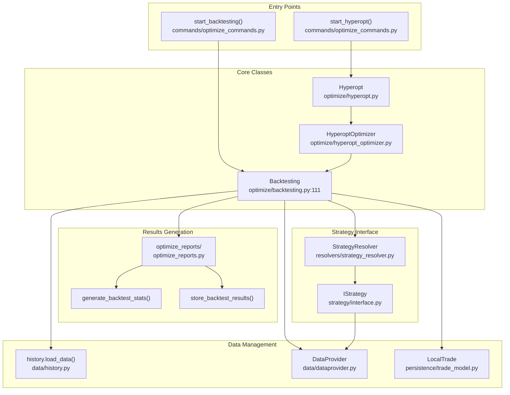
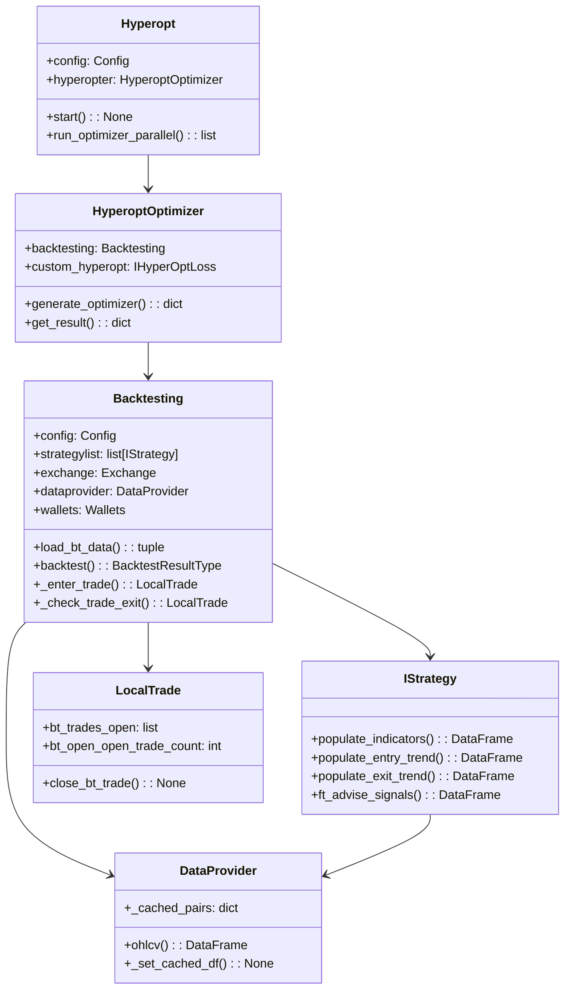
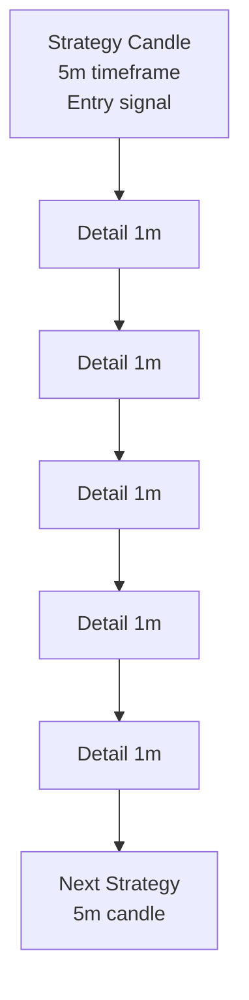
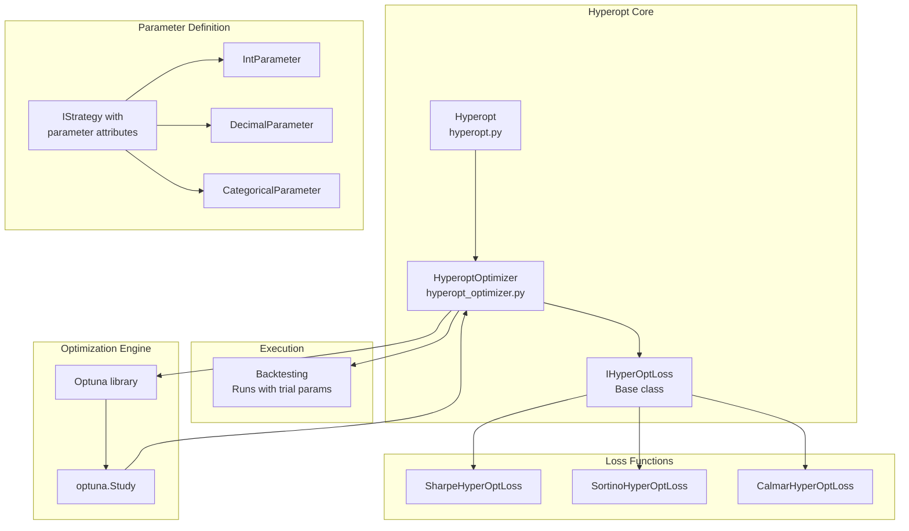
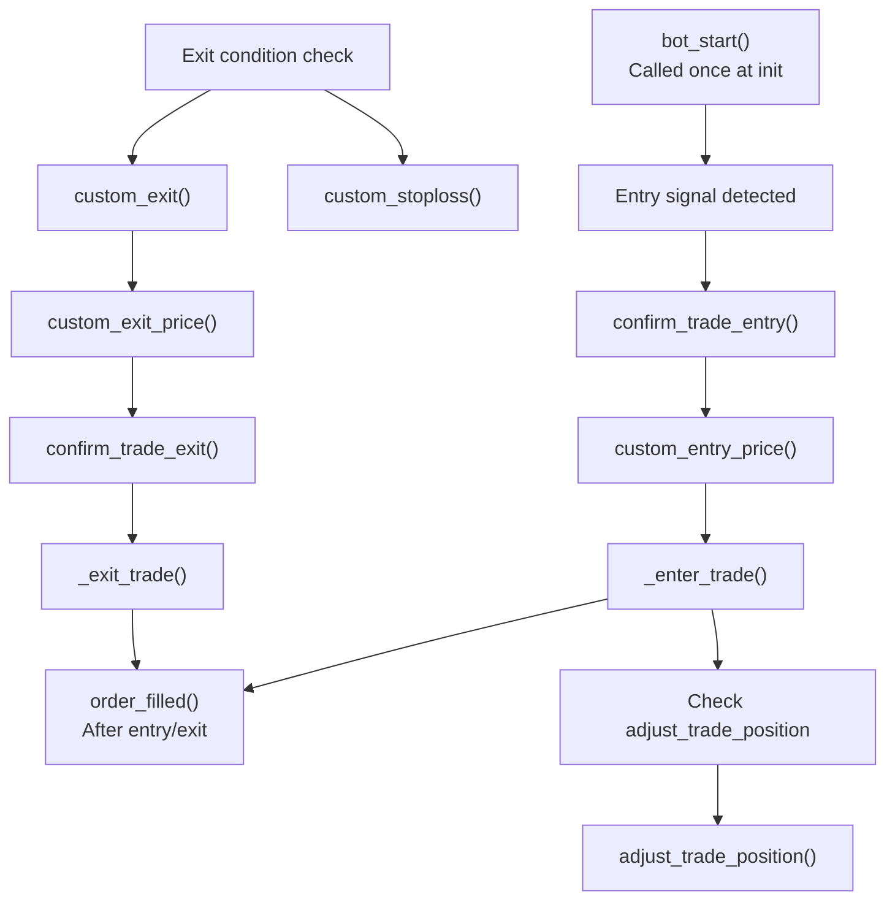

# Testing and Optimization

Relevant source files

* [freqtrade/optimize/backtesting.py](https://github.com/freqtrade/freqtrade/blob/8e91fea1/freqtrade/optimize/backtesting.py)
* [tests/optimize/\_\_init\_\_.py](https://github.com/freqtrade/freqtrade/blob/8e91fea1/tests/optimize/__init__.py)
* [tests/optimize/test\_backtest\_detail.py](https://github.com/freqtrade/freqtrade/blob/8e91fea1/tests/optimize/test_backtest_detail.py)
* [tests/optimize/test\_backtesting.py](https://github.com/freqtrade/freqtrade/blob/8e91fea1/tests/optimize/test_backtesting.py)
* [tests/optimize/test\_hyperopt.py](https://github.com/freqtrade/freqtrade/blob/8e91fea1/tests/optimize/test_hyperopt.py)
* [tests/optimize/test\_optimize\_reports.py](https://github.com/freqtrade/freqtrade/blob/8e91fea1/tests/optimize/test_optimize_reports.py)

This page provides an overview of Freqtrade's testing and optimization infrastructure. These tools allow strategy validation and parameter tuning without risking capital, using the same strategy code as live trading.

For detailed implementation, see:

* [Backtesting Engine](/freqtrade/freqtrade/3.1-backtesting-system) - Historical simulation details
* [Hyperparameter Optimization](/freqtrade/freqtrade/3.2-hyperparameter-optimization) - Parameter optimization details

For information about implementing custom strategies, see [Strategy System](/freqtrade/freqtrade/2.3-strategy-interface-and-development). For details on the live trading execution loop, see [FreqtradeBot Orchestration](/freqtrade/freqtrade/2.2-exchange-integration).

## Purpose and Scope

The testing and optimization system provides three primary capabilities:

1. **Backtesting**: Simulates strategy performance on historical data using the `Backtesting` class
2. **Hyperparameter Optimization**: Uses `Hyperopt` and Optuna to automatically find optimal strategy parameters
3. **Results Analysis**: Generates statistics via `optimize_reports` module

Key architectural principle: The system uses the same `IStrategy` interface and strategy code as live trading (`FreqtradeBot`), ensuring backtested behavior matches production. The main difference is the persistence layer - backtesting uses `LocalTrade` (in-memory) while live trading uses `Trade` (database).

**Sources:** [freqtrade/optimize/backtesting.py1-119](https://github.com/freqtrade/freqtrade/blob/8e91fea1/freqtrade/optimize/backtesting.py#L1-L119) [freqtrade/optimize/hyperopt.py1-50](https://github.com/freqtrade/freqtrade/blob/8e91fea1/freqtrade/optimize/hyperopt.py#L1-L50) [freqtrade/persistence/\_\_init\_\_.py61-68](https://github.com/freqtrade/freqtrade/blob/8e91fea1/freqtrade/persistence/__init__.py#L61-L68)

## System Architecture

The following diagram maps testing/optimization components to their code entities:

**Diagram: Testing and Optimization Component Architecture**



**Sources:** [freqtrade/optimize/backtesting.py111-217](https://github.com/freqtrade/freqtrade/blob/8e91fea1/freqtrade/optimize/backtesting.py#L111-L217) [freqtrade/optimize/hyperopt.py1-100](https://github.com/freqtrade/freqtrade/blob/8e91fea1/freqtrade/optimize/hyperopt.py#L1-L100) [freqtrade/commands/optimize\_commands.py1-50](https://github.com/freqtrade/freqtrade/blob/8e91fea1/freqtrade/commands/optimize_commands.py#L1-L50)

## Core Class Relationships

**Diagram: Class Collaboration for Testing**



**Sources:** [freqtrade/optimize/backtesting.py111-217](https://github.com/freqtrade/freqtrade/blob/8e91fea1/freqtrade/optimize/backtesting.py#L111-L217) [freqtrade/optimize/hyperopt.py1-100](https://github.com/freqtrade/freqtrade/blob/8e91fea1/freqtrade/optimize/hyperopt.py#L1-L100) [freqtrade/persistence/trade\_model.py700-800](https://github.com/freqtrade/freqtrade/blob/8e91fea1/freqtrade/persistence/trade_model.py#L700-L800)

## Component Overview

### The Backtesting Class

The `Backtesting` class ([freqtrade/optimize/backtesting.py111-217](https://github.com/freqtrade/freqtrade/blob/8e91fea1/freqtrade/optimize/backtesting.py#L111-L217)) orchestrates historical simulation. It mirrors the live trading workflow but uses `LocalTrade` for performance and deterministic execution.

**Key responsibilities:**

* Load historical data via `history.load_data()`
* Initialize strategy via `StrategyResolver.load_strategy()`
* Execute simulation loop in `backtest()` method
* Generate results via `optimize_reports` module

For implementation details, see [Backtesting Engine](/freqtrade/freqtrade/3.1-backtesting-system).

**Sources:** [freqtrade/optimize/backtesting.py111-217](https://github.com/freqtrade/freqtrade/blob/8e91fea1/freqtrade/optimize/backtesting.py#L111-L217) [freqtrade/optimize/backtesting.py275-303](https://github.com/freqtrade/freqtrade/blob/8e91fea1/freqtrade/optimize/backtesting.py#L275-L303)

### The Hyperopt System

The `Hyperopt` class ([freqtrade/optimize/hyperopt.py](https://github.com/freqtrade/freqtrade/blob/8e91fea1/freqtrade/optimize/hyperopt.py)) wraps `Backtesting` to find optimal parameters. It uses Optuna for Bayesian optimization.

**Key components:**

* `Hyperopt`: Orchestrates optimization runs
* `HyperoptOptimizer`: Generates parameter combinations and runs backtests
* `IHyperOptLoss`: Loss function interface (Sharpe, Sortino, etc.)
* Parameter classes: `IntParameter`, `DecimalParameter`, `CategoricalParameter`

For implementation details, see [Hyperparameter Optimization](/freqtrade/freqtrade/3.2-hyperparameter-optimization).

**Sources:** [freqtrade/optimize/hyperopt.py1-100](https://github.com/freqtrade/freqtrade/blob/8e91fea1/freqtrade/optimize/hyperopt.py#L1-L100) [tests/optimize/test\_hyperopt.py215-237](https://github.com/freqtrade/freqtrade/blob/8e91fea1/tests/optimize/test_hyperopt.py#L215-L237)

### Trade Persistence Models

Backtesting uses `LocalTrade` for performance, while live trading uses `Trade` for persistence:

| Aspect | LocalTrade | Trade |
| --- | --- | --- |
| Module | `persistence/trade_model.py` | `persistence/trade_model.py` |
| Storage | `bt_trades_open` class list | SQLAlchemy database |
| Methods | `close_bt_trade()` | `Trade.commit()` |
| Performance | No I/O overhead | Database write overhead |
| Use case | Backtesting, hyperopt | Live/dry-run trading |

Both classes share the same interface for calculating profit, managing orders, and tracking trade state.

**Sources:** [freqtrade/persistence/trade\_model.py700-800](https://github.com/freqtrade/freqtrade/blob/8e91fea1/freqtrade/persistence/trade_model.py#L700-L800) [freqtrade/optimize/backtesting.py427-436](https://github.com/freqtrade/freqtrade/blob/8e91fea1/freqtrade/optimize/backtesting.py#L427-L436)

## Execution Flow

**Diagram: Backtesting Execution Sequence**

```mermaid
sequenceDiagram
  participant start_backtesting()
  participant Backtesting
  participant history.load_data()
  participant IStrategy
  participant LocalTrade
  participant optimize_reports

  start_backtesting()->>Backtesting: "Backtesting(config)"
  Backtesting->>IStrategy: "StrategyResolver.load_strategy()"
  Backtesting->>history.load_data(): "load_data(pairs, timeframe, timerange)"
  history.load_data()-->>Backtesting: "Dict[pair, DataFrame]"
  Backtesting->>IStrategy: "advise_all_indicators(data)"
  IStrategy-->>Backtesting: "DataFrames with indicators"
  Backtesting->>Backtesting: "_get_ohlcv_as_lists(processed)"
  note over Backtesting: "Convert to tuples for performance"
  loop ["Exit condition"]
    Backtesting->>LocalTrade: "LocalTrade.bt_trades_open"
    Backtesting->>Backtesting: "_get_close_rate()"
    Backtesting->>Backtesting: "_exit_trade()"
    Backtesting->>LocalTrade: "LocalTrade.close_bt_trade()"
    Backtesting->>IStrategy: "confirm_trade_entry()"
    Backtesting->>Backtesting: "_enter_trade()"
    Backtesting->>LocalTrade: "LocalTrade() created"
  end
  Backtesting->>optimize_reports: "generate_backtest_stats()"
  optimize_reports->>optimize_reports: "generate_pair_metrics()"
  optimize_reports->>optimize_reports: "store_backtest_results()"
  optimize_reports-->>start_backtesting(): "Statistics dict"
```

For detailed simulation logic, see [Backtesting Engine](/freqtrade/freqtrade/3.1-backtesting-system).

**Sources:** [freqtrade/optimize/backtesting.py304-342](https://github.com/freqtrade/freqtrade/blob/8e91fea1/freqtrade/optimize/backtesting.py#L304-L342) [freqtrade/optimize/backtesting.py459-514](https://github.com/freqtrade/freqtrade/blob/8e91fea1/freqtrade/optimize/backtesting.py#L459-L514) [freqtrade/optimize/optimize\_reports/optimize\_reports.py1-100](https://github.com/freqtrade/freqtrade/blob/8e91fea1/freqtrade/optimize/optimize_reports/optimize_reports.py#L1-L100)

**Diagram: Hyperopt Optimization Loop**

For optimization algorithm details, see [Hyperparameter Optimization](/freqtrade/freqtrade/3.2-hyperparameter-optimization).

**Sources:** [freqtrade/optimize/hyperopt.py1-100](https://github.com/freqtrade/freqtrade/blob/8e91fea1/freqtrade/optimize/hyperopt.py#L1-L100) [tests/optimize/test\_hyperopt.py381-436](https://github.com/freqtrade/freqtrade/blob/8e91fea1/tests/optimize/test_hyperopt.py#L381-L436)

## Key Simulation Concepts

### Data Loading Pipeline

The `Backtesting.load_bt_data()` method ([freqtrade/optimize/backtesting.py304-342](https://github.com/freqtrade/freqtrade/blob/8e91fea1/freqtrade/optimize/backtesting.py#L304-L342)) orchestrates data loading:

1. Calls `history.load_data()` to load OHLCV DataFrames from disk
2. Loads additional detail timeframe if `timeframe_detail` configured
3. For futures: loads funding rates and mark prices via `_load_bt_data_detail()`
4. Calculates startup candles needed for indicator warmup
5. Returns tuple of `(data_dict, timerange)`

The `_get_ohlcv_as_lists()` method ([freqtrade/optimize/backtesting.py459-514](https://github.com/freqtrade/freqtrade/blob/8e91fea1/freqtrade/optimize/backtesting.py#L459-L514)) converts DataFrames to lists of tuples for performance, applying signal shifting to prevent lookahead bias.

For complete data loading logic, see [Backtesting Engine](/freqtrade/freqtrade/3.1-backtesting-system).

**Sources:** [freqtrade/optimize/backtesting.py304-342](https://github.com/freqtrade/freqtrade/blob/8e91fea1/freqtrade/optimize/backtesting.py#L304-L342) [freqtrade/optimize/backtesting.py459-514](https://github.com/freqtrade/freqtrade/blob/8e91fea1/freqtrade/optimize/backtesting.py#L459-L514)

### Trade Execution Simulation

The main simulation loop evaluates exits before entries on each candle:

**Exit evaluation** ([freqtrade/optimize/backtesting.py516-664](https://github.com/freqtrade/freqtrade/blob/8e91fea1/freqtrade/optimize/backtesting.py#L516-L664)):

* Methods: `_get_close_rate()`, `_get_close_rate_for_stoploss()`, `_get_close_rate_for_roi()`
* Precedence: Liquidation → Stop loss → ROI → Trailing stop → Exit signal
* Price constraints: Exit price bounded by candle high/low

**Entry evaluation** (after exits):

* Method: `_enter_trade()`
* Checks: Available stake, position limits (`max_open_trades`), pair locks
* Callbacks: `confirm_trade_entry()`, `custom_entry_price()`
* Result: New `LocalTrade` instance or `None`

For simulation details, see [Backtesting Engine](/freqtrade/freqtrade/3.1-backtesting-system).

**Sources:** [freqtrade/optimize/backtesting.py516-664](https://github.com/freqtrade/freqtrade/blob/8e91fea1/freqtrade/optimize/backtesting.py#L516-L664) [tests/optimize/test\_backtesting.py525-586](https://github.com/freqtrade/freqtrade/blob/8e91fea1/tests/optimize/test_backtesting.py#L525-L586)

### Detail Timeframe Resolution

The `timeframe_detail` configuration enables sub-candle simulation for more accurate exit timing:

**Diagram: Detail Timeframe Processing**



Loaded via `_load_bt_data_detail()` ([freqtrade/optimize/backtesting.py344-410](https://github.com/freqtrade/freqtrade/blob/8e91fea1/freqtrade/optimize/backtesting.py#L344-L410)) and used by `_check_trade_exit()` for intra-candle exit evaluation.

**Sources:** [freqtrade/optimize/backtesting.py259-273](https://github.com/freqtrade/freqtrade/blob/8e91fea1/freqtrade/optimize/backtesting.py#L259-L273) [freqtrade/optimize/backtesting.py344-410](https://github.com/freqtrade/freqtrade/blob/8e91fea1/freqtrade/optimize/backtesting.py#L344-L410)

## Hyperparameter Optimization Overview

The hyperopt system finds optimal strategy parameters through repeated backtesting. See [Hyperparameter Optimization](/freqtrade/freqtrade/3.2-hyperparameter-optimization) for detailed implementation.

### Optimization Architecture

**Diagram: Hyperopt Component Structure**



**Sources:** [freqtrade/optimize/hyperopt.py1-100](https://github.com/freqtrade/freqtrade/blob/8e91fea1/freqtrade/optimize/hyperopt.py#L1-L100) [freqtrade/optimize/hyperopt\_optimizer.py1-100](https://github.com/freqtrade/freqtrade/blob/8e91fea1/freqtrade/optimize/hyperopt_optimizer.py#L1-L100)

### Parameter Space Definition

Strategies define searchable parameters using special classes:

```
```
# In strategy file
class MyStrategy(IStrategy):
    buy_rsi = IntParameter(20, 40, default=30, space='buy')
    sell_rsi = IntParameter(60, 80, default=70, space='sell')
    roi_p1 = DecimalParameter(0.01, 0.05, default=0.03, space='roi')
```
```

The `HyperoptOptimizer.init_spaces()` method extracts these and creates Optuna search spaces. Parameter types in `strategy/parameters.py`:

* `IntParameter`: Integer range
* `DecimalParameter`: Float range
* `CategoricalParameter`: Discrete choices
* `BooleanParameter`: True/False

**Sources:** [freqtrade/strategy/parameters.py1-100](https://github.com/freqtrade/freqtrade/blob/8e91fea1/freqtrade/strategy/parameters.py#L1-L100) [tests/optimize/test\_hyperopt.py349-379](https://github.com/freqtrade/freqtrade/blob/8e91fea1/tests/optimize/test_hyperopt.py#L349-L379)

### Loss Function Selection

Loss functions (subclasses of `IHyperOptLoss`) evaluate backtest results:

| Class | Location | Metric | Formula |
| --- | --- | --- | --- |
| `SharpeHyperOptLoss` | `optimize/hyperopt_loss/` | Sharpe Ratio | Returns / StdDev |
| `SortinoHyperOptLoss` | `optimize/hyperopt_loss/` | Sortino Ratio | Returns / Downside StdDev |
| `CalmarHyperOptLoss` | `optimize/hyperopt_loss/` | Calmar Ratio | Returns / Max Drawdown |
| `MaxDrawDownHyperOptLoss` | `optimize/hyperopt_loss/` | Max Drawdown | Minimize peak-to-trough |
| `OnlyProfitHyperOptLoss` | `optimize/hyperopt_loss/` | Total Profit | Raw profit sum |

Selected via `--hyperopt-loss` CLI argument or `hyperopt_loss` config key. See [Hyperparameter Optimization](/freqtrade/freqtrade/3.2-hyperparameter-optimization) for usage.

**Sources:** [tests/optimize/test\_hyperopt.py438-510](https://github.com/freqtrade/freqtrade/blob/8e91fea1/tests/optimize/test_hyperopt.py#L438-L510) [freqtrade/optimize/hyperopt\_loss/](https://github.com/freqtrade/freqtrade/blob/8e91fea1/freqtrade/optimize/hyperopt_loss/)

## Results and Reporting

### Statistics Generation

The `optimize_reports` module ([freqtrade/optimize/optimize\_reports/](https://github.com/freqtrade/freqtrade/blob/8e91fea1/freqtrade/optimize/optimize_reports/)) provides result analysis:

**Key functions:**

* `generate_backtest_stats()`: Main statistics aggregation
* `generate_pair_metrics()`: Per-pair performance
* `generate_tag_metrics()`: Entry/exit tag analysis
* `generate_daily_stats()`: Daily breakdown
* `generate_trading_stats()`: Win/loss statistics
* `text_table_bt_results()`: Console output formatting

**Output structure:**

```
```
{
    'strategy': {
        'StrategyName': {
            'total_trades': int,
            'total_profit': float,
            'win_rate': float,
            'max_drawdown': float,
            'sharpe_ratio': float,
            # ... more metrics
        }
    },
    'strategy_comparison': [...],
    'metadata': {...}
}
```
```

**Sources:** [tests/optimize/test\_optimize\_reports.py101-259](https://github.com/freqtrade/freqtrade/blob/8e91fea1/tests/optimize/test_optimize_reports.py#L101-L259) [freqtrade/optimize/optimize\_reports/optimize\_reports.py1-100](https://github.com/freqtrade/freqtrade/blob/8e91fea1/freqtrade/optimize/optimize_reports/optimize_reports.py#L1-L100)

### Result Storage Format

Results stored by `store_backtest_results()` ([freqtrade/optimize/optimize\_reports/bt\_storage.py](https://github.com/freqtrade/freqtrade/blob/8e91fea1/freqtrade/optimize/optimize_reports/bt_storage.py)):

**Directory structure:**

```
user_data/backtest_results/
├── backtest-result-{timestamp}.zip
│   ├── backtest-result-{timestamp}.json           # Statistics
│   ├── backtest-result-{timestamp}_signals.pkl    # Analyzed candles
│   ├── backtest-result-{timestamp}_rejected.pkl   # Rejected entries
│   ├── backtest-result-{timestamp}_exited.pkl     # Exit candles
│   ├── backtest-result-{timestamp}_{Strategy}.py  # Strategy source
│   └── backtest-result-{timestamp}_{Strategy}.json # Parameters
└── .last_result.json                               # Latest reference
```

Export modes controlled by `export` config:

* `none`: Statistics only
* `trades`: Add trade list
* `signals`: Add full analyzed DataFrames (`.pkl` files)

Loaded via `load_backtest_stats()` and `load_backtest_data()` from `data.btanalysis` module.

**Sources:** [tests/optimize/test\_optimize\_reports.py287-395](https://github.com/freqtrade/freqtrade/blob/8e91fea1/tests/optimize/test_optimize_reports.py#L287-L395) [freqtrade/optimize/optimize\_reports/bt\_storage.py1-100](https://github.com/freqtrade/freqtrade/blob/8e91fea1/freqtrade/optimize/optimize_reports/bt_storage.py#L1-L100)

## Performance Considerations

### LocalTrade In-Memory Model

`LocalTrade` class ([freqtrade/persistence/trade\_model.py700-800](https://github.com/freqtrade/freqtrade/blob/8e91fea1/freqtrade/persistence/trade_model.py#L700-L800)) optimizes backtesting performance:

**Key attributes:**

* `bt_trades_open`: Class-level list of open trades
* `bt_trades_closed`: Class-level list of closed trades
* `bt_open_open_trade_count`: Counter for open positions

**Methods:**

* `close_bt_trade(trade)`: Moves trade from open to closed list
* `reset_trades()`: Clears all trades (called between backtest runs)

This avoids SQLAlchemy overhead (no `session.add()`, no `session.commit()`), providing significant speedup for iterative backtesting.

**Sources:** [freqtrade/persistence/trade\_model.py700-800](https://github.com/freqtrade/freqtrade/blob/8e91fea1/freqtrade/persistence/trade_model.py#L700-L800) [freqtrade/optimize/backtesting.py427-436](https://github.com/freqtrade/freqtrade/blob/8e91fea1/freqtrade/optimize/backtesting.py#L427-L436)

### Data Processing Optimizations

The `_get_ohlcv_as_lists()` method ([freqtrade/optimize/backtesting.py459-514](https://github.com/freqtrade/freqtrade/blob/8e91fea1/freqtrade/optimize/backtesting.py#L459-L514)) converts DataFrames to tuples:

**Optimizations:**

1. List iteration faster than DataFrame row iteration
2. Tuple indexing via constants (`DATE_IDX`, `OPEN_IDX`, etc.) at module level
3. Indicators pre-calculated before loop (no per-candle computation)
4. Signals shifted by 1 candle to prevent lookahead bias

**Headers defined** at [freqtrade/optimize/backtesting.py96-108](https://github.com/freqtrade/freqtrade/blob/8e91fea1/freqtrade/optimize/backtesting.py#L96-L108):

```
```
HEADERS = ['date', 'open', 'high', 'low', 'close',
           'enter_long', 'exit_long', 'enter_short', 'exit_short',
           'enter_tag', 'exit_tag']
```
```

**Sources:** [freqtrade/optimize/backtesting.py81-108](https://github.com/freqtrade/freqtrade/blob/8e91fea1/freqtrade/optimize/backtesting.py#L81-L108) [freqtrade/optimize/backtesting.py459-514](https://github.com/freqtrade/freqtrade/blob/8e91fea1/freqtrade/optimize/backtesting.py#L459-L514)

### Parallel Hyperopt

Hyperopt supports parallel execution via `hyperopt_jobs` config:

**Configuration:**

* `hyperopt_jobs: 1`: Sequential (reproducible)
* `hyperopt_jobs: 4`: 4 parallel workers
* `hyperopt_jobs: -1`: All CPU cores

**Implementation** uses joblib's `Parallel` class for process-based parallelism, with each worker maintaining separate `Backtesting` instances.

**Sources:** [tests/optimize/test\_hyperopt.py381-436](https://github.com/freqtrade/freqtrade/blob/8e91fea1/tests/optimize/test_hyperopt.py#L381-L436) [freqtrade/optimize/hyperopt.py1-100](https://github.com/freqtrade/freqtrade/blob/8e91fea1/freqtrade/optimize/hyperopt.py#L1-L100)

## Supported Features

### Trading Modes

All trading modes from live trading are supported:

| Mode | Config | Simulation Features |
| --- | --- | --- |
| Spot | `trading_mode: "spot"` | Long positions only |
| Margin | `trading_mode: "margin"` | Leverage, liquidation tracking |
| Futures | `trading_mode: "futures"` | Funding fees, mark prices |

Futures-specific logic in `_load_bt_data_detail()` ([freqtrade/optimize/backtesting.py344-410](https://github.com/freqtrade/freqtrade/blob/8e91fea1/freqtrade/optimize/backtesting.py#L344-L410)) loads funding rates and calculates funding fees via `_run_funding_fees()`.

**Sources:** [freqtrade/optimize/backtesting.py208-216](https://github.com/freqtrade/freqtrade/blob/8e91fea1/freqtrade/optimize/backtesting.py#L208-L216) [freqtrade/optimize/backtesting.py344-410](https://github.com/freqtrade/freqtrade/blob/8e91fea1/freqtrade/optimize/backtesting.py#L344-L410)

### Position Adjustment (DCA)

The `adjust_trade_position` callback is simulated via `_check_adjust_trade_for_candle()` ([freqtrade/optimize/backtesting.py665-733](https://github.com/freqtrade/freqtrade/blob/8e91fea1/freqtrade/optimize/backtesting.py#L665-L733)):

**Entry adjustments:**

* Calls `strategy._adjust_trade_position_internal()`
* Respects `max_entry_position_adjustment` limit
* Creates additional `LocalTrade` entries

**Partial exits:**

* Negative stake amount triggers partial exit
* Creates `ExitType.PARTIAL_EXIT` order
* Calls `_get_exit_for_signal()` with amount parameter

See [Strategy Callbacks and Customization](/freqtrade/freqtrade/5.2-strategy-callbacks-and-customization) for callback details.

**Sources:** [freqtrade/optimize/backtesting.py665-733](https://github.com/freqtrade/freqtrade/blob/8e91fea1/freqtrade/optimize/backtesting.py#L665-L733) [tests/optimize/test\_backtesting.py525-586](https://github.com/freqtrade/freqtrade/blob/8e91fea1/tests/optimize/test_backtesting.py#L525-L586)

### Strategy Callback Support

All `IStrategy` callbacks are invoked during backtesting:

**Diagram: Callback Invocation Points**



See [Strategy System](/freqtrade/freqtrade/2.3-strategy-interface-and-development) and [Strategy Callbacks and Customization](/freqtrade/freqtrade/5.2-strategy-callbacks-and-customization) for callback documentation.

**Sources:** [freqtrade/optimize/backtesting.py749-800](https://github.com/freqtrade/freqtrade/blob/8e91fea1/freqtrade/optimize/backtesting.py#L749-L800) [tests/strategy/test\_interface.py645-684](https://github.com/freqtrade/freqtrade/blob/8e91fea1/tests/strategy/test_interface.py#L645-L684)

## Testing Infrastructure

### Test Organization

The optimize test suite ([tests/optimize/](https://github.com/freqtrade/freqtrade/blob/8e91fea1/tests/optimize/)) validates backtesting and hyperopt functionality:

**Test modules:**

* `test_backtesting.py`: Main backtesting tests (269.02 importance score)
* `test_hyperopt.py`: Hyperopt functionality (198.52 importance score)
* `test_optimize_reports.py`: Results generation (136.82 importance score)
* `test_backtest_detail.py`: Edge cases and detail timeframe (87.75 importance score)

**Test utilities** in `tests/optimize/__init__.py`:

* `BTContainer`: Defines test scenario (data, stop\_loss, roi, expected trades)
* `BTrade`: Expected trade outcome (exit\_reason, open\_tick, close\_tick)
* `_build_backtest_dataframe()`: Generates test OHLCV data
* `_get_frame_time_from_offset()`: Converts tick offset to datetime

**Sources:** [tests/optimize/\_\_init\_\_.py1-87](https://github.com/freqtrade/freqtrade/blob/8e91fea1/tests/optimize/__init__.py#L1-L87) [tests/optimize/test\_backtesting.py1-100](https://github.com/freqtrade/freqtrade/blob/8e91fea1/tests/optimize/test_backtesting.py#L1-L100)

### Test Coverage Examples

**Unit test structure:**

```
```
# From tests/optimize/test_backtesting.py
def test_backtest__enter_trade(default_conf, fee, mocker):
    # Mocks exchange methods
    mocker.patch(f"{EXMS}.get_fee", fee)
    mocker.patch(f"{EXMS}.get_min_pair_stake_amount", return_value=0.00001)
    
    # Creates Backtesting instance
    backtesting = Backtesting(default_conf)
    backtesting._set_strategy(backtesting.strategylist[0])
    
    # Tests _enter_trade method
    trade = backtesting._enter_trade(pair, row=row, direction="long")
    assert isinstance(trade, LocalTrade)
    assert trade.stake_amount == 495
```
```

**Integration test pattern:**

```
```
# Container-based testing
tc1 = BTContainer(
    data=[[...], [...]],  # OHLCV candles
    stop_loss=-0.01,
    roi={"0": 1},
    profit_perc=-0.01,
    trades=[BTrade(exit_reason=ExitType.STOP_LOSS, open_tick=1, close_tick=2)]
)
```
```

See [tests/optimize/test\_backtest\_detail.py1-87](https://github.com/freqtrade/freqtrade/blob/8e91fea1/tests/optimize/test_backtest_detail.py#L1-L87) for detailed scenario tests.

**Sources:** [tests/optimize/test\_backtesting.py525-586](https://github.com/freqtrade/freqtrade/blob/8e91fea1/tests/optimize/test_backtesting.py#L525-L586) [tests/optimize/test\_backtest\_detail.py21-56](https://github.com/freqtrade/freqtrade/blob/8e91fea1/tests/optimize/test_backtest_detail.py#L21-L56)

### Validation Mechanisms

**Signal shifting** ([freqtrade/optimize/backtesting.py496-508](https://github.com/freqtrade/freqtrade/blob/8e91fea1/freqtrade/optimize/backtesting.py#L496-L508)):

* Entry/exit signals shifted by 1 candle
* Prevents lookahead bias
* Implemented in `_get_ohlcv_as_lists()`

**Exit precedence** enforced in `_check_trade_exit()`:

1. Liquidation (futures only)
2. Stop loss / Trailing stop loss
3. ROI
4. Exit signal
5. Custom exit

**Data validation:**

* Required columns checked
* Candle consistency validated (low ≤ close/open, high ≥ close/open)
* Implemented in test helpers

**Sources:** [freqtrade/optimize/backtesting.py496-514](https://github.com/freqtrade/freqtrade/blob/8e91fea1/freqtrade/optimize/backtesting.py#L496-L514) [tests/optimize/\_\_init\_\_.py81-86](https://github.com/freqtrade/freqtrade/blob/8e91fea1/tests/optimize/__init__.py#L81-L86)

## Configuration Reference

### Backtesting Configuration Keys

Key configuration options for `start_backtesting()`:

| Key | Type | Description | Example |
| --- | --- | --- | --- |
| `timeframe` | str | Strategy timeframe | `"5m"` |
| `timerange` | str | Date range to backtest | `"20230101-20231231"` |
| `timeframe_detail` | str | Sub-candle resolution (optional) | `"1m"` |
| `max_open_trades` | int | Position limit | `3` |
| `stake_amount` | str/float | Per-trade stake | `"unlimited"` or `100` |
| `starting_balance` | float | Initial balance | `1000` |
| `fee` | float | Trading fee override | `0.001` |
| `export` | str | Export mode | `"none"`, `"trades"`, `"signals"` |
| `exportfilename` | str/Path | Output path | `"backtest-results.json"` |
| `enable_protections` | bool | Use protection plugins | `true` |
| `backtest_show_pair_list` | bool | Show sorted pairs | `false` |

Configured via CLI args (`--timerange`, `--stake-amount`) or `config.json`.

**Sources:** [tests/optimize/test\_backtesting.py144-227](https://github.com/freqtrade/freqtrade/blob/8e91fea1/tests/optimize/test_backtesting.py#L144-L227) [freqtrade/commands/optimize\_commands.py1-100](https://github.com/freqtrade/freqtrade/blob/8e91fea1/freqtrade/commands/optimize_commands.py#L1-L100)

### Hyperopt Configuration Keys

Key configuration options for `start_hyperopt()`:

| Key | Type | Description | Example |
| --- | --- | --- | --- |
| `hyperopt_loss` | str | Loss function class name | `"SharpeHyperOptLoss"` |
| `epochs` | int | Number of optimization iterations | `100` |
| `spaces` | list[str] | Parameter spaces to optimize | `["buy", "sell", "roi"]` |
| `hyperopt_jobs` | int | Parallel workers (-1 = all cores) | `-1` |
| `hyperopt_min_trades` | int | Minimum trades required | `10` |
| `early_stop` | int | Stop if no improvement (epochs) | `25` |
| `print_all` | bool | Print all results (not just best) | `false` |
| `hyperopt_random_state` | int | Random seed for reproducibility | `42` |

Configured via CLI args (`--epochs`, `--spaces`) or `config.json`.

**Sources:** [tests/optimize/test\_hyperopt.py58-139](https://github.com/freqtrade/freqtrade/blob/8e91fea1/tests/optimize/test_hyperopt.py#L58-L139) [freqtrade/commands/optimize\_commands.py1-100](https://github.com/freqtrade/freqtrade/blob/8e91fea1/freqtrade/commands/optimize_commands.py#L1-L100)

## Common Workflows

### Running a Backtest

```
```
freqtrade backtesting \
  --strategy MyStrategy \
  --timerange 20230101-20231231 \
  --export signals
```
```

**Process:**

1. Configuration loaded and validated
2. Strategy loaded via StrategyResolver
3. Historical data loaded for all pairs
4. Main simulation loop executes
5. Results generated and stored

**Sources:** [tests/optimize/test\_backtesting.py389-423](https://github.com/freqtrade/freqtrade/blob/8e91fea1/tests/optimize/test_backtesting.py#L389-L423)

### Running Hyperopt

```
```
freqtrade hyperopt \
  --strategy MyStrategy \
  --hyperopt-loss SharpeHyperOptLoss \
  --epochs 100 \
  --spaces buy sell
```
```

**Process:**

1. Parameter spaces initialized from strategy
2. Optuna study created
3. For each epoch:
   * Generate parameter combination
   * Run backtest with parameters
   * Calculate loss value
   * Update best result if improved
4. Best parameters saved to strategy file

**Sources:** [tests/optimize/test\_hyperopt.py381-436](https://github.com/freqtrade/freqtrade/blob/8e91fea1/tests/optimize/test_hyperopt.py#L381-L436)

---

This document provides an overview of Freqtrade's testing and optimization capabilities. For implementation details, see [Backtesting Engine](/freqtrade/freqtrade/3.1-backtesting-system) and [Hyperparameter Optimization](/freqtrade/freqtrade/3.2-hyperparameter-optimization).