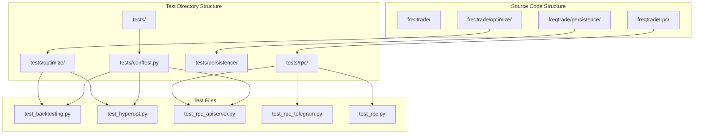
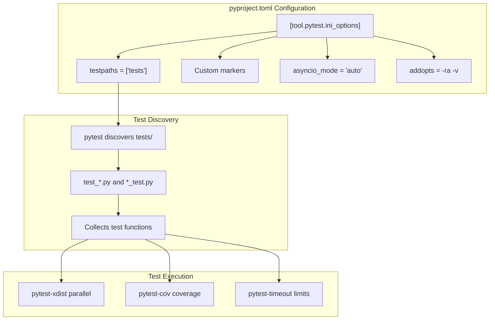
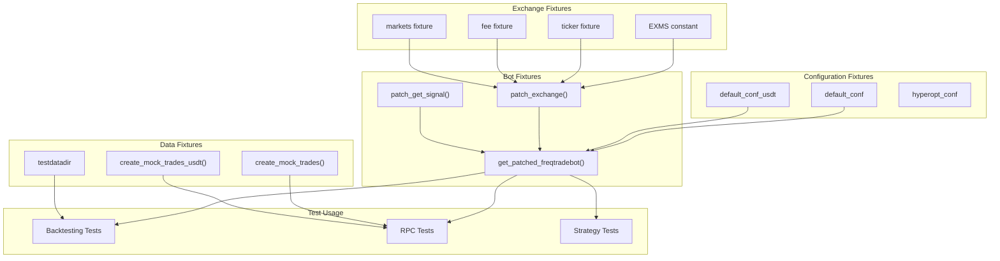
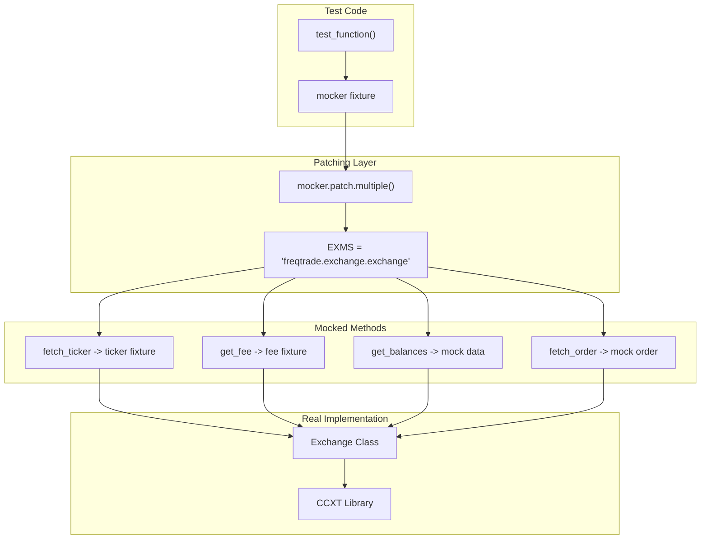
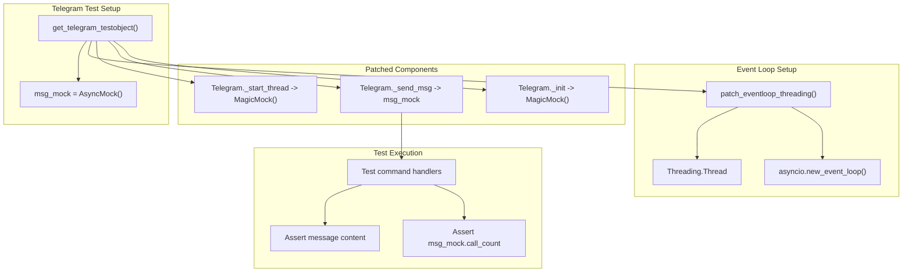
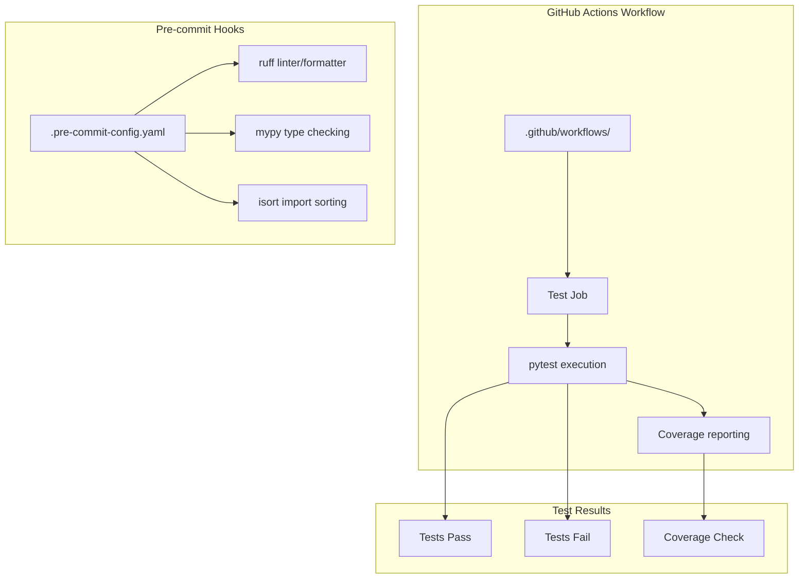

# Testing Infrastructure

Relevant source files

* [.github/workflows/ci.yml](https://github.com/freqtrade/freqtrade/blob/8e91fea1/.github/workflows/ci.yml)
* [.pre-commit-config.yaml](https://github.com/freqtrade/freqtrade/blob/8e91fea1/.pre-commit-config.yaml)
* [Dockerfile](https://github.com/freqtrade/freqtrade/blob/8e91fea1/Dockerfile)
* [docker/Dockerfile.armhf](https://github.com/freqtrade/freqtrade/blob/8e91fea1/docker/Dockerfile.armhf)
* [pyproject.toml](https://github.com/freqtrade/freqtrade/blob/8e91fea1/pyproject.toml)
* [requirements-dev.txt](https://github.com/freqtrade/freqtrade/blob/8e91fea1/requirements-dev.txt)
* [setup.sh](https://github.com/freqtrade/freqtrade/blob/8e91fea1/setup.sh)
* [tests/test\_pip\_audit.py](https://github.com/freqtrade/freqtrade/blob/8e91fea1/tests/test_pip_audit.py)

This page documents Freqtrade's testing infrastructure, including pytest usage, test organization, fixtures defined in `conftest.py`, mocking strategies, and test coverage across different modules. For information about the CI/CD pipeline and deployment, see [CI/CD Pipeline and Docker](/freqtrade/freqtrade/6.2-cicd-pipeline-and-docker). For development environment setup including pre-commit hooks and code quality tools, see [Development Environment Setup](/freqtrade/freqtrade/6.1-development-environment-setup).

## Testing Approach and Organization

Freqtrade employs a comprehensive testing strategy using `pytest` as the primary testing framework. Tests are organized hierarchically under the `tests/` directory, mirroring the structure of the main `freqtrade/` codebase. This approach ensures that each component has corresponding test coverage and makes it easy to locate tests for specific modules.

### Test Directory Structure



**Sources:** [tests/optimize/test\_backtesting.py1-50](https://github.com/freqtrade/freqtrade/blob/8e91fea1/tests/optimize/test_backtesting.py#L1-L50) [tests/rpc/test\_rpc\_apiserver.py1-50](https://github.com/freqtrade/freqtrade/blob/8e91fea1/tests/rpc/test_rpc_apiserver.py#L1-L50) [tests/rpc/test\_rpc\_telegram.py1-60](https://github.com/freqtrade/freqtrade/blob/8e91fea1/tests/rpc/test_rpc_telegram.py#L1-L60)

## Testing Dependencies

Freqtrade's testing infrastructure relies on several specialized pytest plugins and testing utilities:

| Dependency | Purpose | Usage Examples |
| --- | --- | --- |
| `pytest==9.0.1` | Core testing framework | All test files |
| `pytest-asyncio==1.3.0` | Async test support | Telegram and API tests |
| `pytest-cov==7.0.0` | Code coverage measurement | CI/CD pipeline |
| `pytest-mock==3.15.1` | Mocking utilities | Exchange, Telegram mocking |
| `pytest-random-order==1.2.0` | Randomize test execution order | Detect test interdependencies |
| `pytest-timeout==2.4.0` | Prevent hanging tests | All tests |
| `pytest-xdist==3.8.0` | Parallel test execution | CI/CD performance |
| `time-machine==3.1.0` | Time manipulation in tests | Date/time dependent tests |

**Sources:** [requirements-dev.txt12-21](https://github.com/freqtrade/freqtrade/blob/8e91fea1/requirements-dev.txt#L12-L21)

## Pytest Configuration

Pytest configuration is defined in the `pyproject.toml` file, which specifies test discovery patterns, markers, coverage settings, and execution options:



The configuration includes custom markers for categorizing tests and controlling execution:

* Test paths configured to `tests/` directory
* Asyncio mode set to `auto` for async test support
* Coverage reporting with source directory specification
* Timeout defaults to prevent hanging tests
* Random order support to detect interdependencies

**Sources:** [pyproject.toml141-184](https://github.com/freqtrade/freqtrade/blob/8e91fea1/pyproject.toml#L141-L184)

## Core Test Fixtures (conftest.py)

The `tests/conftest.py` file defines shared fixtures used across all test modules. These fixtures provide common test data, configuration, and mock objects.

### Key Fixture Categories



### Common Fixtures

**Configuration Fixtures:**

* `default_conf`: Standard bot configuration with sensible defaults
* `default_conf_usdt`: Configuration for USDT-based testing
* `hyperopt_conf`: Configuration specific to hyperopt testing

**Exchange Mocking Fixtures:**

* `EXMS`: Constant string `"freqtrade.exchange.exchange"` used for patching exchange methods
* `ticker`: Mock ticker data for exchange responses
* `fee`: Mock fee structure for trades
* `markets`: Mock market information from exchanges

**Bot Instance Fixtures:**

* `get_patched_freqtradebot()`: Creates a FreqtradeBot instance with mocked exchange
* `patch_exchange()`: Patches exchange interactions for testing
* `patch_get_signal()`: Patches strategy signal generation

**Data Fixtures:**

* `testdatadir`: Path to test data directory
* `create_mock_trades()`: Creates mock Trade objects in the database
* `create_mock_trades_usdt()`: Creates USDT-based mock trades

**Sources:** [tests/conftest.py](https://github.com/freqtrade/freqtrade/blob/8e91fea1/tests/conftest.py) (inferred from usage in [tests/rpc/test\_rpc\_apiserver.py56-89](https://github.com/freqtrade/freqtrade/blob/8e91fea1/tests/rpc/test_rpc_apiserver.py#L56-L89) [tests/optimize/test\_backtesting.py262-280](https://github.com/freqtrade/freqtrade/blob/8e91fea1/tests/optimize/test_backtesting.py#L262-L280))

## Mocking Strategies

Freqtrade employs sophisticated mocking strategies to isolate components during testing and avoid external dependencies:

### Exchange Mocking Pattern



Example from API server tests:

```
```
mocker.patch.multiple(
    EXMS,
    fetch_ticker=ticker,
    get_fee=fee,
    markets=PropertyMock(return_value=markets),
)
```
```

**Sources:** [tests/rpc/test\_rpc\_apiserver.py599-605](https://github.com/freqtrade/freqtrade/blob/8e91fea1/tests/rpc/test_rpc_apiserver.py#L599-L605)

### Telegram Bot Mocking

Telegram tests use a specialized mocking approach to avoid actual Telegram API calls:



**Sources:** [tests/rpc/test\_rpc\_telegram.py122-138](https://github.com/freqtrade/freqtrade/blob/8e91fea1/tests/rpc/test_rpc_telegram.py#L122-L138) [tests/rpc/test\_rpc\_telegram.py80-93](https://github.com/freqtrade/freqtrade/blob/8e91fea1/tests/rpc/test_rpc_telegram.py#L80-L93)

### Time Manipulation with time-machine

Tests that depend on specific dates or time progression use the `time-machine` library:

```
```
@pytest.mark.usefixtures("init_persistence")
def test_rpc_status_table(default_conf, ticker, fee, mocker, time_machine):
    time_machine.move_to("2024-05-10 11:15:00 +00:00", tick=False)
    # Test with fixed time
```
```

**Sources:** [tests/rpc/test\_rpc.py231-232](https://github.com/freqtrade/freqtrade/blob/8e91fea1/tests/rpc/test_rpc.py#L231-L232)

### Database Mocking with LocalTrade

Backtesting tests use `LocalTrade` instead of `Trade` to avoid database persistence:

* `LocalTrade`: In-memory trade model for backtesting
* `Trade`: SQLAlchemy-backed trade model for live/dry-run
* `disable_database_use()`: Switches to LocalTrade mode
* `enable_database_use()`: Switches back to Trade mode

**Sources:** [freqtrade/optimize/backtesting.py174](https://github.com/freqtrade/freqtrade/blob/8e91fea1/freqtrade/optimize/backtesting.py#L174-L174) [freqtrade/persistence/](https://github.com/freqtrade/freqtrade/blob/8e91fea1/freqtrade/persistence/) (inferred)

## Test Coverage by Module

### RPC Layer Tests

```mermaid
flowchart TD

TEST_RPC["tests/rpc/test_rpc.py"]
RPC_STATUS["test_rpc_trade_status()"]
RPC_STATS["test_rpc_trade_statistics()"]
RPC_PROFIT["test__rpc_timeunit_profit()"]
TEST_API["tests/rpc/test_rpc_apiserver.py"]
API_AUTH["test_api_auth()"]
API_ENDPOINTS["test_api_balance()"]
API_WS["test_api_ws_auth()"]
TEST_TG["tests/rpc/test_rpc_telegram.py"]
TG_AUTH["test_authorized_only()"]
TG_CMD["test_telegram_status()"]
TG_MULTI["test_telegram_status_multi_entry()"]
RPC_CLASS["freqtrade/rpc/rpc.py::RPC"]
TG_CLASS["freqtrade/rpc/telegram.py::Telegram"]
API_CLASS["freqtrade/rpc/api_server/"]

TEST_RPC --> RPC_CLASS
TEST_API --> API_CLASS
TEST_TG --> TG_CLASS
RPC_STATUS --> RPC_CLASS
RPC_STATS --> RPC_CLASS
RPC_PROFIT --> RPC_CLASS
API_AUTH --> API_CLASS
API_ENDPOINTS --> API_CLASS
API_WS --> API_CLASS
TG_AUTH --> TG_CLASS
TG_CMD --> TG_CLASS
TG_MULTI --> TG_CLASS

subgraph subGraph3 ["Core RPC Implementation"]
    RPC_CLASS
    TG_CLASS
    API_CLASS
end

subgraph subGraph2 ["Telegram Tests"]
    TEST_TG
    TG_AUTH
    TG_CMD
    TG_MULTI
end

subgraph subGraph1 ["API Server Tests"]
    TEST_API
    API_AUTH
    API_ENDPOINTS
    API_WS
end

subgraph subGraph0 ["RPC Core Tests"]
    TEST_RPC
    RPC_STATUS
    RPC_STATS
    RPC_PROFIT
end
```



**API Server Test Coverage:**

* Authentication (Basic, JWT, WebSocket tokens): [tests/rpc/test\_rpc\_apiserver.py197-215](https://github.com/freqtrade/freqtrade/blob/8e91fea1/tests/rpc/test_rpc_apiserver.py#L197-L215)
* REST endpoints (balance, profit, status, etc.): [tests/rpc/test\_rpc\_apiserver.py559-593](https://github.com/freqtrade/freqtrade/blob/8e91fea1/tests/rpc/test_rpc_apiserver.py#L559-L593)
* WebSocket connections: [tests/rpc/test\_rpc\_apiserver.py217-236](https://github.com/freqtrade/freqtrade/blob/8e91fea1/tests/rpc/test_rpc_apiserver.py#L217-L236)
* CORS handling: [tests/rpc/test\_rpc\_apiserver.py142-147](https://github.com/freqtrade/freqtrade/blob/8e91fea1/tests/rpc/test_rpc_apiserver.py#L142-L147)

**Telegram Test Coverage:**

* Authorization decorator: [tests/rpc/test\_rpc\_telegram.py226-240](https://github.com/freqtrade/freqtrade/blob/8e91fea1/tests/rpc/test_rpc_telegram.py#L226-L240)
* Command handlers: [tests/rpc/test\_rpc\_telegram.py319-376](https://github.com/freqtrade/freqtrade/blob/8e91fea1/tests/rpc/test_rpc_telegram.py#L319-L376)
* Message formatting: [tests/rpc/test\_rpc\_telegram.py414-451](https://github.com/freqtrade/freqtrade/blob/8e91fea1/tests/rpc/test_rpc_telegram.py#L414-L451)
* Multi-entry position handling: [tests/rpc/test\_rpc\_telegram.py379-428](https://github.com/freqtrade/freqtrade/blob/8e91fea1/tests/rpc/test_rpc_telegram.py#L379-L428)

**RPC Core Test Coverage:**

* Trade status queries: [tests/rpc/test\_rpc.py24-229](https://github.com/freqtrade/freqtrade/blob/8e91fea1/tests/rpc/test_rpc.py#L24-L229)
* Profit calculations: [tests/rpc/test\_rpc.py317-444](https://github.com/freqtrade/freqtrade/blob/8e91fea1/tests/rpc/test_rpc.py#L317-L444)
* Daily/weekly/monthly statistics: [tests/rpc/test\_rpc.py317-370](https://github.com/freqtrade/freqtrade/blob/8e91fea1/tests/rpc/test_rpc.py#L317-L370)

**Sources:** [tests/rpc/test\_rpc\_apiserver.py1-50](https://github.com/freqtrade/freqtrade/blob/8e91fea1/tests/rpc/test_rpc_apiserver.py#L1-L50) [tests/rpc/test\_rpc\_telegram.py1-60](https://github.com/freqtrade/freqtrade/blob/8e91fea1/tests/rpc/test_rpc_telegram.py#L1-L60) [tests/rpc/test\_rpc.py1-50](https://github.com/freqtrade/freqtrade/blob/8e91fea1/tests/rpc/test_rpc.py#L1-L50)

### Backtesting and Optimization Tests

```mermaid
flowchart TD

TEST_BT["tests/optimize/test_backtesting.py"]
BT_INIT["test_backtesting_init()"]
BT_START["test_backtesting_start()"]
BT_DATA["test_data_to_dataframe_bt()"]
TEST_DETAIL["tests/optimize/test_backtest_detail.py"]
BT_CONTAINERS["BTContainer test cases"]
BT_STOPLOSS["tc1: Stop-Loss tests"]
BT_ROI["tc2-tc3: ROI tests"]
TEST_HO["tests/optimize/test_hyperopt.py"]
HO_SETUP["test_setup_hyperopt_configuration()"]
HO_START["test_start()"]
HO_LOSS["test_log_results_if_loss_improves()"]
TEST_REP["tests/optimize/test_optimize_reports.py"]
REP_STATS["test_generate_backtest_stats()"]
REP_TABLE["test_text_table_bt_results()"]
BT_CLASS["freqtrade/optimize/backtesting.py::Backtesting"]
HO_CLASS["freqtrade/optimize/hyperopt.py::Hyperopt"]
REP_MODULE["freqtrade/optimize/optimize_reports/"]

TEST_BT --> BT_CLASS
TEST_DETAIL --> BT_CLASS
TEST_HO --> HO_CLASS
TEST_REP --> REP_MODULE

subgraph subGraph4 ["Core Implementation"]
    BT_CLASS
    HO_CLASS
    REP_MODULE
end

subgraph subGraph3 ["Report Tests"]
    TEST_REP
    REP_STATS
    REP_TABLE
end

subgraph subGraph2 ["Hyperopt Tests"]
    TEST_HO
    HO_SETUP
    HO_START
    HO_LOSS
end

subgraph subGraph1 ["Detailed Backtest Tests"]
    TEST_DETAIL
    BT_CONTAINERS
    BT_STOPLOSS
    BT_ROI
end

subgraph subGraph0 ["Backtesting Tests"]
    TEST_BT
    BT_INIT
    BT_START
    BT_DATA
end
```



**Backtesting Test Coverage:**

* Initialization and configuration: [tests/optimize/test\_backtesting.py283-303](https://github.com/freqtrade/freqtrade/blob/8e91fea1/tests/optimize/test_backtesting.py#L283-L303)
* Data loading and processing: [tests/optimize/test\_backtesting.py334-350](https://github.com/freqtrade/freqtrade/blob/8e91fea1/tests/optimize/test_backtesting.py#L334-L350)
* Trade execution simulation: [tests/optimize/test\_backtesting.py389-451](https://github.com/freqtrade/freqtrade/blob/8e91fea1/tests/optimize/test_backtesting.py#L389-L451)
* Stop-loss and ROI triggers: [tests/optimize/test\_backtest\_detail.py23-56](https://github.com/freqtrade/freqtrade/blob/8e91fea1/tests/optimize/test_backtest_detail.py#L23-L56)
* Position stacking: inferred from test structure
* Leverage and margin trading: inferred from test structure

**Hyperopt Test Coverage:**

* Configuration setup: [tests/optimize/test\_hyperopt.py58-85](https://github.com/freqtrade/freqtrade/blob/8e91fea1/tests/optimize/test_hyperopt.py#L58-L85)
* Parameter space definition: [tests/optimize/test\_hyperopt.py173-213](https://github.com/freqtrade/freqtrade/blob/8e91fea1/tests/optimize/test_hyperopt.py#L173-L213)
* Loss function evaluation: [tests/optimize/test\_hyperopt.py293-318](https://github.com/freqtrade/freqtrade/blob/8e91fea1/tests/optimize/test_hyperopt.py#L293-L318)
* Result logging and storage: inferred from test structure

**Sources:** [tests/optimize/test\_backtesting.py1-50](https://github.com/freqtrade/freqtrade/blob/8e91fea1/tests/optimize/test_backtesting.py#L1-L50) [tests/optimize/test\_backtest\_detail.py1-90](https://github.com/freqtrade/freqtrade/blob/8e91fea1/tests/optimize/test_backtest_detail.py#L1-L90) [tests/optimize/test\_hyperopt.py1-60](https://github.com/freqtrade/freqtrade/blob/8e91fea1/tests/optimize/test_hyperopt.py#L1-L60)

### Specialized Test Utilities

Backtesting tests use specialized containers and utilities for functional testing:

**BTContainer and BTrade:**

* `BTContainer`: Defines minimal backtest inputs (data, stop\_loss, roi, expected trades)
* `BTrade`: Defines expected trade outcomes (exit\_reason, open\_tick, close\_tick)
* Used for functional testing of specific scenarios

**Helper Functions:**

* `_get_frame_time_from_offset()`: Converts tick offsets to datetime
* `_build_backtest_dataframe()`: Constructs test DataFrames from list data

**Sources:** [tests/optimize/\_\_init\_\_.py1-87](https://github.com/freqtrade/freqtrade/blob/8e91fea1/tests/optimize/__init__.py#L1-L87) [tests/optimize/test\_backtest\_detail.py23-90](https://github.com/freqtrade/freqtrade/blob/8e91fea1/tests/optimize/test_backtest_detail.py#L23-L90)

## Running Tests

### Basic Test Execution

```
```
# Run all tests
pytest

# Run with coverage
pytest --cov=freqtrade --cov-report=html

# Run specific test file
pytest tests/rpc/test_rpc.py

# Run specific test function
pytest tests/rpc/test_rpc.py::test_rpc_trade_status

# Run with verbose output
pytest -v

# Run in parallel (faster)
pytest -n auto
```
```

### Pytest Command Options

| Option | Purpose |
| --- | --- |
| `-v` | Verbose output with test names |
| `-vv` | Extra verbose with full diffs |
| `--cov=freqtrade` | Measure code coverage |
| `--cov-report=html` | Generate HTML coverage report |
| `-n auto` | Parallel execution (pytest-xdist) |
| `-k EXPRESSION` | Run tests matching expression |
| `-m MARKER` | Run tests with specific marker |
| `--random-order` | Randomize test execution order |

### Test Markers

Tests can be marked with custom markers for selective execution:

```
```
@pytest.mark.usefixtures("init_persistence")
def test_with_database():
    # Test requiring database initialization
    pass
```
```

Common markers (inferred from usage):

* `usefixtures`: Specify fixtures to use automatically
* `parametrize`: Run test with multiple parameter sets
* Test-specific markers for categorization

**Sources:** [tests/rpc/test\_rpc.py379-380](https://github.com/freqtrade/freqtrade/blob/8e91fea1/tests/rpc/test_rpc.py#L379-L380) [pyproject.toml141-184](https://github.com/freqtrade/freqtrade/blob/8e91fea1/pyproject.toml#L141-L184)

## CI/CD Integration

The testing infrastructure integrates with the CI/CD pipeline through GitHub Actions and pre-commit hooks:



**Pre-commit Checks:**

* Code formatting with `ruff`: [.pre-commit-config.yaml45-50](https://github.com/freqtrade/freqtrade/blob/8e91fea1/.pre-commit-config.yaml#L45-L50)
* Type checking with `mypy`: [.pre-commit-config.yaml23-36](https://github.com/freqtrade/freqtrade/blob/8e91fea1/.pre-commit-config.yaml#L23-L36)
* Import sorting with `isort`: [.pre-commit-config.yaml38-43](https://github.com/freqtrade/freqtrade/blob/8e91fea1/.pre-commit-config.yaml#L38-L43)
* Linting with `flake8`: [.pre-commit-config.yaml16-21](https://github.com/freqtrade/freqtrade/blob/8e91fea1/.pre-commit-config.yaml#L16-L21)

**GitHub Actions:**

* Automated test execution on pull requests
* Coverage reporting and enforcement
* Multi-platform testing (Linux, macOS, Windows)
* Multiple Python version testing (3.11, 3.12, 3.13)

**Sources:** [.pre-commit-config.yaml1-89](https://github.com/freqtrade/freqtrade/blob/8e91fea1/.pre-commit-config.yaml#L1-L89) [pyproject.toml101-120](https://github.com/freqtrade/freqtrade/blob/8e91fea1/pyproject.toml#L101-L120)

## Test Data Management

### Test Data Directory Structure

Test data is organized in the `testdatadir` fixture, which points to structured historical data:

* OHLCV data files for backtesting
* Mock trade data for RPC tests
* Configuration fixtures for various scenarios
* Strategy test files

**Mock Data Creation Functions:**

* `create_mock_trades(fee)`: Creates trades in BTC pairs
* `create_mock_trades_usdt(fee)`: Creates trades in USDT pairs
* `generate_test_data()`: Generates synthetic OHLCV data

**Sources:** [tests/conftest.py](https://github.com/freqtrade/freqtrade/blob/8e91fea1/tests/conftest.py) (inferred from usage patterns)

## Testing Best Practices

### Test Isolation

Tests are designed to be independent and not affect each other:

1. **Database Isolation**: Each test gets a fresh database or uses LocalTrade for in-memory testing
2. **Configuration Isolation**: Deep copies of configurations prevent mutation
3. **Exchange Isolation**: All exchange calls are mocked to prevent external dependencies
4. **Time Isolation**: `time-machine` fixture ensures consistent timestamps

### Async Test Patterns

Async tests use `pytest-asyncio` with proper await patterns:

```
```
@pytest.mark.asyncio
async def test_telegram_command(update, mocker):
    telegram, _, msg_mock = get_telegram_testobject(mocker, default_conf)
    await telegram._status(update=update, context=MagicMock())
    assert msg_mock.call_count == 1
```
```

**Sources:** [tests/rpc/test\_rpc\_telegram.py319-370](https://github.com/freqtrade/freqtrade/blob/8e91fea1/tests/rpc/test_rpc_telegram.py#L319-L370)

### Parametrized Testing

Tests use `@pytest.mark.parametrize` to test multiple scenarios:

```
```
@pytest.mark.parametrize("is_short", [True, False])
def test_api_count(botclient, mocker, ticker, fee, markets, is_short):
    # Test works for both long and short positions
```
```

**Sources:** [tests/rpc/test\_rpc\_apiserver.py595-622](https://github.com/freqtrade/freqtrade/blob/8e91fea1/tests/rpc/test_rpc_apiserver.py#L595-L622)