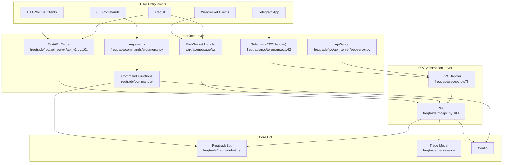
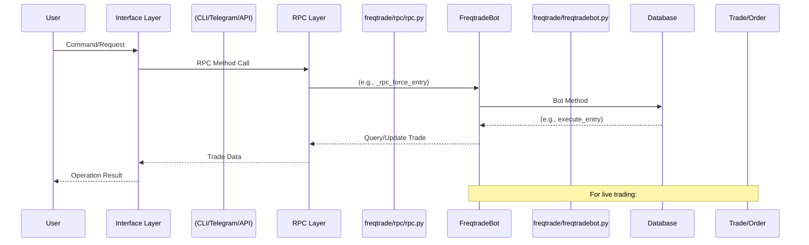
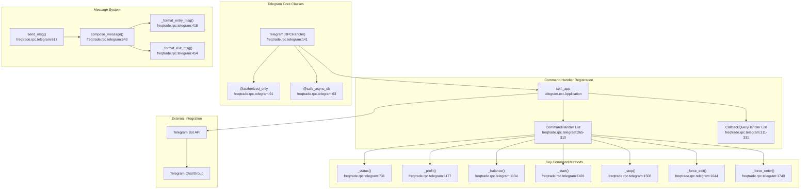
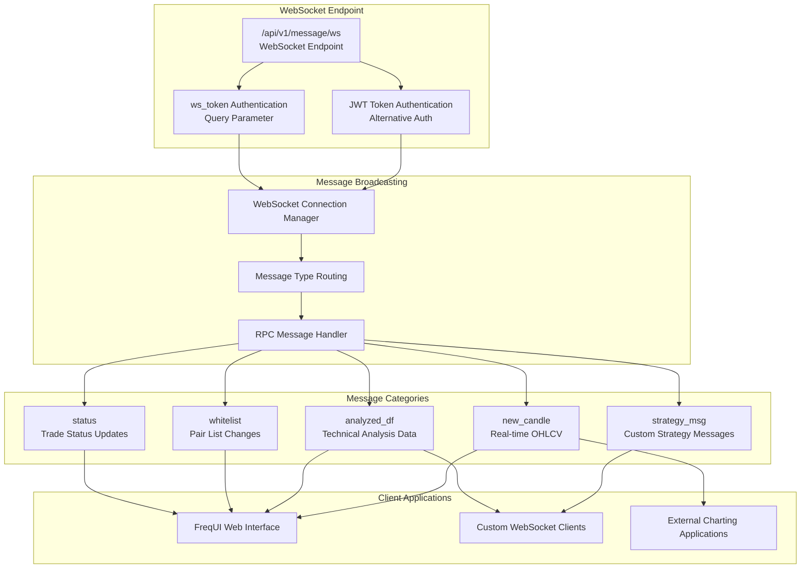
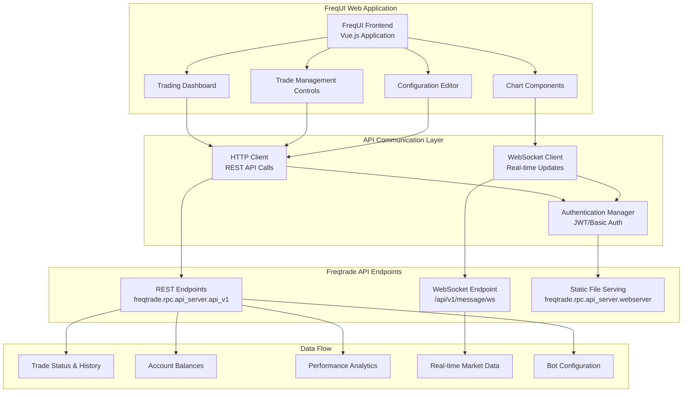

# User Interfaces and Control

Relevant source files

* [docs/rest-api.md](https://github.com/freqtrade/freqtrade/blob/8e91fea1/docs/rest-api.md)
* [docs/telegram-usage.md](https://github.com/freqtrade/freqtrade/blob/8e91fea1/docs/telegram-usage.md)
* [docs/utils.md](https://github.com/freqtrade/freqtrade/blob/8e91fea1/docs/utils.md)
* [freqtrade/commands/\_\_init\_\_.py](https://github.com/freqtrade/freqtrade/blob/8e91fea1/freqtrade/commands/__init__.py)
* [freqtrade/commands/arguments.py](https://github.com/freqtrade/freqtrade/blob/8e91fea1/freqtrade/commands/arguments.py)
* [freqtrade/commands/cli\_options.py](https://github.com/freqtrade/freqtrade/blob/8e91fea1/freqtrade/commands/cli_options.py)
* [freqtrade/commands/data\_commands.py](https://github.com/freqtrade/freqtrade/blob/8e91fea1/freqtrade/commands/data_commands.py)
* [freqtrade/commands/deploy\_commands.py](https://github.com/freqtrade/freqtrade/blob/8e91fea1/freqtrade/commands/deploy_commands.py)
* [freqtrade/commands/hyperopt\_commands.py](https://github.com/freqtrade/freqtrade/blob/8e91fea1/freqtrade/commands/hyperopt_commands.py)
* [freqtrade/commands/list\_commands.py](https://github.com/freqtrade/freqtrade/blob/8e91fea1/freqtrade/commands/list_commands.py)
* [freqtrade/configuration/configuration.py](https://github.com/freqtrade/freqtrade/blob/8e91fea1/freqtrade/configuration/configuration.py)
* [freqtrade/loggers/rich\_console.py](https://github.com/freqtrade/freqtrade/blob/8e91fea1/freqtrade/loggers/rich_console.py)
* [freqtrade/optimize/hyperopt\_tools.py](https://github.com/freqtrade/freqtrade/blob/8e91fea1/freqtrade/optimize/hyperopt_tools.py)
* [freqtrade/rpc/api\_server/api\_schemas.py](https://github.com/freqtrade/freqtrade/blob/8e91fea1/freqtrade/rpc/api_server/api_schemas.py)
* [freqtrade/rpc/api\_server/api\_v1.py](https://github.com/freqtrade/freqtrade/blob/8e91fea1/freqtrade/rpc/api_server/api_v1.py)
* [freqtrade/rpc/rpc.py](https://github.com/freqtrade/freqtrade/blob/8e91fea1/freqtrade/rpc/rpc.py)
* [freqtrade/rpc/telegram.py](https://github.com/freqtrade/freqtrade/blob/8e91fea1/freqtrade/rpc/telegram.py)
* [freqtrade/util/progress\_tracker.py](https://github.com/freqtrade/freqtrade/blob/8e91fea1/freqtrade/util/progress_tracker.py)
* [freqtrade/util/rich\_tables.py](https://github.com/freqtrade/freqtrade/blob/8e91fea1/freqtrade/util/rich_tables.py)
* [scripts/rest\_client.py](https://github.com/freqtrade/freqtrade/blob/8e91fea1/scripts/rest_client.py)
* [tests/commands/test\_commands.py](https://github.com/freqtrade/freqtrade/blob/8e91fea1/tests/commands/test_commands.py)
* [tests/optimize/test\_hyperopt\_tools.py](https://github.com/freqtrade/freqtrade/blob/8e91fea1/tests/optimize/test_hyperopt_tools.py)
* [tests/rpc/test\_rpc.py](https://github.com/freqtrade/freqtrade/blob/8e91fea1/tests/rpc/test_rpc.py)
* [tests/rpc/test\_rpc\_apiserver.py](https://github.com/freqtrade/freqtrade/blob/8e91fea1/tests/rpc/test_rpc_apiserver.py)
* [tests/rpc/test\_rpc\_telegram.py](https://github.com/freqtrade/freqtrade/blob/8e91fea1/tests/rpc/test_rpc_telegram.py)

Freqtrade provides multiple interfaces for users to interact with, control, and monitor the trading bot. These interfaces serve different use cases: command-line operations, real-time notifications, programmatic API access, and web-based management.

This page provides an overview of the interface architecture and how the different components work together. For detailed implementation specifics:

* [Command Line Interface](/freqtrade/freqtrade/4.1-command-line-interface) - CLI arguments, commands, and utility functions
* [RPC System Architecture](/freqtrade/freqtrade/4.2-rpc-system-architecture) - Core RPC abstraction and handler patterns
* [Telegram Bot Interface](/freqtrade/freqtrade/4.3-telegram-bot-interface) - Telegram integration, commands, and authorization
* [REST API and WebSocket](/freqtrade/freqtrade/4.4-rest-api-and-websocket) - HTTP endpoints, WebSocket streaming, and FreqUI integration

## Interface Categories

Freqtrade exposes four primary interface types:

| Interface | Entry Point | Primary Use Case | User Type |
| --- | --- | --- | --- |
| **Command Line Interface** | `freqtrade` command via [freqtrade/\_\_main\_\_.py1-26](https://github.com/freqtrade/freqtrade/blob/8e91fea1/freqtrade/__main__.py#L1-L26) | Bot startup, backtesting, data management, configuration | Developers, advanced users |
| **Telegram Bot** | [freqtrade/rpc/telegram.py142](https://github.com/freqtrade/freqtrade/blob/8e91fea1/freqtrade/rpc/telegram.py#L142-L142) class | Real-time notifications and interactive control | All users |
| **REST API** | [freqtrade/rpc/api\_server/api\_v1.py99-101](https://github.com/freqtrade/freqtrade/blob/8e91fea1/freqtrade/rpc/api_server/api_v1.py#L99-L101) routers | Programmatic bot control and data access | Developers, integrations |
| **WebSocket** | `/api/v1/message/ws` endpoint | Real-time streaming updates | FreqUI, custom clients |

**Sources:** [freqtrade/\_\_main\_\_.py1-26](https://github.com/freqtrade/freqtrade/blob/8e91fea1/freqtrade/__main__.py#L1-L26) [freqtrade/rpc/telegram.py142](https://github.com/freqtrade/freqtrade/blob/8e91fea1/freqtrade/rpc/telegram.py#L142-L142) [freqtrade/rpc/api\_server/api\_v1.py99-101](https://github.com/freqtrade/freqtrade/blob/8e91fea1/freqtrade/rpc/api_server/api_v1.py#L99-L101)

## Overall Interface Architecture

This diagram shows how user-facing interfaces connect to the core bot system:



**Sources:** [freqtrade/commands/arguments.py1-30](https://github.com/freqtrade/freqtrade/blob/8e91fea1/freqtrade/commands/arguments.py#L1-L30) [freqtrade/rpc/telegram.py142](https://github.com/freqtrade/freqtrade/blob/8e91fea1/freqtrade/rpc/telegram.py#L142-L142) [freqtrade/rpc/api\_server/webserver.py](https://github.com/freqtrade/freqtrade/blob/8e91fea1/freqtrade/rpc/api_server/webserver.py) [freqtrade/rpc/api\_server/api\_v1.py99-101](https://github.com/freqtrade/freqtrade/blob/8e91fea1/freqtrade/rpc/api_server/api_v1.py#L99-L101) [freqtrade/rpc/rpc.py78-103](https://github.com/freqtrade/freqtrade/blob/8e91fea1/freqtrade/rpc/rpc.py#L78-L103) [scripts/rest\_client.py1-15](https://github.com/freqtrade/freqtrade/blob/8e91fea1/scripts/rest_client.py#L1-L15)

## Interface Communication Patterns

The following diagram illustrates how different interfaces interact with the bot during a typical operation:



**Sources:** [freqtrade/rpc/rpc.py103-124](https://github.com/freqtrade/freqtrade/blob/8e91fea1/freqtrade/rpc/rpc.py#L103-L124) [freqtrade/rpc/telegram.py142-157](https://github.com/freqtrade/freqtrade/blob/8e91fea1/freqtrade/rpc/telegram.py#L142-L157) [freqtrade/rpc/api\_server/api\_v1.py](https://github.com/freqtrade/freqtrade/blob/8e91fea1/freqtrade/rpc/api_server/api_v1.py)

## Command Line Interface Overview

The CLI is the primary method for starting the bot, running backtests, and executing utility functions. It's implemented through [freqtrade/\_\_main\_\_.py1-26](https://github.com/freqtrade/freqtrade/blob/8e91fea1/freqtrade/__main__.py#L1-L26) which delegates to command modules:

| Command Category | Example Commands | Implementation |
| --- | --- | --- |
| **Trading** | `trade`, `webserver` | [freqtrade/commands/trading\_commands.py](https://github.com/freqtrade/freqtrade/blob/8e91fea1/freqtrade/commands/trading_commands.py) |
| **Data Management** | `download-data`, `convert-data`, `list-data` | [freqtrade/commands/data\_commands.py1-150](https://github.com/freqtrade/freqtrade/blob/8e91fea1/freqtrade/commands/data_commands.py#L1-L150) |
| **Analysis** | `backtesting`, `hyperopt`, `edge` | [freqtrade/commands/optimize\_commands.py](https://github.com/freqtrade/freqtrade/blob/8e91fea1/freqtrade/commands/optimize_commands.py) |
| **Deployment** | `create-userdir`, `new-strategy` | [freqtrade/commands/deploy\_commands.py1-100](https://github.com/freqtrade/freqtrade/blob/8e91fea1/freqtrade/commands/deploy_commands.py#L1-L100) |
| **Listing** | `list-exchanges`, `list-strategies`, `list-timeframes` | [freqtrade/commands/list\_commands.py1-80](https://github.com/freqtrade/freqtrade/blob/8e91fea1/freqtrade/commands/list_commands.py#L1-L80) |

The `Arguments` class [freqtrade/commands/arguments.py1-50](https://github.com/freqtrade/freqtrade/blob/8e91fea1/freqtrade/commands/arguments.py#L1-L50) parses CLI arguments and routes them to appropriate command handlers. See [Command Line Interface](/freqtrade/freqtrade/4.1-command-line-interface) for detailed implementation.

**Sources:** [freqtrade/\_\_main\_\_.py1-26](https://github.com/freqtrade/freqtrade/blob/8e91fea1/freqtrade/__main__.py#L1-L26) [freqtrade/commands/arguments.py1-50](https://github.com/freqtrade/freqtrade/blob/8e91fea1/freqtrade/commands/arguments.py#L1-L50) [freqtrade/commands/data\_commands.py1-150](https://github.com/freqtrade/freqtrade/blob/8e91fea1/freqtrade/commands/data_commands.py#L1-L150) [freqtrade/commands/deploy\_commands.py1-100](https://github.com/freqtrade/freqtrade/blob/8e91fea1/freqtrade/commands/deploy_commands.py#L1-L100) [freqtrade/commands/list\_commands.py1-80](https://github.com/freqtrade/freqtrade/blob/8e91fea1/freqtrade/commands/list_commands.py#L1-L80)

## RPC-Based Interfaces Overview

The RPC system provides a unified abstraction for remote control interfaces. All remote interfaces (Telegram, REST API, WebSocket) implement the `RPCHandler` abstract class [freqtrade/rpc/rpc.py:78] and use the `RPC` class [freqtrade/rpc/rpc.py:103] for bot interaction:

| Interface | Handler Class | Communication Protocol | Primary Use Case |
| --- | --- | --- | --- |
| **Telegram** | `Telegram(RPCHandler)` [freqtrade/rpc/telegram.py142](https://github.com/freqtrade/freqtrade/blob/8e91fea1/freqtrade/rpc/telegram.py#L142-L142) | Telegram Bot API | Interactive notifications and control |
| **REST API** | `ApiServer(RPCHandler)` [freqtrade/rpc/api\_server/webserver.py](https://github.com/freqtrade/freqtrade/blob/8e91fea1/freqtrade/rpc/api_server/webserver.py) | HTTP/HTTPS | Programmatic access and FreqUI backend |
| **WebSocket** | Via `ApiServer` | WebSocket over HTTP | Real-time streaming updates |

The `RPC` class provides methods like `_rpc_trade_status()`, `_rpc_balance()`, `_rpc_force_entry()`, and `_rpc_force_exit()` that all handlers use to interact with the bot. See [RPC System Architecture](/freqtrade/freqtrade/4.2-rpc-system-architecture) for implementation details.

**Sources:** [freqtrade/rpc/rpc.py78-124](https://github.com/freqtrade/freqtrade/blob/8e91fea1/freqtrade/rpc/rpc.py#L78-L124) [freqtrade/rpc/telegram.py142](https://github.com/freqtrade/freqtrade/blob/8e91fea1/freqtrade/rpc/telegram.py#L142-L142) [freqtrade/rpc/api\_server/webserver.py](https://github.com/freqtrade/freqtrade/blob/8e91fea1/freqtrade/rpc/api_server/webserver.py)

## Telegram Interface Overview

The Telegram bot [freqtrade/rpc/telegram.py142](https://github.com/freqtrade/freqtrade/blob/8e91fea1/freqtrade/rpc/telegram.py#L142-L142) provides real-time notifications and 30+ interactive commands for bot control. Key features:

* **Authorization**: Multi-level security via `chat_id`, `topic_id`, and `authorized_users` [freqtrade/rpc/telegram.py112-125](https://github.com/freqtrade/freqtrade/blob/8e91fea1/freqtrade/rpc/telegram.py#L112-L125)
* **Commands**: 30+ commands including `/status`, `/profit`, `/balance`, `/forcebuy`, `/forcesell` [freqtrade/rpc/telegram.py266-310](https://github.com/freqtrade/freqtrade/blob/8e91fea1/freqtrade/rpc/telegram.py#L266-L310)
* **Notifications**: Automatic alerts for trade entries, exits, and errors [freqtrade/rpc/telegram.py617-630](https://github.com/freqtrade/freqtrade/blob/8e91fea1/freqtrade/rpc/telegram.py#L617-L630)
* **Custom Keyboards**: Configurable command shortcuts [freqtrade/rpc/telegram.py166-244](https://github.com/freqtrade/freqtrade/blob/8e91fea1/freqtrade/rpc/telegram.py#L166-L244)

See [Telegram Bot Interface](/freqtrade/freqtrade/4.3-telegram-bot-interface) for detailed command reference and configuration.

**Sources:** [freqtrade/rpc/telegram.py142-157](https://github.com/freqtrade/freqtrade/blob/8e91fea1/freqtrade/rpc/telegram.py#L142-L157) [freqtrade/rpc/telegram.py264-336](https://github.com/freqtrade/freqtrade/blob/8e91fea1/freqtrade/rpc/telegram.py#L264-L336)

## REST API and WebSocket Overview

The REST API [freqtrade/rpc/api\_server/api\_v1.py99-101](https://github.com/freqtrade/freqtrade/blob/8e91fea1/freqtrade/rpc/api_server/api_v1.py#L99-L101) provides HTTP endpoints for programmatic bot control, currently at version 2.45:

| Endpoint Category | Examples | Purpose |
| --- | --- | --- |
| **Info** | `/balance`, `/count`, `/status` | Query current bot state |
| **Trading** | `/forceenter`, `/forceexit`, `/trades` | Execute trading operations |
| **Analysis** | `/profit`, `/performance`, `/daily` | Retrieve performance metrics |

The WebSocket endpoint `/api/v1/message/ws` streams real-time updates for:

* Trade status changes
* Market data updates
* Whitelist changes
* Custom strategy messages

See [REST API and WebSocket](/freqtrade/freqtrade/4.4-rest-api-and-websocket) for endpoint reference and authentication details.

**Sources:** [freqtrade/rpc/api\_server/api\_v1.py94-327](https://github.com/freqtrade/freqtrade/blob/8e91fea1/freqtrade/rpc/api_server/api_v1.py#L94-L327) [tests/rpc/test\_rpc\_apiserver.py216-235](https://github.com/freqtrade/freqtrade/blob/8e91fea1/tests/rpc/test_rpc_apiserver.py#L216-L235)

## Telegram Bot Interface

The Telegram interface provides real-time notifications and interactive command execution through the `Telegram` class [freqtrade/rpc/telegram.py141-157](https://github.com/freqtrade/freqtrade/blob/8e91fea1/freqtrade/rpc/telegram.py#L141-L157)

### Telegram Implementation Architecture



**Sources:** [freqtrade/rpc/telegram.py141-157](https://github.com/freqtrade/freqtrade/blob/8e91fea1/freqtrade/rpc/telegram.py#L141-L157) [freqtrade/rpc/telegram.py264-336](https://github.com/freqtrade/freqtrade/blob/8e91fea1/freqtrade/rpc/telegram.py#L264-L336) [freqtrade/rpc/telegram.py91-138](https://github.com/freqtrade/freqtrade/blob/8e91fea1/freqtrade/rpc/telegram.py#L91-L138) [freqtrade/rpc/telegram.py617-630](https://github.com/freqtrade/freqtrade/blob/8e91fea1/freqtrade/rpc/telegram.py#L617-L630)

### Authorization and Security

The Telegram bot implements multiple layers of security:

| Security Feature | Implementation | Configuration |
| --- | --- | --- |
| **Chat ID Validation** | [freqtrade/rpc/telegram.py112-115](https://github.com/freqtrade/freqtrade/blob/8e91fea1/freqtrade/rpc/telegram.py#L112-L115) | `telegram.chat_id` |
| **Topic ID Filtering** | [freqtrade/rpc/telegram.py116-120](https://github.com/freqtrade/freqtrade/blob/8e91fea1/freqtrade/rpc/telegram.py#L116-L120) | `telegram.topic_id` |
| **User Authorization** | [freqtrade/rpc/telegram.py122-125](https://github.com/freqtrade/freqtrade/blob/8e91fea1/freqtrade/rpc/telegram.py#L122-L125) | `telegram.authorized_users` |
| **Session Management** | [freqtrade/rpc/telegram.py126-136](https://github.com/freqtrade/freqtrade/blob/8e91fea1/freqtrade/rpc/telegram.py#L126-L136) | Trade.rollback() and session.remove() |

The `@authorized_only` decorator [freqtrade/rpc/telegram.py91-138](https://github.com/freqtrade/freqtrade/blob/8e91fea1/freqtrade/rpc/telegram.py#L91-L138) ensures all command handlers are protected.

### Command Registration and Handlers

Commands are registered during `_init()` [freqtrade/rpc/telegram.py249-342](https://github.com/freqtrade/freqtrade/blob/8e91fea1/freqtrade/rpc/telegram.py#L249-L342):

```
```
handles = [
    CommandHandler("status", self._status),
    CommandHandler("profit", self._profit), 
    CommandHandler("balance", self._balance),
    CommandHandler("start", self._start),
    CommandHandler("stop", self._stop),
    CommandHandler(["forceexit", "forcesell", "fx"], self._force_exit),
    CommandHandler(["forcebuy", "forcelong"], partial(self._force_enter, order_side=SignalDirection.LONG)),
    # ... 30+ additional commands
]
```
```

### Custom Keyboard Configuration

The Telegram bot supports custom keyboards [freqtrade/rpc/telegram.py165-244](https://github.com/freqtrade/freqtrade/blob/8e91fea1/freqtrade/rpc/telegram.py#L165-L244) with validation against allowed commands:

| Keyboard Feature | Implementation | Default Layout |
| --- | --- | --- |
| **Default Keyboard** | [freqtrade/rpc/telegram.py170-174](https://github.com/freqtrade/freqtrade/blob/8e91fea1/freqtrade/rpc/telegram.py#L170-L174) | `/daily`, `/profit`, `/balance` / `/status`, `/status table`, `/performance` / `/count`, `/start`, `/stop`, `/help` |
| **Custom Keyboard** | [freqtrade/rpc/telegram.py227-244](https://github.com/freqtrade/freqtrade/blob/8e91fea1/freqtrade/rpc/telegram.py#L227-L244) | Configured via `telegram.keyboard` |
| **Command Validation** | [freqtrade/rpc/telegram.py179-223](https://github.com/freqtrade/freqtrade/blob/8e91fea1/freqtrade/rpc/telegram.py#L179-L223) | Regex pattern matching |

### Message Formatting and Notifications

The notification system [freqtrade/rpc/telegram.py543-644](https://github.com/freqtrade/freqtrade/blob/8e91fea1/freqtrade/rpc/telegram.py#L543-L644) handles different message types:

| Message Type | Handler Method | Purpose |
| --- | --- | --- |
| **Entry Messages** | `_format_entry_msg()` [freqtrade/rpc/telegram.py415-452](https://github.com/freqtrade/freqtrade/blob/8e91fea1/freqtrade/rpc/telegram.py#L415-L452) | New trade notifications |
| **Exit Messages** | `_format_exit_msg()` [freqtrade/rpc/telegram.py454-527](https://github.com/freqtrade/freqtrade/blob/8e91fea1/freqtrade/rpc/telegram.py#L454-L527) | Trade closure notifications |
| **Cancel Messages** | `compose_message()` [freqtrade/rpc/telegram.py551-559](https://github.com/freqtrade/freqtrade/blob/8e91fea1/freqtrade/rpc/telegram.py#L551-L559) | Order cancellation alerts |
| **Protection Messages** | `compose_message()` [freqtrade/rpc/telegram.py561-571](https://github.com/freqtrade/freqtrade/blob/8e91fea1/freqtrade/rpc/telegram.py#L561-L571) | Protection trigger alerts |

**Sources:** [freqtrade/rpc/telegram.py415-527](https://github.com/freqtrade/freqtrade/blob/8e91fea1/freqtrade/rpc/telegram.py#L415-L527) [freqtrade/rpc/telegram.py543-589](https://github.com/freqtrade/freqtrade/blob/8e91fea1/freqtrade/rpc/telegram.py#L543-L589) [freqtrade/rpc/telegram.py617-630](https://github.com/freqtrade/freqtrade/blob/8e91fea1/freqtrade/rpc/telegram.py#L617-L630)

## REST API Interface

The REST API provides programmatic access to bot functionality through HTTP endpoints using FastAPI [freqtrade/rpc/api\_server/api\_v1.py94](https://github.com/freqtrade/freqtrade/blob/8e91fea1/freqtrade/rpc/api_server/api_v1.py#L94-L94)

### API Server Implementation

```mermaid
flowchart TD

ApiServer_class["ApiServer<br>freqtrade.rpc.api_server.webserver"]
fastapi_app["FastAPI Application<br>self.app"]
UvicornServer_class["UvicornServer<br>freqtrade.rpc.api_server.uvicorn_threaded"]
router_public["router_public<br>freqtrade.rpc.api_server.api_v1:97"]
router_private["router<br>freqtrade.rpc.api_server.api_v1:99"]
API_VERSION["API_VERSION = 2.43<br>freqtrade.rpc.api_server.api_v1:94"]
get_rpc_dependency["get_rpc()<br>freqtrade.rpc.api_server.deps"]
get_config_dependency["get_config()<br>freqtrade.rpc.api_server.deps"]
basic_auth["HTTP Basic Auth"]
jwt_auth["JWT Token Auth"]
ping_endpoint["/ping<br>freqtrade.rpc.api_server.api_v1:102"]
version_endpoint["/version<br>freqtrade.rpc.api_server.api_v1:108"]
balance_endpoint["/balance<br>freqtrade.rpc.api_server.api_v1:114"]
status_endpoint["/status<br>freqtrade.rpc.api_server.api_v1:209"]
trades_endpoint["/trades<br>freqtrade.rpc.api_server.api_v1:219"]
forceenter_endpoint["/forceenter<br>freqtrade.rpc.api_server.api_v1:299"]
forceexit_endpoint["/forceexit<br>freqtrade.rpc.api_server.api_v1:323"]
Ping_schema["Ping<br>freqtrade.rpc.api_server.api_schemas:18"]
Version_schema["Version<br>freqtrade.rpc.api_server.api_schemas:30"]
Balances_schema["Balances<br>freqtrade.rpc.api_server.api_schemas:77"]
OpenTradeSchema_schema["OpenTradeSchema<br>freqtrade.rpc.api_server.api_schemas:356"]
ForceEnterResponse_schema["ForceEnterResponse<br>freqtrade.rpc.api_server.api_schemas:375"]

fastapi_app --> router_public
fastapi_app --> router_private
router_public --> ping_endpoint
router_private --> version_endpoint
router_private --> balance_endpoint
router_private --> status_endpoint
router_private --> trades_endpoint
router_private --> forceenter_endpoint
router_private --> forceexit_endpoint
router_private --> get_rpc_dependency
router_private --> get_config_dependency
router_private --> basic_auth
router_private --> jwt_auth
ping_endpoint --> Ping_schema
version_endpoint --> Version_schema
balance_endpoint --> Balances_schema
status_endpoint --> OpenTradeSchema_schema
forceenter_endpoint --> ForceEnterResponse_schema

subgraph subGraph4 ["Response Schemas"]
    Ping_schema
    Version_schema
    Balances_schema
    OpenTradeSchema_schema
    ForceEnterResponse_schema
end

subgraph subGraph3 ["Endpoint Categories"]
    ping_endpoint
    version_endpoint
    balance_endpoint
    status_endpoint
    trades_endpoint
    forceenter_endpoint
    forceexit_endpoint
end

subgraph subGraph2 ["Authentication Layer"]
    get_rpc_dependency
    get_config_dependency
    basic_auth
    jwt_auth
end

subgraph subGraph1 ["Route Organization"]
    router_public
    router_private
    API_VERSION
end

subgraph subGraph0 ["API Server Core"]
    ApiServer_class
    fastapi_app
    UvicornServer_class
    ApiServer_class --> fastapi_app
    ApiServer_class --> UvicornServer_class
end
```



**Sources:** [freqtrade/rpc/api\_server/api\_v1.py94-99](https://github.com/freqtrade/freqtrade/blob/8e91fea1/freqtrade/rpc/api_server/api_v1.py#L94-L99) [freqtrade/rpc/api\_server/api\_schemas.py1-50](https://github.com/freqtrade/freqtrade/blob/8e91fea1/freqtrade/rpc/api_server/api_schemas.py#L1-L50) [freqtrade/rpc/api\_server/deps.py](https://github.com/freqtrade/freqtrade/blob/8e91fea1/freqtrade/rpc/api_server/deps.py) [tests/rpc/test\_rpc\_apiserver.py54-89](https://github.com/freqtrade/freqtrade/blob/8e91fea1/tests/rpc/test_rpc_apiserver.py#L54-L89)

### API Endpoint Mapping

The REST API version 2.43 [freqtrade/rpc/api\_server/api\_v1.py94](https://github.com/freqtrade/freqtrade/blob/8e91fea1/freqtrade/rpc/api_server/api_v1.py#L94-L94) provides the following endpoint categories:

| Category | Method | Endpoint | Handler Function | Response Schema |
| --- | --- | --- | --- | --- |
| **Public** | GET | `/ping` | `ping()` [freqtrade/rpc/api\_server/api\_v1.py102-105](https://github.com/freqtrade/freqtrade/blob/8e91fea1/freqtrade/rpc/api_server/api_v1.py#L102-L105) | `Ping` |
| **Info** | GET | `/version` | `version()` [freqtrade/rpc/api\_server/api\_v1.py108-111](https://github.com/freqtrade/freqtrade/blob/8e91fea1/freqtrade/rpc/api_server/api_v1.py#L108-L111) | `Version` |
| **Info** | GET | `/balance` | `balance()` [freqtrade/rpc/api\_server/api\_v1.py114-120](https://github.com/freqtrade/freqtrade/blob/8e91fea1/freqtrade/rpc/api_server/api_v1.py#L114-L120) | `Balances` |
| **Info** | GET | `/count` | `count()` [freqtrade/rpc/api\_server/api\_v1.py123-125](https://github.com/freqtrade/freqtrade/blob/8e91fea1/freqtrade/rpc/api_server/api_v1.py#L123-L125) | `Count` |
| **Info** | GET | `/status` | `status()` [freqtrade/rpc/api\_server/api\_v1.py209-214](https://github.com/freqtrade/freqtrade/blob/8e91fea1/freqtrade/rpc/api_server/api_v1.py#L209-L214) | `list[OpenTradeSchema]` |
| **Trading** | GET | `/trades` | `trades()` [freqtrade/rpc/api\_server/api\_v1.py219-228](https://github.com/freqtrade/freqtrade/blob/8e91fea1/freqtrade/rpc/api_server/api_v1.py#L219-L228) | Trade history |
| **Trading** | POST | `/forceenter` | `force_entry()` [freqtrade/rpc/api\_server/api\_v1.py299-319](https://github.com/freqtrade/freqtrade/blob/8e91fea1/freqtrade/rpc/api_server/api_v1.py#L299-L319) | `ForceEnterResponse` |
| **Trading** | POST | `/forceexit` | `forceexit()` [freqtrade/rpc/api\_server/api\_v1.py323-327](https://github.com/freqtrade/freqtrade/blob/8e91fea1/freqtrade/rpc/api_server/api_v1.py#L323-L327) | `ResultMsg` |
| **Analysis** | GET | `/profit` | `profit()` [freqtrade/rpc/api\_server/api\_v1.py148-150](https://github.com/freqtrade/freqtrade/blob/8e91fea1/freqtrade/rpc/api_server/api_v1.py#L148-L150) | `Profit` |
| **Analysis** | GET | `/performance` | `performance()` [freqtrade/rpc/api\_server/api\_v1.py143-145](https://github.com/freqtrade/freqtrade/blob/8e91fea1/freqtrade/rpc/api_server/api_v1.py#L143-L145) | `list[PerformanceEntry]` |

### Pydantic Schema Validation

API responses use strongly-typed Pydantic models [freqtrade/rpc/api\_server/api\_schemas.py](https://github.com/freqtrade/freqtrade/blob/8e91fea1/freqtrade/rpc/api_server/api_schemas.py):

| Schema Class | Purpose | Key Fields |
| --- | --- | --- |
| `OpenTradeSchema` [freqtrade/rpc/api\_server/api\_schemas.py356-366](https://github.com/freqtrade/freqtrade/blob/8e91fea1/freqtrade/rpc/api_server/api_schemas.py#L356-L366) | Live trade data | `current_rate`, `total_profit_abs`, `stoploss_current_dist` |
| `Balances` [freqtrade/rpc/api\_server/api\_schemas.py77-92](https://github.com/freqtrade/freqtrade/blob/8e91fea1/freqtrade/rpc/api_server/api_schemas.py#L77-L92) | Account balance data | `currencies`, `total`, `stake`, `starting_capital` |
| `ForceEnterPayload` [freqtrade/rpc/api\_server/api\_schemas.py412-420](https://github.com/freqtrade/freqtrade/blob/8e91fea1/freqtrade/rpc/api_server/api_schemas.py#L412-L420) | Force entry request | `pair`, `side`, `price`, `stakeamount`, `leverage` |
| `TradeResponse` [freqtrade/rpc/api\_server/api\_schemas.py368-372](https://github.com/freqtrade/freqtrade/blob/8e91fea1/freqtrade/rpc/api_server/api_schemas.py#L368-L372) | Trade history response | `trades`, `trades_count`, `total_trades` |

### API Client Integration

The REST API integrates with external clients:

| Client Type | Implementation | Usage |
| --- | --- | --- |
| **freqtrade-client** | [scripts/rest\_client.py1-15](https://github.com/freqtrade/freqtrade/blob/8e91fea1/scripts/rest_client.py#L1-L15) | Standalone Python client |
| **FreqUI** | External web interface | Consumes REST + WebSocket |
| **Custom HTTP Clients** | Any HTTP client | Direct API consumption |

**Sources:** [freqtrade/rpc/api\_server/api\_v1.py94-327](https://github.com/freqtrade/freqtrade/blob/8e91fea1/freqtrade/rpc/api_server/api_v1.py#L94-L327) [freqtrade/rpc/api\_server/api\_schemas.py1-92](https://github.com/freqtrade/freqtrade/blob/8e91fea1/freqtrade/rpc/api_server/api_schemas.py#L1-L92) [scripts/rest\_client.py1-15](https://github.com/freqtrade/freqtrade/blob/8e91fea1/scripts/rest_client.py#L1-L15) [tests/rpc/test\_rpc\_apiserver.py91-127](https://github.com/freqtrade/freqtrade/blob/8e91fea1/tests/rpc/test_rpc_apiserver.py#L91-L127)

## WebSocket Interface

The WebSocket API provides real-time data streaming through the `/api/v1/message/ws` endpoint with token-based authentication.

### WebSocket Implementation



**Sources:** [tests/rpc/test\_rpc\_apiserver.py216-235](https://github.com/freqtrade/freqtrade/blob/8e91fea1/tests/rpc/test_rpc_apiserver.py#L216-L235) [tests/rpc/test\_rpc\_apiserver.py216-234](https://github.com/freqtrade/freqtrade/blob/8e91fea1/tests/rpc/test_rpc_apiserver.py#L216-L234)

### WebSocket Authentication and Security

The WebSocket endpoint implements dual authentication methods:

| Authentication Method | Implementation | Configuration |
| --- | --- | --- |
| **WS Token** | Query parameter `?token=<ws_token>` | `api_server.ws_token` |
| **JWT Token** | Query parameter `?token=<jwt_token>` | Generated from `api_server.jwt_secret_key` |

Authentication validation occurs in the WebSocket connection handler [tests/rpc/test\_rpc\_apiserver.py222-234](https://github.com/freqtrade/freqtrade/blob/8e91fea1/tests/rpc/test_rpc_apiserver.py#L222-L234):

```
```
# Bad token results in WebSocketDisconnect
with pytest.raises(WebSocketDisconnect):
    with client.websocket_connect(url(bad_token)):
        pass

# Good ws_token allows connection
with client.websocket_connect(url(good_token)):
    pass

# JWT token also allows connection  
jwt_token = create_token({"identity": {"u": "Freqtrade"}}, jwt_secret)
with client.websocket_connect(url(jwt_token)):
    pass
```
```

### Real-time Message Broadcasting

WebSocket clients receive real-time updates for:

| Message Type | Content | Use Case |
| --- | --- | --- |
| **status** | Current trade status updates | Live position monitoring |
| **whitelist** | Pairlist changes | Dynamic pair selection |
| **analyzed\_df** | Technical indicator data | Real-time analysis display |
| **new\_candle** | Latest OHLCV candle data | Live charting |
| **strategy\_msg** | Custom strategy notifications | Strategy-specific alerts |

**Sources:** [tests/rpc/test\_rpc\_apiserver.py216-235](https://github.com/freqtrade/freqtrade/blob/8e91fea1/tests/rpc/test_rpc_apiserver.py#L216-L235)

## Web UI Integration

FreqUI serves as the primary web-based interface, integrating with both REST and WebSocket APIs for comprehensive bot management.

### FreqUI Integration Points



**Sources:** [tests/rpc/test\_rpc\_apiserver.py187-194](https://github.com/freqtrade/freqtrade/blob/8e91fea1/tests/rpc/test_rpc_apiserver.py#L187-L194) [freqtrade/rpc/api\_server/api\_v1.py](https://github.com/freqtrade/freqtrade/blob/8e91fea1/freqtrade/rpc/api_server/api_v1.py)

### UI Installation and Deployment

FreqUI installation is managed through Freqtrade's command system:

| Component | Implementation | Purpose |
| --- | --- | --- |
| **UI Installation** | `freqtrade install-ui` command | Downloads and installs FreqUI |
| **Static Serving** | Fallback HTML [tests/rpc/test\_rpc\_apiserver.py157-178](https://github.com/freqtrade/freqtrade/blob/8e91fea1/tests/rpc/test_rpc_apiserver.py#L157-L178) | Serves UI or installation prompt |
| **Version Detection** | `read_ui_version()` [tests/rpc/test\_rpc\_apiserver.py190-193](https://github.com/freqtrade/freqtrade/blob/8e91fea1/tests/rpc/test_rpc_apiserver.py#L190-L193) | Tracks installed UI version |

### API Integration Patterns

FreqUI integrates with Freqtrade APIs using the following patterns:

| Integration Type | API Usage | Data Flow |
| --- | --- | --- |
| **Historical Data** | REST API `/trades`, `/profit`, `/performance` | Request-response for charts and reports |
| **Live Updates** | WebSocket `/api/v1/message/ws` | Real-time streaming for live data |
| **Trade Management** | REST API `/forceenter`, `/forceexit` | User-initiated trading actions |
| **Configuration** | REST API `/show_config`, `/reload_config` | Bot configuration management |

**Sources:** [tests/rpc/test\_rpc\_apiserver.py187-194](https://github.com/freqtrade/freqtrade/blob/8e91fea1/tests/rpc/test_rpc_apiserver.py#L187-L194) [freqtrade/rpc/api\_server/api\_v1.py209-327](https://github.com/freqtrade/freqtrade/blob/8e91fea1/freqtrade/rpc/api_server/api_v1.py#L209-L327)

## Interface Security

All remote interfaces implement security measures:

| Interface | Security Method | Configuration |
| --- | --- | --- |
| **Telegram** | User ID authorization | `telegram.chat_id`, `telegram.authorized_users` |
| **REST API** | HTTP Basic Auth + JWT | `api_server.username`, `api_server.password`, `api_server.jwt_secret_key` |
| **WebSocket** | Token authentication | `api_server.ws_token` or JWT tokens |

**Sources:** [freqtrade/rpc/telegram.py91-138](https://github.com/freqtrade/freqtrade/blob/8e91fea1/freqtrade/rpc/telegram.py#L91-L138) [tests/rpc/test\_rpc\_apiserver.py196-214](https://github.com/freqtrade/freqtrade/blob/8e91fea1/tests/rpc/test_rpc_apiserver.py#L196-L214) [tests/rpc/test\_rpc\_apiserver.py216-235](https://github.com/freqtrade/freqtrade/blob/8e91fea1/tests/rpc/test_rpc_apiserver.py#L216-L235)