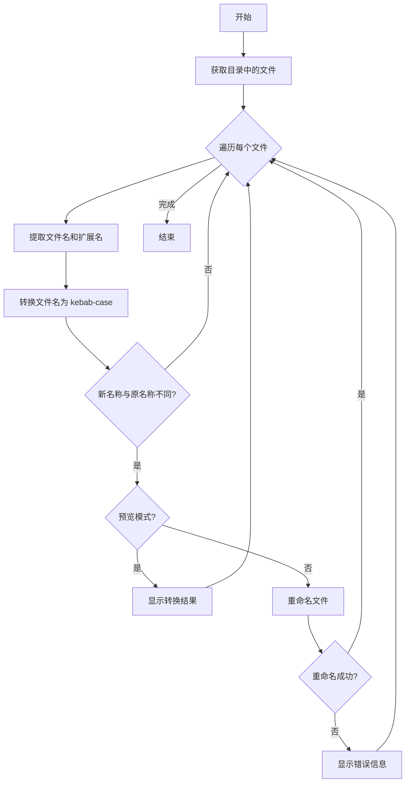

# PowerShell 文件名大小写转换工具

## 概述

这是一个 PowerShell 脚本工具，用于批量将文件名从 PascalCase（帕斯卡命名法）转换为 kebab-case（短横线命名法）。该工具使用正则表达式智能识别单词边界，支持预览模式和批量转换。

## 核心功能

### 命名转换规则

脚本实现了以下转换规则：

1. **单词边界识别**：
   - 小写字母后跟大写字母：`myFile` → `my-file`
   - 数字后跟大写字母：`file2Name` → `file2-name`
   - 连续大写字母后跟小写字母：`HTTPServer` → `http-server`

2. **空格处理**：将空格替换为短横线

3. **大小写转换**：所有字符转换为小写

4. **清理优化**：
   - 移除首尾的短横线
   - 合并连续的短横线

### 转换示例

| 原始文件名 | 转换后文件名 |
|-----------|-------------|
| `Hyperparameter Optimization` | `hyperparameter-optimization` |
| `CICD Pipeline and Docker` | `cicd-pipeline-and-docker` |
| `Advanced Features` | `advanced-features` |
| `DeepWiki` | `deep-wiki` |
| `MyFileName` | `my-file-name` |

## 使用方法

### 基本语法

```powershell
.\pascal2kebab.ps1 [-Dir <路径>] [-Preview]
```

### 参数说明

| 参数 | 类型 | 默认值 | 说明 |
|------|------|--------|------|
| `-Dir` | String | `.` (当前目录) | 指定要处理的目录路径 |
| `-Preview` | Switch | 关闭 | 启用预览模式，只显示转换结果不实际重命名 |

### 使用示例

#### 1. 预览当前目录的转换结果

```powershell
.\pascal2kebab.ps1 -Preview
```

输出示例：
```
Pascal Case → kebab-case 转换
=============================
测试示例：
  Hyperparameter Optimization → hyperparameter-optimization
  CICD Pipeline and Docker → cicd-pipeline-and-docker
  Advanced Features → advanced-features

处理文件...
MyDocument.md → my-document.md
TestFile.txt → test-file.txt

预览模式完成
```

#### 2. 实际转换当前目录的文件

```powershell
.\pascal2kebab.ps1
```

#### 3. 转换指定目录的文件

```powershell
.\pascal2kebab.ps1 -Dir "C:\Projects\MyProject"
```

#### 4. 预览指定目录的转换结果

```powershell
.\pascal2kebab.ps1 -Dir "C:\Projects\MyProject" -Preview
```

## 实现原理

### 核心转换函数

```powershell
function Convert-ToKebab {
    param([string]$text)
    
    # 空值处理
    if ([string]::IsNullOrEmpty($text)) { return $text }
    
    # 正则表达式匹配单词边界
    $pattern = '(?<=[a-z0-9])(?=[A-Z])|(?<=[A-Z])(?=[A-Z][a-z])'
    
    # 插入分隔符
    $result = [System.Text.RegularExpressions.Regex]::Replace($text, $pattern, '-')
    
    # 替换空格
    $result = $result -replace '\s+', '-'
    
    # 转换为小写
    $result = $result.ToLower()
    
    # 清理
    $result = $result.Trim('-') -replace '-+', '-'
    
    return $result
}
```

### 正则表达式解析

脚本使用的正则表达式模式：`(?<=[a-z0-9])(?=[A-Z])|(?<=[A-Z])(?=[A-Z][a-z])`

**模式分解：**

1. `(?<=[a-z0-9])(?=[A-Z])`
   - `(?<=[a-z0-9])`：正向后查找，匹配小写字母或数字之后的位置
   - `(?=[A-Z])`：正向前查找，匹配大写字母之前的位置
   - 作用：在 `myFile` 中的 `y` 和 `F` 之间插入分隔符

2. `(?<=[A-Z])(?=[A-Z][a-z])`
   - `(?<=[A-Z])`：正向后查找，匹配大写字母之后的位置
   - `(?=[A-Z][a-z])`：正向前查找，匹配"大写字母+小写字母"之前的位置
   - 作用：在 `HTTPServer` 中的 `P` 和 `S` 之间插入分隔符

### 文件处理流程



## 错误处理

脚本包含以下错误处理机制：

1. **空值检查**：在转换前检查文件名是否为空
2. **异常捕获**：使用 `try-catch` 块捕获重命名操作的异常
3. **错误提示**：以红色文本显示错误信息

```powershell
try {
    Rename-Item -Path $_.FullName -NewName $newName -ErrorAction Stop
} catch {
    Write-Host "  错误: $_" -ForegroundColor Red
}
```

## 使用场景

### 1. 知识库文件规范化

在构建知识库时，统一文件命名格式：

```powershell
# 将所有文档转换为 kebab-case
.\pascal2kebab.ps1 -Dir ".\knowledge-base"
```

### 2. 项目迁移

从使用 PascalCase 的项目迁移到使用 kebab-case 的项目：

```powershell
# 先预览
.\pascal2kebab.ps1 -Dir ".\old-project" -Preview
# 确认后执行
.\pascal2kebab.ps1 -Dir ".\old-project"
```

### 3. 批量重命名

批量处理下载或导入的文件：

```powershell
.\pascal2kebab.ps1 -Dir ".\downloads"
```

## 注意事项

### 1. 备份重要文件

在执行批量重命名前，建议先备份重要文件或使用预览模式：

```powershell
# 始终先使用预览模式
.\pascal2kebab.ps1 -Preview
```

### 2. 文件名冲突

如果转换后的文件名与现有文件冲突，重命名操作会失败并显示错误。

### 3. 特殊字符处理

脚本主要处理字母和数字，对于包含特殊字符的文件名可能需要额外处理。

### 4. 扩展名保留

脚本会保留原始文件的扩展名，只转换文件名部分。

## 最佳实践

### 1. 使用预览模式

在实际执行前，始终先使用预览模式检查转换结果：

```powershell
.\pascal2kebab.ps1 -Dir ".\target-folder" -Preview
```

### 2. 分批处理

对于大量文件，建议分批处理以便于管理：

```powershell
# 先处理文档文件
.\pascal2kebab.ps1 -Dir ".\docs"
# 再处理代码文件
.\pascal2kebab.ps1 -Dir ".\src"
```

### 3. 版本控制

如果文件在版本控制系统中，重命名后记得提交更改：

```powershell
.\pascal2kebab.ps1
git add -A
git commit -m "chore: rename files to kebab-case"
```

### 4. 测试验证

转换后验证文件引用是否正常：

- 检查内部链接
- 验证导入语句
- 测试构建流程

## 扩展功能

### 自定义转换规则

可以修改 `Convert-ToKebab` 函数来实现其他命名转换：

```powershell
# 转换为 snake_case
function Convert-ToSnake {
    param([string]$text)
    $pattern = '(?<=[a-z0-9])(?=[A-Z])|(?<=[A-Z])(?=[A-Z][a-z])'
    $result = [System.Text.RegularExpressions.Regex]::Replace($text, $pattern, '_')
    $result = $result -replace '\s+', '_'
    $result = $result.ToLower()
    $result = $result.Trim('_') -replace '_+', '_'
    return $result
}
```

### 递归处理子目录

添加递归参数以处理子目录：

```powershell
param(
    [string]$Dir = ".",
    [switch]$Preview,
    [switch]$Recursive
)

if ($Recursive) {
    Get-ChildItem -Path $Dir -File -Recurse | ForEach-Object {
        # 处理逻辑
    }
}
```

## 相关资源

- [[powershell-scripting-guide.md|PowerShell 脚本编写指南]] - PowerShell 基础知识
- [[regex-patterns-reference.md|正则表达式模式参考]] - 正则表达式详解
- [[file-naming-conventions.md|文件命名规范]] - 命名约定最佳实践

## 参考链接

- [PowerShell 官方文档](https://docs.microsoft.com/powershell/)
- [正则表达式教程](https://www.regular-expressions.info/)
- [命名约定指南](https://en.wikipedia.org/wiki/Naming_convention_(programming))

---

*创建: 2026-01-02 | 更新: 2026-01-02*
