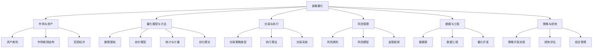

# 金融量化知识分类体系

## 概述
本分类体系旨在为Yggdrasil知识仓库中的金融量化（Finance & Quantitative）领域提供清晰、逻辑完整的层次结构。该体系基于行业标准、学术划分和实际应用场景，确保知识易于组织、导航和扩展。

## 顶层分类（一级目录）
金融量化知识可划分为以下六个核心领域：

1. **市场与资产** (Markets & Assets)
2. **量化模型与方法** (Quantitative Models & Methods)
3. **交易与执行** (Trading & Execution)
4. **风险管理** (Risk Management)
5. **数据与工程** (Data & Engineering)
6. **策略与绩效** (Strategies & Performance)

## 二级分类详细展开

### 1. 市场与资产
- **资产类别**
  - 股票 (Equities)
  - 固定收益 (Fixed Income)
  - 外汇 (Foreign Exchange)
  - 大宗商品 (Commodities)
  - 衍生品 (Derivatives)
  - 另类投资 (Alternative Investments)
- **市场微观结构**
  - 订单簿与流动性
  - 交易所与交易场所
  - 市场制度与监管
- **宏观经济与因子**
  - 经济指标
  - 宏观因子模型
  - 地缘政治事件

### 2. 量化模型与方法
- **数理基础**
  - 随机过程
  - 偏微分方程
  - 数值方法
- **定价模型**
  - 期权定价 (Black-Scholes, Heston, SABR)
  - 利率模型 (Vasicek, CIR, Hull-White)
  - 信用风险模型
- **统计与计量**
  - 时间序列分析
  - 回归与预测
  - 机器学习在金融中的应用
- **优化理论**
  - 投资组合优化
  - 凸优化
  - 随机优化

### 3. 交易与执行
- **交易策略类型**
  - 高频交易 (HFT)
  - 统计套利 (Stat Arb)
  - 做市 (Market Making)
  - 趋势跟踪 (Trend Following)
- **执行算法**
  - VWAP/TWAP
  - 执行差额最小化
  - 智能订单路由
- **交易系统**
  - 订单管理系统 (OMS)
  - 执行管理系统 (EMS)
  - 低延迟架构

### 4. 风险管理
- **风险类别**
  - 市场风险 (VaR, ES)
  - 信用风险
  - 流动性风险
  - 操作风险
- **风险模型**
  - 波动率模型 (GARCH, Stochastic Vol)
  - 相关性模型
  - 压力测试与情景分析
- **监管框架**
  - Basel III/IV
  - MiFID II
  - Dodd-Frank

### 5. 数据与工程
- **数据源**
  - 市场数据 (Tick, OHLC)
  - 基本面数据
  - 另类数据 (卫星、社交媒体、文本)
- **数据工程**
  - 数据清洗与标准化
  - 存储与数据库 (TimescaleDB, Arctic)
  - 流处理与实时管道
- **量化开发**
  - 回测框架
  - 研究环境 (Jupyter, QuantConnect)
  - 生产部署 (容器化、CI/CD)

### 6. 策略与绩效
- **策略开发流程**
  - 假设生成
  - 回测与过拟合检验
  - 样本外验证
- **绩效评估**
  - 收益指标 (Sharpe, Sortino, Calmar)
  - 风险调整后收益
  - 归因分析 (Brinson, Factor)
- **组合管理**
  - 资产配置
  - 再平衡策略
  - 资金管理 (Kelly, 风险预算)

## 三级分类示例（以“量化模型与方法/定价模型”为例）
- 欧式期权定价
- 美式期权定价
- 奇异期权定价
- 利率衍生品定价
- 信用衍生品定价

## 分类编码方案
为便于索引与自动化，建议采用以下编码格式：
- 一级：`FQ-XXX` (例如 `FQ-MA` 代表市场与资产)
- 二级：`FQ-XXX-YY` (例如 `FQ-MA-EQ` 代表股票)
- 三级：`FQ-XXX-YY-ZZ` (例如 `FQ-MA-EQ-ORDERBOOK` 代表订单簿)

## 可视化结构

## 使用建议
- 每个分类对应一个目录（或子目录），目录内放置相关笔记、代码、数据文档。
- 使用元数据（如标签、分类编码）实现跨分类检索。
- 定期复审分类体系，根据知识演进进行调整。

---
*版本：1.0 | 更新日期：2025-12-06 | 维护者：Yggdrasil 架构师*
