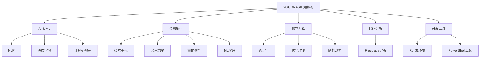

# YGGDRASIL 知识树 🌳

欢迎来到 YGGDRASIL 知识仓库！这是一个系统化组织的个人知识管理系统，涵盖人工智能、量化交易、数学基础等多个领域。

中文版 | [English](./readme.md)

## 📖 目录结构

```
YGGDRASIL/
├── ai-ml/               # 🤖 人工智能与机器学习
├── finance-quant/       # 💹 金融量化
├── math-foundation/     # 📐 数学基础
├── code-analysis/       # 🔍 代码分析与文档
├── development-tools/   # 🛠️ 开发工具与实用程序
├── knowledge-org/       # 📚 知识组织
├── snippets-library/    # 💾 代码片段库
├── _templates/          # 📋 文档模板
├── _drafts/             # ✏️ 草稿区
└── _archive/            # 📦 归档内容
```

## 🎯 主要领域

### 🤖 [人工智能与机器学习](./ai-ml/)
人工智能与机器学习核心技术
- [自然语言处理](./ai-ml/nlp/) - NLP技术与应用
- [深度学习](./ai-ml/deep-learning/) - 深度学习基础
- [计算机视觉](./ai-ml/computer-vision/) - 计算机视觉技术

### 💹 [金融量化](./finance-quant/)
量化交易完整知识体系
- [技术指标](./finance-quant/indicators/) - 动量、波动率、成交量指标
- [交易策略](./finance-quant/strategies/) - 策略开发与回测
- [量化模型](./finance-quant/models/) - 定价、风险、优化模型
- [机器学习应用](./finance-quant/ml-applications/) - 机器学习在量化中的应用
- [风险管理](./finance-quant/risk-management/) - 风险度量与控制
- [数据工程](./finance-quant/data-engineering/) - 数据管道与基础设施

### 📐 [数学基础](./math-foundation/)
理论支撑与数学工具
- [统计学](./math-foundation/statistics/) - 统计与概率论
- [优化理论](./math-foundation/optimization/) - 最优化方法
- [随机过程](./math-foundation/stochastic-processes/) - 随机微分方程

### 🔍 [代码分析](./code-analysis/)
开源项目深度分析与文档
- [Freqtrade](./code-analysis/freqtrade/) - 加密货币交易机器人分析

### 🛠️ [开发工具](./development-tools/)
开发实用工具与生产力工具
- [R 开发环境](./development-tools/r-development/) - R 语言开发环境配置
- PowerShell 脚本与实用工具
- Docker 与容器化工具

### 📚 [知识组织](./knowledge-org/)
元知识与知识管理方法论
- Markdown 元数据标准
- 文档最佳实践

### 💾 [代码片段库](./snippets-library/)
可复用的代码片段和工具函数

## 🚀 快速开始

### 浏览内容
1. 从上面的目录结构进入感兴趣的领域
2. 每个目录都有 `index.md` 提供完整导航
3. 使用 VS Code 或 Obsidian 获得最佳体验

### 搜索内容
- **全局搜索**：`Ctrl+Shift+F` (VS Code) 或 `Ctrl+Shift+F` (Obsidian)
- **按标签**：查看文档的 YAML frontmatter 中的 `tags` 字段
- **按分类**：通过 `categories` 字段定位内容

### 创建新文档
1. 使用 `_templates/document-template.md` 作为起点
2. 确保填写完整的 YAML frontmatter
3. 遵循 kebab-case 命名规范
4. 放置在合适的目录下

## 📝 组织原则

本仓库遵循严格的知识工程标准：

### 结构规范
- ✅ **扁平化**：优先 2 层结构，最多 3 层
- ✅ **语义化**：使用 kebab-case，目录名自解释
- ✅ **索引完整**：每个目录都有 index.md
- ✅ **元数据标准**：统一的 YAML frontmatter

### 命名规范
- **目录名**：kebab-case，1-3 个英文单词
- **文件名**：kebab-case，与 slug 字段一致
- **slug**：必须与文件名（去除.md）完全一致

### 元数据标准
**必填字段**：
- `title` - 人类可读的标题
- `slug` - URL 友好的标识符
- `description` - 简短描述（1-2 句话）
- `date` - 创建日期 (YYYY-MM-DD)
- `categories` - 分类（对应目录路径）
- `tags` - 标签（跨类别关键词）

**可选字段**：
- `author` - 作者
- `updated` - 更新日期
- `status` - 状态 (draft/published/archived)
- `version` - 版本号

详见 [finance-quant/metadata-standards.md](./finance-quant/metadata-standards.md)

## 🛠️ 工具与集成

### Foam（已集成）
本仓库保留 Foam 功能，支持：
- 📥 [inbox.md](./inbox.md) - 快速笔记
- ✅ [todo.md](./todo.md) - 任务管理
- 🔗 双向链接
- 📊 知识图谱可视化

### 推荐工具
- **VS Code** + Foam 插件
- **Obsidian** - 本地知识管理
- **Git** - 版本控制

## 🎨 知识地图



## 🔗 跨领域关系

- **AI → 量化**：机器学习技术应用于交易策略
- **数学 → AI**：优化算法支撑模型训练
- **数学 → 量化**：随机过程用于资产定价
- **代码分析 → 全部**：从实际项目中学习最佳实践

## 🏗️ 维护

本仓库由 **KG-Architect** 智能体辅助维护，确保：
- ✅ 结构合理性
- ✅ 命名一致性
- ✅ 元数据完整性
- ✅ 索引准确性

## 📜 版本历史

- **v2.0** (2026-01-02) - 重大更新
  - 新增 Freqtrade 完整分析文档
  - 增强 KG-Editor 工作流规则
  - 新增开发工具板块
  - 改进知识组织结构

- **v1.0** (2024-12-11) - 初始化仓库结构
  - 创建主要领域目录
  - 建立元数据标准
  - 生成完整索引

## 📄 许可

个人知识库，保留所有权利。

---

**开始探索** → 选择一个感兴趣的领域目录 → 查看 index.md 获取导航

*最后更新: 2026-01-02 | 维护者: KG-Architect*
