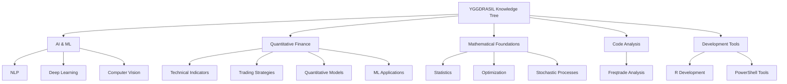

# YGGDRASIL Knowledge Tree 🌳

Welcome to YGGDRASIL, a systematically organized personal knowledge management system covering artificial intelligence, quantitative finance, mathematics, and more.

[中文版](./readme-zh_CN.md) | English

## 📖 Directory Structure

```
YGGDRASIL/
├── ai-ml/               # 🤖 Artificial Intelligence & Machine Learning
├── finance-quant/       # 💹 Quantitative Finance
├── math-foundation/     # 📐 Mathematical Foundations
├── code-analysis/       # 🔍 Code Analysis & Documentation
├── development-tools/   # 🛠️ Development Tools & Utilities
├── knowledge-org/       # 📚 Knowledge Organization
├── snippets-library/    # 💾 Code Snippets Library
├── _templates/          # 📋 Document Templates
├── _drafts/             # ✏️ Draft Area
└── _archive/            # 📦 Archived Content
```

## 🎯 Main Domains

### 🤖 [AI & Machine Learning](./ai-ml/)
Core technologies in artificial intelligence and machine learning
- [NLP](./ai-ml/nlp/) - Natural Language Processing
- [Deep Learning](./ai-ml/deep-learning/) - Deep Learning Fundamentals
- [Computer Vision](./ai-ml/computer-vision/) - Computer Vision

### 💹 [Quantitative Finance](./finance-quant/)
Complete knowledge system for quantitative trading
- [Technical Indicators](./finance-quant/indicators/) - Momentum, Volatility, Volume Indicators
- [Trading Strategies](./finance-quant/strategies/) - Strategy Development & Backtesting
- [Quantitative Models](./finance-quant/models/) - Pricing, Risk, Optimization Models
- [ML Applications](./finance-quant/ml-applications/) - Machine Learning in Quant Finance
- [Risk Management](./finance-quant/risk-management/) - Risk Measurement & Control
- [Data Engineering](./finance-quant/data-engineering/) - Data Pipelines & Infrastructure

### 📐 [Mathematical Foundations](./math-foundation/)
Theoretical support and mathematical tools
- [Statistics](./math-foundation/statistics/) - Statistics & Probability Theory
- [Optimization](./math-foundation/optimization/) - Optimization Methods
- [Stochastic Processes](./math-foundation/stochastic-processes/) - Stochastic Differential Equations

### 🔍 [Code Analysis](./code-analysis/)
In-depth analysis and documentation of open-source projects
- [Freqtrade](./code-analysis/freqtrade/) - Cryptocurrency Trading Bot Analysis

### 🛠️ [Development Tools](./development-tools/)
Development utilities and productivity tools
- [R Development](./development-tools/r-development/) - R Development Environment
- PowerShell Scripts & Utilities
- Docker & Container Tools

### 📚 [Knowledge Organization](./knowledge-org/)
Meta-knowledge and knowledge management methodologies
- Markdown Metadata Standards
- Documentation Best Practices

### 💾 [Code Snippets Library](./snippets-library/)
Reusable code snippets and utility functions

## 🚀 Quick Start

### Browse Content
1. Navigate to your domain of interest from the directory structure above
2. Each directory contains an `index.md` for complete navigation
3. Use VS Code or Obsidian for the best experience

### Search Content
- **Global Search**: `Ctrl+Shift+F` (VS Code) or `Ctrl+Shift+F` (Obsidian)
- **By Tags**: Check the `tags` field in YAML frontmatter
- **By Categories**: Use the `categories` field to locate content

### Create New Documents
1. Use `_templates/document-template.md` as a starting point
2. Ensure complete YAML frontmatter
3. Follow kebab-case naming conventions
4. Place in the appropriate directory

## 📝 Organization Principles

This repository follows strict knowledge engineering standards:

### Structural Standards
- ✅ **Flat Structure**: Prefer 2-level hierarchy, maximum 3 levels
- ✅ **Semantic Naming**: Use kebab-case, self-explanatory directory names
- ✅ **Complete Indexing**: Every directory has an index.md
- ✅ **Metadata Standards**: Unified YAML frontmatter

### Naming Conventions
- **Directory Names**: kebab-case, 1-3 English words
- **File Names**: kebab-case, consistent with slug field
- **Slug**: Must exactly match filename (without .md extension)

### Metadata Standards
**Required Fields**:
- `title` - Human-readable title
- `slug` - URL-friendly identifier
- `description` - Brief description (1-2 sentences)
- `date` - Creation date (YYYY-MM-DD)
- `categories` - Categories (corresponding to directory path)
- `tags` - Tags (cross-category keywords)

**Optional Fields**:
- `author` - Author name
- `updated` - Last update date
- `status` - Status (draft/published/archived)
- `version` - Version number

See [finance-quant/metadata-standards.md](./finance-quant/metadata-standards.md) for details.

## 🛠️ Tools & Integration

### Foam (Integrated)
This repository retains Foam functionality, supporting:
- 📥 [inbox.md](./inbox.md) - Quick notes
- ✅ [todo.md](./todo.md) - Task management
- 🔗 Bidirectional links
- 📊 Knowledge graph visualization

### Recommended Tools
- **VS Code** + Foam extension
- **Obsidian** - Local knowledge management
- **Git** - Version control

## 🎨 Knowledge Map



## 🔗 Cross-Domain Relationships

- **AI → Quant Finance**: ML techniques applied to trading strategies
- **Math → AI**: Optimization algorithms support model training
- **Math → Quant Finance**: Stochastic processes for asset pricing
- **Code Analysis → All**: Learning from real-world implementations

## 🏗️ Maintenance

This repository is maintained with assistance from **KG-Architect** agent, ensuring:
- ✅ Structural rationality
- ✅ Naming consistency
- ✅ Metadata completeness
- ✅ Index accuracy

## 📜 Version History

- **v2.0** (2026-01-02) - Major update
  - Added comprehensive Freqtrade analysis documentation
  - Enhanced KG-Editor workflow rules
  - Added development tools section
  - Improved knowledge organization structure

- **v1.0** (2024-12-11) - Initial repository structure
  - Created main domain directories
  - Established metadata standards
  - Generated complete indexes

## 📄 License

Personal knowledge repository. All rights reserved.

---

**Start Exploring** → Choose a domain directory → Check index.md for navigation

*Last Updated: 2026-01-02 | Maintained by: KG-Architect*
